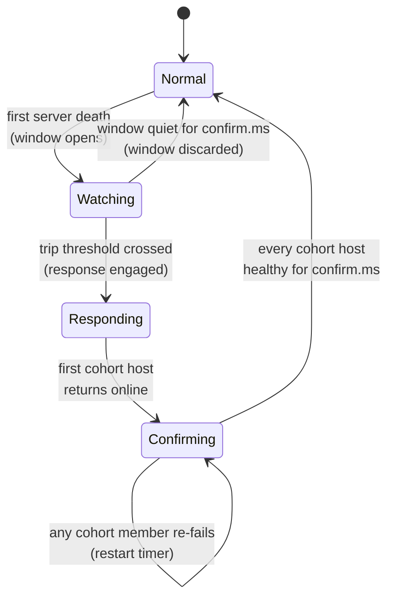

# Master-Side Correlated Failure Detector

## Scope

This document specifies the design of the new master-side correlated failure detector (CFD). The CFD's job is to recognize when a burst of RegionServer crashes is correlated by "rack" in the Hadoop model, or availability zone (AZ) in practice, and to engage a cluster-wide failure response, a configured list of actions, each implemented as a script invocation or a Java plugin, that disable some otherwise active background housekeeping and self-heal activity while triggering other self-heal or mitigation actions specific to the rack/zone loss case.

The CFD is delivered as a `MasterCoprocessor`. It can be loaded via `hbase.coprocessor.master.classes` and runs inside the master JVM with `CoreCoprocessor` privileges so it can reach `MasterServices`. The admin API for operator interaction is a Coprocessor Endpoint registered via the coprocessor's `getServices()` and invoked from clients through `Connection.getAdmin().coprocessorService()`. This packaging keeps the AZ-loss machinery out of core HMaster code while still letting it consume the same listener and lifecycle surfaces as core code does.

## Goals

### Detect AZ loss promptly

When more than a configurable threshold of RegionServers from a single rack/zone are declared dead inside a short window, engage the failure response within moments of the threshold being crossed.

### Avoid false positives on uncorrelated death

A rolling restart, a handful of bad hosts, or a wave of independent crashes spanning AZs must not trip the detector.

### Avoid flapping

Once engaged, the response is held until the rack/zone has demonstrably returned. Once disengaged, the detector does not re-engage it on the same cohort without fresh evidence.

### Be cheap

The detector runs on the master event loop and consumes the existing server-death event stream. It performs no extra heartbeats or scans. State is `O(N_RS)` in memory.

### Persist across master failover

Whatever the detector observes is reconstructable on master restart from in-memory ServerManager state and the persisted response state in ZK. A failover during a rack/zone outage does not lose the engaged failure response.

### Operator override

An operator can engage or disengage the failure response directly. The detector honors that and does not contend with operator intent.

## Non-Goals

### Not a per-RS failure detector

The existing use of ZooKeeper ephemeral nodes for server liveness tracking remains the sole source of truth for the Master's ServerManager. The CFD only *interprets* the event stream.

### Not a partial failure detector

The CFD does not try to detect *partial* AZ impairment (gray failures where some servers in the AZ keep heartbeating but degrade on the data path). Gray-failure detection is left to existing monitoring.

## Inputs and Source of Truth for the "Rack"

### Server-death events

Each `ServerCrashProcedure` submission is preceded by `ServerManager.expireServer` and signaled to registered `ServerListener`s via `serverRemoved(ServerName)`. The CFD registers as a `ServerListener` at master initialization and observes `serverRemoved` as it fires. Because `expireServer` is `synchronized` and serializes the transition online→dead, the listener sees every crash exactly once in the order the master processed it. No extra heartbeat or ZK watch is required.

### Rack/AZ name per server

The CFD calls `RackManager.getRack(ServerName)` at the moment of `serverRemoved` and caches the result in its sliding-window entry. Resolving the rack at death time, rather than at threshold-check time, makes the detector robust to the DNS-to-switch mapping changing under it (e.g., after a config reload) and avoids re-resolving the rack of a server that has already been forgotten by `ServerManager`.

The string returned by `RackManager` is treated opaquely by the CFD. Whether it names an AZ (`us-east-1a`), a physical rack (`rack-37`), or a fault domain (`fd-7`) is the deployment's choice via `hbase.util.ip.to.rack.determiner`.

The constant `RackManager.UNKNOWN_RACK` ("Unknown Rack") is treated as a sentinel. Deaths tagged with it never contribute to the trip calculation. A misconfigured cluster (no rack script) therefore never trips the detector.

## State Machine

The detector occupies one of four states, viewed cluster-wide:



`Normal` is the steady state. No tracking is active beyond the `ServerListener` registration. Memory cost is one boolean and one map reference.

`Watching` is entered on the first death after a quiet period. The detector instantiates a sliding-window structure keyed by AZ string and starts evaluating the trip condition on every subsequent `serverRemoved`. If `confirm.ms` of cluster-wide quiet elapses without the trip condition firing, the detector returns to `Normal` and discards the window.

`Responding` is entered when the trip condition fires. The detector invokes the engage lifecycle on every configured failure response action (see "Failure Response Actions" below), in the order the actions were declared, with the failure context as input. The built-in default action writes a JSON payload to ZK at `/hbase/dead-racks`; other actions may execute operator scripts, raise alerts, or trigger plugin Java code. The detector also fires its in-process `FailureResponseListener.onEngage(...)` fan-out so in-process consumers can act without waiting on the actions to complete. It records the set of `ServerName`s that contributed the dead-server count for the failure domain. That cohort is the closed set used to evaluate whether or not the rack/zone has returned to service.

`Confirming` is entered when at least one cohort member's host comes back online (a new `ServerName` reports for duty whose host matches a cohort host). The detector starts the `confirm.ms` timer. If every cohort host has reported in and remained continuously alive for `confirm.ms`, the detector invokes the disengage lifecycle on every configured action (in reverse declaration order), fires `FailureResponseListener.onDisengage(...)`, and transitions to `Normal`. If during the confirm interval *any* cohort host re-fails, the timer is restarted without leaving `Confirming`.

Hysteresis is built in. The threshold to enter `Responding` is the lost-server count. The threshold to leave is the much stricter test that every formerly-dead host has been healthy for `confirm.ms`.

## The Trip Algorithm

The CFD uses two trip checks — a threshold check and an outlier check — run on every `serverRemoved` event after the AZ-tagged entry has been added to the sliding window. The threshold check is always on and decides whether *enough* deaths have accumulated in a single failure domain; the outlier check, when enabled, gates the threshold's verdict on whether those deaths are *concentrated enough* in one domain to be distinguishable from background noise.

### Threshold (always on)

The sliding window is a per-AZ `ArrayDeque<Long>` of server death timestamps, trimmed at evaluation time to entries within `hbase.dead.rack.threshold.window.ms` of the current time. The window trips when, for any AZ, the trimmed deque size strictly exceeds `hbase.dead.rack.threshold.lost.servers`. This is O(window_size) per event, amortized O(1) per insertion. The window is sharded by AZ name to avoid cross-AZ contention on a single deque.

Reasonable operational values scale with cluster size and AZ count and should be set so that the threshold is ≥ 0.5 × N_RS_per_zone. By default, a loss of 100 servers inside 10 seconds is considered two orders of magnitude above any plausible rolling-restart rate. The detector treats the threshold as a strict greater-than comparison so that exactly N deaths is below the trip line. This keeps the threshold easy to reason about.

### Outlier check (optional, on by default)

The threshold detector alone trips on a single rack/AZ loss because the failure domain's contribution is concentrated. Under correlated cross-domain degradation, the threshold detector may not trip, depending on whether the worst-hit failure domain exceeded the specific threshold.

An additional outlier check is employed for increased assurance. Let k be the number of distinct AZs the `RackManager` knows about (excluding `UNKNOWN_RACK`), let n_i be the death count in the failure domain i within the current window, and let n = Σ n_i. The trip condition is (threshold_crossed) AND (outlier check passes). The outlier check is skipped entirely if k < 2 (the deployment has only one failure domain, so concentration is undefined) or if n < `hbase.dead.rack.outlier.min.sample` (default 30, to avoid tripping on small-sample noise). `hbase.dead.rack.outlier.enabled = false` disables the outlier check entirely for operators who want a purely threshold-based decision.

The CFD must work for both common deployments — 2-AZ (RF=2) and 3-AZ (RF=3) — and the same Σ n_i sample-size floor applies to both. The statistic itself, however, depends on k.

#### k ≥ 3: chi-squared

For k ≥ 3 the detector uses the chi-squared test from the AWS multi-AZ resilience patterns whitepaper. With n̄ = n / k:

χ² = Σ_i (n_i - n̄)² / n̄

with k − 1 degrees of freedom. The detector pre-computes the critical value for the configured `hbase.dead.rack.outlier.p` (default 0.05) using a small lookup table baked into the detector:

| degrees of freedom (k-1) | χ² critical, p=0.05 |
| --- | --- |
| 2 | 5.991 |
| 3 | 7.815 |
| 4 | 9.488 |
| 5 | 11.070 |

The check passes when χ² ≥ critical_value. For a 3-AZ deployment k − 1 = 2 and the critical value is 5.991. A single-AZ loss of 100 vs. (0, 0) gives χ² ≈ 200, well above the bar. A balanced 30+30+30 cross-AZ degradation gives χ² = 0, which correctly fails the outlier check even though the *total* count (90) is large. The chi-squared approximation is reliable when the expected per-bucket count n̄ ≥ 5. The 30-event floor at k = 3 gives n̄ = 10, comfortably above that.

#### k = 2: one-sided score test

For k = 2 the chi-squared degenerates to a single-DF test that is easy to trip on small counts and is two-sided. The detector therefore uses a one-sided score test on the worst-rack binomial proportion against the null H_0: p ≤ 1/k = 1/2. Let n_max = max(n_1, n_2) and n_min = min(n_1, n_2). The score statistic under H_0 is

z = (p̂_max − 0.5) / √(0.5 · 0.5 / n) = (n_max − n_min) / √n

The check passes when z ≥ z_{1−p}, where p is `hbase.dead.rack.outlier.p`. The detector bakes in the same fixed-p lookup:

| `hbase.dead.rack.outlier.p` | z critical (one-sided) |
| --- | --- |
| 0.10 | 1.282 |
| 0.05 | 1.645 |
| 0.025 | 1.960 |
| 0.01 | 2.326 |

Worked examples with the default p = 0.05 (z_critical = 1.645):

- 100 vs. 0 in a 2-AZ cluster: z = 100/√100 = 10.0 → passes (concentrated, response engages).
- 60 vs. 40 in a 2-AZ cluster: z = 20/√100 = 2.0 → passes (still concentrated enough above 50/50).
- 55 vs. 45 in a 2-AZ cluster: z = 10/√100 = 1.0 → fails (not distinguishable from 50/50; balanced degradation, no engage).
- 30 vs. 30 in a 2-AZ cluster: z = 0 → fails (perfectly balanced).

The score statistic has none of the chi-squared trouble at small n because its critical value is fixed and depends only on p not on k or sample size, and its one-sided form correctly ignores the symmetric case that the two-sided χ²(1) would also fire on.

#### Statistic selection

The detector picks the statistic from k at evaluation time. No operator-facing knob is needed beyond `hbase.dead.rack.outlier.p`, which feeds both lookup tables. Both statistics are gated by the same `hbase.dead.rack.outlier.min.sample` floor and the same `hbase.dead.rack.outlier.enabled` master switch.

## Failure Response Actions

When the detector enters `Responding` it walks a configured, ordered list of failure-response actions and invokes the `engage` lifecycle method on each one. When it leaves `Responding` (via the `Confirming → Normal` edge, or via the operator-initiated disengage path), it walks the same list in reverse and invokes `disengage` on each one.

This indirection lets operators decide what an AZ-loss event actually does on their cluster. The detector itself only owns the *decision* (engage now? disengage now?). The list of actions owns the *behavior*.

### Action interface

A new package `org.apache.hadoop.hbase.master.cfd.action` defines the plugin point:

```java
@InterfaceAudience.LimitedPrivate(HBaseInterfaceAudience.COPROC)
@InterfaceStability.Evolving
public interface FailureResponseAction extends Configurable, Closeable {

  /** Called once at coprocessor start. */
  void init(MasterServices master) throws IOException;

  /**
   * Engage this action. Called when the detector transitions Watching → Responding,
   * or when an operator engages the response via the admin endpoint.
   *
   * @param event  the engage event, including the failed racks, cohort,
   *               trip reason, and whether the event came from auto-detection
   *               or from the operator endpoint.
   */
  void engage(FailureResponseEvent event) throws IOException;

  /**
   * Disengage this action. Called when the detector transitions Confirming → Normal,
   * or when an operator disengages the response. The implementation should be
   * idempotent and tolerant of disengage being called without a matching engage
   * (e.g., after a master failover that already engaged the response).
   */
  void disengage(FailureResponseEvent event) throws IOException;
}

public final class FailureResponseEvent {
  public enum Trigger { AUTO_DETECTED, OPERATOR, MASTER_FAILOVER_REPLAY }
  public Set<String> failedRacks() { ... }
  public List<ServerName> cohort() { ... }       // dead-incarnation ServerNames; empty for OPERATOR
  public TripReason tripReason() { ... }         // null for OPERATOR
  public String setBy() { ... }                  // "master:cfd" or "operator:<user>"
  public long firstObservedMs() { ... }
  public Trigger trigger() { ... }
  public long generation() { ... }
}
```

The interface is `Configurable` so plugins can read their own keys out of the master `Configuration` at `init` time, and `Closeable` so the detector can release plugin resources at coprocessor shutdown.

`engage` and `disengage` are called from the detector's action executor. Actions run sequentially, not in parallel. An action that hangs blocks subsequent actions. A per-action timeout (`hbase.failure.response.action.timeout.ms`, default 30 s) bounds the wait, after which the executor logs and proceeds to the next action. This trades worst-case engage latency for ordering guarantees the actions can rely on.

If an action's `engage` throws, the detector records the failure under `correlatedFailureDetector.actionFailures{action}` and proceeds to the next action. The detector's own state machine still transitions to `Responding`. The operator can re-run a failed action by disengaging and re-engaging via the admin endpoint. Partial-engage on master crash is handled by the master-failover replay path. The new master walks the configured action list and calls `engage` on every action with `trigger = MASTER_FAILOVER_REPLAY`, expecting idempotent behavior.

### Built-in actions

Three built-in implementations ship with the CFD.

**`ZooKeeperSignalAction`** (default; class `org.apache.hadoop.hbase.master.cfd.action.ZooKeeperSignalAction`). Writes the JSON failure-response state to `/hbase/dead-racks` on `engage` and clears (or rewrites without the relevant rack) on `disengage`. This is the action that every other component in the cluster reads to learn whether a failure response is active. The wire format is documented in "Persisting the Response State in ZooKeeper" below.

**`ScriptAction`** (class `org.apache.hadoop.hbase.master.cfd.action.ScriptAction`). Executes an operator-supplied shell script on the master host, passing the failure-response state as command-line arguments and as a JSON document on stdin. Exit code 0 is success. Non-zero is logged at WARN. The script path comes from `hbase.failure.response.script.path`, with a per-invocation timeout from `hbase.failure.response.script.timeout.ms` (default 20 s). Standard output and stderr are captured and logged. The script runs with the master's identity and working directory. Operators are expected to use `sudo` inside the script for any privileged operations.

**`MetricsAndLogAction`** (class `org.apache.hadoop.hbase.master.cfd.action.MetricsAndLogAction`). Records an audit-log entry at WARN with the full failure-response state and bumps the master-level metrics described under "Observability" below. This action is loaded implicitly.

### Configuration

Operators select and order their action list via:

```xml
<!-- Comma-separated, ordered list of FailureResponseAction implementations.
     Default writes the ZK signal only; add ScriptAction to invoke a script. -->
<property>
  <name>hbase.failure.response.actions</name>
  <value>org.apache.hadoop.hbase.master.cfd.action.ZooKeeperSignalAction</value>
</property>

<!-- Per-action wallclock timeout. -->
<property>
  <name>hbase.failure.response.action.timeout.ms</name>
  <value>30000</value>
</property>

<!-- ScriptAction: path to the operator script. -->
<property>
  <name>hbase.failure.response.script.path</name>
  <value>/etc/hbase/failure-response.sh</value>
</property>
<property>
  <name>hbase.failure.response.script.timeout.ms</name>
  <value>20000</value>
</property>
```

A typical AZ-loss-tolerant deployment enables both built-in actions:

```xml
<property>
  <name>hbase.failure.response.actions</name>
  <value>
    org.apache.hadoop.hbase.master.cfd.action.ZooKeeperSignalAction,
    org.apache.hadoop.hbase.master.cfd.action.ScriptAction
  </value>
</property>
```

so that on rack/zone loss the cluster *both* publishes the ZK signal that the per-design seam paths consume *and* invokes the operator's escalation script (which might page on-call, snapshot HBase state to a side bucket, or kick off a regional DR failover).

## Persisting the Response State in ZooKeeper

The cluster-wide response state lives at the new znode `/hbase/dead-racks`. The path constant is added to `ZNodePaths`, initialized from `zookeeper.znode.deadracks` (default `dead-racks`). The znode is persistent so the state will survive master crashes. It is created (and left empty) by `ZKWatcher.createBaseZNodes()` alongside the other base znodes.

An empty or absent znode means "no failure response engaged". A populated znode means a failure response is currently engaged for the listed racks.

The data format is the JSON-encoded payload written by the built-in `ZooKeeperSignalAction`:

```json
{
  "version": 1,
  "dead_rack": ["us-east-1a"],
  "first_observed_ms": 1730000000000,
  "set_by": "master:cfd",
  "trip_reason": {
    "threshold_lost_servers": 100,
    "threshold_window_ms": 10000,
    "observed_in_az": 127,
    "chi_squared": 254.0,
    "chi_squared_critical": 5.991
  },
  "cohort": ["host-1.az1:16020,1730000000000", "..."]
}
```

The JSON format is forward-compatible. Clients are expecterd to ignore unknown keys. Encoding uses the same PBMagicPrefix convention as other persisted ZK data.

JSON is preferred over protobuf for this znode because the payload is small and human-readable in `zk-cli`, which is useful in an on-call context.

### Master writes, RegionServers and other masters watch

The active master is the only writer. RegionServers and other masters watch the znode through a new `DeadRacksTracker extends ZKListener` modeled on `MasterMaintenanceModeTracker`.

```java
public class DeadRacksTracker extends ZKListener {
  private final AtomicReference<DeadRacksSnapshot> snapshot;
  // ...
  public Set<String> deadRacks() { return snapshot.get().deadRacks; }
  public boolean isFailureResponseActive(String rack) {
    return snapshot.get().contains(rack);
  }
}
```

A single watch is set on `/hbase/dead-racks` using `ZKUtil.getDataAndWatch`. On `nodeCreated` / `nodeDataChanged` /
`nodeDeleted`, the tracker re-reads the znode, decodes the JSON, swaps the snapshot atomically, and notifies registered local `FailureResponseListener`s.

### Master failover

With rack/zone-affine placement and three failure domains, there is a non-trivial probability that the active master and a third of the RegionServers share a failure domain. A loss that takes out those RSes also
takes out the master. The cluster sits without a master until `ActiveMasterManager` promotes a backup master in a surviving domain, and the new master must reconstruct enough state to act correctly on the in-progress loss events it inherits.

`DeadRacksTracker` is the reconstruction point. On startup, the active master's tracker reads `/hbase/dead-racks` before it accepts any new server-death events. If the previous master had engaged a failure response before dying, the new master inherits `Responding` with the persisted `cohort`, replays `engage` on every configured action with `trigger = MASTER_FAILOVER_REPLAY` (idempotent by contract), and does not need to derive again the trip condition. If the previous master died mid-event before engaging, the znode is empty or missing and the new master rebuilds the window from `DeadServer` as described below. Either way, the detector's behavior under master failover is the same
as for any other state the master carries across failover.

#### Failover during `Watching`

The previous master may have observed some deaths but had not tripped. The new master starts in `Normal` and re-derives the window from the `DeadServer` map populated by `RegionServerTracker.upgrade`. The death timestamps in `DeadServer` are real. The window is trimmed by current time. The master evaluates the threshold once at end-of-bootstrap. If the threshold-based condition was already true, the master engages the failure response at that point.

#### Failover during `Confirming`

The new master initializes to `Responding` from the persisted znode and re-derives the cohort from the stored `cohort` field. It then re-evaluates whether every cohort member is currently online (using `ServerManager.isServerKnownAndOnline`) and either remains in `Responding` (some cohort members still missing) or starts a fresh `Confirming` timer.

## Packaging as a Master Coprocessor

The CFD is a `MasterCoprocessor` housed in a new module
`hbase-server/src/main/java/org/apache/hadoop/hbase/master/coprocessor/CorrelatedFailureDetectorEndpoint.java`,
modeled on `RSGroupAdminEndpoint`:

```java
@CoreCoprocessor
@InterfaceAudience.Private
public class CorrelatedFailureDetectorEndpoint
    implements MasterCoprocessor, MasterObserver {

  private MasterServices master;
  private CorrelatedFailureDetector detector;
  private CorrelatedFailureDetectorService endpointService;

  @Override
  public void start(CoprocessorEnvironment env) throws IOException {
    if (!(env instanceof HasMasterServices)) {
      throw new IOException("CFD endpoint requires MasterCoprocessorEnvironment");
    }
    this.master = ((HasMasterServices) env).getMasterServices();
    this.detector = new CorrelatedFailureDetector(env.getConfiguration(),
        master.getRackManager(), master.getServerManager(),
        master.getZooKeeper());
    this.endpointService = new CorrelatedFailureDetectorService(detector);
  }

  @Override
  public void stop(CoprocessorEnvironment env) {
    if (detector != null) detector.shutdown();
  }

  @Override
  public Optional<MasterObserver> getMasterObserver() {
    return Optional.of(this);
  }

  @Override
  public Iterable<Service> getServices() {
    return Collections.singleton(endpointService);
  }

  // MasterObserver hook: register the detector as a ServerListener only
  // after the active master has finished initialization, so that ServerManager
  // exists and rack resolution is available.
  @Override
  public void postStartMaster(ObserverContext<MasterCoprocessorEnvironment> ctx) {
    master.getServerManager().registerListener(detector);
    detector.start();
  }
}
```

The `@CoreCoprocessor` annotation grants the endpoint access to a `MasterEnvironmentForCoreCoprocessors`, which in turn implements `HasMasterServices`.

### Loading the coprocessor

The endpoint is loaded statically through the standard master coprocessor classpath property:

```xml
<property>
  <name>hbase.coprocessor.master.classes</name>
  <value>org.apache.hadoop.hbase.master.coprocessor.CorrelatedFailureDetectorEndpoint</value>
</property>
```

Operators who want to ship the CFD but disable it without removing the class set `hbase.dead.rack.detector.enabled = false` and the endpoint's `start()` short-circuits without registering the listener. The endpoint's RPC surface is still installed so the admin API remains callable. Operator-initiated failure response continues to work even when auto-detection is off.

## Admin API: Coprocessor Endpoint

The admin surface is a protobuf coprocessor endpoint registered through `CorrelatedFailureDetectorEndpoint.getServices()`. The service is declared in a new proto file `hbase-protocol-shaded/src/main/protobuf/server/master/CorrelatedFailureDetector.proto`:

```protobuf
syntax = "proto2";
package hbase.pb;

option java_package = "org.apache.hadoop.hbase.shaded.protobuf.generated";
option java_outer_classname = "CorrelatedFailureDetectorProtos";
option java_generic_services = true;
option java_generate_equals_and_hash = true;
option optimize_for = SPEED;

message FailureResponseState {
  repeated string failed_racks = 1;       // racks the response is engaged for
  optional int64  first_observed_ms = 2;
  optional string set_by = 3;
  repeated string cohort = 4;             // ServerName strings; matched by (host,port)
  optional string detector_state = 5;     // "Normal"|"Watching"|"Responding"|"Confirming"
  optional int64  generation = 6;         // monotonic; bumped on every write
}

message EngageFailureResponseRequest {
  repeated string failed_racks = 1;       // racks to engage the response for
  optional string reason = 2;             // operator-supplied note
  optional int64  expected_generation = 3; // optional CAS guard
}
message EngageFailureResponseResponse {
  required FailureResponseState state = 1;
}

message DisengageFailureResponseRequest {
  repeated string failed_racks = 1;       // racks to disengage; empty = disengage all
  optional int64  expected_generation = 2;
}
message DisengageFailureResponseResponse {
  required FailureResponseState state = 1;
}

message GetFailureResponseStateRequest {}
message GetFailureResponseStateResponse {
  required FailureResponseState state = 1;
}

message OverrideCohortRequest {
  required string rack = 1;
  repeated string remove_hosts = 2;       // shrink the cohort
  repeated string add_hosts = 3;          // explicit additions (rare)
}
message OverrideCohortResponse {
  required FailureResponseState state = 1;
}

service CorrelatedFailureDetectorService {
  rpc EngageFailureResponse    (EngageFailureResponseRequest)    returns (EngageFailureResponseResponse);
  rpc DisengageFailureResponse (DisengageFailureResponseRequest) returns (DisengageFailureResponseResponse);
  rpc GetFailureResponseState  (GetFailureResponseStateRequest)  returns (GetFailureResponseStateResponse);
  rpc OverrideCohort           (OverrideCohortRequest)           returns (OverrideCohortResponse);
}
```

Server-side handlers live in `CorrelatedFailureDetectorService extends CorrelatedFailureDetectorProtos.CorrelatedFailureDetectorService`, injected with the in-process `CorrelatedFailureDetector` reference.

### Authorization

Authorization is enforced through the existing `AccessController` plumbing. The endpoint declares its operations under `Action.ADMIN` in its handler bodies, exactly as `MultiRowMutationEndpoint` declares `Action.WRITE` on mutate calls. A cluster with the `AccessController` coprocessor installed will reject endpoint calls from non-admin users with `AccessDeniedException`. A cluster without it gets the historical "no security" behavior.

### Client invocation

Clients invoke the endpoint through `Admin.coprocessorService()`, which returns a `CoprocessorRpcChannel` pointed at the master:

```java
try (Connection conn = ConnectionFactory.createConnection(conf);
     Admin admin = conn.getAdmin()) {
  CoprocessorRpcChannel ch = admin.coprocessorService();
  CorrelatedFailureDetectorService.BlockingInterface stub =
      CorrelatedFailureDetectorService.newBlockingStub(ch);

  // Read current state
  FailureResponseState state = stub.getFailureResponseState(null,
      GetFailureResponseStateRequest.getDefaultInstance()).getState();

  // Engage failure response for an AZ (planned drill / DR failover)
  stub.engageFailureResponse(null, EngageFailureResponseRequest.newBuilder()
      .addFailedRacks("us-east-1a")
      .setReason("DR drill 2026-Q2")
      .setExpectedGeneration(state.getGeneration())
      .build());

  // Disengage after the drill
  stub.disengageFailureResponse(null, DisengageFailureResponseRequest.newBuilder()
      .addFailedRacks("us-east-1a")
      .build());
}
```

The shell adds a thin `cfd` command set that wraps this service:

```
hbase> cfd_status
hbase> cfd_engage 'us-east-1a', REASON => 'DR drill'
hbase> cfd_disengage 'us-east-1a'
hbase> cfd_override_cohort 'us-east-1a', REMOVE => ['host-5:16020', 'host-12:16020']
```

Async clients use `AsyncAdmin.coprocessorService(Function, ServerName)` in the same way.

### Composition with auto-detected failure response

If the detector is in `Responding` for rack `A` (CFD-engaged, cohort known) and an operator calls `EngageFailureResponse(racks=[B])`, the merge behavior writes the union (`{A, B}`) into the persisted state. The cohort still applies only to rack `A`. If the operator calls `DisengageFailureResponse(racks=[B])`, only rack `A` remains and the cohort is unaffected.

If the operator calls `DisengageFailureResponse(racks=[A])` while the detector is in `Confirming` for `A`, the detector treats this as an explicit override. It invokes `disengage` on every configured action for rack `A`, cancels the confirmation timer, drops the cohort, and transitions to `Normal` (possibly back to `Responding` for any other still-active rack).

`OverrideCohort` is provided specifically for the partial-recovery case described above. The operator passes the hosts that will never return (e.g. decommissioned, or replaced with new hostnames). The detector removes them from the in-memory cohort, persists the change, and re-evaluates the confirm condition with the smaller cohort. This is the supported alternative to setting `hbase.dead.rack.recovery.cohort.shrink.allowed = true` cluster-wide.

## Recovery Confirmation: When to Disengage

Disengaging the failure response must obey the same correctness criterion as engaging it. The cluster has to be safe at the moment of the transition. Reset-to-`Normal` is allowed when, and only when, every member of the cohort has been continuously online for `hbase.dead.rack.recovery.confirm.ms` (default 60 s).

The cohort tracker is a map `(hostname, port) → ServerLivenessTracker` keyed on the host:port pair of each dead cohort `ServerName`. The tracker holds:

- `firstSeenSinceFailure: Long` (null until cohort member returns)
- `lastSeenAlive: Long`

When `serverAdded` fires for a `ServerName` whose `(hostname, port)` matches a cohort entry (the `startCode` will differ — the returning RS is a fresh incarnation), the tracker sets `firstSeenSinceFailure = now`. The detector schedules a periodic confirmation check that iterates the cohort and invokes `disengage` on every configured action when, for every cohort entry, `now - firstSeenSinceFailure ≥ confirm.ms` and the host is still known online via `ServerManager.isServerKnownAndOnline`.

If during the confirmation window any cohort host *re*-fails, the detector resets `firstSeenSinceFailure` to null for that entry and the timer effectively restarts for the cohort as a whole.

### Cohort storage and `startCode`-insensitive matching

Cohort entries are stored as full `ServerName` strings. This keeps the persisted JSON consistent with everything else the operator sees in the master's logs and metrics, and avoids inventing a parallel host-only identifier just for this one znode.

Matching across return, however, is `startCode`-insensitive. A `ServerName`'s `startCode` changes every time the RS process restarts, so a recovered host comes back under a fresh `ServerName`. The detector treats two `ServerName`s with the same `(hostname, port)` tuple as the same cohort entry, regardless of `startCode`. When `serverAdded` fires for a `ServerName` whose `(hostname, port)` matches a cohort entry, the detector marks that entry's `firstSeenSinceFailure`, even though the `startCode` differs from the `ServerName` recorded in the cohort. The persisted form preserves the original `ServerName` (including the dead incarnation's `startCode`).

### Partial recovery

If, say, 95 of the 100 cohort hosts come back online and the remaining 5 are permanently lost (e.g., decommissioned, or replaced with new hardware on new hostnames), the cohort never fully clears, and the failure response stays engaged forever in the strict reading. The operator can handle this through the coprocessor endpoint, either by calling `OverrideCohort` with the lost hosts in `remove_hosts` (the detector then re-evaluates the confirm condition with the smaller cohort), or by calling `DisengageFailureResponse` to clear the rack outright. The detector also exposes `hbase.dead.rack.recovery.cohort.shrink.allowed = false` (default), which when true allows a partial-cohort-return path without operator intervention. In that case, after `recovery.confirm.ms` elapsed with some members back, the detector logs the remaining cohort members and WARNs the operator.

## Configuration

The CFD's configuration keys are introduced in `hbase-default.xml`:

```xml
<!-- Trip condition: more than N RSs from one failure domain declared dead
     within a W-millisecond window. -->
<property>
  <name>hbase.dead.rack.threshold.lost.servers</name>
  <value>100</value>
</property>
<property>
  <name>hbase.dead.rack.threshold.window.ms</name>
  <value>10000</value>
</property>

<!-- Optional outlier check across failure domains. Disable to revert to
     a pure threshold detector. The detector picks the statistic from
     the live rack count k: chi-squared with k-1 df for k >= 3, and a
     one-sided score test on the worst rack's share for k = 2. -->
<property>
  <name>hbase.dead.rack.outlier.enabled</name>
  <value>true</value>
</property>
<!-- Significance level. Feeds both the chi-squared and the k=2 score
     test critical-value lookups. -->
<property>
  <name>hbase.dead.rack.outlier.p</name>
  <value>0.05</value>
</property>
<!-- Minimum total death count Sigma n_i in the window before the
     outlier check runs. Below this floor the trip is deferred to the
     threshold check alone. Applies to both statistics. -->
<property>
  <name>hbase.dead.rack.outlier.min.sample</name>
  <value>30</value>
</property>

<!-- Recovery confirmation: hold the failure response engaged until every
     cohort host has been continuously alive for this long. -->
<property>
  <name>hbase.dead.rack.recovery.confirm.ms</name>
  <value>60000</value>
</property>

<!-- Allow the failure response to disengage with a partial-cohort return. -->
<property>
  <name>hbase.dead.rack.recovery.cohort.shrink.allowed</name>
  <value>false</value>
</property>

<!-- ZK znode path where the failure response state is persisted by the
     built-in ZooKeeperSignalAction. -->
<property>
  <name>zookeeper.znode.deadracks</name>
  <value>dead-racks</value>
</property>
```

The action-related keys (`hbase.failure.response.actions`, `hbase.failure.response.action.timeout.ms`, `hbase.failure.response.script.path`, `hbase.failure.response.script.timeout.ms`) are documented under "Failure Response Actions" above.

## Observability

The CFD exposes the following metrics through `MetricsMaster`:

| Metric | Type | Meaning |
| --- | --- | --- |
| `correlatedFailureDetector.state` | Gauge | Enum: 0=Normal, 1=Watching, 2=Responding, 3=Confirming |
| `correlatedFailureDetector.deadRackCount` | Gauge | Cardinality of `dead_racks` |
| `correlatedFailureDetector.engageCount` | Counter | Total failure responses engaged since master start |
| `correlatedFailureDetector.disengageCount` | Counter | Total failure responses disengaged since master start |
| `correlatedFailureDetector.actionFailures{action}` | Counter | Per-action failures during engage/disengage |
| `correlatedFailureDetector.unknownRacks` | Counter | Total number of unknown racks encountered (should be 0) |

In addition, every state transition logs at INFO with a summary message indicating the detection condition and any actions invoked.

## Operator Interaction

All operator interaction with the CFD goes through the coprocessor endpoint described in "Admin API: Coprocessor Endpoint" above. The endpoint exposes four operations: read current state, engage the failure response for one or more racks, disengage the failure response for one or more racks, and override the cohort to enable recovery from a partial-return scenario.

Operator-engaged responses are persisted with the same JSON payload as auto-detected responses but with `set_by = "operator:<userId>"` and no `cohort`. The detector invokes the same `engage` lifecycle on every configured action, with `trigger = OPERATOR`, so an operator-engaged response runs the same scripts and plugins as an auto-detected one. Consumers reading the response state from `DeadRacksTracker` cannot tell an operator-engaged response from an auto-detected one (and should not need to). The detector does not schedule a confirm-disengage timer for operator-engaged racks. Disengaging an operator-engaged response is also an operator action.

## Edge Cases and Failure Modes

### Misclassified rack

If `RackManager` returns `UNKNOWN_RACK` for some servers, perhaps because of a misconfigured DNS-to-switch script, those deaths are dropped from the sliding window. The detector will under-trip rather than over-trip. A metric
`correlatedFailureDetector.unknownRacks` is incremented to make this visible.

### Stale rack mapping after live config reload

If the operator changes `hbase.util.ip.to.rack.determiner` and reloads the configuration, server-death events tagged with the old mapping remain in the window until they age out. This is acceptable because the window is short (10 s default) and because the tag was correct at the time of death. Relabeling already recorded events would only matter if the failure domain boundaries themselves moved.

### Server returns immediately (transient ZK partition)

The existing path (`RegionServerTracker.processAsActiveMaster` → `expireServer` → SCP) declares the server dead the moment its ephemeral node deletes. If the network blip is brief, the server comes back under a new `startCode` and the master treats it as a fresh incarnation. The CFD has already counted the original death in the window. If `hbase.dead.rack.threshold.lost.servers` (default 100) is not exceeded, the window simply ages out without tripping, and the returned server is irrelevant to the detector. If the threshold is exceeded, the failure response is correctly engaged. The returned server enters the `Confirming` cohort once recovery completes.

A transient blip on 100 RSs in a single rack/zone is observationally indistinguishable from a real loss of the failure domain at the moment the response is engaged, and behaving conservatively (engage the response, then unwind on confirm) is preferable to behaving aggressively (eager replacement, then undo).

### `DeadServer` evictions and the window

`DeadServer` does not currently age out entries on its own. Entries are removed only by `cleanPreviousInstance` when a new RS reports under the same host:port or by an explicit `removeDeadServer`. The CFD does not depend on `DeadServer` for window management. Its own window is sliding and independent. The CFD only consults `DeadServer` during master-failover bootstrap to populate the initial window.

### Multi-zone symmetric loss

If two racks/zones are lost simultaneously, the CFD trips on the worse-hit domain first, engages the failure response for it, and then trips a second time on the second domain. The second trip writes the union into `failed_racks` and re-invokes `engage` on every action for the newly added rack (already-engaged racks are not re-engaged). If three racks/zones are lost simultaneously, there has been a nuclear blast or may as well have been, there is no live code, nothing to observe or respond, and this case is out of scope of this design.

### Cohort entries that never return (lost hardware)

See "Partial recovery" above. The strict default holds the failure response engaged indefinitely, with the operator path available to override.

### Lots of deaths in `UNKNOWN_RACK`

If the rack script is broken (`UNKNOWN_RACK` for everything), the detector cannot trip and the cluster reverts to today's eager-recovery behavior. The metric `unknownRackDeaths` is a load-bearing alert.

## Testing Strategy

### Unit tests

The detector is a pure state machine on top of a clock-injectable sliding window, so most of its surface area is testable without a cluster:

- `TestCfdThresholdSingleRackTrip`: feed a single-rack burst that crosses `hbase.dead.rack.threshold.lost.servers` inside `hbase.dead.rack.threshold.window.ms` and verify the threshold check trips.
- `TestCfdThresholdCrossRackNoTrip`: feed a cross-rack burst whose total exceeds the threshold but whose worst-hit rack does not, and verify the threshold check does not trip.
- `TestCfdThresholdSlowRollingNoTrip`: feed deaths at a per-rack rate below the threshold over a window long enough that entries age out faster than they accumulate, and verify the threshold check never trips.
- `TestCfdOutlierBalancedVeto`: in a 3-AZ topology trip the threshold check on a balanced cross-rack degradation, and verify the chi-squared check vetoes the trip so it does not propagate.
- `TestCfdOutlierConcentratedPassThrough`: in a 3-AZ topology trip the threshold check on a single-rack concentrated burst, and verify chi-squared sees it as an outlier and the trip propagates.
- `TestCfdOutlierTwoAzConcentratedPassThrough`: in a 2-AZ topology trip the threshold check on a concentrated single-AZ burst (100 vs. 0), and verify the score test produces z well above the p=0.05 critical and the trip propagates.
- `TestCfdOutlierTwoAzBalancedVeto`: in a 2-AZ topology trip the threshold check on a near-balanced burst (55 vs. 45), and verify the score test produces z below the p=0.05 critical and the trip is vetoed.
- `TestCfdOutlierTwoAzModerateConcentrationPassThrough`: in a 2-AZ topology feed (60 vs. 40), and verify the score test produces z = 2.0 and the trip propagates at default p = 0.05.
- `TestCfdOutlierStatisticSelection`: configure the detector with a `RackManager` returning k = 2 racks then k = 3 racks, and verify the detector picks the score test in the first case and chi-squared in the second.
- `TestCfdOutlierSmallSampleSkip`: feed a burst below `hbase.dead.rack.outlier.min.sample` in both 2-AZ and 3-AZ topologies and verify the outlier check is skipped, deferring entirely to the threshold result.
- `TestCfdConfirmTimerFires`: walk the cohort into the alive set and hold it there for `confirm.ms`, and verify the detector invokes `disengage` only after every cohort member has been continuously online for `confirm.ms`.
- `TestCfdConfirmTimerRestartsOnReFail`: walk the cohort into the alive set, then fail one member mid-window, and verify the confirm timer restarts for the cohort as a whole.
- `TestCfdFailoverDuringWatching`: simulate a master crash with a partial window written to `DeadServer` but no engaged response in ZK, restart the master, and verify the new master re-derives the window from the `DeadServer` map populated by `RegionServerTracker.upgrade`.
- `TestCfdFailoverDuringResponding`: simulate a master crash with the failure response engaged in ZK, restart the master, and verify the new master re-derives the cohort from ZK and replays `engage` on every configured action with `trigger = MASTER_FAILOVER_REPLAY`.
- `TestCfdOperatorAutoCompose`: engage the response via the operator endpoint on rack `A`, trip the detector on rack `B`, and verify the persisted state is the union `{A, B}` with the cohort still scoped to rack `B`.
- `TestCfdUnknownRackExclusion`: feed deaths tagged `UNKNOWN_RACK` and verify they contribute to neither the threshold check nor the outlier check.
- `TestCfdActionLifecycleOrder`: configure three test actions and verify `engage` is called in declared order on entry to `Responding` and `disengage` is called in reverse order on exit.
- `TestCfdActionTimeout`: configure an action whose `engage` sleeps beyond `hbase.failure.response.action.timeout.ms`, and verify the executor logs and proceeds to the next action.
- `TestCfdActionExceptionDoesNotBlock`: configure an action whose `engage` throws, and verify `correlatedFailureDetector.actionFailures{action}` is incremented and subsequent actions in the list still run.

### Integration tests

Built on `HBaseTestingUtility` (mini-cluster with simulated rack assignments via a test `DNSToSwitchMapping` and a test `FailureResponseAction` recording invocations):

- `TestCorrelatedFailureDetectorAZLoss`: kill `N_RS_per_AZ` RSes in one AZ in rapid succession and verify the response engages, the `DeadRacksTracker` on every surviving RS sees the change, and the configured actions were called.
- `TestCorrelatedFailureDetectorRollingRestart`: kill RSes one at a time across AZs at 60 s/host and verify the response never engages.
- `TestCorrelatedFailureDetectorFailoverDuringResponse`: engage the response, fail over the master, and verify the new master replays `engage` on every action with `MASTER_FAILOVER_REPLAY` and reconstructs `Responding` from ZK.
- `TestCorrelatedFailureDetectorPartialReturn`: engage the response, return most but not all of the cohort, and verify the response stays engaged.
- `TestCorrelatedFailureDetectorScriptAction`: configure `ScriptAction` with a test script and verify exit code,  capture, timeout handling, and engage/disengage argument passing.
