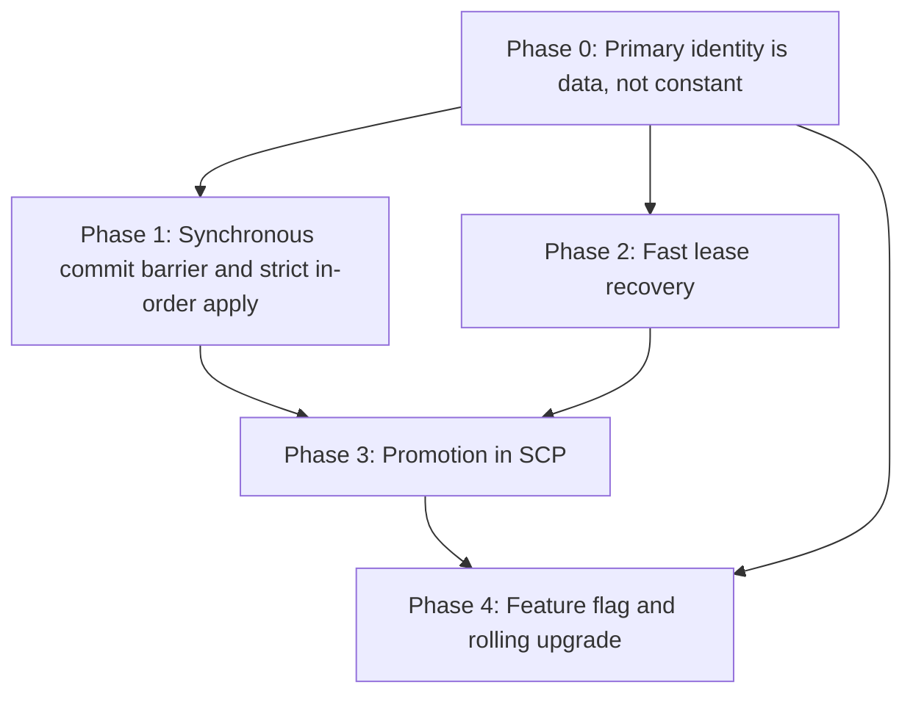
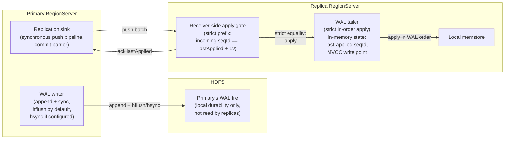
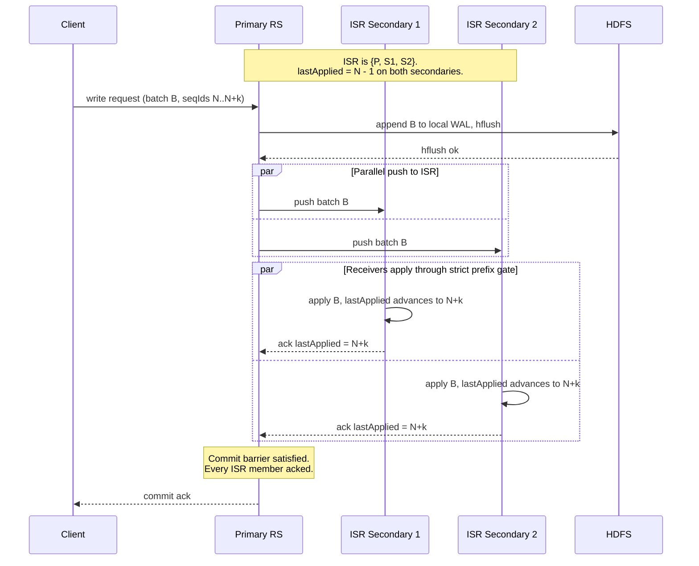
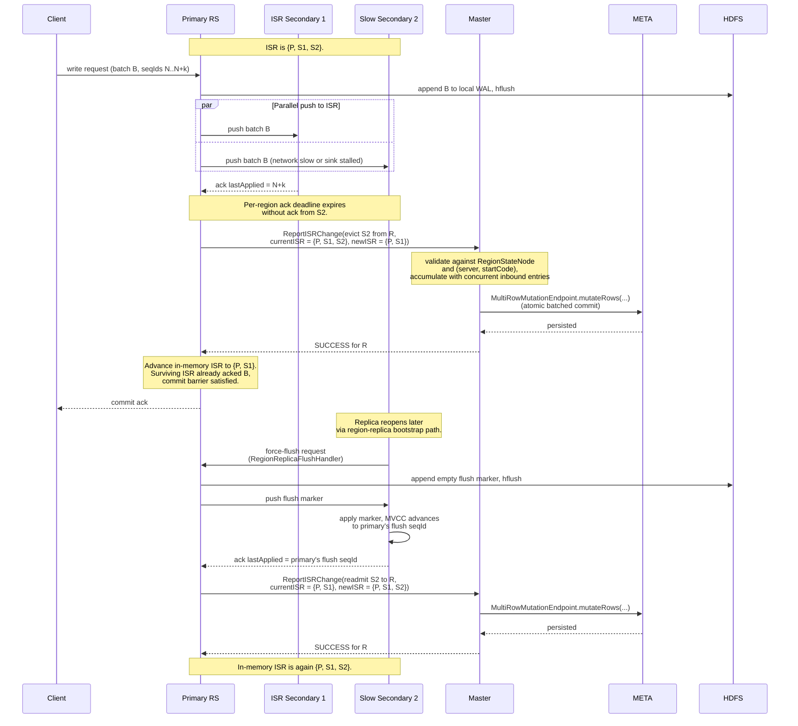
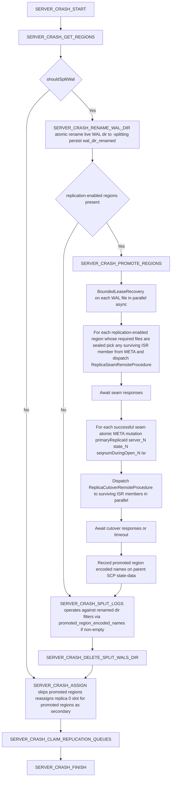
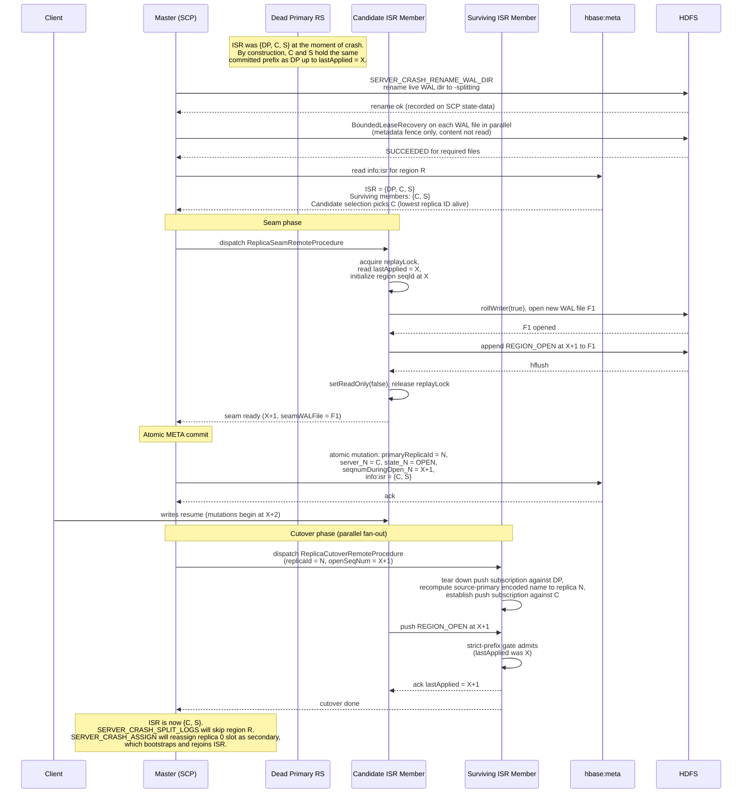

# Promotable Consistent Replica Set

## Overview

This document presents a design that takes HBase's existing timeline-consistent region replicas and turns them into a synchronously-replicated, in-sync set that can be promoted in place on primary failure.

Each region defines an *in-sync replica set* (ISR) consisting of the primary and every secondary that has acknowledged the primary's most recent write batch within a per-region deadline. The primary does not commit a write to the client until every member of the ISR has acked it, and a secondary that fails to ack within the deadline is evicted from the ISR before any subsequent write is committed. Every committed write is therefore by construction durable on every member of the ISR at the moment the client sees commit, and every ISR member holds the committed prefix in lockstep with the primary. A read against any ISR member returns data consistent with a read against the primary at the same commit point, in contrast to today's timeline-consistent replicas, which may lag arbitrarily behind. On primary failure, any surviving member of the ISR can be promoted to primary in place, with no catch-up read against HDFS and no distributed WAL split for promoted regions.

The design has four closely linked goals:

1. **Promote in place.** When a primary fails, promote a read-only replica to read-write primary instead of waiting for a fresh assignment that recovers a cold region from durable storage.
2. **Bypass distributed split.** Skip the time- and IO-expensive distributed WAL split and `recovered.edits` replay in the common case. Those steps are what make today's failover slow.
3. **Restore writes early.** Pick a promotion candidate from the ISR, install it as the new primary, and step out of the way before any expensive recovery work begins. Data-path availability is restored on the order of an HDFS lease recovery rather than on the order of a full distributed split.
4. **Preserve the durability and freshness contract.** The ISR's commit-on-ack invariant guarantees that every client-acknowledged write is durable on at least every member of the ISR at the moment the client sees commit. Anything visible to a client before the primary died is visible to the new primary at the moment it accepts new writes.

## Current Timeline-Consistent Replica Architecture

```
           client writes
                │
                ▼
   ┌────────────────────┐    best-effort   ┌────────────────────┐
   │  Primary (R/W)     │──── push ───────►│  Replica (R/O)     │
   │  Memstore (live)   │   async, no      │  Memstore (lagged) │
   │       │            │   freshness      └────────────────────┘
   │       │ WAL sync   │   contract       ┌────────────────────┐
   │       │            │──── push ───────►│  Replica (R/O)     │
   │       ▼            │                  │  Memstore (lagged) │
   └───────┼────────────┘                  └────────────────────┘
           │
           ▼
   ┌────────────────────────────────┐    Replicas do not read HDFS
   │  HDFS WAL  (per RegionServer)  │    for freshness. The primary's
   │  HFiles    (shared)            │    push is their only source.
   └────────────────────────────────┘

   Failover today: Primary dies → SCP runs HDFS lease recovery +
   distributed WAL split + recovered.edits replay → default replica reassigned and
   opens with replay (seconds to minutes). Replicas stay read-only throughout the
   outage.
```

HBase region replicas today ship WAL edits from the primary to each secondary via per-region RPC, asynchronously and with no commit-time coordination between primary and replicas. Several properties of this pipeline make promotion impossible under the current design. Edits are pushed by the primary. If the primary dies before pushing a batch, the secondaries simply do not have it. The primary's replication sink processes edits in MVCC completion order and bails out on backpressure rather than reordering, so a secondary that does receive a batch sees it in WAL order. What the pipeline lacks is a durability proof that ties client acknowledgment to secondary apply (acknowledgment is gated only on WAL sync to HDFS, and the per-replica RPC is dispatched only after the WAL sync returns) and any freshness guarantee on how far the secondary has fallen behind. Worse, the push pipeline may silently drop pending entries, so an edit can be acked, durable in the WAL on HDFS, and never delivered to any replica, even when the primary stays alive.

Secondary memstore lag is therefore unbounded under load, network partition, or push-pipeline retries. The practical consequence is that two replicas of the same region can sit at completely different points, with no protocol to choose the most current one and no mechanism to install it as the new primary. Replica region definitions are flagged read-only, and the region-open path refuses to serve writes for non-default replica IDs. On primary loss the `ServerCrashProcedure` (SCP) runs the dead RegionServer's WAL through distributed log splitting, writes per-region `recovered.edits`, reassigns the default replica to a new RegionServer, and opens it with recovered-edits replay. All of this takes seconds to minutes.

For secondaries to become *promotable* in a way that meaningfully improves availability, three things have to change:

1. The replica's view of the primary's WAL must be precise enough to prove that it has applied every edit the old primary durably wrote.
2. There must be a protocol for the master to pick the most-up-to-date secondary as the candidate, and for that secondary to reach a quiescent point that proves catch-up to the primary's last acknowledged write.
3. SCP must be restructured so that promotion runs out-of-band from distributed log splitting. The promotion fast path must complete before splitting work is dispatched, returning the data path to read-write quickly. 

## Constraints

### Write-Ahead Logging

The HBase WAL on HDFS remains the primary's local durability anchor. Before a write is acked to the client, the primary calls into HDFS to ensure the WAL append has reached every DataNode in the pipeline.

When `hbase.wal.hsync=false`, the default, the WAL writer calls `hflush`. `hflush` ensures the bytes have been transmitted to every DataNode in the pipeline and are visible to any other reader, but it does not require the DataNodes to flush the data to disk before returning. The bytes live in DataNode page cache, durable against process crash, but not against coincident power loss. Under default settings a correlated power-loss event involving the primary RegionServer and one or more of its WAL pipeline DataNodes can leave acknowledged edits unrecoverable. When `hbase.wal.hsync=true`, the WAL writer calls `hsync` on every batch, which on HDFS forces an `fsync` on each DataNode in the pipeline. Once the call returns, the bytes are durable across coincident power loss of the primary RegionServer and the entire pipeline.

The write-path durability tier the operator chooses (`hflush` vs `hsync`) governs the durability of the primary's local WAL against coincident power loss, exactly as it does today. The ISR commit barrier composes with that tier rather than replacing it. With `hsync` enabled, every committed write is durable against coincident power loss on the primary and durable in memstore on every ISR member. With `hflush`, a correlated power-loss event involving the primary alone may lose entries that the primary did not yet push; correlated loss involving the primary plus every ISR member is required to lose entries that the ISR collectively held in memstore but had not yet flushed to HFiles. Operators who require absolute zero-data-loss under any single correlated failure must set `hbase.wal.hsync=true`.

### HDFS lease semantics dictate a synchronous fence

While the primary is alive, the last block of its WAL file is always in the "block being written" (BBW) state with an open lease. The dead primary's writer continues to hold its HDFS lease against that file's inode and remains writable until the lease is revoked. The fence must include lease recovery against every WAL file the dead primary held open at the moment of failure. `recoverLease` against each such file revokes the writer's lease. Any further sync by the old primary then fails with `LeaseExpiredException`, and HBase's existing WAL failure pipeline aborts the RegionServer.

In healthy clusters lease recovery typically completes in seconds once it is initiated. Under coincident DataNode failure or high NameNode or DataNode loading it can stretch much longer, and HBase's existing lease-recovery retry loop is documented to keep going for a much longer, configurable budget of 15 minutes. The promotion fast path runs lease recovery under a strict short deadline as a metadata-only fence, and a region whose fence has not completed within the budget falls back to legacy splitting.

### Strict in-order apply

Today's timeline-consistent push pipeline does not enforce strict in-order apply across batches at the receiver. It is allowed to drop entries silently when a sink is slow or unavailable, it keeps no per-replica position record anywhere the master can query, and the receiver-side apply path is not constrained to strict per-region WAL order across batches. All three properties have to change: silent drops are eliminated by the synchronous commit barrier, the per-region last-applied position is held in memory and surfaced through the ack on the existing replication RPC, and the receiver's apply gate enforces strict equality on the per-region sequence ID rather than today's monotonic-only check.

### Per-region promotion

A failed RegionServer hosts many regions. Some have replicas in healthy state. Others will be unhealthy. Promotion must therefore be a per-region decision, with a per-region fallback to legacy splitting whenever no secondary can prove catch-up. A single dead server may end up with a mix of fast-promoted regions, fallback-split regions, and regions that were never replication-enabled.

### Fencing of the dead primary

The cluster must guarantee that the dead primary cannot continue to ack writes once a replica has been promoted. In a partition where the coordinator and the primary disagree about liveness, the primary might still be alive, still hold its HDFS lease, and still be writing to the WAL.

The fence has two phases, applied in order. First, the master atomically renames the dead server's live WAL directory to a `-splitting` suffix. Second, it initiates lease recovery for every WAL file the rename captured. Both actions must complete before the new primary acknowledges any write. The rename is the *discovery* fence. HDFS directory rename is a single NameNode metadata operation that atomically captures every WAL file existing at the moment of rename. The lease recovery is the *write* fence. The dead primary's still-open writer continues to hold its HDFS lease against that file's inode and remains writable until the lease is revoked. `recoverLease` against each enumerated file revokes that lease. Any further sync by the old primary then fails with `LeaseExpiredException`, and HBase's existing WAL failure pipeline aborts the RegionServer. This is the same lease-recovery fence used by `WALSplitter` today, applied here as a metadata-only fence rather than a precursor to reading the file's content.

The fence does not need to wait on `recoverLease` to consume the file content. Because the ISR commit barrier already guarantees that every committed edit is durable on every ISR member, the dead primary's WAL has nothing the new primary needs to read. Lease recovery is therefore strictly a fencing operation. Its `SUCCEEDED` outcome is the green-light signal; its content (the sealed length of each WAL file) is not consumed.

## Proposed Promotable Consistent Replica Set

```
                                          ┌─────────────────────┐
                                          │       Master        │
                                          │  ReportISRChange    │
                                          │  handler + accumu-  │
                                          │  lator              │
                                          └──────┬───────▲──────┘
                                                 │       │
                       on eviction /             │       │  atomic batched
                       on bootstrap rejoin       │       │  MultiRowMutationEndpoint
                       (ReportISRChange RPC)     │       │  call against META
                                                 │       ▼
                                                 │   ┌───────────────────┐
                                                 │   │ ISR membership in │
                                                 │   │ META (info:isr)   │
                                                 │   └───────────────────┘
                                                 │
          client writes                          │
                │                                │
                ▼                                │
    ┌─────────────────┐  push edits, batched   ┌─┴──────────────────┐
    │     Primary     │──────────────────────► │  Replica (R/O)     │
    │      (R/W)      │                        │  ISR member        │
    │     memstore    │ ◄────────────────────  │  strict in-order   │
    │                 │  ack (lastApplied)     │  tailer + memstore │
    └────────┬────────┘                        └────────────────────┘
             │
             │ WAL sync
             │ (durability of primary's local log)
             ▼
    ┌──────────────────────────────────────────────────────┐
    │  HDFS WAL  (primary's local durability)              │
    │  HFiles    (shared)                                  │
    └──────────────────────────────────────────────────────┘

    Failover proposed: primary dies → master atomically renames the dead WAL
    directory and fires bounded lease recovery as a metadata fence → master reads
    the region's ISR from META → master picks a surviving ISR member as candidate
    → candidate rolls its writer and appends REGION_OPEN at lastApplied + 1 →
    master atomically updates META naming the candidate as primary at openSeqNum
    X+1 → surviving ISR members switch their push subscription to the new primary
    and admit the REGION_OPEN through the strict-prefix gate. No replica reads the
    primary's WAL from HDFS at any point. Distributed WAL split is bypassed per
    region in the common case.
```

## Phased Implementation Sequence

The remainder of this document is structured as a sequence of implementation phases, in dependency order. Each phase introduces new code and logic that consumes only the outputs of phases before it.



Phase 0 is a refactor that fixes the assumption made in many places that "replica 0" is always the primary replica. It is fully backwards compatible and makes no effective behavioral changes. Phase 1 installs the synchronous commit barrier on the primary, the strict in-order apply gate at the receiver, and the per-region ISR membership cell in META. Phase 2 adds bounded lease recovery and the discovery-fence rename inside SCP. Phase 3 is the earliest point of integration and behavioral shift. It introduces the SCP states that drive in-place promotion against the ISR recorded in META. Phase 4 adds the table-descriptor based feature flag, the connection handshake protocol-version gating, and the rolling-upgrade compatibility framing.

## Primary Identity is Data, Not Constant

Today, "replica 0" and "the acting primary" are the same thing everywhere. This assumption pervades the codebase. Phase 0 is the refactor that splits the two concepts.

Non-default replicas use suffixed qualifiers of the form `info:<base>_<replicaId>`, where `<replicaId>` is the four-character uppercase hexadecimal encoding. This document writes that unsuffixed-or-`_%04X` notation schematically as `info:server_<N>`. Code against META must use the actual hex format. The unsuffixed `info:server`, `info:serverstartcode`, `info:seqnumDuringOpen`, and `info:state` columns describe replica 0, and existing accessors special-case replica ID 0 to return the unsuffixed name. Today those same unsuffixed columns also implicitly refer to the acting primary, because the primary is always replica 0.

Replica 0's slot must be independently representable, and the new primary's identity must be discoverable in one place. The fix is to split the two concepts by adding a single new META column, `info:primaryReplicaId`, that explicitly names the primary. Every existing *info* column keeps its meaning unchanged. Only the *which slot is the primary* indirection moves into the new column. Every primary-identity read site is rerouted to consult `info:primaryReplicaId` first, then read the suffixed (or unsuffixed, when `N == 0`) slot it names. Promotion writes the new column and the promoted replica's `_<N>` slot in a single atomic META mutation. Replica 0's slot is left untouched and is reclaimed independently by SCP.

As delivered in Phase 0, `info:primaryReplicaId` is absent (or 0) on every region row. Every reader defaults on absence. The promotion path landing in Phase 3 simply sets `info:primaryReplicaId` to any legal value and relies on all the other code to do the right thing.

### `info:primaryReplicaId` column

A new column `info:primaryReplicaId` is added under the `info` family, encoded as a 4-byte big-endian integer to match the format the rest of META already uses for replica IDs. The column names which replica is the acting primary, separately from any column that describes a replica's physical location or state. When the cell is absent or empty, the primary is replica 0. When the cell is present with value `N`, the primary is the replica whose physical location is described by `info:server_<N>`, `info:serverstartcode_<N>`, `info:seqnumDuringOpen_<N>`, and `info:state_<N>` (or by the unsuffixed columns when `N == 0`). The four suffixed columns plus the unsuffixed ones continue to be the single source of truth for each replica's physical location and state. `info:primaryReplicaId` adds nothing to that picture except an indirection that names which one of those slots is currently the primary.

The new column is written by the master's promotion path (in Phase 3) as part of the atomic mutation that names the candidate as primary, and read by every primary-identity accessor on the master, the RegionServer, and the client.

### Reader rewrites

The META region-locations accessor reads `info:primaryReplicaId` and returns the slot it names. The existing default-location accessor is retained for the narrow case of code that genuinely wants replica 0 specifically, but it is no longer the implicit primary accessor. Existing helpers that special-case replica ID 0 to the unsuffixed qualifier are unchanged. The change is purely in *which slot* the primary is read from.

The async client-side region locator is reworked so that primary and replica 0 are no longer interchangeable. The locator cache, which stores raw region-locations records keyed by region start row, is unaffected. A client whose cache still names replica 0 as primary and dispatches a write to the dead server's slot 0 receives a `NotServingRegionException` response from the dead RegionServer. The refetch after cache invalidation picks up the new `info:primaryReplicaId`.

The client-side timeline-consistent hedged-read path today hardcodes replica 0 as the primary in several places. This code is reworked to consult the resolved primary replica ID for the region's cached `RegionLocations`, as returned by the new primary-location accessor. The strong-consistency single-target call routes to the resolved primary ID rather than `DEFAULT_REPLICA_ID`. The timeline-consistent path issues its primary call against the resolved primary ID, then iterates the secondary fan-out from `0` to `n - 1` and skips the iteration whose index equals the cached primary ID. This generalizes the meaning of primary to whichever replica the cached `RegionLocations` names, while preserving the existing logic for region-location cache invalidation and refetch.

The master's META scan continues to interpret the unsuffixed columns as replica 0's physical state and to materialize one per-replica state node per region from the suffixed columns. The same scan also materializes `info:primaryReplicaId` into a new field on the per-region `RegionStateNode`, defaulting to 0 when the cell is absent. A new master-side accessor resolves the primary by reading the cached `RegionStateNode.primaryReplicaId` and returns the corresponding per-replica state node. Every code path inside the assignment manager, `TransitRegionStateProcedure`, and `ServerCrashProcedure` that today picks the replica-0 state node to make a primary decision is rerouted to this accessor. The rerouting covers write-path RPC routing, the periodic RegionServer report reconciliation, and the catalog janitor's primary-side cleanup. TRSP additionally has an `isDefaultReplica` short-circuit on the `ABNORMALLY_CLOSED` close path that today skips recovered-edits handling for non-default replicas, on the assumption that they are stateless read-only copies. That gate is widened from `isDefaultReplica` to `replicaId == primaryReplicaId`, so a non-default replica that was the acting primary takes the full primary-crash recovery path, while a non-default replica that was not the acting primary keeps the existing fast-exit and defers bootstrapping to the region-replica bootstrap path. Initially after Phase 0 this widening has no effect, because every primary is replica 0 and `replicaId == primaryReplicaId` evaluates identically to `isDefaultReplica`. After Phase 3, these changes are what keeps the recovery path correct when the acting primary is a non-default replica.

The META update path is extended so the same atomic mutation that writes the suffixed location cells for the promoted replica also writes the new `info:primaryReplicaId` value. On promotion the column is set to the promoted replica ID. On region open of a default-replica primary it is left at 0 and the column is not written. The `info:state_<N>` cell for the promoted replica is updated to `OPEN` at its new location in the same mutation, while the unsuffixed `info:state` cell for the dead replica 0 is *not* overwritten by the promotion update. Replica 0 transitions to `ABNORMALLY_CLOSED` through the normal SCP-driven path, independently of the promotion, and that independence is what lets SCP schedule a replacement replica for replica 0 separately from primary recovery.

### WAL Identity Resolution

The encoded region name that tags every WAL frame is *per-replica*, not per logical region. HBase's encoded-name convention appends a replica-ID suffix for non-default replicas, so replica 0 and replica `N` of the same range produce different encoded names. The same per-replica encoded name appears inside the bodies of flush, region-event, compaction, and bulk-load WAL markers. Today this asymmetry is invisible because every primary is the default replica, and the encoded name that tags any per-RegionServer WAL is therefore invariant cluster-wide. After an in-place promotion to replica `N`, the new primary tags every WAL frame and marker body for the promoted region with its replica-`N`-flavored encoded name.

The push channel already rewrites the encoded name in the WAL frame header to the *destination* replica's encoded name as part of the wire encoding, so frame headers arrive at every receiver pre-tagged with the receiver's own encoded name regardless of the source primary's replica ID. Marker bodies pass through unmodified, tagged with the source primary's encoded name. The marker-body validator inside `HRegion#checkTargetRegion` is extended to accept the source-primary encoded name, derived from `info:primaryReplicaId`, in addition to the receiver's own encoded name. In steady state the source-primary encoded name is the default replica's encoded name, preserving today's behavior. After a promotion to replica `N` it becomes replica `N`'s encoded name, and receivers of any replica ID accept marker bodies tagged with it.

`RegionReplicationSink` and `RSRpcServices#replicateToReplica` today hardcode replica 0 as the source. The sink's destination loop iterates `replicaId = 1; replicaId < regionReplication; replicaId++`, excluding replica 0 as a target because replica 0 is hardcoded as the source. `replicateToReplica` rejects any push aimed at the default replica. Both are widened in lockstep so the source is whichever replica `info:primaryReplicaId` names: the loop iterates every replica ID and excludes the META-named *source*, and `replicateToReplica` rejects pushes whose target replica ID equals `info:primaryReplicaId`, preserving the invariant that no replica pushes to itself.

## Synchronous Commit Barrier and Strict In-Order Apply

A strict in-order apply gate at every secondary's tailer admits a push batch only when its first per-region sequence ID is exactly one greater than the receiver's last applied. The receiver acks back to the primary the new last-applied position. A synchronous commit barrier on the primary's append path waits for acks from every member of the region's in-sync set before signaling commit to the client. Finally, a per-region in-sync-set membership cell in META is written durably by the master on each membership change, in response to a `ReportISRChange` RPC the acting primary calls on its existing master-bound service stub.

A secondary replica that fails to ack the current batch within deadline is evicted from the ISR. The acting primary calls `ReportISRChange` on the master; the master durably records the eviction in META before returning success, and the primary advances its in-memory ISR only on that success. An evicted secondary rejoins by going through the region-replica bootstrap path and is readmitted to the ISR after its first ack against the post-bootstrap push, again via a `ReportISRChange` call from the acting primary to the master.

This new behavior is gated on the per-table flag introduced in Phase 4. Tables that do not opt in retain today's monotonic-only receiver gate and best-effort sink-drop semantics unchanged.

### Strict in-order tailer per replica

When a secondary replica region opens, the bootstrap of its initial last-applied sequence ID is handled by mechanisms that already exist today. Because the secondary shares the primary's store directory on HDFS, `HRegion#initializeStores` finds every HFile the primary has flushed and returns a maxSeqId equal to the primary's last durable flush point at the moment of the directory scan. The region's MVCC read point is advanced to that value. `RegionReplicaFlushHandler` then RPCs the primary to force a flush, or to write an empty flush marker if the memstore is already empty, and keeps the secondary's reads disabled until the resulting flush marker arrives over the existing region-replica replication channel. On apply the MVCC read point is advanced to the primary's flush sequence number and reads are enabled. The new tailer initializes its in-memory `lastApplied` and last-applied MVCC write point from that read point at the moment reads become enabled. From that point both values are advanced only by the apply path itself.



### Strict prefix gate at the receiver

The receiver-side apply gate inside `HRegion#replayWALEntry` admits a batch only when its first per-region sequence ID is exactly one greater than the last applied. A batch whose first sequence ID exactly extends the prefix is applied as today, and the receiver returns an ack carrying the new last-applied value. A batch at or below the last applied position is suppressed as a duplicate, and the receiver acks the unchanged last-applied value. A batch beginning above the next expected sequence ID is rejected. By construction of the commit barrier, gaps cannot occur in steady state. A receiver that does observe a gap reports it as a protocol violation, fails closed for the region, and triggers an immediate eviction-and-bootstrap through the existing bootstrap path.

The receiver's ack carries the per-region last-applied sequence ID after the batch was applied. The primary uses that value as the input to its commit barrier. Because the apply gate enforces strict equality on the per-region sequence ID and the apply path is strictly in-order, the ack is precisely a prefix marker indicating every per-region sequence ID `≤ lastApplied` has been applied.

### Synchronous commit barrier on the primary

The primary's append path is extended with a synchronous barrier between WAL sync and client ack:

1. The primary appends the batch to its local WAL and `hflush`es (or `hsync`es).
2. In parallel, it pushes the same batch to every member of the region's in-sync set over the existing region-replica replication RPC. The push carries the batch's per-region sequence ID range, exactly as today.
3. The primary waits for an ack from each ISR member that advances `lastApplied` to the batch's high-water mark.
4. Only once every ISR member has acked does the primary return success to the caller.

If an ISR member fails to ack within the per-region deadline (configurable via `hbase.replica.ack.timeout.ms`, default 1 second), the primary evicts that member from the ISR. The eviction is durably recorded in META by the master, in response to a `ReportISRChange` RPC the primary calls on its existing master-bound service stub (see "ISR membership in META" and "ReportISRChange protocol"). The surviving ISR is the set of members that did ack the in-flight batch within the deadline, so once the `ReportISRChange` call returns `SUCCESS` the commit barrier is satisfied without further wait, the primary advances its in-memory ISR, and the primary acks the client.

A `min.insync.replicas` tunable, configurable via `hbase.replica.min.insync.replicas` per cluster, with optional per-table override, lets the operator cap the trade off between durability and availability. As long as the ISR has at least `min.insync.replicas` members, counting the primary itself, evictions are absorbed and writes commit. With `min.insync.replicas` set equal to the region's replica count, no eviction is allowed and a single slow replica blocks every write to the region until it acks or rejoins. The recommended setting is `max(2, ceil((N+1)/2))` to maintain at least one in-sync secondary at all times while still tolerating a single replica failure without blocking writes. Under Partial Recovery Deferral mode the effective floor is recomputed from the CFD's published blacklist, see [§Partial Recovery Deferral](#partial-recovery-deferral).



The eviction path is interleaved with the same barrier:



The protocol is per-region. A secondary that lags on one region but stays current on others is evicted only for the lagging region, not for the whole replica.

### ISR membership in META

A new column `info:isr` is added under the `info` family of every region row, encoded as a length prefixed list of 4-byte big-endian replica IDs. The cell value is a complete snapshot of the region's in-sync set, including the primary. On region creation it is initialized to `{0}`. Every replica added later through bootstrap is appended to the list when the master records the readmission. Every eviction removes the corresponding ID.

The cell is the durable, master-readable source of truth for ISR membership. The master is the sole writer. It receives `ReportISRChange` RPCs from acting primaries on each membership change, validates each entry, and commits a batch of accepted entries atomically against META using `MultiRowMutationEndpoint`. The acting primary's call returns only after the master's commit, so the `info:isr` cell is durable before the next commit barrier on that region advances. The master's promotion path META mutation, written by the same master process, is naturally serialized against any in-flight `ReportISRChange` for the same region by the in-memory `RegionStateNode` lock. The master's atomic META mutation that names the new primary is the same mutation that ratifies the new ISR. The dead primary's predecessor is removed from the set as part of promotion.

The primary maintains a copy of the ISR in memory for the per-batch commit barrier. Its in-memory copy is the authoritative one for evaluating the barrier. Updates to the in-memory copy happen only after the master returns `SUCCESS` from a `ReportISRChange` call.

The cell is read by the master at promotion time (implemented in Phase 3) and is exposed through the existing master UI, JMX, and REST surfaces for operator visibility.

### `ReportISRChange` protocol

The acting primary's commit barrier code calls `ReportISRChange` on the master, providing a list of one or more entries, where each entry carries `(regionName, currentISR, newISR, primaryServerName, primaryStartCode, namedReplicaId, namedReplicaServerName, namedReplicaStartCode, op)`, with `op` one of `EVICT` or `READMIT`. A primary that happens to need eviction for several regions in the same append tick submits a single batched call, but a single-entry call is the common steady-state case. On arrival, the master's handler validates each entry against the in-memory `RegionStateNode` for that region. Servers that are not in the current ISR, likely recent evictees, see their checks fail and return `STALE`. Protocol violations return `REJECTED`.

Accepted entries are queued onto an accumulator owned by the handler. The accumulator is a queue plus a periodic flush task. A flush is triggered either by a timer (`hbase.master.isr.commit.coalesce.ms`, default 20 ms) or by a size threshold (`hbase.master.isr.commit.coalesce.size`, default 256 entries). On flush the handler builds one `MutateRowsRequest` containing one row mutation per accumulated entry and dispatches it through `MultiRowMutationEndpoint` on META. Because META is one region, the multi-row mutation is fully atomic.

Upon `SUCCESS` the primary may advance its in-memory ISR to the entry's `newISR`. If `STALE`, the master's in-memory state did not match the entry's `currentISR` (e.g., a concurrent change has already advanced the row). The primary must re-read the row's `info:isr` from META and reconsider whether the eviction or readmission still applies. If `REJECTED`, the primary fails closed for the region and triggers an eviction-and-bootstrap through the existing bootstrap path.

A `ReportISRChange` whose `newISR` already matches META (because an earlier retry of the same logical request has already committed) is a no-op `SUCCESS`. This makes retry after a timeout idempotent.

The primary's submission carries a deadline (configurable via `hbase.replica.isr.report.timeout.ms`, default 5 seconds). On timeout the primary fails the in-flight write batch back to the client, or, for a readmission, defers the readmit and retries on the next push attempt, and submits the request on the next eligible commit barrier. Because submissions are idempotent, a request that the master committed after the primary's deadline expired is silently absorbed by the idempotence check on retry.

The end-to-end latency budget for an eviction or readmission is bounded by `master-side coalesce window + master RTT + META hflush`. With defaults of 20 ms + ~10 ms + ~10 ms ≈ 40 ms p50, the latency is dominated by the coalesce window, which the operator can tune lower for steady-state latency or higher for higher peak batch sizes during recovery storms. ISR changes are rare in steady state, so the added latency over a hypothetical primary-side direct write only matters during the failure-detection window itself.

### Bootstrap and rejoin

An evicted replica reopens through the existing region-replica open path. The handler RPCs the primary for a force-flush (or empty flush marker if the memstore is empty) and waits for the marker to arrive over the existing replication channel. Apply of the marker advances the secondary's MVCC read point to the primary's flush sequence ID and re-enables reads. After the secondary's first successful ack against a post-bootstrap push, the primary calls `ReportISRChange` on the master to readmit the secondary. The master durably records the readmission in `info:isr` and returns `SUCCESS`, at which point the primary advances its in-memory ISR. The secondary is then a member of the ISR for subsequent commits.

A secondary that has never been in the ISR (e.g., a replica that has just been added by table reconfiguration) follows the same bootstrap path. Its initial entry into the ISR is just the readmission step on first ack.

### Tailer health metrics

`RegionMetrics` and `ServerMetrics` are extended with ISR-aware fields for operator visibility. Per region, the metrics include the current ISR membership snapshot, the per-replica last-applied sequence ID, an indicator of whether this replica is currently in the ISR or evicted, and (on the primary) per-secondary ack latency distributions plus the time since each member's last successful ack. Per server, the metrics include aggregate counts of regions at full ISR, regions at a degraded but still-committable ISR, and regions whose ISR has shrunk to `min.insync.replicas` and would block on the next eviction, plus running eviction and readmission rates. All of these surface through the existing master UI, JMX, and REST endpoints. Their purpose is purely operational visibility into the health of the replication pipeline and the headroom against the configured `min.insync.replicas` floor.

## Fast Lease Recovery

Phase 2 adds the `BoundedLeaseRecovery` strategy for rapid HDFS lease recovery and hoists the rename of the dead server's live WAL directory to its `-splitting` suffix into a new `SERVER_CRASH_RENAME_WAL_DIR` state in `ServerCrashProcedure`. The new state runs as soon as `SERVER_CRASH_GET_REGIONS` has enumerated the dead server's regions and ahead of either replica promotion or distributed log splitting, so both downstream paths consume the same atomically captured and already-renamed view. Phase 2 also fans out lease recovery in parallel under the renamed directory.

Lease recovery on the promotion fast path is a metadata-only fence. Its `SUCCEEDED` outcome is the green-light signal to complete the promotion in progress.

### Fast Lease Recovery

When a primary is declared dead, `ServerCrashProcedure` runs `SERVER_CRASH_RENAME_WAL_DIR` immediately after `SERVER_CRASH_GET_REGIONS` and before any per-region recovery work. That state atomically renames the dead server's live WAL directory to its `-splitting` suffix and persists a `wal_dir_renamed` flag on the procedure record so a master replaying the procedure observes the rename in place and skips it. `SERVER_CRASH_PROMOTE_REGIONS` then schedules a `BoundedLeaseRecovery` for every WAL file enumerated under the renamed directory, in parallel.

The existing `RecoverLeaseFSUtils` mechanism for lease recovery cannot be used on a fast path. Its public method returns `void`, its retry loop runs for up to `hbase.lease.recovery.timeout` (default 15 minutes), and on expiry it logs a warning and returns silently rather than signaling timeout to the caller. The fast path requires a new strategy, `BoundedLeaseRecovery`, that drives the same HDFS-level operations, alternating `recoverLease` with `isFileClosed` polling under a strict short deadline (configurable via `hbase.promotion.lease.recovery.timeout`, default 5 seconds). The wrapper returns one of three results:

- `SUCCEEDED`, the NameNode confirms the file is closed.
- `TIMEOUT`, the deadline expires without confirmation.
- `FAILED`, a non-retryable filesystem error occurred.

The existing `RecoverLeaseFSUtils` mechanism is left untouched. It will be invoked unchanged from `WALSplitter#getReader`, `MasterRegion#recoverWALs`, `AbstractFSWALProvider#recoverLease`, and other existing call sites. If `BoundedLeaseRecovery` returns `TIMEOUT` for any of a region's required WAL files, the region's fast path is abandoned and the region falls back to legacy splitting. The legacy path's per-WAL invocation of `recoverFileLease` will then try again with the much more generous default deadline.

### Lease Recovery on the Critical Path

The master must fence the dead server's WAL files before the new primary acks any client write. `SERVER_CRASH_RENAME_WAL_DIR` performs the discovery-fence rename, and `SERVER_CRASH_PROMOTE_REGIONS` schedules `BoundedLeaseRecovery` in parallel against every file under the renamed directory. Once `recoverLease` has succeeded on a file, the dead writer's lease against that inode is revoked, and any further sync from the partitioned-but-alive primary fails with `LeaseExpiredException` and aborts that RegionServer.

Per-region promotion is gated on lease recovery having succeeded on the dead primary's relevant WAL file. On `TIMEOUT` or `FAILED` for any required file, the region's fast path is abandoned and routed to the legacy slow path.

## Promotion in SCP

Phase 3 ties Phases 0, 1, and 2 together to drive in-place promotion. It introduces the `SERVER_CRASH_PROMOTE_REGIONS` state inside `ServerCrashProcedure`. The candidate is selected by reading `info:isr` from META and choosing a surviving member. Because the ISR includes only members that hold the entire committed prefix, any surviving member is a correct choice. Per-region promotion is dispatched as a fan-out of remote procedures from this state.

### SCP states for promotion

`ServerCrashProcedure` is extended with two new states inserted ahead of the existing `SERVER_CRASH_SPLIT_LOGS`:

- `SERVER_CRASH_RENAME_WAL_DIR` (introduced in Phase 2) atomically renames the dead server's live WAL directory to its `-splitting` suffix.
- `SERVER_CRASH_PROMOTE_REGIONS` (introduced in Phase 3) drives parallel lease recovery, candidate selection from META, seam dispatch, atomic META commit, and cutover dispatch against each region's surviving ISR.



`SERVER_CRASH_PROMOTE_REGIONS` runs as a parallel fan-out across replication-enabled regions. For each region whose required WAL files have reached `SUCCEEDED` under `BoundedLeaseRecovery`, the master reads `info:isr` from META and selects a candidate from among the surviving members. The selection rule is deterministic: the lowest replica ID in the ISR whose hosting RegionServer the master currently regards as alive. The dead primary's own replica ID is naturally excluded because its server is gone.

The state then dispatches `ReplicaSeamRemoteProcedure` to the candidate, which updates local bookeeping and marks the seam in its WAL. After the candidate reports back success, the master performs a single atomic META mutation that names the candidate as primary at openSeqNum `X+1`, updates the candidate's `info:state_<N>` to `OPEN`, and rewrites `info:isr` to drop the dead primary's replica ID. Once the META update is committed, `ReplicaCutoverRemoteProcedure` fans out in parallel to every other surviving ISR member. On successful cutover the region's encoded name is appended to the parent SCP's persisted `promoted_region_encoded_names` set, which the downstream `SERVER_CRASH_SPLIT_LOGS` and `SERVER_CRASH_ASSIGN` states consult to skip per-region recovery work for promoted regions.

Per-region failure modes are isolated. A region whose ISR has no surviving member, whose seam dispatch fails, or whose META commit fails is dropped from the promoted set and falls through to legacy splitting in `SERVER_CRASH_SPLIT_LOGS`. A region whose seam succeeds but whose cutover fails for one or more secondaries still has its META commit honored (the new primary is in place). The cutover failures cause those secondaries to bootstrap when they next reopen.

### Remote Procedure Callables

Two `RSProcedureCallable` implementations are dispatched through the existing remote-procedure dispatcher.

#### `ReplicaSeamRemoteProcedure`

`ReplicaSeamRemoteProcedure` runs on the candidate RegionServer and carries the region identity and the dead server's identity. Its job is to flip the candidate's role from read-only ISR member to acting primary, durably marking that change in the candidate's own WAL. The callable implemntation is idempotent.

The candidate first acquires the per-region `replayLock` to fence concurrent push apply, reads its current `lastApplied` value `X` from in-memory tailer state, and calls `rollWriter(true)` to open a fresh WAL file. It initializes the region's sequence-ID counter at `X` so the next assignment is `X+1`, appends a `REGION_OPEN` marker at `X+1` to the new file, and hflushes. After the hflush completes, the candidate's WAL records the role change in WAL order, and crash safety for everything from the seam forward rests on the candidate's own `ServerCrashProcedure`. The candidate then captures the new WAL file path via `getCurrentFileName`, calls `setReadOnly(false)` so client writes can begin, releases the `replayLock`, and reports `(X+1, seamWALFile)` back to the master.

The WAL roll keeps the seam at the start of the candidate's latest WAL file, so a surviving secondary that begins tailing the candidate at the seam finds the `REGION_OPEN` marker early in the candidate's most recent WAL file rather than buried somewhere else.

#### `ReplicaCutoverRemoteProcedure`

`ReplicaCutoverRemoteProcedure` runs on each surviving ISR member other than the candidate. It carries the promoted replica's identity, the open sequence ID `X+1` at which the candidate's `REGION_OPEN` marker landed, and the new primary's location. Its job is to switch the secondary's push source from the dead primary to the new primary and to ratify the seam by admitting the new primary's first push through the strict-prefix gate.

The secondary tears down its existing push subscription against the dead primary, reconfigures `RegionReplicationSink` so the region's source identity points to the new primary at replica `N`, and establishes a fresh push subscription against the new primary. The first batch the secondary then receives is the new primary's first post-seam append, which is the `REGION_OPEN` at `X+1`. The strict-prefix gate admits the marker (`X+1 = lastApplied + 1`) and the secondary reports `PROMOTE_CUTOVER_DONE` back to the master.

The cutover also guards against the rare case where the secondary's `lastApplied` does not match the candidate's. It fails closed for the region, reports `PROMOTE_CUTOVER_FAILED`, bootstraps through the existing region-replica bootstrap path, and is readmitted to the new primary's ISR after its first post-bootstrap ack.

### META as the source of truth at promotion

The master's selection logic consults the `info:isr` META column for the region, which names the surviving members of the in-sync set. Any of them are a valid candidate.  The `info:isr` cell and the suffixed META columns provide a durable record of each region's replica and replica promotion state.

### Sequence ID Continuity at Cutover

Transitioning a region from read-only replica to read-write primary reuses the standard region-open path. The candidate's `lastApplied` `X` is the largest per-region sequence ID present in the dead primary's commit-on-ack stream up to its last commit point. The candidate reports `X+1` to the master, the master writes that value into `info:seqnumDuringOpen_<N>` for the promoted replica, and the seam phase appends the `REGION_OPEN` marker at `X+1` on the candidate. The first client mutation appended after the marker has sequence ID `X+2`.

A surviving secondary learns the seam from the cutover callable. The callable carries the open sequence number `X+1`. The secondary tears down the dead-primary push subscription, switches to the new primary, applies the first batch (the `REGION_OPEN` at `X+1`) and continues forward.

The diagram below traces a single region's promotion as a time-ordered flow.



### SCP integration after promotion

`SERVER_CRASH_SPLIT_LOGS` runs after the promotion fan-out settles. It operates against the already-renamed `-splitting` directory and is parameterized with the persisted set of promoted region encoded names. The distributed splitter still reads every WAL byte and decodes every WAL frame, but for any frame whose source encoded region name belongs to a promoted region, the splitter discards the frame rather than routing it into per-region `recovered.edits`. Frames for non-promoted regions are routed exactly as today. (Optionally, operators can configure the splitter to continue generating idempotent `recovered.edits` files even for promoted regions as a defense-in-depth measure, at the cost of giving back some of the recovery-time savings.)

`SERVER_CRASH_DELETE_SPLIT_WALS_DIR` and `SERVER_CRASH_CLAIM_REPLICATION_QUEUES` run unchanged. `SERVER_CRASH_ASSIGN` consults the persisted set when iterating regions on the dead server. Promoted regions are skipped, since they are already serving on the candidate, and the existing region-replica bootstrap path schedules a replacement replica for the slot vacated by the dead server. The replacement replica bootstraps and rejoins the ISR through Phase 1's bootstrap path. Non-promoted regions follow the existing assignment path.

A master failover during `SERVER_CRASH_RENAME_WAL_DIR` is recovered through procedure-store replay. The new master reenters the state, observes the persisted `wal_dir_renamed` flag if the rename had committed before the crash, and skips the rename. If the flag is absent the new master retries the rename, which is idempotent at the HDFS layer because the source directory either still exists (in which case the rename succeeds) or has already been moved (in which case the new master records the persisted flag and continues).

A master failover during `SERVER_CRASH_PROMOTE_REGIONS` is likewise recovered through procedure-store replay. Per-region promotion progress is tracked on the parent SCP's state data, including the set of regions for which seam has succeeded, the set for which META commit has succeeded, and the set for which cutover has succeeded. The new master resumes by reissuing remote dispatches for any region whose state has not yet advanced to the next milestone. Because both `ReplicaSeamRemoteProcedure` and `ReplicaCutoverRemoteProcedure` are idempotent, a retry against a region whose work has already completed simply reports back the same outcome. The new master also re-reads `info:isr` from META for any region whose seam has not yet been dispatched, so a candidate that was selected from the pre-failover ISR but has since died is replaced by the next surviving ISR member.

The bypass is per region, not per server. A single dead server can therefore exit recovery with a mix of fast-promoted regions, fallback-split regions, and regions that were never replication enabled, all handled correctly.

## Feature Flag and Rolling Upgrade

Phase 4 is the first phase producing user visible behavior change on a real cluster. It introduces the table descriptor based feature flag that opts a table into the entire promotable replicas mechanism, the connection handshake protocol version metadata that lets the master verify the cluster is ready for the flag to be set, and the rolling-upgrade compatibility framing that keeps mixed version clusters from misbehaving while operators upgrade.

### `PROMOTABLE_REPLICAS=true` table flag

Promotable replicas are an opt-in table-level feature. A table descriptor based feature flag (`PROMOTABLE_REPLICAS=true`) gates whether the receiver side strict-prefix gate enforces strict equality on the apply path, whether the primary's commit barrier waits for ISR acks before signaling commit, whether the primary calls `ReportISRChange` on the master on eviction or readmission, and whether the promotion path will ever set `info:primaryReplicaId` to a non-zero value for that table's regions. Tables that do not opt in retain today's monotonic check at the receiver, today's best-effort replication, and today's replica-0-equals-primary semantics.

The flag is rejected on the master side until all live RegionServers and clients have reported the new META protocol version through their connection handshake metadata. The protocol version covers `info:primaryReplicaId` and `info:isr` schema awareness on the client and master sides, the strict-prefix apply gate on the secondary side, the commit barrier on the primary side, and the `ReportISRChange` master service method on both sides of the RPC.

### Rolling-upgrade compatibility

The schema change is purely additive. Pre-upgrade META rows simply lack `info:primaryReplicaId` and `info:isr`. Every reader defaults on absence. The risk is on the read side after the first promotion has installed a non-zero `info:primaryReplicaId`.

A pre-upgrade master reading a row whose `info:primaryReplicaId` names a non-zero replica ignores the unknown column and reads slot 0 from the unsuffixed columns. If replica 0 is `ABNORMALLY_CLOSED` and not yet bootstrapped, the old master schedules a default-replica assignment, which the new RegionServer code rejects because a promotion has already installed a different primary. This is at worst a stuck region rather than a corruption. A rolling-upgrade policy that requires masters to be upgraded before any new META schema feature is enabled covers this case.

A pre-upgrade client reading the same row reads slot 0 from the unsuffixed columns. If slot 0 is absent the locator fails and the client retries, which is harmless. If slot 0 has been repopulated by SCP's replacement replica path while `info:primaryReplicaId` still names a non-zero replica, the old client routes writes to replica 0, which is no longer the primary, and gets a `NotServingRegionException` response because the new RegionServer code refuses primary writes for any replica whose ID does not match the META row's `info:primaryReplicaId`. The retry loop converges.

## Partial Recovery Deferral

The cluster runs in a suppressed-RF mode while the AZ is offline in which dead-AZ replica slots are *suppressed*, not replaced, until the AZ returns to service. Dead AZ replica slots are flagged as suppressed in META, and the master does not schedule replacement replicas while deferral is engaged. Slots remain suppressed until the failed domain returns to service, at which point replacement bootstraps run at a paced rate via the standard region replica bootstrap path.

### Deferral signal

The deferral signal is the master-hosted Correlated Failure Detector's published blacklist of failed domains, observed identically by the master and every RegionServer. The CFD detects a correlated failure of an entire failure domain and adds it to the blacklist and removes the domain from the blacklist after its recovery confirmation window has elapsed (~60 s typical). The CFD's publication mechanism, persistence layer, and operator interface are out of scope for this document. The ISR design only requires that the blacklist be observable cluster wide and that engage and disengage events be delivered to the per-design recovery action below.

### Engage/disengage via `IsrRecoveryDeferralAction`

The deferral bookkeeping for the ISR design is a solution specific recovery action, `IsrRecoveryDeferralAction`, that the CFD invokes when its blacklist changes. The action's *engage* step runs the master coalesced multi-row META mutation that moves dead AZ entries from the active to the suppressed slot in `info:isr` (see "Per-region representation" below) and lowers the per region effective `min.insync.replicas` floor for the affected regions. The action's *disengage* step runs the rejoin/replace pass. Idempotence is enforced by keying both passes off the per region tuple already present in `info:isr` rather than off any per action state.

### Per-region representation in `info:isr`

The `info:isr` cell encodes the active in-sync set today. To represent suppression without losing the dead-AZ replica's identity, the cell's on wire encoding is extended to carry a tuple `(active, suppressed)` where `active` is the set the commit barrier evaluates against and `suppressed` is the parked set the dead-AZ entries are moved into when `IsrRecoveryDeferralAction` engages. A suppressed entry is excluded from the commit barrier and from candidate selection on primary failure, but its (replica ID, server, term) tuple is preserved so the same replica can be returned to the active set when the failed domain returns.

The engage step's transition into suppression is performed by the master via `MultiRowMutationEndpoint`, batched at `hbase.master.isr.commit.coalesce.size` (default 256).

### `min.insync.replicas` floor adjustment

The steady-state recommendation of `min.insync.replicas = max(2, ceil((N+1)/2))` would block writes for any region whose active ISR has shrunk to its surviving members during recovery deferral. While deferral is engaged, `IsrRecoveryDeferralAction` recomputes the effective floor from the CFD's published blacklist as `max(1, ceil(N_active / 2))` where `N_active` is the per-region active-ISR size after dead-AZ entries are moved to the suppressed slot. For RF=3 with one AZ on the blacklist, the floor drops from 2 to 1, allowing the primary plus one surviving secondary to continue committing writes. The floor returns to its steady-state value once deferral is disengaged and all suppressed members have either rejoined or been replaced. Per-table override remains available.

The floor adjustment is a function of the blacklisted domain count, not of any per region knob, so a single cluster wide computation suffices. The primary consults the cached blacklist on every batch's commit barrier evaluation.

### Promotion candidate selection under deferral

`SERVER_CRASH_PROMOTE_REGIONS`'s candidate-selection rule reads `info:isr` and ranks members by lowest replica ID whose hosting RegionServer is alive. Members hosted in any failure domain currently on the CFD's blacklist are excluded from the candidate set before ranking.

### Replacement-replica deferral in SCP

`SERVER_CRASH_ASSIGN`'s replica-bootstrap step consults the CFD's published blacklist before scheduling each replacement. For each dead-AZ slot, the master records the slot as suppressed in the region's `info:isr` entry and emits no `TransitRegionStateProcedure` for it. The rejoin/replace pass at AZ return iterates regions whose `info:isr` has any peer in a domain still on the CFD's blacklist, and `IsrRecoveryDeferralAction`'s disengage step records a per-region completion mark on the `info:isr` row as it processes each one.

### Deferral-aware ISR rejoin

Under deferral, a member in a domain on the CFD's blacklist cannot rejoin the active ISR while deferral is engaged for that domain, even if its host RegionServer happens to come back briefly. The master rejects any `ReportISRChange` request whose new entry is for a peer in a still-blacklisted domain, returning a structured `DEFERRAL_ACTIVE` response so the calling RegionServer can back off and retry after the CFD removes the domain from its blacklist.

### AZ return: rejoin vs replace

When the CFD removes the failed domain from its blacklist, `IsrRecoveryDeferralAction`'s disengage step iterates regions whose `info:isr` has any peer in the formerly-blacklisted domain and, for each affected region, decides between *rejoin* and *replace*:

- **Rejoin** moves the entry from the suppressed slot of `info:isr` back into the active set. The revived replica then resyncs through the standard bootstrap path, a strict in-order apply from the primary's last-applied position. The primary's commit barrier resumes evaluating against the full active set on the next batch.
- **Replace** assigns a fresh RegionServer in the formerly-blacklisted domain, schedules a `TransitRegionStateProcedure` that bootstraps a new replica from HFiles, and on first ack from the new replica writes a single multi-row mutation that removes the old entry from the suppressed slot and adds the new entry to the active set.

Replace is required when the original host is unreachable past `hbase.replica.deferred.rejoin.host.timeout.ms` (default 5 minutes) or when the freshness window has elapsed. A long-suppressed replica's tail catch-up via push is no cheaper than a bootstrap.

### Recovery throttle

A new `hbase.replica.deferred.recovery.max.in.flight` cap (default 1000) bounds the number of concurrent post-deferral rejoin-or-replace operations the master will dispatch. The throttle is enforced at the master's procedure submission point, so an overload of inbound rejoin requests yields back to the procedure queue rather than saturating the surviving RegionServers' open executors.

### META under deferral

The dead-AZ META replica is moved to the suppressed slot when `IsrRecoveryDeferralAction` engages, and `SERVER_CRASH_ASSIGN` does not schedule a META replacement during deferral. The META commit barrier's `min.insync.replicas` floor is recomputed from the CFD's blacklist in the same way as user regions. For the working 3-AZ deployment with one AZ blacklisted, META commits with 1 ack from the surviving META secondary plus the primary's own ack.

### Feature flag and rolling-upgrade compatibility

Partial Recovery Deferral is gated on the same `PROMOTABLE_REPLICAS=true` table-descriptor flag as the rest of the design.

## Edge Cases

Edge cases are grouped by the phase that introduces the mechanism the case is about. Each case names the phase whose machinery is exercised, so the case can be read as a property of that machinery without re-deriving the phase content.

### Phase 0 edge cases

#### WAL key encoded region name across primary failovers

WAL frame headers and marker bodies carry per-replica encoded region names, so after a promotion to replica `N` the new primary's WAL frames are tagged with replica `N`'s encoded name on disk. A surviving secondary still configured against the dead primary's encoded name would misroute or reject the new primary's pushes. The primary-side replication sink that hardcoded replica 0 as the source would never push from a non-default acting primary. Phase 0's WAL identity resolution resolves both. The marker-body validator at every receiver accepts the source-primary encoded name (recomputed from `info:primaryReplicaId`), and the sink's destination loop excludes whichever replica META names as the source.

#### Non-default replica acting as primary

After a promotion, the new primary is on a non-default replica ID. If that server subsequently crashes, the promotion process repeats and one of the remaining ISR members becomes the new primary, with `info:primaryReplicaId` naming the acting primary independent of replica 0's slot. The TRSP `replicaId == primaryReplicaId` gate from Phase 0 ensures an abnormally-closed acting primary takes the full primary-crash recovery path rather than the stateless-replica fast-exit, preserving the freshness invariant.

### Phase 1 edge cases

#### Slow secondary

A secondary whose ack arrives later than the configured deadline is evicted from the ISR. The eviction is durably recorded in META before the next commit advances. The evicted secondary continues to receive pushes until the next region-replica bootstrap event, at which point it bootstraps fresh and rejoins. Operators tuning for low p99 write latency must size `hbase.replica.ack.timeout.ms` carefully. Too short a deadline causes spurious evictions and a flood of region-replica bootstraps. Too long a deadline lets a single slow replica dominate the p99 write latency for every region it hosts.

#### ISR shrinks below `min.insync.replicas`

If serial evictions take the ISR below `min.insync.replicas`, the primary stops accepting writes until enough replicas rejoin. With `min.insync.replicas = 2`, the recommended default for deployments with at least 3 replicas, a single eviction is absorbed. A second eviction blocks writes until the first evictee has bootstrapped and rejoined the ISR. ISR repair is automatic but not instantaneous. The potential availability impact should be monitored. 

#### Bootstrap during steady state

A region-replica bootstrap that runs during steady-state operation (e.g., due to a transient secondary process restart) goes through the existing bootstrap path. While the secondary is bootstrapping it is out of the ISR, and the primary continues serving against the smaller in-sync set. Once the secondary acks the post-bootstrap force-flush marker, the primary readmits it via a META write, and the next commit barrier is evaluated against the restored ISR.

#### Receiver observes a gap

A push batch whose first per-region sequence ID is greater than `lastApplied + 1` is rejected by the strict-prefix gate as a protocol violation. It should not happen but we should defend against the possibility. The receiver fails closed for the region and triggers an immediate eviction and bootstrap.

#### Stale `ReportISRChange` after a master failover

A `ReportISRChange` accepted but not yet committed by a master that then fails over is lost. The primary's `ReportISRChange` call times out and is retried on the next eligible commit barrier. Because `ReportISRChange` is idempotent, the retry safely converges. A `ReportISRChange` that was committed before the master crash is reflected in META and the in-memory state of the new master after recovery, and a retry of the same logical request is silently absorbed by the idempotence check.

#### `ReportISRChange` to a master that is failing over

If the primary's master-bound RPC stub is connected to a master that has lost its active role mid-call, the call returns a `MasterNotRunningException` or similar transport failure. The primary relocates the active master through the normal path and resubmits with the remainder of its deadline budget. The same idempotence property protects against double commit if the original call had in fact reached the master and been committed before the connection dropped.

#### Concurrent `ReportISRChange` and SCP promotion against the same region

When a `ReportISRChange` arrives at the master at the same moment `ServerCrashProcedure` is preparing a promotion META mutation for the same region, both operations contend for the in-memory `RegionStateNode` lock on the master. Whichever acquires the lock first proceeds. The other observes the updated in-memory ISR (or the updated `primaryReplicaId`) when it next reads, and either accepts the entry against the new state, returns `STALE` to the calling primary, or, if the region's primary has changed and the caller is no longer the acting primary, returns `STALE`, rejecting the call. The primary's retry refreshes its view of META and either resubmits an entry against the new state or gives up the change (e.g., if the region was reassigned away).

### Phase 2 edge cases

#### Lease recovery is slow

HDFS lease recovery can take a while, especially in a gray-failure or AZ-failure scenario where pipeline DataNodes are also under resource pressure. The fast path enforces a bounded budget through the `BoundedLeaseRecovery` wrapper's strict short deadline (single-digit seconds), and the wrapper returns a definitive `TIMEOUT` on expiry. On `TIMEOUT` the region falls back to legacy splitting, where the unmodified 15-minute `RecoverLeaseFSUtils.recoverFileLease` primitive runs from its existing call sites without inheriting the wrapper's deadline. Worst-case wall time for a region whose fast path times out is therefore the wrapper's deadline plus whatever the legacy path would have paid on its own. In the common case, where `BoundedLeaseRecovery` returns `SUCCEEDED` within seconds, the fast path strictly dominates the legacy path on latency. It does the lease recovery once and skips the splitter.

### Phase 3 edge cases

#### No surviving ISR member

If every member of a region's ISR is on a server that has died simultaneously, an extreme case typically associated with multi server cross-AZ failures, the candidate selection step produces no candidate and the region falls through to legacy splitting and recovery. The legacy path is the same code that runs today, so correctness is preserved.

#### Candidate dies after seam, before META commit

The candidate's seam append has hflushed the `REGION_OPEN` marker on its WAL, but the master has not yet performed the atomic META mutation. The candidate's death is observed by the master's server tracker. The SCP state retries candidate selection from the same META `info:isr`, picks the next surviving member, and dispatches a fresh seam to it. The dead candidate's hflushed `REGION_OPEN` is recovered through the dead candidate's own `ServerCrashProcedure`, which splits its WAL and emits `recovered.edits` for the region. The next open replays them through the standard region open path, and duplicate suppression in the strict-prefix gate and at the replay path handles any sequence-ID overlap.

#### Candidate dies after META commit, before cutover

META names the dead candidate as primary, but the cutover fan-out has not yet been dispatched. The dead candidate is recovered through its own `ServerCrashProcedure`. Because the dead candidate was the acting primary (`info:primaryReplicaId == N`), TRSP takes the full primary-crash recovery path (the Phase 0 widening from `isDefaultReplica` to `replicaId == primaryReplicaId`). The recovery emits a fresh `SERVER_CRASH_PROMOTE_REGIONS` cycle with the surviving members of the ISR and a new candidate is chosen from there.

#### Cutover fails for a surviving secondary

If a surviving ISR member's cutover fails, an unexpected event, the secondary is removed from the ISR and the secondary bootstraps through the existing region-replica bootstrap path on its next reopen. Promotion of the candidate is not blocked.

#### Mid-flush at crash

The dead primary may have been mid-flush. Its WAL may contain a `START_FLUSH` marker but not the matching `COMMIT_FLUSH`, the orphan HFiles may exist on HDFS, and no one has dropped memstore. Every committed write up through the last commit point is durable on every ISR member, including any flush markers that were committed. An uncommitted `START_FLUSH` is simply not on any ISR member, and the orphan HFiles are left for the existing HFile cleanup path to eventually delete. The candidate ignores the in-flight flush, exactly the way recovered-edits replay does today.

#### Mid-WAL-roll at crash

The primary may have crashed between starting a roll and opening the next WAL. In that window, the previous WAL has no in-band close marker, and the next WAL may or may not exist on HDFS. The directory rename to `-splitting` atomically captures every WAL file that existed in the dead server's live directory at the moment of rename, including any successor file the dead primary may have opened immediately before the crash. `BoundedLeaseRecovery` runs against every captured file. Because no replica reads any of these files, the only requirement is that lease recovery succeeds against each one as a fence. A file that the dead primary opened but never wrote to seals at zero length, satisfies the fence, and is otherwise ignored.

#### Split brain during partition

The window of vulnerability for a split brain condition is when the old primary is partitioned but alive, AND the master has decided to promote, AND the new primary has opened for writes, all BEFORE the dead primary's WAL is fully fenced. This is addressed by the two-phase fence. First, the rename of the dead server's live WAL directory to the `-splitting` suffix is performed as the very first step of `SERVER_CRASH_PROMOTE_REGIONS`. Second, `BoundedLeaseRecovery` is invoked in parallel against every WAL file found under the renamed directory. Once `recoverLease` succeeds on each file, the NameNode rejects further appends or syncs against those inodes from the dead primary's writer, and HBase's existing WAL failure pipeline aborts any partitioned-but-still-running RegionServer on its next sync attempt.

The candidate's transition from read-only to read-write happens during the seam phase, which the SCP state dispatches only after `BoundedLeaseRecovery` has reported `SUCCEEDED` for every required file. The new primary therefore cannot ack a write before the old primary's WAL is fenced, and once fenced the old primary cannot durably commit any further write that the new primary's commit barrier would need to cover.

#### Master crash mid-promotion

A master failover during an in-flight promotion is recovered by ordinary procedure-store replay of `ServerCrashProcedure`. SCP's persisted state data tracks per region progress milestones. The new master resumes from the last persisted milestone, reissues any remote dispatches that had not yet completed, and relies on the idempotence of `ReplicaSeamRemoteProcedure` and `ReplicaCutoverRemoteProcedure` to make the retries safe.

#### Master failover during deferral

A recovering master inherits the CFD's persisted blacklist and the CFD re-invokes `IsrRecoveryDeferralAction` idempotently. The action reconstructs its per-region state by reading `info:isr` cells; no state is held in master memory only.

#### AZ partial recovery

Only some RegionServers in the formerly-blacklisted domain are reachable. The master rejoins their hosted replicas, leaves the rest suppressed, and emits replacement assignments for slots whose original host stays unreachable past `hbase.replica.deferred.rejoin.host.timeout.ms`.

#### Deferral race with promotion

A region whose primary fails during the deferral window has its candidate set restricted to non-blacklisted domains, covered by the candidate-selection rule above. The promotion path is otherwise unchanged.

#### Stale blacklist observer

A RegionServer that misses a blacklist-cleared transition continues to skip dead-AZ entries on its commit barrier until its cached view refreshes. The cost is a few additional milliseconds of write-path latency for the misses; correctness is preserved because the master's authoritative view in `info:isr` already includes the rejoined entry by the time the cache refreshes.

## Comparison with the RAFT Approach

A separate proposal explores making region replicas promotable through a per-region RAFT consensus group that synchronously replicates the memstore. The two approaches solve the same problem with related but materially different mechanisms. Readers who are not evaluating the RAFT alternative can skip this section without losing context for the rest of the design.

The RAFT approach replaces today's async replication pipeline with a per-region consensus log, owned by the consensus layer, in which the leader's commit is contingent on majority acks from a quorum of group members. Failover is a leader election among the surviving members. The elected leader's memstore is already current. WAL splitting is bypassed in the common case because the surviving consensus log already covers the dead leader's commit point. The design described in this document, in contrast, extends the existing region-replica replication RPC with a synchronous commit barrier. The barrier implements the required invariants for an in-sync replica set (with `min.insync.replicas` configurable for availability/durability trade-offs). Both approaches provide freshness at every committed write rather than via catch-up at promotion time. This document refers to itself as the *ISR approach* in this section.

RAFT runs majority-quorum consensus with terms, log compaction, leader election, and cluster-membership changes inside the consensus layer. The ISR approach runs all-of-set acks (or `min.insync.replicas`-of-set), with eviction as the only membership change primitive and the master as the sole coordinator on failover. RAFT is a well known protocol with proven correctness and a large body of implementation experience. The ISR approach is simpler and lighter, in the same family as MySQL semi-synchronous replication, Postgres `synchronous_commit`, and Kafka's `acks=all` with `min.insync.replicas`. Its complexity is concentrated in the eviction policy and the commit barrier integration with the existing append path.

RAFT replicas hold a per-group local consensus log alongside the memstore, with log segments that are rolled and garbage collected. The ISR approach holds only an in-memory per region tail position plus the existing memstore. In both approaches, the role of the primary's WAL is unchanged. Per region state added by the ISR approach is a single META cell (`info:isr`), written by the master on `ReportISRChange` from the acting primary, updated only on membership changes (rare in steady state), versus a continuous consensus-log write stream on every batch in RAFT.

RAFT's failover is an election among the surviving members that completes in tens to hundreds of milliseconds, plus a small tail catch-up against the surviving consensus log and a single META update by the master. The ISR approach's failover is dominated by HDFS lease recovery as a metadata fence, which typically takes seconds in a healthy cluster but can stretch to longer durations under coincident DataNode failure. The ISR approach saves the cost of reading the dead primary's WAL content (because the ISR commit barrier guarantees there is nothing to read) but still pays the HDFS level fencing cost.

A great deal stays the same across both options. Both bypass distributed WAL splitting and `recovered.edits` replay in the common case. Both make the bypass decision per region, with the same fallback to legacy splitting when the fast path cannot complete for a particular region. Both pay synchronous commit IO on every write. Both add bounded per-region work at promotion. RAFT does a small tail catch-up and a META commit. The ISR approach does a single seam append and hflush, an atomic META commit, and a push-subscription switch on each surviving member.

The fencing strategy differs. RAFT fences inside the consensus layer through term comparison and the leader lease, with no HDFS round-trip on the failover path. The ISR approach fences by way of the atomic rename of the dead server's live WAL directory and bounded lease recovery on the WAL files within.

The coordination model differs. In RAFT, the consensus layer drives the election and the master is informed afterwards, so promotion does not require master availability. In the ISR approach, the master remains the coordinator so a live and healthy active master is required for the system to make progress in availability repair. The master reads `info:isr`, picks a candidate, dispatches the seam, commits META, and dispatches cutover. The simplicity of using the master as the coordinator results in a much smaller protocol surface area than full RAFT's, at the cost of master availability dependency at failover time.

For a workload whose primary failures are rare and whose write latency budget is tight, both designs pay similar steady-state synchronous costs. The ISR approach is simpler to integrate with HBase's existing infrastructure (existing replication RPC, existing WAL, existing META, existing SCP), at the cost of a slightly higher failover floor due to lease recovery. The RAFT design is closer to the theoretical minimum failover latency and offers a more general consensus substrate, at the cost of a much larger implementation surface.
