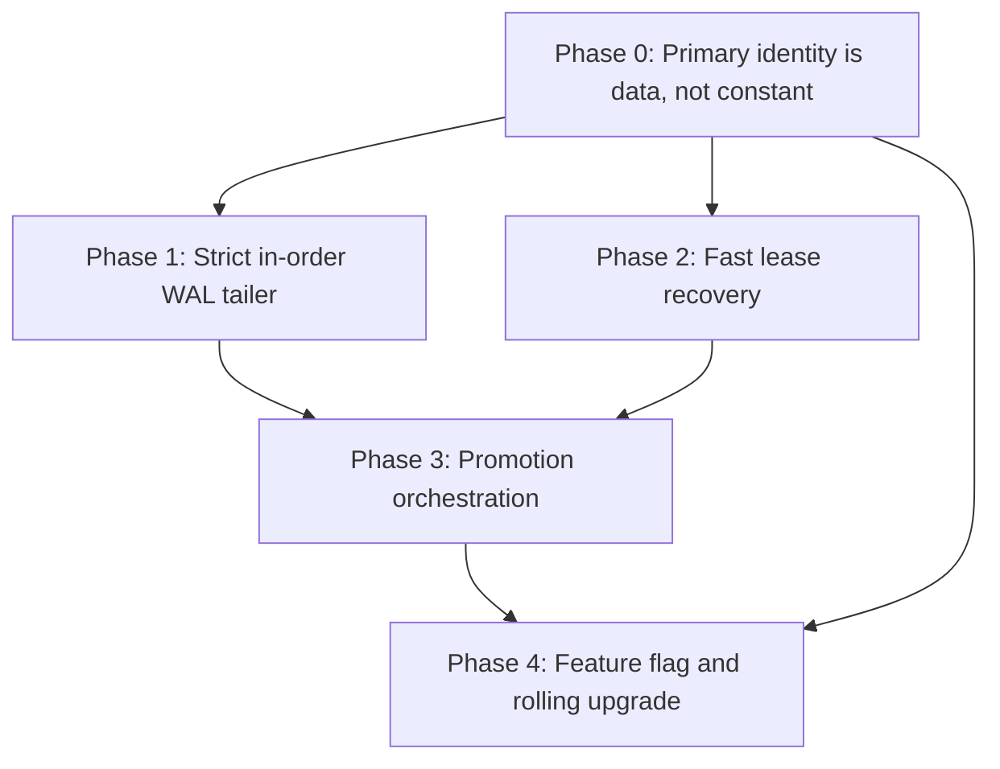
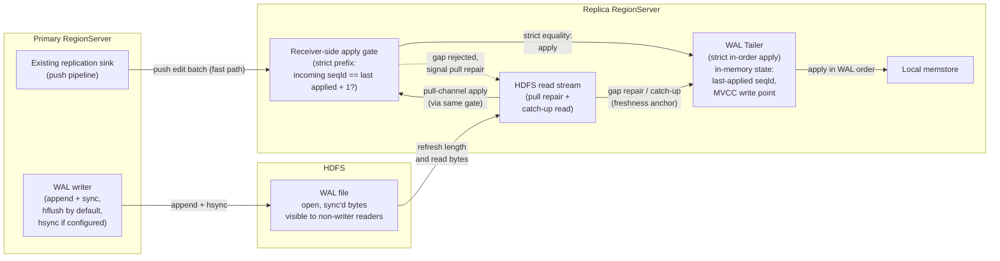
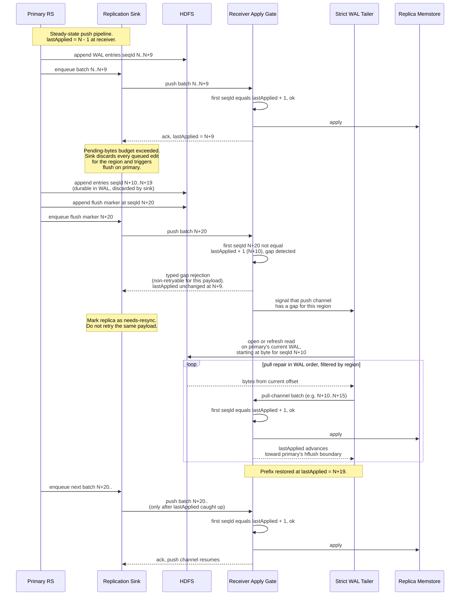
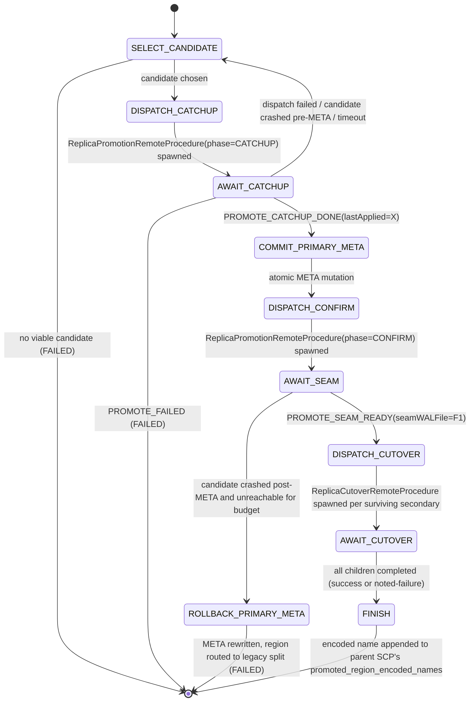
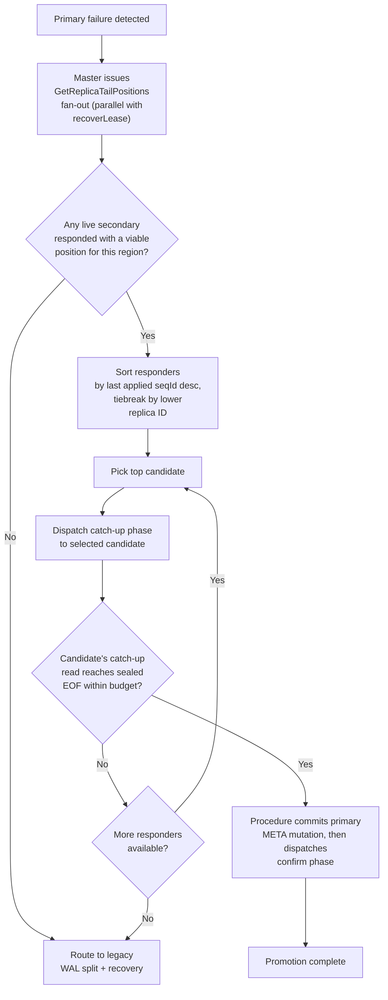
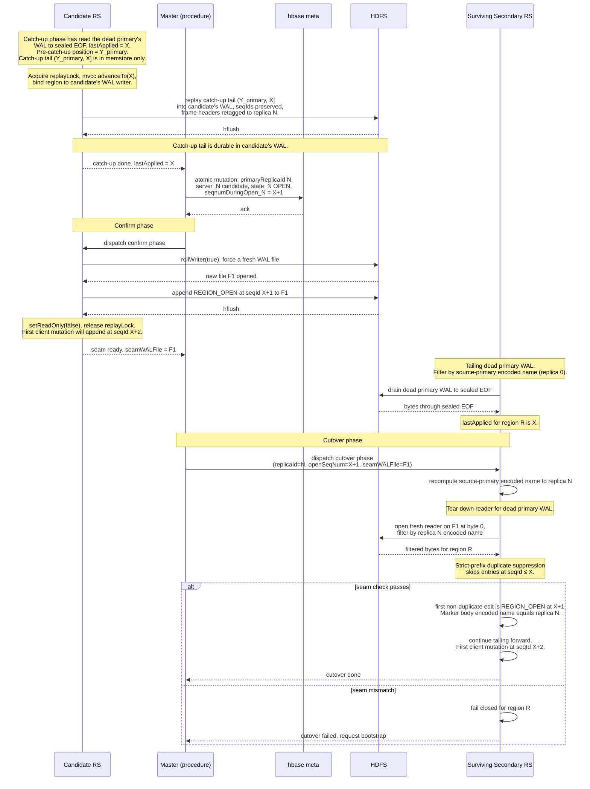
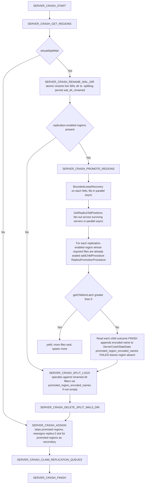
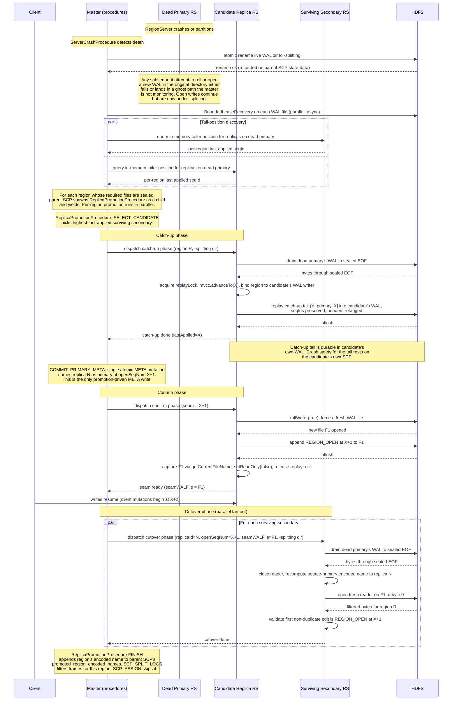

# Promotable Timeline-Consistent Replicas

## Overview

This document presents a design that takes HBase's existing timeline-consistent region replicas and makes them promotable, using only the WAL on HDFS as the source of truth.

The design has four closely linked goals:

1. **Promote in place.** When a primary fails, promote a read-only replica to read-write primary instead of waiting for a fresh assignment that recovers a cold region from durable storage.
2. **Bypass distributed split.** Skip the time- and IO-expensive distributed WAL split and `recovered.edits` replay in the common case. Those steps are what make today's failover slow.
3. **Restore writes early.** Pick a promotion candidate, confirm it, and step out of the way before any expensive recovery work begins. Data-path availability is then restored on the order of an HDFS lease recovery rather than on the order of a full distributed split.
4. **Preserve the existing durability and freshness contract.** This goal constrains the other three. Every edit recoverable from the dead primary's WAL after lease recovery must be visible at the new primary before it accepts new writes, with no silent loss and no rewinds.

Whether "recoverable" includes every acknowledged edit, or only those that survived a correlated power-loss event, is a property of the underlying WAL durability tier. The Write-Ahead Logging constraints section below covers this in detail.

## Current Timeline-Consistent Replica Architecture

```
           client writes
                │
                ▼
   ┌────────────────────┐    best-effort   ┌────────────────────┐
   │  Primary (R/W)     │──── push ───────►│  Replica (R/O)     │
   │  Memstore (live)   │   async, no      │  Memstore (lagged) │
   │       │            │   freshness      └────────────────────┘
   │       │ WAL sync   │   contract       ┌────────────────────┐
   │       │            │──── push ───────►│  Replica (R/O)     │
   │       ▼            │                  │  Memstore (lagged) │
   └───────┼────────────┘                  └────────────────────┘
           │
           ▼
   ┌────────────────────────────────┐    Replicas do not read HDFS
   │  HDFS WAL  (per RegionServer)  │    for freshness. The primary's
   │  HFiles    (shared)            │    push is their only source.
   └────────────────────────────────┘

   Failover today: Primary dies → SCP runs HDFS lease recovery +
   distributed WAL split + recovered.edits replay → default replica reassigned and
   opens with replay (seconds to minutes). Replicas stay read-only throughout the
   outage.
```

HBase region replicas today ship WAL edits from the primary to each secondary via per-region RPC. Several properties of this pipeline make promotion impossible under the current design. Edits are pushed by the primary. If the primary dies before pushing a batch, the secondaries simply do not have it. The primary's replication sink processes edits in MVCC completion order and bails out on backpressure rather than reordering, so a secondary that does receive a batch sees it in WAL order. What the pipeline lacks is a durability proof that ties client acknowledgment to secondary apply (acknowledgment is gated only on WAL sync to HDFS, and the per-replica RPC is dispatched only after the WAL sync returns) and no freshness guarantee on how far the secondary has fallen behind. Worse, the push pipeline may silently drop pending entries, so an edit can be acked, durable in the WAL on HDFS, and never delivered to any replica, even when the primary stays alive.

Secondary memstore lag is also unbounded under load, network partition, or push-pipeline retries. The practical consequence is that two replicas of the same region can sit at completely different points, with no protocol to choose the most current one and no mechanism to install it as the new primary. Replica region definitions are flagged read-only, and the region-open path refuses to serve writes for non-default replica IDs. On primary loss the `ServerCrashProcedure` (SCP) runs the dead RegionServer's WAL through distributed log splitting, writes per-region `recovered.edits`, reassigns the default replica to a new RegionServer, and opens it with recovered-edits replay. All of this takes seconds to minutes.

For secondaries to become *promotable* in a way that meaningfully improves availability, three things have to change:

1. The replica's view of the primary's WAL must be precise enough to prove that it has applied every edit the old primary durably wrote.
2. There must be a protocol for the master to pick the most-up-to-date secondary as the candidate, and for that secondary to reach a quiescent point that proves catch-up to the primary's last acknowledged write.
3. SCP must be restructured so that promotion runs out-of-band from distributed log splitting. The promotion fast path must complete before splitting work is dispatched, returning the data path to read-write quickly. 

## Constraints

### Write-Ahead Logging

The HBase WAL on HDFS is the sole durability mechanism for committed writes. Before acknowledging a write to the client, the primary calls into HDFS to ensure the WAL append has reached every DataNode in the pipeline. 

When `hbase.wal.hsync=false`, the default, the WAL writer calls `hflush`. `hflush` ensures the bytes have been transmitted to every DataNode in the pipeline and are visible to any other reader, but it does not require the DataNodes to flush the data to disk before returning. The bytes live in DataNode page cache, durable against process crash, but not against coincident power loss. Under default settings a correlated power-loss event involving the primary RegionServer and one or more of its WAL pipeline DataNodes can leave acknowledged edits unrecoverable. When `hbase.wal.hsync=true`, the WAL writer calls `hsync` on every batch, which on HDFS forces an `fsync` on each DataNode in the pipeline. Once the call returns, the bytes are durable across coincident power loss of the primary RegionServer and the entire pipeline.

When `hbase.wal.hsync=false`, the sealed end is guaranteed to include every edit visible to a reader of the WAL prior to lease recovery, but a correlated power loss may already have truncated the recoverable suffix. When `hbase.wal.hsync=true`, the sealed end is guaranteed to include every edit the primary acknowledged. If the new primary's memstore is missing any edit recoverable from the sealed WAL, the cluster silently experiences data loss against this contract. Operators who require an absolute zero-data-loss freshness guarantee under any single correlated failure must set `hbase.wal.hsync=true`.

### HDFS lease semantics dictate a synchronous wait

While the primary is alive, the last block of its WAL file is always in the "block being written" (BBW) state with an open lease. A reader other than the writer can see bytes only up to the last `hflush`/`hsync` boundary published to the NameNode. The exact end of the file is not knowable to a reader until the lease is recovered. The in-flight last block has to be closed through NameNode lease recovery, which reaches consensus among the DataNodes in the pipeline on the final block length and then finalizes the block. There is no way to skip this. A would be promoted replica cannot prove it has read past the last published flush boundary until lease recovery has sealed the file.

In healthy clusters lease recovery typically completes in seconds once lease recovery is initiated. Under coincident DataNode failure or high NameNode or DataNode loading it can stretch much longer, and HBase's existing lease-recovery retry loop is documented to keep going for a much, much longer, and configurable budget of 15 minutes.

### Strict in-order apply

Today's timeline-consistent push pipeline does not enforce strict in-order apply across batches at the receiver. It is allowed to drop entries silently when a sink is slow or unavailable, it keeps no per-replica position record anywhere the master can query, and the receiver-side apply path is not constrained to strict per-region WAL order across batches. All three properties have to change: The candidate's position has to be interpretable as a prefix of the primary's WAL. The proof is that the candidate has applied every edit up to a sequence ID, not just that it applied the edit at that sequence ID. If the apply path is allowed to commit edits out of order, `lastApplied = X` is only the assertion that the entry at `X` has been applied, leaving open the possibility of unapplied gaps below `X`. Strict in-order apply at the tailer is what makes `lastApplied = X` mean the entire prefix through `X` has been applied to the region's state. Then, the push channel from the dead primary is gone at the moment of failover, so any gap between the candidate's current position and the sealed end has to be closed by the candidate itself. The candidate has to be able to read the dead primary's WAL directly from HDFS. 

### Per-region promotion

A failed RegionServer hosts many regions. Some have replicas in healthy state. Others have secondaries caught up while still others are arbitrarily behind. Promotion must therefore be a per-region decision, with a per-region fallback to legacy splitting whenever no secondary can prove catch-up. A single dead server may end up with a mix of fast-promoted regions, fallback-split regions, and regions that were never replication-enabled.

### Fencing of the dead primary

The cluster must guarantee that the dead primary cannot continue to ack writes once a replica has been promoted. In a partition where the coordinator and the primary disagree about liveness, the primary might still be alive, still hold its HDFS lease, and still be writing to the WAL.

The fence has two phases, applied in order. First, the master atomically renames the dead server's live WAL directory to a `-splitting` suffix. Second, it initiates lease recovery for every WAL file the rename captured. Both actions must complete before the new primary acknowledges any write. The rename is the *discovery* fence. HDFS directory rename is a single NameNode metadata operation that atomically captures every WAL file existing at the moment of rename. The lease recovery is the *write* fence. The dead primary's still-open writer continues to hold its HDFS lease against that file's inode and remains writable until the lease is revoked. `recoverLease` against each enumerated file revokes that lease. Any further sync by the old primary then fails with `LeaseExpiredException`, and HBase's existing WAL failure pipeline aborts the RegionServer. This is the same lease-recovery fence used by `WALSplitter`.

### WAL is per-server, not per-region

The HBase WAL is a per-RegionServer file with edits from many regions interleaved, so per-region apply must filter the stream. After a primary crash the dead server's WAL contains edits for every region it hosted, including regions whose replicas live on different secondary servers. The new primary for region R only needs R's edits, and the WAL splitter today fans these out per region.

Every secondary on every server must independently read the dead primary's WAL up to its sealed end and filter its own region's edits. The work is parallel by region, runs only for regions that have a configured replica, and is bounded by the tail size since each replica starts from its last applied position.

In well-behaved steady state with low replication lag, per-replica tail catch-up is a few KB to a few MB, and the master can dispatch all promotions in parallel. In pathological cases the catch-up can be hundreds of MB per region.

## Proposed Promotable Timeline-Consistent Replicas

```
          client writes
                │
                ▼
    ┌─────────────────┐   push edits    ┌─────────────────┐
    │     Primary     │ ──────────────► │     Replica     │
    │      (R/W)      │  (best effort)  │      (R/O)      │
    │     memstore    │                 │  strict tailer  │
    │                 │                 │   + memstore    │
    └────────┬────────┘                 └────────▲────────┘
             │                                   │
             │ WAL sync                          │ pull
             │ (durability)                      │ (gap repair,
             ▼                                   │  freshness)
    ┌──────────────────────────────────────────────────────┐
    │  HDFS WAL  (primary's WAL = source of truth)         │
    │  HFiles    (shared)                                  │
    └──────────────────────────────────────────────────────┘

    Failover proposed: primary dies → recoverLease seals dead WAL → a candidate replica
    reads to sealed EOF, applies remaining edits, has the META row updated so that the
    new info:primaryReplicaId column names the candidate's replica ID and the suffixed
    info:server_<N>, info:state_<N>, info:seqnumDuringOpen_<N> columns for that replica
    point at the candidate, transitions R/O → R/W. Distributed WAL split is bypassed
    per region in the common case. The remaining replicas observe the change and switch
    their tail source for that region from the dead primary's WAL file to the
    candidate's WAL file.
```

## Phased Implementation Sequence

The remainder of this document is structured as a sequence of implementation phases, in dependency order. Each phase introduces new code and logic that consumes only the outputs of phases before it. Cross-cutting concerns are pulled forward into the earliest phase that must establish them, so later phases can build on terms like "the acting primary," "the strict tailer," and "bounded lease recovery" without re-deriving what those terms mean.



Phase 0 is a refactor that fixes the assumption made in many places that "replica 0" is always the primary replica. It is fully backwards compatible and makes no effective behavioral changes. Phases 1 and 2 add the strict tailer and the fast fence that promotion will consume. Strict prefix assertions are gated on the table flag introduced in Phase 4, and the fast lease recovery strategy has no caller until Phase 3. Phase 3 is the earliest point of integration and behavioral shift. It introduces the new master-side promotion procedure, the supporting remote procedure callable implementations, the master's candidate selection logic, and the `ServerCrashProcedure` integration that schedules promotion. Phase 4 adds the table descriptor based feature flag that opts a table into promotable replicas, the connection handshake protocol version gating that keeps mixed-version clusters safe, and the rolling upgrade compatibility framing.

Every cross-cutting concern that would otherwise be derived in multiple sections is established once and consumed by later phases.

## Phase 0: Primary Identity is Data, Not Constant

Today, "replica 0" and "the acting primary" are the same thing everywhere. This assumption pervades the codebase. Phase 0 is the refactor that splits the two concepts.

Non-default replicas use suffixed qualifiers of the form `info:<base>_<replicaId>`, where `<replicaId>` is the four-character uppercase hexadecimal encoding. This document writes that unsuffixed-or-`_%04X` notation schematically as `info:server_<N>`. Code against META must use the actual hex format. The unsuffixed `info:server`, `info:serverstartcode`, `info:seqnumDuringOpen`, and `info:state` columns describe replica 0, and existing accessors special-case replica ID 0 to return the unsuffixed name. Today those same unsuffixed columns also implicitly refer to the acting primary, because the primary is always replica 0.

Replica 0's slot must be independently representable, and the new primary's identity must be discoverable in one place. The fix is to split the two concepts by adding a single new META column, `info:primaryReplicaId`, that explicitly names the primary. Every existing *info* column keeps its meaning unchanged. Only the *which slot is the primary* indirection moves into the new column. Every primary-identity read site is rerouted to consult `info:primaryReplicaId` first, then read the suffixed (or unsuffixed, when `N == 0`) slot it names. Promotion writes the new column, the promoted replica's `_<N>` slot, and the per-region last-applied sequence ID in a single atomic META mutation. Replica 0's slot is left untouched and is reclaimed independently by SCP.

As delivered in phase 0, `info:primaryReplicaId` is absent (or 0) on every region row. Every reader defaults on absence. However, now the promotion procedure landing in Phase 3 can simply set `info:primaryReplicaId` to any legal value and rely on all the other code to do the right thing.

### `info:primaryReplicaId` column

A new column `info:primaryReplicaId` is added under the `info` family, encoded as a 4-byte big-endian integer to match the format the rest of META already uses for replica IDs. The column names which replica is the acting primary, separately from any column that describes a replica's physical location or state. When the cell is absent or empty, the primary is replica 0. When the cell is present with value `N`, the primary is the replica whose physical location is described by `info:server_<N>`, `info:serverstartcode_<N>`, `info:seqnumDuringOpen_<N>`, and `info:state_<N>` (or by the unsuffixed columns when `N == 0`). The four suffixed columns plus the unsuffixed ones continue to be the single source of truth for each replica's physical location and state. `info:primaryReplicaId` adds nothing to that picture except an indirection that names which one of those slots is currently the primary.

The new column will be written by the promotion procedure's `COMMIT_PRIMARY_META` state's atomic mutation, which sets `info:primaryReplicaId`, the suffixed columns for the promoted replica, and the per-region last-applied sequence ID . A reader of the META row never observes `info:primaryReplicaId` advancing ahead of the suffixed location it names, or vice versa.

### Reader rewrites

The META region-locations accessor reads `info:primaryReplicaId` and returns the slot it names. The existing default-location accessor is retained for the narrow case of code that genuinely wants replica 0 specifically, but it is no longer the implicit primary accessor. Existing helpers that special-case replica ID 0 to the unsuffixed qualifier are unchanged. The change is purely in *which slot* the primary is read from.

The async client-side region locator is reworked so that primary and replica 0 are no longer interchangeable. The locator cache, which stores raw region-locations records keyed by region start row, is unaffected. A client whose cache still names replica 0 as primary and dispatches a write to the dead server's slot 0 receives a `NotServingRegionException` response from the dead RegionServer. The refetch after cache invalidation picks up the new `info:primaryReplicaId`.

The client side timeline-consistent hedged read path today hardcodes replica 0 as the primary in several places. This code is reworked to consult the resolved primary replica ID for the region's cached `RegionLocations`, as returned by the new primary-location accessor. The strong-consistency single target call routes to the resolved primary ID rather than `DEFAULT_REPLICA_ID`. The timeline-consistent path issues its primary call against the resolved primary ID, then iterates the secondary fan-out from `0` to `n - 1` and skips the iteration whose index equals the cached primary ID. This generalizes the meaning of primary to whichever replica the cached `RegionLocations` names, while preserving the existing logic for reigon location cache invalidation and refetch.

The master's META scan continues to interpret the unsuffixed columns as replica 0's physical state and to materialize one per-replica state node per region from the suffixed columns. The same scan also materializes `info:primaryReplicaId` into a new field on the per-region `RegionStateNode`, defaulting to 0 when the cell is absent. A new master-side accessor resolves the primary by reading the cached `RegionStateNode.primaryReplicaId` and returns the corresponding per-replica state node. Every code path inside the assignment manager, `TransitRegionStateProcedure`, and `ServerCrashProcedure` that today picks the replica-0 state node to make a primary decision is rerouted to this accessor. The rerouting covers write-path RPC routing, the periodic RegionServer report reconciliation, and the catalog janitor's primary-side cleanup. TRSP additionally has an `isDefaultReplica` short-circuit on the `ABNORMALLY_CLOSED` close path that today skips recovered-edits handling for non-default replicas, on the assumption that they are stateless read-only copies. That gate is widened from `isDefaultReplica` to `replicaId == primaryReplicaId`, so a non-default replica that was the acting primary takes the full primary-crash recovery path, while a non-default replica that was not the acting primary keeps the existing fast-exit and defers bootstrapping to the region-replica bootstrap path. Initially after Phase 0 this widening has no effect, because every primary is replica 0 and `replicaId == primaryReplicaId` evaluates identically to `isDefaultReplica`. After Phase 3, these changes are what keeps the recovery path correct.

The META update path is extended so the same atomic mutation that writes the suffixed location cells for the promoted replica also writes the new `info:primaryReplicaId` value. On promotion confirmation the column is set to the promoted replica ID. On region open of a default-replica primary it is left at 0 and the column is not written. The `info:state_<N>` cell for the promoted replica is updated to `OPEN` at its new location in the same mutation, while the unsuffixed `info:state` cell for the dead replica 0 is *not* overwritten by the promotion update. Replica 0 transitions to `ABNORMALLY_CLOSED` through the normal SCP-driven path, independently of the promotion, and that independence is what lets SCP schedule a replacement replica for replica 0 separately from primary recovery.

### WAL Identity Resolution

The encoded region name that tags every WAL frame is *per-replica*, not per logical region. HBase's encoded-name convention appends a replica-ID suffix for non-default replicas, so replica 0 and replica `N` of the same range produce different encoded names. The same per-replica encoded name appears inside the bodies of flush, region-event, compaction, and bulk-load WAL markers, populated from the writing region's identity when the marker is constructed. Today this asymmetry is invisible because every primary is the default replica, and the encoded name that tags any per-RegionServer WAL is therefore invariant cluster-wide. 

After an in-place promotion of a non-default replica, the new primary continues to tag every WAL frame for the promoted region with its own replica-`N`-flavored encoded name, and that tagging propagates to every downstream consumer. Region names in the protobuf frame header diverge from those in the marker bodies for flush, region-event, compaction, and bulk-load events.

The push channel rewrites the encoded name in the WAL frame header to the *destination* replica's encoded name as part of the wire encoding. Marker bodies pass through unmodified. Push-channel entries arrive at a receiver pre-tagged with the *receiver's own* encoded name in the frame header, but with the *source primary's* encoded name in any marker body. The existing marker-body validator inside `HRegion#checkTargetRegion` accepts a body tagged with the receiver's own encoded name. Additionally, for non-default-replica receivers only, it must accept the *default* replica's encoded name, derived from filesystem layout rather than from the receiver's own region identity. The pull channel, by contrast, sees WAL bytes exactly as the source wrote them with no intermediary to rewrite anything, so pull-channel entries arrive tagged with the *source primary's* encoded name in *both* the frame header and any marker body.

The tailer introduced in Phase 1 maintains, per region, the encoded name it expects to see on pull-channel frames. That value is the source primary's encoded name, derived from whichever replica ID META currently names as the acting primary for the region. The tailer initializes the expected name at region open by reading `info:primaryReplicaId`, and recomputes it at every cutover.

Frame-header recognition then splits into two *disjoint* match conditions, one per channel:

- On the pull channel, a WAL frame is recognized as belonging to the region when the frame header's encoded name equals the source-primary encoded name.
- On the push channel, a frame is recognized by the existing rule that the frame header carries the receiver's own encoded name, because the wire-level rewrite has already retagged it.

The push pipeline's encoded-name rewrite is left exactly as it is today, so the receiver-side push filter sees no semantic change. The new behavior is confined to the pull-channel arm.

Marker-body validation is, by contrast, a *single* validator that all marker apply paths funnel through, regardless of channel. Because both channels deliver marker bodies tagged with the source primary's encoded name, the validator must accept that name without caring which channel produced the entry. The existing rule accepts the receiver's own encoded name plus (for non-default-replica receivers only) the default replica's encoded name. It is extended to also accept the source-primary encoded name, for receivers of any replica ID including the default replica.

During steady state operation the primary region's encoded name is the default replica's encoded name. After a promotion to replica `N` the primary region's encoded name becomes replica `N`'s encoded name. A replica bootstrapped after promotion will see marker bodies (in push frames from a non-default acting primary) tagged with replica `N`'s encoded name, and must accept them. All marker apply paths funnel through this single validator and need no further changes.

`RegionReplicationSink` and `RSRpcServices#replicateToReplica` today hardcode replica 0 as the source. The sink's destination loop iterates `replicaId = 1; replicaId < regionReplication; replicaId++`, hardcoded to exclude replica 0 as a target because replica 0 is hardcoded as the source. `replicateToReplica` rejects any push aimed at the default replica. Both are widened in lockstep so the source is whichever replica `info:primaryReplicaId` names. The loop iterates every replica ID and excludes the META-named *source* (rather than just replica 0), and `replicateToReplica` rejects pushes whose target replica ID equals `info:primaryReplicaId`, preserving the invariant that no replica pushes to itself.

## Phase 1: Strict In-Order WAL Tailer

Phase 1 establishes the framework that proves that a given secondary has applied a prefix of the primary's WAL. A strict-in-order WAL tailer takes ownership of the per-region apply state. The receiver-side apply gate tightens to strict equality on the per-region sequence ID, admitting a batch only when its first sequence ID is exactly one past the last applied. Dropped batches are signaled back to the sink as a typed gap rejection rather than silently absorbed. A pull channel HDFS reader is added as the fallback the tailer opens when the push channel develops a gap, with a WAL-compression context reconstruction path that keeps the reader functional against compressed WALs. Per region last applied and MVCC write-point fields are added to the tailer's in-memory state. `RegionMetrics` and `ServerMetrics` are extended with so the in-memory tailer state is periodically reported on the existing `regionServerReport` heartbeat. The pull-channel fallback and its supporting WAL-compression context reconstruction exist because today's push protocol is allowed to drop edits silently.

There are no new operational requirements yet. New behavior is gated on the per table flag introduced in Phase 4, and tables that do not opt in retain today's semantics unchanged.

### Strictly ordered WAL Tailer per replica

A new component on every secondary RegionServer owns the per-region tailer state. It accepts pushed edits from the primary's existing replication sink as a fast path, falls back to reading directly from the primary's WAL on HDFS when the push pipeline lags or drops bytes, and tracks its applied position in memory. The tailer applies edits to the local memstore in strict WAL order. Out-of-order apply is forbidden. The tailer is the only consumer of replication for secondary replicas.

### Tailing Protocol

The primary's existing replication sink continues to ship edits to each secondary's tailer over the existing region replica replication RPC. The tailer accepts pushed batches and applies them in order if they extend the applied prefix. The prefix check is enforced at the receiver side as strict equality on the per region sequence ID, as described in "Strict Prefix Enforcement". A batch whose first sequence ID is greater than one past the last applied is rejected rather than applied, and the receiver immediately switches the affected region's tail source to the pull path to repair the gap from HDFS. The push channel resumes only once the prefix has been restored. Late arriving push batches whose sequence IDs lie at or below the last applied are silently skipped by duplicate suppression, since the pull path may have already covered the same range. While Partial Recovery Deferral mode is engaged, push to dead AZ destinations is dormant. See [§Partial Recovery Deferral](#partial-recovery-deferral).

The pull path is invoked on demand. In healthy steady state the push channel delivers every edit and the pull stream sits closed. The tailer opens the pull stream only when the receiver side gate rejects a push batch as a gap and the affected region's tail source switches to pull for repair, and when the catch-up phase at promotion opens it against the dead primary's renamed WAL to drain to the sealed end. Once opened, the pull stream refreshes its block locations and length, advances through any newly visible bytes, decodes the WAL frames, filters by region (using the source-primary encoded name), and applies the matching entries in strict order. Once the prefix has been restored and the push channel has resumed delivery, the pull stream is torn down and the tailer returns to push only steady state.

Should the source primary's WAL be compressed, the puller rewinds to byte 0 of the file, instantiates a fresh compression state matching the WAL header's advertised configuration, and decodes forward through the file, discarding frames whose per-region sequence ID is at or below the last applied and admitting the matching entries as otherwise described above. Against an uncompressed source the existing seek-to-offset behavior is unchanged.

When a secondary replica region opens, the bootstrap of its initial last-applied sequence ID is handled by mechanisms that already exist today. Because the secondary shares the primary's store directory on HDFS, `HRegion#initializeStores` finds every HFile the primary has flushed and returns a maxSeqId equal to the primary's last durable flush point at the moment of the directory scan. The region's MVCC read point is advanced to that value. `RegionReplicaFlushHandler` then RPCs the primary to force a flush, or to write an empty flush marker if the memstore is already empty, and keeps the secondary's reads disabled until the resulting flush marker arrives over the existing region-replica replication channel. On apply the MVCC read point is advanced to the primary's flush sequence number and reads are enabled. Phase 1 adds nothing new to this path. The new tailer initializes its in-memory `lastApplied` and last-applied MVCC write point from that read point at the moment reads become enabled. From that point both values are advanced only by the apply path itself, by push receipt in steady state and by the pull stream during the catch-up or gap-repair window.

WAL rolls are not signaled in-band in any way a cross-RegionServer reader can safely rely on. An abruptly terminated WAL has no trailer, and even when one is present the trailer carries no roll-target information. An open pull stream must therefore discover rolls out of band. It lists the primary's WAL directory on HDFS, orders files chronologically by the timestamp suffix in the filename, and rolls forward when a newer file appears. It must also tolerate the absence of a trailer on the previous file. Once it has read the previous file up to its visible length (or, after promotion-time lease recovery, its sealed length) and the directory listing shows a successor file, it switches to the successor and continues reading. This polling exists only inside an open pull stream, not in the steady-state apply path.

The wrinkle is that a primary crash between finishing one WAL and opening the next is possible. At the moment of crash the tailer may be at the tail of the previous file, in the middle of the previous file, or already advanced into the next file. The previous file may have no orderly close at all, and the next file may or may not yet exist on HDFS.



### Strict Prefix Enforcement on the Push Path

The strict tailer's contract is that every edit it admits to the local memstore extends a prefix of the source primary's WAL for the region. At promotion time, the candidate's last-applied sequence ID must be exactly the largest per-region sequence ID for which every smaller sequence ID has also been applied. That way, a catch-up read from one past that position to the sealed end of the WAL is sufficient to close any remaining gap.

Three holes in the existing pipeline break that contract:

1. The receiver-side apply gate inside `HRegion#replayWALEntry` admits any batch whose sequence ID is strictly greater than `lastReplayedSequenceId`, with no equality check. A batch that skips past the next expected sequence ID is admitted just as readily as one that continues the prefix.
2. The primary-side `RegionReplicationSink` can drop queued edits for a region when the sink's pending-bytes budget is exceeded.
3. A separate per-RPC-failure path inside `RegionReplicationSink#onComplete` discards in-flight edits when an individual replication RPC fails with a sequence ID greater than the last flushed.

In both drop cases, the dropped edits are never resent on the push channel and the drop is not signaled to the receiver.

The design closes all three holes by installing a strict prefix gate at the receiver and a typed gap-rejection signal back to the sink. The new behavior is gated on a promotable-replicas feature flag added to table schema, to be enabled later. Tables that do not opt into promotion retain the receiver's monotonic-only check and the sink's best-effort drop semantics unchanged. 

With strict equality enforced at the receiver, an arriving batch is admitted only when its first sequence ID is exactly one greater than the last applied. A batch whose first sequence ID exactly extends the prefix is applied as today. A batch at or below the last applied position is suppressed as a duplicate. A batch beginning above the next expected sequence ID is rejected. The receiver leaves its applied position unchanged and signals the strict tailer that the push channel for this region has a gap. The tailer must repair from HDFS before any further push batch can be admitted. The receiver returns a typed result that communicates to the replication sink that a non-retryable error has occurred. The sink fails the batch out of its retry pipeline and marks the destination replica as needing resync.

On receiving the resync signal, the strict tailer falls back to the pull-channel mechanism described in "Tailing Protocol". It opens or refreshes its read against the source primary's current WAL file, advances forward from one past its last applied position, filters by the source primary's encoded name, and applies the entries belonging to the region in strict order until the gap is closed or the visible end of the file is reached. Per-region sequence IDs are issued without gaps in the WAL itself, so the pull repair always closes the gap.

The sequence below traces a sink drop on the primary, the receiver-side gap rejection that follows, the pull-channel repair against the primary's still-open WAL, and the resumption of the push channel once the prefix is restored:



### Pull-Path Compression Context Reconstruction

The design supports WAL compression, but no attempt is made to optimize for this case and make the compression state seekable from mid-position. Operators tuning for the lowest worst-case promotion latency with WAL compression is enabled should size the WAL roll threshold with that in mind. Those whose latency budget cannot accept the WAL roll size pessimum at all may run promotable RegionServers with WAL compression disabled, trading a larger on-disk WAL footprint for a worst-case catch-up proportional to the tail size rather than the WAL roll size. Alternatively, they may configure a much smaller than default WAL roll size threshold (e.g., 32 MB or 64 MB) to bound the worst case decompression latency during failover.

## Phase 2: Fast Lease Recovery

Phase 2 adds the `BoundedLeaseRecovery` strategy for rapid HDFS lease recovery and hoists the rename of the dead server's live WAL directory to its `-splitting` suffix into a new `SERVER_CRASH_RENAME_WAL_DIR` state in `ServerCrashProcedure`. The new state runs as soon as `SERVER_CRASH_GET_REGIONS` has enumerated the dead server's regions and ahead of either replica promotion or distributed log splitting, so both downstream paths consume the same atomically captured and already-renamed view. Phase 2 also fans out lease recovery in parallel under the renamed directory.

### Fast Lease Recovery

When a primary is declared dead, `ServerCrashProcedure` runs `SERVER_CRASH_RENAME_WAL_DIR` immediately after `SERVER_CRASH_GET_REGIONS` and before any per-region recovery work. That state atomically renames the dead server's live WAL directory to its `-splitting` suffix and persists a `wal_dir_renamed` flag on the procedure record so a master replaying the procedure observes the rename in place and skips it. `SERVER_CRASH_PROMOTE_REGIONS` then schedules a `BoundedLeaseRecovery` for every WAL file enumerated under the renamed directory, in parallel.

A reader of an open WAL file can see bytes only up to the last published flush boundary. The exact end of the file is not knowable to a the reader until lease recovery has finalized. This is an essential HDFS-level operation that gives the WAL a sealed end against which catch up can be completed.

The existing `RecoverLeaseFSUtils` mechanism for lease recovery cannot be used on a fast path. Its public method returns `void`, its retry loop runs for up to `hbase.lease.recovery.timeout` (default 15 minutes), and on expiry it logs a warning and returns silently rather than signaling timeout to the caller. The fast path requires a new strategy, `BoundedLeaseRecovery`, that drives the same HDFS level operations, alternating `recoverLease` with `isFileClosed` polling under a strict short deadline (configurable via `hbase.promotion.lease.recovery.timeout`). The wrapper returns one of three results:

- `SUCCEEDED`, the NameNode confirms the file is closed.
- `TIMEOUT`, the deadline expires without confirmation.
- `FAILED`, a non-retryable filesystem error occurred.

The existing `RecoverLeaseFSUtils` mechanism is left untouched. It will be invoked unchanged from `WALSplitter#getReader`, `MasterRegion#recoverWALs`, `AbstractFSWALProvider#recoverLease`, and other existing call sites. If `BoundedLeaseRecovery` returns `TIMEOUT` and the region falls back to legacy splitting and the legacy path's per-WAL invocation of `recoverFileLease` will try again with a much more generous deadline.

### Lease Recovery on the Critical Path

The promotion candidate consumes bytes as they become visible to the reader, and synchronizes on lease completion only at the very end, where it needs the sealed length to finalize.

The master must seal the dead server's WAL file before the candidate can prove it has reached the sealed end. `SERVER_CRASH_RENAME_WAL_DIR` performs the discovery-fence rename, and `SERVER_CRASH_PROMOTE_REGIONS` then schedules `BoundedLeaseRecovery` in parallel on every WAL file found in the renamed directory, which will return one of three definitive results: `SUCCEEDED`, `TIMEOUT`, or `FAILED`. On `TIMEOUT` or `FAILED` the region's fast path is abandoned, and the parent server-crash procedure routes that region to the legacy WAL-splitting slow recovery procedure.

The promotion candidate does not wait for lease recovery to complete. It will make as much progress as it can enumerating the dead server's WALs and reading the data from HDFS, on the principle that anything visible is already committed, even while lease recovery is in flight, until finally coming to the final most recently written file. Finally it will wait for lease recovery to complete on that file.

Once the WAL's final length is stable, the candidate compares it against its current applied position. If they are equal, catch-up is complete. If the sealed length is greater, the candidate reads the remaining bytes from HDFS, applies them, and then considers catch-up completed.

## Phase 3: Promotion Orchestration

Phase 3 ties Phases 0, 1, and 2 together to drive in-place promotion. It introduces `ReplicaPromotionProcedure` on the master, which selects a candidate per region from `GetReplicaTailPositions` responses and supervises that candidate through the catch-up, META-commit, and seam steps. It adds three `RSProcedureCallable` implementations that run through the existing remote-procedure dispatcher. `ReplicaCatchUpCallable` and `ReplicaSeamCallable` run on the candidate, and `ReplicaCutoverCallable` runs on each surviving secondary. Inside `ReplicaCatchUpCallable`, a new step lands the recovered edits durably on the candidate. After draining the dead primary's WAL to its sealed end and replaying it into the candidate's memstore, the callable appends those same edits to the candidate's own WAL with the dead primary's per-region sequence IDs preserved, which makes the candidate's WAL the durable source of truth for the catch-up range. Phase 3 also adds the `SERVER_CRASH_PROMOTE_REGIONS` state inside `ServerCrashProcedure`. The new state runs after Phase 2's `SERVER_CRASH_RENAME_WAL_DIR` has fenced the dead server's WAL directory, dispatches `BoundedLeaseRecovery` and `GetReplicaTailPositions` in parallel against the already-renamed directory, and schedules a `ReplicaPromotionProcedure` for each promotable region as its required files seal. Phase 3 builds on Phase 0's WAL identity resolution, Phase 1's strict in-order tailer, and Phase 2's bounded lease recovery and discovery-fence rename.

When a primary RegionServer dies, the master orchestrates per-region recovery through the procedure framework. A new procedure, `ReplicaPromotionProcedure`, is the per-region orchestrator for promoting a surviving secondary to primary. It is dispatched as a child of `ServerCrashProcedure` and coordinates with `TransitRegionStateProcedure` through the existing per-replica region exclusivity slot in the assignment manager. All transient promotion state is carried in the procedure store so master failover during promotion is recovered by ordinary procedure-store replay. The remainder of this section walks through the procedure, the contract that lets it interlock with the server-crash and region-transition machinery, the per-phase work it dispatches to the candidate and to surviving secondaries, the assorted supporting protocols (candidate selection, tail-position discovery, sequence-ID continuity), and how `ServerCrashProcedure` consumes per-region promotion outcomes during fast recovery.

### Promotion Procedure

Per-region promotion is orchestrated by `ReplicaPromotionProcedure`, a child procedure of `ServerCrashProcedure` dispatched once per replication-enabled region whose required WAL files under the `-splitting` directory have been sealed. The procedure is a state machine driven through the master procedure framework. Its phases cover candidate selection, the catch-up dispatch that drives the candidate's local memstore through the dead primary's sealed WAL, the atomic META mutation that names the promoted replica as primary, the confirm-and-seal phase that pins a fresh WAL writer on the candidate so that the post-promotion seam lands at the start of a young file, parallel cutover work directed at each surviving secondary, and a terminal step that appends the region's encoded name to the parent server-crash procedure for downstream consumption.



The procedure carries the entire transient state of an in-flight promotion in its serialized record. From the parent server-crash procedure it inherits the identity of the replica region being promoted, the dead server's identity, and the path of the dead server's renamed WAL directory under the `-splitting` suffix. As it advances through its states it accumulates the currently-selected candidate's identity, the per-region position responses gathered from the surviving replica-hosting servers (cached so a retry from the candidate-selection state does not need to redo the fan-out), the candidate's last-applied sequence ID once the catch-up phase has reported in, the path of the candidate's WAL file that holds the cutover seam (set when the confirm phase reports back), and the set of surviving secondaries whose cutover work has not yet completed. The procedure state is updated at every state transition before the master commits to the next phase, and is a complete and durable record of the promotion process.

A master failover during an in-flight promotion is recovered by an ordinary procedure-store replay. The procedure resumes at whatever state it last persisted before the previous master crashed, with all state-data fields intact. The phase callables dispatched to the candidate (see "Phase Callables") are idempotent, so the same machinery that drives a fresh promotion drives a recovered one.

### Procedure Coordination

`ReplicaPromotionProcedure` shares its coordination machinery with `ServerCrashProcedure` and `TransitRegionStateProcedure` rather than inventing a parallel one.

Each replica's `RegionStateNode` already holds at most one active `TransitRegionStateProcedure` at a time, on the `RegionStateNode.procedure` field set and cleared through `setProcedure` and `unsetProcedure`. That field is generalized to also accept `ReplicaPromotionProcedure` under the same at-most-one rule. Because the field is per-replica, replica 0 and replica `N` track their in-flight procedures independently. A `ServerCrashProcedure` reassigning replica 0 through `TransitRegionStateProcedure` and the promotion of replica `N` through `ReplicaPromotionProcedure` therefore run in parallel without lock conflict.

When `ServerCrashProcedure` runs against a server, it walks the regions hosted there and dispatches handling to whichever procedure owns each region's `RegionStateNode.procedure` field. An in-flight `ReplicaPromotionProcedure` is picked up the same way an in-flight `TransitRegionStateProcedure` would be. The promotion procedure's response then depends on which role the crashed server played and how far the procedure had progressed when the crash was observed.

If the crashed server was the candidate and the `COMMIT_PRIMARY_META` mutation has not yet been performed, it returns to the `SELECT_CANDIDATE` state and dispatches `ReplicaCatchUpCallable` to the next-best secondary, reusing the cached fan-out responses on the procedure record. If the crashed server was the candidate and `COMMIT_PRIMARY_META` has already been performed, META still names the dead candidate as primary even though the candidate is gone. The procedure rewrites META to name the dead primary's original replica back as the acting primary and routes the region to the legacy split path, where the dead primary's sealed WAL is the source of recovery. The dead candidate's slot for replica `N` is reassigned through `TransitRegionStateProcedure` once the candidate's own server-crash procedure has run. Finally, if the crashed server was a surviving secondary the procedure had earmarked as an upcoming cutover target, the secondary is removed from the pending-cutover set on the procedure record. The cutover work directed at that secondary is dropped at the `FINISH` state, and the secondary will pick up the seam through the standard region-replica bootstrap path when its replica is reopened on a different RegionServer.

Locks are acquired parent-to-child, matching today's server-crash-to-open-region flow. `ServerCrashProcedure` takes its server-level exclusive lock first. The child `ReplicaPromotionProcedure` takes its per-region exclusive lock under that. The remote procedures that dispatch `ReplicaCatchUpCallable` and `ReplicaSeamCallable` to the candidate take no additional lock, and the per-secondary remote procedures that dispatch `ReplicaCutoverCallable` likewise take no additional lock and run in parallel.

The procedure store is the authoritative replay state. After a master crash, every persisted promotion procedure is replayed at whatever state it last committed. The assignment manager's offline-region reconciliation reattaches the `RegionStateNode.procedure` field to the replayed procedure. The existing remote-procedure replay path reconstructs the suspended events on the procedure, and any in-flight `RSProcedureCallable` on the candidate is re-dispatched once the procedure resumes. The presence or absence of the new primary's identity in META is the only durable cross-actor signal the design relies on, and that signal is set exactly once at `COMMIT_PRIMARY_META`.

### Remote Procedure Callables

`ReplicaPromotionProcedure` dispatches three `RSProcedureCallable` implementations through the remote-procedure dispatcher. `ReplicaCatchUpCallable` and `ReplicaSeamCallable` run on the candidate RegionServer. `ReplicaCutoverCallable` runs on each surviving secondary. All three are written so that retries with the same input produce the same observable outcome and never repeat the underlying durable work. Retries are safe across master failover or other transient issues.

#### `ReplicaCatchUpCallable`

`ReplicaCatchUpCallable` runs on the candidate RegionServer in the `AWAIT_CATCHUP` phase. It opens a read against the dead primary's WAL files under the `-splitting` directory the procedure record names, drains those files to their sealed ends as `BoundedLeaseRecovery` finalizes them, and applies the resulting catch-up edits to the candidate's local memstore in strict WAL order through the strict tailer. The candidate's strict tailer relinquishes any open reader it held against the original pre-rename path before reopening against the renamed path. Open HDFS read handles inside the renamed directory survive the rename, so an in-flight drain that started before the rename is allowed to complete naturally rather than being torn down.

Once the catch-up read has reached the sealed end of the dead server's WAL, the callable acquires the per-region `replayLock` and advances MVCC to the catch-up high-water mark inside the lock. It initializes the region's sequence-ID counter at that high-water mark so subsequent assignments continue from one past it, then appends the catch-up tail to the candidate's WAL with the dead primary's original per-region sequence IDs preserved. (The candidate's WAL writer naturally tags the replayed frames with its own replica-`N`-flavored encoded name. Downstream consumers reconcile that tagging through Phase 0's WAL identity resolution with no further callable-side action.) The callable hflushes that replayed tail before reporting back. That hflush is the durability point that lets crash safety for the catch-up tail rest on the candidate's own server-crash procedure rather than on the dead primary's distributed split. After the hflush, the candidate's WAL holds an unbroken record of every per-region sequence ID from the candidate's pre-catch-up position through the dead primary's sealed end. The callable then reports `PROMOTE_CATCHUP_DONE` to the master with the candidate's last-applied sequence ID. On re-dispatch with catch-up already done, the callable observes the durable evidence of the prior run on the candidate's own WAL and re-reports the same outcome without rereading any of the dead primary's WAL.

#### `ReplicaSeamCallable`

`ReplicaSeamCallable` runs on the candidate RegionServer in the `AWAIT_SEAM` phase, after the procedure has performed the `COMMIT_PRIMARY_META` atomic mutation and before any cutover work fans out. The callable holds the same per-region `replayLock` `ReplicaCatchUpCallable` left held, calls `rollWriter` with a force-roll flag so that a fresh WAL writer is opened, appends the `REGION_OPEN` marker at the seam sequence ID META just committed, hflushes, captures the path of that fresh file via `getCurrentFileName`, calls `setReadOnly(false)` so client writes can begin, releases the `replayLock`, and reports `PROMOTE_SEAM_READY` back to the master with the captured file path. The forced roll is what guarantees that the seam (the candidate's first post-promotion `REGION_OPEN` marker for the region) sits at the start of the replica under promotion's latest WAL file. Surviving secondaries that begin tailing the candidate at the seam therefore have an easier time finding the marker. After the durable hflush of the `REGION_OPEN` marker, a candidate crash is recovered by the candidate's own server-crash procedure, which splits the candidate's WAL and emits `recovered.edits` covering both the catch-up tail and the `REGION_OPEN`. On re-dispatch with the marker already appended, the callable observes the prior `REGION_OPEN` on its own WAL and re-reports the cached seam file path.

#### `ReplicaCutoverCallable`

`ReplicaCutoverCallable` runs on each surviving secondary in the `AWAIT_CUTOVER` phase, dispatched to each secondary other than the promoted replica. The callable carries the promoted replica's identity, the open sequence ID at which the candidate's `REGION_OPEN` marker landed, the path of the candidate's seam WAL file (the one `ReplicaSeamCallable` captured), and the path of the dead primary's renamed `-splitting` directory. The receiver continues draining the dead primary's WAL to its sealed end (already-open read handles inside the renamed directory survive the rename), then closes that reader. The callable then opens a fresh `WALTailingReader` against the seam WAL file and validates that the first non-duplicate edit it observes for the region is the `REGION_OPEN` marker at the open sequence ID the callable carried. On a successful seam validation the callable reports `PROMOTE_CUTOVER_DONE`. On a seam mismatch the callable fails closed, reports `PROMOTE_CUTOVER_FAILED`, and the affected secondary requests a fresh bootstrap through the existing region-replica bootstrap path. On retry, with cutover already done, the callable observes its own progress on the new tail source and re-reports `PROMOTE_CUTOVER_DONE` without redoing any of the work.

### Promotion Candidate Selection

On primary failure detection, the master issues the `GetReplicaTailPositions` fan-out to every surviving RegionServer hosting a replica of a region on the dead primary. Each server answers with the in-memory tailer state for those regions (from Phase 1), batched per server. The master then selects, per region, the candidate with the highest reported last-applied sequence ID among the responding live secondaries. Ties are broken by lower replica ID. If no secondary responds with a viable position for a region, the region is not eligible for fast promotion and is routed to the legacy split path.

The fan-out responses are advisory, not authoritative. The candidate may still be slightly stale by the time the catch-up phase dispatches, since the secondary keeps tailing in the interval between answering the fan-out and the procedure's transition into `DISPATCH_CATCHUP`. To keep this staleness from leaving any dead-primary edit unrecovered, `ReplicaCatchUpCallable` runs the catch-up read locally on the candidate, overlapping `recoverLease` and synchronizing on the WAL's sealed end before reporting back. The master's selection only chooses who to ask first. If the chosen candidate fails the catch-up, the procedure returns to SELECT_CANDIDATE and dispatches the next-best candidate, and ultimately falls back to legacy splitting.



### Tail Position Discovery

On primary failure detection, the master issues a single fan-out RPC to every RegionServer hosting at least one replica of a region on the dead primary. Each RegionServer answers from in-memory tailer state in a single round-trip, batching all of its replicas in one response. The fan-out runs in parallel with `recoverLease`, so it does not extend the wall-clock failover floor. Total RPC count scales with surviving replica-hosting servers, not with region count. The responses are cached on the procedure record so that a return to `SELECT_CANDIDATE` on retry does not need to refire the fan-out.

Coarse grained tailer health signals ride on the existing per server heartbeat through extensions to `ServerMetrics` and `RegionMetrics`. `RegionMetrics` gains the secondary's last applied sequence ID for the region and a tailer state enum that distinguishes healthy push delivery, active pull-channel repair, stalled gap, and failed tailer states. `ServerMetrics` gains a per server aggregate tailer health summary and a count of regions whose tailer is not healthy. The master uses the per server aggregate to skip clearly unhealthy servers before issuing the fan-out, and the per region detail is exposed through the existing master UI, JMX, and REST surfaces for operator visibility without any new wire format. None of this is authoritative for candidate selection. The fan-out responses, which sample fresh in-memory tailer state at promotion time, remain the authoritative input.

### Sequence ID Continuity at Cutover

Transitioning a region from read-only replica to read-write primary goes through a generalized form of the standard region-open path. The candidate's WAL acquires entries for the promoted region in two stages, one during the catch-up phase and one during the confirm phase.

During the catch-up phase, the candidate replays the dead primary's WAL tail in the range `(Y_primary, X]` into its own WAL, where `Y_primary` is the candidate's pre-catch-up last applied and `X` is the candidate's last applied at the dead primary's sealed end. The replay preserves the dead primary's original per-region sequence IDs so that surviving secondaries pick up the same sequence numbering when they switch tail sources. The confirm phase, once it has forced a fresh WAL writer, appends the `REGION_OPEN` marker at the seam sequence ID `X+1`. That seam is the first sequence ID assigned under the candidate's per-region sequence-ID source for the promoted region. The marker consumes one MVCC write number and one sequence ID. The first client mutation appended after the marker has sequence ID `X+2`.

The candidate's last applied `X` is the largest per-region sequence ID present in the dead primary's WAL up to its lease-recovery sealed length. The seam `X+1` is therefore deterministic from the catch-up outcome alone. The candidate reports `X` to the master at the end of the catch-up phase, the master computes the open sequence number as `X+1`, the `COMMIT_PRIMARY_META` mutation writes that value into the standard `seqnumDuringOpen` column for the promoted replica, and the confirm phase appends the marker at `X+1` on the candidate.

A surviving secondary learns the seam without consulting META. `ReplicaCutoverCallable` carries the promoted replica's identity, the open sequence number `X+1`, the path of the candidate's seam WAL file, and the path of the dead primary's renamed WAL directory. The receiver drains the dead primary's WAL to its sealed end first, so by the time it switches tail sources its `lastApplied` for the region is `X`. It then closes its existing reader. Phase 0's WAL identity resolution recomputes the source-primary encoded name to the new primary's replica-`N`-flavored value as it observes the `COMMIT_PRIMARY_META` update. The receiver opens a fresh reader on the seam WAL file at byte 0, and reads forward. The strict-prefix gate's existing duplicate-suppression rule silently skips every entry at sequence ID at or below `X`. The first non-duplicate edit the gate admits for the region must therefore be the `REGION_OPEN` marker at `X+1`. A surviving secondary whose pre-cutover position lagged below `X` follows the same path. Its `lastApplied` advances through the replayed tail (seqIds in `(Y_primary, X]`) in strict order before reaching the `REGION_OPEN`. The seam check outcome is identical. On a successful match the secondary continues forward. On a mismatch the secondary fails closed for the region and requests a fresh bootstrap through the existing region-replica bootstrap path.

The diagram below traces the order in which the catch-up phase produces the durable tail on the candidate's WAL, the master commits the seam to META, the confirm phase pins the seam to a fresh WAL file, and the cutover phase pushes the seam information to a surviving secondary that validates the marker.



### SCP Integration

`ServerCrashProcedure` becomes the parent and fallback for replication-enabled regions on a dead server. Per-region promotion is delegated to one `ReplicaPromotionProcedure` child per region, dispatched as soon as that region's required WAL files have been sealed by `BoundedLeaseRecovery`. The expanded server-crash flow is described below, with two new states inserted ahead of `SERVER_CRASH_SPLIT_LOGS`: `SERVER_CRASH_RENAME_WAL_DIR` (introduced in Phase 2) atomically renames the dead server's live WAL directory to its `-splitting` suffix as a unified discovery fence, and `SERVER_CRASH_PROMOTE_REGIONS` (introduced in Phase 3) drives parallel lease recovery, tail-position discovery, and per-region promotion against the renamed directory.



`SERVER_CRASH_RENAME_WAL_DIR` runs whenever the dead server has WAL recovery work pending, regardless of whether any region on the dead server is replication-enabled. It atomically renames the dead server's live WAL directory to its `-splitting` suffix, the discovery-fence operation described in detail in the "Constraints" section of this document. Once the rename has succeeded, the state records the fact in the procedure's persisted state-data so that a master replaying the procedure observes the rename already in place and skips it. If the rename fails, the procedure aborts the fast path for every region on the dead server and yields straight to `SERVER_CRASH_SPLIT_LOGS`, which runs the legacy flow against whatever directory state exists and handles errors and exceptional conditions more robustly. There is no in-between state in which some regions promote against a fenced view and others do not. When `SERVER_CRASH_RENAME_WAL_DIR` succeeds, every downstream state operates against the same already-renamed view, so neither `SERVER_CRASH_PROMOTE_REGIONS` nor `SERVER_CRASH_SPLIT_LOGS` needs to perform the rename itself.

Lease recovery and the discovery of each replica's current tail-position then runs in parallel. `BoundedLeaseRecovery` finalizes each WAL file with a strict short deadline and produces a sealed length the candidate's catch-up phase can read against, with a definite `SUCCEEDED`, `TIMEOUT`, or `FAILED` result per file. `GetReplicaTailPositions` collects per-region applied positions from the surviving replica-hosting RegionServers in a single round-trip per server, batched per server. By the time per region work begins the state therefore has both inputs (sealed end and viable candidates) for any region whose required files have finalized.

As each region's required WAL files reach sealed status, `SERVER_CRASH_PROMOTE_REGIONS` adds a `ReplicaPromotionProcedure` child for that region. The state then yields and consumes child completions through the existing `getChildrenLatch` pattern. Per region promotion begins as soon as that region's required files are sealed, without waiting for the slowest file in the renamed directory to finalize first. A `FINISH` outcome appends the region's encoded name to the parent server-crash procedure's persisted set of promoted region encoded names. A `FAILED` outcome leaves the region absent from that set, in which case it falls through to legacy splitting and standard reassignment.

`SERVER_CRASH_SPLIT_LOGS` runs after the children settle. It operates against the already-renamed directory and is parameterized with the persisted set of promoted region encoded names. The distributed splitter still reads every WAL byte and decodes every WAL frame, but for any frame whose source encoded region name belongs to a promoted region, the splitter discards the frame rather than routing it into per-region `recovered.edits`. Frames for non-promoted regions are routed exactly as today. (*Optionally, we could continue to generate `recovered.edits` files even for promoted regions, even though the promotion process has already validated they are up to date, as a defense-in-depth measure, at the cost of handing back performance gains in overall cluster recovery. The `recovered.edits` file will be fully idempotent and can be applied without concern.*)

`SERVER_CRASH_DELETE_SPLIT_WALS_DIR` and `SERVER_CRASH_CLAIM_REPLICATION_QUEUES` run unchanged. `SERVER_CRASH_ASSIGN` consults the same persisted set when iterating regions on the dead server. Promoted regions are skipped, since they are already serving on the candidate, and the existing region-replica bootstrap path schedules a replacement replica for the slot vacated by the dead server. Non-promoted regions follow the existing assignment path.

A master failover during `SERVER_CRASH_RENAME_WAL_DIR` is recovered through procedure-store replay. The new master re-enters the state, observes the persisted `wal_dir_renamed` flag if the rename had committed before the crash, and skips the rename. If the flag is absent the new master retries the rename, which is idempotent at the HDFS layer because the source directory either still exists (in which case the rename succeeds) or has already been moved (in which case the new master records the persisted flag and continues). A master failover during `SERVER_CRASH_PROMOTE_REGIONS` is likewise recovered through procedure-store replay. Children that were already in flight before the master crash continue from their last persisted state, with their idempotent phase callables on the candidate making retries safe. Children that had not yet been spawned are spawned freshly when the new master observes that their region's required files are sealed. Regions whose region state node is already owned by an in-flight `ReplicaPromotionProcedure` continue under that procedure on replay, and the parent server-crash procedure attaches no new child for them.

The bypass is per region, not per server. A single dead server can therefore exit recovery with a mix of fast-promoted regions, fallback-split regions, and regions that were never replication enabled, all handled correctly.

### Failover Sequence

The diagram below traces a single region's promotion as a time-ordered flow, from primary death detection to client writes resuming on the candidate, with parallel cutover work fanning out to surviving secondaries. Steps are labelled at the design level, in terms of procedure phases and durable WAL operations, rather than by the names of underlying remote-procedure dispatches. Exceptional cases such as lease-recovery timeout, no viable candidate, or seam mismatch on a secondary drop into the legacy split path described in "SCP Integration".



## Phase 4: Feature Flag and Rolling Upgrade

Phase 4 is the first phase producing user visible behavior change on a real cluster. It introduces the table descriptor based feature flag that opts a table into the entire promotable replicas mechanism, the connection handshake protocol version metadata that lets the master verify the cluster is ready for the flag to be set, and the rolling upgrade compatibility framing that keeps mixed version clusters from misbehaving while operators upgrade.

### `PROMOTABLE_REPLICAS=true` table flag

Promotable replicas are an opt-in table level feature. A table descriptor based feature flag (`PROMOTABLE_REPLICAS=true`) gates whether the promotion procedure will ever set `info:primaryReplicaId` to a non-zero value for that table's regions, and whether the receiver side strict prefix gate enforces strict equality on the apply path. Tables that do not opt in retain today's monotonic check at the receiver, today's best effort sink-drop semantics, and today's replica-0-equals-primary semantics.

The flag is rejected on the master side until all live RegionServers and clients have reported the new META protocol version through their connection handshake metadata.

### Rolling-upgrade compatibility

The schema change is purely additive. Pre-upgrade META rows simply lack `info:primaryReplicaId`, and every reader defaults on absence. The risk is on the read side after the first promotion has installed a non-zero `info:primaryReplicaId`.

A pre-upgrade master reading a row whose `info:primaryReplicaId` names a non-zero replica ignores the unknown column and reads slot 0 from the unsuffixed columns. If replica 0 is `ABNORMALLY_CLOSED` and not yet bootstrapped, the old master schedules a default replica assignment, which the new RegionServer code rejects because a promotion procedure decision has already installed a different primary. This is at worst a stuck region rather than a corruption. Howvever, the a rolling upgrade policy that requires masters to be upgraded before any new META schema feature is enabled covers this case.

A pre-upgrade client reading the same row reads slot 0 from the unsuffixed columns. If slot 0 is absent the locator fails and the client retries, which is harmless. If slot 0 has been repopulated by SCP's replacement replica path while `info:primaryReplicaId` still names a non-zero replica, the old client routes writes to replica 0, which is no longer the primary, and gets a `NotServingRegionException` response because the new RegionServer code refuses primary writes for any replica whose ID does not match the META row's `info:primaryReplicaId`. The retry loop converges.

## Partial Recovery Deferral

The cluster runs in a suppressed-RF mode while the AZ is offline in which dead AZ replica slots are *suppressed*, not replaced, until the AZ returns to service. A correlated AZ loss creates two distinct workloads: the in-flight promotion of the dead AZ primaries, and the eventual replacement of the secondary slots whose primary survives in another AZ. Recreating the secondaries immediately would concentrate two AZs' worth of replica placement load onto the surviving RegionServers and HDFS while promotion is consuming those same resources. *Partial Recovery Deferral mode* defers that eager replacement work for the duration of the outage. Dead AZ replica slots are flagged as suppressed in META, and the master does not schedule replacement replicas while deferral is engaged. Slots remain suppressed until the failed domain returns to service, at which point replacement bootstraps run at a paced rate via the standard region-replica bootstrap path.

### Deferral signal

The deferral signal is the master-hosted Correlated Failure Detector's published blacklist of failed domains, observed identically by the master and every RegionServer. The CFD detects a correlated failure of an entire failure domain and adds it to the blacklist. It removes the domain from the blacklist after its recovery confirmation window has elapsed (~60 s typical). The CFD's publication mechanism, persistence layer, and operator interface are out of scope for this document. The full design lives in [CORRELATED_FAILURE_DETECTOR.md](CORRELATED_FAILURE_DETECTOR.md). The catch-up design only requires that the blacklist be observable cluster-wide on a stable cache and that engage and disengage events be delivered to the per-design recovery action below.

### Engage/disengage via `CatchupRecoveryDeferralAction`

The deferral bookkeeping for the catch-up design is a solution specific recovery action, `CatchupRecoveryDeferralAction`, that the CFD invokes when its blacklist changes. The action's *engage* step marks the destination push sinks dormant on every surviving primary and sets the per slot suppressed marker on `info:state_<N>`. The action's *disengage* step clears the dormant flag and runs the rejoin/replace pass. Both steps are required to be idempotent. Idempotence is enforced by keying both passes off the per region `info:state_<N>` marker rather than off any per action state.

### Tail-sink dormancy on surviving primaries

The catch-up design carries per-replica push state on the primary. A strict tailer at the destination secondary plus the primary side bookkeeping of that tailer's last acked position. When `CatchupRecoveryDeferralAction` engages for a destination secondary's domain, the surviving primary marks the corresponding sink as *dormant* rather than tearing down the per replica state. Dormant sinks do not receive push frames. The primary's outbound destination loop skips sinks marked dormant in the current deferral epoch. They retain their last acked position both in memory and in `info:tail_<N>`. The position is what the rejoining secondary's tailer will resume from when deferral disengages. Finally, they will be excluded from candidate selection at promotion time (see below).

A dormant sink consumes no per-region per-sink machinery beyond the position tracking cell. There is no protocol level rejection path on the primary. The primary simply does not dispatch to a dormant sink. This is the smallest possible footprint on the steady state push path.

### Promotion candidate selection under deferral

`SERVER_CRASH_PROMOTE_REGIONS` selects a promotion candidate by combining the heartbeat piggybacked tailer state with the `GetReplicaTailPositions` fan-out fallback. Under deferral, the candidate selection routine filters out any replica hosted in a domain currently on the CFD's blacklist before ranking by tail position. With AZ-affinity placement and RF=3 under single-AZ deferral, every region has two live candidates.

### Replacement-replica deferral in SCP

`SERVER_CRASH_ASSIGN`'s replica bootstrap step consults the CFD's published blacklist before scheduling each replacement. For each dead AZ slot, the slot is marked suppressed in META. No `TransitRegionStateProcedure` is emitted for it. The rejoin/replace pass at AZ return iterates regions whose `info:state_<N>` carries a suppressed marker for any peer in a domain still on the CFD's blacklist, and `CatchupRecoveryDeferralAction`'s disengage step clears the per slot marker as it processes each one. Live regions on the dead server continue through the existing assignment path.

### Catch-up read deferral on AZ loss

The catch-up design's promotion critical path reads the dead primary's WAL from HDFS via `BoundedLeaseRecovery` + the candidate's catch-up phase. Deferral does not change the promotion time catch-up read; it only defers the *post*-promotion replacement-replica bootstrap, which would otherwise reread the surviving primary's WAL (or its HFiles) to seed each new secondary. Under deferral, those reads are pushed past the failed domain's return.

### AZ return: rejoin vs replace

When the CFD removes the failed domain from its blacklist, `CatchupRecoveryDeferralAction`'s disengage step iterates regions whose `info:state_<N>` carries a suppressed marker for any peer in the formerly-blacklisted domain and decides between *rejoin* and *replace* per region. Rejoin clears the dormant flag on the surviving primary's sink record and the suppressed marker on the secondary's `info:state_<N>` cell. The secondary's strict tailer resumes from the persisted `info:tail_<N>` position. The primary's push loop reactivates the sink. The catch-up cost on rejoin is the gap that accumulated during the deferral window, which is a per region tail read on the *surviving* primary's WAL on HDFS. Replace assigns a fresh RegionServer in the formerly blacklisted domain, schedules a `TransitRegionStateProcedure` that bootstraps a new replica from HFiles and the surviving primary's WAL tail. On first ack from the new replica, the master writes a single mutation that clears the suppressed marker and updates the `info:server_<N>` / `info:state_<N>` cells.

Replace is forced when the original host is unreachable past `hbase.replica.deferred.rejoin.host.timeout.ms` (default 5 minutes), or when the freshness window has elapsed, or when the persisted `info:tail_<N>` position is older than the surviving primary's earliest unarchived WAL.

### Recovery throttle

A new `hbase.replica.deferred.recovery.max.in.flight` cap (default 1000) bounds the number of concurrent post-deferral rejoin-or-replace operations. With ~500,000 deferred secondary replacement bootstraps and a cap of 1000, the rebalance takes ~8 minutes at a 1 s per-region wall-clock, well outside the recovery critical window. The throttle also bounds the rate of catch-up reads against the surviving primaries' WALs on HDFS so that rejoining replicas do not saturate the per-RS WAL DataNodes that are still recovering from the promotion time read storm.

### Recovery-time impact

Partial Recovery Deferral exists because, for the catch-up design, the binding constraint at AZ loss is HDFS read fan-in against the surviving DataNodes. The promotion path is unavoidably read-heavy. Each promoting replica drives `BoundedLeaseRecovery` and tails the dead primary's WAL on HDFS, and those reads land on the same surviving DataNode quorum that is simultaneously absorbing the full cluster's WAL writes at a reduced replication width and the surviving primaries' HFile reads at a reduced fan-out. Any extra recovery window work that touches the same DataNodes competes directly with the promotion critical path.

Eager replacement of dead-AZ secondaries triples the recovery workload, because every region's lost secondary slot must be bootstrapped from the surviving primary's HFiles and WAL tail in addition to the promotion itself. That extra work would multiply the master procedure store's drain time, multiply the per-RS open executor's queue, and most damagingly for catch-up specifically pile a second wave of WAL tail reads onto DataNodes that the promotion path may already be saturating. Deferring those replacement bootstraps removes them from the recovery critical window entirely. The Correlated Failure Detector that gates engage and disengage adds latency only on the cluster's edges of the recovery window, not on the critical path. The in window workload reduces to promotions only, which keeps every recovery stage inside the AZ-loss-window envelope that the capacity model sizes the cluster for. The deferred replacement work runs after the failed domain has either returned or timed out, paced by the recovery throttle. 

### META under deferral

META is itself a region, and its replicas follow the same dormancy and replacement deferral mechanism. The catch-up design's META primary is chosen from the AZ rotation rather than pinned to one AZ. If the META primary survives, deferral of the dea AZ META secondary works exactly like a user region. If the META primary was in the failed domain, the META group runs its own promotion path (via `BoundedLeaseRecovery` + catch-up + ZooKeeper rewrite) before user region promotions can proceed, and the dead AZ META secondary then enters the suppressed state at the moment the new META primary's first commit publishes the deferral-aware marker on its `info:state_<N>` cell.

## Edge Cases

Edge cases are grouped by the phase that introduces the mechanism the case is about. Each case names the phase whose machinery is exercised, so the case can be read as a property of that machinery without re-deriving the phase content.

### Phase 0 edge cases

#### WAL key encoded region name across primary failovers

WAL frame headers and marker bodies carry per-replica encoded region names, so after a promotion to replica `N` the new primary's WAL frames are tagged with replica `N`'s encoded name on disk. A surviving secondary still filtering its pull stream against the dead primary's encoded name would silently observe an empty stream and miss every post-promotion edit, and the primary-side replication sink that hardcoded replica 0 as the source would never push to a re-bootstrapped replica 0. Phase 0's WAL identity resolution resolves both. The tailer recomputes the source-primary encoded name from `info:primaryReplicaId`, and the sink's destination loop excludes whichever replica META names as the source.

#### Non-default replica acting as primary

After a promotion, the new primary is on a non-default replica ID. If that server subsequently crashes, the promotion process repeats and one of the remaining replicas becomes the new primary, with `info:primaryReplicaId` naming the acting primary independent of replica 0's slot. The TRSP `replicaId == primaryReplicaId` gate from Phase 0 ensures an abnormally-closed acting primary takes the full primary-crash recovery path rather than the stateless-replica fast-exit, preserving the freshness invariant.

### Phase 1 edge cases

#### WAL compression

Every pull-channel open against a compressed source rewinds to byte 0 of the WAL file, instantiates a fresh compression state matching the file's header configuration, and decodes forward, discarding frames at or below the applied position and admitting the rest through the strict-prefix gate. The cost is bounded by the WAL roll size and is paid at most once per stream open. Once a stream is open it continues forward without further rewinds. This cost is incurred only by a gap repair triggered by the receiver side gate (rare in healthy clusters) and the catch-up phase at promotion, which opens a cold stream against each WAL file under the dead primary's renamed `-splitting` directory. A new WAL roll size clamp (`hbase.wal.promotable.compression.max.roll.size`, default 64 MB) bounds the cold start rewind on any server whose configured WAL compression and hosted promotable regions together produce a compressible WAL a promotion candidate may have to rewind.

### Phase 2 edge cases

#### Lease recovery is slow

HDFS lease recovery can take a while, especially in a gray-failure or AZ-failure scenario where pipeline DataNodes are also under resource pressure, sometimes several minutes. The fast path enforces a bounded budget through the `BoundedLeaseRecovery` wrapper's strict short deadline (single-digit seconds), and the wrapper returns a definitive `TIMEOUT` on expiry. On `TIMEOUT` the region falls back to legacy splitting, where the unmodified 15-minute `RecoverLeaseFSUtils.recoverFileLease` primitive runs from its existing call sites without inheriting the wrapper's deadline. Worst-case wall time for a region whose fast path times out is therefore the wrapper's deadline plus whatever the legacy path would have paid on its own. In the common case, where `BoundedLeaseRecovery` returns `SUCCEEDED` within seconds, the fast path strictly dominates the legacy path on latency. It does the lease recovery once and skips the splitter.

### Phase 3 edge cases

#### Tail position is stale

The master selects the candidate based on the position the secondary returned in the tail-position fan-out. The actual position can be ahead of that value or behind it. The catch-up phase against HDFS handles both. Correctness does not depend on the response value, only on the candidate's ability to read the dead primary's WAL to its sealed end.

#### Fan-out response staleness

Promotion candidate selection depends on the per-region positions returned by the tail-position fan-out. Because those values are sampled from the tailer's in-memory state at the moment the RPC handler runs, the staleness is the time between the sample and the master's decision, typically one network round trip. The accumulated lag in that small window is invisible to candidate selection logic. The catch-up read against the sealed WAL picks up any difference, so correctness is preserved, even though the expected candidate may not be the actual most up-to-date secondary at the moment the catch-up phase dispatches.

#### Candidate fails catch-up

If the candidate cannot complete the catch-up phase within the configured budget, the procedure returns to candidate selection and dispatches the next best candidate from the same cached fan-out responses. If every responder fails, the region falls back to legacy splitting through the parent `ServerCrashProcedure`'s standard flow. The fallback is the same code path that runs today, so correctness is preserved.

#### Mid-flush at crash

The dead primary may have been mid-flush. Its WAL may contain a `START_FLUSH` marker but not the matching `COMMIT_FLUSH`, the orphan HFiles may exist on HDFS, and no one has dropped memstore. This is the same case the existing splitter and recovered-edits replay handle today. When the candidate applies the catch-up tail, it processes the unmatched `START_FLUSH` exactly the way recovered-edits replay does, by ignoring the in-flight flush and leaving the orphan HFiles for the existing HFile cleanup path to eventually delete. 

#### Mid-WAL-roll at crash

The primary may have crashed between starting a roll and opening the next WAL. In that window, the previous WAL has no in-band close marker, and the next WAL may or may not exist on HDFS. The master's list of WAL files owned by the dead server is derived from the HDFS directory listing of the renamed `-splitting` directory. The directory rename to `-splitting` is the first step of `SERVER_CRASH_PROMOTE_REGIONS` (see "SCP Integration") and atomically captures every WAL file that existed in the dead server's live directory at the moment of rename, including any successor file the dead primary may have opened immediately before the crash. Files are ordered by their timestamp suffix. The master fires lease recovery on each WAL file it finds under the renamed directory. The candidate's catch-up reads each sealed file in chronological order to its sealed end, and considers itself done when there are no further files in the renamed directory listing. If a newer file appeared in the renamed directory but was never written to before the crash, the candidate observes a zero length sealed file and discards it.

#### Cutover buffer race

At cutover any existing WAL readers are torn down and rebuilt to avoid races. The secondary drains the existing reader to the dead primary's sealed end and closes the reader. Phase 0's WAL identity resolution recomputes the source-primary encoded name to the new primary's replica-`N` value as it observes the `COMMIT_PRIMARY_META` update. The secondary then opens a fresh reader against the seam WAL file, rebuilding state from the file header forward. The push channel is unaffected. Push filtering is by the receiver's own encoded name, so a candidate-side push batch arriving during the teardown is admitted normally.

#### Split brain during partition

The window of vulnerability for a split brain condition is when the old primary is partitioned but alive, AND the master has decided to promote, AND the new primary has opened for writes, all BEFORE the dead primary's WAL is fully fenced. This is addressed by WAL splitting. First, the rename of the dead server's live WAL directory to the `-splitting` suffix is performed as the very first step of `SERVER_CRASH_PROMOTE_REGIONS`. This is equivalent to what server crash handling does today in `SERVER_CRASH_SPLIT_LOGS`. Second, `BoundedLeaseRecovery` is invoked in parallel against every WAL file found under the renamed directory. Once `recoverLease` succeeds on each file, the NameNode rejects further appends or syncs against those inodes from the dead primary's writer, and HBase's existing WAL failure pipeline aborts any partitioned-but-still-running RegionServer on its next sync attempt.

A chain of gates on top of bounded lease recovery prevents the new primary from getting ahead of fencing. The catch-up phase is gated on the catch-up read against the renamed directory having reached sealed EOF and on the candidate's in-memory barrier (acquire `replayLock`, advance MVCC) having opened locally. The `COMMIT_PRIMARY_META` mutation is gated on the catch-up phase reporting success. The candidate's transition from read-only to read-write happens during the confirm phase, which the procedure dispatches only after `COMMIT_PRIMARY_META`. The new primary therefore cannot ack a write before the old primary's WAL is sealed, and once fenced the old primary cannot durably commit any further write that the new primary's catch-up would need to cover. The abort of the partitioned-but-alive primary is not synchronous with the failing sync, but the dead primary cannot durably commit any further bytes once both phases of the fence have completed. Durability of the catch-up tail is provided by the catch-up phase callable's hflush against the candidate's own WAL.

The implementation must not let any of these gates short-circuit, including in failure-recovery code paths after partial state transitions. In particular, the rename must run unconditionally as the first step of `SERVER_CRASH_PROMOTE_REGIONS`, regardless of whether any region ultimately promotes.

#### Candidate crash inside the transition barrier

The crash cases break down by what the procedure has and has not yet committed at the moment of crash. The hflush at the end of `ReplicaCatchUpCallable` is the durability point that converts the volatile in-memstore catch-up tail into a self-sufficient WAL on the candidate. Before that hflush, recovery for the catch-up tail still needs the dead primary's WAL to be split. After it, recovery rests on the candidate's own server-crash procedure.

A crash before the catch-up phase reports back leaves the catch-up tail volatile and the procedure record at `AWAIT_CATCHUP`. The procedure observes the candidate's crash through the server-crashed notification, returns to `SELECT_CANDIDATE`, and dispatches a different secondary. No META mutation has occurred, the parent server-crash procedure's set of promoted regions does not contain this region, and the legacy split path covers the dead primary's frames for the region as today.

A crash after the catch-up phase has hflushed but before the procedure has committed META similarly leaves the region absent from the parent's promoted set. The procedure record is at `AWAIT_CATCHUP` or `COMMIT_PRIMARY_META`, no `info:primaryReplicaId` has been written, and the legacy split path covers the dead primary's frames for the region. Any pre-flushed replayed tail in the candidate's WAL is recovered through the candidate's own `ServerCrashProcedure` as `recovered.edits` for the region. The next opener replays both sources, and duplicate suppression in the strict-prefix gate (and at the marker-replay path) discards the duplicate sequence IDs.

A crash after the `COMMIT_PRIMARY_META` mutation but before `ReplicaSeamCallable` has reported back leaves the procedure record at `AWAIT_SEAM`. META names the candidate as primary at sequence ID `X+1`, and the catch-up tail is durable in the candidate's own WAL, but the seam WAL file `ReplicaSeamCallable` was about to capture has no `REGION_OPEN` marker yet. If the candidate is reachable on master replay, the procedure simply re-dispatches `ReplicaSeamCallable`. The callable observes its own prior state on the candidate's WAL (or the lack of any `REGION_OPEN` evidence yet) and either reports the cached seam file path or runs the forced-roll-and-marker-append work for the first time. If the candidate is unreachable for the procedure's budget, the procedure transitions to `ROLLBACK_PRIMARY_META`, rewrites META to undo the primary-replica-id assignment, and routes the region to the legacy split path. Replica `N`'s slot is then reassigned through `TransitRegionStateProcedure` once the candidate's own server-crash procedure has run and emitted `recovered.edits` for the region.

A crash any time after the confirm phase has hflushed the `REGION_OPEN` marker (whether or not cutover has begun, and whether or not it has completed for any particular surviving secondary) is recovered through the candidate's own server-crash procedure. The candidate's WAL contains the catch-up tail, the `REGION_OPEN` marker, and any post-promotion writes. The candidate's server-crash procedure splits it and emits `recovered.edits` covering all three. The new opener of replica `N`'s slot replays them through the standard region-open path. Surviving secondaries that have not yet completed cutover observe their cutover phase failing through (the candidate is gone), the procedure record marks them in the `AWAIT_CUTOVER` set, and the `FINISH` state appends the region encoded name regardless. Those secondaries bootstrap through the standard region-replica bootstrap path against the new RegionServer that opens replica `N`.

In every case after `ReplicaCatchUpCallable`'s hflush has succeeded, the catch-up edits are recoverable from the candidate's own WAL through the candidate's own server-crash procedure. The dead primary's `SERVER_CRASH_SPLIT_LOGS` (which by design no longer emits `recovered.edits` for promoted regions) is irrelevant to the recovery path.

#### Master crash mid-promotion

A master failover during an in-flight promotion is recovered by ordinary procedure-store replay. Each `ReplicaPromotionProcedure` resumes at whatever state it last persisted, with all state-data fields intact (selected candidate, cached tail-position responses, last-applied sequence ID, seam WAL file path, pending cutover set). The phase callables on the candidate and the surviving secondaries are idempotent under re-dispatch, so the new master simply re-dispatches whichever phase the procedure record names. There is no separate handshake protocol, no master-side reconciliation step that compares META against per-RegionServer state, and no workflow specific to the master-crash case.

#### Master failover during deferral

A recovering master inherits the CFD's persisted blacklist and the CFD re-invokes `CatchupRecoveryDeferralAction` idempotently. The action reconstructs its dormant-sink state from per-region `info:state_<N>` and `info:tail_<N>` cells. No state is held in master memory only.

#### AZ partial recovery

Only some RegionServers in the formerly blacklisted domain are reachable. The master rejoins their hosted dormant sinks, leaves the rest suppressed, and emits replacement assignments for slots whose original host stays unreachable past `hbase.replica.deferred.rejoin.host.timeout.ms`.

#### Deferral race with promotion

A region whose primary fails during the deferral window has its candidate set restricted to non-blacklisted domains. The promotion path's `BoundedLeaseRecovery` and catch-up phases are unchanged. Only the post promotion replacement replica scheduling is deferred.

#### Stale `info:tail_<N>` position on rejoin 

If the persisted tail position predates the surviving primary's earliest unarchived WAL, the rejoin is upgraded to a replace. The master applies the upgrade decision before clearing the dormant flag, so the surviving primary does not attempt to push from an unreachable position.

## Comparison with the RAFT Approach

A separate proposal explores making region replicas promotable through a per-region RAFT consensus group that synchronously replicates the memstore. The two approaches solve the same problem with very different mechanisms. This section walks through the comparison. Readers who are not evaluating the RAFT alternative can skip it without losing context for the rest of the design.

The RAFT approach replaces today's async replication pipeline with a synchronous, ordered, majority-committed consensus log shared between the primary and the replicas. Failover is a RAFT election among the surviving members, the elected leader's memstore is already current, and WAL splitting is bypassed in the common case because the surviving RAFT log already covers the dead primary's WAL up to the last acknowledged write. The design described in this document, by contrast, adds no inter-replica protocol on the write path. It keeps the existing async push pipeline as the steady-state replication channel, tightens the receiver side apply path with a strict-prefix gate, and adds a per region catch-up read against the dead primary's sealed WAL at promotion time, with HDFS lease recovery serving as both the fence and the seal. The comparison below refers to this as the catch-up approach.

The first divergence is freshness during steady-state operation. RAFT keeps replica memstores updated synchronously and in WAL order, with replica lag bounded by the RAFT replication round-trip, which is typically sub-millisecond to low-single-digit milliseconds inter-AZ. The catch-up approach runs on async push from the primary plus occasional pull from HDFS to repair gaps, which means replica lag is unbounded during steady-state operation and is brought to zero only at promotion time, paying the cost of the catch-up read at that moment. For timeline-consistent reads served by the replicas, RAFT therefore offers materially fresher data. The catch-up approach offers approximately what today's pipeline already offers, because the tailer consumes the same push channel.

The second divergence is failover latency and bounds on time-to-recover. RAFT's failover is an election among the surviving members that completes in tens to hundreds of milliseconds, plus a small tail catch-up against the surviving RAFT log and a single META update by the master. The catch-up approach's failover is dominated by HDFS lease recovery on the dead primary's WAL file, which typically takes seconds to minutes and can stretch to long durations under coincident DataNode failure and other correlated resource degradations, such as would be expected in an AZ-loss scenario.

A great deal stays the same across both options. Both bypass distributed WAL splitting and `recovered.edits` replay in the common case. Both make the bypass decision per region, with the same fallback to legacy splitting when the fast path cannot prove freshness for a particular region. The catch-up approach adds two bounded per-region hflushes during promotion, one in the catch-up phase to durabilize the catch-up tail on the candidate's WAL and one in the confirm phase to durabilize the `REGION_OPEN` marker. RAFT pays consensus IO on every write but no extra IO at failover. Neither adds extra HDFS write amplification on the steady-state write path.

The fencing strategy differs significantly. RAFT fences inside the consensus layer through term comparison and the leader lease, with no HDFS round-trip. The catch-up approach fences by way of an atomic rename of the dead server's live WAL directory to a `-splitting` suffix, followed by HDFS lease recovery of the WAL files found within.

The coordination model differs as well. In RAFT, the consensus layer drives the election and the master is informed afterwards, so promotion does not require master availability. In the catch-up approach, the master is the sole coordinator. RAFT requires an inter-replica protocol on the write path. The catch-up approach requires none beyond the existing push pipeline.

RAFT replicas hold a per-group local RAFT log alongside the memstore, with log segments that are rolled, garbage-collected, and persistent. The catch-up approach, by contrast, holds only an in-memory per-region tail position plus the memstore, with no extra on-disk per-region state. Tail position is discovered on demand at failover time rather than continuously broadcast, pulled per-region through the `GetReplicaTailPositions` fan-out. The catch-up approach generates no per-region steady-state writes against a centralized store, so it imposes no per-region steady-state load on either the master or ZooKeeper. On the network, RAFT pays the consensus replication cost on every write, whereas the catch-up approach pays only the existing async push plus occasional HDFS pull repair. The steady-state coordination overhead of the catch-up approach is materially lower than RAFT's, with the cost shifted from every write to a one-time fan-out at failure detection.

Pulling these threads together, the RAFT design dominates on failover latency floor and on steady-state replica freshness, paying a small synchronous cost on every write to make every failover cheap. The catch-up approach pays nothing on writes but pays a non-trivial cost on every failover, which may extend from seconds to minutes should HDFS lease recovery be slow or degraded. The catch-up approach is the simpler of the two designs, but it ties promotion liveness to master liveness.

The qualitative split between RAFT and the catch-up approach is concentrated in *where* the freshness invariant is enforced. RAFT enforces it on every write, via synchronous majority commit. The catch-up approach enforces it only at promotion time, by reading the WAL to its sealed end.

For a workload whose primary failures are rare and whose write latency budget is tight, the catch-up approach wins. For a workload whose write rate is modest but whose failover latency budget is tight (sub-second expected), RAFT wins.
