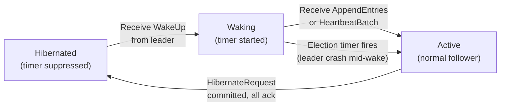
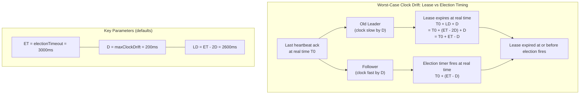
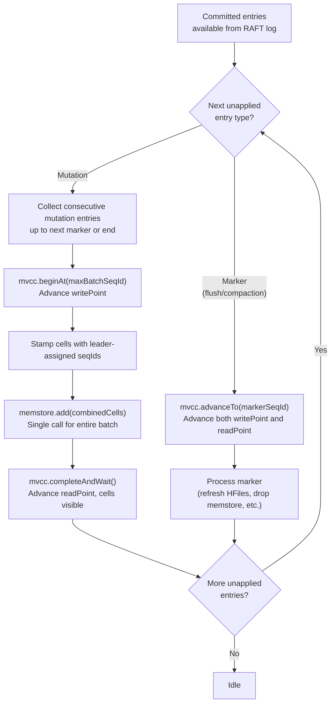
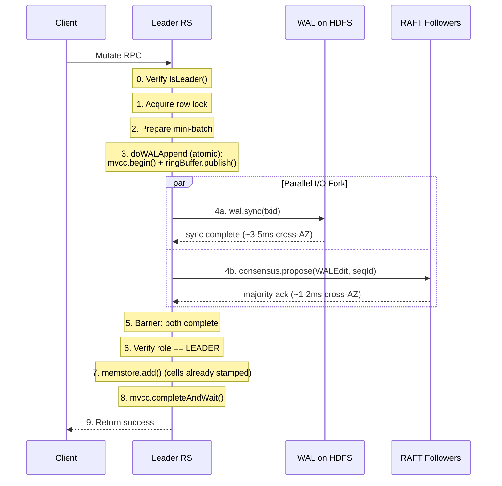
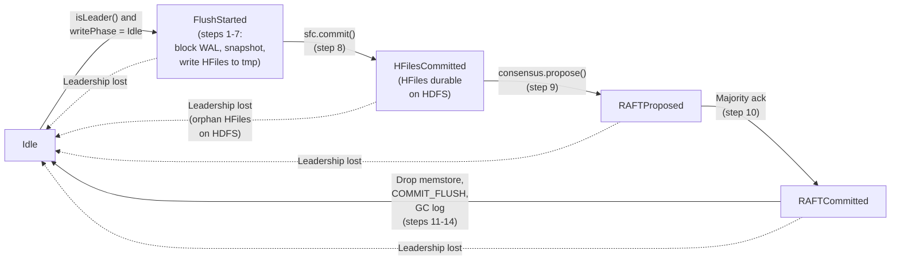
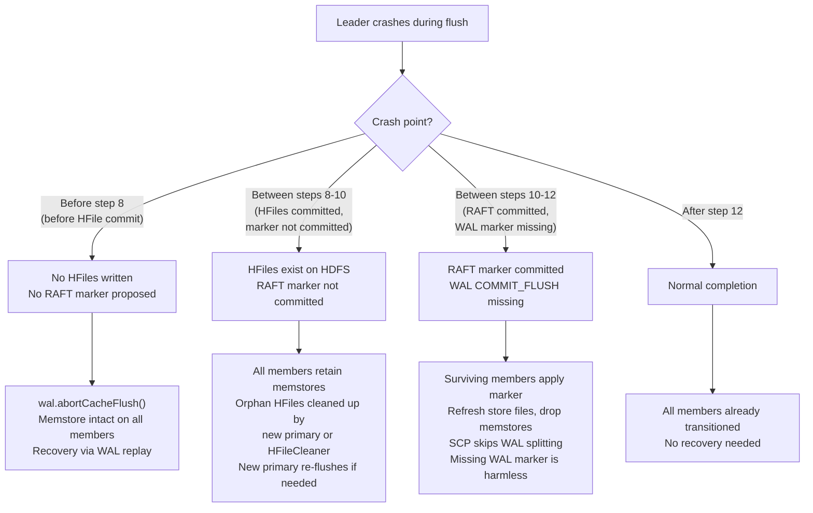
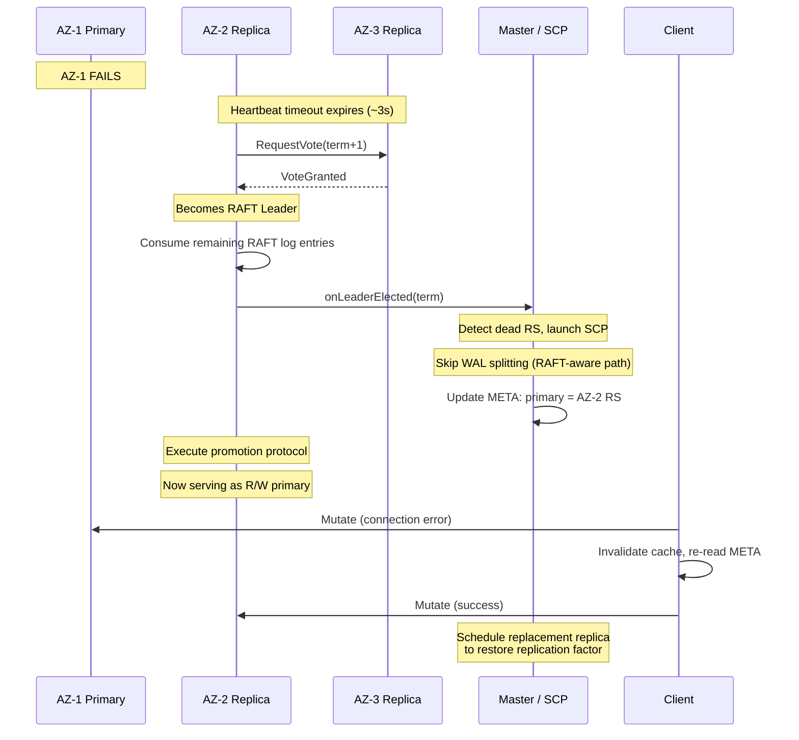
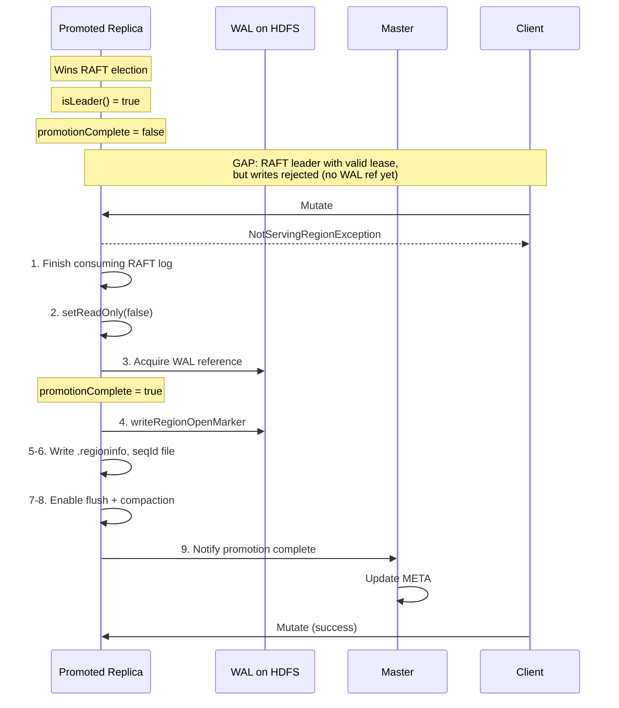

# RAFT-Based Promotable Region Replicas

## Problem Statement

HBase region replicas today are read-only, ephemeral shadows of the read-write primary. They share the primary's store files via HFileLink, receive data via async WAL replication, and cannot be promoted. When the read-write primary fails, the master must reassign the primary replica to a new RegionServer, replay recovered edits, and restart, a process that takes seconds to minutes and involves WAL splitting. Read-only replicas are useless during this window except for serving stale reads.

## Vision

This design introduces a purpose-built RAFT consensus layer whose initial scope is region replica memstore replication for sub-second promotion of a read-only replica into a read-write mastering primary. However, the consensus engine is architected as a general-purpose component, operating on opaque groups, entries, and pluggable callbacks, that deliberately does not foreclose broader use. Over time, the same engine can subsume ZooKeeper's remaining roles in HBase (master election, server liveness tracking, cluster metadata, replication state), ultimately eliminating ZooKeeper as an external dependency of HBase and Phoenix entirely. 

Appendix A outlines a phased roadmap for this evolution.

Appendix B presents the formal TLA+ specification, model checking results, and design findings. The specification models the core protocols of `hbase-consensus` and their integration points with HBase's region lifecycle, targeting the properties that are most difficult to reason about informally. The full specification is included in Appendix B in its entirety.

## Deployment Model

The target deployment spans three AZs within a single AWS region (e.g., us-east-1a, us-east-1b, us-east-1c). These are physically independent datacenters located within a few miles of each other, providing sub-millisecond to low-single-digit-millisecond inter-AZ network latency (well-suited for synchronous RAFT consensus), independent power, cooling, networking, and physical infrastructure per AZ, and the property on offer is resource independence, not distance-based disaster recovery.

The replication factor is 3, with one RAFT member per AZ. Loss of any single AZ means loss of one RAFT member, which is tolerated by a 3-member group (majority = 2). The surviving two members in the remaining AZs continue serving reads and writes without interruption.

```
               ┌─────────────────────────────────────────────────────────┐
               │                AWS Region (e.g. us-east-1)              │
               │                                                         │
               │  ┌──────────────┐  ┌──────────────┐  ┌──────────────┐   │
               │  │    AZ-1      │  │    AZ-2      │  │    AZ-3      │   │
               │  │              │  │              │  │              │   │
               │  │ ┌──────────┐ │  │ ┌──────────┐ │  │ ┌──────────┐ │   │
               │  │ │    RS    │ │  │ │    RS    │ │  │ │    RS    │ │   │
               │  │ │  RAFT    │ │  │ │  RAFT    │ │  │ │  RAFT    │ │   │
               │  │ │ Member 1 │ │  │ │ Member 2 │ │  │ │ Member 3 │ │   │
               │  │ │  (R/W    │ │  │ │(Read-Only│ │  │ │(Read-Only│ │   │
               │  │ │ Primary) │ │  │ │ Replica) │ │  │ │ Replica) │ │   │
               │  │ └─────┬────┘ │  │ └─────┬────┘ │  │ └─────┬────┘ │   │
               │  └───────┼──────┘  └───────┼──────┘  └───────┼──────┘   │
               │          │   <2ms latency  │                 │          │
               │          └─────────────────┼─────────────────┘          │
               │                            │                            │
               │                   RAFT Group (per region)               │
               │                                                         │
               │           ┌────────────────────────────────┐            │
               │           │     HDFS (shared HFiles)       │            │
               │           │   Single copy, read by all     │            │
               │           └────────────────────────────────┘            │
               └─────────────────────────────────────────────────────────┘
```

If AZ-1 is lost, the master detects the dead regionserver(s) and launches ServerCrashProcedure. For RAFT-enabled regions on the crashed server, the consensus layer has already detected the missing member via heartbeat timeout and elected a new RAFT leader among the surviving read-only replicas. SCP skips WAL splitting for these regions because the promoted read-only replica already has a warm memstore from RAFT replication and does not need WAL splitting. SCP promotes the RAFT-elected read-only replica to the new read-write primary, updating META to point clients at its location. The promoted replica finishes consuming any remaining RAFT log entries to bring its memstore fully current, then immediately serves reads and writes as the new read-write primary using the shared HFiles on HDFS. The old primary's WAL on HDFS still exists but is not needed for the promoted replica's recovery; WAL splitting may still run for housekeeping but is not on the critical failover path. Clients discover the new primary through the standard HBase region location mechanism, the same path used for any region move. SCP also schedules a replacement replica assignment in a healthy AZ to restore the required replication factor.

## Design Overview

We replace the current async replication model with RAFT consensus groups at the region level, using a purpose-built lightweight consensus layer tailored to the specific requirement of keeping read-only replica memstores warm for fast promotion to read-write primary. The consensus layer implements the subset of RAFT needed for region replication (leader election, ordered log replication to 2 followers, and term/epoch fencing) with an architecture designed from the outset for O(10000) groups per RegionServer.

Each set of replicas for a region forms a RAFT group. The read-write primary (RAFT leader) accepts client writes, writes to the HBase WAL on HDFS for durability, and simultaneously replicates edits through RAFT to keep read-only replica memstores warm. WAL and RAFT operate in parallel on the leader, joined by a barrier. The read-write primary alone writes HFiles to HDFS; read-only replicas (RAFT followers) share those HFiles for reads and maintain their own memstores via RAFT log replay. RAFT is an internal implementation detail invisible to clients. Clients continue to interact with the read-write primary through the standard HBase client protocol (master -> META -> RegionServer), unchanged from non-replicated tables.

```
          ┌───────────────── RAFT Group for Region R ────────────┐
          │                                                      │
          │  ┌──────────────────┐        ┌──────────────────┐    │
          │  │ R/W Primary(AZ-1)│  RAFT  │ R/O Replica(AZ-2)│    │
          │  │  [RAFT leader]   │───────►│ [RAFT follower]  │    │
          │  │  ┌────────────┐  │memstore│  ┌────────────┐  │    │
          │  │  │  Memstore  │  │  repl  │  │  Memstore  │  │    │
          │  │  └─────┬──────┘  │        │  └────────────┘  │    │
          │  │        │ flush   │        └──────────────────┘    │
          │  │  ┌─────▼──────┐  │                 ▲              │
          │  │  │  HBase WAL │  │                 │ RAFT repl    │
          │  │  │ (parallel) │  │        ┌────────┴─────────┐    │
          │  │  └─────┬──────┘  │        │ R/O Replica(AZ-3)│    │
          │  └────────┼─────────┘        │ [RAFT follower]  │    │
          │           │                  │  ┌────────────┐  │    │
          │           │ flush            │  │  Memstore  │  │    │
          │           ▼                  │  └────────────┘  │    │
          │  ┌──────────────────┐        └──────────────────┘    │
          │  │  HFiles (HDFS)   │                                │
          │  │  single copy     │◄── read by all members         │
          │  │  written by      │                                │
          │  │  primary only    │                                │
          │  └──────────────────┘                                │
          └──────────────────────────────────────────────────────┘
```

There is only one set of HFiles per region, always written by the read-write primary to HDFS. Read-only replicas read those same HFiles. The read-write primary writes to the HBase WAL on HDFS for durability (exactly as today) and simultaneously replicates edits through RAFT to keep read-only replica memstores warm; both operations run in parallel, joined by a barrier. Each member maintains its own memstore (populated by applying RAFT log entries). When the read-write primary flushes, it writes HFiles to HDFS first, then proposes a flush-complete marker through RAFT; all read-only replicas pick up the new HFiles and drop their memstores. The storage overhead of read-only replicas is limited to lightweight local RAFT log segments (GC'd after each flush) and memstore memory. There is no additional HDFS write amplification from RAFT. The only HDFS writes are the WAL (by the leader, as today) and HFiles (on flush/compaction, as today).

## Consensus Layer Architecture

The consensus layer is a purpose-built, lightweight RAFT implementation in a new `hbase-consensus` module, built on MicroRaft's consensus core (Apache 2.0). Its initial scope is the narrow requirement of keeping read-only replica memstores warm for fast promotion to read-write primary. It implements the core RAFT protocol, specifically leader election, ordered log replication to a small group of followers, and term/epoch fencing. For the region replication use case, several RAFT features are unnecessary and omitted from the initial implementation: linearizable reads via RAFT (HBase serves reads directly), membership change protocol (the HBase Master controls membership via region open/close), and snapshot transfer over the consensus transport (shared HDFS handles catch-up).

MicroRaft provides a single-threaded actor model Raft implementation with only one runtime dependency on SLF4J. The pluggable interfaces `Transport`, `StateMachine`, `RaftStore`, `RaftNodeExecutor`, `RaftModelFactory`, and `Clock` allow adaptation without modifying the core protocol state machine. The core protocol features that transfer directly to hbase-consensus: leader election with pre-vote, leader stickiness, vote durability before response via `RaftStore.persistAndFlushTerm()`, immediate heartbeat on election win (`toLeader()` atomically calls `broadcastAppendEntriesRequest()`), new-term entry on election, term fencing and step-down, deterministic commit-index advancement, parallel leader flush, single-server membership changes with committed-entry-in-current-term guard, and leadership transfer with stickiness bypass. Three areas require modification: leader lease timing (add clock-drift compensation), snapshot transfer (replace with shared-storage catch-up), and multi-group scaling (build shared event loop, heartbeat coalescing, and unified log atop MicroRaft's per-group FSM). The subsequent subsections describe these modifications alongside the features they extend.

Architecturally, the `ConsensusServer` is a general-purpose RAFT engine. It manages groups, replicates opaque log entries, runs leader elections, and invokes pluggable callbacks on commit. The region-specific logic lives entirely in the callback implementation and in `RegionGroupManager`, not in the consensus engine itself. This separation is deliberate. It keeps the door open for the consensus layer to serve other coordination needs in HBase's architecture over time (see Appendix A).

The architecture is designed from the start for O(10000) groups per RegionServer, incorporating proven patterns from TiKV (shared event loop, hibernate regions), CockroachDB (store-level heartbeat coalescing), and Redpanda (lightweight heartbeats).

### Vote State Durability

RAFT's leader uniqueness guarantee depends on each member voting for at most one candidate per term. If a member crashes after sending a vote response but before persisting its `votedFor` state, it could vote again for a different candidate after restart, producing two leaders in the same term.

The `hbase-consensus` implementation must persist `votedFor` and `currentTerm` to durable local storage (the local RAFT log segment) before sending the `RequestVoteResponse`. This is a standard RAFT requirement but is worth calling out explicitly because the local RAFT log is not a durability mechanism for data. That role belongs to the WAL on HDFS. For vote state, however, local persistence is the durability mechanism. HDFS is not involved in the vote path, and the single-threaded actor model alone is insufficient because it does not survive process restart. The implementation must treat a crash before `votedFor` persistence as equivalent to not having voted. MicroRaft enforces this ordering: `VoteRequestHandler` calls `state.grantVote()` which invokes `RaftStore.persistAndFlushTerm()` synchronously before the response is sent; the `RaftSqliteStore` implementation uses SQLite WAL journal mode with `SYNCHRONOUS = EXTRA` and an explicit `Connection::commit` to ensure durability.

On restart, the member resumes at its persisted term and votedFor. It does not increment its term. MicroRaft's `RaftState.restore()` reconstructs the `RaftTermState` from the persisted `term` and `votedFor`, and the member starts as a Follower with no leader. The restarted member learns the current cluster term from the first heartbeat or vote request it receives, stepping up to that term via the standard term-fencing rule.

### Multi-RAFT on a Single RegionServer

A RegionServer hosts many regions. The consensus layer runs all RAFT groups within a single `ConsensusServer` instance using a shared event-loop architecture. A fixed-size thread pool of O(CPU cores) worker threads (`hbase.consensus.worker.threads`, default 2 * cores) services all groups. Each group is a lightweight FSM struct with a bounded MPSC queue as its mailbox. When a group has new work the work item is enqueued in its mailbox and the group is scheduled onto the pool; a pool thread dequeues and processes the work item, then moves to the next group. No per-group threads exist.

MicroRaft provides the per-group FSM: each `RaftNode` instance encapsulates a complete Raft state machine (term, role, log, leader/candidate/follower state) and processes events serially via a `RaftNodeExecutor`. The `RaftNodeExecutor` interface has three methods: `execute(Runnable)`, which must guarantee serial execution per group; `submit(Callable)`, which wraps `execute` and returns a `Future`; and `schedule(Runnable, delay, unit)`, which defers a task for later serial execution. MicroRaft's default `DefaultRaftNodeExecutor` implements this interface by creating a dedicated `ScheduledExecutorService` with a single thread per `RaftNode` instance. At ten thousand groups, this means ten thousand threads (plus their stack memory, context-switch overhead, and scheduler pressure), which is untenable.

The `MultiGroupExecutor` replaces the per-group executor with a single `ScheduledThreadPoolExecutor` whose thread count is `O(CPU cores)` (`hbase.consensus.worker.threads`, default 2 * cores). Each group receives a bounded MPSC (multi-producer, single-consumer) mailbox backed by a lock-free queue. When `execute(task)` is called on a group's executor, the task is enqueued into the group's mailbox and an atomic `scheduled` flag is tested-and-set. If the flag transitions from unset to set, the group is submitted to the shared pool as a `Runnable`. If the flag was already set, the group is already scheduled and the enqueue alone suffices. A pool thread that picks up the group runs a drain loop: it dequeues and executes each task serially from the mailbox until the mailbox is empty, then clears the `scheduled` flag. If the mailbox is non-empty after clearing (a race with a concurrent `execute` call), the group re-submits itself to the pool. This protocol guarantees serial execution per group (only one pool thread ever runs a group's tasks at a time) while multiplexing all groups onto the fixed pool without per-group thread allocation.

For `schedule()`, MicroRaft uses it primarily for `HeartbeatTask` (a self-rescheduling timer per group) and `RaftStateSummaryPublishTask`. Under the store-level heartbeat sweep model described below, per-group `schedule()` calls for heartbeats are eliminated entirely. The executor's `schedule()` method is retained only for infrequent per-group timers such as election timeout. These use the shared pool's `ScheduledExecutorService.schedule()` with the scheduled task wrapping the group's `execute()` method to preserve serial execution: the timer fires, calls `group.execute(electionTask)`, and the electionTask runs within the drain loop alongside other group work.

The drain-on-schedule semantics are the foundation for leader proposal micro-batching. When a pool thread runs a group, it drains all pending items from the mailbox rather than processing one at a time. Multiple proposals that accumulate in the mailbox while the previous drain is in-flight are collected and batched by the next pool invocation. The `RaftNodeExecutor` interface is pluggable (MicroRaft's `RaftNodeBuilder.setExecutor()`), so the `MultiGroupExecutor` does not require modifying `RaftNodeImpl`.

MicroRaft's `Transport` interface (`send(endpoint, message)`) is similarly wrapped by a coalescing transport that buffers outbound messages per-peer per-tick and flushes them as batched frames. MicroRaft's `RaftStore` interface is replaced by the unified multiplexed log, which implements `RaftStore` by tagging entries with `groupId` and writing to the shared append-only file.

As regions are opened and closed, RAFT groups are dynamically added and removed via the `RegionGroupManager`:

```java
regionGroupManager.addGroup(regionInfo, peerList);   // on region open
regionGroupManager.removeGroup(regionInfo);           // on region close
```

### Leader Proposal Micro-Batching

When the event loop schedules a group, it drains the group's mailbox of all pending proposals rather than processing one at a time. Multiple proposals are combined into a single AppendEntries message carrying multiple WALEdit entries. One serialization pass, one consensus log write, one network send, and one consensus round amortize across N proposals.

Under low load the batch is typically one entry (no added latency). Under sustained write load, proposals naturally accumulate while the previous AppendEntries is in flight, filling batches without any artificial delay. The maximum batch size is capped by `hbase.consensus.propose.batch.max.entries` (default 16) to bound per-message size and keep apply latency predictable.

On the follower side, the batched AppendEntries is persisted to the consensus log as a single write and acknowledged as a unit. The entries within the batch share one log fsync (via the unified multiplexed log's coalescing window), further amortizing I/O.

This is the single highest-impact CPU optimization for the consensus layer. TiKV's adaptive batching (default wait_duration 20us, batch_size_hint 8KB) and CockroachDB's entry application batching (measured at +48% throughput, -34% average latency on sequential write workloads, per CockroachDB PR #38568) demonstrate the effectiveness of this pattern in production multi-RAFT systems.

### Transport: Netty+Protobuf

MicroRaft's `Transport` interface is instantiated per `RaftNode`. Each `RaftNodeImpl` holds its own `Transport` reference and calls `transport.send(target, message)` for individual messages. Messages carry `groupId` via `RaftMessage.getGroupId()`, so routing is possible even with a shared transport instance. The `CoalescingTransport` exploits this by providing a single `Transport` instance shared across all `RaftNode` instances on the RegionServer.

The `CoalescingTransport` implements MicroRaft's `Transport` interface and maintains one Netty TCP connection per peer, lazily connected with automatic reconnection on failure. The consensus module registers a protocol handler on a dedicated Netty port (`hbase.consensus.port`), reusing HBase's existing Netty infrastructure. The wire format is Protobuf. No TLS configuration is needed because the encrypted overlay network already provides confidentiality and integrity for inter-AZ traffic. Netty is already a core HBase dependency (used by AsyncFSWAL and the async RPC client), so no new dependencies are introduced.

Each peer has an outbound buffer backed by a lock-free MPSC queue. When `send()` is called by any `RaftNode`, the message is appended to the target peer's outbound buffer. A flush hook, invoked by the heartbeat sweep timer or a dedicated flush timer at the consensus log sync batch interval (`hbase.consensus.log.sync.batch.ms`), drains each peer's buffer and builds coalesced frames. Data-carrying messages are coalesced into `BatchAppendEntries` frames; heartbeats are coalesced into `HeartbeatBatch` frames. The Protobuf `entries` field carries the WALEdit's pre-serialized byte buffer directly (the same bytes destined for the WAL write path), avoiding re-serialization through the Protobuf envelope.

All messages for all groups between two RegionServers multiplex over a single TCP connection per peer.

When the flush hook fires and multiple groups have pending AppendEntries to the same peer, they are coalesced into a single message rather than sent as individual messages:

```
message BatchAppendEntries {
  repeated GroupAppendEntries groups = 1;
}
message GroupAppendEntries {
  bytes group_id = 1;
  uint64 term = 2;
  uint64 prev_log_index = 3;
  uint64 prev_log_term = 4;
  repeated bytes entries = 5;   // opaque WALEdit bytes, no re-encoding
  uint64 leader_commit = 6;
}
```

This reduces syscall and TCP framing overhead from O(active groups) to O(peers) per tick, the same reduction heartbeat coalescing achieves for liveness traffic, now applied to the data path. On the follower, only the envelope header fields are parsed; the WALEdit bytes are passed opaquely to the apply callback. TiKV's `batch_raft` RPC demonstrates this pattern reducing gRPC CPU usage significantly under multi-RAFT workloads.

On the inbound side, the Netty handler deserializes the batch frame, iterates per-group entries, and dispatches each to the correct `RaftNode` via `group.execute(() -> node.handleAppendEntries(...))`, preserving per-group serial execution through the `MultiGroupExecutor`. The group lookup is a constant-time operation against the `ConsensusServer`'s group registry. Vote requests and responses, which are infrequent and latency-sensitive, bypass the outbound coalescing buffer and are sent immediately as individual frames.

### Store-Level Heartbeat Coalescing

MicroRaft's `HeartbeatTask` is a per-group `Runnable` that self-reschedules at `leaderHeartbeatPeriodSecs` (default 2 seconds). On each firing, a leader group calls `broadcastAppendEntriesRequest()` to all followers, while a follower group checks whether the leader heartbeat timeout has elapsed and triggers a pre-vote if so. At ten thousand groups, ten thousand independent timers fire and process independently, consuming scheduler slots and producing ten thousand individual network messages per heartbeat period. The store-level sweep replaces these per-group timers with a single timer at the `ConsensusServer` level.

A single `ScheduledExecutorService` timer fires at `hbase.consensus.heartbeat.interval.ms` (default 500ms). On each tick, the sweep iterates all active (non-hibernated) groups, partitioned by role. For leader groups, the sweep collects `{groupId, term, commitIndex, lightweight}` tuples from all groups destined for the same peer and builds one `HeartbeatBatch` message per peer, sent via the shared transport. For follower groups, the sweep checks each group's `lastHeartbeatReceivedTime` against `leaderHeartbeatTimeoutMs` and, if elapsed, triggers election via the group's executor (`group.execute(electionTask)`) to preserve serial execution. The sweep itself runs on a dedicated timer thread (not the group executor pool) to avoid priority inversion; the actual election processing and heartbeat response handling runs within each group's `execute()` method and therefore within the drain loop of the `MultiGroupExecutor`.

Each RegionServer maintains one connection per remote RS. The sweep builds a single coalesced `HeartbeatBatch` message per peer per tick:

```
message HeartbeatBatch {
  repeated GroupHeartbeat groups = 1;
}
message GroupHeartbeat {
  bytes group_id = 1;     // 16 bytes (encoded region name hash)
  uint64 term = 2;
  uint64 commit_index = 3;
  bool lightweight = 4;   // true if nothing changed since last heartbeat
}
```

This reduces heartbeat network messages from O(groups) to O(peers) = O(2) per tick, regardless of group count. When `lightweight = true` (nothing changed since last heartbeat), the follower skips full validation and simply confirms liveness. For a typical mix (80% idle/hibernated, 20% active), the coalesced heartbeat message for 1000 active groups is ~17KB per peer per tick.

When a `HeartbeatBatchResponse` arrives from a peer, it carries per-group ack or nack results. The transport demultiplexes the response and dispatches each group's result via `group.execute(() -> node.handleHeartbeatResponse(peerId, term))`, preserving per-group serial execution. This demultiplexing is a constant-time lookup in the group registry (a `ConcurrentHashMap<GroupId, GroupContext>`) and does not require iterating all groups.

### Hibernate Idle Groups

After a flush-complete marker is committed and no subsequent writes arrive for a configurable timeout (`hbase.consensus.hibernate.timeout.ms`, default 10000), the leader proposes a `HibernateRequest` through the group. When all members acknowledge, the group enters hibernate state: the leader stops including the group in `HeartbeatBatch` messages, followers stop expecting heartbeats for it (preventing false election timeouts), and the group's FSM remains in memory (a small fixed-size struct) but consumes zero CPU and zero network. On the next write to the region the write path wakes the group by having the leader send a `WakeUp` message to followers, wait for acknowledgment, then resume normal operation and propose the write. The cost of waking a hibernated group is one additional round-trip (roughly 1-2ms inter-AZ) on the first write after hibernation, amortized over the write burst that follows.

A follower's hibernate/wake lifecycle has three states: `Hibernated`, `Waking`, and `Active`. In `Hibernated` state the follower's election timer is suppressed. When a follower receives a `WakeUp` message from the leader it transitions to `Waking`, sends a `WakeUpResponse`, and starts its election timer. The transition to `Active` occurs when the follower receives the first `AppendEntries` or `HeartbeatBatch` entry for this group from the leader, confirming the leader is alive and operating normally. If the leader crashes during the wake protocol, having sent `WakeUp` but not yet any AppendEntries, the follower is in `Waking` state with its election timer already running. When the timer fires the follower transitions to `Active` and initiates a normal election, ensuring liveness is maintained. The key invariant is that a follower's election timer must be started no later than receipt of `WakeUp`, so a leader crash mid-wake cannot leave followers permanently hibernated without election capability.



Since RAFT is not the durability mechanism, hibernation is safe. If the leader crashes while groups are hibernated, followers recover from HFiles on HDFS plus WAL splitting. For fully hibernated groups the followers' election timers are suppressed, so these groups must be woken by an external mechanism. When SCP detects the crashed RegionServer it triggers a wake for all hibernated groups on that server by sending region-open RPCs to the surviving replicas, which restarts the RAFT state machine and initiates elections. Failover latency for hibernated groups is therefore bounded by SCP detection time (typically around 30 seconds, governed by the RegionServer heartbeat timeout to the master) rather than by the sub-second RAFT election timeout that applies to active groups. This is an acceptable tradeoff: hibernated groups have no in-flight data because all data was flushed before hibernation, so the longer recovery path does not risk data loss, and the idle regions were not serving active traffic. In typical HBase workloads many regions are idle at any given moment, so hibernation eliminates the majority of per-group overhead.

### Unified Multiplexed Consensus Log

MicroRaft's `RaftStore` interface is instantiated per `RaftNode`. Each `RaftNode` receives its own `RaftStore` instance, managing independent storage and issuing independent `flush()` calls for fsync. The interface has nine methods covering endpoint persistence (`persistAndFlushLocalEndpoint`), membership persistence (`persistAndFlushInitialGroup`), term and vote persistence (`persistAndFlushTerm`), log entry persistence (`persistLogEntries`), snapshot chunk persistence (`persistSnapshotChunk`), log truncation in both directions (`truncateLogEntriesFrom`, `truncateLogEntriesUntil`), snapshot deletion (`deleteSnapshotChunks`), and flush (`flush`). At ten thousand groups, ten thousand independent `flush()` calls means ten thousand independent `fdatasync` syscalls, which is untenable.

Instead of per-group log files, the consensus layer writes a single append-only log file per RS to local NVMe, multiplexing entries from all groups, exactly as `AbstractFSWAL` already multiplexes entries from all regions into one WAL file. The `UnifiedRaftStore` is a single instance wrapping the shared append-only log file. Each `RaftNode` receives a `GroupRaftStore` adapter that implements MicroRaft's `RaftStore` interface by delegating to the shared store with its `groupId` prefix. When `persistLogEntries()` is called, each entry is tagged with `groupId` and appended to the shared log. When `persistAndFlushTerm()` is called, a term-update record tagged with `groupId` is written to the shared log. When `flush()` is called, a sync request is enqueued; the `UnifiedRaftStore` batches `fdatasync` across all groups with pending writes per coalescing window (`hbase.consensus.log.sync.batch.ms`, default 10ms), amortizing the syscall cost across all concurrent writers. When `truncateLogEntriesFrom()` or `truncateLogEntriesUntil()` is called, a truncation tombstone record is appended to the shared log rather than physically deleting entries; physical deletion is deferred to log file GC.

A per-group in-memory index maps `(groupId, logIndex)` to file offset for fast replay during catch-up. This index is rebuilt lazily on first access after restart by scanning the relevant log segments. Log rolling occurs at a segment size threshold (`hbase.consensus.log.segment.size.mb`, default 256MB). Old segments are deleted when all groups referenced in them have advanced past their entries. GC accounting uses a map from `GroupId` to `lastAppliedFlushSeqId`; a segment is eligible for deletion when the minimum `lastAppliedFlushSeqId` across all groups referenced in the segment exceeds the segment's maximum seqId. On flush-complete for a group, that group's `lastAppliedFlushSeqId` is updated and the GC check is triggered. Since the consensus log is not the durability mechanism, crash safety requirements are relaxed: a crash loses at most one coalescing window of RAFT entries, which are recovered from the HDFS WAL or from the leader's RAFT log via `AppendEntries`.

### AsyncFSWAL as RAFT Consensus Log

The design calls for a unified multiplexed consensus log on local NVMe that multiplexes entries from all RAFT groups into a single append-only file with batched sync, segment rolling, and per-group GC accounting. `AbstractFSWAL` already implements exactly this pattern for HBase regions on HDFS. A single LMAX Disruptor ring buffer, a single consumer thread that drains appends and syncs, batched I/O up to a configurable threshold, segment rolling, and per-region GC accounting. Rather than building a second log implementation from scratch, `AbstractFSWAL` is extended to support a second instance on local NVMe for the RAFT consensus log, reusing its ring buffer, consumer thread, batched sync, rolling, and GC machinery.

Two `AbstractFSWAL` instances run per RegionServer. The first is the existing WAL instance writing to HDFS via `AsyncFSWAL` or `FSHLog`, unchanged. The second is a new consensus log instance writing to local NVMe, configured with relaxed sync semantics and RAFT-specific GC. Both instances are created by a `WALFactory` extension that recognizes the consensus log role. RAFT consensus log entries use the existing `WAL.Entry` format (`WALKeyImpl` + `WALEdit`). RAFT-specific metadata (groupId, term, logIndex) is carried in `WALKeyImpl.extendedAttributes`. The `encodedRegionName` field is set to the groupId (derived from region identity, excluding replicaId). The `sequenceId` field carries the leader-assigned HBase seqId, bridging RAFT log indexing to HBase MVCC.

On the leader, RAFT entries flow through the normal MVCC path; the leader writes to both the HDFS WAL and the local consensus log. On followers, entries are received via RAFT `AppendEntries` and written to the local consensus log without MVCC involvement. The follower's `mvcc.beginAt()` is called during the apply callback, not during log persistence. A new `appendRaftEntry()` method on `AbstractFSWAL` publishes entries to the ring buffer without calling `mvcc.begin()`, using a monotonic RAFT-local txid. The consumer's `appendEntry()` method checks an optional `raftMetadata` field on `FSWALEntry` and skips coprocessor hooks, listener notifications, and MVCC updates for RAFT entries.

`SequenceIdAccounting` is extended with a parallel `RaftSequenceIdAccounting` that tracks the oldest unflushed RAFT log index per group. On flush-complete for a group, the accounting is updated. The existing `areAllLower()` check in `cleanOldLogs()` is extended so that a WAL segment is eligible for archival only when both all HBase regions referenced in it have flushed past it and all RAFT groups referenced in it have flushed past it. This parallel accounting ensures that the consensus log instance's GC does not prematurely delete segments containing un-flushed RAFT entries for any group.

The consensus log instance uses a time-based coalescing window rather than the byte-based batch threshold used by the HDFS WAL. A periodic timer publishes a `SyncFuture` to the ring buffer, triggering a batched `fdatasync` for all entries accumulated since the last sync. Since the RAFT log is not the durability mechanism, the relaxed sync semantics are acceptable; a crash loses at most one coalescing window of RAFT entries, which are recovered from the HDFS WAL or from the leader's RAFT log via `AppendEntries`.

Log rolling for the consensus log instance uses the existing `waitForSafePoint()` mechanism. Since RAFT entries do not hold MVCC write entries open (followers use `beginAt`/`completeAndWait` only during the apply callback, which completes within a single drain loop iteration), `waitForSafePoint()` completes quickly, and rolling does not block the consensus pipeline.

### Consensus Callbacks

The integration point between the consensus layer and HRegion is a `StateMachine` adapter that bridges MicroRaft's general-purpose state machine interface to HBase-specific callbacks. MicroRaft's `StateMachine` interface has four methods: `runOperation(commitIndex, operation)` for executing committed entries, `takeSnapshot(commitIndex, chunkConsumer)` for snapshot creation, `installSnapshot(commitIndex, chunks)` for snapshot restoration, and `getNewTermOperation()` for the no-op entry appended on election. The HBase adapter implements these as follows. `runOperation()` dispatches to the appropriate callback based on the operation type (mutation batch, flush marker, compaction marker). `getNewTermOperation()` returns a lightweight no-op that triggers the leader-election callback. `takeSnapshot()` and `installSnapshot()` are implemented for the shared-storage catch-up model (see the New Member Bootstrap section): `takeSnapshot()` produces a metadata-only snapshot containing HFile paths at the snapshot point, and `installSnapshot()` triggers the HDFS-based catch-up path.

The primary callback is `onCommit(List<WALEdit, seqId>)`, called when one or more consensus entries are committed. On the leader this signals that the write-path barrier is satisfied (the consensus side is complete). On followers the callback receives the full batch of committed entries and applies them as a unit rather than one at a time. Because the leader assigns contiguous sequence IDs via proposal batching, the follower creates a single MVCC bracket for the batch: it calls `mvcc.beginAt(lastSeqId)`, stamps and collects all cells from all entries in the batch, performs one `memstore.add()` with the combined cell set, then one `mvcc.completeAndWait()`. This reduces MVCC overhead from N begin/complete cycles to one per batch. Marker entries (flush, compaction) break the batch boundary: when a marker is encountered the preceding mutation entries are applied as a batch, then the marker is processed separately. During catch-up replay the same batching applies. The follower groups committed entries into batches up to the batch size cap and applies them in bulk, accelerating catch-up significantly. CockroachDB's equivalent optimization measured +48% throughput and -34% average latency on sequential write workloads.

The remaining callbacks handle coordination events. `onFlushComplete(flushSeqId, hfilePaths)` is called when a flush-complete marker is committed; all members refresh their store file lists to pick up the new HFiles from HDFS, then drop memstore entries below `flushSeqId`. `onLeaderElected(term)` fires when a new RAFT leader is elected; the new leader's RegionServer notifies the HBase master, which uses this within ServerCrashProcedure to promote the elected replica to primary and update META. `onFollowerLagging(peerId, lagEntries)` alerts the master that a replica is lagging, which could trigger proactive rebalancing or replacement. `onNoLeader(groupId, durationMs)` alerts the RegionServer that a group has had no leader for an extended period, which could trigger client-visible error reporting.

### RegionGroupManager

`RegionGroupManager` is the region-specific layer atop the general-purpose `ConsensusServer`. It is a new component on HRegionServer that creates a single `ConsensusServer` instance per RegionServer at startup, owning the shared thread pool, unified log, and Netty transport. The `ConsensusServer` API itself is not region-aware. It operates on opaque `GroupId`, `PeerId`, and `byte[]` entries. `RegionGroupManager` bridges HBase's region abstractions to this generic API.

The component exposes `addGroup(RegionInfo, List<PeerInfo>)` and `removeGroup(RegionInfo)`, called during region open and close respectively. It maps each `RegionInfo` to a `GroupId` deterministically by hashing the table name, start key, and region ID, deliberately excluding replicaId so that all replicas of the same region join the same group. `RegionInfo.getEncodedName()` cannot be used as the GroupId because it includes replicaId in the MD5 hash for non-default replicas (`RegionInfo.createRegionName()` appends `_<replicaId>` before computing MD5 when replicaId > 0, producing entirely different encoded names per replica). The GroupId derivation must therefore normalize to replicaId=0 first, following the same pattern as `ServerRegionReplicaUtil.getRegionInfoForFs()`, which calls `RegionReplicaUtil.getRegionInfoForDefaultReplica()`. Each replica's `(serverName, replicaId)` pair is mapped to a `PeerId`. The component also supports `transferLeadership(RegionInfo, targetPeerId)` for graceful rebalancing and downgrade (see the Compatibility section).

### Dependencies

The `hbase-consensus` module is built on MicroRaft (Apache 2.0), an embedded RAFT library whose core module has no runtime dependencies beyond SLF4J. The module embeds MicroRaft's protocol state machine and plugs in HBase-specific implementations of `Transport` (Netty+Protobuf), `RaftStore` (unified multiplexed log), `RaftNodeExecutor` (shared thread pool), and a `StateMachine` adapter for the consensus callbacks. Netty and Protobuf are already HBase dependencies; no new external dependencies are introduced. MicroRaft's `RaftModelFactory` and `RaftConfig` are instantiated per `RaftNode` via `RaftNodeBuilder` but are stateless; in `hbase-consensus` a single `RaftModelFactory` instance and a single `RaftConfig` instance are shared across all groups, eliminating per-group object allocation for configuration and model objects.

### Leader Lease

RAFT does not natively provide a time-bounded leader lease. A RAFT leader knows it won an election and is sending heartbeats, but after a network partition it could still believe it is the leader until it attempts (and fails) to commit a proposal. Without a lease mechanism, a partitioned leader would serve stale reads while a new leader has already been elected by the surviving majority.

The consensus layer implements a leader lease to close this gap, following the pattern proven by TiKV ("lease read") and CockroachDB ("epoch-based leases"). The leader maintains a local `leaseExpiry` timestamp on each group's FSM struct, refreshed every time the leader receives heartbeat acknowledgments from a majority of peers:

```java
// On receiving a heartbeat response from peer P for group G:
void onHeartbeatResponse(GroupId g, PeerId p) {
    GroupState state = groups.get(g);
    state.heartbeatAcks.add(p);
    if (state.heartbeatAcks.size() >= majority) {
        state.leaseExpiry = System.nanoTime() + leaderLeaseDurationNs;
        state.heartbeatAcks.clear();
    }
}
```

The lease safety analysis depends on the leader heartbeating *all* followers every tick, not a subset. The implementation satisfies this because `HeartbeatBatch` is sent to all peers every tick and the lease is refreshed only when a majority of acks from that round have arrived. Atomic heartbeat rounds are required.

The `leaderLeaseDuration` is set to `electionTimeout - 2 * maxClockDrift`, ensuring the leader's lease expires before any follower's election timer fires even under worst-case clock drift (verified by TLA+ model under all partition configurations and worst-case clock drift). With the default configuration (`hbase.consensus.leader.heartbeat.timeout.ms = 3000`, `hbase.consensus.heartbeat.interval.ms = 500`), a conservative `maxClockDrift` of 200ms yields `leaderLeaseDuration = 2600ms`. The leader considers itself authoritative for reads as long as `System.nanoTime() < leaseExpiry`.

The `maxClockDrift` parameter must bound the maximum relative drift between any two nodes, not the maximum absolute drift of a single node. With NTP-synchronized hosts, the maximum relative drift is bounded by twice the maximum absolute drift to NTP, since both can drift in opposite directions. The default `maxClockDrift = 200ms` assumes each node's clock is within 100ms of NTP truth, yielding a 200ms worst-case relative drift. The factor of 2 in the formula `leaderLeaseDuration = electionTimeout - 2 * maxClockDrift` accounts for two independent sources of timing error: (1) the leader's clock may run slow by up to `maxClockDrift`, causing the lease to expire later in real time; (2) a follower's clock may run fast by up to `maxClockDrift`, causing the election timer to fire earlier in real time. These combine to a worst-case timing error of `2 * maxClockDrift`.

The `consensusServer.isLeader(groupId)` check used by the read path and write path is defined as:

```java
boolean isLeader(GroupId g) {
    GroupState state = groups.get(g);
    return state.role == LEADER && System.nanoTime() < state.leaseExpiry;
}
```

If the leader is partitioned from the majority, it stops receiving heartbeat acknowledgments, `leaseExpiry` is not refreshed, and within one `leaderLeaseDuration` the check returns false. The leader stops serving reads and writes, returning `NotServingRegionException`. Meanwhile, followers whose election timers fire (after `electionTimeout`) elect a new leader. Because `leaderLeaseDuration < electionTimeout - 2 * maxClockDrift`, the old leader's lease expires before any follower's election timer fires, even under worst-case clock drift, preventing a window where two leaders serve reads simultaneously. This holds under all partition configurations combined with worst-case clock drift. The maximum assumed clock drift between RegionServers is configured via `hbase.consensus.leader.lease.clock.drift.ms` (default 200). Higher values increase the safety margin but widen the unavailability window during failover.



MicroRaft's existing `QueryPolicy.LEADER_LEASE` implements a weaker variant: it checks whether the leader has received heartbeat responses from a quorum within `leaderHeartbeatTimeoutSecs`, using the same timeout for both leader self-demotion and follower leader-death detection, with no clock drift margin. MicroRaft's own documentation warns this "cannot guarantee linearizability." Implementing the clock-drift-compensated lease described above requires several modifications to MicroRaft. A `maxClockDrift` field (default 200ms) is added to `RaftConfig`, and a `leaseExpiry` field (initialized to 0) is added to `LeaderState`. In `AppendEntriesSuccessResponseHandler`, after counting a quorum of acks (where MicroRaft currently updates `FollowerState.responseTimestamp()`), `leaseExpiry` is set to `clock.millis() + leaderLeaseDuration`, where `leaderLeaseDuration = leaderHeartbeatTimeoutMillis - 2 * maxClockDrift`. The `isLeader()` check is exposed as `role == LEADER && clock.millis() < leaseExpiry`, replacing the current `demoteToFollowerIfQuorumHeartbeatTimeoutElapsed()` check. In `HeartbeatTask`, if `clock.millis() >= leaseExpiry`, the leader steps down to Follower before sending heartbeats. The election timer in followers is unchanged (it fires at `leaderHeartbeatTimeoutSecs`). The timing relationship `leaderLeaseDuration < electionTimeout - 2 * maxClockDrift`, ensures the leader's lease expires before any follower's election timer fires (verified by the TLA+ model).

Two additional MicroRaft fixes are required. First, `AppendEntriesSuccessResponseHandler` and `InstallSnapshotResponseHandler` must step down on higher-term responses. MicroRaft's current implementation ignores higher-term responses in both handlers when the node is LEADER (it logs a warning but does not call `toFollower()`). Without this fix a stale leader could continue refreshing its lease after a new leader has been elected in a higher term. This fix is safety-critical: the formal model confirms that without it, a stale leader could refresh its lease indefinitely, violating the single-lease invariant. The `InstallSnapshotResponseHandler` fix is lower priority but the handler code remains in the codebase and must be correct. Second, `VoteRequestHandler` must reset the heartbeat timer on vote grant. MicroRaft's current implementation calls `state.grantVote()` and sends the response without calling `leaderHeartbeatReceived()`, so the voter's heartbeat timestamp is not updated. Standard RAFT specifies three events that reset the election timer (receiving an AppendEntries from the current leader, starting an election, and granting a vote) and MicroRaft only implements the first. The fix is to call `node.leaderHeartbeatReceived()` at the end of `VoteRequestHandler.handle()` after `state.grantVote()` and before sending the response. This fix improves liveness but is not required for safety: the formal model verifies all safety properties hold without the timer reset, since the atomic initial heartbeat on election immediately resets all reachable followers' timers. Without it, a voter whose election timer has already expired could immediately start its own pre-vote after voting for another candidate, causing unnecessary election disruption.

The timing constraint alone is insufficient to prevent stale reads. In standard RAFT a follower can vote for a candidate at any time if the candidate's term is higher, regardless of the follower's election timer. Leader stickiness closes this gap: a follower rejects `RequestVote` requests if it has recently received a heartbeat from the current leader (i.e., `onRequestVote()` returns a rejection if `System.nanoTime() < electionTimerExpiry`). When a member discovers a higher term it steps down to Follower and resets its `votedFor` state, making it immediately eligible to vote for a candidate in the new term, so a subsequent election can complete as fast as votes can be exchanged without waiting for any election timer. Safety depends on the election timer firing (governed by the timing constraint), not on the speed of re-voting; the leader-stickiness guard ensures that even after step-down clears `votedFor`, the member cannot vote until its election timer expires.

When a candidate wins the RAFT election it must send its initial heartbeat to all reachable followers immediately, within the same logical instant as the role transition. In practice the gap is microseconds, well below any clock tick, but the implementation must not interleave other work between the election win and the first heartbeat round. The initial heartbeat establishes the leader's lease and resets followers' election timers, which is the prerequisite for the timing analysis. Symmetrically, if a reachable follower responds to a heartbeat with a higher term, the leader must step down rather than refresh its lease. Otherwise a stale leader could heartbeat lower-term followers and refresh its lease even though a new leader had already been elected in a higher term. The implementation handles this naturally: `onHeartbeatResponse()` checks the response term and triggers step-down if it exceeds `currentTerm`, which clears the lease.

### Read Consistency

All reads are served by the read-write primary through the standard HBase read path (memstore + HFiles). Reads do not flow through the consensus layer. Before serving a read, the read-write primary's RegionServer confirms it still holds the RAFT leader lease via the `consensusServer.isLeader(groupId)` check described above. This is a local in-memory check with no network round-trip: it verifies that the leader's role is LEADER and that the lease has not expired. If the lease is valid, the read proceeds through the normal HBase read path: memstore scanner + HFile scanners, MVCC filtering, etc. If the lease has expired (leader lost due to partition or failover), the RegionServer returns `NotServingRegionException`, triggering the client's standard retry-with-META-lookup path. The staleness window is bounded by `leaderLeaseDuration` (slightly less than the RAFT election timeout): if the primary is partitioned from the majority, its lease expires within this duration and it stops serving reads.

## Storage Model

This design maintains a single copy of HFiles on HDFS, written exclusively by the read-write primary. The HBase WAL on HDFS is retained for durability, written by the leader exactly as today. The storage cost of read-only replicas is limited to lightweight local RAFT log segments and memstore memory, so there is no additional HDFS write amplification from RAFT.

If the read-write primary is lost, a read-only replica wins the internal RAFT election and SCP promotes the elected replica to the new read-write primary, updating META accordingly. The promoted replica already has a warm memstore from RAFT replication; it finishes consuming any remaining RAFT log entries to bring its memstore fully current, then immediately serves reads and writes as the new primary. The HFiles on HDFS are already available, so no WAL splitting or recovered-edits replay is needed, yielding sub-second failover. When a leader steps down gracefully (by discovering a higher term via any RPC), it retains its memstore and continues as a follower with warm data. When a leader crashes or aborts due to a WAL failure, the memstore is lost and must be reconstructed via RAFT log replay after restart.

When the old read-write primary recovers, it rejoins as a read-only replica. If it stepped down gracefully, its memstore is already warm and only entries committed since the step-down need to be applied. If it crashed, it replays RAFT log entries from its last known position to rebuild its memstore. This recovery is invisible from the client's perspective because the new primary is already serving. Once the old primary's memstore is current, it participates normally in RAFT voting and is eligible for future promotion.

If the old primary had an in-progress flush at the time of failure, the new primary detects the incomplete state. If the flush-complete marker was not committed through RAFT, no member has dropped its memstore and the data is safe; orphan partial HFiles on HDFS are cleaned up. If the flush-complete marker was committed, the HFiles are fully written (by design) and the transition stands.

## Write Path: Parallel WAL + RAFT Replication

The existing WAL subsystem (AsyncFSWAL / FSHLog) is retained for the leader. The leader write path preserves the existing atomic coupling between MVCC sequence ID assignment and WAL ring buffer slot claim, then forks WAL sync and RAFT replication in parallel. A barrier ensures both complete before the edit is applied to the leader's local memstore and made visible to readers.

On the read-write primary and RAFT leader the write path proceeds through the existing `doWALAppend()` code path, which atomically assigns a sequence ID via `mvcc.begin()`, claims a WAL ring buffer slot, stamps cells, and publishes the entry to the ring buffer, all under the MVCC `writeQueue` lock inside `AbstractFSWAL.stampSequenceIdAndPublishToRingBuffer()`. This atomic coupling is preserved unchanged for RAFT-enabled regions because it guarantees that WAL entries appear in the same order as MVCC sequence IDs. Decoupling them would allow concurrent writes to the same region (holding different row locks, both under `updatesLock.readLock()`) to interleave, producing non-monotonic seqIds in the WAL. HBase's WAL replay treats this as a serious defect. After the ring buffer entry is published (but before the WAL is synced to HDFS), the write path forks two parallel slow I/O operations: (a) WAL sync to HDFS for durability, and (b) consensus replication to followers (carrying the stamped WALEdit and sequence ID). A barrier waits for both to complete. Only then does the primary apply the edit to its local memstore via `memstore.add()` / `mvcc.completeAndWait()`.

The refactoring target is `HRegion.doMiniBatchMutate()` step 4 (`doWALAppend`): the existing call to `wal.appendData()` followed by `wal.sync()` is split so that `wal.appendData()` (which publishes to the ring buffer) runs first, then the sync and RAFT proposal run in parallel. The `AbstractFSWAL` internals are unchanged. A new `wal.appendWithoutSync()` method (or equivalent) returns the txid without blocking on HDFS, and the caller explicitly calls `wal.sync(txid)` in the parallel fork.

On read-only replicas (RAFT followers), the consensus apply callback deserializes the WALEdit and applies it to the local memstore using the leader-assigned sequence ID. Read-only replicas do not write to WAL or HFiles. They rely on the read-write primary's WAL and HFiles on HDFS for recovery.

On the leader, the sequence ID is assigned by `mvcc.begin()` inside `stampSequenceIdAndPublishToRingBuffer()`, exactly as today. This sequence ID is stamped on cells and included in the consensus message. On followers, the apply callback receives the leader-assigned sequence ID and uses a new `mvcc.beginAt(leaderSeqId)` method to create a WriteEntry at that specific sequence ID, then stamps cells and adds them to the memstore.

`mvcc.beginAt(seqId)` is a new method on `MultiVersionConcurrencyControl` with the following semantics:

```java
public WriteEntry beginAt(long seqId) {
    synchronized (writeQueue) {
        long current = writePoint.get();
        if (seqId > current) {
            writePoint.set(seqId);
        }
        WriteEntry e = new WriteEntry(seqId);
        writeQueue.add(e);
        return e;
    }
}
```

It advances the follower's writePoint to at least `seqId` and creates a WriteEntry with that value, keeping the follower's MVCC in sync with the leader. The follower's apply callback is the sole writer (the follower is read-only for client writes), so there are no concurrent `begin()` calls to conflict with. The `synchronized(writeQueue)` block is still required despite the single-writer property because `completeAndWait()`, called after batch apply, acquires the same monitor to advance `readPoint`. The `writeQueue` monitor serializes the `beginAt` to `completeAndWait` ordering, ensuring that `writePoint` is set before any completion attempt reads it. When `completeAndWait(we)` is called after the batch is applied, `readPoint` advances to `seqId`, making all cells in the batch visible to scanners atomically.

The full sequence for follower batch apply is: `beginAt(maxBatchSeqId)` to advance `writePoint` and create a WriteEntry, then stamp cells with leader-assigned seqIds, then `memstore.add(allCells)`, then `completeAndWait(we)` to advance `readPoint` and make the batch visible. If the next entry is a marker, the preceding `completeAndWait` brings `readPoint == writePoint` (no in-flight writes), at which point `advanceTo(markerSeqId)` is safe. If `markerSeqId` is less than the current `writePoint` (already advanced past by a prior batch), `advanceTo` is a no-op because `tryAdvanceTo()` checks `seqId > readPoint` before advancing. This idempotency is by construction and requires no special handling. After the marker is processed, subsequent mutation entries start a new batch.

Note: `mvcc.advanceTo()` must not be used in the per-write path because it requires no in-flight writes (`readPoint == writePoint`, enforced by a RuntimeException in `tryAdvanceTo()`) and advances both readPoint and writePoint simultaneously, which would create read holes. It is used only for marker processing in the follower apply callback (where the preceding `completeAndWait` guarantees no in-flight writes) and during `initialize()` / `reinitialize()` to set the MVCC to the last known sequence ID before replaying the consensus log tail.

HBase's WAL sequence IDs are allocated globally per-RegionServer, not per-region. On the leader, regions A and B sharing a RegionServer may receive interleaved seqIds (e.g., A:100, B:101, A:102). Each region's RAFT group replicates only its own entries, so followers of region A see seqIds 100, 102 (with a gap at 101, which belongs to region B's group). The `mvcc.beginAt(seqId)` implementation handles this correctly because it operates on the per-region `MultiVersionConcurrencyControl` and advances `writePoint` to the given value regardless of gaps. The `readPoint` advances to the `writePoint` on `completeAndWait`, which is the last seqId in the batch. Gaps are irrelevant because no WriteEntry was created at the missing values. Scanners use `readPoint` as a visibility threshold, not a contiguous counter.

During catch-up replay (after a crash-restart or `InstallSnapshot`), the follower may encounter a seqId that is less than or equal to its current `writePoint`. This can occur when `advanceTo(flushMarkerSeqId)` has already advanced `writePoint` past some post-flush entries that are now being replayed from the RAFT log. In this case, `beginAt` must still create a `WriteEntry` at `seqId` without advancing `writePoint`, which is handled by the `if (seqId > current)` guard: when the condition is false, `writePoint` is left unchanged but the WriteEntry is still created and added to the `writeQueue`. The subsequent `completeAndWait` correctly advances `readPoint` through this entry.

The TLA+ formal model captures and validates `beginAt` semantics. The safety of the `beginAt`/`advanceTo` sequencing has been verified by the TLA+ model.

RAFT log entries that do not carry mutations (e.g., flush markers, compaction markers) do not produce a memstore write but do occupy a consensus log index. On the leader, these markers also consume MVCC sequence IDs (via `mvcc.begin()` inside `WALUtil.writeMarker()`). On followers, the apply callback must not create an MVCC WriteEntry for these non-mutation entries, or the MVCC readPoint will block waiting for a contiguous completion that never arrives. Markers break the batch boundary: when a marker is encountered, the preceding mutation entries are applied as a batch (via `beginAt` / `completeAndWait`), which brings `readPoint == writePoint`. Then the marker is processed by calling `mvcc.advanceTo(markerSeqId)` to advance both points past the marker's sequence ID. This is safe because the preceding `completeAndWait` guarantees no in-flight writes. After the marker is processed, subsequent mutation entries start a new batch.



HBase's WAL sequence IDs are allocated globally per-RegionServer, not per-region. On the leader, regions A and B sharing a RegionServer may receive interleaved seqIds (e.g., A:100, B:101, A:102). Each region's RAFT group replicates only its own entries, so followers of region A see seqIds 100, 102 (with a gap at 101, which belongs to region B's group). The `mvcc.beginAt(seqId)` implementation handles this correctly because it operates on the per-region `MultiVersionConcurrencyControl` and advances `writePoint` to the given value regardless of gaps. The `readPoint` advances to the `writePoint` on `completeAndWait`, which is the last seqId in the batch. Gaps are irrelevant because no WriteEntry was created at the missing values. Scanners use `readPoint` as a visibility threshold, not a contiguous counter.

The parallel write path forks WAL sync and RAFT propose, then joins at a barrier. The barrier requires both operations to complete successfully before proceeding to `memstore.add()` / `mvcc.completeAndWait()`. The failure modes below were modeled and verified (`WriteBarrierSafety`, `WALSyncFailureSafety`; see Appendix B).

If the leader's WAL sync fails (HDFS pipeline broken, DataNode failure), the leader aborts the RegionServer process regardless of the RAFT propose outcome. This is consistent with HBase's existing behavior on WAL sync failure (`AbortServer` → `RegionServerAbortedException`). Two sub-cases arise. If the RAFT propose has already committed, the entry is irrevocable because followers have it, and after SCP/RAFT failover the promoted replica serves it. If the RAFT propose has not yet committed (still in-flight or not yet proposed), the entry may or may not eventually commit through RAFT before the abort completes. If it commits, the first case applies. If it does not, the entry is lost entirely, but the client was never acknowledged (the barrier never passed), so no data loss is observable. In both sub-cases, the abandoned WAL entry (published to the ring buffer in step 3d, possibly synced to HDFS before the failure) is harmless: RAFT-enabled regions bypass WAL splitting during SCP (see `NoSCPWALSplit`), and the consumed sequence ID gap is handled correctly by MVCC (scanners use `readPoint` as a visibility threshold, not a contiguous counter).

If the leader discovers a higher term while a write is in the parallel fork (via a heartbeat response, vote request, or any RPC carrying a higher term), it steps down to Follower and the in-flight write is abandoned. The write thread, still blocked on the barrier, eventually unblocks: the WAL sync completes or fails independently (HDFS is unaware of RAFT state), while the RAFT propose fails because the node is no longer leader. Upon unblocking, the write thread finds the node is no longer in the Leader role and skips `memstore.add()`. MVCC cleanup proceeds via the existing finally block in `doMiniBatchMutate()`: `mvcc.complete(we)` (not `completeAndWait`) releases the WriteEntry from the writeQueue, allowing `readPoint` to advance past the abandoned entry. The client receives an error and retries against the new leader. If the entry was RAFT-committed before the step-down, the new leader has it and will serve it. If not, it is lost, but the client was never acknowledged.

After the barrier completes successfully (both WAL sync and RAFT commit succeeded), the write path verifies that the node still holds the Leader role before applying the write to the memstore (step 6). This is a role check (`role == LEADER`), not a full lease check (`isLeader()`), because the write has already achieved both local durability (WAL on HDFS) and replicated durability (RAFT commit to majority). The lease may safely expire during the fork. The timing relationship guarantees no new leader can be elected until after the old leader's lease expires, and even if a new leader is elected by this point, the RAFT commit confirms the entry is part of the committed log. Skipping a fully-committed write would cause the leader's memstore to diverge from followers' memstores. The `isLeader()` check gates only write *entry* (step 0), not write *completion*. This design choice is confirmed by the formal model. The write barrier safety invariant holds across all reachable states with the role check, including states where the lease has expired during the parallel fork.

WAL markers(flush, compaction, region open/close) are also proposed through RAFT so all members see them in the same order.

RAFT-enabled tables must use `SYNC_WAL` or `FSYNC_WAL` durability for the "no data loss" failover guarantee. Table creation and alteration reject `ASYNC_WAL` for tables with `hbase.raft.enabled = true`. Additionally, the per-mutation write path enforces this at runtime: `HRegion.getEffectiveDurability()` upgrades `ASYNC_WAL` to `SYNC_WAL` for RAFT-enabled regions, so that even if a client sets `Mutation.setDurability(Durability.ASYNC_WAL)`, the write still waits for both WAL sync and RAFT commit before acknowledging.

The critical sequence in `HRegion.doMiniBatchMutate()` for RAFT-enabled regions:



```
Leader write path:
  0. Verify isLeader(groupId)                                [role == LEADER && lease valid]
  1. Acquire row lock
  2. Prepare mini-batch (timestamps, cells)
  3. doWALAppend (atomic, unchanged from current code):
     a. mvcc.begin() + ringBuffer.next()                     [atomic under writeQueue lock]
     b. Create FSWALEntry, stampRegionSequenceId(we)         [stamp seqId on all cells]
     c. ringBuffer.get(txid).load(entry)                     [load entry into ring buffer]
     d. ringBuffer.publish(txid)                             [make available to WAL writer]
     (WAL entry is queued but NOT yet synced to HDFS)
  4. Fork two parallel I/O operations:
     a. WAL: wal.sync(txid)                                  [HDFS durability, ~3-5ms cross-AZ]
     b. RAFT: consensus.propose(stampedWALEdit, seqId)       [memstore replication, ~1-2ms]
  5. Barrier: both complete successfully
     On WAL sync failure: abort RS (WALFailureAbort)
     On RAFT propose failure: skip to error return
  6. Verify role == LEADER                                   [step-down guard; NOT a lease check]
     If not: skip 7-8, mvcc.complete(we), return error
  7. memstore.add()                                          [cells already stamped]
  8. mvcc.completeAndWait(we)                                [make visible to readers]
  9. Return to client

Follower path (driven by consensus apply callback, batch of N entries):
  1. for each entry: deserialize(walEdit_i, seqId_i)
  2. if entry is a marker: break batch
  3. WriteEntry we = mvcc.beginAt(seqId_N)                   [single bracket at last seqId]
  4. for each entry: stampCells(walEdit_i, seqId_i)          [stamp each entry's cells]
  5. memstore.add(allCells)                                  [one call with combined cells]
  6. mvcc.completeAndWait(we)                                [one completion for entire batch]
  (no WAL write, no HFile write)

Follower marker handling (flush/compaction/open/close markers):
  1. Complete any preceding mutation batch (steps 3-6 above)
     (this brings readPoint == writePoint)
  2. mvcc.advanceTo(markerSeqId)                             [safe: no in-flight writes]
  3. Process marker (refresh store files, drop memstore)
  4. Resume batching subsequent mutation entries
```

## Region Split and Merge

Region splits and merges are fundamental HBase operations that must work correctly with RAFT groups.

### Split

The split is coordinated through the existing `SplitTableRegionProcedure` on the master. The primary proposes a "region-close / split" marker through RAFT, and the master's procedure waits for this marker to be RAFT-committed (majority acknowledged) before proceeding. When each member applies the committed split marker via the consensus apply callback, the callback triggers `regionGroupManager.removeGroup()` locally, ensuring that group shutdown is driven by RAFT log ordering rather than by asynchronous master RPCs so that all members close the group at the same logical point. The master then creates two new RAFT groups for the daughter regions via the normal region-open path (`regionGroupManager.addGroup()`); daughter regions inherit HFiles from the parent's HDFS directory via reference files, as they do today. No RAFT log state carries over. Daughters start with empty RAFT logs and empty memstores, building state from new writes. If the primary crashes mid-split after the split marker has been committed, the master's procedure framework resumes the split from the last persisted step, opening daughter RAFT groups on surviving members.

### Merge

Merge is symmetric to split. Both parent RAFT groups receive a "region-close / merge" marker through RAFT, and the master waits for both markers to be RAFT-committed. When each member applies the committed merge markers via the consensus apply callback, the callback triggers `regionGroupManager.removeGroup()` for each parent group locally. The master then creates a new merged RAFT group via the normal region-open path; the merged region opens with the combined reference files and an empty RAFT log.

In both split and merge, the parent RAFT group is closed on a majority of members before daughter or merged RAFT groups are opened. This ordering is enforced by the RAFT commit of the close marker preceding the master's region-open step, which avoids any period where both parent and child groups are active for the same key range. If one member is unreachable (for example, because its AZ is down), the split or merge proceeds with the majority (two of three members). The unreachable member's stale group is cleaned up when it recovers: it will discover via the RAFT term that it has been superseded, or the master will instruct it to close the stale group upon reconnection. The master's procedure framework handles this cleanup as a deferred step with retries.

## Shared Storage and Flush Coordination

Read-only replicas share the read-write primary's HFiles on HDFS, keeping the existing directory structure. All replicas of a region read from the same HFiles in the same directory (`/hbase/data/<namespace>/<table>/<encodedRegionName>/`), and only the read-write primary writes HFiles. It is the sole member that runs flush and compaction against HDFS. Read-only replicas open the same HFiles for their read path. The existing HFileLink / StorefileRefresherChore mechanism is retained (and remains necessary) for them to discover new HFiles after the primary flushes.

When the primary decides to flush (whether due to memstore pressure, a periodic trigger, or a manual request) the flush protocol integrates with both the existing WAL flush lifecycle and the RAFT consensus layer. The current HBase flush uses a three-marker WAL protocol (`START_FLUSH`, then HFile write, then `COMMIT_FLUSH`, with `ABORT_FLUSH` on failure) tied to `wal.startCacheFlush()` / `wal.completeCacheFlush()` / `wal.abortCacheFlush()`. For RAFT-enabled regions the RAFT flush-complete marker is proposed in addition to the WAL `COMMIT_FLUSH` marker, not as a replacement, because the WAL remains the durability mechanism for the leader.

An important ordering change is required. In the current HBase code the memstore is decremented (`decrMemStoreSize`) before the `COMMIT_FLUSH` WAL marker is written (`HRegion.internalFlushCacheAndCommit()` lines 3021 vs 3035). The RAFT flush protocol reverses this: the memstore is dropped only after the flush-complete marker has been RAFT-committed by a majority (step 11 follows step 10). This ensures that no member drops its memstore until the data is safely materialized in HFiles and the marker is irrevocable. The original HBase ordering is unsafe in a replicated system where multiple members must coordinate memstore drops (verified by the TLA+ model).



The detailed flush sequence for RAFT-enabled regions:

```
Primary flush protocol:
  1. wal.startCacheFlush()                            [mark flush in progress for this region;
                                                       for RAFT-enabled regions, a per-region
                                                       flushInProgress flag gates the write path
                                                       (see mutual exclusion note below)]
  2. flushOpSeqId = getNextSequenceId(wal)            [consume a seqId for the flush;
                                                       same WAL seqId generator as mutations --
                                                       single-source property is a hard requirement]
  3. WALUtil.writeFlushMarker(START_FLUSH)            [to local WAL, no sync]
  4. Take memstore snapshot
  5. Release updatesLock.writeLock()
     (Steps 1-7 are indivisible from a safety perspective: the
      updatesLock.writeLock() held during steps 1-5 prevents concurrent
      writes, and steps 6-7 occur before any RAFT interaction.)
  6. doSyncOfUnflushedWALChanges()                    [sync START_FLUSH to HDFS]
  7. Flush memstore snapshot to HFiles in tmp dir     [local operation with HDFS]
  8. sfc.commit()                                     [move HFiles from tmp to store dir]
     (HFiles are now durable and accessible on HDFS)
  9. consensus.propose(FLUSH_COMPLETE marker)         [propose through RAFT]
     Marker includes: flushOpSeqId, list of new HFile paths
 10. Wait for RAFT commit (majority acknowledge)
 11. decrMemStoreSize()                               [drop memstore snapshot]
 12. WALUtil.writeFlushMarker(COMMIT_FLUSH)           [to local WAL, with sync]
 13. wal.completeCacheFlush()                         [clear flushInProgress, unblock writes]
 14. GC RAFT log entries prior to flushOpSeqId
```

The flush protocol checks `isLeader()` (lease validity) only at step 1. Steps 2 through 14 require only that `role == Leader`, not a valid lease. A transient lease expiry during flush is resolved by the next heartbeat refresh, which re-validates the lease, or by step-down, which aborts the flush via the role-transition reset described below. Adding redundant lease checks mid-flush would increase abort frequency without improving safety (verified by the TLA+ model).

The write pipeline and flush pipeline are mutually exclusive on each member for the duration of the entire flush protocol (steps 1-14). In the stock HBase implementation, `wal.startCacheFlush()` does not block WAL writes; write blocking is limited to the `updatesLock.writeLock()` held during the snapshot phase (steps 1-5), after which writes resume while HFiles are still being written and committed. For RAFT-enabled regions, this is insufficient: the RAFT flush protocol requires mutual exclusion through step 14 (not just step 5), because writes must not proceed while the flush is between HFile commit and memstore drop. A per-region `flushInProgress` flag is set at step 1 and cleared at step 13 (`wal.completeCacheFlush()`); the write path checks this flag at the start of `doMiniBatchMutate()` and rejects writes with a retry-eligible error while a flush is in progress (verified by the TLA+ model). This mutual exclusion is a hard requirement for correctness. Without it, a write could be in-flight while the flush is between HFile commit and memstore drop, creating a window where the write's seqId is both present in the memstore and below the flush's seqId, making it eligible for drop.

The error-handling behavior depends on where in the protocol a failure occurs. If the leader crashes before step 8, no HFiles have been written and no RAFT marker has been proposed. The catch block runs `wal.abortCacheFlush()`, the memstore remains intact on all members, and recovery replays from the WAL. If the crash happens between steps 8 and 10, HFiles exist on HDFS but no member has dropped its memstore. The RAFT proposal may or may not have reached followers. If it reached a majority the marker can be committed by the new leader's log advancement (verified by the TLA+ model). When this occurs, MicroRaft's `AdvanceCommitIndex` must atomically apply the committed entry to the leader's own state machine via the `runOperation()` callback, including the memstore drop for flush markers. Without this atomicity, a window exists where the entry is committed but unapplied on the leader, violating MVCC continuity if the leader has already completed promotion (verified by the TLA+ model). If the proposal did not reach a majority, the marker is not committed and all members retain their memstores. The orphan HFiles on HDFS are cleaned up by the new primary or by HFileCleaner, and the new primary may re-flush if needed. A related subtlety is the concurrent-flush scenario: if the new leader initiates its own flush before those orphan HFiles are cleaned up, two sets of HFiles may cover overlapping seqId ranges. This is safe because HBase's compaction and read path use seqId ranges in HFile metadata to identify overlapping files, and compaction will merge and deduplicate them by seqId (verified by the TLA+ model). Between the new flush and the next compaction, scanners may momentarily see duplicate cells from both HFile sets, but HBase's scanner merge logic deduplicates cells with identical row/family/qualifier/timestamp/type, and seqId tie-breaking ensures consistent ordering.

If the crash occurs between steps 10 and 12, the RAFT marker has been committed but the local WAL marker has not been written. All surviving members apply the RAFT marker, refresh their store file lists, and drop their memstores. The crashed leader's WAL is missing the COMMIT_FLUSH marker, but this is harmless: WAL splitting may find a START_FLUSH without a matching COMMIT_FLUSH, yet the promoted replica does not need WAL recovery because it has the data from RAFT. The RAFT-aware SCP path skips WAL splitting for this region. A crash after step 12 is a normal completion; all members have already transitioned.

Finally, any event that causes the flushing member to lose leadership atomically resets the flush state to idle, with one exception: if the flush marker has already been RAFT-committed, the step-down handler must atomically complete the memstore drop rather than aborting it. Aborting at this point would leave the member's memstore inconsistent. The step-down handler is therefore phase-aware: abort at FlushStarted/HFilesCommitted/RAFTProposed, complete at RAFTCommitted (verified by the TLA+ model). If `wal.startCacheFlush()` had already been called and the flush is being aborted, the catch block writes `ABORT_FLUSH` to the local WAL, calls `wal.abortCacheFlush()`, and clears the per-region `flushInProgress` flag, unblocking writes for the region. The memstore is not dropped. Any HFiles already committed to HDFS become orphans, cleaned up by the new primary or HFileCleaner. Unlike the current HBase code, which kills the RegionServer on `DroppedSnapshotException`, a flush abort due to leadership loss does not kill the RS, because the memstore is intact and no data has been lost. This applies uniformly to all leadership-loss scenarios: RAFT proposal failure due to partition, step-down via higher-term discovery such as heartbeat response, vote request, or any RPC carrying a higher term, crash-restart, and new leader election. The new leader in a surviving AZ will re-flush as needed (verified by the TLA+ model).



Follower handling of RAFT FLUSH_COMPLETE marker (in the consensus apply callback):

```
Follower flush-complete handling:
  1. Complete any preceding mutation batch (mvcc.completeAndWait)
  2. mvcc.advanceTo(flushOpSeqId)                    [safe: no in-flight writes]
  3. Refresh store file lists from HDFS              [pick up new HFiles]
  4. Confirm HFiles are accessible                   [retry with backoff if HDFS is slow]
  5. Drop memstore entries below flushOpSeqId
  6. GC local RAFT log entries prior to flushOpSeqId
```

This ensures all members transition from memstore to HFiles at the same logical point in the RAFT log, maintaining consistency (verified by the TLA+ model).

Step 6 (RAFT log GC) is not merely an optimization. Without it, the monotonic apply index invariant can be violated. Entries below `flushOpSeqId` that were already dropped from the memstore during step 5 would still be visible in the RAFT log and could be re-applied by subsequent apply callbacks, restoring stale data into the memstore.

The primary runs compaction. When compaction completes, the primary proposes a compaction marker through RAFT. Replicas pick up the new compacted HFiles via StorefileRefresherChore or an explicit refresh triggered by the compaction marker. Compaction is crash-safe by construction: compacted HFiles are written to a temporary directory and atomically committed (moved into the store directory) only when complete. If the primary crashes mid-compaction, the incomplete output in the temporary directory is ignored and cleaned up by existing HBase housekeeping (HFileCleaner / TempDir cleanup). The original input HFiles remain valid, and the new primary may re-run the compaction if needed.

StorefileRefresherChore is retained for RAFT-enabled tables as a fallback safety net. The primary mechanism for replicas to discover new HFiles is the immediate store file refresh triggered by the RAFT flush and compaction markers; StorefileRefresherChore supplements this in case marker-triggered refreshes are delayed. The `hbase-consensus` module auto-enables the chore for RAFT-enabled deployments: when any table has `hbase.raft.enabled = true`, the module sets `hbase.regionserver.storefile.refresh.period` to 30000ms and `hbase.regionserver.storefile.refresh.all` to `true` at RegionServer startup, provided these values have not been explicitly configured by the operator. This avoids a configuration gotcha where the chore is left disabled (the HBase default is 0 / meta-only) and replicas silently fail to discover new HFiles when marker-triggered refreshes are delayed.

RegionReplicaFlushHandler is retired for RAFT-enabled tables. The RAFT log replaces async WAL replication for keeping replica memstores current, and flush coordination is handled by RAFT markers rather than by the old replicate-then-flush protocol.

## Read-Only Replica Promotion and AZ-Aware Failover

ServerCrashProcedure continues to be the mechanism that processes RegionServer failures. For RAFT-enabled regions, the RAFT election result tells SCP which read-only replica to promote to read-write primary, and the warm memstore on that replica eliminates the need for WAL splitting and recovered-edits replay.

When the master detects a dead RegionServer it launches SCP, but by that point the consensus layer has usually already detected the missing member via its heartbeat timeout. A surviving read-only replica in a healthy AZ wins the internal RAFT election (randomized election timeouts prevent split votes) and the newly elected leader's `onLeaderElected(term)` callback fires, notifying the master which replica won.

SCP then processes the RAFT-enabled regions on the crashed server. For each such region the promoted replica already has a warm memstore from RAFT replication and does not need WAL splitting or recovered-edits replay. The old primary's WAL on HDFS is not needed for the promoted replica's recovery; WAL splitting may still run in the background for housekeeping (cleaning up the old leader's WAL) but it is not on the critical failover path. SCP promotes the RAFT-elected read-only replica to read-write primary by updating META (`info:server`) to point to the promoted replica's RegionServer, using a new PRIMARY_PROMOTED transition in TransitRegionStateProcedure. This is a lightweight META update, not a full region close/open cycle. SCP also schedules a replacement replica assignment to restore the replication factor from two back to three, though this is a background, non-urgent operation.

The promoted replica finishes consuming any remaining RAFT log entries that it had not yet applied, bringing its memstore to the exact state the old read-write primary had before crashing. This includes entries that the old leader had committed via RAFT but not yet applied to its own memstore (writes that were in the WAL pipeline at the time of the crash). The new leader's MVCC writePoint correctly accounts for all such entries, and no MVCC sequence gaps are created (verified by the TLA+ model). Since the HFiles are already on HDFS and accessible, the replica is immediately ready to serve as the new read-write primary. Clients whose region location cache still points to the old primary will receive a connection error or `NotServingRegionException` and will invalidate their cache and re-read META to find the new primary, exactly as they would during any other region move.

The result is a failover with no WAL splitting, no recovered-edits replay, and no full region close/open cycle. The total promotion time from read-only replica to read-write primary is bounded by the consensus layer's election timeout plus memstore catch-up time, typically sub-second to a few seconds.



### Promotion Protocol: HRegion State Transitions

When SCP promotes a RAFT-elected replica to primary via the PRIMARY_PROMOTED transition, the promoted replica's RegionServer must execute a series of state changes on the `HRegion` instance. The region is already open (it was serving as a read-only replica), so no close/open cycle is needed. The state transitions are:

```
Promotion sequence on the promoted replica's RegionServer:
  1. Finish consuming remaining RAFT log entries        [bring memstore fully current;
                                                         if needed entries have been GC'd,
                                                         catch up via shared-storage path
                                                         (CatchUpReference / InstallSnapshot)]
  2. region.writestate.setReadOnly(false)               [allow writes]
  3. Acquire a WAL reference for this region            [enable WAL writes]
  4. writeRegionOpenMarker(wal, currentSeqId)           [record open in WAL]
  5. Write .regioninfo if not yet present               [idempotent; the shared HDFS dir
                                                         already has one from replicaId=0,
                                                         but verify it's current]
  6. WALSplitUtil.writeRegionSequenceIdFile(...)        [write seqId file for recovery]
  7. Enable flush triggers                              [region can now flush on memstore
                                                         pressure; the flush trigger check
                                                         uses isLeader() instead of
                                                         replicaId==0]
  8. Enable compaction scheduling                       [region can now compact]
  9. Notify the master: promotion complete              [master updates META]
```

Steps 2 through 8 all happen locally on the RegionServer. The region becomes structurally ready to accept client writes after step 2, because the RAFT leader lease is already held at that point, but WAL durability requires step 3 to complete before any write can be safely acknowledged to a client.

This creates a brief gap between the moment a replica becomes RAFT leader and the moment it finishes the full promotion protocol. During this gap, `consensusServer.isLeader(groupId)` returns true because the member holds the leader role and lease yet the region cannot safely acknowledge client writes because it has not yet acquired a WAL reference. The write path must therefore gate on promotion completion, not merely on leader status. In practice, `HRegion.doMiniBatchMutate()` must check both `isLeader()` and a per-region `promotionComplete` flag that is set only after step 3 finishes. Any write that arrives before `promotionComplete` is set is rejected with `NotServingRegionException`, which triggers the client's standard retry loop. This guarantees that no write is ever acknowledged without WAL durability, even though the RAFT leader lease is already valid (verified by the TLA+ model). Safety holds across all states, including crash during promotion, lease expiry during promotion, and double election during promotion.



Three edge cases during the promotion gap are worth noting. First, if the promoting leader's lease expires before promotion completes (e.g., due to a network partition preventing heartbeat renewal), the leader steps down to Follower, and promotion is abandoned; the `promotionComplete` flag is reset, and no writes were accepted during the gap. Second, if a second election occurs while a leader is still in the promotion gap (e.g., the promoting leader is partitioned and a new leader is elected elsewhere), the old leader's promotion is abandoned when it discovers the higher term and steps down. The new leader starts its own independent promotion. In both cases, the `promotionComplete` flag being per-region and reset on any leadership loss ensures safety (verified by the TLA+ model).

Third, the promoting leader may need to catch up via the shared-storage path during step 1 if the RAFT log entries it needs have been garbage-collected. This can occur when the promoting member was partitioned or crashed for long enough that a flush completed and all members GC'd their logs below the flush index. In this scenario, step 1 cannot complete by replaying log entries alone because the entries no longer exist in any member's RAFT log. Instead, the current leader (which may be a different member if this is a re-election scenario, or in the general case the promoting leader itself triggers this via the same mechanism) sends a `CatchUpReference` containing HFile paths and the flush seqId. The promoting member loads the referenced HFiles from HDFS and sets its memstore to the flush boundary, then continues applying any post-flush committed entries via normal log replay. Once all applicable entries are consumed and step 1 is complete and promotion proceeds to step 2, no write is accepted until promotion completes, regardless of which catch-up path was used (verified by the TLA+ model).

When the old primary eventually recovers and reopens, it comes back as a follower. The region opens with `writestate.readOnly = true` (since `isReadOnly()` returns true for non-leaders), and because followers do not write to the WAL, no WAL reference is needed. No open marker, seqId file, or `.regioninfo` update is written. The follower replays the RAFT log tail to rebuild its memstore. If the needed log entries have been garbage-collected, it catches up via the shared-storage path instead: the current leader sends a `CatchUpReference`, and the follower loads the referenced HFiles from HDFS and starts with an empty memstore for post-flush entries. Both catch-up paths produce a correct memstore (verified by the TLA+ model).

More concretely, when the crashed read-write primary's RegionServer comes back online, it rejoins the RAFT group as a read-only replica. It replays RAFT log entries from its last known position to bring its memstore up to date. If it has fallen too far behind (because the relevant RAFT log entries have been garbage-collected) or if its local RAFT log has been lost entirely (for example, after instance replacement), it recovers by asking the current leader to flush, then loading the resulting fresh HFiles from HDFS and starting with an empty memstore. This follows the same path as new-member bootstrap (see the "New Member Bootstrap" section). From the client's perspective, this recovery is invisible: the new primary is already serving reads and writes throughout. Once the old primary's memstore is current, it participates normally in RAFT voting and becomes eligible for future promotion.

A special case arises if the old primary had a flush in progress when it crashed. If the flush-complete marker had already been committed through RAFT, the HFiles were fully written to HDFS before the marker was proposed (by design), so the flush stands; all members have already applied or will apply the marker. If the flush-complete marker had not yet been committed, the primary crashed during HFile writes, before it could propose the marker. In that case the flush is simply abandoned. No member has dropped its memstore, so all data remains intact and is rebuilt from RAFT log replay on the promoted replica. Any orphan partial HFiles left on HDFS are cleaned up by the new primary or by existing HBase housekeeping .

**Changes to [`ServerCrashProcedure`](hbase-server/src/main/java/org/apache/hadoop/hbase/master/procedure/ServerCrashProcedure.java):**

SCP gains a RAFT-aware path for regions that have RAFT enabled. When processing such regions, SCP skips WAL splitting entirely, consults the RAFT layer for the elected leader, promotes that replica to primary by updating META, and schedules a replacement replica to restore the replication factor. Non-RAFT regions on the same crashed server continue to follow the existing WAL-split-and-reassign path unchanged.

A subtlety arises when the crashed server was hosting a promoted non-default replica that was acting as primary. In `assignRegions()`, SCP creates a `TransitRegionStateProcedure` for each region on the crashed server. For RAFT-enabled regions, SCP must first determine whether the crashed replica was the current primary by consulting the `info:primary_replica_id` column in META (or the RAFT consensus layer's leader state). If the crashed replica was the primary SCP follows the RAFT-aware path, skipping WAL splitting, waiting for (or confirming) a new RAFT election among the surviving replicas, and promoting the newly elected leader via PRIMARY_PROMOTED. If the crashed replica was a follower rather than the primary, SCP simply schedules a replacement replica assignment.

The ABNORMALLY_CLOSED state requires special attention. `TransitRegionStateProcedure` (lines 378-391) already has logic that skips recovered-edits replay for non-default replicas in ABNORMALLY_CLOSED state, and this behavior is correct for RAFT-enabled regions because RAFT replicas recover via the RAFT log, not via recovered edits. However, the existing code path assumes that ABNORMALLY_CLOSED non-default replicas are expendable followers. After a RAFT promotion, a crashed non-default replicaId that had been acting as primary also enters ABNORMALLY_CLOSED state, so SCP must recognize this situation via the primary registry and route it through the RAFT-aware failover path (new RAFT election followed by PRIMARY_PROMOTED) rather than the standard reassignment path. The TRSP skip of recovered-edits replay for non-default replicas remains correct in all cases: the promoted replica's successor, elected via RAFT, handles recovery through RAFT log replay, not WAL replay.

**Changes to [`TransitRegionStateProcedure`](hbase-server/src/main/java/org/apache/hadoop/hbase/master/assignment/TransitRegionStateProcedure.java):**

TRSP gains a new transition type, PRIMARY_PROMOTED, which updates META (`info:server`, `info:primary_replica_id`) without going through the full open/close cycle. SCP invokes this transition when promoting a RAFT-elected replica, and the promoted replica's RegionServer then executes the Promotion Protocol (see above) to transition the HRegion from read-only to read-write. The existing replica sanity check (lines 419-434) remains valid: it verifies that the default replica's region definition exists in the region states, which concerns region identity (key range) rather than primary status.

**Changes to [`AssignmentManager`](hbase-server/src/main/java/org/apache/hadoop/hbase/master/assignment/AssignmentManager.java):**

AssignmentManager must track which replicaId is the current primary, either through a new field on RegionStateNode or a separate registry, updated whenever SCP processes a RAFT leader change. The hardcoded assumption that the primary is always replicaId 0 is replaced with a lookup of whichever replicaId was most recently promoted by SCP based on the RAFT election result.

On the balancer side, the existing RegionReplicaHostCostFunction and RegionReplicaRackCostFunction in the stochastic balancer are extended, and a new RegionReplicaAZCostFunction is added that penalizes placing two members of the same RAFT group in the same availability zone. With three AZs and three members, the ideal placement is exactly one member per AZ. The AZ topology is derived from HDFS's rack awareness configuration (`net.topology.script.file.name` or `net.topology.node.switch.mapping.impl`), where racks map to AZs. The DistributeReplicasConditional hard constraint should also be extended to enforce AZ-level distribution as a hard constraint rather than merely a soft cost function.

## Meta Updates and Server-Side Routing

Clients continue to use the standard HBase region location protocol: ask the master for the META region location, read META to find the primary region's RegionServer, and send RPCs there. RAFT is entirely invisible to clients. There are no new client-side exceptions, no new META columns read by clients, and no changes to the client library's region location logic.

When SCP promotes a replica to primary based on the RAFT election result, it updates the existing META columns. `info:server` and `info:serverstartcode` are set to point to the new primary's RegionServer, which is the same column clients already read to locate the primary. The per-replica `info:server_<replicaId>` columns continue to track where each replica is hosted. A new `info:primary_replica_id` column is added to record which replicaId is currently acting as primary; this is used by the master and AssignmentManager for internal bookkeeping and is not read by clients.

If a client sends an RPC to a RegionServer that is no longer hosting the primary (because SCP promoted a different replica), the RegionServer returns a `NotServingRegionException`, which is the standard HBase response when a region has moved. The client invalidates its region location cache, re-reads META, and finds the new primary. Similarly, if a read-only replica's RegionServer receives a write RPC because the client's cache is stale, the replica is not the RAFT leader and does not have write authority, so it also returns `NotServingRegionException`, triggering the same client retry-with-META-lookup path. No new exception types are needed in either case.

The scope of `isDefaultReplica()` / `getReplicaId() == 0` assumptions is broad. The following table categorizes them by the type of change needed:

The first category of changes replaces server-side `replicaId == 0` checks with RAFT leader status checks. For RAFT-enabled tables, `ServerRegionReplicaUtil.isReadOnly()` (line 105), which currently returns true for any replicaId other than 0, must instead return false when the member is the RAFT leader; `HRegion.checkReadOnly()` delegates to `isReadOnly()` and inherits this change. `HRegion.openHRegion()` (line 7407) and `HRegion.close()` (line 1894) currently write WAL open and close markers only for replicaId=0; both must write these markers when the member is the RAFT leader. Similarly, `HRegion.initialize()` writes the `.regioninfo` file (line 1023) and the seqId file (line 1087) only for replicaId=0; both must gate on RAFT leader status instead. The flush trigger in `HRegion.internalPrepareFlushCache()` (line 2672), WAL marker writes for flush and compaction, and replication barrier updates in `RegionStateStore` all currently gate on `isDefaultReplica()` and must likewise gate on RAFT leader status.

The second category covers master-side operations that must target whichever replicaId is currently the primary, looked up via the `info:primary_replica_id` META column or AssignmentManager's primary registry. `FlushTableProcedure.createFlushRegionProcedures()` (line 200) currently filters to replicaId=0 and must filter to the current primary replicaId per region. `SnapshotProcedure` (lines 302, 342, 401) filters to replicaId=0 for verify, snapshot creation, and remote snapshot RPCs, and must use the current primary replicaId instead. `AssignmentManager` (line 350) calls `setMetaAssigned` only for replicaId=0 and must use the current primary replicaId. `BalancerClusterState` (line 360) treats replicaId=0 as the primary index for cost functions and must use the registered primary replicaId. `RegionReplicaFlushHandler.triggerFlushInPrimaryRegion()`, which targets `getRegionInfoForDefaultReplica()` for flush RPCs, is retired entirely for RAFT-enabled tables.

A number of call sites require no change because their replicaId=0 behavior is already correct for RAFT. `ServerRegionReplicaUtil.getRegionInfoForFs()` (line 93) normalizes to replicaId=0 for filesystem paths, which is correct because all replicas share the primary's HDFS directory regardless of which replica is currently primary. `DeleteTableProcedure` (line 338) archives region directories using the replicaId=0 encoded name for the same reason. `ServerRegionReplicaUtil.shouldReplayRecoveredEdits()` (line 116) and `WALSplitUtil.hasRecoveredEdits()` (line 237) both return false for non-default replicas, which is correct because RAFT replicas recover via the RAFT log, not via recovered edits. The `TransitRegionStateProcedure` replica sanity check (line 421) verifies that the default replica's region definition exists in the region states, which concerns region identity (key range) rather than primary status. The ABNORMALLY_CLOSED skip (line 381) has non-default replicas skip recovered edits on abnormal close, which is correct since the new RAFT leader handles recovery. `MetaTableAccessor.addRegionsToMeta()` (line 1511) creates the META row using replicaId=0 as the canonical row key, which is META schema and unrelated to primary status.

Finally, two special cases arise where the current code makes no provision for a non-default replicaId acting as primary. In `HRegion.initialize()` (line 1032), `shouldReplayRecoveredEdits()` returns false for non-default replicas. A promoted replica should indeed not replay recovered edits but it must replay the RAFT log tail, so RAFT log tail replay is added in `reinitialize()` for promoted replicas. In `HRegion.waitForFlushesAndCompactions()` (line 1935), the method returns immediately for read-only regions, but after promotion the new primary must wait for flushes; this is addressed by flipping `writestate.readOnly` at promotion time.

## New Member Bootstrap

When a new member joins a RAFT group (e.g., replacing a crashed member to restore the replication factor):

1. The master assigns the replacement replica to a RegionServer in a healthy AZ.

2. The RegionServer opens the region and adds a new RAFT group member via `regionGroupManager.addGroup()`.

3. The new member loads the shared HFiles from HDFS (they are already accessible, so no transfer is needed). This gives the new member the data up to the last flush.

4. The leader detects the new member is lagging (log index 0) and sends post-flush RAFT log entries from its own local RAFT log via AppendEntries RPCs over the network. The new member receives these entries, applies them through the consensus apply callback, and builds its memstore to the current state. The new member has no local RAFT log at this point; it creates one as it receives entries. If the leader concurrently initiates a flush during catch-up, the flush-complete marker arrives as a committed entry; the catching-up member processes it through the normal follower apply path, refreshing store files from HDFS and dropping memstore entries below the flush watermark. The flush-watermark exclusion in the apply callback prevents entries dropped by the flush from being re-applied from the refreshed HFiles (verified by the TLA+ model).

5. If the leader's RAFT log entries below the current commit index have been garbage-collected (because a prior flush already materialized them into HFiles), the leader sends a `CatchUpReference` containing HFile paths and the flush seqId. The new member loads those HFiles from HDFS and starts with an empty memstore. If no flush has occurred yet but the new member is too far behind, the leader triggers a flush first to materialize the memstore into HFiles, then sends the `CatchUpReference`.

6. Once caught up, the new member participates normally in RAFT voting and is eligible for future promotion to primary.

**Vote record on bootstrap.** When the leader bootstraps a new member, the new member must persistently record a vote for the bootstrapping leader in the current term. A replacement pod has no persistent state and therefore no prior vote record. If the new member were to join the group with no `votedFor` record at the leader's term, it could vote for a different candidate in the same term — violating the RAFT invariant that each member votes at most once per term and enabling a second leader election in the same term. Recording the bootstrapping leader as `votedFor` is safe because the leader is actively replicating data to this member. The member implicitly recognizes this leader's authority for the current term. In MicroRaft, this means `persistAndFlushTerm()` must be called during `installSnapshot()` handling with `votedFor` set to the leader's endpoint, not null.

**Stale leader rejection.** The bootstrap must only proceed if the bootstrapping leader's term is at least as high as the member's current term. In a partition scenario, a stale leader (lower term) could attempt to bootstrap a member that has already accepted a higher term from the current leader. If the stale leader were allowed to reset the member's term backward, it would gain a quorum of heartbeat responders — enabling it to refresh its lease while the current leader also holds a valid lease, violating the exclusive-lease invariant. The implementation must check `leaderTerm >= localTerm` before accepting a bootstrap from any leader. In MicroRaft, `AppendEntriesRequestHandler` already rejects requests from lower-term leaders; the same check must apply to `InstallSnapshotRequestHandler` / `CatchUpReferenceHandler`.

The new member's bootstrap is entirely network-driven: it receives entries from the leader via AppendEntries or loads HFiles from HDFS via CatchUpReference. At no point does the new member read a pre-existing local RAFT log. The local RAFT log on the new member's disk is created from scratch as entries are received from the leader. This is consistent with the RAFT log being a local-disk, non-durability mechanism (see "RAFT log on local disk" in Key Risks): loss of the local RAFT log (whether from instance replacement or disk failure) is recovered via the leader's log or via shared HFiles on HDFS.

Because the HFiles are on a shared filesystem, no bulk data transfer between members is needed. The new member simply opens the existing HFiles and receives the RAFT log tail from the leader via AppendEntries. If the RAFT log tail is unavailable (GC'd), the primary triggers a flush first, and the new member starts with the fresh HFiles and an empty memstore.

In standard RAFT implementations, the InstallSnapshot RPC transfers the full state machine snapshot over the network to a lagging follower. For HBase, this would mean transferring the region's HFiles (potentially gigabytes) over the consensus transport, which is the opposite of the shared-HDFS design. Instead, the "snapshot" for catch-up is a lightweight `CatchUpReference` message containing only the list of HFile paths on HDFS and the flush seqId. The lagging follower loads those HFiles directly from HDFS (they are already accessible), then applies consensus log entries from `flushSeqId` forward to rebuild its memstore. This is a hard design constraint for the consensus layer.

MicroRaft's existing catch-up mechanism uses `InstallSnapshotRequest` / `InstallSnapshotResponse` to transfer snapshot chunks over the consensus transport, with a parallel transfer optimization that fetches chunks from both the leader and other followers via `SnapshotChunkCollector`. For hbase-consensus, this mechanism is replaced entirely. MicroRaft's `sendAppendEntriesRequest()` method (which decides between sending AppendEntries or InstallSnapshot based on whether the follower's `nextIndex` is behind the snapshot) is modified: instead of calling `sendSnapshotChunk()`, it sends a `CatchUpReference` containing the HFile paths and flush seqId. The `InstallSnapshotRequestHandler`, `InstallSnapshotResponse`, `SnapshotChunkCollector`, and the parallel chunk transfer logic are not used. The `StateMachine.takeSnapshot()` implementation produces a lightweight metadata-only snapshot (the list of HFile paths at the snapshot point), not a data snapshot. `StateMachine.installSnapshot()` receives this metadata and triggers the HDFS-based catch-up path: load the referenced HFiles from HDFS, then apply consensus log entries from the snapshot's commit index forward.

The shared-storage catch-up path serves three scenarios: (1) new member bootstrap, where a freshly added member loads HFiles and receives the RAFT log tail from the leader via AppendEntries over the network (the new member has no pre-existing local RAFT log); (2) old primary rejoin, where a crashed primary recovers as a follower and catches up via HFiles if its needed log entries have been GC'd; and (3) promoting leader catch-up, where a newly elected leader in the `Promoting` phase needs entries that have been GC'd from all members' logs and must load HFiles before completing promotion step 1. All three scenarios use the same `CatchUpReference` / `InstallSnapshot` mechanism. (The TLA+ formal model has verified the safety of this path across all three scenarios.) Every committed entry is recoverable via RAFT log replay, present in a majority of logs, or via HFiles on HDFS, covered by a committed flush marker with durable HFiles. No write is accepted until promotion completes, regardless of whether the promoting leader caught up via log replay or the shared-storage path.

## Key Risks and Corner Cases

**Split-brain prevention.** RAFT's term/epoch mechanism prevents split-brain: a stale primary's proposals are rejected by replicas who have seen a higher RAFT term. The master must also validate the RAFT term when processing notifyLeaderChanged to prevent stale promotion notifications from overwriting current state. The bootstrap path must also enforce split-brain prevention: a new member must record a vote for the bootstrapping leader, preventing double-voting in the same term, and must reject bootstrap from a stale leader whose term is lower than the member's current term, preventing a stale leader from refreshing its lease. See the "Vote record on bootstrap" and "Stale leader rejection" paragraphs in the New Member Bootstrap section.

**Deterministic apply.** All RAFT members must apply the same operations in the same order with the same outcome. HBase mutations are already deterministic given the same cells and timestamps. The main risk is non-deterministic coprocessor observers. These must either be audited for determinism or disabled on replicas (only run on the primary). The consensus apply callback should check whether this member is the leader before invoking coprocessor hooks that have side effects.

**Phoenix coprocessor interactions.** Phoenix deploys several coprocessors that are sensitive to the RAFT replication model. `IndexRegionObserver` runs `preBatchMutate` synchronously in the write path, generating index table mutations as a side effect. On the leader, these index mutations are generated before the RAFT proposal (the RAFT entry contains data table cells, not index mutations). On followers, the apply callback writes data cells directly to the memstore without triggering `preBatchMutate`, so no index mutations are generated on followers. This is correct: index mutations are a leader-side concern. However, during failover, if the old leader committed a RAFT entry (data applied on all followers) but the corresponding index table mutations from `IndexWriter` had not yet committed, the data table and index table will be temporarily inconsistent. This is handled by Phoenix's existing `GlobalIndexChecker` read-repair mechanism, which detects unverified index rows and back-checks them against the data table. No new index consistency mechanism is needed, but operators must be aware that index read-repair activity may spike briefly after a failover. Other Phoenix coprocessors that must execute only on the RAFT leader include `UngroupedAggregateRegionObserver` (server-side DELETE/UPSERT SELECT), `SequenceRegionObserver` (sequence increments on SYSTEM.SEQUENCE), and `MetaDataEndpointImpl` (DDL operations on SYSTEM.CATALOG). The `isLeader()` check in the write path gates all of these correctly.

**Clock skew.** Cell timestamps come from either the client or EnvironmentEdge.currentTime() on the server. In the RAFT model, the primary assigns timestamps in prepareMiniBatchOperations before proposing through RAFT, so all members see the same timestamp. This is already the case for the current write path, so no change is needed.

**Flush coordination.** The primary writes HFiles to HDFS first, then proposes a flush-complete marker through RAFT. All members transition from memstore to HFiles at the same logical point in the RAFT log. Because HFiles are fully written before the marker is proposed, there is no window where a member has dropped its memstore but HFiles are unavailable. Replicas pick up the new HFiles from HDFS upon applying the flush-complete marker via an immediate store file refresh triggered by the marker, supplemented by StorefileRefresherChore as a fallback. Since all client reads and writes go through the primary, any brief delay in replica HFile discovery does not affect client-visible consistency.

**Inter-AZ latency impact.** Every write now requires both a WAL sync and a RAFT round-trip to a majority, but these run in parallel. The write latency is `max(WAL_sync, RAFT_RTT)`, not the sum. In a cross-AZ deployment with HDFS replication factor 3 (one DataNode per AZ), the HDFS WAL pipeline includes inter-AZ hops: the write must reach and be acknowledged by DataNodes in at least two AZs. Realistic HDFS WAL sync latency in this configuration is ~3-5ms, not the ~1-3ms typical of a single-AZ HDFS deployment. Inter-AZ RAFT RTT is ~1-2ms. Since `max(3-5ms, 1-2ms) = 3-5ms`, the RAFT consensus overhead is effectively hidden behind the already-cross-AZ HDFS WAL sync. The parallel barrier adds no additional latency over today's single-WAL path in a cross-AZ HDFS deployment. With the consensus layer's built-in batching and pipelining, the amortized per-write overhead is modest.

**ASYNC_WAL incompatibility.** RAFT-enabled tables must use `SYNC_WAL` or `FSYNC_WAL` durability. `ASYNC_WAL` is incompatible with the "no data loss" failover guarantee: `ASYNC_WAL` skips WAL sync (the data is appended to the ring buffer but the caller does not wait for HDFS ack), and if RAFT replication were also fire-and-forget, neither WAL durability nor RAFT replication would be guaranteed. A client-acknowledged write could be lost if the leader crashes before either path completes. Table creation and alteration should reject `ASYNC_WAL` for tables with `hbase.raft.enabled = true`.

**RAFT log on local disk.** The RAFT log is stored on local disk. It is not a durability mechanism. The HBase WAL on HDFS handles durability. The RAFT log exists solely to keep follower memstores warm for fast promotion. If a member loses its local RAFT log (e.g., instance replacement), the current leader triggers a flush to materialize the memstore into HFiles on HDFS, then the recovering member loads the fresh HFiles and starts with an empty memstore, the same path as new member bootstrap. The local disk may be an instance-store NVMe device or the EBS root volume; both appear as NVMe block devices to the OS. Instance-store NVMe offers the lowest latency but its contents do not survive instance stop/terminate. The EBS root volume survives instance stop and may allow faster restart without a full bootstrap, but adds I/O latency. For Kubernetes deployments where pods are ephemeral and have no persistent local storage, every pod restart is equivalent to instance replacement. The RAFT log is rebuilt from the leader's log via AppendEntries or from HFiles via CatchUpReference on each restart. EBS root volume IOPS and throughput provisioning should account for the consensus log's sequential write and fdatasync workload.

**Scalability at thousands of groups per RegionServer.** A typical RegionServer hosts hundreds to thousands of regions. The consensus layer's architecture (shared event loop, store-level heartbeat coalescing, hibernate idle groups, and unified multiplexed log, all described in the "Consensus Layer Architecture" section) is designed to handle O(10000) groups per RS with overhead proportional to the active write rate, not the total group count.

*Expected resource profile at N=10000 groups per RS:*

- **Threads:** O(CPU cores)
- **Heartbeat network messages:** 2 per tick (one coalesced message per peer)
- **Data-path network messages:** O(peers) per tick (one coalesced `BatchAppendEntries` per peer)
- **Active heartbeating groups:** 5-20% of total, rest hibernated.
- **Consensus log I/O:** 1 sequential write stream to NVMe, not 10000 file handles. fdatasync amortized across all groups with pending writes per coalescing window.
- **Per-hibernated-group memory:** a small fixed-size struct (groupId, term, votedFor, commitIndex, role, lastActivity timestamp) with no per-group threads, timers, or network traffic.
- **Proposal batching:** Under sustained write load, N proposals per group are amortized into 1 AppendEntries. Follower apply batching reduces MVCC overhead from N begin/complete cycles to 1 per batch.

*Configuration:*

- `hbase.consensus.port`: Dedicated Netty port for consensus traffic.
- `hbase.consensus.worker.threads`: Shared thread pool size (default: 2 * cores).
- `hbase.consensus.heartbeat.interval.ms`: Heartbeat tick interval (default: 500).
- `hbase.consensus.leader.heartbeat.timeout.ms`: Leader heartbeat timeout, i.e., how long a follower waits before declaring the leader dead and initiating an election (default: 3000). Maps to MicroRaft's `leaderHeartbeatTimeoutSecs`. This is the timing-critical parameter for lease safety: `leaderLeaseDuration = leaderHeartbeatTimeout - 2 * maxClockDrift`.
- `hbase.consensus.hibernate.timeout.ms`: Inactivity timeout before hibernation (default: 30000).
- `hbase.consensus.log.segment.size.mb`: Unified log segment size (default: 256).
- `hbase.consensus.log.sync.batch.ms`: Batched fdatasync interval (default: 10).
- `hbase.consensus.propose.batch.max.entries`: Maximum proposals combined into a single AppendEntries per group (default: 16).
- `hbase.consensus.maxgroups`: Maximum RAFT groups per RS (default: the value of `hbase.regionserver.maxregions`).

*Monitoring:* Expose per-RS metrics for RAFT group count (active, hibernated), aggregate heartbeat rate, consensus log disk usage, apply latency, propose latency, `consensus_proposals_batched` (histogram of entries per AppendEntries), `consensus_apply_batch_size` (histogram of entries per follower apply), and `consensus_appends_coalesced` (histogram of groups per BatchAppendEntries frame). Alert on group count approaching the configured limit.

Since only the primary writes HFiles to HDFS, the primary's ability to flush depends on HDFS availability. If HDFS is degraded (e.g., the NameNode in the primary's AZ is unreachable), the primary cannot flush but can continue to accept writes in memstore (bounded by memstore size limits). RAFT replication continues independently of HDFS. Replicas receive and apply RAFT log entries to their memstores regardless of the primary's flush status. If the primary cannot flush for an extended period, it will hit memstore back-pressure and slow down writes, which is the same behavior as a non-replicated region under HDFS pressure.

## Compatibility

A new Netty port on each RegionServer carries internal RAFT traffic between replicas, but the existing HBase client-server RPCs (mutate, get, scan) are unchanged. Clients use the same protocol and exceptions as before, with no new client-facing exceptions or API changes. RAFT is entirely below the client API surface.

RAFT is opt-in per table. Tables must be explicitly enabled with `hbase.raft.enabled = true` and `REGION_REPLICATION = 3` at creation time. Existing tables with async region replicas continue to work under the old model. Mixed clusters (some RegionServers with RAFT support, some without) are not supported; all RegionServers must be upgraded before enabling RAFT on any table.

A downgrade path is available. For each RAFT group, leadership is first transferred to the member with replicaId=0 (the consensus layer supports leadership transfer). Once replicaId=0 has become leader and fully caught up, META is updated to record it as primary. Only then is REGION_REPLICATION reduced to 1, which closes the other replicas while retaining replicaId=0. Finally, RAFT is disabled and the region reverts to a normal primary with no replicas. The leadership transfer step is essential because the existing `AssignmentManager` replica-reduction logic closes replicas with the highest replicaIds first, keeping replicaId=0. If the current leader were a different replicaId, closing it without first transferring leadership would lose uncommitted memstore state.

---

## Appendix A: Toward Replacing ZooKeeper with `hbase-consensus`

### Motivation

HBase's dependency on Apache ZooKeeper is a long-standing source of operational complexity and failure modes. The HBase community has been incrementally reducing ZK's role for several major versions: client-side ZK access (`ZKConnectionRegistry`) is deprecated in favor of RPC-based `RpcConnectionRegistry` (default since HBase 3.0); balancer, normalizer, and split/merge switches have moved to master-local storage; distributed WAL splitting has been replaced by procedure-based splitting; and table state has moved to `hbase:meta`. What remains on the HBase side is a small but critical set of functions: active master election, RegionServer liveness detection, `hbase:meta` location, cluster state and cluster ID, and replication peer and queue state.

Phoenix adds its own ZooKeeper dependencies on top of HBase's. The legacy `jdbc:phoenix+zk:` URL scheme passes ZK quorum information to HBase's `ZKConnectionRegistry` for connection bootstrap. Phoenix's multi-cluster HA framework is the heaviest user: `ClusterRoleRecord` data (ACTIVE/STANDBY cluster roles) is stored in Curator-managed znodes under `/phoenix/ha`, while the consistent failover model stores richer `HAGroupStoreRecord` state (with real-time `PathChildrenCache` watches) under `/phoenix/consistentHA`. Secondary index MR job submission uses ZK ephemeral nodes for leader election (`ZKBasedMasterElectionUtil`), and `PhoenixMRJobUtil` reads YARN's ZK leader election znodes to discover the active ResourceManager. A legacy table state fallback in `AdminUtilWithFallback` reads HBase table state from ZK during 1.x-to-2.x rolling upgrades but is dead code on any current deployment.

The `hbase-consensus` module, designed as a general-purpose RAFT engine with pluggable callbacks and opaque group and entry types, can eventually subsume all of these roles across both HBase and Phoenix, eliminating ZooKeeper as an external dependency entirely.

This appendix outlines a high-level, multi-phase roadmap. Each phase is independently valuable and deployable. No phase is a prerequisite for the region replica work described in the main design. This is a future direction that the `hbase-consensus` architecture deliberately does not foreclose.

### Current ZooKeeper Roles (What Must Be Replaced)

**HBase roles:**

| Role | ZK Mechanism | Data |
|---|---|---|
| Active master election | Ephemeral znode `/hbase/master` | Master ServerName |
| Backup master registration | Ephemeral children under `/hbase/backup-masters` | Backup ServerNames |
| RegionServer liveness | Ephemeral children under `/hbase/rs` | RS ServerName + info |
| Meta location | Persistent znode `/hbase/meta-region-server` | Meta region ServerName |
| Cluster up/down state | Persistent znode `/hbase/running` | Start timestamp |
| Cluster ID | Persistent znode `/hbase/hbaseid` | UUID |
| Replication peer config | Persistent znodes under `/hbase/replication/peers` | Peer config protobuf |
| Replication WAL queues | Persistent znodes under `/hbase/replication/rs` | WAL positions |

**Phoenix roles:**

| Role | ZK Mechanism | Data |
|---|---|---|
| JDBC connection bootstrap | ZK quorum parsed from `jdbc:phoenix+zk:` URL | HBase cluster address (delegated to `ZKConnectionRegistry`) |
| HA cluster role records | Persistent znodes under `/phoenix/ha` via Curator `DistributedAtomicValue` | `ClusterRoleRecord` JSON (HA group name, policy, paired cluster URLs, roles) |
| Consistent failover HA state | Persistent znodes under `/phoenix/consistentHA` via Curator `PathChildrenCache` | `HAGroupStoreRecord` JSON (state machine: `ACTIVE_IN_SYNC`, `STANDBY`, transitions) |
| MR index build leader election | Ephemeral znode `/phoenix/automated-mr-index-build-leader-election/ActiveStandbyElectorLock` | Elected node identity |
| YARN active RM discovery | Read-only traversal of `/yarn-leader-election/*/ActiveStandbyElectorLock` | `ActiveRMInfoProto` (active ResourceManager ID) |

### Region Replica Consensus

The `hbase-consensus` module is introduced for region replica memstore replication. `ConsensusServer` runs on every RegionServer. The RAFT engine is proven at scale (O(10000) groups/RS) and in production. ZooKeeper continues to serve all of its existing roles unchanged in both HBase and Phoenix.

The `ConsensusServer` API is not region-aware. It operates on opaque `GroupId`, `PeerId`, and `byte[]` entries, with pluggable commit callbacks. `RegionGroupManager` is the region-specific adapter. This separation allows new adapter types (e.g., a `MasterElectionManager`, a `MetadataGroupManager`, a `HAGroupStateManager`) to be introduced in later phases without modifying the consensus engine.

### Master Election

ZooKeeper-based master election (`ActiveMasterManager`, `MasterAddressTracker`) is replaced by a dedicated RAFT group with one member per HMaster instance: the active master and all backups. The RAFT leader is the active master. Backup masters are followers. When the active master is lost, RAFT elects a new leader using the same election timeout and term fencing mechanisms already implemented in the consensus engine, with no ZK session expiry delay. Each master embeds a `ConsensusServer` hosting this single group alongside its other duties; since it is one group rather than thousands, the overhead is negligible. `MasterAddressTracker` is reimplemented to read from the master-election group's state rather than a ZK znode, and the ephemeral znodes `/hbase/master` and `/hbase/backup-masters` are retired. Embedding `ConsensusServer` in the HMaster process is straightforward because the engine is a library with no server-type assumptions.

### RegionServer Liveness via Consensus-Based Lease

ZK ephemeral znodes under `/hbase/rs` are replaced by a consensus-based heartbeat/lease mechanism between RegionServers and the master RAFT group. Each RS already sends periodic heartbeat RPCs to the active master via `RegionServerReport`. The master-election RAFT group leader (active master) maintains an in-memory lease table of RS liveness, replicated to backup masters via the master-election RAFT log. On RS heartbeat timeout, the active master initiates ServerCrashProcedure exactly as today, but triggered by lease expiry instead of ZK ephemeral node deletion. This eliminates the most common ZK-related operational issue, namely false RS deaths caused by ZK session timeout during GC pauses or network glitches, because the master controls the lease timeout directly with full visibility into the RS's recent RPC activity. The `/hbase/rs` znode tree is retired.

### Cluster Metadata via Master RAFT Group

Small, critical cluster metadata currently stored in ZK znodes is migrated to the master-election RAFT group's replicated state. The active master already knows where `hbase:meta` is hosted; replicating this to backup masters via the RAFT log retires the `/hbase/meta-region-server` znode, and since `RpcConnectionRegistry` (already the default) fetches meta location via RPC to the master, no ZK access is needed on the client path. Cluster up/down state (`/hbase/running`) becomes implicit in the RAFT group's existence, with shutdown modeled as a RAFT-replicated state transition. The cluster ID (`/hbase/hbaseid`) is stored as a replicated entry in the master RAFT group's state. These are all small, infrequently-changing values that fit naturally into a single RAFT group's replicated state machine.

### Replication State via Master RAFT Group or Dedicated Store

Replication peer configuration and WAL queue tracking are migrated from ZK to either the master RAFT group's state or a dedicated system table. Peer configuration (add/remove/enable/disable peer) is replicated through the master RAFT group. These are rare, operator-initiated mutations well suited to consensus log entries. WAL queue positions, on the other hand, are updated frequently (per-WAL-file progress) and are better suited to a system table (e.g., `hbase:replication`) than to RAFT log entries. The ZK-based `ZKReplicationQueueStorage` is already an abstraction behind the `ReplicationQueueStorage` interface, so the implementation can be swapped to a table-based backend without upstream changes. The `/hbase/replication` znode tree is retired.

### Phoenix JDBC Connection Bootstrap

The `jdbc:phoenix+zk:` URL scheme and `ZKConnectionInfo` are deprecated in favor of `jdbc:phoenix+rpc:`, which uses HBase's `RpcConnectionRegistry` and never contacts ZooKeeper. The migration is a JDBC URL change and removal of ZK quorum constants from `QueryServices`. The `ZKConnectionInfo` class is eventually removed.

### Phoenix HA State via Master RAFT Group or System Table

Phoenix's multi-cluster HA framework is the largest consumer of ZooKeeper within Phoenix. `ClusterRoleRecord` data under `/phoenix/ha` (ACTIVE/STANDBY role assignments, managed via Curator's `DistributedAtomicValue`) is migrated to the master RAFT group's replicated state. CRR mutations are rare operator-initiated operations well-suited to consensus log entries. `PhoenixHAAdmin` is reimplemented against an RPC interface to the active master rather than direct Curator calls. The consistent failover state under `/phoenix/consistentHA` (the richer `HAGroupStoreRecord` state machine with real-time `PathChildrenCache` watches on both local and peer cluster znodes) is migrated by promoting `SYSTEM.HA_GROUP` from a secondary sync target to the primary store, with the master RAFT group providing the real-time notification channel that `PathChildrenCache` currently supplies. Cross-cluster state coordination requires the masters of both clusters to expose HA group state via RPC. Both `/phoenix/ha` and `/phoenix/consistentHA` znode trees are retired, along with all Curator dependencies.

### Phoenix MR Index Build Leader Election

`ZKBasedMasterElectionUtil` acquires a distributed lock via ZK ephemeral node creation under `/phoenix/automated-mr-index-build-leader-election` to elect a single `PhoenixMRJobSubmitter` that submits secondary index MR build jobs. This is a simple leader election pattern. With the master RAFT group available, the lock is replaced by an RPC to the active HBase master requesting permission to submit the job, or by a lightweight leader election among the MR job submitter nodes using a dedicated single RAFT group (if the submitters are long-lived daemons). Alternatively, since the active master is already a known singleton, the MR job submission can be centralized on the master itself, eliminating the distributed election entirely. The `/phoenix/automated-mr-index-build-leader-election` znode tree and `ZKBasedMasterElectionUtil` class are retired.

`PhoenixMRJobUtil`'s read-only access to YARN's `/yarn-leader-election` znodes for active ResourceManager discovery is an external dependency on YARN's ZK usage, not on Phoenix's own znodes. This is addressed by using YARN's HTTP-based RM discovery API (`yarn.resourcemanager.webapp.address`) or the YARN `RMProxy` client library, both of which work without ZK access. No HBase consensus layer changes are needed for this. It is a straightforward client-side migration within Phoenix.

### Full ZooKeeper Removal

With all ZK roles migrated across both HBase and Phoenix, ZooKeeper is no longer required by either system. On the HBase side, the `hbase-zookeeper` module and all `ZK*` classes are removed, along with ZK quorum configuration (`hbase.zookeeper.quorum`, session timeout, etc.). Cluster bootstrapping uses a static list of master addresses, similar to `RpcConnectionRegistry`'s existing bootstrap config, instead of a ZK connection string.

On the Phoenix side, the removal encompasses `ZKConnectionInfo`, the Curator-based HA infrastructure, `ZKBasedMasterElectionUtil`, `PhoenixMRJobUtil`'s raw ZK client, `AdminUtilWithFallback`'s legacy ZK fallback, and all ZK-related constants in `QueryServices`. The Maven dependencies on `zookeeper`, `zookeeper-jute`, `curator-framework`, `curator-client`, `curator-recipes`, and `hbase-zookeeper` are removed from all Phoenix modules.

HBase and Phoenix together become a self-contained distributed system with no external coordination service dependency.

---

## Appendix B: Formal Model of `hbase-consensus` and RAFT-based Region Replicas

### Scope

A TLA+ specification models the protocols described in the design document that are susceptible to subtle concurrency bugs: leader election and lease management, the parallel WAL+RAFT write barrier, flush coordination across RAFT members, MVCC sequencing on followers, the promotion protocol and shared-storage catch-up path, RAFT log garbage collection, old primary rejoin and recovery via log replay or shared-storage catch-up, catch-up completeness with concurrent flush, and the hibernate/wake lifecycle. The model does not attempt to re-verify the RAFT consensus algorithm itself. The `hbase-consensus` implementation is built on MicroRaft's consensus core, which faithfully implements the RAFT protocol, and we take several of its properties as axiomatic, grounded in MicroRaft's implementation and verified by its test suite.

### Key Properties to Verify

#### Safety Properties

| # | Property | Description | Status |
|---|----------|-------------|--------|
| 1 | `LeaderUniqueness` | At most one RAFT member per group holds the leader role in any given term | Verified |
| 2 | `LeaseImpliesLeadership` | A member with a valid lease (`nanoTime < leaseExpiry`) is the current RAFT leader for that term | Verified |
| 3 | `LeaseExpiresBeforeElection` | The old leader's lease expires before any follower's election timer fires, preventing a window where two leaders serve reads simultaneously | Verified |
| 4 | `WriteBarrierSafety` | A write is made visible to readers (memstore.add + mvcc.completeAndWait) only after both WAL sync and RAFT commit have completed | Verified |
| 5 | `FollowerSeqIdConsistency` | After applying a committed entry, the follower's memstore contains the same cells with the same sequence IDs as the leader's memstore at the corresponding log index | Verified |
| 6 | `FlushAtomicity` | No RAFT member drops its memstore for a flush until the flush-complete marker has been committed by a majority | Verified |
| 7 | `NoOrphanMemstoreDrop` | If the leader crashes between HFile commit and RAFT flush-marker commit, no member drops its memstore (the marker was never committed). Formalized as: `flushPhase[m] = "RAFTCommitted" => flushSeqId[m] ∈ markerEntries`. | Verified |
| 8 | `PromotionReadWriteGuard` | A promoted replica does not acknowledge client writes until it holds a WAL reference. Formalized as: `writePhase[m] ≠ "Idle" ⇒ promotionPhase[m] = "Complete"`. | Verified |
| 9 | `PromotionMVCCContinuity` | For an active leader (valid lease) that has completed promotion, no committed entry is unapplied except the leader's own in-flight write. Formalized as: `promotionPhase[m] = "Complete" ∧ IsLeader(m) ⇒ ApplicableEntries(m) ⊆ {writeSeqId[m] if writing}`. | Verified |
| 10 | `HibernateNoElectionTimeout` | A hibernated follower does not trigger a false election timeout | Pending |
| 11 | `WakeBeforePropose` | The leader does not propose entries to a hibernated group without first completing the wake protocol | Pending |
| 12 | `MarkerBreaksBatch` | Marker entries (flush, compaction) always break the follower apply batch boundary; no marker is applied within a mutation batch | Verified |
| 13 | `VoteDurabilityRequired` | Vote durability is an implementation requirement: `hbase-consensus` always uses a durable `RaftStore` that persists `votedFor` and `currentTerm` before responding to vote requests. The spec models this unconditionally: `CrashRestart` preserves `currentTerm` and `votedFor` (UNCHANGED). | Verified |
| 14 | `WALSyncFailureSafety` | If RAFT commit succeeds but the leader's WAL sync fails, no committed entry is lost or silently dropped; the leader must either crash, retry, or explicitly rely on RAFT for recovery | Verified |
| 15 | `NoFlushDuplication` | If the old leader crashes mid-flush leaving orphan HFiles and the new leader flushes the same data, the resulting HFiles do not cause data duplication or read inconsistency. Formalized as: `∀ s1, s2 ∈ flushMarkerEntries : s1 < s2 ⇒ s1 ∈ hdfsHFiles ∧ s2 ∈ hdfsHFiles`. | Verified |
| 16 | `NoSCPWALSplit` | RAFT-enabled regions bypass WAL splitting during SCP; recovery uses RAFT log replay, not recovered edits | Pending |
| 17 | `PromotionMemstoreEquivalence` | At promotion completion, the promoted replica's memstore is equivalent to the old primary's memstore at the crash point (all RAFT-committed entries applied, no uncommitted entries) | Pending |
| 18 | `FlushWriteExclusion` | The write pipeline and flush pipeline are never simultaneously active on the same member; for RAFT-enabled regions, a per-region `flushInProgress` flag (set at step 1, cleared at step 13) blocks writes for the duration of the flush protocol, and the write path is guarded by flush idle state. Formalized as: `¬(writePhase[m] ≠ "Idle" ∧ flushPhase[m] ≠ "Idle")`. | Verified |
| 19 | `FollowerFlushMemstoreDrop` | After a follower processes a flush-complete marker with seqId S, the follower's memstore contains no entry with seqId < S (non-marker entries only; marker entries represent mvcc.advanceTo points). Formalized as: `∀ m ∈ Members : role[m] = "Follower" ⇒ ∀ s ∈ flushMarkerEntries ∩ memstore[m] : ∀ t ∈ memstore[m] \ markerEntries : t ≥ s`. | Verified |
| 20 | `MemberMemstorePrefixEquivalence` | If two members have both applied all committed entries up to the same log index, their memstores contain the same set of seqIds; strengthens `FollowerSeqIdConsistency` for promotion correctness | Pending |
| 21 | `HFilesBeforeFlushMarker` | A flush marker is committed through RAFT only after the corresponding HFiles are durable on HDFS. Formalized as: `∀ s ∈ flushMarkerEntries ∩ committedEntries : s ∈ hdfsHFiles`. | Verified |
| 22 | `RaftLogConsistency` | Every committed entry is in a majority of RAFT logs, or is subsumed by a committed flush marker (data is in HFiles). Relaxed from the pre-iteration-12 version to account for RAFT log GC. Formalized as: `∀ s ∈ committedEntries : Cardinality({m ∈ Members : s ∈ raftLog[m]}) ≥ Majority ∨ ∃ f ∈ flushMarkerEntries : f ≥ s`. | Verified |
| 23 | `CatchUpDataIntegrity` | Every committed entry is recoverable via RAFT log replay (in a majority of logs) or via HFiles on HDFS (covered by a committed flush marker with durable HFiles). Formalized as: `∀ s ∈ committedEntries : Cardinality({m ∈ Members : s ∈ raftLog[m]}) ≥ Majority ∨ ∃ f ∈ flushMarkerEntries ∩ hdfsHFiles : f ≥ s`. | Verified |
| 24 | `CatchUpCompleteness` | Once a follower (or promoting member) has applied all committed entries (`ApplicableEntries(m) = {}` and `fApplyBatch[m] = {}`), its memstore is consistent with the committed state: every committed entry is in memstore or covered by an applied flush marker (data is in HFiles on HDFS). Verifies no entries are lost or applied twice during catch-up with concurrent flush. | Verified |

#### Liveness Properties

| # | Property | Description |
|---|----------|-------------|
| 1 | `ElectionProgress` | If the leader is lost, a new leader is eventually elected (under fair scheduling) |
| 2 | `WriteCompletion` | A proposed write to a healthy group (majority alive) eventually commits |
| 3 | `FlushCompletion` | A flush initiated by the leader eventually completes (flush-complete marker committed) if the leader remains alive and a majority is reachable |
| 4 | `PromotionCompletion` | SCP's PRIMARY_PROMOTED transition eventually completes if the elected replica's RegionServer is alive |
| 5 | `CatchUpCompletion` | A new or recovering member eventually catches up to the current committed index if the leader is alive and HDFS is accessible |
| 6 | `HibernateConvergence` | An idle group eventually enters hibernate state after the configured timeout |
| 7 | `OrphanHFileCleanup` | Orphan HFiles from an incomplete flush are eventually cleaned up if the new primary is alive and HDFS is accessible |
| 8 | `WakeElectionProgress` | If the leader dies mid-wake, the partially-awake followers eventually start their election timers and elect a new leader |

### Iterative Development Plan

**Standing instruction:** Each iteration ends with a mirror-back review step. After simulation model checking completes with no violations (a clean 15–30 minute run), review counterexamples and learnings from model development. If the formal model exposes under-specification, ambiguity, or incorrect informal reasoning in the design document, amend the design document. If the formal model is insufficient for modeling the critical aspects of the design or implementation, amend the formal model. When a design element is formally verified, add a short parenthetical in the relevant section. The formal spec is not just a verification artifact, it is a mandatory tool for design refinement. The exhaustive check runs as a daily background job on buildbox.aws (see "Running TLC" below) and is **not** part of the inner development loop; do not block iteration completion on the exhaustive run.

~~**Iteration 1. Member roles and term fencing.**~~
~~**Iteration 2. Leader lease acquisition, expiry, and vote durability.**~~
~~**Iteration 3. Network partition and lease safety under clock drift.**~~
~~**Iteration 4. Parallel WAL + RAFT write barrier and failure modes.**~~
~~**Iteration 5. Follower apply callback.**~~
~~**Iteration 6. Follower batch apply and marker handling.**~~
~~**Iteration 7. Flush protocol happy path.**~~
~~**Iteration 8. Flush crash recovery.**~~
~~**Iteration 9. Follower flush-complete handling.**~~
~~**Iteration 10. Flush + election interaction.**~~
~~**Iteration 11. Promotion Protocol and leader-primary gap.**~~
~~**Iteration 12. Old primary rejoins as follower.**~~
~~**Iteration 13. New member bootstrap.**~~
~~**Iteration 14. Promotion + in-flight writes.**~~
~~**Iteration 15. Catch-up + concurrent flush.**~~

**Iteration 16. Hibernate/wake lifecycle and wake race.** Model idle detection → HibernateRequest → all-ack → suppress heartbeats. Model wake-on-write → WakeUp message → ack → resume. Verify `HibernateNoElectionTimeout` and `WakeBeforePropose`. Additionally, model the scenario where the leader crashes during the wake protocol: followers have received WakeUp but the leader dies before receiving acks. Specify the precise follower state machine for the hibernated → awake transition: when does the election timer start? Verify that `ElectionProgress` is still guaranteed when the leader dies mid-wake (i.e., followers eventually start their election timers and elect a new leader).

**Iteration 17. Multi-group interactions.** Verify that operations on one group (election, flush, promotion) do not interfere with another group sharing the same ConsensusServer. Focus on shared thread pool scheduling and unified log correctness.

**Iteration 18. Fairness and liveness properties.** Add fairness constraints (WF on deterministic protocol steps, SF on environmental recovery) and verify `ElectionProgress`, `WriteCompletion`, `FlushCompletion`, `PromotionCompletion`, `CatchUpCompletion`, and `HibernateConvergence`.

**Iteration 19 — Region split/merge with RAFT groups.** Model parent group close → daughter group creation for split; symmetric for merge. Verify that no period exists where both parent and daughter groups are active for the same key range.

### Specification

The full TLA+ specification is included in its entirety at the end of this appendix.

#### Model Checking Results

Three model-checking configurations are maintained:

- **Exhaustive** (`MCRaftRegionReplica.tla` + `.cfg`): MaxSeqId = 3, symmetry-reduced, breadth-first. Run on buildbox.aws Proves absence of invariant violations across the complete state space. Expected runtime ~24 hours; run as a daily job after spec changes.
- **Simulation (dev inner loop)** (`MCRaftRegionReplica_sim.tla` + `_sim.cfg`): MaxSeqId = 5, no symmetry, TLC `-simulate` mode with `-depth 120`. Used as the fast validation loop during spec development. Counterexamples from invariant violations are typically found within minutes if they exist. Depth 120 is tuned so that every trace is deep enough to complete the most complex 5-seqId scenario.
- **Simulation (daily deep run)**: Same configuration as above but with `-Dtlc2.TLC.stopAfter=28800` (8 hours). Supplements the exhaustive run by exercising longer traces and higher seqId values.

#### Running TLC

**Local environment:**

```bash
export JAVA_HOME=/Library/Java/JavaVirtualMachines/temurin-17.jdk/Contents/Home
```

- **Java:** `/usr/bin/java` (Java 17 via JAVA_HOME above)
- **tla2tools.jar:** `/Users/apurtell/src/phoenix/tla2tools.jar`
- **JVM flags:** `-XX:+UseParallelGC -Xmx16g -Dtlc2.tool.fp.FPSet.impl=tlc2.tool.fp.OffHeapDiskFPSet`

##### Simulation check

The simulation mode is the primary validation tool during spec development. It exercises random traces at MaxSeqId = 5 (richer than the exhaustive configuration) and surfaces invariant violations within minutes if they exist. A clean 15–30 minute run provides high confidence before committing to a full exhaustive run.

Depth 120 is chosen so that every trace reaches the deepest interesting scenario (~80 steps for the 5-seqId orphan-flush + re-flush path with two full election cycles) while avoiding the diminishing-returns tail beyond step ~100.

```bash
cd /Users/apurtell/src/phoenix/src/main/tla/RaftRegionReplica
/usr/bin/java -XX:+UseParallelGC -Xmx16g \
  -Dtlc2.tool.fp.FPSet.impl=tlc2.tool.fp.OffHeapDiskFPSet \
  -Dtlc2.TLC.stopAfter=1800 \
  -cp /Users/apurtell/src/phoenix/tla2tools.jar tlc2.TLC \
  -simulate -depth 120 -workers auto MCRaftRegionReplica_sim
```

Adjust `-Dtlc2.TLC.stopAfter` (seconds) to control the run duration: e.g. 900, 1800, or 28800.

##### Exhaustive check

The exhaustive mode proves absence of invariant violations across the complete state space at MaxSeqId = 3. With the `raftLog[m]` variable (iteration 10+), the state space is too large for local runs (~24 hours on 128 cores). Run on buildbox.aws:

```bash
# Stage artifacts to buildbox.aws
rsync -avz /Users/apurtell/src/phoenix/src/main/tla/RaftRegionReplica/ buildbox.aws:~/tla-check/tla/
rsync -avz /Users/apurtell/src/phoenix/tla2tools.jar buildbox.aws:~/tla-check/

# Run on buildbox.aws
ssh buildbox.aws
cd ~/tla-check
export JAVA_HOME=/usr/lib/jvm/java-17-openjdk
nohup $JAVA_HOME/bin/java -XX:+UseParallelGC -Xmx200g \
  -Dtlc2.tool.fp.FPSet.impl=tlc2.tool.fp.OffHeapDiskFPSet \
  -cp tla2tools.jar tlc2.TLC \
  -workers auto -checkpoint 60 tla/MCRaftRegionReplica \
  > tlc-exhaustive.log 2>&1 &

# Monitor progress
tail -f ~/tla-check/tlc-exhaustive.log
```

### TLA+ Specification: `RaftRegionReplica.tla`

<!-- CUT:src/main/tla/RaftRegionReplica/RaftRegionReplica.tla -->
```tla
---- MODULE RaftRegionReplica ----
(*
 * Formal model of hbase-consensus leader election, leases,
 * crash-restart, network partitions, leader write path,
 * follower batch apply, flush and compaction marker handling,
 * flush protocol, flush crash recovery, follower flush-complete
 * handling, per-member RAFT log, orphan entry commitment by new
 * leader, promotion protocol with leader-primary gap, RAFT log
 * GC, old primary rejoin via shared-storage catch-up, new
 * member bootstrap via leader-based network catch-up,
 * promotion MVCC continuity with in-flight writes, and
 * catch-up completeness with concurrent flush.
 *
 * Models RAFT member roles (Leader, Follower, Candidate), term fencing,
 * leader lease acquisition via majority heartbeat acknowledgement, bounded
 * clock drift, crash-restart with durable votes (hard requirement), and
 * nondeterministic network partitions with heal.
 *
 * The leader write path models the parallel WAL sync + RAFT propose
 * pipeline.  The write proceeds as: mvcc.begin (atomic with WAL ring
 * buffer publish) -> fork(WAL sync to HDFS, RAFT propose to followers)
 * -> barrier join -> memstore.add -> mvcc.completeAndWait.  WAL sync
 * failure is modeled as a nondeterministic event; the mandated response
 * is leader crash (WALFailureAbort), consistent with HBase's existing
 * behavior on WAL sync failure.
 *
 * The follower apply callback models how committed RAFT entries are
 * applied to follower memstores using batch semantics.  The apply
 * pipeline collects consecutive mutation entries into a batch with a
 * single MVCC bracket: mvcc.beginAt(maxBatchSeqId) (advance
 * writePoint) -> stamp cells from all entries -> memstore.add
 * (combined cell set) -> mvcc.completeAndWait (advance readPoint).
 * This reduces MVCC overhead from N begin/complete cycles to 1 per
 * batch.  Marker entries (flush, compaction) break the batch boundary:
 * preceding mutations are applied as a batch, then the marker is
 * processed via mvcc.advanceTo(markerSeqId).
 *
 * Compaction markers are modeled via ProposeMarker, which atomically
 * commits a compaction-complete marker entry.  Flush markers use the
 * multi-step flush protocol described below.  The two marker types
 * are tracked separately: markerEntries contains all markers, while
 * flushMarkerEntries contains only flush markers.  This distinction
 * drives differential follower handling: flush markers trigger a
 * memstore drop (entries below the marker's seqId are now in HFiles),
 * while compaction markers only advance the MVCC point.
 *
 * The flush protocol models the 14-step primary flush sequence from the
 * design document, collapsed into safety-critical phases:
 *   FlushStart       (steps 1-7):  consume flushOpSeqId, block WAL,
 *                     take snapshot, write HFiles to tmp
 *   FlushCommitHFiles (step 8):    sfc.commit() — HFiles durable on HDFS
 *   FlushRAFTPropose  (step 9):    propose FLUSH_COMPLETE through RAFT
 *   FlushRAFTCommit   (step 10):   majority acknowledge — marker committed
 *   FlushComplete     (steps 11-14): drop memstore, COMMIT_FLUSH, GC log
 *
 * The flush and write pipelines are mutually exclusive on each member:
 * a per-region flushInProgress flag blocks writes for the duration of
 * the flush protocol (steps 1-13), modeled by the flushPhase[m] = "Idle"
 * guard on BeginWrite and the writePhase[m] = "Idle" guard on FlushStart
 * (verified by FlushWriteExclusion).
 *
 * Flush crash recovery is modeled by the existing CrashRestart action
 * firing at each of the 4 non-terminal flush phases (FlushStarted,
 * HFilesCommitted, RAFTProposed, RAFTCommitted).  CrashRestart resets
 * volatile state (flushPhase, flushSeqId, memstore) while preserving
 * RAFT-committed state (committedEntries, markerEntries).  The
 * NoOrphanMemstoreDrop invariant verifies that no member reaches the
 * memstore-drop gate (RAFTCommitted) without the flush marker being
 * classified as a committed marker.  Phase ordering (FlushStarted ->
 * HFilesCommitted -> RAFTProposed -> RAFTCommitted -> Idle) is
 * enforced by action guards and verified by TLC's exhaustive
 * exploration of all reachable states.
 *
 * Follower flush-complete handling models the 6-step protocol from
 * the design document.  When a follower encounters a committed flush
 * marker, it: (1) completes any preceding mutation batch, (2) calls
 * mvcc.advanceTo(flushOpSeqId), (3) refreshes store file lists from
 * HDFS, (4) confirms HFiles are accessible (modeled as a guard on
 * hdfsHFiles), (5) drops memstore entries below flushOpSeqId, and
 * (6) GCs RAFT log entries.  HDFS visibility delay is modeled via
 * hdfsHFiles (a global set tracking flush seqIds whose HFiles are
 * durable on HDFS, populated by FlushCommitHFiles).  The
 * HFilesBeforeFlushMarker invariant verifies that the phase ordering
 * guarantees HFiles are on HDFS before the flush marker is committed.
 *
 * Phase-aware step-down: when a leader or responder steps down while
 * in RAFTCommitted flush phase, the memstore drop is completed
 * atomically (rather than aborted).  The flush marker is irrevocably
 * committed through RAFT; aborting would leave the member's memstore
 * inconsistent.  This is modeled in StepDown, BecomeLeader,
 * Heartbeat, and RequestVote.  The FollowerFlushMemstoreDrop
 * invariant verifies that after any follower has applied a flush
 * marker, no non-marker entry below it remains in the memstore.
 *
 * Per-member RAFT log: raftLog[m] is a per-member set of seqIds
 * representing the durable RAFT log on each member.  Following the
 * canonical TLA+ RAFT modeling practice (Ongaro's raft.tla, Microsoft
 * CCF's ccfraft.tla), the log is a first-class variable that survives
 * crashes (CrashRestart preserves raftLog).  We use a set rather than
 * a sequence because our spec needs only membership and majority
 * counting, not log ordering.  Entries are added to raftLog when
 * proposed through RAFT (RAFTCommitWrite, FlushRAFTPropose,
 * ProposeMarker) for the leader and all reachable responders.
 *
 * Orphan entry commitment by new leader: when a leader crashes after
 * proposing an entry (e.g., mid-flush at RAFTProposed) but before the
 * entry is committed, the entry may exist in a majority of members'
 * durable logs.  The NewLeaderCommitOrphanEntry action models the new
 * leader's AdvanceCommitIndex: any entry present in a majority of
 * raftLogs but not yet in committedEntries is nondeterministically
 * committed.  Entry type (flush marker vs. mutation) is classified by
 * checking s \in hdfsHFiles.  The RaftLogConsistency invariant verifies
 * that every committed entry exists in at least a majority of logs.
 * The NoFlushDuplication invariant verifies that overlapping committed
 * flush markers (orphan + new leader's flush) both have HFiles on HDFS.
 *
 * Promotion protocol and leader-primary gap: when a candidate wins the
 * RAFT election and becomes Leader (BecomeLeader), it enters the
 * "Promoting" phase.  During this phase, isLeader() returns true (the
 * member holds the Leader role and a valid lease), but the region has
 * not yet acquired a WAL reference.  Writes must be rejected during
 * this gap.  The 9-step promotion sequence from the design document
 * is collapsed into safety-critical phases: (1) finish consuming
 * remaining RAFT log entries (modeled by allowing follower apply
 * actions to fire during the Promoting phase, with the
 * ApplicableEntries(m) = {} guard on PromotionComplete), (2)
 * setReadOnly(false), and (3) acquire WAL reference (modeled by the
 * PromotionComplete action transitioning to "Complete").  Steps 4-9
 * (write open marker, .regioninfo, seqId file, enable
 * flush/compaction, notify master) are collapsed into the Complete
 * transition since the safety-critical boundary is step 3.
 * BeginWrite, FlushStart, and ProposeMarker all guard on
 * promotionPhase[m] = "Complete".  The PromotionReadWriteGuard
 * invariant verifies that no write pipeline is active without
 * promotion completion.
 *
 * RAFT log GC and old primary rejoin: after a flush completes, log
 * entries below the flush seqId are GC-eligible because the data they
 * contain is now in HFiles on HDFS.  RaftLogGC models this by removing
 * entries below an applied flush marker from raftLog[m].  When a
 * crashed primary recovers, it has two catch-up paths: (1) if the
 * leader still has the needed entries in its log, normal AppendEntries
 * delivers them and the follower applies via FollowerBeginBatchApply /
 * FollowerApplyMarker (already modeled); (2) if the needed entries
 * have been GC'd from the leader's log, the leader sends a
 * CatchUpReference containing HFile paths and the flush seqId.  The
 * follower loads HFiles from HDFS and starts with an empty memstore
 * for post-flush entries.  InstallSnapshot models this second path:
 * the follower's memstore is set to the flush boundary (entries below
 * the flush seqId are dropped, the flush marker is added as an
 * mvcc.advanceTo point), and the follower's raftLog is truncated to
 * the snapshot point.  This replaces standard RAFT's snapshot chunk
 * transfer with the shared-storage catch-up described in the design
 * document.  The RaftLogConsistency invariant is relaxed to allow
 * entries subsumed by a committed flush marker to be absent from a
 * majority of logs (they are in HFiles).  CatchUpDataIntegrity
 * verifies that every committed entry is recoverable through at
 * least one path (RAFT logs or HFiles on HDFS).
 *
 * New member bootstrap: when a member's instance is replaced (e.g.,
 * a new Kubernetes pod with no persistent local state), all local
 * state is lost — raftLog, currentTerm, votedFor, memstore.  Unlike
 * CrashRestart (which preserves durable local state), bootstrap
 * models total state loss.  NewMemberBootstrap atomically resets all
 * state and recovers the raftLog via RAFT log entries from the leader
 * (modeled by setting raftLog to the leader's raftLog union all
 * committed entries not covered by a flush marker; the union
 * compensates for this model's omission of the RAFT log up-to-date
 * election check, which in the real system guarantees the leader
 * has all committed entries).  The member starts with an empty
 * memstore; existing HFiles are discovered by processing committed
 * flush markers through the normal follower apply path
 * (FollowerApplyMarker), which refreshes store files and drops
 * memstore entries below the flush watermark.  This enables TLC to
 * verify safety under all interleavings of catch-up entry
 * application with concurrent leader flush.  After bootstrap, normal
 * follower apply actions rebuild the memstore from all committed
 * entries, including flush markers.
 *
 * Promotion MVCC continuity with in-flight writes: when the old
 * leader crashes with a write in the WAL pipeline (after
 * mvcc.begin, before barrier join), the write's seqId may already
 * be RAFT-committed (RAFTCommitWrite fired) but not yet applied
 * to the old leader's memstore (CompleteWrite did not fire).
 * The new leader picks up this entry during promotion step 1
 * (finish consuming RAFT log entries, modeled by follower apply
 * actions during the Promoting phase).  PromotionComplete
 * requires ApplicableEntries(m) = {}, ensuring all committed
 * entries are in memstore before the new leader accepts writes.
 * Entries committed after promotion (e.g., orphan flush markers
 * committed by NewLeaderCommitOrphanEntry when a partition heals)
 * are atomically applied to the leader's memstore within the same
 * action, mirroring MicroRaft's single-threaded AdvanceCommitIndex
 * + runOperation() callback.  The PromotionMVCCContinuity
 * invariant verifies that no committed entry is unapplied outside
 * the leader's active write pipeline, ensuring no MVCC sequence
 * gaps after promotion.
 *
 * Sequence IDs and MVCC state: nextSeqId is a global monotonic counter,
 * writeSeqId tracks the leader's current write seqId, flushSeqId tracks
 * the leader's current flush seqId (flushOpSeqId), committedEntries is
 * the set of RAFT-committed seqIds, markerEntries is the subset of
 * committedEntries that are markers (vs mutations), memstore is a
 * per-member set of applied/processed seqIds (including marker seqIds,
 * which represent mvcc.advanceTo points), and fApplyBatch is per-member
 * follower batch apply state (set of mutation seqIds being applied).
 * The MVCC writePoint is derived (not tracked as state) via
 * MVCCWritePoint(m), which computes the max of all active seqIds
 * (memstore + in-flight write + in-flight batch apply).  This reduces
 * the state space by eliminating a per-member variable without
 * compromising the invariant: in all reachable states, the derivation
 * matches the value that explicit tracking would produce.
 *
 * Implementation grounding:  This spec models MicroRaft's election
 * protocol with clock-drift-compensated lease extension.  Actions that
 * reflect existing MicroRaft code (as of the hbase-consensus baseline):
 * Timeout, RequestVote, BecomeLeader, StepDown, LeaderLeaseExpiry,
 * CrashRestart.  Actions
 * that represent planned modifications to MicroRaft: the
 * LeaderLeaseDuration / MaxClockDrift timing parameters, and the
 * lease countdown logic in BecomeLeader and Heartbeat (MicroRaft
 * currently uses responseTimestamp comparison without a lease expiry
 * field; the modification adds an explicit leaseExpiry field refreshed
 * on quorum ack).  Timers and leases use relative countdown
 * representation (ticks remaining) rather than absolute deadlines,
 * collapsing functionally equivalent states that differ only in
 * absolute clock position.
 *
 * Write path actions model the leader's HRegion.doMiniBatchMutate()
 * pipeline for RAFT-enabled regions: BeginWrite (doWALAppend, step 3),
 * WALSyncComplete/WALSyncFail (wal.sync, step 4a), RAFTCommitWrite
 * (consensus.propose, step 4b), CompleteWrite (barrier + memstore.add +
 * mvcc.completeAndWait, steps 5-7), AckWrite (return to client, step 8),
 * WALFailureAbort (RS abort on WAL sync failure).
 *
 * Follower batch apply actions model the consensus apply callback on
 * followers: FollowerBeginBatchApply (collect consecutive mutation
 * entries up to the next marker boundary, mvcc.beginAt(maxBatchSeqId),
 * advancing writePoint), FollowerCompleteBatchApply (stamp cells from
 * all entries + memstore.add + mvcc.completeAndWait, advancing
 * readPoint), FollowerApplyMarker (mvcc.advanceTo(markerSeqId) when
 * the next unapplied entry is a marker, advancing writePoint and
 * readPoint past the marker's seqId).
 *
 * Spec constant to MicroRaft RaftConfig mapping:
 *
 *   Spec constant        MicroRaft RaftConfig parameter
 *   -------------------- -----------------------------------------
 *   ElectionTimeoutMin   leaderHeartbeatTimeoutSecs (follower
 *                        failure detection, the timing-critical
 *                        parameter for lease safety)
 *   LeaderLeaseDuration  leaderLeaseDuration =
 *                        leaderHeartbeatTimeoutMs - 2*maxClockDrift
 *   MaxClockDrift        maxClockDrift
 *
 * Vote durability is a hard requirement, not configurable;
 * hbase-consensus always uses a durable RaftStore.
 *
 * Safety properties:
 *   RAFT consensus:
 *   - LeaderUniqueness: at most one leader per term
 *   - LeaseImpliesLeadership: a valid lease implies the Leader role
 *   - LeaseExpiresBeforeElection: at most one member holds a valid
 *     lease at any time, preventing stale reads across leader transitions
 *   - RaftLogConsistency: every committed entry is in a majority of
 *     RAFT logs, or is subsumed by a committed flush marker (relaxed
 *     from pre-iteration-12 to account for RAFT log GC)
 *   - CatchUpDataIntegrity: every committed entry is recoverable via
 *     RAFT log replay (majority) or HFiles on HDFS (flush with durable
 *     HFiles)
 *   Timing and network:
 *   - ClockDriftBounded: per-member clocks stay within MaxClockDrift
 *   - PartitionSymmetric: the partition relation is symmetric
 *   Write path:
 *   - WriteBarrierSafety: a write is visible (Applied) only after
 *     both WAL sync and RAFT commit have completed
 *   - WALSyncFailureSafety: if WAL sync fails, the write is never
 *     applied to the leader's memstore
 *   - FollowerSeqIdConsistency: every memstore entry is RAFT-committed
 *   - MarkerBreaksBatch: marker entries are never included in a
 *     mutation batch; they always break the batch boundary
 *   Flush protocol:
 *   - FlushAtomicity: no member drops its memstore for a flush until
 *     the flush-complete marker is RAFT-committed
 *   - NoOrphanMemstoreDrop: no member reaches the memstore-drop gate
 *     (RAFTCommitted phase) without the flush marker in markerEntries
 *   - FlushWriteExclusion: write and flush pipelines are never
 *     simultaneously active on the same member
 *   - FollowerFlushMemstoreDrop: after a follower applies a flush
 *     marker, no non-marker entry below it remains in the memstore
 *   - HFilesBeforeFlushMarker: HFiles are on HDFS before the flush
 *     marker is committed through RAFT
 *   - NoFlushDuplication: overlapping committed flush markers (orphan +
 *     new) both have HFiles on HDFS
 *   Promotion protocol:
 *   - PromotionReadWriteGuard: a write pipeline is active only when the
 *     member has completed promotion (WAL reference acquired)
 *   - PromotionMVCCContinuity: for an active leader (valid lease) that
 *     has completed promotion, no committed entry is unapplied except
 *     the leader's own in-flight write
 *   Catch-up:
 *   - CatchUpCompleteness: once a follower has applied all committed
 *     entries (ApplicableEntries = {}, fApplyBatch = {}), its memstore
 *     is consistent — every committed entry is in memstore or covered
 *     by an applied flush marker (data is in HFiles on HDFS)
 *
 * BecomeLeader is modeled as atomic with the initial heartbeat round.
 * In the real protocol, a candidate that wins the election immediately
 * sends heartbeats to all reachable followers — the gap between winning
 * and heartbeating is microseconds, far below a clock tick.  This atomic
 * model ensures the lease and all followers' election timers are set in
 * the same logical instant as the role transition, which is the
 * prerequisite for the timing analysis that relates LeaderLeaseDuration
 * to ElectionTimeoutMin.  The separate Heartbeat action models subsequent
 * periodic heartbeats for lease renewal.
 *
 * With network partitions, unreachable followers are excluded from the
 * responder set, naturally modeling partial heartbeat rounds where a
 * partitioned leader cannot refresh its lease once it loses a majority.
 *)
EXTENDS Naturals, FiniteSets

CONSTANTS
    Members,             \* The set of RAFT group members
    None,                \* Sentinel: "no vote cast"
    MaxTerm,             \* Upper bound on terms (finite model checking)
    LeaderLeaseDuration, \* Lease validity in clock ticks
    ElectionTimeoutMin,  \* Election timeout in clock ticks
    MaxClockDrift,       \* Max clock skew between any two members
    MaxClock,            \* Upper bound on local clocks
    MaxSeqId             \* Upper bound on sequence IDs (finite model checking)

ASSUME MembersAssumption     == IsFiniteSet(Members) /\ Cardinality(Members) >= 1
ASSUME NoneAssumption        == None \notin Members
ASSUME MaxTermAssumption     == MaxTerm \in Nat \ {0}
ASSUME LeaseAssumption       == LeaderLeaseDuration \in Nat \ {0}
ASSUME ElectionAssumption    == ElectionTimeoutMin \in Nat \ {0}
ASSUME DriftAssumption       == MaxClockDrift \in Nat
ASSUME MaxClockAssumption    == MaxClock \in Nat \ {0}
ASSUME MaxSeqIdAssumption    == MaxSeqId \in Nat \ {0}

Majority == (Cardinality(Members) \div 2) + 1

VARIABLES
    \* ---- RAFT consensus core ----
    role,               \* role[m]: Follower | Candidate | Leader
    currentTerm,        \* currentTerm[m]: monotonically increasing term
    votedFor,           \* votedFor[m]: who m voted for in this term, or None
    votesGranted,       \* votesGranted[m]: set of members who voted for m
    raftLog,            \* raftLog[m]: per-member set of seqIds in durable RAFT log (survives crashes)
    \* ---- Timing and leases ----
    clock,              \* clock[m]: local monotonic clock (bounded integer)
    leaseRemaining,     \* leaseRemaining[m]: countdown ticks until lease expires (0 = expired/none)
    timerRemaining,     \* timerRemaining[m]: countdown ticks until election timer fires (0 = expired)
    \* ---- Network model ----
    partition,          \* partition: set of <<m1, m2>> pairs unable to communicate
    \* ---- RAFT committed state ----
    nextSeqId,          \* nextSeqId: global monotonic sequence ID counter
    committedEntries,   \* committedEntries: set of RAFT-committed entry seqIds
    markerEntries,      \* markerEntries: subset of committed seqIds that are markers (flush, compaction)
    flushMarkerEntries, \* flushMarkerEntries: subset of markerEntries that are flush (not compaction) markers
    \* ---- Durable HDFS state ----
    hdfsHFiles,         \* hdfsHFiles: set of flush seqIds whose HFiles are durable on HDFS (survives crashes)
    \* ---- Per-member data state ----
    memstore,           \* memstore[m]: set of seqIds applied/processed by m
    fApplyBatch,        \* fApplyBatch[m]: set of mutation seqIds being applied as a batch (empty = idle)
    \* ---- Write pipeline ----
    writePhase,         \* writePhase[m]: write pipeline phase (Idle | Pending | Applied)
    walSync,            \* walSync[m]: WAL sync lifecycle (Pending | Done | Failed)
    raftCommitted,      \* raftCommitted[m]: RAFT commit completed for current write
    writeSeqId,         \* writeSeqId[m]: seqId assigned to m's current write (0 = none)
    \* ---- Flush pipeline ----
    flushPhase,         \* flushPhase[m]: flush phase (Idle | FlushStarted | HFilesCommitted | RAFTProposed | RAFTCommitted)
    flushSeqId,         \* flushSeqId[m]: seqId consumed by m's current flush (0 = none)
    \* ---- Promotion pipeline ----
    promotionPhase      \* promotionPhase[m]: promotion state (None | Promoting | Complete)

vars == <<role, currentTerm, votedFor, votesGranted, raftLog,
          clock, leaseRemaining, timerRemaining, partition,
          nextSeqId, committedEntries, markerEntries, flushMarkerEntries,
          hdfsHFiles, memstore, fApplyBatch,
          writePhase, walSync, raftCommitted, writeSeqId,
          flushPhase, flushSeqId, promotionPhase>>

writeVars == <<writePhase, walSync, raftCommitted, writeSeqId>>

flushVars == <<flushPhase, flushSeqId>>

----
(* ---- Type invariant ---- *)

TypeOK ==
    /\ role \in [Members -> {"Follower", "Candidate", "Leader"}]
    /\ currentTerm \in [Members -> 0..MaxTerm]
    /\ votedFor \in [Members -> Members \union {None}]
    /\ votesGranted \in [Members -> SUBSET Members]
    /\ raftLog \in [Members -> SUBSET (1..MaxSeqId)]
    /\ clock \in [Members -> 0..MaxClock]
    /\ leaseRemaining \in [Members -> 0..LeaderLeaseDuration]
    /\ timerRemaining \in [Members -> 0..ElectionTimeoutMin]
    /\ partition \subseteq (Members \X Members)
    /\ nextSeqId \in 1..(MaxSeqId + 1)
    /\ committedEntries \subseteq 1..MaxSeqId
    /\ markerEntries \subseteq 1..MaxSeqId
    /\ flushMarkerEntries \subseteq 1..MaxSeqId
    /\ hdfsHFiles \subseteq 1..MaxSeqId
    /\ memstore \in [Members -> SUBSET (1..MaxSeqId)]
    /\ fApplyBatch \in [Members -> SUBSET (1..MaxSeqId)]
    /\ writePhase \in [Members -> {"Idle", "Pending", "Applied"}]
    /\ walSync \in [Members -> {"Pending", "Done", "Failed"}]
    /\ raftCommitted \in [Members -> BOOLEAN]
    /\ writeSeqId \in [Members -> 0..MaxSeqId]
    /\ flushPhase \in [Members -> {"Idle", "FlushStarted", "HFilesCommitted", "RAFTProposed", "RAFTCommitted"}]
    /\ flushSeqId \in [Members -> 0..MaxSeqId]
    /\ promotionPhase \in [Members -> {"None", "Promoting", "Complete"}]

----
(* ---- Helper definitions ---- *)

CanCommunicate(m1, m2) == <<m1, m2>> \notin partition

LeaseValid(m) == leaseRemaining[m] > 0

IsLeader(m) == role[m] = "Leader" /\ LeaseValid(m)

SetMin(S) == CHOOSE s \in S : \A t \in S : s <= t

SetMax(S) == CHOOSE s \in S : \A t \in S : s >= t

\* Derived MVCC writePoint for member m.  Computed as the maximum of all
\* "active" seqIds: entries already in the memstore (including processed
\* marker seqIds, which model mvcc.advanceTo), plus any in-flight
\* leader write (writeSeqId during Pending/Applied phases), plus any
\* in-flight follower batch apply (all seqIds in fApplyBatch).  Returns
\* 0 when no seqIds are active (initial state or after crash-restart
\* with empty memstore).
\*
\* This derivation is equivalent to explicit writePoint tracking in all
\* reachable states.  The only divergence would occur after a leader
\* step-down mid-write (writePoint stays elevated, but writeSeqId resets
\* to 0 and memstore lacks the entry).  In that case the derivation
\* returns a value <= the explicit writePoint, but since no invariant
\* depends on writePoint being >= an abandoned (non-memstore, non-active)
\* seqId, correctness is preserved.
MVCCWritePoint(m) ==
    LET active == memstore[m]
                  \union (IF writePhase[m] \in {"Pending", "Applied"}
                          THEN {writeSeqId[m]} ELSE {})
                  \union fApplyBatch[m]
    IN IF active = {} THEN 0 ELSE SetMax(active)

\* Committed entries that follower m can still apply: committed, not
\* yet in the memstore, and above the flush watermark.  Models the
\* monotonic lastAppliedIndex invariant of the real RAFT apply
\* callback combined with RAFT log GC (follower flush-complete step 6),
\* which removes entries below flushOpSeqId from the local log.
\* This model uses a never-shrinking global committedEntries set, so
\* entries dropped from memstore by a flush would re-appear as
\* "applicable" without the flush-watermark exclusion.
ApplicableEntries(m) ==
    LET appliedFlushMarkers == flushMarkerEntries \cap memstore[m]
    IN {s \in committedEntries \ memstore[m] :
            \A f \in appliedFlushMarkers : s >= f}

----
(* ---- Initial state ---- *)

Init ==
    \* RAFT consensus core
    /\ role            = [m \in Members |-> "Follower"]
    /\ currentTerm     = [m \in Members |-> 0]
    /\ votedFor        = [m \in Members |-> None]
    /\ votesGranted    = [m \in Members |-> {}]
    /\ raftLog         = [m \in Members |-> {}]
    \* Timing and leases
    /\ clock           = [m \in Members |-> 0]
    /\ leaseRemaining  = [m \in Members |-> 0]
    /\ timerRemaining  = [m \in Members |-> 0]
    \* Network
    /\ partition       = {}
    \* Committed state
    /\ nextSeqId       = 1
    /\ committedEntries = {}
    /\ markerEntries   = {}
    /\ flushMarkerEntries = {}
    \* HDFS
    /\ hdfsHFiles      = {}
    \* Per-member data state
    /\ memstore        = [m \in Members |-> {}]
    /\ fApplyBatch     = [m \in Members |-> {}]
    \* Write pipeline
    /\ writePhase      = [m \in Members |-> "Idle"]
    /\ walSync         = [m \in Members |-> "Pending"]
    /\ raftCommitted   = [m \in Members |-> FALSE]
    /\ writeSeqId      = [m \in Members |-> 0]
    \* Flush pipeline
    /\ flushPhase      = [m \in Members |-> "Idle"]
    /\ flushSeqId      = [m \in Members |-> 0]
    \* Promotion pipeline
    /\ promotionPhase  = [m \in Members |-> "None"]

----
(* ---- Actions ---- *)

\* ---- RAFT election actions ----

\* A follower or candidate whose election timer has expired starts an
\* election: increment term, become Candidate, vote for self.
\*
\* MicroRaft implementation: models PreVoteTimeoutTask /
\* LeaderElectionTimeoutTask triggering toCandidate() in RaftNodeImpl.
\* MicroRaft first runs a pre-vote phase (not modeled separately here;
\* the pre-vote is subsumed by the leader-stickiness guard on
\* RequestVote, which prevents voting before the election timer fires).
Timeout(m) ==
    /\ role[m] \in {"Follower", "Candidate"}
    /\ currentTerm[m] < MaxTerm
    /\ timerRemaining[m] = 0
    /\ currentTerm'    = [currentTerm    EXCEPT ![m] = @ + 1]
    /\ role'           = [role           EXCEPT ![m] = "Candidate"]
    /\ votedFor'       = [votedFor       EXCEPT ![m] = m]
    /\ votesGranted'   = [votesGranted   EXCEPT ![m] = {m}]
    /\ timerRemaining' = [timerRemaining EXCEPT ![m] = ElectionTimeoutMin]
    /\ leaseRemaining' = [leaseRemaining EXCEPT ![m] = 0]
    /\ fApplyBatch'    = [fApplyBatch    EXCEPT ![m] = {}]
    /\ UNCHANGED <<raftLog, clock, partition,
                   nextSeqId, committedEntries, markerEntries,
                   flushMarkerEntries, hdfsHFiles, memstore,
                   writeVars, flushVars, promotionPhase>>

\* A candidate requests and receives a vote from another member (atomic).
\* Requires that candidate and voter can communicate (not partitioned).
\*
\* Leader-stickiness guard: the voter only grants a vote
\* if its election timer has expired, meaning it has not recently received
\* a heartbeat from the current leader.  This prevents a recently-
\* heartbeated follower from immediately voting for a new candidate,
\* which is critical for lease safety: it ensures the old leader's lease
\* expires before any follower can participate in a new election,
\* even by voting (not just by starting its own election).
\*
\* The voter's election timer is NOT reset on vote grant.  Standard RAFT
\* resets the election timer on vote grant, but MicroRaft
\* does not: VoteRequestHandler calls state.grantVote() and sends the
\* response without calling leaderHeartbeatReceived().  The hbase-consensus
\* fork patches VoteRequestHandler to reset the timer (see design doc),
\* but this spec models the conservative case (no reset) to verify that
\* safety holds even without the reset.  The BecomeLeader action's atomic
\* initial heartbeat resets all reachable followers' timers immediately
\* upon election, so the practical gap is one atomic step.
\*
\* If the voter is a Leader in a lower term (possible when two leaders
\* coexist in different terms due to partitions), the voter steps down
\* and its write pipeline is reset (any in-flight write is abandoned).
\*
\* MicroRaft implementation: models VoteRequestHandler.handle().
\* The timerRemaining[voter] = 0 guard models leader stickiness
\* (!node.isLeaderHeartbeatTimeoutElapsed() at
\* VoteRequestHandler line 92).  The vote-granting logic models
\* state.grantVote() which calls persistAndFlushTerm() before
\* returning, ensuring vote durability before the response is sent.
RequestVote(candidate, voter) ==
    /\ role[candidate] = "Candidate"
    /\ candidate # voter
    /\ CanCommunicate(candidate, voter)
    /\ timerRemaining[voter] = 0
    /\ currentTerm[candidate] >= currentTerm[voter]
    /\ \/ currentTerm[candidate] > currentTerm[voter]
       \/ /\ currentTerm[candidate] = currentTerm[voter]
          /\ votedFor[voter] = None
    /\ currentTerm'   = [currentTerm   EXCEPT ![voter] = currentTerm[candidate]]
    /\ votedFor'      = [votedFor      EXCEPT ![voter] = candidate]
    /\ role'          = [role          EXCEPT ![voter] =
                            IF currentTerm[candidate] > currentTerm[voter]
                            THEN "Follower"
                            ELSE @]
    /\ leaseRemaining' = [leaseRemaining EXCEPT ![voter] = 0]
    /\ LET steppingDown == currentTerm[candidate] > currentTerm[voter]
       IN /\ writePhase'    = [writePhase    EXCEPT ![voter] =
                                  IF steppingDown THEN "Idle" ELSE @]
          /\ walSync'       = [walSync       EXCEPT ![voter] =
                                  IF steppingDown THEN "Pending" ELSE @]
          /\ raftCommitted' = [raftCommitted EXCEPT ![voter] =
                                  IF steppingDown THEN FALSE ELSE @]
          /\ writeSeqId'    = [writeSeqId    EXCEPT ![voter] =
                                  IF steppingDown THEN 0 ELSE @]
          /\ votesGranted'  = [votesGranted  EXCEPT ![candidate] = @ \union {voter},
                                                    ![voter] =
                                  IF steppingDown THEN {} ELSE @]
          /\ memstore'      = [memstore      EXCEPT ![voter] =
                                  IF steppingDown /\ flushPhase[voter] = "RAFTCommitted"
                                  THEN {s \in @ : s >= flushSeqId[voter]}
                                  ELSE @]
          /\ flushPhase'    = [flushPhase    EXCEPT ![voter] =
                                  IF steppingDown THEN "Idle" ELSE @]
          /\ flushSeqId'    = [flushSeqId    EXCEPT ![voter] =
                                  IF steppingDown THEN 0 ELSE @]
          /\ promotionPhase' = [promotionPhase EXCEPT ![voter] =
                                  IF steppingDown THEN "None" ELSE @]
    /\ UNCHANGED <<raftLog, clock, timerRemaining, partition,
                   nextSeqId, committedEntries, markerEntries,
                   flushMarkerEntries, hdfsHFiles, fApplyBatch>>

\* A candidate with a majority of votes becomes leader AND immediately
\* sends its initial heartbeat round to all reachable followers (atomic).
\* In the real protocol, winning the election and sending the first
\* heartbeat happen within microseconds.  Modeling them atomically
\* ensures the lease and follower election timers are set in the same
\* logical instant as the role transition, preserving the timing
\* relationship LeaderLeaseDuration < ElectionTimeoutMin - 2*MaxClockDrift.
\*
\* Guard: if any reachable member has a higher term, the heartbeat
\* round discovers this via the rejection response, and the candidate
\* steps down instead of becoming leader.  The candidate must also be
\* able to heartbeat a majority of reachable, equal-or-lower-term members.
\*
\* Responders that were leaders in a lower term (possible during
\* partition-heal scenarios) have their write pipelines reset.
\*
\* MicroRaft implementation: models VoteResponseHandler triggering
\* toLeader(), which atomically calls appendNewTermEntry() +
\* broadcastAppendEntriesRequest().  The atomic initial heartbeat is
\* justified by MicroRaft's single-threaded actor model: no work can
\* interleave between the election win and the first heartbeat.
BecomeLeader(m) ==
    /\ role[m] = "Candidate"
    /\ Cardinality(votesGranted[m]) >= Majority
    /\ LET followers  == Members \ {m}
           responders == {f \in followers :
                            /\ currentTerm[m] >= currentTerm[f]
                            /\ CanCommunicate(m, f)}
       IN
        /\ ~\E f \in followers :
              /\ CanCommunicate(m, f)
              /\ currentTerm[f] > currentTerm[m]
        /\ Cardinality(responders) + 1 >= Majority
        /\ role' = [r \in Members |->
              IF r = m THEN "Leader"
              ELSE IF r \in responders THEN "Follower"
              ELSE role[r]]
        /\ currentTerm' = [r \in Members |->
              IF r \in responders THEN currentTerm[m] ELSE currentTerm[r]]
        /\ votedFor' = [r \in Members |->
              IF r \in responders /\ currentTerm[m] > currentTerm[r]
              THEN None ELSE votedFor[r]]
        /\ votesGranted' = [r \in Members |->
              IF r = m THEN {}
              ELSE IF r \in responders THEN {}
              ELSE votesGranted[r]]
        /\ timerRemaining' = [r \in Members |->
              IF r \in responders
              THEN ElectionTimeoutMin
              ELSE timerRemaining[r]]
        /\ leaseRemaining' = [r \in Members |->
              IF r = m THEN LeaderLeaseDuration
              ELSE IF r \in responders THEN 0
              ELSE leaseRemaining[r]]
        /\ writePhase' = [r \in Members |->
              IF r \in responders THEN "Idle" ELSE writePhase[r]]
        /\ walSync' = [r \in Members |->
              IF r \in responders THEN "Pending" ELSE walSync[r]]
        /\ raftCommitted' = [r \in Members |->
              IF r \in responders THEN FALSE ELSE raftCommitted[r]]
        /\ writeSeqId' = [r \in Members |->
              IF r \in responders THEN 0 ELSE writeSeqId[r]]
        /\ memstore' = [r \in Members |->
              IF r \in responders /\ flushPhase[r] = "RAFTCommitted"
              THEN {s \in memstore[r] : s >= flushSeqId[r]}
              ELSE memstore[r]]
        /\ flushPhase' = [r \in Members |->
              IF r \in responders THEN "Idle" ELSE flushPhase[r]]
        /\ flushSeqId' = [r \in Members |->
              IF r \in responders THEN 0 ELSE flushSeqId[r]]
        /\ promotionPhase' = [r \in Members |->
              IF r = m THEN "Promoting"
              ELSE IF r \in responders THEN "None"
              ELSE promotionPhase[r]]
        /\ UNCHANGED <<raftLog, clock, partition,
                       nextSeqId, committedEntries, markerEntries,
                       flushMarkerEntries, hdfsHFiles, fApplyBatch>>

\* ---- RAFT leadership actions ----

\* Leader sends a heartbeat round to all responding followers (atomic).
\* Each responding follower resets its election timer.  The leader's
\* lease is refreshed and all non-leader leases are cleared.
\* Only followers whose term is <= the leader's term AND who are
\* reachable (not partitioned from the leader) respond;
\* a follower in a higher term or behind a partition would not respond.
\*
\* Guard: if any reachable member has a higher term, the heartbeat
\* round discovers this via the rejection response, and the leader
\* steps down instead of refreshing its lease.  StepDown handles
\* the actual transition; this guard prevents the stale heartbeat.
\*
\* Responders that were leaders in a lower term (possible during
\* partition-heal scenarios) have their write pipelines reset.
\*
\* MicroRaft implementation: models periodic heartbeats via HeartbeatTask.
\* The lease refresh (leaseRemaining' = LeaderLeaseDuration) represents
\* the planned modification: MicroRaft currently uses responseTimestamp
\* comparison without a lease expiry; the modification adds an explicit
\* leaseExpiry field in LeaderState, refreshed when
\* AppendEntriesSuccessResponseHandler counts a quorum of acks.
Heartbeat(leader) ==
    /\ role[leader] = "Leader"
    /\ LET followers  == Members \ {leader}
           responders == {f \in followers :
                            /\ currentTerm[leader] >= currentTerm[f]
                            /\ CanCommunicate(leader, f)}
       IN
        /\ ~\E f \in followers :
              /\ CanCommunicate(leader, f)
              /\ currentTerm[f] > currentTerm[leader]
        /\ Cardinality(responders) + 1 >= Majority
        /\ currentTerm'   = [m \in Members |->
                IF m \in responders THEN currentTerm[leader] ELSE currentTerm[m]]
        /\ role'          = [m \in Members |->
                IF m \in responders THEN "Follower" ELSE role[m]]
        /\ votedFor'      = [m \in Members |->
                IF m \in responders /\ currentTerm[leader] > currentTerm[m]
                THEN None ELSE votedFor[m]]
        /\ votesGranted'  = [m \in Members |->
                IF m \in responders THEN {} ELSE votesGranted[m]]
        /\ timerRemaining' = [m \in Members |->
                IF m \in responders
                THEN ElectionTimeoutMin
                ELSE timerRemaining[m]]
        /\ leaseRemaining' = [m \in Members |->
                IF m = leader THEN LeaderLeaseDuration
                ELSE IF m \in responders THEN 0
                ELSE leaseRemaining[m]]
        /\ memstore'      = [m \in Members |->
                IF m \in responders /\ flushPhase[m] = "RAFTCommitted"
                THEN {s \in memstore[m] : s >= flushSeqId[m]}
                ELSE memstore[m]]
        /\ writePhase'    = [m \in Members |->
                IF m \in responders THEN "Idle" ELSE writePhase[m]]
        /\ walSync'       = [m \in Members |->
                IF m \in responders THEN "Pending" ELSE walSync[m]]
        /\ raftCommitted' = [m \in Members |->
                IF m \in responders THEN FALSE ELSE raftCommitted[m]]
        /\ writeSeqId'    = [m \in Members |->
                IF m \in responders THEN 0 ELSE writeSeqId[m]]
        /\ flushPhase'    = [m \in Members |->
                IF m \in responders THEN "Idle" ELSE flushPhase[m]]
        /\ flushSeqId'    = [m \in Members |->
                IF m \in responders THEN 0 ELSE flushSeqId[m]]
        /\ promotionPhase' = [m \in Members |->
                IF m \in responders THEN "None" ELSE promotionPhase[m]]
        /\ UNCHANGED <<raftLog, clock, partition,
                       nextSeqId, committedEntries, markerEntries,
                       flushMarkerEntries, hdfsHFiles, fApplyBatch>>

\* A member discovers a higher term and steps down to Follower.
\* Abstracts receiving any RPC carrying a higher term.
\* Requires that the member can observe the other's term (not partitioned).
\* Any in-flight write is abandoned (write pipeline reset).
\*
\* MicroRaft implementation: models toFollower(higherTerm) triggered by
\* AppendEntriesFailureResponseHandler, VoteResponseHandler, or
\* AppendEntriesRequestHandler on observing a higher term.  Planned fix:
\* also trigger from AppendEntriesSuccessResponseHandler and
\* InstallSnapshotResponseHandler, both of which currently ignore
\* higher-term responses when the node is LEADER (log a warning but
\* do not call toFollower()).
StepDown(m) ==
    /\ \E other \in Members :
        /\ other # m
        /\ currentTerm[other] > currentTerm[m]
        /\ CanCommunicate(m, other)
        /\ currentTerm' = [currentTerm EXCEPT ![m] = currentTerm[other]]
    /\ role'          = [role          EXCEPT ![m] = "Follower"]
    /\ votedFor'      = [votedFor      EXCEPT ![m] = None]
    /\ votesGranted'  = [votesGranted  EXCEPT ![m] = {}]
    /\ leaseRemaining'  = [leaseRemaining  EXCEPT ![m] = 0]
    /\ timerRemaining'  = [timerRemaining  EXCEPT ![m] = ElectionTimeoutMin]
    /\ memstore'        = [memstore        EXCEPT ![m] =
                              IF flushPhase[m] = "RAFTCommitted"
                              THEN {s \in @ : s >= flushSeqId[m]}
                              ELSE @]
    /\ writePhase'      = [writePhase      EXCEPT ![m] = "Idle"]
    /\ walSync'         = [walSync         EXCEPT ![m] = "Pending"]
    /\ raftCommitted'   = [raftCommitted   EXCEPT ![m] = FALSE]
    /\ writeSeqId'      = [writeSeqId      EXCEPT ![m] = 0]
    /\ flushPhase'      = [flushPhase      EXCEPT ![m] = "Idle"]
    /\ flushSeqId'      = [flushSeqId      EXCEPT ![m] = 0]
    /\ promotionPhase'  = [promotionPhase  EXCEPT ![m] = "None"]
    /\ UNCHANGED <<raftLog, clock, partition,
                   nextSeqId, committedEntries, markerEntries,
                   flushMarkerEntries, hdfsHFiles, fApplyBatch>>

\* A leader whose lease has expired (it could not heartbeat a quorum
\* within the lease duration) voluntarily steps down to Follower.
\* This models MicroRaft's quorum health check: HeartbeatTask
\* periodically calls checkQuorumHeartbeat(), and if the leader has
\* not received AppendEntriesSuccessResponse from a majority within
\* leaderHeartbeatTimeoutSecs, it calls toFollower(currentTerm).
\*
\* Unlike StepDown (which requires discovering a higher term from a
\* reachable member), LeaderLeaseExpiry fires when the leader simply
\* cannot refresh its lease — e.g., it is fully partitioned from the
\* quorum, or responders are slow.  The term is not bumped (MicroRaft's
\* toFollower preserves the current term when no higher term is
\* discovered), and votedFor is preserved (already voted in this term).
\*
\* State cleanup (write/flush/promotion reset, memstore
\* flush-in-RAFTCommitted handling) is identical to StepDown: any
\* in-flight write or flush is abandoned, and the promotion phase is
\* reset.
\*
\* MicroRaft implementation: models the quorum liveness check in
\* HeartbeatTask.run() -> checkQuorumHeartbeat() -> toFollower(currentTerm).
LeaderLeaseExpiry(m) ==
    /\ role[m] = "Leader"
    /\ leaseRemaining[m] = 0
    /\ role'            = [role            EXCEPT ![m] = "Follower"]
    /\ votesGranted'    = [votesGranted    EXCEPT ![m] = {}]
    /\ timerRemaining'  = [timerRemaining  EXCEPT ![m] = ElectionTimeoutMin]
    /\ memstore'        = [memstore        EXCEPT ![m] =
                              IF flushPhase[m] = "RAFTCommitted"
                              THEN {s \in @ : s >= flushSeqId[m]}
                              ELSE @]
    /\ writePhase'      = [writePhase      EXCEPT ![m] = "Idle"]
    /\ walSync'         = [walSync         EXCEPT ![m] = "Pending"]
    /\ raftCommitted'   = [raftCommitted   EXCEPT ![m] = FALSE]
    /\ writeSeqId'      = [writeSeqId      EXCEPT ![m] = 0]
    /\ flushPhase'      = [flushPhase      EXCEPT ![m] = "Idle"]
    /\ flushSeqId'      = [flushSeqId      EXCEPT ![m] = 0]
    /\ promotionPhase'  = [promotionPhase  EXCEPT ![m] = "None"]
    /\ fApplyBatch'     = [fApplyBatch     EXCEPT ![m] = {}]
    /\ UNCHANGED <<currentTerm, votedFor, raftLog, clock,
                   leaseRemaining, partition,
                   nextSeqId, committedEntries, markerEntries,
                   flushMarkerEntries, hdfsHFiles>>

\* ---- Timing actions ----

\* Advance member m's local clock by one tick.  Guarded by the bounded-drift
\* constraint: m's clock must not move more than MaxClockDrift ahead of
\* any other member's clock.
\*
\* Also guarded by the no-pending-leader constraint: no candidate with
\* majority votes is waiting to become leader.  In the real protocol,
\* a candidate becomes leader and sends its first heartbeat within
\* microseconds of receiving the deciding vote — far less than a clock
\* tick.  This guard prevents the model from exploring unrealistic
\* interleavings where many ticks pass between winning the election
\* and the atomic BecomeLeader+Heartbeat, which would decouple the
\* vote-time election timers from the heartbeat-time lease.
\*
\* Active-countdown guard: at least one member must have a positive
\* timer or lease.  When all countdowns are zero, clock advancement
\* only changes absolute clock values without decrementing anything
\* useful; these states are qualitatively equivalent regardless of
\* clock position.  Timeout fires at timerRemaining = 0 (no tick
\* needed), and BecomeLeader/Heartbeat set countdowns atomically,
\* so no interesting behavior is lost.
ClockTick(m) ==
    /\ clock[m] < MaxClock
    /\ \A other \in Members :
        clock[m] + 1 - clock[other] <= MaxClockDrift
    /\ ~\E c \in Members :
          /\ role[c] = "Candidate"
          /\ Cardinality(votesGranted[c]) >= Majority
    /\ \E m2 \in Members :
          timerRemaining[m2] > 0 \/ leaseRemaining[m2] > 0
    /\ clock' = [clock EXCEPT ![m] = @ + 1]
    /\ timerRemaining' = [timerRemaining EXCEPT ![m] = IF @ > 0 THEN @ - 1 ELSE 0]
    /\ leaseRemaining' = [leaseRemaining EXCEPT ![m] = IF @ > 0 THEN @ - 1 ELSE 0]
    /\ UNCHANGED <<role, currentTerm, votedFor, votesGranted, raftLog,
                   partition, nextSeqId, committedEntries, markerEntries,
                   flushMarkerEntries, hdfsHFiles, memstore, fApplyBatch,
                   writeVars, flushVars, promotionPhase>>

\* ---- Crash recovery actions ----

\* A member crashes and immediately restarts.  Term and votedFor are
\* always durable (hbase-consensus requires a durable RaftStore).
\* All volatile state (role, votes received, lease, write pipeline,
\* memstore, MVCC state) is reset.
\*
\* Guard: the member must have some volatile state worth clearing.
\* A fresh follower (idle write pipeline, empty memstore, no batch,
\* no stale votes, no lease, timer at max) is already in the
\* post-crash state, so crashing it is a no-op.  Pruning this
\* eliminates redundant transitions without changing reachability.
\*
\* MicroRaft implementation: models crash-recovery via RaftState.restore()
\* from RestoredRaftState.  currentTerm is always preserved (UNCHANGED) —
\* MicroRaft does NOT increment term on restart.  votedFor is preserved
\* by the durable RaftStore (e.g., RaftSqliteStore with SYNCHRONOUS =
\* EXTRA).
CrashRestart(m) ==
    /\ \/ role[m] # "Follower"
       \/ memstore[m] # {}
       \/ fApplyBatch[m] # {}
       \/ votesGranted[m] # {}
       \/ leaseRemaining[m] > 0
       \/ timerRemaining[m] # ElectionTimeoutMin
       \/ writePhase[m] # "Idle"
       \/ flushPhase[m] # "Idle"
       \/ promotionPhase[m] # "None"
    /\ role'            = [role            EXCEPT ![m] = "Follower"]
    /\ votesGranted'    = [votesGranted    EXCEPT ![m] = {}]
    /\ leaseRemaining'  = [leaseRemaining  EXCEPT ![m] = 0]
    /\ timerRemaining'  = [timerRemaining  EXCEPT ![m] = ElectionTimeoutMin]
    /\ memstore'        = [memstore        EXCEPT ![m] = {}]
    /\ fApplyBatch'     = [fApplyBatch     EXCEPT ![m] = {}]
    /\ writePhase'      = [writePhase      EXCEPT ![m] = "Idle"]
    /\ walSync'         = [walSync         EXCEPT ![m] = "Pending"]
    /\ raftCommitted'   = [raftCommitted   EXCEPT ![m] = FALSE]
    /\ writeSeqId'      = [writeSeqId      EXCEPT ![m] = 0]
    /\ flushPhase'      = [flushPhase      EXCEPT ![m] = "Idle"]
    /\ flushSeqId'      = [flushSeqId      EXCEPT ![m] = 0]
    /\ promotionPhase'  = [promotionPhase  EXCEPT ![m] = "None"]
    /\ UNCHANGED <<currentTerm, votedFor, raftLog, clock, partition,
                   nextSeqId, committedEntries, markerEntries,
                   flushMarkerEntries, hdfsHFiles>>

\* ---- Network partition actions ----

\* Nondeterministically partition two members (both directions).
\* Models an AZ-level or link-level network failure.
CreatePartition ==
    \E m1, m2 \in Members :
        /\ m1 # m2
        /\ <<m1, m2>> \notin partition
        /\ partition' = partition \union {<<m1, m2>>, <<m2, m1>>}
        /\ UNCHANGED <<role, currentTerm, votedFor, votesGranted, raftLog,
                       clock, leaseRemaining, timerRemaining,
                       nextSeqId, committedEntries, markerEntries,
                       flushMarkerEntries, hdfsHFiles, memstore, fApplyBatch,
                       writeVars, flushVars, promotionPhase>>

\* Nondeterministically heal a partition between two members.
\* Models network recovery.
HealPartition ==
    \E m1, m2 \in Members :
        /\ <<m1, m2>> \in partition
        /\ partition' = partition \ {<<m1, m2>>, <<m2, m1>>}
        /\ UNCHANGED <<role, currentTerm, votedFor, votesGranted, raftLog,
                       clock, leaseRemaining, timerRemaining,
                       nextSeqId, committedEntries, markerEntries,
                       flushMarkerEntries, hdfsHFiles, memstore, fApplyBatch,
                       writeVars, flushVars, promotionPhase>>

\* ---- Leader write path actions ----

\* Leader starts a write: mvcc.begin() assigns a sequence ID from the
\* global counter, WAL ring buffer slot is claimed and entry is published
\* (but not synced).  Models doWALAppend (HRegion.doMiniBatchMutate
\* step 3), which is atomic under the MVCC writeQueue lock inside
\* AbstractFSWAL.stampSequenceIdAndPublishToRingBuffer().  The MVCC
\* writePoint is derived (MVCCWritePoint) from writeSeqId and memstore,
\* so no explicit writePoint update is needed.
\*
\* Guard: the leader must have a valid lease (models the isLeader()
\* check at the start of the write path), no other write in progress
\* (one in-flight write per member is sufficient for safety verification),
\* and the global seqId counter has not exceeded MaxSeqId.
BeginWrite(m) ==
    /\ IsLeader(m)
    /\ promotionPhase[m] = "Complete"
    /\ writePhase[m] = "Idle"
    /\ flushPhase[m] = "Idle"
    /\ nextSeqId <= MaxSeqId
    /\ writePhase'    = [writePhase    EXCEPT ![m] = "Pending"]
    /\ walSync'       = [walSync       EXCEPT ![m] = "Pending"]
    /\ raftCommitted' = [raftCommitted EXCEPT ![m] = FALSE]
    /\ writeSeqId'    = [writeSeqId    EXCEPT ![m] = nextSeqId]
    /\ nextSeqId' = nextSeqId + 1
    /\ UNCHANGED <<role, currentTerm, votedFor, votesGranted, raftLog,
                   clock, leaseRemaining, timerRemaining, partition,
                   committedEntries, markerEntries, flushMarkerEntries,
                   hdfsHFiles, memstore, fApplyBatch, flushVars,
                   promotionPhase>>

\* WAL sync to HDFS completes successfully.  Models wal.sync(txid)
\* returning without error (HRegion.doMiniBatchMutate step 4a).
\* This is one of two parallel I/O operations in the write fork.
WALSyncComplete(m) ==
    /\ writePhase[m] = "Pending"
    /\ walSync[m] = "Pending"
    /\ walSync' = [walSync EXCEPT ![m] = "Done"]
    /\ UNCHANGED <<role, currentTerm, votedFor, votesGranted, raftLog,
                   clock, leaseRemaining, timerRemaining, partition,
                   nextSeqId, committedEntries, markerEntries,
                   flushMarkerEntries, hdfsHFiles, memstore, fApplyBatch,
                   writePhase, raftCommitted, writeSeqId, flushVars,
                   promotionPhase>>

\* WAL sync to HDFS fails (HDFS pipeline broken, DataNode failure,
\* network timeout).  Nondeterministic.  Models wal.sync(txid) throwing
\* IOException.  Once failed, the WAL sync cannot succeed for this write;
\* the leader must crash (WALFailureAbort).
WALSyncFail(m) ==
    /\ writePhase[m] = "Pending"
    /\ walSync[m] = "Pending"
    /\ walSync' = [walSync EXCEPT ![m] = "Failed"]
    /\ UNCHANGED <<role, currentTerm, votedFor, votesGranted, raftLog,
                   clock, leaseRemaining, timerRemaining, partition,
                   nextSeqId, committedEntries, markerEntries,
                   flushMarkerEntries, hdfsHFiles, memstore, fApplyBatch,
                   writePhase, raftCommitted, writeSeqId, flushVars,
                   promotionPhase>>

\* RAFT propose succeeds: the entry is committed by majority ack.
\* Models consensus.propose(stampedWALEdit, seqId) completing
\* (HRegion.doMiniBatchMutate step 4b).  Requires the leader to reach a
\* majority of same-or-lower-term, reachable members, mirroring the
\* Heartbeat/BecomeLeader reachability check.  If any reachable member
\* has a higher term, the leader would discover this and step down
\* (handled by StepDown, not this action).
\*
\* This is one of two parallel I/O operations in the write fork.
\* Once committed, the entry is irrevocable — followers have it in
\* their RAFT logs and will apply it via the consensus apply callback.
\* The write's seqId is added to committedEntries, making it available
\* for follower apply callbacks.
RAFTCommitWrite(m) ==
    /\ writePhase[m] = "Pending"
    /\ ~raftCommitted[m]
    /\ role[m] = "Leader"
    /\ LET followers  == Members \ {m}
           responders == {f \in followers :
                            /\ currentTerm[m] >= currentTerm[f]
                            /\ CanCommunicate(m, f)}
       IN
        /\ ~\E f \in followers :
              /\ CanCommunicate(m, f)
              /\ currentTerm[f] > currentTerm[m]
        /\ Cardinality(responders) + 1 >= Majority
        /\ raftLog' = [r \in Members |->
              IF r = m \/ r \in responders
              THEN raftLog[r] \union {writeSeqId[m]}
              ELSE raftLog[r]]
    /\ raftCommitted' = [raftCommitted EXCEPT ![m] = TRUE]
    /\ committedEntries' = committedEntries \union {writeSeqId[m]}
    /\ UNCHANGED <<role, currentTerm, votedFor, votesGranted,
                   clock, leaseRemaining, timerRemaining, partition,
                   nextSeqId, markerEntries, flushMarkerEntries,
                   hdfsHFiles, memstore, fApplyBatch,
                   writePhase, walSync, writeSeqId, flushVars,
                   promotionPhase>>

\* Barrier join + memstore apply + visibility.  Both WAL sync and RAFT
\* commit have completed, so the barrier passes.  Models
\* HRegion.doMiniBatchMutate steps 5-7: barrier join -> memstore.add()
\* (cells already stamped with seqId) -> mvcc.completeAndWait() (makes
\* cells visible to readers).  The write is now durable (WAL on HDFS +
\* replicated via RAFT) and visible.  The write's seqId is added to
\* the leader's memstore.
\*
\* Guard: walSync must be "Done" and raftCommitted must be TRUE.  This
\* is the write barrier — the central safety mechanism ensuring no write
\* becomes visible without both local durability (WAL) and replicated
\* durability (RAFT).
CompleteWrite(m) ==
    /\ writePhase[m] = "Pending"
    /\ walSync[m] = "Done"
    /\ raftCommitted[m]
    /\ role[m] = "Leader"
    /\ writePhase' = [writePhase EXCEPT ![m] = "Applied"]
    /\ memstore' = [memstore EXCEPT ![m] = @ \union {writeSeqId[m]}]
    /\ UNCHANGED <<role, currentTerm, votedFor, votesGranted, raftLog,
                   clock, leaseRemaining, timerRemaining, partition,
                   nextSeqId, committedEntries, markerEntries,
                   flushMarkerEntries, hdfsHFiles, fApplyBatch,
                   walSync, raftCommitted, writeSeqId, flushVars,
                   promotionPhase>>

\* Write acknowledged to client, pipeline reset.  Models the return from
\* doMiniBatchMutate (step 8) and resets the write pipeline for the
\* next write.
AckWrite(m) ==
    /\ writePhase[m] = "Applied"
    /\ writePhase'    = [writePhase    EXCEPT ![m] = "Idle"]
    /\ walSync'       = [walSync       EXCEPT ![m] = "Pending"]
    /\ raftCommitted' = [raftCommitted EXCEPT ![m] = FALSE]
    /\ writeSeqId'    = [writeSeqId    EXCEPT ![m] = 0]
    /\ UNCHANGED <<role, currentTerm, votedFor, votesGranted, raftLog,
                   clock, leaseRemaining, timerRemaining, partition,
                   nextSeqId, committedEntries, markerEntries,
                   flushMarkerEntries, hdfsHFiles, memstore, fApplyBatch,
                   flushVars, promotionPhase>>

\* Leader aborts the RegionServer process because WAL sync failed.
\* This is the mandated response when the WAL is broken: the RS cannot
\* guarantee local durability, so it must crash and let SCP/RAFT failover
\* promote a follower that has the committed RAFT entry (if RAFT did
\* commit).  Consistent with HBase's existing behavior on WAL sync
\* failure (AbortServer -> RegionServerAbortedException).
\*
\* The write pipeline is reset and the member restarts as a Follower,
\* identical to CrashRestart.  If raftCommitted was TRUE, the entry is
\* irrevocable on followers; after failover, the promoted replica will
\* serve it.  If raftCommitted was FALSE, the entry is lost, but the
\* client was never acknowledged (the barrier never passed).
WALFailureAbort(m) ==
    /\ writePhase[m] = "Pending"
    /\ walSync[m] = "Failed"
    /\ role'            = [role            EXCEPT ![m] = "Follower"]
    /\ votesGranted'    = [votesGranted    EXCEPT ![m] = {}]
    /\ leaseRemaining'  = [leaseRemaining  EXCEPT ![m] = 0]
    /\ timerRemaining'  = [timerRemaining  EXCEPT ![m] = ElectionTimeoutMin]
    /\ memstore'        = [memstore        EXCEPT ![m] = {}]
    /\ fApplyBatch'     = [fApplyBatch     EXCEPT ![m] = {}]
    /\ writePhase'      = [writePhase      EXCEPT ![m] = "Idle"]
    /\ walSync'         = [walSync         EXCEPT ![m] = "Pending"]
    /\ raftCommitted'   = [raftCommitted   EXCEPT ![m] = FALSE]
    /\ writeSeqId'      = [writeSeqId      EXCEPT ![m] = 0]
    /\ flushPhase'      = [flushPhase      EXCEPT ![m] = "Idle"]
    /\ flushSeqId'      = [flushSeqId      EXCEPT ![m] = 0]
    /\ promotionPhase'  = [promotionPhase  EXCEPT ![m] = "None"]
    /\ UNCHANGED <<currentTerm, votedFor, raftLog, clock, partition,
                   nextSeqId, committedEntries, markerEntries,
                   flushMarkerEntries, hdfsHFiles>>

\* ---- Marker actions ----

\* Leader proposes a compaction-complete marker entry through RAFT.
\* Compaction markers are atomically committed (the compaction lifecycle
\* does not require multi-step coordination like flush).  The marker
\* receives a seqId from the global counter, is added to committedEntries
\* and markerEntries, and the leader processes it via mvcc.advanceTo.
\*
\* Guard: the leader must have a valid lease, no mutation write or flush
\* in progress, the seqId counter not exhausted, and a majority reachable.
ProposeMarker(m) ==
    /\ IsLeader(m)
    /\ promotionPhase[m] = "Complete"
    /\ writePhase[m] = "Idle"
    /\ flushPhase[m] = "Idle"
    /\ nextSeqId <= MaxSeqId
    /\ LET seqId == nextSeqId
           followers  == Members \ {m}
           responders == {f \in followers :
                            /\ currentTerm[m] >= currentTerm[f]
                            /\ CanCommunicate(m, f)}
       IN
        /\ ~\E f \in followers :
              /\ CanCommunicate(m, f)
              /\ currentTerm[f] > currentTerm[m]
        /\ Cardinality(responders) + 1 >= Majority
        /\ nextSeqId' = nextSeqId + 1
        /\ committedEntries' = committedEntries \union {seqId}
        /\ markerEntries' = markerEntries \union {seqId}
        /\ memstore' = [memstore EXCEPT ![m] = @ \union {seqId}]
        /\ raftLog' = [r \in Members |->
              IF r = m \/ r \in responders
              THEN raftLog[r] \union {seqId}
              ELSE raftLog[r]]
    /\ UNCHANGED <<role, currentTerm, votedFor, votesGranted,
                   clock, leaseRemaining, timerRemaining, partition,
                   flushMarkerEntries, hdfsHFiles, fApplyBatch,
                   writeVars, flushVars, promotionPhase>>

\* ---- Flush protocol actions ----
\*
\* The flush protocol models the 14-step primary flush sequence from
\* the design document.  Steps are collapsed into phases that preserve
\* the safety-critical boundaries:
\*
\*   FlushStart       (steps 1-7):  wal.startCacheFlush, consume
\*                     flushOpSeqId, write START_FLUSH, take memstore
\*                     snapshot, sync, write HFiles to tmp dir
\*   FlushCommitHFiles (step 8):    sfc.commit() — HFiles durable on HDFS
\*   FlushRAFTPropose  (step 9):    consensus.propose(FLUSH_COMPLETE)
\*   FlushRAFTCommit   (step 10):   majority acknowledge
\*   FlushComplete     (steps 11-14): drop memstore, write COMMIT_FLUSH,
\*                     wal.completeCacheFlush, GC RAFT log
\*
\* The flush and write pipelines are mutually exclusive on each member:
\* a per-region flushInProgress flag blocks writes for the duration of
\* the flush protocol (steps 1-13), modeled by the flushPhase[m] = "Idle"
\* guard on BeginWrite and the writePhase[m] = "Idle" guard on FlushStart.

\* Leader initiates a flush: set flushInProgress, consume a flushOpSeqId,
\* write START_FLUSH marker, take memstore snapshot, sync, and write
\* HFiles to a tmp directory (not yet durable).
\*
\* Guard: the leader must have a valid lease, no write or flush in
\* progress, and the seqId counter not exhausted.
FlushStart(m) ==
    /\ IsLeader(m)
    /\ promotionPhase[m] = "Complete"
    /\ writePhase[m] = "Idle"
    /\ flushPhase[m] = "Idle"
    /\ nextSeqId <= MaxSeqId
    /\ flushPhase' = [flushPhase EXCEPT ![m] = "FlushStarted"]
    /\ flushSeqId' = [flushSeqId EXCEPT ![m] = nextSeqId]
    /\ nextSeqId'  = nextSeqId + 1
    /\ UNCHANGED <<role, currentTerm, votedFor, votesGranted, raftLog,
                   clock, leaseRemaining, timerRemaining, partition,
                   committedEntries, markerEntries, flushMarkerEntries,
                   hdfsHFiles, memstore, fApplyBatch, writeVars,
                   promotionPhase>>

\* HFiles are moved from the tmp directory to the store directory
\* (sfc.commit()).  After this step, the HFiles are durable on HDFS
\* and accessible to all members via the shared filesystem.
\*
\* Guard: leader role is required (the flush protocol runs on the
\* leader), and flushPhase must be FlushStarted.
FlushCommitHFiles(m) ==
    /\ role[m] = "Leader"
    /\ flushPhase[m] = "FlushStarted"
    /\ flushPhase' = [flushPhase EXCEPT ![m] = "HFilesCommitted"]
    /\ hdfsHFiles' = hdfsHFiles \union {flushSeqId[m]}
    /\ UNCHANGED <<role, currentTerm, votedFor, votesGranted, raftLog,
                   clock, leaseRemaining, timerRemaining, partition,
                   nextSeqId, committedEntries, markerEntries,
                   flushMarkerEntries, memstore, fApplyBatch,
                   writeVars, flushSeqId, promotionPhase>>

\* Leader proposes the FLUSH_COMPLETE marker through RAFT.  The marker
\* is proposed but not yet committed; FlushRAFTCommit handles the
\* majority acknowledgement.
\*
\* Guard: leader role, flushPhase = HFilesCommitted (HFiles must be
\* durable before proposing the marker), and a majority must be
\* reachable (same quorum check as RAFTCommitWrite).
FlushRAFTPropose(m) ==
    /\ role[m] = "Leader"
    /\ flushPhase[m] = "HFilesCommitted"
    /\ LET followers  == Members \ {m}
           responders == {f \in followers :
                            /\ currentTerm[m] >= currentTerm[f]
                            /\ CanCommunicate(m, f)}
       IN
        /\ ~\E f \in followers :
              /\ CanCommunicate(m, f)
              /\ currentTerm[f] > currentTerm[m]
        /\ Cardinality(responders) + 1 >= Majority
        /\ raftLog' = [r \in Members |->
              IF r = m \/ r \in responders
              THEN raftLog[r] \union {flushSeqId[m]}
              ELSE raftLog[r]]
    /\ flushPhase' = [flushPhase EXCEPT ![m] = "RAFTProposed"]
    /\ UNCHANGED <<role, currentTerm, votedFor, votesGranted,
                   clock, leaseRemaining, timerRemaining, partition,
                   nextSeqId, committedEntries, markerEntries,
                   flushMarkerEntries, hdfsHFiles, memstore, fApplyBatch,
                   writeVars, flushSeqId, promotionPhase>>

\* Majority acknowledges the FLUSH_COMPLETE marker.  The marker is now
\* RAFT-committed: its seqId is added to committedEntries and
\* markerEntries.  The leader also processes the marker by adding
\* the seqId to its own memstore (models mvcc.advanceTo on the leader).
\*
\* Guard: leader role, flushPhase = RAFTProposed, and a majority
\* must be reachable for the commit to succeed.
FlushRAFTCommit(m) ==
    /\ role[m] = "Leader"
    /\ flushPhase[m] = "RAFTProposed"
    /\ LET followers  == Members \ {m}
           responders == {f \in followers :
                            /\ currentTerm[m] >= currentTerm[f]
                            /\ CanCommunicate(m, f)}
       IN
        /\ ~\E f \in followers :
              /\ CanCommunicate(m, f)
              /\ currentTerm[f] > currentTerm[m]
        /\ Cardinality(responders) + 1 >= Majority
    /\ flushPhase' = [flushPhase EXCEPT ![m] = "RAFTCommitted"]
    /\ committedEntries' = committedEntries \union {flushSeqId[m]}
    /\ markerEntries' = markerEntries \union {flushSeqId[m]}
    /\ flushMarkerEntries' = flushMarkerEntries \union {flushSeqId[m]}
    /\ memstore' = [memstore EXCEPT ![m] = @ \union {flushSeqId[m]}]
    /\ UNCHANGED <<role, currentTerm, votedFor, votesGranted, raftLog,
                   clock, leaseRemaining, timerRemaining, partition,
                   nextSeqId, hdfsHFiles, fApplyBatch,
                   writeVars, flushSeqId, promotionPhase>>

\* Flush completion: drop memstore entries at or below flushSeqId,
\* write COMMIT_FLUSH to WAL, call wal.completeCacheFlush() to unblock
\* WAL writes, and GC RAFT log entries prior to flushSeqId.  These
\* steps are atomic from a safety perspective (the critical ordering
\* constraint — memstore drop after RAFT commit — is already satisfied
\* by the phase machine).
\*
\* The memstore is updated by removing all entries with seqId <
\* flushSeqId[m] (these are now in HFiles).  The flushSeqId itself
\* remains in memstore (from the mvcc.advanceTo in FlushRAFTCommit).
\*
\* Guard: leader role, flushPhase = RAFTCommitted.
FlushComplete(m) ==
    /\ role[m] = "Leader"
    /\ flushPhase[m] = "RAFTCommitted"
    /\ memstore' = [memstore EXCEPT ![m] = {s \in @ : s >= flushSeqId[m]}]
    /\ flushPhase' = [flushPhase EXCEPT ![m] = "Idle"]
    /\ flushSeqId' = [flushSeqId EXCEPT ![m] = 0]
    /\ UNCHANGED <<role, currentTerm, votedFor, votesGranted, raftLog,
                   clock, leaseRemaining, timerRemaining, partition,
                   nextSeqId, committedEntries, markerEntries,
                   flushMarkerEntries, hdfsHFiles, fApplyBatch,
                   writeVars, promotionPhase>>

\* ---- Follower batch apply actions ----

\* Follower receives committed entries from the RAFT log and begins
\* applying a batch of consecutive mutation entries.  The batch collects
\* all unapplied mutation entries (not markers) up to the next unapplied
\* marker boundary.  Models the first step of the batched consensus apply
\* callback: mvcc.beginAt(maxBatchSeqId) advances the follower's MVCC
\* writePoint to the highest seqId in the batch.
\*
\* In the real system, the callback receives a list of committed entries
\* and groups consecutive mutations into a batch.  When a marker entry
\* is encountered, the preceding mutations are applied as a batch first.
\* This action models collecting the batch; FollowerCompleteBatchApply
\* models applying it.
\*
\* The applicable set is computed via ApplicableEntries(m), which
\* excludes entries subsumed by a previously applied flush marker.
\* Without this exclusion, entries dropped from the memstore by a
\* flush would re-appear as applicable and be re-applied, violating
\* FollowerFlushMemstoreDrop.
\*
\* Guard: the member must be a Follower (or a Leader in Promoting phase,
\* modeling step 1 of the promotion protocol: finish consuming remaining
\* RAFT log entries), not currently applying a batch, the next unapplied
\* committed entry must be a mutation (not a marker), and there must be
\* committed entries not yet in its memstore.
FollowerBeginBatchApply(m) ==
    /\ \/ role[m] = "Follower"
       \/ promotionPhase[m] = "Promoting"
    /\ fApplyBatch[m] = {}
    /\ LET applicable == ApplicableEntries(m)
       IN /\ applicable # {}
          /\ LET nextEntry == SetMin(applicable)
             IN /\ nextEntry \notin markerEntries
                /\ LET applicableMarkers == applicable \cap markerEntries
                       boundary == IF applicableMarkers # {}
                                   THEN SetMin(applicableMarkers)
                                   ELSE MaxSeqId + 1
                       batch == {s \in applicable \ markerEntries : s < boundary}
                   IN fApplyBatch' = [fApplyBatch EXCEPT ![m] = batch]
    /\ UNCHANGED <<role, currentTerm, votedFor, votesGranted, raftLog,
                   clock, leaseRemaining, timerRemaining, partition,
                   nextSeqId, committedEntries, markerEntries,
                   flushMarkerEntries, hdfsHFiles, memstore,
                   writeVars, flushVars, promotionPhase>>

\* Follower completes applying a batch of committed mutation entries:
\* stamp cells with the leader's sequence IDs, add all cells to the
\* memstore, and call mvcc.completeAndWait() to advance readPoint and
\* make the cells visible to scanners.  Models the completion of the
\* batched apply callback: one memstore.add() with the combined cell
\* set from all entries in the batch, then one mvcc.completeAndWait().
\*
\* Guard: the member must be a Follower (or a Leader in Promoting phase)
\* with a non-empty apply batch.
FollowerCompleteBatchApply(m) ==
    /\ \/ role[m] = "Follower"
       \/ promotionPhase[m] = "Promoting"
    /\ fApplyBatch[m] # {}
    /\ memstore' = [memstore EXCEPT ![m] = @ \union fApplyBatch[m]]
    /\ fApplyBatch' = [fApplyBatch EXCEPT ![m] = {}]
    /\ UNCHANGED <<role, currentTerm, votedFor, votesGranted, raftLog,
                   clock, leaseRemaining, timerRemaining, partition,
                   nextSeqId, committedEntries, markerEntries,
                   flushMarkerEntries, hdfsHFiles,
                   writeVars, flushVars, promotionPhase>>

\* Follower applies a committed marker entry.  When the next unapplied
\* committed entry is a marker (flush-complete, compaction-complete),
\* the follower processes it by calling mvcc.advanceTo(markerSeqId),
\* which advances both writePoint and readPoint past the marker's seqId.
\* The marker seqId is added to memstore to track that it has been
\* processed and to contribute to the derived MVCCWritePoint.
\*
\* This action may only fire when no mutation batch is in progress
\* (fApplyBatch is empty), enforcing the batch boundary: preceding
\* mutations must be fully applied before the marker is processed.
\*
\* Behavior differs by marker type:
\*   Compaction marker: add marker seqId to memstore (mvcc.advanceTo).
\*   Flush marker: guard on HFile accessibility (hdfsHFiles), then
\*     drop memstore entries below the marker's seqId and add the marker.
\*     Models the 6-step follower flush-complete handling: complete
\*     preceding batch -> mvcc.advanceTo -> refresh store files ->
\*     confirm HFiles accessible -> drop memstore -> GC log.
\*
\* Guard: the member must be a Follower (or a Leader in Promoting phase),
\* no batch in progress, and the next unapplied committed entry must be
\* a marker.  For flush markers, the HFiles must be accessible on HDFS.
FollowerApplyMarker(m) ==
    /\ \/ role[m] = "Follower"
       \/ promotionPhase[m] = "Promoting"
    /\ fApplyBatch[m] = {}
    /\ LET applicable == ApplicableEntries(m)
       IN /\ applicable # {}
          /\ LET nextEntry == SetMin(applicable)
             IN /\ nextEntry \in markerEntries
                /\ IF nextEntry \in flushMarkerEntries
                   THEN /\ nextEntry \in hdfsHFiles
                        /\ memstore' = [memstore EXCEPT ![m] =
                            {s \in @ : s >= nextEntry} \union {nextEntry}]
                   ELSE /\ memstore' = [memstore EXCEPT ![m] = @ \union {nextEntry}]
    /\ UNCHANGED <<role, currentTerm, votedFor, votesGranted, raftLog,
                   clock, leaseRemaining, timerRemaining, partition,
                   nextSeqId, committedEntries, markerEntries,
                   flushMarkerEntries, hdfsHFiles, fApplyBatch,
                   writeVars, flushVars, promotionPhase>>

\* ---- Promotion protocol actions ----

\* A leader in the Promoting phase completes the promotion protocol:
\* step 1 (finish consuming RAFT log) is enforced by the
\* ApplicableEntries(m) = {} guard; step 2 (setReadOnly(false)) is
\* implicit; step 3 (acquire WAL reference) is the critical safety
\* boundary modeled by this transition to "Complete".  Steps 4-9
\* (write open marker, .regioninfo, seqId file, enable
\* flush/compaction, notify master) are collapsed into this action
\* since the safety-critical boundary is step 3.
\*
\* Guard: the member must be a Leader with a valid lease
\* (models the isLeader() check, which includes lease validity),
\* in Promoting phase, with no unapplied committed entries (memstore
\* fully current).  The lease guard prevents a stale leader whose
\* lease has expired from completing promotion — such a leader may
\* have missed entries committed by a new leader in a higher term.
\* LeaderLeaseExpiry or StepDown will transition the stale leader
\* to Follower.
\*
\* MicroRaft implementation: promotion steps run on the actor thread
\* and check isLeader() before proceeding.  In hbase-consensus,
\* isLeader() includes the lease validity check (leaseRemaining > 0).
PromotionComplete(m) ==
    /\ role[m] = "Leader"
    /\ LeaseValid(m)
    /\ promotionPhase[m] = "Promoting"
    /\ ApplicableEntries(m) = {}
    /\ promotionPhase' = [promotionPhase EXCEPT ![m] = "Complete"]
    /\ UNCHANGED <<role, currentTerm, votedFor, votesGranted, raftLog,
                   clock, leaseRemaining, timerRemaining, partition,
                   nextSeqId, committedEntries, markerEntries,
                   flushMarkerEntries, hdfsHFiles, memstore, fApplyBatch,
                   writeVars, flushVars>>

\* ---- Orphan entry commitment ----

\* A new leader's log advancement commits an entry that exists in a
\* majority of members' durable RAFT logs but has not yet been committed.
\* This models RAFT's AdvanceCommitIndex: when the new leader replicates
\* its log (or simply observes that a majority already have an entry),
\* the entry becomes committed.
\*
\* Entry type classification uses s \in hdfsHFiles: a seqId appears in
\* hdfsHFiles only via FlushCommitHFiles (which fires before
\* FlushRAFTPropose), so s \in hdfsHFiles implies the entry is a flush
\* marker.  Mutations and compaction markers never appear as
\* uncommitted-but-in-log (compaction markers use ProposeMarker which
\* atomically commits).
\*
\* The leader atomically applies the committed entry to its own
\* memstore, mirroring MicroRaft's single-threaded actor model where
\* AdvanceCommitIndex and the runOperation() apply callback execute
\* on the same thread with no interleaving.  For flush markers, the
\* leader applies via mvcc.advanceTo(s) and drops memstore entries
\* below s (the data is now in HFiles on HDFS).  For mutations, the
\* leader applies via memstore.add.  In the current model, mutations
\* cannot be orphaned (RAFTCommitWrite atomically proposes and
\* commits), so the mutation branch is unreachable but is included
\* for correctness.
\*
\* Guard: an active leader (role = Leader AND valid lease) must exist
\* (the new leader drives log advancement), the entry must be in a
\* majority of logs, and must not already be committed.  The IsLeader
\* guard ensures that a stale leader with expired lease cannot advance
\* its commit index — in MicroRaft, AdvanceCommitIndex is driven by
\* AppendEntries responses, which a stale leader does not receive
\* (followers in a higher term reject its requests).
NewLeaderCommitOrphanEntry ==
    \E s \in 1..MaxSeqId :
        /\ s \notin committedEntries
        /\ Cardinality({m \in Members : s \in raftLog[m]}) >= Majority
        /\ \E leader \in Members :
            /\ IsLeader(leader)
            /\ IF s \in hdfsHFiles
               THEN /\ committedEntries' = committedEntries \union {s}
                    /\ markerEntries' = markerEntries \union {s}
                    /\ flushMarkerEntries' = flushMarkerEntries \union {s}
                    /\ memstore' = [memstore EXCEPT ![leader] =
                          {e \in @ : e >= s} \union {s}]
               ELSE /\ committedEntries' = committedEntries \union {s}
                    /\ memstore' = [memstore EXCEPT ![leader] = @ \union {s}]
                    /\ UNCHANGED <<markerEntries, flushMarkerEntries>>
        /\ UNCHANGED <<role, currentTerm, votedFor, votesGranted, raftLog,
                       clock, leaseRemaining, timerRemaining, partition,
                       nextSeqId, hdfsHFiles, fApplyBatch,
                       writeVars, flushVars, promotionPhase>>

\* ---- RAFT log GC and catch-up actions ----

\* A member garbage-collects RAFT log entries below an applied flush
\* marker.  After a flush-complete marker with seqId S is applied
\* (S \in memstore[m]), all entries with seqId < S are in HFiles on
\* HDFS and no longer needed in the RAFT log.  This models the
\* consensus log segment GC described in the design document: "On
\* flush-complete for a group, that group's entries before the flush
\* index are logically marked as GC-eligible."
\*
\* Guard: the member has applied a flush marker, and there are entries
\* in its log below the marker (something to GC).  Any member can GC
\* its own log, independent of role.
\*
\* Effect: entries below the flush seqId are removed from raftLog[m].
\* The flush marker seqId itself is retained (it is >= s).
RaftLogGC(m) ==
    /\ \E s \in flushMarkerEntries \cap memstore[m] :
        /\ \E e \in raftLog[m] : e < s
        /\ raftLog' = [raftLog EXCEPT ![m] = {e \in @ : e >= s}]
    /\ UNCHANGED <<role, currentTerm, votedFor, votesGranted,
                   clock, leaseRemaining, timerRemaining, partition,
                   nextSeqId, committedEntries, markerEntries,
                   flushMarkerEntries, hdfsHFiles, memstore, fApplyBatch,
                   writeVars, flushVars, promotionPhase>>

\* Leader sends a catch-up reference (CatchUpReference) to a lagging
\* follower whose needed RAFT log entries have been garbage-collected.
\* Instead of sending the entries via AppendEntries, the leader directs
\* the follower to load HFiles from HDFS and start from the flush
\* boundary with an empty memstore for post-flush entries.  This models
\* the shared-storage catch-up path that replaces standard RAFT's
\* InstallSnapshot RPC (design document: "the 'snapshot' for catch-up
\* is a lightweight CatchUpReference message containing only the list
\* of HFile paths on HDFS and the flush seqId").
\*
\* Guard: the leader can communicate with the follower, the follower
\* has no batch apply in progress, there exists a committed flush
\* marker S with HFiles on HDFS, and the follower has unapplied
\* committed entries below S that are NOT in the leader's raftLog
\* (they have been GC'd, so normal AppendEntries cannot deliver them).
\* The follower may be a Follower or a Leader in Promoting phase;
\* the latter models a newly elected leader that needs catch-up
\* during promotion step 1 (finish consuming RAFT log entries)
\* when the entries it needs have been GC'd from all members' logs.
\*
\* Effect: the follower's memstore drops entries below S and adds S
\* (models mvcc.advanceTo at the flush boundary + HFile load).  The
\* follower's raftLog drops entries below S and adds S (models log
\* truncation at the snapshot point).  Post-flush entries above S
\* remain in memstore/raftLog if already present and can be applied
\* via normal FollowerBeginBatchApply / FollowerApplyMarker.
\*
\* MicroRaft implementation: replaces InstallSnapshotRequestHandler /
\* SnapshotChunkCollector.  sendAppendEntriesRequest() detects that
\* the follower's nextIndex is behind the leader's first available
\* log entry and sends a CatchUpReference instead.  The follower's
\* StateMachine.installSnapshot() receives HFile path metadata and
\* triggers the HDFS-based catch-up path.
InstallSnapshot(leader, follower) ==
    /\ role[leader] = "Leader"
    /\ follower # leader
    /\ CanCommunicate(leader, follower)
    /\ \/ role[follower] = "Follower"
       \/ promotionPhase[follower] = "Promoting"
    /\ fApplyBatch[follower] = {}
    /\ \E s \in flushMarkerEntries \cap hdfsHFiles :
        /\ \E needed \in (committedEntries \ memstore[follower]) :
              needed < s /\ needed \notin raftLog[leader]
        /\ memstore' = [memstore EXCEPT ![follower] =
              {e \in @ : e >= s} \union {s}]
        /\ raftLog' = [raftLog EXCEPT ![follower] =
              {e \in @ : e >= s} \union {s}]
    /\ UNCHANGED <<role, currentTerm, votedFor, votesGranted,
                   clock, leaseRemaining, timerRemaining, partition,
                   nextSeqId, committedEntries, markerEntries,
                   flushMarkerEntries, hdfsHFiles, fApplyBatch,
                   writeVars, flushVars, promotionPhase>>

\* A new member bootstraps into the RAFT group, replacing a member
\* whose instance has been terminated (e.g., a new Kubernetes pod with
\* no persistent local state).  Unlike CrashRestart, which preserves
\* durable local state (raftLog, currentTerm, votedFor), this action
\* models total state loss: the replacement member starts with no local
\* RAFT log, no memstore, and a fresh term/vote state.
\*
\* votedFor is set to the bootstrapping leader (not None) because the
\* leader drives the bootstrap via AppendEntries, which constitutes an
\* implicit vote acknowledgement for this term.  Setting votedFor to
\* None would allow the bootstrapped member to vote for a different
\* candidate in the same term, violating LeaderUniqueness (a member
\* must vote at most once per term in RAFT).
\*
\* The bootstrap is modeled atomically because the new member does not
\* participate in consensus (voting, proposing) during the catch-up
\* phase, so no safety-relevant interleaving can occur between the
\* state reset and the initial log replication.
\*
\* Bootstrap recovers data through two mechanisms:
\*   (1) RAFT log entries from the leader via AppendEntries over the
\*       network: the leader detects the new member at log index 0
\*       and sends its raftLog contents.  Modeled by copying
\*       raftLog[leader] to the new member's raftLog.
\*   (2) Shared HFiles from HDFS: discovered by processing committed
\*       flush markers through the normal follower apply path
\*       (FollowerApplyMarker).  When the catching-up member encounters
\*       a flush marker, it refreshes store files from HDFS and drops
\*       memstore entries below the flush watermark — the same path as
\*       a non-catching-up follower.
\*
\* The member starts with an empty memstore (rather than pre-loading
\* HFiles at bootstrap time).  This enables TLC to verify safety under
\* all interleavings of catch-up entry application with concurrent
\* leader flush.  In particular, it verifies that entries applied from
\* the log and then dropped by a flush marker are not re-applied from
\* the refreshed HFiles (the flush-watermark exclusion in
\* ApplicableEntries prevents this, checked by FollowerFlushMemstoreDrop
\* and CatchUpCompleteness).
\*
\* After this action, follower apply actions (FollowerBeginBatchApply,
\* FollowerCompleteBatchApply, FollowerApplyMarker) rebuild the
\* memstore from all committed entries, processing flush markers
\* inline to discover HFiles and drop pre-flush entries.
\*
\* Guard: a leader must exist and be reachable (the leader drives
\* the bootstrap via AppendEntries / CatchUpReference).  The leader's
\* term must be >= the member's current term to prevent a stale leader
\* from resetting a member's term backward (which would allow the stale
\* leader to refresh its lease via heartbeat, violating
\* LeaseExpiresBeforeElection).  The member must have non-initial state
\* (otherwise it is already in a fresh state and the action would be a
\* no-op).
\*
\* The raftLog is set to the leader's raftLog unioned with all
\* committed entries not covered by a flush marker.  In the real
\* system, RAFT's leader completeness property guarantees the leader
\* has all committed entries in its log (enforced by the log
\* up-to-date check in RequestVote, which this model omits for
\* simplicity).  The union compensates for the omission: committed
\* entries that must be in a majority of raftLogs (those without a
\* covering flush marker) are included regardless of whether the
\* model's leader happens to have them.  Entries covered by a flush
\* marker are in HFiles on HDFS and need not be in any raftLog.
\*
\* MicroRaft implementation: replaces the standard InstallSnapshot
\* chunk transfer.  sendAppendEntriesRequest() detects that the
\* follower's nextIndex is 0 (or behind the leader's first available
\* log entry) and sends either AppendEntries with the full log tail
\* or a CatchUpReference containing HFile paths and the flush seqId.
\* The follower's StateMachine.installSnapshot() receives HFile path
\* metadata and triggers the HDFS-based catch-up path.
NewMemberBootstrap(m) ==
    \E leader \in Members :
        /\ role[leader] = "Leader"
        /\ CanCommunicate(leader, m)
        /\ m # leader
        /\ currentTerm[leader] >= currentTerm[m]
        /\ \/ currentTerm[m] > 0
           \/ role[m] # "Follower"
           \/ memstore[m] # {}
           \/ raftLog[m] # {}
           \/ votesGranted[m] # {}
           \/ leaseRemaining[m] > 0
           \/ writePhase[m] # "Idle"
           \/ flushPhase[m] # "Idle"
           \/ promotionPhase[m] # "None"
        /\ LET uncoveredCommitted == {s \in committedEntries :
                   ~\E f \in flushMarkerEntries : f >= s}
           IN
            /\ role'            = [role            EXCEPT ![m] = "Follower"]
            /\ currentTerm'     = [currentTerm     EXCEPT ![m] = currentTerm[leader]]
            /\ votedFor'        = [votedFor        EXCEPT ![m] = leader]
            /\ votesGranted'    = [votesGranted    EXCEPT ![m] = {}]
            /\ leaseRemaining'  = [leaseRemaining  EXCEPT ![m] = 0]
            /\ timerRemaining'  = [timerRemaining  EXCEPT ![m] = ElectionTimeoutMin]
            /\ raftLog'         = [raftLog         EXCEPT ![m] =
                  raftLog[leader] \union uncoveredCommitted]
            /\ memstore'        = [memstore        EXCEPT ![m] = {}]
            /\ fApplyBatch'     = [fApplyBatch     EXCEPT ![m] = {}]
            /\ writePhase'      = [writePhase      EXCEPT ![m] = "Idle"]
            /\ walSync'         = [walSync         EXCEPT ![m] = "Pending"]
            /\ raftCommitted'   = [raftCommitted   EXCEPT ![m] = FALSE]
            /\ writeSeqId'      = [writeSeqId      EXCEPT ![m] = 0]
            /\ flushPhase'      = [flushPhase      EXCEPT ![m] = "Idle"]
            /\ flushSeqId'      = [flushSeqId      EXCEPT ![m] = 0]
            /\ promotionPhase'  = [promotionPhase  EXCEPT ![m] = "None"]
        /\ UNCHANGED <<clock, partition, nextSeqId, committedEntries,
                       markerEntries, flushMarkerEntries, hdfsHFiles>>

----
(* ---- Next-state relation and specification ---- *)

Next ==
    \* Election
    \/ \E m \in Members     : Timeout(m)
    \/ \E c, v \in Members  : RequestVote(c, v)
    \/ \E m \in Members     : BecomeLeader(m)
    \* Leadership
    \/ \E m \in Members     : Heartbeat(m)
    \/ \E m \in Members     : StepDown(m)
    \/ \E m \in Members     : LeaderLeaseExpiry(m)
    \* Timing
    \/ \E m \in Members     : ClockTick(m)
    \* Crash recovery
    \/ \E m \in Members     : CrashRestart(m)
    \* Network
    \/ CreatePartition
    \/ HealPartition
    \* Write path
    \/ \E m \in Members     : BeginWrite(m)
    \/ \E m \in Members     : WALSyncComplete(m)
    \/ \E m \in Members     : WALSyncFail(m)
    \/ \E m \in Members     : RAFTCommitWrite(m)
    \/ \E m \in Members     : CompleteWrite(m)
    \/ \E m \in Members     : AckWrite(m)
    \/ \E m \in Members     : WALFailureAbort(m)
    \* Markers
    \/ \E m \in Members     : ProposeMarker(m)
    \* Flush protocol
    \/ \E m \in Members     : FlushStart(m)
    \/ \E m \in Members     : FlushCommitHFiles(m)
    \/ \E m \in Members     : FlushRAFTPropose(m)
    \/ \E m \in Members     : FlushRAFTCommit(m)
    \/ \E m \in Members     : FlushComplete(m)
    \* Follower apply
    \/ \E m \in Members     : FollowerBeginBatchApply(m)
    \/ \E m \in Members     : FollowerCompleteBatchApply(m)
    \/ \E m \in Members     : FollowerApplyMarker(m)
    \* Promotion
    \/ \E m \in Members     : PromotionComplete(m)
    \* Orphan commitment
    \/ NewLeaderCommitOrphanEntry
    \* RAFT log GC and catch-up
    \/ \E m \in Members     : RaftLogGC(m)
    \/ \E l, f \in Members  : InstallSnapshot(l, f)
    \* New member bootstrap
    \/ \E m \in Members     : NewMemberBootstrap(m)

Spec == Init /\ [][Next]_vars

----
(* ---- Safety properties ---- *)

\* ---- RAFT consensus invariants ----

\* At most one member holds the Leader role in any given term.
LeaderUniqueness ==
    \A m1, m2 \in Members :
        (/\ role[m1] = "Leader"
         /\ role[m2] = "Leader"
         /\ currentTerm[m1] = currentTerm[m2])
        => m1 = m2

\* A member with a valid lease must hold the Leader role.
LeaseImpliesLeadership ==
    \A m \in Members :
        LeaseValid(m) => role[m] = "Leader"

\* At most one member holds a valid lease at any time.  Ensures that a
\* stale leader's lease expires before a new leader can acquire one,
\* preventing a window where two leaders serve reads concurrently.
\*
\* This property depends on the timing relationship:
\*   LeaderLeaseDuration < ElectionTimeoutMin - 2 * MaxClockDrift
\* which ensures the leader's lease expires before any follower's
\* election timer fires, accounting for worst-case drift (leader clock
\* slow by MaxClockDrift, follower clock fast by MaxClockDrift).
\*
\* With network partitions, a partitioned leader cannot refresh its
\* lease (Heartbeat requires a majority of reachable followers), so
\* the lease naturally expires.  The timing relationship guarantees
\* this expiry occurs before any follower can start a new election,
\* even under worst-case clock drift.
LeaseExpiresBeforeElection ==
    \A m1, m2 \in Members :
        m1 # m2 => ~(LeaseValid(m1) /\ LeaseValid(m2))

\* Every committed entry is either in at least a majority of members'
\* durable RAFT logs, or is subsumed by a committed flush marker (its
\* data is now in HFiles on HDFS and the log entries are GC-eligible).
\* Before iteration 12, this invariant required every committed entry
\* to be in a majority of logs unconditionally.  With RAFT log GC
\* (RaftLogGC), entries below a flush marker's seqId can be removed
\* from members' logs after the flush completes.  The relaxed
\* invariant allows this: once a flush marker with seqId >= s is
\* committed, the data for entry s is in HFiles and the log entries
\* are no longer needed for recovery.
RaftLogConsistency ==
    \A s \in committedEntries :
        \/ Cardinality({m \in Members : s \in raftLog[m]}) >= Majority
        \/ \E f \in flushMarkerEntries : f >= s

\* Every committed entry is recoverable through at least one path:
\* either via RAFT log replay (the entry is in a majority of members'
\* logs) or via HFile access (the entry is covered by a committed
\* flush marker whose HFiles are durable on HDFS).  This is stronger
\* than RaftLogConsistency because it requires the covering flush
\* marker's HFiles to actually be on HDFS, not merely committed
\* through RAFT.  This verifies the design's guarantee that after
\* RAFT log GC, the catch-up-via-flush path (InstallSnapshot /
\* CatchUpReference) can always reconstruct the member's state.
CatchUpDataIntegrity ==
    \A s \in committedEntries :
        \/ Cardinality({m \in Members : s \in raftLog[m]}) >= Majority
        \/ \E f \in flushMarkerEntries \cap hdfsHFiles : f >= s

\* ---- Timing and network invariants ----

\* Clock drift is bounded (maintained by ClockTick guard).
ClockDriftBounded ==
    \A m1, m2 \in Members :
        IF clock[m1] >= clock[m2]
        THEN clock[m1] - clock[m2] <= MaxClockDrift
        ELSE clock[m2] - clock[m1] <= MaxClockDrift

\* Partition relation is symmetric (maintained by CreatePartition
\* and HealPartition always adding/removing both directions).
PartitionSymmetric ==
    \A m1, m2 \in Members :
        <<m1, m2>> \in partition <=> <<m2, m1>> \in partition

\* ---- Write path invariants ----

\* A write is made visible to readers (memstore.add + mvcc.completeAndWait)
\* only after both WAL sync and RAFT commit have completed.  This is the
\* core write path safety property: the barrier ensures no write becomes
\* visible without both local durability (WAL on HDFS) and replicated
\* durability (RAFT commit to majority).
\*
\* This is a cross-variable invariant verified to catch any action that
\* might incorrectly set writePhase to "Applied" without ensuring
\* walSync = "Done" and raftCommitted = TRUE.
WriteBarrierSafety ==
    \A m \in Members :
        writePhase[m] = "Applied" => walSync[m] = "Done" /\ raftCommitted[m]

\* If the leader's WAL sync fails, the write is never applied to the
\* leader's memstore.  The barrier requires walSync = "Done", which is
\* incompatible with walSync = "Failed"; this cross-variable invariant
\* verifies that no code path bypasses the barrier when WAL sync has
\* failed.
\*
\* Combined with the WALFailureAbort action (which crashes the RS),
\* this ensures the design's response to WAL sync failure: the leader
\* does not silently drop the committed RAFT entry.  After crash and
\* failover, the promoted replica has the entry via RAFT and will serve it.
WALSyncFailureSafety ==
    \A m \in Members :
        walSync[m] = "Failed" => writePhase[m] # "Applied"

\* Every seqId in any member's memstore is a RAFT-committed entry.
\* This ensures consistency between leader and follower memstores:
\* both only contain entries that were committed through RAFT (majority
\* acknowledgement), and both use the leader-assigned sequence IDs.
\*
\* On the leader, CompleteWrite requires raftCommitted = TRUE, which
\* means the entry's seqId is in committedEntries before it enters the
\* leader's memstore.  ProposeMarker atomically adds the marker seqId
\* to both committedEntries and the leader's memstore.  On followers,
\* FollowerBeginBatchApply picks entries exclusively from
\* committedEntries, and FollowerApplyMarker picks markers from
\* committedEntries.  On crash, memstore resets to {}.  These paths
\* ensure the invariant holds across all state transitions.
FollowerSeqIdConsistency ==
    \A m \in Members :
        memstore[m] \subseteq committedEntries

\* Marker entries (flush-complete, compaction-complete) are never included
\* in a follower's mutation apply batch.  This ensures that markers always
\* break the batch boundary: preceding mutations are applied as a batch
\* first, then the marker is processed separately via
\* mvcc.advanceTo(markerSeqId), then subsequent mutations form a new batch.
\*
\* This property is guaranteed by construction: FollowerBeginBatchApply
\* explicitly excludes marker seqIds from the batch (batch is computed
\* from unapplied \ markerEntries).  The invariant verifies that no
\* action incorrectly places a marker seqId into fApplyBatch.
MarkerBreaksBatch ==
    \A m \in Members :
        fApplyBatch[m] \cap markerEntries = {}

\* ---- Flush protocol invariants ----

\* No RAFT member drops its memstore for a flush until the flush-complete
\* marker has been committed by a majority.  The memstore drop happens
\* atomically in FlushComplete (transition from RAFTCommitted to Idle),
\* and FlushComplete requires flushPhase = "RAFTCommitted", which is
\* reached only after FlushRAFTCommit adds flushSeqId to committedEntries.
\*
\* The invariant asserts: whenever the leader is about to drop the
\* memstore (flushPhase = "RAFTCommitted"), the flush marker is already
\* RAFT-committed.  During all preceding phases (FlushStarted,
\* HFilesCommitted, RAFTProposed), the flush marker is NOT in
\* committedEntries, and the memstore has not been modified by the flush.
FlushAtomicity ==
    \A m \in Members :
        flushPhase[m] = "RAFTCommitted" => flushSeqId[m] \in committedEntries

\* If a leader crashes between HFile commit (step 8) and RAFT flush-marker
\* commit (step 10), no member drops its memstore for the uncommitted flush.
\* Equivalently: whenever a member reaches the RAFTCommitted phase (the
\* gate for FlushComplete, which performs the memstore drop), the flush
\* seqId must be in markerEntries (classified as a committed marker).
\*
\* This is a cross-variable invariant (flushPhase x markerEntries) that
\* verifies the atomicity link between FlushRAFTCommit's phase transition
\* and its markerEntries update.  Combined with FlushAtomicity (which
\* checks committedEntries), this provides complementary coverage: if
\* FlushRAFTCommit were modified to update committedEntries but not
\* markerEntries, FlushAtomicity would pass but this invariant would fail.
\*
\* Crash recovery at each of the 4 failure points:
\*   FlushStarted:     no HFiles, no marker — CrashRestart resets flush
\*                     state; invariant holds (no member in RAFTCommitted)
\*   HFilesCommitted:  HFiles on HDFS, no marker — orphan HFiles are
\*                     harmless; invariant holds
\*   RAFTProposed:     marker proposed but not committed — invariant holds
\*   RAFTCommitted:    marker committed — invariant holds (flushSeqId is
\*                     in markerEntries); survivors apply via
\*                     FollowerApplyMarker
NoOrphanMemstoreDrop ==
    \A m \in Members :
        flushPhase[m] = "RAFTCommitted" => flushSeqId[m] \in markerEntries

\* The write pipeline and flush pipeline are never simultaneously active
\* on the same member.  This models the mutual exclusion enforced by a
\* per-region flushInProgress flag (set at step 1, cleared at step 13)
\* on the flush side, and the flushPhase[m] = "Idle" guard on BeginWrite
\* on the write side.  Without this mutual exclusion, a write could be in-flight
\* while the flush is between HFile commit and memstore drop, creating a
\* window where the write's data is both in the memstore and eligible for
\* drop.
\*
\* This is a cross-variable invariant (writePhase x flushPhase).  If the
\* flushPhase = "Idle" guard were removed from BeginWrite, or the
\* writePhase = "Idle" guard were removed from FlushStart, TLC would
\* find a state violating this invariant.
FlushWriteExclusion ==
    \A m \in Members :
        ~(writePhase[m] # "Idle" /\ flushPhase[m] # "Idle")

\* After a follower has applied a flush marker with seqId S, no non-marker
\* entry below S remains in the follower's memstore.  This verifies the
\* 6-step follower flush-complete handling: when a follower processes a
\* flush-complete marker, it drops all memstore entries below the marker's
\* seqId (those entries are now in HFiles on HDFS).  Marker entries
\* (both flush and compaction markers) are excluded from the drop check
\* because they represent mvcc.advanceTo points, not data entries.
\*
\* The invariant is scoped to Followers.  Leaders handle their own flush
\* memstore drop via FlushComplete.  Stepped-down leaders in RAFTCommitted
\* phase atomically complete the memstore drop during step-down (verified
\* by the phase-aware cleanup in StepDown, BecomeLeader, Heartbeat, and
\* RequestVote), so they satisfy this invariant when they become Followers.
FollowerFlushMemstoreDrop ==
    \A m \in Members :
        role[m] = "Follower" =>
            \A s \in flushMarkerEntries \cap memstore[m] :
                \A t \in memstore[m] \ markerEntries :
                    t >= s

\* HFiles are committed to HDFS before any flush marker can be committed
\* through RAFT.  This is enforced by the phase ordering:
\*   FlushCommitHFiles (adds to hdfsHFiles)
\*   -> FlushRAFTPropose
\*   -> FlushRAFTCommit (adds to flushMarkerEntries)
\* The invariant verifies that no path can add a seqId to
\* flushMarkerEntries without it first being in hdfsHFiles.  This is
\* a prerequisite for the FollowerApplyMarker guard (nextEntry \in
\* hdfsHFiles), which models the follower's "Confirm HFiles are
\* accessible" step with retry-with-backoff.
HFilesBeforeFlushMarker ==
    \A s \in flushMarkerEntries : s \in hdfsHFiles

\* If two flush markers s1 < s2 are both committed (both in
\* flushMarkerEntries), then both have HFiles on HDFS.  This verifies
\* that overlapping committed flush markers (orphan from old leader +
\* new from new leader) do not create data duplication or read
\* inconsistency: both sets of HFiles are accessible, and compaction
\* will merge and deduplicate them by seqId.
NoFlushDuplication ==
    \A s1, s2 \in flushMarkerEntries :
        s1 < s2 => s1 \in hdfsHFiles /\ s2 \in hdfsHFiles

\* ---- Promotion invariants ----

\* A promoted replica does not acknowledge client writes until it holds
\* a WAL reference (promotionPhase = "Complete").  This verifies the
\* design's requirement that the write path gates on both isLeader() and
\* the per-region promotionComplete flag.  During the gap between winning
\* the RAFT election and completing promotion step 3 (WAL reference
\* acquired), writes must be rejected with NotServingRegionException.
\*
\* This is a cross-variable invariant (writePhase x promotionPhase) that
\* catches any action that incorrectly allows a write to proceed during
\* the Promoting phase.  The invariant is enforced by the
\* promotionPhase[m] = "Complete" guard on BeginWrite: even though
\* IsLeader(m) returns true during the Promoting phase, the promotion
\* guard prevents BeginWrite from firing.
PromotionReadWriteGuard ==
    \A m \in Members :
        writePhase[m] # "Idle" => promotionPhase[m] = "Complete"

\* After promotion completes, the new leader's MVCC writePoint correctly
\* accounts for all RAFT-committed entries.  Specifically, every committed
\* entry is either (a) already in memstore[m] (applied during promotion
\* step 1 or via the leader's own write pipeline), (b) covered by a
\* flush marker that the leader has applied (data is in HFiles on HDFS),
\* or (c) the leader's currently in-flight write (writeSeqId, being
\* applied via the write pipeline).  No unapplied committed entry may
\* exist outside the active write pipeline.
\*
\* This property verifies the design's guarantee that the promoted
\* leader does not create MVCC sequence gaps: after promotion, the
\* leader's MVCCWritePoint is at least as large as every committed
\* entry's seqId, and no committed entry is "lost" between the old
\* leader's crash and the new leader's first write.
\*
\* The invariant is conditioned on IsLeader(m) (role = Leader AND
\* lease valid).  A stale leader whose lease has expired may have
\* promotionPhase = "Complete" while missing entries committed by a
\* new leader in a higher term; this is harmless because the stale
\* leader cannot start new writes (BeginWrite requires IsLeader).
\* LeaderLeaseExpiry or StepDown will transition the stale leader
\* to Follower, resetting promotionPhase.
\*
\* Safety argument: LeaseExpiresBeforeElection guarantees at most one
\* member holds a valid lease at any time.  While the promoted leader
\* has a valid lease, no other leader can commit entries (all
\* entry-initiating actions require IsLeader).
\* NewLeaderCommitOrphanEntry atomically applies committed entries
\* to the leader's memstore.
\*
\* The invariant is maintained by:
\*   - PromotionComplete requiring LeaseValid(m) AND
\*     ApplicableEntries(m) = {} (all committed entries applied,
\*     with valid lease, before promotion finishes)
\*   - NewLeaderCommitOrphanEntry atomically applying committed entries
\*     to the leader's memstore (mirroring MicroRaft's single-threaded
\*     AdvanceCommitIndex + runOperation() callback)
\*   - BeginWrite assigning writeSeqId from the monotonic nextSeqId
\*     counter, which is always > max(committedEntries)
PromotionMVCCContinuity ==
    \A m \in Members :
        /\ promotionPhase[m] = "Complete"
        /\ IsLeader(m)
        => LET inFlight == IF writePhase[m] # "Idle"
                           THEN {writeSeqId[m]} ELSE {}
           IN ApplicableEntries(m) \subseteq inFlight

\* ---- Catch-up completeness ----

\* Once a follower (or promoting member) has finished processing all
\* committed entries — ApplicableEntries(m) = {} and no batch in
\* progress — the member's memstore is consistent with the committed
\* state: every committed entry is either in memstore or covered by an
\* applied flush marker (data is in HFiles on HDFS).
\*
\* This invariant verifies catch-up completeness after
\* NewMemberBootstrap.  The catching-up member starts with an empty
\* memstore and processes all committed entries through the normal
\* follower apply path (FollowerBeginBatchApply, FollowerCompleteBatchApply,
\* FollowerApplyMarker).  If the leader concurrently flushes during
\* catch-up, the flush marker arrives as a committed entry; the
\* catching-up member processes it via FollowerApplyMarker, which
\* refreshes store files from HDFS and drops memstore entries below the
\* flush watermark.  After processing, all entries are either in
\* memstore (above the flush watermark) or materialized in HFiles
\* (below the flush watermark).  The flush-watermark exclusion in
\* ApplicableEntries prevents those dropped entries from being
\* re-applied, ensuring no duplicate application.
CatchUpCompleteness ==
    \A m \in Members :
        (/\ ApplicableEntries(m) = {}
         /\ fApplyBatch[m] = {}
         /\ (role[m] = "Follower" \/ promotionPhase[m] = "Promoting"))
        =>
        \A s \in committedEntries :
            \/ s \in memstore[m]
            \/ \E f \in flushMarkerEntries \cap memstore[m] : f >= s

THEOREM SafetyTHM ==
    Spec => [](/\ LeaderUniqueness
               /\ LeaseImpliesLeadership
               /\ LeaseExpiresBeforeElection
               /\ RaftLogConsistency
               /\ CatchUpDataIntegrity
               /\ ClockDriftBounded
               /\ PartitionSymmetric
               /\ WriteBarrierSafety
               /\ WALSyncFailureSafety
               /\ FollowerSeqIdConsistency
               /\ MarkerBreaksBatch
               /\ FlushAtomicity
               /\ NoOrphanMemstoreDrop
               /\ FlushWriteExclusion
               /\ FollowerFlushMemstoreDrop
               /\ HFilesBeforeFlushMarker
               /\ NoFlushDuplication
               /\ PromotionReadWriteGuard
               /\ PromotionMVCCContinuity
               /\ CatchUpCompleteness)

====
```
<!-- /CUT:src/main/tla/RaftRegionReplica/RaftRegionReplica.tla -->

### TLA+ Model-Checking Configuration: `MCRaftRegionReplica.tla`

<!-- CUT:src/main/tla/RaftRegionReplica/MCRaftRegionReplica.tla -->
```tla
---- MODULE MCRaftRegionReplica ----
(*
 * Model-checking configuration for RaftRegionReplica.
 * Defines concrete constant values for TLC verification.
 *
 * Timing parameters satisfy the safety condition for lease/election:
 *   LeaderLeaseDuration (1) < ElectionTimeoutMin (4) - 2 * MaxClockDrift (1) = 2
 *
 * Network partitions are modeled as nondeterministic symmetric link
 * failures between member pairs, with nondeterministic heal.  With 3
 * members there are 3 possible link-level partitions, giving 8
 * reachable partition configurations (2^3 symmetric subsets).
 *
 * MaxTerm = 2 provides two term transitions (initial -> first election
 * -> re-election after partition/crash), sufficient for term-fencing,
 * lease-expiry, and step-down verification.
 *
 * MaxClock = 4 provides enough ticks for a full election cycle (timer=4)
 * plus lease duration (1) with room for clock drift scenarios.  The
 * countdown representation of timers/leases already collapses states
 * that differ only in absolute clock position.
 *
 * MaxSeqId = 3 bounds the total number of writes + markers across the
 * trace.  This is sufficient for the iteration 12 old-primary-rejoin
 * scenario: write(1), flush(2) with log GC, crash, rejoin via
 * InstallSnapshot, write(3).  It also covers the iteration 10 orphan
 * flush + re-flush scenario: write(1), flush(2) with crash at
 * RAFTProposed, new leader commits orphan marker(2), new leader
 * flush(3).  It also covers the iteration 13 new-member-bootstrap
 * scenario: write(1), flush(2), bootstrap new member via leader
 * AppendEntries + HFile load, write(3).  It also covers the
 * iteration 14 promotion + in-flight write scenario: write(1)
 * with crash after RAFTCommitWrite but before CompleteWrite,
 * new leader promotion with orphan apply, write(2), and the
 * orphan flush marker scenario: write(1), flush(2) with crash
 * at RAFTProposed, new leader promotion, orphan flush marker
 * commit with leader apply, write(3).  The per-member raftLog[m]
 * variable adds (2^3)^3 = 512 theoretical state combinations;
 * RaftLogGC reduces raftLog cardinality in later steps, partially
 * offsetting the state space growth from InstallSnapshot and
 * NewMemberBootstrap.  If exhaustive TLC time becomes prohibitive
 * (> 24 hours), consider falling back to a global
 * proposedFlushMarkers set.
 *
 * For deeper coverage (MaxSeqId=5), use the simulation configuration
 * MCRaftRegionReplica_sim, which runs TLC in -simulate mode with no
 * symmetry reduction.
 *)
EXTENDS RaftRegionReplica, TLC

CONSTANTS m1, m2, m3, NoVote

MC_Members == {m1, m2, m3}
MC_None == NoVote
MC_MaxTerm == 2
MC_LeaderLeaseDuration == 1
MC_ElectionTimeoutMin == 4
MC_MaxClockDrift == 1
MC_MaxClock == 4
MC_MaxSeqId == 3

Symmetry == Permutations(MC_Members)

====
```
<!-- /CUT:src/main/tla/RaftRegionReplica/MCRaftRegionReplica.tla -->

### TLA+ TLC Configuration: `MCRaftRegionReplica.cfg`

<!-- CUT:src/main/tla/RaftRegionReplica/MCRaftRegionReplica.cfg -->
```
SPECIFICATION Spec

CONSTANTS
    m1 = m1
    m2 = m2
    m3 = m3
    NoVote = NoVote
    Members <- MC_Members
    None <- MC_None
    MaxTerm <- MC_MaxTerm
    LeaderLeaseDuration <- MC_LeaderLeaseDuration
    ElectionTimeoutMin <- MC_ElectionTimeoutMin
    MaxClockDrift <- MC_MaxClockDrift
    MaxClock <- MC_MaxClock
    MaxSeqId <- MC_MaxSeqId

SYMMETRY Symmetry

INVARIANTS
    TypeOK
    LeaderUniqueness
    LeaseImpliesLeadership
    LeaseExpiresBeforeElection
    RaftLogConsistency
    ClockDriftBounded
    PartitionSymmetric
    WriteBarrierSafety
    WALSyncFailureSafety
    FollowerSeqIdConsistency
    MarkerBreaksBatch
    FlushAtomicity
    NoOrphanMemstoreDrop
    FlushWriteExclusion
    FollowerFlushMemstoreDrop
    HFilesBeforeFlushMarker
    NoFlushDuplication
    PromotionReadWriteGuard
    CatchUpDataIntegrity
    PromotionMVCCContinuity

CHECK_DEADLOCK FALSE
```
<!-- /CUT:src/main/tla/RaftRegionReplica/MCRaftRegionReplica.cfg -->

### TLA+ Simulation Configuration: `MCRaftRegionReplica_sim.tla`

<!-- CUT:src/main/tla/RaftRegionReplica/MCRaftRegionReplica_sim.tla -->
```tla
---- MODULE MCRaftRegionReplica_sim ----
(*
 * Simulation configuration for RaftRegionReplica.
 * Designed for daily TLC -simulate runs with a larger state space
 * than the exhaustive configuration (MCRaftRegionReplica).
 *
 * MaxSeqId = 5 enables richer scenarios than exhaustive (MaxSeqId=3):
 *   - write(1), write(2), flush(3), orphan commit, write(4), new-flush(5)
 *   - write(1), flush(2), crash, orphan commit, write(3), write(4), flush(5)
 *   - write(1), flush(2), log GC, crash, rejoin via InstallSnapshot,
 *     write(3), write(4), flush(5) (iteration 12 catch-up path)
 *   - write(1), flush(2), bootstrap new member via leader AppendEntries
 *     + HFile load, write(3), write(4), flush(5) (iteration 13 bootstrap)
 *   - write(1) with crash after RAFTCommitWrite, new leader promotion
 *     with orphan apply, write(2), write(3), flush(4), write(5)
 *     (iteration 14 promotion + in-flight write)
 *   - write(1), flush(2) crash at RAFTProposed, new leader promotion,
 *     orphan flush commit with leader apply, write(3), write(4),
 *     flush(5) (iteration 14 orphan flush marker + promotion)
 * These exercise multiple writes interleaved with orphan flush commitment,
 * new-leader flush, RAFT log GC + shared-storage catch-up, new member
 * bootstrap, and promotion MVCC continuity with in-flight writes,
 * providing deeper coverage of NoFlushDuplication, RaftLogConsistency,
 * CatchUpDataIntegrity, FollowerFlushMemstoreDrop, and
 * PromotionMVCCContinuity interactions.
 *
 * No symmetry reduction: TLC simulation mode does not benefit
 * from symmetry and can produce spurious counterexamples with it.
 *
 * All other parameters match the exhaustive configuration.
 * See MCRaftRegionReplica.tla for parameter rationale.
 *
 * Depth 120 is chosen to balance trace length against coverage breadth
 * in time-bounded runs.  The deepest interesting scenario (5-seqId
 * orphan-flush + re-flush with two election cycles) completes in ~80
 * steps; 120 provides ~40 steps of headroom for partition and crash
 * interleavings without spending half the trace on post-data election
 * cycling (as depth 200 did).  In a 15-minute run this yields ~60%
 * more traces than depth 200.
 *
 * Invocation:
 *   java -XX:+UseParallelGC -Xmx16g \
 *     -Dtlc2.tool.fp.FPSet.impl=tlc2.tool.fp.OffHeapDiskFPSet \
 *     -Dtlc2.TLC.stopAfter=28800 \
 *     -cp tla2tools.jar tlc2.TLC \
 *     -simulate -depth 120 -workers auto MCRaftRegionReplica_sim
 *)
EXTENDS RaftRegionReplica, TLC

CONSTANTS m1, m2, m3, NoVote

MC_Members == {m1, m2, m3}
MC_None == NoVote
MC_MaxTerm == 2
MC_LeaderLeaseDuration == 1
MC_ElectionTimeoutMin == 4
MC_MaxClockDrift == 1
MC_MaxClock == 4
MC_MaxSeqId == 5

====
```
<!-- /CUT:src/main/tla/RaftRegionReplica/MCRaftRegionReplica_sim.tla -->

### TLA+ Simulation TLC Configuration: `MCRaftRegionReplica_sim.cfg`

<!-- CUT:src/main/tla/RaftRegionReplica/MCRaftRegionReplica_sim.cfg -->
```
SPECIFICATION Spec

CONSTANTS
    m1 = m1
    m2 = m2
    m3 = m3
    NoVote = NoVote
    Members <- MC_Members
    None <- MC_None
    MaxTerm <- MC_MaxTerm
    LeaderLeaseDuration <- MC_LeaderLeaseDuration
    ElectionTimeoutMin <- MC_ElectionTimeoutMin
    MaxClockDrift <- MC_MaxClockDrift
    MaxClock <- MC_MaxClock
    MaxSeqId <- MC_MaxSeqId

INVARIANTS
    TypeOK
    LeaderUniqueness
    LeaseImpliesLeadership
    LeaseExpiresBeforeElection
    RaftLogConsistency
    ClockDriftBounded
    PartitionSymmetric
    WriteBarrierSafety
    WALSyncFailureSafety
    FollowerSeqIdConsistency
    MarkerBreaksBatch
    FlushAtomicity
    NoOrphanMemstoreDrop
    FlushWriteExclusion
    FollowerFlushMemstoreDrop
    HFilesBeforeFlushMarker
    NoFlushDuplication
    PromotionReadWriteGuard
    CatchUpDataIntegrity
    PromotionMVCCContinuity

CHECK_DEADLOCK FALSE
```
<!-- /CUT:src/main/tla/RaftRegionReplica/MCRaftRegionReplica_sim.cfg -->

### Domain-Decomposed Exhaustive Configurations

In addition to the full exhaustive and simulation configurations above, two domain-focused exhaustive configurations split the state space into orthogonal domains that can run concurrently, completing in minutes instead of days:

- **`MCRaftRegionReplica_datapath`** — Full data-path coverage (MaxSeqId=3) with simplified timing (MaxClockDrift=0). Merged and removed actions reduce the branching factor. Provides BFS proof of data-path protocol correctness (flush, write pipeline, log GC, catch-up, bootstrap). Completes in minutes.

- **`MCRaftRegionReplica_election`** — Full timing/drift coverage (MaxClockDrift=1, ElectionTimeoutMin=4) with minimal data path (MaxSeqId=1). Uses the original unmodified `Next` with all 30 actions. Provides BFS proof of election safety, lease exclusivity, and term fencing. Completes in minutes.

Together with simulation (which exercises both domains simultaneously at MaxSeqId=5), these configurations cover all 19 invariants non-trivially.
