# RAFT-Based Promotable Region Replicas

## Introduction

### Region Replicas Today

HBase supports configuring a table with multiple region replicas. When a table has replicas, each region exists as a primary copy and one or more read-only copies hosted on different RegionServers. The primary handles all client writes and serves the default read path. It owns the write-ahead log (WAL), flushes memstore to HFiles on HDFS, and runs compactions. Two read-only replicas are opened on other RegionServers. They share the primary's HFiles on HDFS and receive memstore updates through an asynchronous WAL replication pipeline. Clients may read from replicas using `Consistency.TIMELINE`, which returns data that may be stale. Replicas cannot accept writes and cannot be promoted to primary.

```
                     ┌────────────────────────────────────────┐
                     │         Region R (current model)       │
                     │                                        │
     Client writes   │   Primary (replica 0)                  │
     ────────────────┼──►┌──────────┐                         │
     Client reads    │   │ Memstore │──── flush ───► HFiles   │
     ────────────────┼──►│          │               (HDFS)    │
                     │   └────┬─────┘                 │       │
                     │        │ async WAL repl        │       │
                     │        │ (best-effort)    HFileLink    │
                     │        ▼                       │       │
                     │   ┌──────────┐                 │       │
                     │   │ Replica 1│◄────────────────┘       │
     Timeline reads  │   │ (R/O)    │  stale memstore         │
     ────────────────┼──►│          │  + shared HFiles        │
                     │   └──────────┘                         │
                     └────────────────────────────────────────┘
```

### Limitations

This model improves read availability for stale-tolerant workloads, but it does nothing for write availability or fast failover.

When the primary's RegionServer dies, the region becomes unavailable for writes and default-consistency reads. Read-only replicas can still serve `Consistency.TIMELINE` reads, but with increasingly stale data as replication lag grows. Recovery follows a multi-step process orchestrated by the master scheduled `ServerCrashProcedure`, which splits the dead server's WAL on HDFS, assigns the region to a new RegionServer, and replays recovered edits to rebuild the memstore. This takes seconds to minutes depending on WAL size and cluster load. Throughout this window, the read-only replicas cannot step in as the new primary because they have no promotion mechanism.

The asynchronous WAL replication pipeline compounds the problem. Replication is best-effort with no ordering or consistency guarantees. Replicas can be arbitrarily behind the primary, so even their stale-read utility degrades under replication lag. There is no protocol to determine which replica is most current or to coordinate a handoff.

### What This Proposal Changes

This design replaces the asynchronous WAL replication pipeline with RAFT consensus groups at the region level. Each set of replicas for a region forms a RAFT group. The primary region acts as the RAFT leader, and the read-only replica regions act as RAFT followers. The leader replicates edits synchronously through RAFT to keep follower memstores warm and consistent, replacing the best-effort async pipeline with an ordered, majority-committed log.

The key improvement is **promotability**. When the primary fails, the surviving followers already hold a warm, consistent memstore. They elect a new RAFT leader among themselves, and the elected leader reports the election result to the master. The master's AssignmentManager remains the sole arbiter of which region is primary. It validates the RAFT election term, updates META to record the new primary location, and returns confirmation to the RegionServer. Only after receiving this confirmation does the promoted replica complete its local state transitions and begin serving writes. There is no WAL splitting and no recovered-edits replay. Failover completes in sub-second to low-single-digit seconds.

```
  Today                                Proposed
  ─────                                ────────
  Primary (R/W)                        Primary (R/W, RAFT leader)
    │                                    │
    │ async WAL replication              │ synchronous RAFT replication
    │ (best-effort, unordered)           │ (ordered, committed by majority)
    ▼                                    ▼
  Replica (R/O, stale reads)           Replica (R/O, warm memstore,
  Cannot be promoted                   fresh Timeline reads,
                                       promotable to R/W primary)

  Failover: WAL split + reassign       Failover: RAFT election + META update
  (seconds to minutes)                 (sub-second to seconds)
```

The remainder of this document describes the deployment model, consensus layer architecture, write and read path integration, failover mechanics, and compatibility considerations in detail.

## Vision

This design introduces a purpose-built RAFT consensus layer whose initial scope is region replica memstore replication for sub-second promotion of a read-only replica into a read-write mastering primary. However, the consensus engine is architected as a general-purpose component, operating on opaque groups, entries, and pluggable callbacks, that deliberately does not foreclose broader use. Over time, the same engine can subsume ZooKeeper's remaining roles in HBase (master election, server liveness tracking, cluster metadata, replication state), ultimately eliminating ZooKeeper as an external dependency of HBase and Phoenix entirely.

Appendix A outlines a phased roadmap for this evolution.

Appendix B presents the formal TLA+ specification, model checking results, and design findings. The specification models the core protocols of `hbase-consensus` and their integration points with HBase's region lifecycle, targeting the properties that are most difficult to reason about informally.

## Deployment Model

The target deployment spans three AZs within a single AWS region (e.g., us-east-1a, us-east-1b, us-east-1c). These are physically independent datacenters located within a few miles of each other, providing sub-millisecond to low-single-digit-millisecond inter-AZ network latency (well-suited for synchronous RAFT consensus), independent power, cooling, networking, and physical infrastructure per AZ, and the property on offer is resource independence, not distance-based disaster recovery.

The replication factor is configurable per table via the `REGION_REPLICATION` table descriptor attribute. Any value from 2 to N is valid for RAFT-enabled tables. The reference deployment uses RF=3 (one RAFT member per AZ), which is the recommended default for three-AZ deployments and is used as the running example throughout this document. RF=3 tolerates the loss of any single AZ. The surviving two members form a majority and continue serving reads and writes without interruption. Higher odd values (RF=5, RF=7) increase fault tolerance at the cost of more replication traffic: RF=5 tolerates 2 simultaneous member failures (majority = 3), useful for five-AZ topologies or workloads demanding stronger resilience. Even values are permitted but less efficient. Odd group sizes maximize fault tolerance per replica.

```
               ┌─────────────────────────────────────────────────────────┐
               │                AWS Region (e.g. us-east-1)              │
               │                                                         │
               │  ┌──────────────┐  ┌──────────────┐  ┌──────────────┐   │
               │  │    AZ-1      │  │    AZ-2      │  │    AZ-3      │   │
               │  │              │  │              │  │              │   │
               │  │ ┌──────────┐ │  │ ┌──────────┐ │  │ ┌──────────┐ │   │
               │  │ │    RS    │ │  │ │    RS    │ │  │ │    RS    │ │   │
               │  │ │  RAFT    │ │  │ │  RAFT    │ │  │ │  RAFT    │ │   │
               │  │ │ Member 1 │ │  │ │ Member 2 │ │  │ │ Member 3 │ │   │
               │  │ │  (R/W    │ │  │ │(Read-Only│ │  │ │(Read-Only│ │   │
               │  │ │ Primary) │ │  │ │ Replica) │ │  │ │ Replica) │ │   │
               │  │ └─────┬────┘ │  │ └─────┬────┘ │  │ └─────┬────┘ │   │
               │  └───────┼──────┘  └───────┼──────┘  └───────┼──────┘   │
               │          │   <2ms latency  │                 │          │
               │          └─────────────────┼─────────────────┘          │
               │                            │                            │
               │                   RAFT Group (per region)               │
               │                                                         │
               │           ┌────────────────────────────────┐            │
               │           │     HDFS (shared HFiles)       │            │
               │           │   Single copy, read by all     │            │
               │           └────────────────────────────────┘            │
               └─────────────────────────────────────────────────────────┘
```

If AZ-1 is lost, the consensus layer on the surviving RegionServers detects the missing member via heartbeat timeout and elects a new RAFT leader among the surviving read-only replicas. The newly elected leader finishes consuming any remaining RAFT log entries to bring its memstore fully current, then reports the election result to the master. The master validates the RAFT term, updates META to record the new primary location, and returns confirmation to the RegionServer. Only after receiving this confirmation does the promoted replica complete its local state transitions and begin serving reads and writes as the new read-write primary using the shared HFiles on HDFS. This master confirmation is expected to complete before ServerCrashProcedure would even begin iterating the dead server's regions.

In parallel, the master detects the dead RegionServer and launches ServerCrashProcedure. SCP skips WAL splitting for RAFT-enabled regions because the promoted read-only replica already has a warm memstore from RAFT replication and does not need WAL splitting. For each RAFT-enabled region on the dead server, SCP checks whether the master has already confirmed a new leader via the fast path described above. If so, SCP simply notes the promotion is complete. If the fast path has not yet completed, SCP waits for the RAFT election to complete and promotes the elected leader through the procedure framework as a fallback. SCP also schedules a replacement replica assignment in a healthy AZ to restore the required replication factor. The old primary's WAL on HDFS still exists but is not needed for the promoted replica's recovery; WAL splitting may still run for housekeeping but is not on the critical failover path. Clients discover the new primary through the standard HBase region location mechanism, the same path used for any region move.

## Design Overview

We replace the current async replication model with RAFT consensus groups at the region level, using a purpose-built lightweight consensus layer tailored to the specific requirement of keeping read-only replica memstores warm for fast promotion to read-write primary. The consensus layer implements the subset of RAFT needed for region replication with an architecture designed from the outset for O(10000) groups per RegionServer.

Each set of replicas for a region forms a RAFT group. The read-write leader accepts client writes, writes to the HBase WAL on HDFS for durability, and simultaneously replicates edits through RAFT to keep read-only replica memstores warm. WAL and RAFT operate in parallel on the leader, joined by a barrier. The read-write primary alone writes HFiles to HDFS. Read-only followers share those HFiles for reads and maintain their own memstores via RAFT log replay. RAFT is an internal implementation detail invisible to clients. Clients continue to send writes and default-consistency reads to the read-write primary through the standard HBase client protocol. Timeline-consistent reads continue to be served by any replica, as before, but with much fresher data because replica memstores are now kept current by ordered RAFT replication rather than best-effort async replication.

```
          ┌───────────────── RAFT Group for Region R ────────────┐
          │                                                      │
          │  ┌──────────────────┐        ┌──────────────────┐    │
          │  │ R/W Primary(AZ-1)│  RAFT  │ R/O Replica(AZ-2)│    │
          │  │  [RAFT leader]   │───────►│ [RAFT follower]  │    │
          │  │  ┌────────────┐  │memstore│  ┌────────────┐  │    │
          │  │  │  Memstore  │  │  repl  │  │  Memstore  │  │    │
          │  │  └─────┬──────┘  │        │  └────────────┘  │    │
          │  │        │ flush   │        └──────────────────┘    │
          │  │  ┌─────▼──────┐  │                 ▲              │
          │  │  │  HBase WAL │  │                 │ RAFT repl    │
          │  │  │ (parallel) │  │        ┌────────┴─────────┐    │
          │  │  └─────┬──────┘  │        │ R/O Replica(AZ-3)│    │
          │  └────────┼─────────┘        │ [RAFT follower]  │    │
          │           │                  │  ┌────────────┐  │    │
          │           │ flush            │  │  Memstore  │  │    │
          │           ▼                  │  └────────────┘  │    │
          │  ┌──────────────────┐        └──────────────────┘    │
          │  │  HFiles (HDFS)   │                                │
          │  │  single copy     │◄── read by all members         │
          │  │  written by      │                                │
          │  │  primary only    │                                │
          │  └──────────────────┘                                │
          └──────────────────────────────────────────────────────┘
```

There is only one set of HFiles per region, always written by the read-write primary to HDFS. Read-only replicas read those same HFiles. The read-write primary writes to the HBase WAL on HDFS for durability and simultaneously replicates edits through RAFT to keep read-only replica memstores warm; both operations run in parallel, joined by a barrier. Each member maintains its own memstore, populated by applying RAFT log entries. When the read-write primary flushes, it writes HFiles to HDFS first, then proposes a flush-complete marker through RAFT. All read-only replicas pick up the new HFiles and drop their memstores. The storage overhead of read-only replicas is limited to lightweight local RAFT log segments and memstore memory. There is no additional HDFS write amplification from RAFT. The only HDFS writes are the WAL and HFiles.

## Consensus Layer Architecture

The consensus layer is a purpose-built, lightweight RAFT implementation in a new `hbase-consensus` module, built on MicroRaft's consensus core (Apache 2.0). Its initial scope is the narrow requirement of keeping read-only replica memstores warm for fast promotion to read-write primary. It implements the core RAFT protocol, specifically leader election, ordered log replication to a small group of followers, and term/epoch fencing. For the region replication use case, several RAFT features are unnecessary and omitted from the initial implementation: linearizable reads via RAFT, membership change protocol, and snapshot transfer over the consensus transport.

MicroRaft provides a single-threaded actor model Raft implementation with only one runtime dependency on SLF4J. The pluggable interfaces `Transport`, `StateMachine`, `RaftStore`, `RaftNodeExecutor`, `RaftModelFactory`, and `Clock` allow adaptation without modifying the core protocol state machine. The core protocol features that transfer directly to hbase-consensus: leader election with pre-vote, leader stickiness, vote durability before response via the store's persist-and-flush-term method, immediate heartbeat on election win, new-term entry on election, term fencing and step-down, deterministic commit-index advancement, parallel leader flush, single-server membership changes with committed-entry-in-current-term guard, and leadership transfer with stickiness bypass. Three areas require modification: leader lease timing, snapshot transfer, and multi-group scaling. The subsequent subsections describe these modifications alongside the features they extend.

Architecturally, the `ConsensusServer` is a general-purpose RAFT engine. It manages groups, replicates opaque log entries, runs leader elections, and invokes pluggable callbacks on commit. The region-specific logic lives entirely in the callback implementation and in `RegionGroupManager`, not in the consensus engine itself. This separation is deliberate. It keeps the door open for the consensus layer to serve other coordination needs in HBase's architecture over time (see Appendix A).

The architecture is designed from the start for O(10000) groups per RegionServer, incorporating proven patterns from TiKV (shared event loop), CockroachDB (store-level heartbeat coalescing), and Redpanda (lightweight heartbeats).

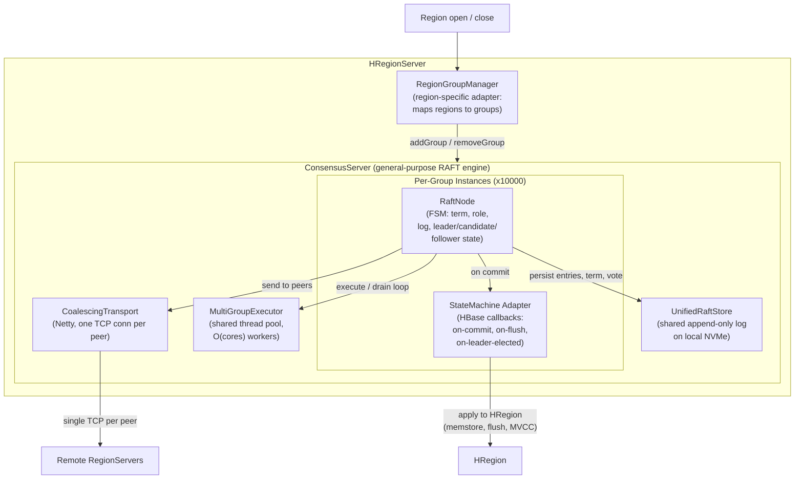

### Vote State Durability

RAFT's leader uniqueness guarantee depends on each member voting for at most one candidate per term. If a member crashes after sending a vote response but before persisting its voted-for state, it could vote again for a different candidate after restart, producing two leaders in the same term.

The `hbase-consensus` implementation must persist the voted-for record and current term to durable local storage (the local RAFT log segment) before sending the vote response. This is a standard RAFT requirement but is worth calling out explicitly because the local RAFT log is not a durability mechanism for data. That role belongs to the WAL on HDFS. For vote state, however, local persistence is the durability mechanism. HDFS is not involved in the vote path, and the single-threaded actor model alone is insufficient because it does not survive process restart. The implementation must treat a crash before voted-for persistence as equivalent to not having voted. MicroRaft enforces this ordering: `VoteRequestHandler` calls `state.grantVote()` which invokes `RaftStore.persistAndFlushTerm()` synchronously before the response is sent; the `RaftSqliteStore` implementation uses SQLite WAL journal mode with `SYNCHRONOUS = EXTRA` and an explicit commit to ensure durability.

On restart, the member resumes at its persisted term and voted-for record. It does not increment its term. MicroRaft's `RaftState.restore()` reconstructs the term state from the persisted values, and the member starts as a follower with no leader. The restarted member learns the current cluster term from the first heartbeat or vote request it receives, stepping up to that term via the standard term-fencing rule.

### Multi-RAFT on a Single RegionServer

A RegionServer hosts many regions. The consensus layer runs all RAFT groups within a single `ConsensusServer` instance using a shared event-loop architecture. A fixed-size thread pool of O(CPU cores) worker threads services all groups. Each group is a lightweight FSM struct with bounded multi-producer, single-consumer (MPSC) mailboxes. When a group has new work the work item is enqueued in one of its mailboxes and the group is scheduled onto the pool. A pool thread runs the group's drain loop, then moves to the next group. No per-group threads exist.

The per-group FSM is inherited from MicroRaft. Each consensus node instance encapsulates a complete Raft state machine (term, role, log, leader/candidate/follower state) and processes events serially via a pluggable executor. When a task is enqueued for a group, an atomic scheduled flag is tested-and-set; if the flag transitions from unset to set, the group is submitted to the shared pool as a runnable, otherwise the enqueue alone suffices. A pool thread that picks up the group runs a drain loop, then clears the flag, and if any mailbox is non-empty after clearing, the group re-submits itself to the pool. This protocol guarantees serial execution per group while multiplexing all groups onto the fixed pool without per-group thread allocation.

For deferred work, the pool retains a scheduling channel for infrequent per-group timers such as election timeout. The store-level heartbeat sweep described below eliminates per-group heartbeat scheduling entirely. Scheduled tasks wrap the group's serial-execution channel so that the timer fire, the task enqueue, and the task body all preserve per-group serial execution: the timer fires, the task is enqueued, and the task runs within the drain loop alongside other group work.

Each group has two mailboxes rather than one, organized as a control lane and a bulk lane. Control-lane traffic carries timing-sensitive work that must not be starved by bulk replication: heartbeat dispatch and acknowledgment, vote requests and responses, install-snapshot exchanges, and inbound non-replication messages. Bulk-lane traffic carries replication work: append-entries requests and acknowledgments, propose payloads, and the post-commit apply path. The drain loop processes the control lane first, up to a per-pass cap, then yields to the bulk lane up to a separate per-pass cap, then if either lane is still non-empty re-submits the group to the pool rather than monopolizing the worker. The asymmetric two-lane drain bounds the worst-case head-of-line wait for any control task that arrives at an empty control mailbox to one bulk burst, which is the property that lets the leader-lease and election-timer arithmetic remain valid even when the bulk lane is saturated. The fairness bound and the rationale for setting the control cap to 32 are themselves the subject of a separate formal model (see Appendix B).

The drain-on-schedule semantics are the foundation for leader proposal micro-batching. When a pool thread runs a group, it drains all pending items from the bulk mailbox up to the per-pass cap rather than processing one at a time. Multiple proposals that accumulate in the bulk mailbox while the previous drain is in-flight are collected and batched by the next pool invocation. The executor interface is pluggable, so the shared-pool implementation does not require modifying the consensus core.

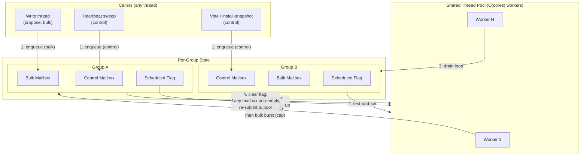

MicroRaft's `Transport` interface is similarly wrapped by a coalescing transport that buffers outbound messages per-peer per-tick and flushes them as batched frames. MicroRaft's `RaftStore` interface is replaced by the unified multiplexed log, which implements the store interface by tagging entries with their group ID and writing to the shared append-only file.

As regions are opened and closed, RAFT groups are dynamically added and removed via the `RegionGroupManager`.

### Batching Hierarchy

Three levels of batching compose to reduce per-mutation consensus overhead from O(mutations) toward O(peers):

**Level 1: Intra-proposal batching (mini-batch grouping).** A `multi()` RPC is grouped by region on the RegionServer. Each region's sub-batch is processed by `doMiniBatchMutate()`, producing one WALEdit per mini-batch. Each WALEdit is one RAFT proposal. A  batch of 1000 mutations touching 5 regions yields approximately 5 proposals , each carrying approximately 200 mutations. The HBase replication sink delivers even larger mini-batches: edits received from a source cluster commonly arrive in batches of >=1000 mutations directed at a single region, all of which collapse into one RAFT proposal. This is the coarsest grain of batching. Many mutations share a single proposal, a single consensus log entry, and a single network frame. This first level alone reduces the number of RAFT proposals from O(mutations) to O(regions touched), dominating the reduction. The per-proposal WALEdit size is additionally bounded by `hbase.consensus.propose.max.bytes` (default 16 MiB). If the accumulated WALEdit for a mini-batch exceeds this limit, `doMiniBatchMutate()` splits the mini-batch at the mutation boundary that crosses the threshold, producing an additional proposal. This trades more proposals for bounded per-proposal size and more predictable follower apply latency.

**Level 2: Inter-proposal batching (mailbox drain).** When the event loop schedules a group, it drains the group's mailbox of all pending proposals rather than processing one at a time. Multiple proposals are combined into a single AppendEntries message carrying multiple WALEdit entries. One serialization pass, one consensus log write, one network send, and one consensus round amortize across N proposals. Under sustained write load, proposals naturally accumulate while the previous AppendEntries is in flight, filling batches without any artificial delay. The maximum batch size is capped by `hbase.consensus.propose.batch.max.entries` (default 1024) to bound per-message size and keep apply latency predictable; with the server-wide pending-bytes credit pool (see "Propose Admission and Server-Wide Backpressure" below) preventing memory blow-up under bursts, the entry cap is set high enough that the byte budget is the binding constraint for any reasonably-sized payload.

**Level 3: Cross-group transport coalescing.** The `CoalescingTransport` combines AppendEntries from multiple groups destined for the same peer into one `BatchAppendEntries` network frame, reducing syscall and TCP framing overhead from O(active groups) to O(peers) per tick (described in the Transport section below).

On the follower side, the batched AppendEntries is persisted to the consensus log as a single write and acknowledged as a unit. The entries within the batch share one log fsync via the unified multiplexed log's coalescing window, further amortizing I/O.

This batching hierarchy is the single highest-impact CPU optimization for the consensus layer. TiKV's adaptive batching and CockroachDB's entry application batching (measured at +48% throughput, -34% average latency on sequential write workloads, per CockroachDB PR #38568) demonstrate the effectiveness of this pattern in production multi-RAFT systems.

### Proposal Admission and Server-Wide Backpressure

A multi-RAFT host that accepts more leader-side propose work than its peers can drain will pin uncommitted log entries on the heap until the cluster catches up. With ten thousand groups per RegionServer, even a modest amount of unbounded acceptance per group can compound into hundreds of gigabytes of pinned bytes, drag the leader into long garbage-collection pauses, and ultimately destabilize lease and election timing. The consensus layer therefore enforces two complementary admission controls on the propose path of every group leader.

The first is a per-group cap on the count of uncommitted log entries. This bounds the depth of any single leader's pending queue and is the existing protection inherited from the upstream MicroRaft model. A single group whose followers fall behind should not be allowed to produce an unbounded number of in-flight log entries, regardless of what the rest of the host is doing. When the cap is reached the propose call fails fast with a back-pressure exception so the client can retry against a less-saturated path.

The second is a single, server-wide cap on the byte footprint of uncommitted leader-side propose payloads, aggregated across all groups the host is currently leading. Operators size the budget in terms of how much heap the consensus engine is allowed to pin process-wide. That ceiling does not naturally factor into a per-group share, because the leader-versus-follower mix of any given host is not known up front and shifts continuously with leadership transfers. The byte budget aliases HBase's existing RPC-layer callqueue byte budget, so a single site-level configuration knob bounds both the in-flight RPC payload footprint and the in-flight consensus payload footprint of the same RegionServer process.

Each group leader borrows credits at the moment a propose is admitted and returns them as the corresponding entry commits in the apply path. Borrows and releases are simple atomic counter updates. If a borrow would exceed the global ceiling the propose fails fast with the same back-pressure exception used for per-group capacity overruns. The engine never queues admission requests internally, leaving congestion management entirely to the propose-side caller.

Each leader tracks its own outstanding credits in a small per-group accountant keyed by leader-side log index. The accountant lets the per-entry release in the commit path return precisely the bytes that were borrowed for that specific entry, even when entries of mixed sizes are flowing through the same group. It also lets a leader return the entirety of its borrowed credit in a single wholesale release whenever it stops being a leader for those entries. Followers do not borrow against the budget. They apply whatever the current leader has already committed, and the accountant on a former leader is naturally empty in the follower role because the wholesale release fires on the leader-to-follower transition.

### Transport: Netty+Protobuf

MicroRaft's transport interface is instantiated per consensus node. Each node holds its own transport reference and calls send for individual messages. Messages carry a group identifier via the message header, so routing is possible even with a shared transport instance. The coalescing transport exploits this by providing a single transport instance shared across all nodes on the RegionServer.

The consensus module registers a protocol handler on a dedicated Netty port (`hbase.consensus.port`, default 16080), reusing HBase's existing Netty infrastructure. The wire format is Protobuf inside a length-prefixed frame. The transport maintains one Netty TCP connection per peer, lazily connected with automatic reconnection on failure. All network-dependent consensus operations require retry-with-backoff semantics because partition oscillation can repeatedly disable them. The transport layer's automatic reconnection handles the TCP-level recovery, and the consensus protocol retries the logical operation through the periodic heartbeat sweep and the group executor's drain loop. Netty is already a core HBase dependency so no new dependencies are introduced.

Each peer's outbound channel maintains two MPSC mailboxes — a bulk mailbox and a heartbeat mailbox — and uses a kind-specific drain trigger so that the two lanes have different latency contracts. Bulk messages (append-entries, append-entries acknowledgments, install-snapshot exchanges, vote requests and responses, leader-heartbeat acknowledgments, and any other immediate-delivery message) call into the channel's drain scheduler at enqueue time. The drain runs on the channel's I/O thread, pops everything currently queued in the bulk mailbox, and emits one or more coalesced frames per peer. Heartbeat-lane enqueues do not schedule a drain. They drain instead from a single post-tick flush hook fired by the store-level heartbeat sweep after every tick, which produces one coalesced heartbeat frame per peer per tick. This separation gives the bulk lane the latency of the immediate drain and lets the heartbeat lane piggyback on a single post-tick I/O without forcing a wall-clock floor on the bulk lane. The latency bounds for both lanes are formally modeled as a separate side specification (see Appendix B).

Each consensus log writer-shard thread similarly drains its mailbox opportunistically per loop iteration. Producers that arrive while a drain is in flight are picked up by the next iteration, so heavy bursts coalesce without any artificial timer. Coalesced frames carrying append-entries from many groups destined for the same peer are emitted as one batch-append-entries envelope. The per-tick heartbeat flush emits one heartbeat-batch envelope per peer.

Data-carrying entries are compressed before transmission and stored compressed in the consensus log. The leader compresses each entry's payload before proposal, the compressed bytes flow to the outbound channel, to the consensus log, and over the wire, and the follower decompresses only during the apply callback when the entry is committed. The chosen codec is advertised on the wire in each entry header so receivers do not need matching configuration. Observed compression ratios on comparable data range from 2:1 to 3:1, and the design strongly recommends enabling Snappy for cross-AZ deployments.

All messages for all groups between two RegionServers multiplex over a single TCP connection per peer.

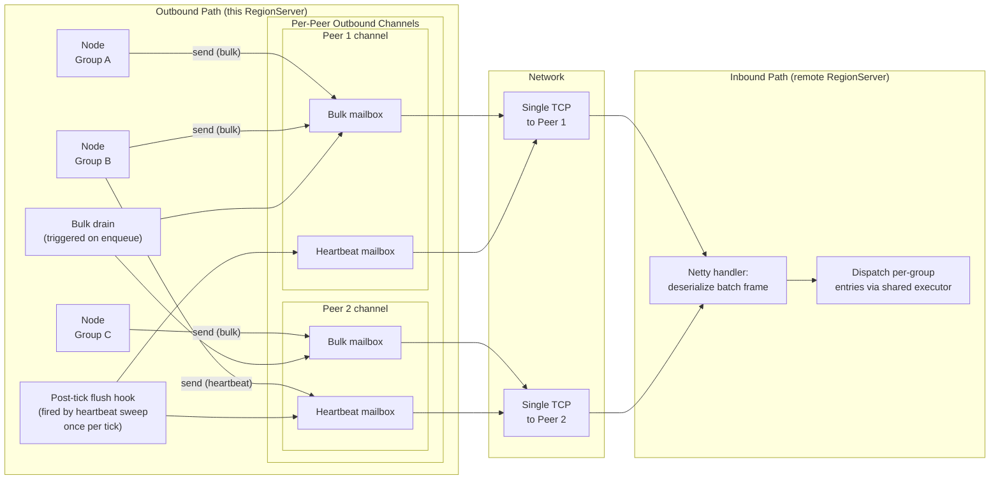

When the bulk drain fires and multiple groups have pending append-entries to the same peer, they are coalesced into a single message rather than sent as individual messages:

```
message BatchAppendEntries {
  repeated GroupAppendEntries groups = 1;
}
message GroupAppendEntries {
  bytes group_id = 1;
  uint64 term = 2;
  uint64 prev_log_index = 3;
  uint64 prev_log_term = 4;
  repeated bytes entries = 5;   // entry payload, optionally compressed
  uint64 leader_commit = 6;
}
```

This reduces syscall and TCP framing overhead from O(active groups) to O(peers) per drain, the same reduction heartbeat coalescing achieves for liveness traffic, now applied to the data path. On the follower, only the envelope header fields are parsed. The entry bytes are passed opaquely to the apply callback. TiKV's batch-raft RPC demonstrates this pattern reducing CPU usage significantly under multi-RAFT workloads.

On the inbound side, the Netty handler deserializes the batch frame, iterates per-group entries, and dispatches each to the correct consensus node via the shared executor, preserving per-group serial execution. The group lookup is a constant-time operation against the consensus server's group registry. Vote requests and responses, which are infrequent and latency-sensitive, take the same bulk-lane path as other immediate-delivery messages, so they trigger an immediate drain rather than waiting for a heartbeat tick.

### Store-Level Heartbeat Coalescing

The classic Raft implementation runs a self-rescheduling heartbeat timer per group. On every firing a leader group broadcasts to its followers, and a follower group checks whether the leader heartbeat timeout has elapsed and starts a pre-vote if so. At thousands of groups this means thousands of independent timers, thousands of independent scheduler wakeups per heartbeat period, and thousands of individual network sends per heartbeat period.

A single per-server timing wheel replaces the per-group timers. The wheel ticks at a fixed cadence, shorter than the leader heartbeat period, and on every tick walks every group registered on this server. For each group it inspects, in user space and without taking the per-group serial executor's lock, the per-group state required to decide what kind of liveness signal that group owes which peer on this tick: whether this server holds the leadership of the group, whether the leadership lease is still live, whether this group needs a follower-side election timer check, and which peers are currently reachable. For every remote peer this server talks to, an accumulator gathers one per-group entry per group that owes that peer a liveness signal on this tick. The wheel then emits exactly one outbound bulk-heartbeat envelope per remote peer per tick, carrying every accumulated per-group entry in one frame. The reverse direction is symmetrical. Per-peer ack accumulators on the receive side coalesce per-group acks back into one bulk-heartbeat-ack envelope per peer per tick.

The number of outbound heartbeat envelopes emitted per heartbeat period is bounded by the number of distinct remote peers this server talks to, not by the number of groups. The per-envelope payload scales with the number of groups shared between this server and each peer. The per-peer envelope is fixed-overhead regardless of per-group activity, so a peer that hosts thousands of groups but is otherwise idle still pays only one envelope per tick on each direction of the wire. Per-group entries are short and dense so the dominant byte budget per envelope is the entries themselves rather than framing.

The hot path is engineered for very low jitter on a saturated server. The per-group state the wheel reads is published on volatile fields that the per-group serial executor updates on every step that changes the steady-state liveness. The wheel walks those volatile fields without any lock and without queuing any work onto the per-group executors. It calls into the per-group executor only for the rarely-needed slow-path actions, such as leader lease expiry, follower election trigger, orfollower catch-up arming, and even those are dispatched as fire-and-forget control-lane tasks rather than synchronous calls. The result is that the per-tick latency the timing wheel imposes is bounded by the cost of one walk over the registered groups plus one direct event-loop write per peer, both of which are constant-time per group and per peer respectively.

The wheel also folds checks for JVM stop-the-world pauses into its per-tick processing. Every tick records its arrival wall-clock against the previous tick's wall-clock and the configured tick period, and if the gap is large enough to be a credible JVM pause it advances the steady-state per-group "last heard from leader" and "last lease refresh" timestamps by exactly the observed pause amount before doing the per-group walk. This prevents the cluster from re-electing on transient pauses that are within a configurable cap, and lets it correctly re-elect when the pause is genuine and exceeds the cap. The same pause-aware tick semantics run on the receive side ack accumulators.

Cross-cutting writer sharding used by the data path does not change the per-(server, peer) envelope budget. The wheel emits at most one bulk-heartbeat envelope per peer per tick. At very large group counts the achievable per-envelope fanout drops by sqrt(K) for K writer shards, because writer threads compete with the wheel's slow-path control-lane tasks for the per-group executor pool. The per-replicate latency that sharding buys back grows linearly.

#### Idle-Group Quiescence

Idle-group quiescence is an opt-in optimization intended for very large group counts where the per-group payload inside the bulk-heartbeat envelope becomes a non-trivial fraction of cross-AZ traffic. Operators are expected to leave it disabled until they have confirmed that their group population is both large and idle enough to benefit. The remainder of this subsection describes the protocol as if quiescence were enabled.

The mechanism collapses the per-group bytes a group contributes to outbound heartbeat traffic to zero whenever a group has been quiet for long enough. A leader marks its group quiescent when its lease is live, a configurable grace period has elapsed since the last successful proposal returned to its caller, there are no in-flight proposals or queries and no leadership transfer is in flight, the leader's commit index, last-applied index, and last log-or-snapshot index are all equal, and either every voting follower's match index has caught up to the leader's last log-or-snapshot index with request backoff clear, or the master's most recent live-server view marks the lagging follower as not live. The META group is special-cased and never quiesces, because too many cluster-bring-up paths assume META reads always make progress.

The active-to-quiescent transition rides the next bulk-heartbeat envelope: the per-group entry for the quiescing group carries a "quiesce" bit set against the current term and latest commit index. After that point the leader contributes no per-group entry to outbound bulk-heartbeat envelopes for that group, and no per-group append-entries traffic. Failure detection over the quiescent period runs on the per-server keepalive: the bulk-heartbeat envelope itself carries the emitter's endpoint, boot epoch, and tick on every send regardless of whether any per-group entries are attached, and the receive side updates a process-wide per-peer keepalive timestamp on every observed envelope. A follower that receives a quiesce-tagged per-group entry verifies term match, commit match, expected leader, absence of pending local proposals, and that the leader's "lagging on quiesce" set does not name any follower the receiving server believes is live. On pass it marks the group quiescent locally and switches its election-timer gate from per-group entry observation to the per-server keepalive timestamp it last saw from the current leader's endpoint. Any check failure causes the follower to silently ignore the quiesce flag and continue running its per-group election timer.

A group is woken by a new proposal arriving on the leader, a membership change, a leadership transfer, lease-expiry detection that demotes the leader to follower, the leader observing a higher-term heartbeat acknowledgement or append-entries response, or any inbound non-heartbeat message on the follower side. Wake unconditionally clears the leader's quiescent state and its lagging-on-quiesce set, schedules an immediate heartbeat tick, and falls back to normal per-group heartbeating on the next outbound bulk-heartbeat envelope. Followers wake symmetrically. Any handler other than the steady-state heartbeat handler clears the local quiescent flag before doing real work.

Append entries are reserved for log replication catch-up, snapshot trigger, match-index discovery, and membership-op preparation. The heartbeat fast path therefore never carries log entries, and the lease-refresh logic on the leader is independent of the data path. When a bulk-heartbeat-ack envelope arrives, the receive event-loop demultiplexes its per-group entries and dispatches each into the corresponding per-group serial executor as a single fire-and-forget control-lane task. The demultiplexing is a constant-time lookup against the local group registry per per-group entry.

### Unified Multiplexed Consensus Log

MicroRaft's store interface is instantiated per consensus node. Each node receives its own store instance, managing independent storage and issuing independent flush calls for fsync. The interface covers endpoint persistence, membership persistence, term and vote persistence, log entry persistence, snapshot chunk persistence, log truncation in both directions, snapshot deletion, and flush. At ten thousand groups, ten thousand independent flush calls would mean ten thousand independent fdatasync syscalls per consensus tick, which is untenable.

Instead of per-group log files, the consensus layer writes a small number of append-only log streams per RegionServer to local NVMe, each multiplexing entries from a deterministically partitioned subset of groups. A single shared store wraps these streams. Each consensus node receives a per-group adapter that implements the store interface by delegating every call to the shared store under its bound group identifier. The store routes each operation to one of K writer shards (`hbase.consensus.log.writer.shards`, default 4) by stable hash of the group identifier, so every operation for a given group hits the same shard for the lifetime of the process. Each shard owns a private multi-producer mailbox, a dedicated writer thread, an active segment, and an independent set of segment files under a per-shard subdirectory of the log directory. Within a shard, appended records are tagged with their group identifier so one sequential write stream serves every group routed to that shard at once. Each shard's writer thread drains its mailbox opportunistically per loop iteration, issues one gathered write per drain, and may issue a single flush covering the whole batch when the durability tier requires it. Sharding the writer trades intra-shard sequentiality (preserved) for inter-shard concurrency: the per-shard mailbox tail length scales with the per-shard group count rather than the per-RegionServer group count, which is the property that keeps per-replicate p99 latency bounded as group count grows past one thousand. Log truncation and snapshot deletion are recorded as marker records. Physical reclamation is deferred to log file garbage collection, which runs per-shard and deletes a closed segment once every group it references has advanced past that segment's per-group max log index. Segments roll at a configurable size threshold (`hbase.consensus.log.segment.size.mb`, default 256MB).

The consensus log organizes writes into three durability tiers. *Tier A* — term, voted-for, local endpoint, and initial group members — is always fsynced inline before the call returns. This is the safety-critical durability the leader-uniqueness argument depends on. A member that responds to a vote request must have its vote on disk before the response leaves the wire. *Tier B* — log entries, snapshot chunks, and truncations under the default mode — is persisted as page-cache durability on the gathered write, with fsync fired at segment roll and on a periodic timer (`hbase.consensus.log.fsync.interval.ms`, default 10000ms). In this default mode, flush barriers complete after the gathered write returns, not after fsync, so the leader's commit-index advancement and the follower's append-entries acknowledgment count page-cache acknowledgments rather than on-disk acknowledgments. *Tier C* is opt-in, controlled by `hbase.consensus.log.fsync.on.commit` (default `false`). When enabled, every flush barrier blocks on fsync and the durability rule tightens to fsync-before-commit, so a committed entry is on a majority of disks the moment it is committed.

The default Tier B model is the right operating point for RAFT-replicated regions backed by an HDFS WAL. The HDFS WAL is the durability mechanism for the data. The leader's parallel write barrier already requires a synchronous WAL sync to HDFS before any client acknowledgment, so a client-acknowledged entry is on a majority of HDFS DataNodes regardless of whether the consensus log has fsynced. The consensus log's role is to keep follower memstores warm for fast promotion, not to be the system-level durability surface for committed data. The performance analysis below assumes the default Tier B mode.

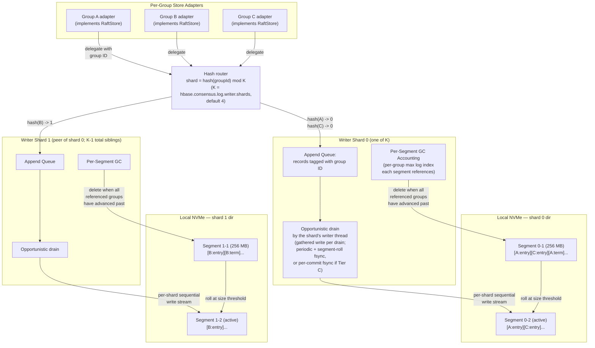

### RAFT Consensus Log

The consensus log is a sharded multiplexed append-only log on local NVMe. A single per-RegionServer store instance multiplexes entries from every RAFT group into K independent shards (`hbase.consensus.log.writer.shards`, default 4); each shard owns a private sequence of segment files under its own per-shard subdirectory of the log directory, with batched writes, segment rolling, and per-group garbage-collection accounting. Group identifiers route to shards by stable hash, so every operation for a given group is processed by the same shard for the lifetime of the process. The remainder of this section describes the per-shard internals; sharding factors out cleanly because every shard runs the identical writer state machine over a disjoint subset of groups. The per-shard design is structurally inspired by ZooKeeper's `FileTxnLog`, consisting of file magic and version, length and CRC32C framing, sequentially named segment files, and lossy-tail recovery on torn writes, with CRC failures escalated rather than silently skipped. It is internal to `hbase-consensus` and is not the HBase WAL. Each consensus node sees its own per-group store adapter that delegates every operation to the shared store under its bound group identifier. Whole-log replay happens once at startup and reconstructs every group's persistent state by streaming each shard's segments in order. Reads are confined to startup recovery, so the runtime state per shard is just the ordered set of segments plus, per segment, the highest log index per referenced group for garbage collection.

Producers encode each record and hand it to the routed shard's lock-free multi-producer mailbox. The shard's dedicated writer thread drains its mailbox opportunistically per loop iteration, issues one gathered write per drain, and may issue a single fsync covering the whole batch when the durability tier requires it. The store organizes writes into three tiers as described in the section above: term, voted-for, local endpoint, and initial-members records always fsync inline (Tier A); log entries, snapshot chunks, and truncations are page-cache-durable on the gathered write under the default mode, with periodic and segment-roll fsync (Tier B); and per-commit fsync is opt-in for deployments that demand strict on-disk durability for the consensus log itself (Tier C). The default Tier B mode is the right operating point because the HDFS WAL is the durability mechanism for committed data. The consensus log's role is to keep follower memstores warm for fast promotion. A flush barrier in default mode is a per-shard, per-batch coalescing point. Multiple groups routed to the same shard and blocked on the same drain collapse onto a single gathered write within that shard; cross-shard concurrency is preserved because the shards drain independently.

Each segment file opens with a fixed prologue of magic plus version followed by a sequence of self-describing frames. A frame carries its length, a CRC32C of its body, a record kind, a per-store sequence number, the group identifier it belongs to, and a kind-specific payload. The fixed length prefix lets the streaming reader skip frames in O(1) without decoding the body, and a CRC per frame bounds the blast radius of a torn write to a single record. Record kinds cover the full persistence surface. Model-typed payloads delegate to a pluggable serializer. The default serializer is protobuf-backed for types with a wire-format peer, so on-disk records inherit protobuf's backward-compat rules, and uses a compact varint encoding for the persistence-only types. Compression is per-entry rather than per-segment. Each entry header carries a compression-algorithm identifier, and on-disk entries inherit whatever codec the wire layer used.

Segment rolling happens inside each shard's writer thread when that shard's active segment crosses `hbase.consensus.log.segment.size.mb` (default 256MB) after a gathered write. The writer appends a best-effort footer, fsyncs and closes the current file, opens a fresh file with a header, and switches the active segment. The per-tick garbage-collection pass runs per-shard and deletes any non-active segment in that shard for which every group it references has advanced past that segment's per-group max log index. Advancement is recorded when a group truncates its log forward, which writes a truncation marker and bumps the in-memory garbage-collection frontier on the owning shard.

Startup recovery runs one sequential pass per shard over every segment in identifier order, validating the prologue and streaming frames. The first integrity failure within a shard stops replay for that shard only. The offending segment is truncated to that offset, every segment with a higher identifier in that shard is deleted, and whatever per-group state was reconstructed up to that point is the restored state for groups routed to that shard. Other shards complete recovery independently. Both classes of failure share the same recovery path. The Raft layer above closes the resulting gap via standard append-entries (small gaps) or install-snapshot (large gaps). A node whose log is short cannot win election (because of Raft's up-to-date check), so a would-be leader with corruption automatically defers to a peer with intact state. Groups absent from the recovered state have no on-disk state and start fresh.

### Consensus Callbacks

The integration point between the consensus layer and HRegion is a `StateMachine` adapter (`StateMachineAdapter` in `handler/statemachine/`) that bridges the RAFT core's general-purpose state machine interface to a region-side `ConsensusSpi`. The `StateMachine` interface has four methods: run-operation for executing committed entries, take-snapshot for snapshot creation, install-snapshot for snapshot restoration, and get-new-term-operation for the no-op entry appended on election. The HBase adapter implements these as follows. The run-operation method buffers committed `byte[]` payloads as `CommittedEntry`s. On the per-batch boundary the adapter drains the buffer to `ConsensusSpi.onCommit` and, in the `FlushMarker` case, fires `ConsensusSpi.onFlushComplete`. The get-new-term-operation method delegates to `ConsensusSpi.getNewTermOperation`. The take-snapshot and install-snapshot methods round-trip a single opaque `byte[]` chunk through the SPI take-snapshot calls `ConsensusSpi.takeStateSnapshot(commitIndex)` and emits the returned bytes as a single chunk. Install-snapshot asserts a single chunk and forwards its bytes to `ConsensusSpi.installStateSnapshot(commitIndex, bytes)`. The bytes are opaque to the consensus layer. The HBase region-side SPI implementation is free to encode whatever it needs.

The consensus core and the application catch up across two cleanly separated channels, and the SPI never sees consensus-layer traffic.

1. *Raft consensus state*: `currentTerm`, the Raft log, the snapshot term/index, and the group-members view are delivered by the core's standard `AppendEntries` path and the chunked `InstallSnapshot` path. This traffic flows entirely inside `hbase-consensus` (the core handlers, the `CoalescingTransport`, the `UnifiedRaftStore`). The `ConsensusSpi` is never invoked for any of it.

2. *Application data state*: The region's memstore, store files, and flush state are is the SPI implementation's concern. When the consensus core invokes `StateMachine.takeSnapshot` on the leader to produce a payload to send to a lagging follower, the adapter delegates to `ConsensusSpi.takeStateSnapshot` and forwards exactly one opaque `byte[]` chunk through the standard `InstallSnapshot` wire path. The receiving follower's adapter forwards the same bytes back to `ConsensusSpi.installStateSnapshot`. The HBase SPI implementation chooses what those bytes mean.

The primary callback is on-commit, called when one or more consensus entries are committed. On the leader this signals that the write-path barrier is satisfied (the consensus side is complete). On followers the callback receives the full batch of committed entries and applies them as a unit rather than one at a time. Because the leader assigns contiguous sequence IDs via proposal batching, the follower creates a single MVCC bracket for the batch: it calls `beginAt(lastSeqId)` to advance the write point, stamps and collects all cells from all entries in the batch, performs one memstore add with the combined cell set, then one complete-and-wait. This reduces MVCC overhead from N begin/complete cycles to one per batch. Each committed entry may itself carry many mutations, so the batching is doubly effective. When N entries are applied as a batch, each carrying M mutations, the total work is N*M mutations with one MVCC bracket, one memstore add call, and one completeAndWait. Under Phoenix workloads where M is large, a single follower apply cycle can absorb thousands of mutations. Marker entries break the batch boundary. When a marker is encountered the preceding mutation entries are applied as a batch, then the marker is processed separately. During catch-up replay the same batching applies. The follower groups committed entries into batches up to the batch size cap and applies them in bulk, accelerating catch-up significantly. CockroachDB's equivalent optimization measured +48% throughput and -34% average latency on sequential write workloads.

The remaining callbacks handle coordination events. The on-flush-complete callback fires when a flush-complete marker is committed. All members refresh their store file lists to pick up the new HFiles from HDFS, then drop memstore entries below the flush sequence ID. Leader-lifecycle events — election win, loss, and the lagging-follower hint — are surfaced through a leader-report listener that the SPI registers with the consensus engine. The implementation today notifies the SPI synchronously inside the leader's drain loop with the elected term, the elected member, and the corresponding group identifier. The region-side adapter is then responsible for any subsequent master coordination. The new leader's RegionServer reports the election to the master through a leader-change RPC, the master validates the RAFT term and updates the region's primary location and replica ID in `AssignmentManager`'s in-memory state and in META, and returns confirmation to the RegionServer. The on-follower-lagging callback alerts the master that a replica is lagging, which could trigger proactive rebalancing or replacement. The on-no-leader callback alerts the RegionServer that a group has had no leader for an extended period, which could trigger error reporting.

### Region-to-Group Adapter

The region-specific layer above the general-purpose consensus engine is a thin adapter component on HRegionServer. It creates a single `ConsensusServer` instance per RegionServer at startup, owning the shared thread pool, unified log, and Netty transport. The `ConsensusServer` API itself is not region-aware. It operates on opaque group IDs, peer IDs, and byte-array entries. The adapter bridges HBase's region abstractions to this generic API.

The region-replica adapter wires the consensus engine into HRegionServer's open/close, write, and flush paths. The adapter exposes add-group and remove-group operations, called during region open and close respectively. It maps each region to a group ID deterministically by hashing the table name, start key, and region ID, deliberately excluding the replica ID so that all replicas of the same region join the same group. Each replica's (server name, replica ID) pair is mapped to a peer ID. The adapter also supports leadership transfer for graceful rebalancing and downgrade.

### Dependencies

The `hbase-consensus` module imports MicroRaft's consensus core (Apache 2.0) into the HBase source tree, repackaging it under the HBase namespace and modifying it for the HBase use case. Importing rather than depending on MicroRaft as an external library reflects the depth of the modifications described in Appendix C: the executor model, the store layer, the transport, and the leader-lease arithmetic all diverge from upstream in ways that would not naturally upstream cleanly. The imported core retains MicroRaft's pluggable interface boundaries so the HBase-specific implementations of those interfaces are clearly separable from the protocol state machine. Netty and Protobuf are already HBase dependencies, so no new external dependencies are introduced. The model factory and configuration are stateless. A single model factory instance and a single configuration instance are shared across all groups, eliminating per-group object allocation for configuration and model objects.

### Leader Lease

RAFT does not natively provide a time-bounded leader lease. A RAFT leader knows it won an election and is sending heartbeats, but after a network partition it could still believe it is the leader until it attempts (and fails) to commit a proposal. Without a lease mechanism, a partitioned leader would serve stale reads while a new leader has already been elected by the surviving majority. The consensus layer implements a leader lease to close this gap, following the pattern proven by TiKV ("lease read") and CockroachDB ("epoch-based leases"). The leader maintains a local lease expiry timestamp on each group's FSM struct, refreshed every time the leader receives heartbeat acknowledgments from a majority of peers:

```java
// On receiving a heartbeat response from peer P for group G:
void onHeartbeatResponse(GroupId g, PeerId p) {
    GroupState state = groups.get(g);
    state.heartbeatAcks.add(p);
    if (state.heartbeatAcks.size() >= majority) {
        state.leaseExpiry = System.currentTimeMillis() + leaderLeaseDurationMs;
        state.heartbeatAcks.clear();
    }
}
```

The lease safety analysis depends on the leader heartbeating *all* followers every tick, not a subset. The implementation satisfies this because the heartbeat batch is sent to all peers every tick and the lease is refreshed only when a majority of acks from that round have arrived. Atomic heartbeat rounds are required.

The leader lease duration must be at most the leader heartbeat timeout minus twice the max clock drift, ensuring the leader's lease expires before any follower's election timer fires even under worst-case clock drift (formally verified by TLA+ model under all partition configurations and worst-case clock drift). The lease duration is derived from the configured timeout and drift rather than configured independently: with default configuration (`hbase.consensus.leader.heartbeat.timeout.ms` = 10000, `hbase.consensus.heartbeat.interval.ms` = 250) and a default max clock drift of 200ms, the resulting lease is 9600ms (10000 − 2 × 200). The configuration validator enforces that the heartbeat timeout is strictly greater than twice the max clock drift, so the derived lease is always positive. The leader considers itself authoritative for reads as long as the current time is less than the lease expiry. Operators who require faster failover can lower the heartbeat timeout, accepting that the lease shortens by the same amount. The trade-off is that any JVM pause longer than the timeout may trigger a spurious re-election. A pause-detection and pause-tolerance mechanism (described below) absorbs short pauses up to a configured cap so that lease arithmetic does not falsely demote a leader during a stop-the-world GC pause.

The max clock drift parameter must bound the maximum relative drift between any two nodes, not the maximum absolute drift of a single node. With NTP-synchronized hosts, the maximum relative drift is bounded by twice the maximum absolute drift to NTP, since both can drift in opposite directions. The default of 200ms assumes each node's clock is within 100ms of NTP truth, yielding a 200ms worst-case relative drift. The factor of 2 in the formula (lease duration < election timeout - 2 * max clock drift) accounts for two independent sources of timing error: (1) the leader's clock may run slow by up to the max drift, causing the lease to expire later in real time; (2) a follower's clock may run fast by up to the max drift, causing the election timer to fire earlier in real time. These combine to a worst-case timing error of twice the max clock drift.

The leader status check used by the read path and write path is defined as:

```java
boolean isLeader(GroupId g) {
    GroupState state = groups.get(g);
    return state.role == LEADER && System.currentTimeMillis() < state.leaseExpiry;
}
```

If the leader is partitioned from the majority, it stops receiving heartbeat acknowledgments, the lease expiry is not refreshed, and within one lease duration the check returns false. The leader stops serving reads and writes, returning `NotServingRegionException`. Meanwhile, followers whose election timers fire elect a new leader. Because the leader lease duration is bounded by the heartbeat timeout minus twice the max clock drift, the old leader's lease expires no later than any follower's election timer fires, even under worst-case clock drift, preventing a window where two leaders serve reads simultaneously. This holds under all partition configurations combined with worst-case clock drift. The maximum assumed clock drift between RegionServers is configurable (default 200ms). Higher values shrink the effective lease and widen the unavailability window during failover. Lower values tighten the lease but assume tighter clock synchronization between RegionServers.

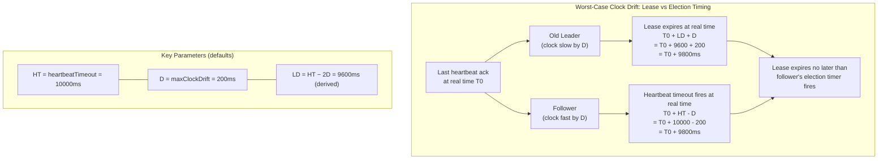

(The timing relationship that the leader's lease expires no later than any follower's election timer fires under worst-case clock drift is verified by the TLA+ model.)

A complementary pause-detection mechanism guards the lease against JVM stop-the-world pauses. The store-level heartbeat sweep observes its own inter-tick wall-clock delta and emits a pause-hint to each registered group whenever the delta exceeds a configurable threshold (default 1000ms). The hint slides the group's lease expiry forward by the absorbed delta so that a brief stall is treated as time the leader did not get to spend serving requests rather than as time the leader was unreachable. Pauses above a configurable cap (default 5000ms) are pass-through. The absorption mechanism stops trying to hide them, and normal lease-expiry / election dynamics demote the leader. This keeps the lease arithmetic conservative under healthy operation while bounding the worst-case mistaken-leader window during catastrophic pauses.

`hbase-consensus` also fixes three liveness/safety gaps in MicroRaft's vote-counting and term-handling paths.

First, the vote-response path triggers a step-down to follower on any higher-term response, mirroring the step-down logic already present in the append-entries request path. Without this, a candidate that collected majority votes in a lower term, but cannot become leader because a higher-term member exists but is temporarily unreachable, would sit with enough votes to block further elections without being able to transition to leader. The fix lets the candidate eagerly abandon candidacy as soon as a higher term is observed.

Second, the append-entries success and failure response paths, the leader-heartbeat acknowledgment path, and the install-snapshot request and response paths all step down on higher-term responses. Without this, a stale leader could continue refreshing its lease after a new leader had been elected in a higher term. This fix is safety-critical. The formal model confirms that without it, a stale leader could refresh its lease indefinitely, violating the single-lease invariant.

Third, the vote-request path resets the heartbeat timer on vote grant. Standard RAFT specifies three events that reset the election timer — receiving an append-entries from the current leader, starting an election, and granting a vote — and the timer reset on vote grant is required for the liveness story. Without it, a voter whose election timer has already expired could immediately start its own pre-vote after voting for another candidate, causing unnecessary election disruption. The reset happens in the vote-grant path before the response is sent. This materially improves convergence under partition heal.

The timing constraint alone is insufficient to prevent stale reads. In standard RAFT a follower can vote for a candidate at any time if the candidate's term is higher, regardless of the follower's election timer. Leader stickiness closes this gap: a follower rejects vote requests if it has recently received a heartbeat from the current leader. When a member discovers a higher term it steps down to follower and resets its voted-for state, making it immediately eligible to vote for a candidate in the new term, so a subsequent election can complete as fast as votes can be exchanged without waiting for any election timer. Safety depends on the election timer firing, not on the speed of re-voting; the leader-stickiness guard ensures that even after step-down clears the voted-for state, the member cannot vote until its election timer expires.

When a candidate wins the RAFT election it sends its initial heartbeat to all reachable followers immediately, within the same logical instant as the role transition. In practice the gap is microseconds, well below any clock tick, and `RaftNodeImpl` does not interleave other work between the election win and the first heartbeat round. The initial heartbeat establishes the leader's lease and resets followers' election timers, which is the prerequisite for the timing analysis. Symmetrically, if a reachable follower responds to a heartbeat with a higher term, the leader steps down rather than refreshing its lease — `LeaderHeartbeatAckHandler` and the AppendEntries success/failure response handlers all call `toFollower()` first when they observe a strictly higher term, which clears the lease before any further work runs.

### Read Consistency

Reads do not flow through the consensus layer. All reads, whether served by the primary or by a read-only replica, use the standard HBase read path (memstore + HFile scanners, MVCC filtering). No RAFT round-trip is involved on the read path.

Default-consistency reads are served by the read-write primary. Before serving a read, the primary's RegionServer confirms it still holds the RAFT leader lease via the leader status check described above. This is a local in-memory check with no network round-trip: it verifies that the leader's role is leader and that the lease has not expired. If the lease is valid, the read proceeds through the normal HBase read path. If the lease has expired (leader lost due to partition or failover), the RegionServer returns `NotServingRegionException`, triggering the client's standard retry-with-META-lookup path. The staleness window for a partitioned primary is bounded by the leader lease duration (slightly less than the RAFT election timeout): if the primary is partitioned from the majority, its lease expires within this duration and it stops serving reads.

Timeline-consistent reads continue to be served by any replica, including the primary, exactly as in the existing region replica model. The client may contact any replica; the replica serves the read from its local memstore and shared HFiles with no leader lease check and no RAFT involvement. The key improvement over the current model is freshness: replica memstores are now kept current by ordered, synchronous RAFT replication rather than the best-effort async WAL replication pipeline. In a healthy cluster, replica memstores lag the primary by the RAFT replication round-trip (typically sub-millisecond to low-single-digit milliseconds inter-AZ), compared to the unbounded and unordered lag of the current async pipeline. Timeline reads from replicas therefore return much fresher data with this design.

## Storage Model

This design maintains a single copy of HFiles on HDFS, written exclusively by the read-write primary. The HBase WAL on HDFS is retained for durability, written by the leader exactly as today. The storage cost of read-only replicas is limited to lightweight local RAFT log segments and memstore memory, so there is no additional HDFS write amplification from RAFT.

If the read-write primary is lost, a read-only replica wins the internal RAFT election, finishes consuming any remaining RAFT log entries to bring its memstore fully current, and reports the election to the master. The master validates the RAFT term, updates META to record the new primary, and returns confirmation. Only then does the promoted replica complete its local state transitions and serve reads and writes as the new primary. The HFiles on HDFS are already available, so no WAL splitting or recovered-edits replay is needed, yielding sub-second to low-single-digit-second failover. When a leader steps down gracefully, it retains its memstore and continues as a follower with warm data. When a leader crashes or aborts due to a WAL failure, the memstore is lost and must be reconstructed via RAFT log replay after restart.

When the old read-write primary recovers, it rejoins as a read-only replica. If it stepped down gracefully, its memstore is already warm and only entries committed since the step-down need to be applied. If it crashed, it replays RAFT log entries from its last known position to rebuild its memstore. This recovery is invisible from the client's perspective because the new primary is already serving. Once the old primary's memstore is current, it participates normally in RAFT voting and is eligible for future promotion.

If the old primary had an in-progress flush at the time of failure, the new primary detects the incomplete state. If the flush-complete marker was not committed through RAFT, no member has dropped its memstore and the data is safe; orphan partial HFiles on HDFS are cleaned up. If the flush-complete marker was committed, the HFiles are fully written (by design) and the transition stands.

## Write Path: Parallel WAL + RAFT Replication

The existing WAL subsystem (AsyncFSWAL / FSHLog) is retained for the leader. The leader write path preserves the existing atomic coupling between MVCC sequence ID assignment and WAL ring buffer slot claim, then forks WAL sync and RAFT replication in parallel. A barrier ensures both complete before the edit is applied to the leader's local memstore and made visible to readers.

On the read-write primary and RAFT leader the write path proceeds through the existing WAL-append code path, which atomically assigns a sequence ID via MVCC begin, claims a WAL ring buffer slot, stamps cells, and publishes the entry to the ring buffer, all under the MVCC write-queue lock inside `AbstractFSWAL.stampSequenceIdAndPublishToRingBuffer()`. This atomic coupling is preserved unchanged for RAFT-enabled regions because it guarantees that WAL entries appear in the same order as MVCC sequence IDs. Decoupling them would allow concurrent writes to the same region to interleave, producing non-monotonic sequence IDs in the WAL. HBase's WAL replay treats this as a serious defect. After the ring buffer entry is published, but before the WAL is synced to HDFS, the write path forks two parallel slow I/O operations: (a) WAL sync to HDFS for durability, and (b) consensus replication to followers. A barrier waits for both to complete. Only then does the primary apply the edit to its local memstore and complete the MVCC write entry.

A Phoenix batch commit or any `multi()` RPC delivers potentially hundreds of mutations for a single region in one call. The RegionServer's `multi()` handler groups mutations by region and calls `HRegion.batchMutate()` for each region's sub-batch. `batchMutate()` invokes `doMiniBatchMutate()`, which produces one WALEdit per mini-batch. This WALEdit is both the unit appended to the WAL and the unit proposed through RAFT. No re-grouping or re-serialization is needed at the RAFT boundary. The same pre-serialized byte buffer feeds both paths. A Phoenix batch of 1000 mutations touching 5 regions yields approximately 5 RAFT proposals, one per region, each carrying approximately 200 mutations. For RAFT-enabled regions, the mini-batch size is additionally bounded by `hbase.consensus.propose.max.bytes` (default 10MB). If the accumulated WALEdit for a mini-batch exceeds this limit, the mini-batch is split at the mutation boundary that crosses the threshold, producing an additional proposal, allowing operators to cap per-proposal network and log I/O cost independently of the WAL mini-batch size.

The refactoring target is `HRegion.doMiniBatchMutate()` step 4 (the WAL append): the existing call to append-data followed by sync is split so that append-data which publishes to the ring buffer runs first, then the sync and RAFT proposal run in parallel. The `AbstractFSWAL` internals are unchanged. A new append-without-sync method (or equivalent) returns the transaction ID without blocking on HDFS, and the caller explicitly calls sync in the parallel fork.

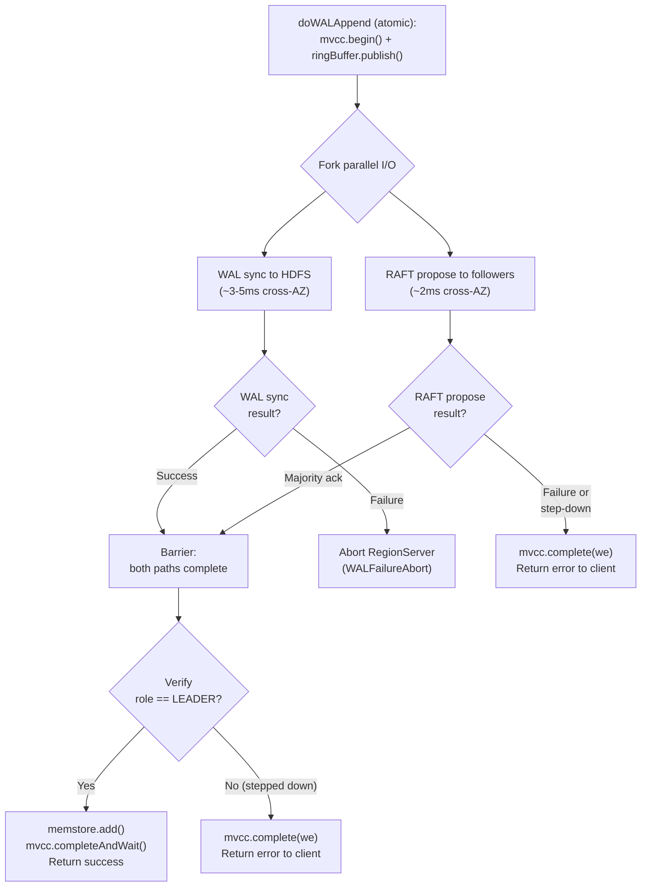

On read-only replicas (RAFT followers), the consensus apply callback deserializes the WALEdit and applies it to the local memstore using the leader-assigned sequence ID. Read-only replicas do not write to WAL or HFiles. They rely on the read-write primary's WAL and HFiles on HDFS for recovery.

On the leader, the sequence ID is assigned by MVCC begin inside `stampSequenceIdAndPublishToRingBuffer()`, exactly as today. This sequence ID is stamped on cells and included in the consensus message. On followers, the apply callback receives the leader-assigned sequence ID and uses the new `beginAt(leaderSeqId)` method to create a write entry at that specific sequence ID, then stamps cells and adds them to the memstore.

`mvcc.beginAt(seqId)` is a new method on `MultiVersionConcurrencyControl` with the following semantics:

```java
public WriteEntry beginAt(long seqId) {
    synchronized (writeQueue) {
        long current = writePoint.get();
        if (seqId > current) {
            writePoint.set(seqId);
        }
        WriteEntry e = new WriteEntry(seqId);
        writeQueue.add(e);
        return e;
    }
}
```

It advances the follower's write point to at least the given sequence ID and creates a write entry with that value, keeping the follower's MVCC in sync with the leader. The follower's apply callback is the sole writer, so there are no concurrent begin calls to conflict with. The synchronized write-queue block is still required despite the single-writer property because complete-and-wait, called after batch apply, acquires the same monitor to advance the read point. The write-queue monitor serializes the begin-at to complete-and-wait ordering, ensuring that the write point is set before any completion attempt reads it. When complete-and-wait is called after the batch is applied, the read point advances to the sequence ID, making all cells in the batch visible to scanners atomically.

The full sequence for follower batch apply is: `beginAt(maxBatchSeqId)` to advance the write point and create a write entry, then stamp cells with leader-assigned sequence IDs, then add all cells to the memstore in a single call, then `completeAndWait()` to advance the read point and make the batch visible. If the next entry is a marker, the preceding complete-and-wait brings the read point equal to the write point (no in-flight writes), at which point `advanceTo(markerSeqId)` is safe. If the marker's sequence ID is less than the current write point, advance-to is a no-op because it checks whether the sequence ID exceeds the read point before advancing. This idempotency is by construction and requires no special handling. After the marker is processed, subsequent mutation entries start a new batch.

Note: `advanceTo()` must not be used in the per-write path because it requires no in-flight writes (read point equals write point, enforced by a runtime exception) and advances both read point and write point simultaneously, which would create read holes. It is used only for marker processing in the follower apply callback (where the preceding complete-and-wait guarantees no in-flight writes) and during region initialization to set the MVCC to the last known sequence ID before replaying the consensus log tail.

HBase's WAL sequence IDs are allocated globally per-RegionServer, not per-region. On the leader, regions A and B sharing a RegionServer may receive interleaved sequence IDs (e.g., A:100, B:101, A:102). Each region's RAFT group replicates only its own entries, so followers of region A see sequence IDs 100, 102 (with a gap at 101, which belongs to region B's group). The `beginAt` implementation handles this correctly because it operates on the per-region MVCC and advances the write point to the given value regardless of gaps. The read point advances to the write point on complete-and-wait, which is the last sequence ID in the batch. Gaps are irrelevant because no write entry was created at the missing values. Scanners use the read point as a visibility threshold, not a contiguous counter.

During catch-up replay (after a crash-restart or install-snapshot), the follower may encounter a sequence ID that is less than or equal to its current write point. This can occur when advance-to has already advanced the write point past some post-flush entries that are now being replayed from the RAFT log. In this case, `beginAt` must still create a write entry at the given sequence ID without advancing the write point, which is handled by the guard that checks whether the sequence ID exceeds the current value: when it does not, the write point is left unchanged but the write entry is still created and added to the write queue. The subsequent complete-and-wait correctly advances the read point through this entry.

The TLA+ formal model captures and validates `beginAt` semantics. The safety of the `beginAt`/`advanceTo` sequencing has been verified by the TLA+ model.

RAFT log entries that do not carry mutations (e.g., flush markers, compaction markers) do not produce a memstore write but do occupy a consensus log index. On the leader, these markers also consume MVCC sequence IDs. On followers, the apply callback must not create an MVCC write entry for these non-mutation entries, or the MVCC read point will block waiting for a contiguous completion that never arrives. Markers break the batch boundary: when a marker is encountered, the preceding mutation entries are applied as a batch, which brings the read point equal to the write point. Then the marker is processed by calling `advanceTo(markerSeqId)` to advance both points past the marker's sequence ID. This is safe because the preceding complete-and-wait guarantees no in-flight writes. After the marker is processed, subsequent mutation entries start a new batch.

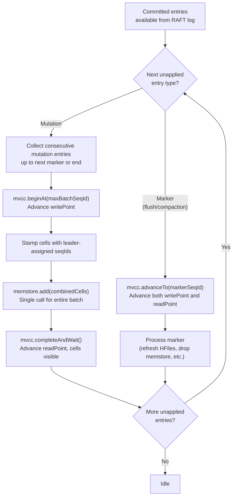

The parallel write path forks WAL sync and RAFT propose, then joins at a barrier. The barrier requires both operations to complete successfully before proceeding to memstore add and MVCC completion. The failure modes below were modeled and verified (`WriteBarrierSafety`; see Appendix B).

If the leader's WAL sync fails, the leader aborts the RegionServer process regardless of the RAFT propose outcome. This is consistent with HBase's existing behavior on WAL sync failure. Two sub-cases arise. If the RAFT propose has already committed, the entry is irrevocable because followers have it, and after SCP/RAFT failover the promoted replica serves it. If the RAFT propose has not yet committed, the entry may or may not eventually commit through RAFT before the abort completes. If it commits, the first case applies. If it does not, the entry is lost entirely, but the client was never acknowledged, so no data loss is observable. In both sub-cases, the abandoned WAL entry is harmless: RAFT-enabled regions bypass WAL splitting during SCP, and the consumed sequence ID gap is handled correctly by MVCC.

A follower may serve an entry to a Timeline-consistency reader as soon as the consensus layer reports that entry committed, which can be slightly before the original leader applies it locally. This is safe under the RAFT durability contract enforced by the consensus log: commit-index advancement counts only on-disk acknowledgements (fsync-before-commit), so a RAFT-committed entry is always present on the disks of a majority of members. An entry once visible to a Timeline reader cannot disappear from the system. Even under simultaneous loss of the original leader and any minority of followers, a member of the surviving majority retains the entry on disk and the failover primary inherits it during promotion.

If the leader discovers a higher term while a write is in the parallel fork, it steps down to follower and the in-flight write is abandoned. The write thread, still blocked on the barrier, eventually unblocks. The WAL sync completes or fails independently, while the RAFT propose fails because the node is no longer leader. Upon unblocking, the write thread finds the node is no longer in the leader role and skips the memstore add. MVCC cleanup proceeds via the existing finally block in `doMiniBatchMutate()`: the MVCC complete call releases the write entry from the write queue, allowing the read point to advance past the abandoned entry. The client receives an error and retries against the new leader. If the entry was RAFT-committed before the step-down, the new leader has it and will serve it. If not, it is lost, but the client was never acknowledged.

After the barrier completes successfully, the write path verifies that the node still holds the leader role before applying the write to the memstore (step 6). This is a role check, not a full lease check, because the write has already achieved both local durability (WAL on HDFS) and replicated durability. The lease may safely expire during the fork. The timing relationship guarantees no new leader can be elected until after the old leader's lease expires, and even if a new leader is elected by this point, the RAFT commit confirms the entry is part of the committed log. Skipping a fully-committed write would cause the leader's memstore to diverge from followers' memstores. The leader status check gates only write *entry*, not write *completion*. This design choice is confirmed by the formal model. The write barrier safety invariant holds across all reachable states with the role check, including states where the lease has expired during the parallel fork.

WAL markers (flush, compaction, region open/close) are also proposed through RAFT so all members see them in the same order.

RAFT-enabled tables must use `SYNC_WAL` or `FSYNC_WAL` durability for the "no data loss" failover guarantee. Table creation and alteration reject `ASYNC_WAL` for tables with `hbase.raft.enabled = true`. Additionally, the per-mutation write path enforces this at runtime: `HRegion.getEffectiveDurability()` upgrades `ASYNC_WAL` to `SYNC_WAL` for RAFT-enabled regions, so that even if a client explicitly requests async durability, the write still waits for both WAL sync and RAFT commit before acknowledging.

The critical sequence in `HRegion.doMiniBatchMutate()` for RAFT-enabled regions:

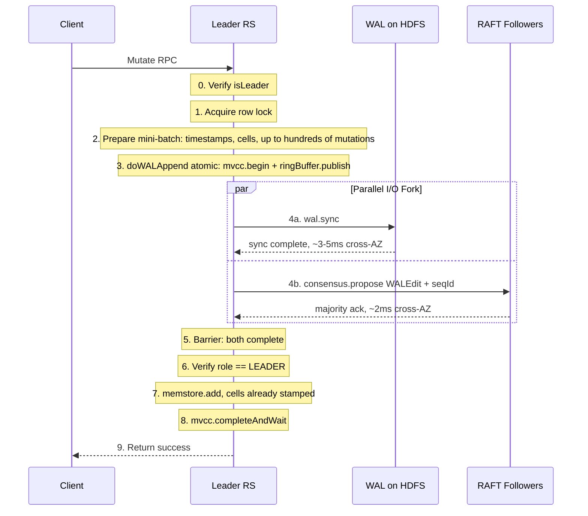

```
Leader write path:
  0. Verify isLeader(groupId)                                [role == LEADER && lease valid]
  1. Acquire row lock
  2. Prepare mini-batch (timestamps, cells)
  3. doWALAppend (atomic, unchanged from current code):
     a. mvcc.begin() + ringBuffer.next()                     [atomic under writeQueue lock]
     b. Create FSWALEntry, stampRegionSequenceId(we)         [stamp seqId on all cells]
     c. ringBuffer.get(txid).load(entry)                     [load entry into ring buffer]
     d. ringBuffer.publish(txid)                             [make available to WAL writer]
     (WAL entry is queued but NOT yet synced to HDFS)
  4. Fork two parallel I/O operations:
     a. WAL: wal.sync(txid)                                  [HDFS durability, ~3-5ms cross-AZ]
     b. RAFT: consensus.propose(stampedWALEdit, seqId)       [~2ms cross-AZ; WALEdit carries 1..N mutations]
  5. Barrier: both complete successfully
     On WAL sync failure: abort RS (WALFailureAbort)
     On RAFT propose failure: skip to error return
  6. Verify role == LEADER                                   [step-down guard; NOT a lease check]
     If not: skip 7-8, mvcc.complete(we), return error
  7. memstore.add()                                          [cells already stamped]
  8. mvcc.completeAndWait(we)                                [make visible to readers]
  9. Return to client

Follower path (driven by consensus apply callback, batch of N entries;
  each entry may carry M mutations from a mini-batch, so N*M total mutations):
  1. for each entry: deserialize(walEdit_i, seqId_i)
  2. if entry is a marker: break batch
  3. WriteEntry we = mvcc.beginAt(seqId_N)                   [single bracket at last seqId]
  4. for each entry: stampCells(walEdit_i, seqId_i)          [stamp each entry's cells]
  5. memstore.add(allCells)                                  [one call with combined cells]
  6. mvcc.completeAndWait(we)                                [one completion for entire batch]
  (no WAL write, no HFile write)

Follower marker handling (flush/compaction/open/close markers):
  1. Complete any preceding mutation batch (steps 3-6 above)
     (this brings readPoint == writePoint)
  2. mvcc.advanceTo(markerSeqId)                             [safe: no in-flight writes]
  3. Process marker (refresh store files, drop memstore)
  4. Resume batching subsequent mutation entries
```

When a Phoenix batch commit targets a single region with hundreds of mutations, the entire sub-batch is a single WALEdit and a single RAFT proposal. The consensus overhead is amortized across all mutations in the mini-batch: one serialization pass, one consensus log entry, one network frame, one majority-ack round, and one follower apply cycle.

## Region Split and Merge

Region splits and merges are fundamental HBase operations that must work correctly with RAFT groups.

### Split

The split is coordinated through the existing `SplitTableRegionProcedure` on the master. The primary proposes a "region-close / split" marker through RAFT, and the master's procedure waits for this marker to be RAFT-committed before proceeding. When each member applies the committed split marker via the consensus apply callback, the callback triggers a two-phase group closure locally. The first phase (write-closure) is immediate: the parent group's write path, flush, compaction, and RAFT operations are gated, and no new mutations or proposals are accepted. The second phase (read-closure) is deferred: the parent's memstore and HFile references remain accessible in a frozen, read-only state so that Timeline reads can continue to be served from the parent's consistent snapshot while the master opens the daughter groups. All RAFT-committed entries up to the marker are applied, and no new writes can modify the memstore. Timeline reads returning this data are strictly no worse than reads that arrived one moment before the marker. Once the daughter groups are opened and ready on a given member, the parent's read path is atomically torn down on that member. This two-phase closure ensures that group shutdown is driven by RAFT log ordering while minimizing the read unavailability window to the duration of the local atomic swap from parent scanners to daughter scanners (verified by the TLA+ model).

The master then creates two new RAFT groups for the daughter regions via the normal region-open path. The daughter regions inherit HFiles from the parent's HDFS directory via reference files, as they do today. No RAFT log state carries over. Daughters start with empty RAFT logs and empty memstores, building state from new writes. If the primary crashes mid-split after the split marker has been committed, the master's procedure framework resumes the split from the last persisted step, opening daughter RAFT groups on surviving members.

### Merge

Merge is symmetric to split. Both parent RAFT groups receive a "region-close / merge" marker through RAFT, and the master waits for both markers to be RAFT-committed. When each member applies the committed merge markers via the consensus apply callback, the same two-phase closure applies to each parent group: the write path and RAFT operations are immediately gated (write-closure), but the read path remains active against the frozen memstore and HFiles (read-closure deferred). Timeline reads continue to be served from the frozen parent groups while the master opens the merged RAFT group. Once the merged group is ready on a given member, both parents' read paths are atomically torn down on that member. The master then creates a new merged RAFT group via the normal region-open path. The merged region opens with the combined reference files and an empty RAFT log.

In both split and merge, the parent RAFT group's write path is closed on a majority of members before daughter or merged RAFT groups are opened. This ordering is enforced by the RAFT commit of the close marker preceding the master's region-open step, which avoids any period where both parent and child groups accept writes for the same key range. The parent's read path, however, continues serving Timeline reads from the frozen snapshot until the daughter or merged groups are ready, ensuring near-zero read unavailability during the transition. If one member is unreachable, the split or merge proceeds with the majority. The unreachable member's stale group is cleaned up when it recovers. The master's procedure framework handles this cleanup as a deferred step with retries.

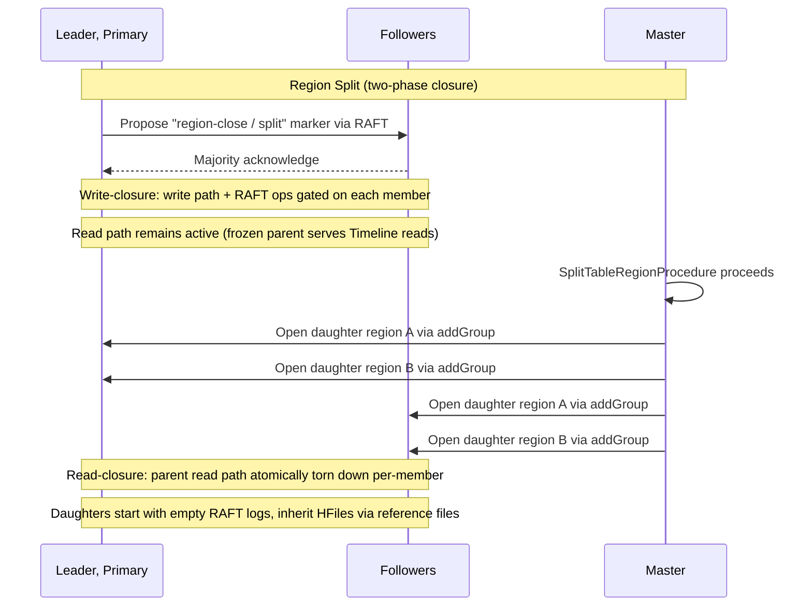

### Safety: No Key-Range Overlap

The core safety property for both split and merge is that no member has both a parent group and the daughter or merged group writing to the same key range simultaneously. The parent's write path is gated immediately on marker application, and the master opens daughter (or merged) groups on a member only after verifying that the split (or merge) marker has been RAFT-committed and locally applied on that member. This per-member guard is the `RegionGroupManager`'s serialization point. The callback triggers write-closure of the parent, and only after this has occurred does the master open daughters on that member (verified by the TLA+ model). The parent's frozen read path, which continues serving Timeline reads during the transition, does not violate this property because it accepts no writes and its data is immutable.

The safety guarantee rests on RAFT entry ordering: `ApplicableEntries` processes entries in monotonically increasing seqId order. A member cannot have applied a later entry without first having applied all earlier entries, including the split/merge marker. The marker's presence in the member's applied state proves parent write-closure. The deferred read-closure is a local scheduling decision that does not affect the RAFT log or any member's consensus state.

### State-Loss Events and Lifecycle Recovery

Three events can clear a member's volatile state, including any applied split/merge marker:

1. **Server crash**: Kills all groups on that server. After restart, the member has no volatile state. The master must re-open all groups on that member after it recovers and re-applies the marker via the RAFT log.

2. **New member bootstrap**: A completely new pod joining the group has no state at all. The member must catch up from the leader (via log replay or snapshot), apply the marker, and then the master can open daughters/merged group.

3. **Snapshot installation**: A leader sends a snapshot to a lagging follower, replacing the follower's memstore with the snapshot contents. The parent group's write path and RAFT operations are gated on marker application (write-closure), so no further RAFT operations occur on the parent. The deferred read path, if still active, is torn down as part of the recovery sequence.

In all three cases, the implementation must treat the member's group lifecycle state as lost and require the master to re-verify that the marker applied on the member before re-opening daughter or merged groups. The `RegionGroupManager` must not assume daughters or merged groups survive any of these state-loss events.

## Shared Storage and Flush Coordination

Read-only replicas share the read-write primary's HFiles on HDFS, keeping the existing directory structure. All replicas of a region read from the same HFiles in the same directory (`/hbase/data/<namespace>/<table>/<encodedRegionName>/`), and only the read-write primary writes HFiles. It is the sole member that runs flush and compaction against HDFS. Read-only replicas open the same HFiles for their read path. The existing HFileLink / StorefileRefresherChore mechanism is retained (and remains necessary) for them to discover new HFiles after the primary flushes.

When the primary decides to flush (whether due to memstore pressure, a periodic trigger, or a manual request) the flush protocol integrates with both the existing WAL flush lifecycle and the RAFT consensus layer. The current HBase flush uses a three-marker WAL protocol tied to the WAL's cache-flush lifecycle methods. For RAFT-enabled regions the RAFT flush-complete marker is proposed in addition to the WAL commit-flush marker, not as a replacement, because the WAL remains the durability mechanism for the leader.

An important ordering change is required. In the current HBase code the memstore size is decremented before the commit-flush WAL marker is written (`HRegion.internalFlushCacheAndCommit()` lines 3021 vs 3035). The RAFT flush protocol reverses this: the memstore is dropped only after the flush-complete marker has been RAFT-committed by a majority (step 11 follows step 10). This ensures that no member drops its memstore until the data is safely materialized in HFiles and the marker is irrevocable. The original HBase ordering is unsafe in a replicated system where multiple members must coordinate memstore drops (verified by the TLA+ model).

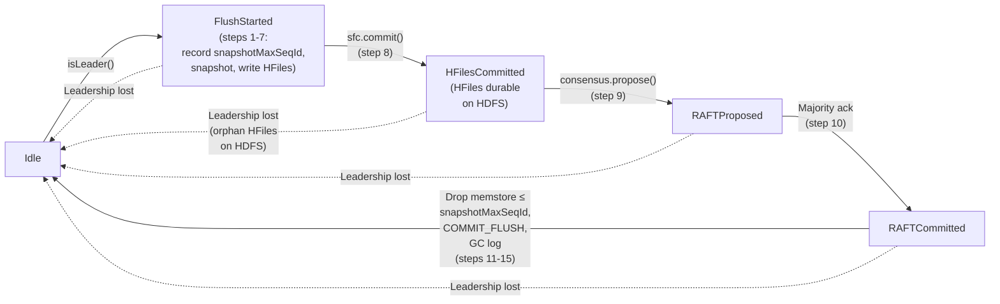

The detailed flush sequence for RAFT-enabled regions:

```
Primary flush protocol (snapshot-boundary):
  1. wal.startCacheFlush()                            [mark flush in progress for this region]
  2. snapshotMaxSeqId = mvcc.getWritePoint()          [record the actual HFile coverage boundary:
                                                       the highest seqId currently in the memstore.
                                                       Any concurrent in-flight writes have seqIds
                                                       above this value (assigned from the monotonic
                                                       WAL seqId counter) and will NOT be included
                                                       in the HFile snapshot.]
  3. flushOpSeqId = getNextSequenceId(wal)            [consume a seqId for the flush WAL marker;
                                                       same WAL seqId generator as mutations --
                                                       single-source property is a hard requirement.
                                                       flushOpSeqId > snapshotMaxSeqId always.]
  4. WALUtil.writeFlushMarker(START_FLUSH)            [to local WAL, no sync]
  5. Take memstore snapshot                           [snapshot covers entries ≤ snapshotMaxSeqId]
  6. Release updatesLock.writeLock()
     (Steps 1-6 are indivisible from a safety perspective: the
      updatesLock.writeLock() held during steps 1-6 prevents concurrent
      writes from modifying the memstore during snapshot, and steps 7-8
      occur before any RAFT interaction.)
  7. doSyncOfUnflushedWALChanges()                    [sync START_FLUSH to HDFS]
  8. Flush memstore snapshot to HFiles in tmp dir     [local operation with HDFS]
  9. sfc.commit()                                     [move HFiles from tmp to store dir]
     (HFiles are now durable and accessible on HDFS.
      HFiles cover entries ≤ snapshotMaxSeqId.)
 10. consensus.propose(FLUSH_COMPLETE marker)         [propose through RAFT]
     Marker includes: flushOpSeqId, snapshotMaxSeqId, list of new HFile paths
 11. Wait for RAFT commit (majority acknowledge)
 12. decrMemStoreSize()                               [drop memstore entries ≤ snapshotMaxSeqId;
                                                       entries above snapshotMaxSeqId (including
                                                       any concurrent in-flight writes) survive]
 13. WALUtil.writeFlushMarker(COMMIT_FLUSH)           [to local WAL, with sync]
 14. wal.completeCacheFlush()                         [clear flushInProgress]
 15. GC RAFT log entries at or below snapshotMaxSeqId
```

The flush protocol checks lease validity only at step 1. Steps 2 through 15 require only that the node's role is leader, not a valid lease. A transient lease expiry during flush is resolved by the next heartbeat refresh, which re-validates the lease, or by step-down, which aborts the flush via the role-transition reset described below. Adding redundant lease checks mid-flush would increase abort frequency without improving safety (verified by the TLA+ model).

The write pipeline and flush pipeline run concurrently using a snapshot-boundary protocol. Unlike the original design, which required mutual exclusion through the entire flush protocol (blocking writes from step 1 to step 14), the snapshot-boundary protocol eliminates the write pause by recording the actual HFile coverage boundary (`snapshotMaxSeqId`) at flush time and using it — rather than `flushOpSeqId` — as the memstore drop boundary. This decoupling is safe because of the monotonic seqId counter: any write that starts after (or concurrently with) the flush receives a seqId from `getNextSequenceId(wal)`, which is always greater than `snapshotMaxSeqId` (since `snapshotMaxSeqId` is recorded before `flushOpSeqId` is consumed, and all future seqIds are above `flushOpSeqId`). Therefore, concurrent writes are above the drop boundary and survive the memstore drop at step 12.

The only write pause is the brief `updatesLock.writeLock()` held during the memstore snapshot (steps 1-6), which is the same narrow lock that stock HBase holds during flush. After the lock is released at step 6, writes proceed concurrently with HFile writing (steps 7-8), HFile commit (step 9), RAFT proposal (step 10), RAFT commit (step 11), and memstore drop (step 12). This reduces the flush-induced write pause from the full flush duration (potentially hundreds of milliseconds to seconds for large memstores or slow HDFS) to just the snapshot duration (typically single-digit milliseconds).

The `flushInProgress` flag is still set at step 1 and cleared at step 14 to prevent overlapping flushes on the same member, but it no longer gates the write path. The write path has no flush-phase check. Safety is ensured by the boundary separation: entries at or below `snapshotMaxSeqId` are in HFiles and eligible for drop; entries above `snapshotMaxSeqId` are not in HFiles and are preserved (verified by the TLA+ model's `FlushDropBoundary` invariant).

On followers, the RAFT flush-complete marker carries `snapshotMaxSeqId` alongside `flushOpSeqId`. When a follower applies the marker, it drops memstore entries at or below `snapshotMaxSeqId` (not `flushOpSeqId`), preserving any in-flight entries between `snapshotMaxSeqId` and `flushOpSeqId` that are not covered by HFiles. RAFT log GC similarly uses `snapshotMaxSeqId` as the boundary: entries at or below `snapshotMaxSeqId` are in HFiles and can be GC'd from the log; entries between `snapshotMaxSeqId` and `flushOpSeqId` must be retained in the log because they are only recoverable via RAFT replay (verified by the TLA+ model's `CatchUpDataIntegrity` invariant).

The error-handling behavior depends on where in the protocol a failure occurs. If the leader crashes before step 9, no HFiles have been written and no RAFT marker has been proposed. The catch block aborts the cache flush, the memstore remains intact on all members, and recovery replays from the WAL. If the crash happens between steps 9 and 11, HFiles exist on HDFS but no member has dropped its memstore. The RAFT proposal may or may not have reached followers. If it reached a majority the marker can be committed by the new leader's log advancement (verified by the TLA+ model). When this occurs, MicroRaft's commit-index advancement must atomically apply the committed entry to the leader's own state machine via the run-operation callback, including the memstore drop for flush markers. The drop uses `snapshotMaxSeqId` from the marker, preserving any in-flight writes between `snapshotMaxSeqId` and `flushOpSeqId`. Without this atomicity, a window exists where the entry is committed but unapplied on the leader, violating MVCC continuity if the leader has already completed promotion (verified by the TLA+ model). If the proposal did not reach a majority, the marker is not committed and all members retain their memstores. The orphan HFiles on HDFS are cleaned up by the new primary or by HFileCleaner, and the new primary may re-flush if needed. A related subtlety is the concurrent-flush scenario. If the new leader initiates its own flush before those orphan HFiles are cleaned up, two sets of HFiles may cover overlapping sequence ID ranges. This is safe because HBase's compaction and read path use sequence ID ranges in HFile metadata to identify overlapping files, and compaction will merge and deduplicate them (verified by the TLA+ model). Between the new flush and the next compaction, scanners may momentarily see duplicate cells from both HFile sets, but HBase's scanner merge logic deduplicates cells with identical row/family/qualifier/timestamp/type, and sequence ID tie-breaking ensures consistent ordering.

If the crash occurs between steps 11 and 13, the RAFT marker has been committed but the local WAL marker has not been written. All surviving members apply the RAFT marker, refresh their store file lists, and drop memstore entries at or below `snapshotMaxSeqId`. The crashed leader's WAL is missing the COMMIT_FLUSH marker, but this is harmless: WAL splitting may find a START_FLUSH without a matching COMMIT_FLUSH, yet the promoted replica does not need WAL recovery because it has the data from RAFT. The RAFT-aware SCP path skips WAL splitting for this region. A crash after step 13 is a normal completion; all members have already transitioned.

Finally, any event that causes the flushing member to lose leadership atomically resets the flush state to idle, with one exception. If the flush marker has already been RAFT-committed, the step-down handler must atomically complete the memstore drop rather than aborting it. Aborting at this point would leave the member's memstore inconsistent. The step-down handler is therefore phase-aware: abort at the flush-started, HFiles-committed, or RAFT-proposed phases; complete at the RAFT-committed phase. In the RAFT-committed case, the step-down handler drops memstore entries at or below `snapshotMaxSeqId`, preserving any concurrent in-flight writes with seqIds above `snapshotMaxSeqId` (verified by the TLA+ model). If the cache flush had already been started and the flush is being aborted, the catch block writes an abort-flush marker to the local WAL, aborts the cache flush, and clears the per-region flush-in-progress flag. The memstore is not dropped. Any HFiles already committed to HDFS become orphans, cleaned up by the new primary or HFileCleaner. Unlike the current HBase code, which kills the RegionServer on a dropped-snapshot exception, a flush abort due to leadership loss does not kill the RS, because the memstore is intact and no data has been lost. This applies uniformly to all leadership-loss scenarios: RAFT proposal failure due to partition, step-down via higher-term discovery such as heartbeat response, vote request, or any RPC carrying a higher term, crash-restart, and new leader election. The new leader in a surviving AZ will re-flush as needed (verified by the TLA+ model).

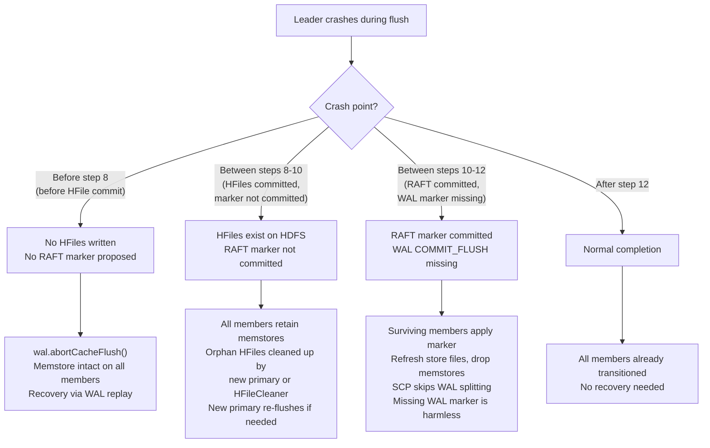

Follower handling of RAFT FLUSH_COMPLETE marker (in the consensus apply callback):

```
Follower flush-complete handling:
  1. Complete any preceding mutation batch (mvcc.completeAndWait)
  2. mvcc.advanceTo(flushOpSeqId)                    [advance MVCC past the marker]
  3. Refresh store file lists from HDFS              [pick up new HFiles]
  4. Confirm HFiles are accessible                   [retry with backoff if HDFS is slow]
  5. Drop memstore entries at or below snapshotMaxSeqId
     (snapshotMaxSeqId is carried in the RAFT flush-complete marker;
      entries between snapshotMaxSeqId and flushOpSeqId are in-flight
      writes that are NOT in HFiles and must be preserved)
  6. GC local RAFT log entries at or below snapshotMaxSeqId
     (entries between snapshotMaxSeqId and flushOpSeqId must remain
      in the log for catch-up recovery)
```

This ensures all members transition from memstore to HFiles at the same logical point in the RAFT log, maintaining consistency (verified by the TLA+ model).

Step 6 is not merely an optimization. Without it, the monotonic apply index invariant can be violated. Entries at or below `snapshotMaxSeqId` that were already dropped from the memstore during step 5 would still be visible in the RAFT log and could be re-applied by subsequent apply callbacks, restoring stale data into the memstore. Note that the GC boundary is `snapshotMaxSeqId`, not `flushOpSeqId`: entries between `snapshotMaxSeqId` and `flushOpSeqId` are only in the RAFT log and must be retained for catch-up recovery (verified by the TLA+ model).

The primary runs compaction. When compaction completes, the primary proposes a compaction marker through RAFT. Replicas pick up the new compacted HFiles via StorefileRefresherChore or an explicit refresh triggered by the compaction marker. Compaction is crash-safe by construction: compacted HFiles are written to a temporary directory and atomically committed (moved into the store directory) only when complete. If the primary crashes mid-compaction, the incomplete output in the temporary directory is ignored and cleaned up by existing HBase housekeeping. The original input HFiles remain valid, and the new primary may re-run the compaction if needed.

StorefileRefresherChore is retained for RAFT-enabled tables as a fallback safety net. The primary mechanism for replicas to discover new HFiles is the immediate store file refresh triggered by the RAFT flush and compaction markers; StorefileRefresherChore supplements this in case marker-triggered refreshes are delayed. The `hbase-consensus` module auto-enables the chore for RAFT-enabled deployments: when any table has `hbase.raft.enabled = true`, the module sets `hbase.regionserver.storefile.refresh.period` to 30000ms and `hbase.regionserver.storefile.refresh.all` to `true` at RegionServer startup, provided these values have not been explicitly configured by the operator. This avoids a configuration gotcha where the chore is left disabled (the HBase default is 0 / meta-only) and replicas silently fail to discover new HFiles when marker-triggered refreshes are delayed.

RegionReplicaFlushHandler is retired for RAFT-enabled tables. The RAFT log replaces async WAL replication for keeping replica memstores current, and flush coordination is handled by RAFT markers rather than by the old replicate-then-flush protocol.

## Read-Only Replica Promotion and AZ-Aware Failover

The design principle for failover is that the RAFT election determines the candidate for new primary region and RAFT leader yet the master remains in charge. Being a RAFT leader is a necessary but not sufficient condition for being the read-write primary. The promoted replica must not serve writes until the master's AssignmentManager has confirmed the promotion by updating META and returning an acknowledgment. This ensures AssignmentManager remains the sole arbiter of which region is primary, consistent with its existing role in all other region state transitions.

Promotion proceeds in three phases (formally verified by the TLA+ model). In the first phase, which is RAFT-internal with no master involvement, a surviving read-only replica wins the internal RAFT election and enters the promoting state. The newly elected leader finishes consuming any remaining RAFT log entries to bring its memstore fully current, including entries that the old leader had committed via RAFT but not yet applied to its own memstore. The new leader's MVCC write point correctly accounts for all such entries, and no MVCC sequence gaps are created. In the second phase, the RegionServer hosting the newly elected leader sends a ReportLeaderElection RPC to the master. The master's LeaderChangeHandler validates the RAFT term against its current known term for this region, updates AssignmentManager's in-memory state and META to record the new primary location and replica ID, and returns confirmation to the RegionServer. In the third phase, the RegionServer completes the local promotion. It transitions the region from read-only to read-write, acquires a WAL reference, and enables flush and compaction. Only after this third phase completes does the promoted replica begin serving writes.

This three-phase protocol runs independently of ServerCrashProcedure. The RAFT election and ReportLeaderElection RPC typically complete before SCP even begins iterating the dead server's regions. SCP's role is coordination and fallback. It ensures all regions on the dead server are accounted for, promotes regions whose fast-path promotion has not yet completed, and schedules replacement replicas to restore the replication factor. Non-RAFT regions on the same crashed server continue to follow the existing WAL-split-and-reassign path unchanged.

The result is a failover with no WAL splitting, no recovered-edits replay, and no full region close/open cycle. The total promotion time from read-only replica to read-write primary is bounded by the consensus layer's election timeout plus memstore catch-up time plus one master RPC round-trip, typically sub-second to a few seconds. Since the HFiles are already on HDFS and accessible, the promoted replica is ready to serve as the new read-write primary as soon as the local promotion steps complete. Clients whose region location cache still points to the old primary will receive a connection error or `NotServingRegionException` and will invalidate their cache and re-read META to find the new primary, exactly as they would during any other region move.

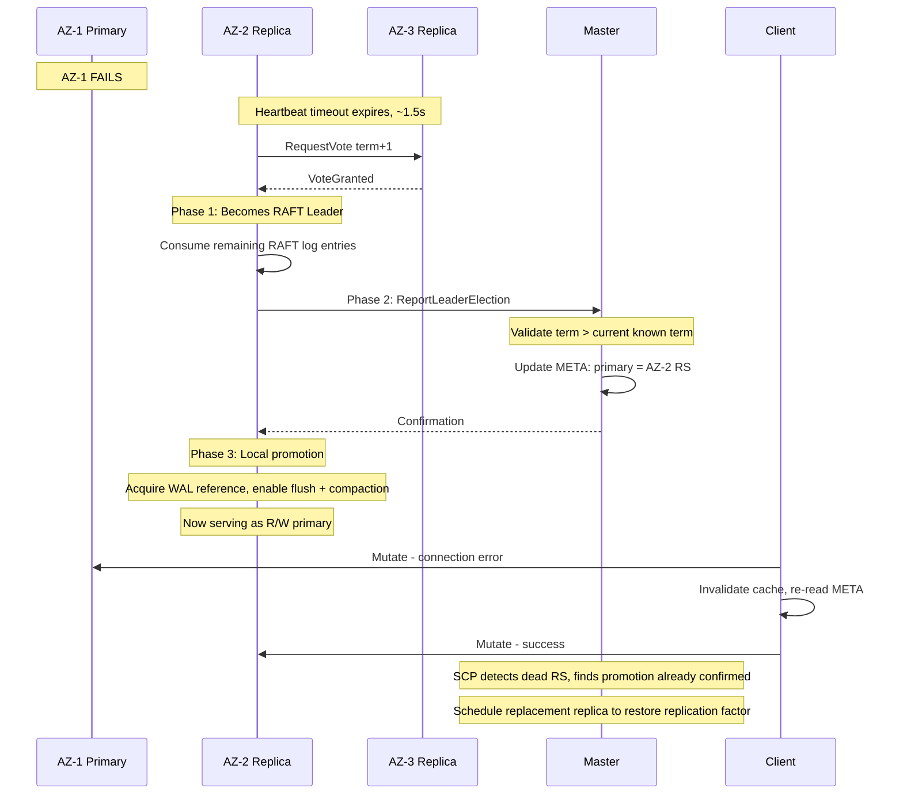

### Promotion Protocol (Region State Transitions)

The promotion protocol executes in three phases. The region is already open (it was serving as a read-only replica), so no close/open cycle is needed. The promoted replica's RegionServer must execute a series of state changes on the HRegion instance, gated by master confirmation.

```
Promotion sequence on the promoted replica's RegionServer:

  Phase 1 — RAFT-internal (no master involvement):
  1. Finish consuming remaining RAFT log entries        [bring memstore fully current;
                                                         if needed entries have been GC'd,
                                                         catch up via the shared-storage
                                                         path encoded as opaque snapshot
                                                         bytes inside InstallSnapshot]

  Phase 2 — Master confirmation (synchronous RPC):
  2. Send ReportLeaderElection(region, replicaId, term) [report election to master]
     to master
  3. Master validates term > current known term          [reject stale notifications]
  4. Master updates RegionStateNode and META             [record new primary location,
                                                         replica ID, and RAFT term]
  5. Master returns confirmation to RS                   [grants primary authority]

  Phase 3 — Local promotion completion (after master confirmation):
  6. region.writestate.setReadOnly(false)               [allow writes]
  7. Acquire a WAL reference for this region            [enable WAL writes]
  8. writeRegionOpenMarker(wal, currentSeqId)           [record open in WAL]
  9. Write .regioninfo if not yet present               [idempotent; the shared HDFS dir
                                                         already has one from replicaId=0,
                                                         but verify it's current]
 10. WALSplitUtil.writeRegionSequenceIdFile(...)        [write seqId file for recovery]
 11. Enable flush triggers                              [region can now flush on memstore
                                                         pressure; the flush trigger check
                                                         uses isLeader() instead of
                                                         replicaId==0]
 12. Enable compaction scheduling                       [region can now compact]
```

Phase 3 cannot begin until the master returns confirmation in step 5. If master confirmation fails or times out, the replica remains a RAFT leader with a valid lease but does not serve writes; it retries the ReportLeaderElection RPC with backoff. Steps 6 through 12 all happen locally on the RegionServer. The region becomes ready to accept client writes after step 7, because both master confirmation and WAL durability are satisfied at that point. The write path must gate on promotion completion, not merely on leader status: the mini-batch mutate path must check both the leader status and a per-region promotion-complete flag that is set only after step 7 finishes. Any write that arrives before promotion completes is rejected with `NotServingRegionException`, which triggers the client's standard retry loop. This guarantees that no write is ever acknowledged without both master confirmation and WAL durability, even though the RAFT leader lease is already valid (verified by the TLA+ model). Safety holds across all states, including crash during promotion, lease expiry during promotion, and double election during promotion.

Once a follower has committed entries in its local state (step 1), the remainder of the promotion protocol proceeds using purely local operations and one master RPC. None of the post-election promotion steps should block on RAFT round-trips or peer communication. The master RPC is the only network interaction in the promotion path, and it is a single synchronous round-trip to the active master.

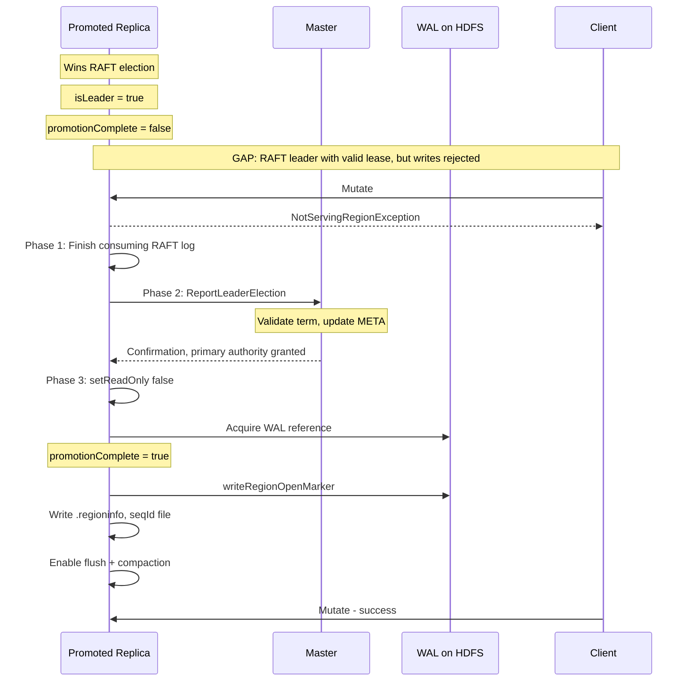

Three edge cases during the promotion gap are worth noting. First, if the promoting leader's lease expires before promotion completes, the leader steps down to follower, and promotion is abandoned. The promotion-complete flag is reset, and no writes were accepted during the gap. If the master has already updated META before the RS stepped down, the stale META entry is harmless. the next leader's ReportLeaderElection will overwrite it with a higher term, and clients that read the stale entry will receive `NotServingRegionException` and re-read META. Second, if a second election occurs while a leader is still in the promotion gap, the old leader's promotion is abandoned when it discovers the higher term and steps down. The new leader starts its own independent promotion. The master's term validation ensures that if both leaders report concurrently, only the higher term wins. In both cases, the promotion-complete flag being per-region and reset on any leadership loss ensures safety (verified by the TLA+ model).

Third, the promoting leader may need to catch up via the shared-storage path during step 1 if the RAFT log entries it needs have been garbage-collected. This can occur when the promoting member was partitioned or crashed for long enough that a flush completed and all members GC'd their logs below the flush index. In this scenario, step 1 cannot complete by replaying log entries alone because the entries no longer exist in any member's RAFT log. Instead, the current leader sends an `InstallSnapshot` carrying a single opaque application-snapshot chunk. The region SPI on the receiving side decodes it as a metadata descriptor pointing at HFiles on HDFS plus the flush sequence ID. The promoting member loads the referenced HFiles from HDFS and sets its memstore to the flush boundary, then continues applying any post-flush committed entries via normal log replay. Once all applicable entries are consumed and step 1 is complete, promotion proceeds to step 2 (master confirmation). No write is accepted until all three phases complete, regardless of which catch-up path was used (verified by the TLA+ model).

When the old primary eventually recovers and reopens, it comes back as a follower. The region opens in read-only mode, and because followers do not write to the WAL, no WAL reference is needed. No open marker, sequence ID file, or region info update is written. The follower replays the RAFT log tail to rebuild its memstore. If the needed log entries have been garbage-collected, it catches up via the shared-storage path instead. The current leader sends `InstallSnapshot` with a single opaque application-snapshot chunk that the region SPI decodes as HFile paths plus a flush sequence ID, and the follower loads the referenced HFiles from HDFS and starts with an empty memstore for post-flush entries. Both catch-up paths produce a correct memstore (verified by the TLA+ model).
When the crashed read-write primary's RegionServer comes back online, it rejoins the RAFT group as a read-only replica. It replays RAFT log entries from its last known position to bring its memstore up to date. If it has fallen too far behind or if its local RAFT log has been lost entirely, it recovers by asking the current leader to flush, then loading the resulting fresh HFiles from HDFS and starting with an empty memstore. This follows the same path as new-member bootstrap (see the "New Member Bootstrap" section). From the client's perspective, this recovery is invisible. The new primary is already serving reads and writes throughout. Once the old primary's memstore is current, it participates normally in RAFT voting and becomes eligible for future promotion.

A special case arises if the old primary had a flush in progress when it crashed. If the flush-complete marker had already been committed through RAFT, the HFiles were fully written to HDFS before the marker was proposed, so the flush stands. All members have already applied or will apply the marker. If the flush-complete marker had not yet been committed, the primary crashed during HFile writes, before it could propose the marker. In that case the flush is simply abandoned. No member has dropped its memstore, so all data remains intact and is rebuilt from RAFT log replay on the promoted replica. Any orphan partial HFiles left on HDFS are cleaned up by the new primary or by existing HBase housekeeping .

**Changes to AssignmentManager: LeaderChangeHandler and primary registry.**

AssignmentManager gains a new LeaderChangeHandler that processes ReportLeaderElection RPCs from RegionServers independently of ServerCrashProcedure. This is the fast path for promotion. The RegionServer reports the RAFT election result directly to the master, and the handler validates and confirms it. The handler acquires the per-region lock on the RegionStateNode, validates that the reported RAFT term exceeds the current known term for the region, rejecting stale notifications, validates that the reporting RegionServer is alive and not in CRASHED state, updates the RegionStateNode with the new primary location, primary replica ID, and RAFT term, persists the update to META through the existing region state store, and returns confirmation to the RegionServer. This is a direct META update with no procedure framework overhead, no TRSP state machine, and no open/close cycle. It uses the same RegionStateNode lock, region state store, and META update path that TransitRegionStateProcedure already uses, maintaining design fidelity with the existing assignment machinery.

A special case applies when the ReportLeaderElection is for a META region. If META is RAFT-enabled and its primary was in the failed AZ, the standard confirmation path would create a circular dependency. The handler detects this case and uses an in-memory-only confirmation path, updating the RegionStateNode in AssignmentManager's in-memory state but skipping the META persistence step. Confirmation is returned to the RegionServer immediately, allowing META's promoted replica to complete Phase 3 and begin serving writes. Once META is writable, the master writes META's own promotion record as a deferred idempotent operation. See "META Region Self-Promotion Bootstrap" below for the full protocol, ordering constraints, and failure analysis.

Two new fields are added to RegionStateNode: a RAFT term field that records the RAFT term of the current primary, used for stale-notification fencing, and a primary replica ID field that records which replica ID is currently acting as primary, replacing the hardcoded assumption that the primary is always replica ID 0. Both fields are persisted to META. A new ReportLeaderElection RPC is added to the RegionServer status service, carrying the region name, replica ID, and RAFT term.

**META Region Self-Promotion Bootstrap.**

When META is a RAFT-replica-enabled region, its failover introduces a circular dependency in the promotion protocol. A two-tier confirmation protocol breaks the circular dependency while preserving the design principle that AssignmentManager remains the sole arbiter of primary status. For META's own promotion, the LeaderChangeHandler uses an in-memory-only confirmation path. After META is writable, the master writes META's own promotion record as a deferred idempotent operation, a self-referential write that records META's new primary location in META itself. This deferred write uses the same idempotent term-fenced update path as the standard confirmation, so retries are safe.

For all non-META regions, the standard confirmation path applies. The handler persists to META before returning confirmation. If META is unavailable when a non-META ReportLeaderElection arrives, the handler returns a retry-eligible response. The RegionServer retries with backoff until META is available. This creates a natural ordering: META's promotion completes first via the in-memory-only path, then non-META promotions proceed via the standard META-writing path. (This ordering is modeled in the multi-group TLA+ composition.) If the master crashes after confirming META's promotion in memory but before the deferred self-write completes, the backup master takes over and reconstructs META's location. If both the master and META's primary are in the failed AZ, the backup master must first become active, then process META's ReportLeaderElection through the in-memory-only path. The META RAFT election proceeds independently of master election. Surviving META replicas elect a new RAFT leader as soon as heartbeat timeout fires, even before the backup master is active. The new master processes the backlogged ReportLeaderElection on startup. If META's RAFT leader crashes after completing promotion but before any non-META promotions are confirmed, META's RAFT group re-elects, the new META leader completes promotion through the same in-memory-only path, and non-META confirmations resume. No non-META region can reach the "Complete" promotion state without META being available, ensuring no write is ever acknowledged against a region whose promotion has not been persisted to META.

**Changes to TransitRegionStateProcedure: PRIMARY_PROMOTED transition.**

TRSP gains a new transition type, PRIMARY_PROMOTED, which updates META (the server, primary-replica-ID, and raft-term columns) without going through the full open/close cycle. This is the procedure-backed path for promotion, used by SCP when it needs the procedure framework's retry and persistence guarantees. SCP invokes this transition when promoting a RAFT-elected replica through the fallback path, and the promoted replica's RegionServer then executes the local promotion steps to transition the HRegion from read-only to read-write. The non-SCP happy path (LeaderChangeHandler) bypasses TRSP entirely for speed, since the transition is a simple META update. The existing replica sanity check remains valid and verifies that the default replica's region definition exists in the region states.

**Changes to ServerCrashProcedure: coordinator and fallback role.**

SCP gains a RAFT-aware path for regions that have RAFT enabled. SCP's role for these regions is coordination and fallback, not the primary promotion mechanism. In the happy path, the LeaderChangeHandler has already processed the leader change before SCP even begins iterating regions. SCP's RAFT-aware path proceeds as follows:
1. skip WAL splitting for RAFT-enabled regions and if META is among the dead server's RAFT-enabled regions, process it first;
2. for each RAFT-enabled region on the dead server, check whether the master has already confirmed a new leader by examining the RegionStateNode. If the current primary is on a live server, the promotion is already complete;
3. if no leader change has been processed yet, SCP waits with a bounded timeout for the RAFT election to complete and for the RegionServer to send ReportLeaderElection;
4. if the dead server's replica was the primary and the fast path has not completed, SCP creates a TransitRegionStateProcedure with PRIMARY_PROMOTED type as a fallback. This provides the procedure framework's retry and persistence guarantees when the fast path has not completed;
5. if the dead server's replica was a follower rather than the primary, SCP schedules a replacement replica assignment;
6. SCP schedules a replacement replica to restore the replication factor from two back to three.

When the crashed server was hosting a promoted non-default replica that was acting as primary, SCP must determine whether the crashed replica was the current primary by consulting the primary-replica-ID field in the RegionStateNode. If the crashed replica was the primary, SCP follows the RAFT-aware path. If the crashed replica was a follower, SCP simply schedules a replacement. The ABNORMALLY_CLOSED state requires special attention. The existing logic that skips recovered-edits replay for non-default replicas is correct for RAFT-enabled regions because RAFT replicas recover via the RAFT log, not via recovered edits. However, after a RAFT promotion, a crashed non-default replica that had been acting as primary also enters ABNORMALLY_CLOSED state, so SCP must recognize this situation via the primary registry and route it through the RAFT-aware failover path rather than the standard reassignment path.

**Balancer: RAFT-replica awareness.**

The balancer continues to operate through region close and open requests. Sending a region close request to the current primary is equivalent to requesting a leadership transfer by other means. The primary's RegionServer closes the region, the RAFT leader steps down, a new leader is elected among the surviving members, and the full three-phase promotion protocol runs. The balancer then opens the "moved" region on the target server, where it opens as a RAFT follower.

It is expected that AZs are mapped to racks in the topology configuration. Each AZ is represented as a single rack string in the rack manager. This means the existing rack-level replica colocation tracking already captures AZ-level colocation with no new data structures.

The balancer is extended for RAFT-replica awareness. First, the rack-level replica cost function's multiplier should be elevated for RAFT-enabled tables. AZ ("rack") colocation is not merely a load-balancing preference but a correctness concern. Placing two members of the same RAFT group in the same AZ means a single AZ failure loses quorum. A new AZ-level cost function, subclassing the existing abstract replica grouping cost function in the same pattern as the rack-level cost function, must carry a multiplier at least as high as the host-level cost function. Second, the existing distribute-replicas hard constraint, which is off by default, should be auto-enabled when any table has RAFT enabled. The existing constraint already validates at server, host, and rack levels, which covers AZ distribution when racks map to AZs. This makes AZ distribution a hard constraint. The balancer will not accept any move that creates AZ colocation for a RAFT group. Third, the existing primary region count skew cost function identifies the primary by a static mapping where replica ID 0 is always the primary. For RAFT-enabled tables, the primary is dynamic. Any replica ID can be the current primary. The balancer's cluster state must be extended to track which region is the current RAFT primary, populated from AssignmentManager's primary registry, and the primary skew cost function must use this dynamic information. Fourth, a new cost function should penalize moving the current RAFT primary for a region. Moving a follower is lightweight. Moving the primary triggers an election and promotion cycle with a write-unavailability gap. The cost function biases the stochastic search toward moving followers when possible. The multiplier should be significant but not prohibitive, since sometimes moving the primary is the only way to achieve a balanced state.

## Meta Updates and Server-Side Routing

Clients continue to use the standard HBase region location protocol: ask the master for the META region location, read META to find the primary region's RegionServer, and send RPCs there. RAFT is entirely invisible to clients. There are no new client-side exceptions, no new META columns read by clients, and no changes to the client library's region location logic.

When the master confirms a RAFT leader change, whether through the LeaderChangeHandler fast path or through SCP's PRIMARY_PROMOTED fallback, it updates META to point to the new primary's RegionServer. The per-replica server columns continue to track where each replica is hosted. A new primary-replica-ID column records which replica ID is currently acting as primary, and a new raft-term column records the RAFT term of the current primary. Both are used by the master and AssignmentManager for internal bookkeeping and are not read by clients.

META is updated before the RegionServer completes the local promotion steps. The RegionServer does not transition the region from read-only to read-write, acquire a WAL reference, or accept writes until the master has returned confirmation. This ensures that by the time any client can successfully write to the promoted replica, META already reflects the new primary location. The ReportLeaderElection RPC is separate from the existing reportRegionStateTransition mechanism. It is a new, lightweight RPC on the RegionServer status service, carrying only the region name, replica ID, and RAFT term. It does not go through the procedure framework and does not create a TransitRegionStateProcedure. The master's LeaderChangeHandler validates the term against the current known term for the region, which prevents stale or duplicate notifications from overwriting newer state. If the reported term is less than or equal to the current known term, the handler rejects the report and returns a rejection to the RegionServer.

If a client sends an RPC to a RegionServer that is no longer hosting the primary, because the master promoted a different replica, the RegionServer returns a `NotServingRegionException`, which is the standard response when a region has moved. The client invalidates its region location cache, re-reads META, and finds the new primary. Similarly, if a read-only replica's RegionServer receives a write RPC because the client's cache is stale, the replica is not the RAFT leader and does not have write authority, so it also returns `NotServingRegionException`, triggering the same client retry-with-META-lookup path. No new exception types are needed in either case.

The scope of "is this the default replica" assumptions is broad. On the RegionServer, checks that ask "is this replica ID zero" must be replaced with "is this the RAFT leader" for RAFT-enabled tables. Today the read-only flag, WAL open and close markers, region info and sequence ID file writes, flush triggers, WAL markers for flush and compaction, and replication barrier updates all gate on whether the replica ID is zero. After this change they gate on whether the member is the RAFT leader, so that any replica can perform these operations when it is promoted to primary. On the master, operations that hardcode replica ID zero as the target must instead look up which replica ID is currently acting as primary, via the new primary-replica-ID column in META or AssignmentManager's in-memory primary registry. This affects table flush procedures, snapshot procedures, the assignment manager's meta-assigned bookkeeping, and the balancer's primary cost functions. The old async replication flush handler is retired entirely for RAFT-enabled tables because RAFT markers handle flush coordination. Filesystem path normalization to replica ID zero is correct because all replicas share the same HDFS directory. Table deletion archives using the replica-ID-zero encoded name for the same reason. Recovered-edits checks that return false for non-default replicas are correct because RAFT replicas recover via the RAFT log. The META row key uses replica ID zero as a schema convention unrelated to which replica is primary. The procedure sanity check that verifies the default replica's region definition exists concerns identity, not primary status.

Two special cases need new handling. First, a promoted replica must not replay recovered edits but must replay the RAFT log tail during re-initialization. Second, a method that returns immediately for read-only regions must instead wait for flushes after promotion, addressed by flipping the read-only state at promotion time.

## New Member Bootstrap

When a new member joins a RAFT group (e.g., replacing a crashed member to restore the replication factor):

1. The master assigns the replacement replica to a RegionServer in a healthy AZ.

2. The RegionServer opens the region and adds a new RAFT group member via the region group manager.

3. The new member loads the shared HFiles from HDFS (they are already accessible, so no transfer is needed). This gives the new member the data up to the last flush.

4. The leader detects the new member is lagging (log index 0) and sends post-flush RAFT log entries from its own local RAFT log via AppendEntries RPCs over the network. The new member receives these entries, applies them through the consensus apply callback, and builds its memstore to the current state. The new member has no local RAFT log at this point; it creates one as it receives entries. If the leader concurrently initiates a flush during catch-up, the flush-complete marker arrives as a committed entry; the catching-up member processes it through the normal follower apply path, refreshing store files from HDFS and dropping memstore entries below the flush watermark. The flush-watermark exclusion in the apply callback prevents entries dropped by the flush from being re-applied from the refreshed HFiles (verified by the TLA+ model).

5. If the leader's RAFT log entries below the current commit index have been garbage-collected, the leader sends `InstallSnapshot` carrying a single opaque application-snapshot chunk that the region SPI on the receiving side decodes as HFile paths plus the flush sequence ID. The new member loads those HFiles from HDFS and starts with an empty memstore. If no flush has occurred yet but the new member is too far behind, the leader triggers a flush first to materialize the memstore into HFiles, then sends the `InstallSnapshot` snapshot.

6. Once caught up, the new member participates normally in RAFT voting and is eligible for future promotion to primary.

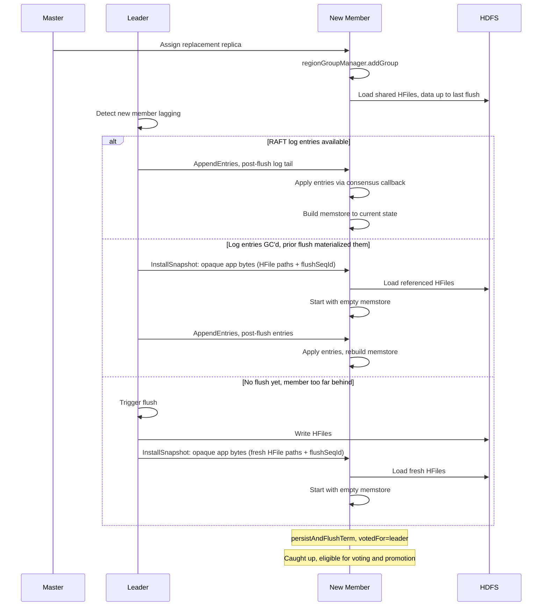

When the leader bootstraps a new member, the new member persistently records a vote for the bootstrapping leader in the current term. A replacement pod has no persistent state and therefore no prior vote record. If the new member joined the group with no voted-for record at the leader's term, it could vote for a different candidate in the same term — violating the RAFT invariant that each member votes at most once per term and enabling a second leader election in the same term. Recording the bootstrapping leader as the voted-for member is safe because the leader is actively replicating data to this member; the member implicitly recognizes this leader's authority for the current term. In `hbase-consensus`, the install-snapshot handling path calls `persistAndFlushTerm()` with the voted-for field set to the leader's endpoint (not `null`) before sending the response.

The bootstrap proceeds only if the bootstrapping leader's term is at least as high as the member's current term. In a partition scenario, a stale leader (lower term) could attempt to bootstrap a member that has already accepted a higher term from the current leader. If the stale leader were allowed to reset the member's term backward, it would gain a quorum of heartbeat responders, enabling it to refresh its lease while the current leader also holds a valid lease, violating the exclusive-lease invariant. `AppendEntriesRequestHandler` rejects requests from lower-term leaders. The same term check is mirrored in `InstallSnapshotRequestHandler`, so both catch-up entry points refuse a stale-term leader before any local state is mutated.

The new member's bootstrap receives entries from the leader via AppendEntries, or it receives an `InstallSnapshot` whose opaque application-snapshot bytes the region SPI decodes as HFile paths and a flush sequence ID, and then it loads those HFiles from HDFS. The local RAFT log on the new member's disk is created from scratch as entries are received from the leader. This is consistent with the RAFT log being a local-disk, non-durability mechanism. Loss of the local RAFT log, whether from instance replacement or disk failure, is recovered via the leader's log.

Because the HFiles are on a shared filesystem, no bulk data transfer between members is needed. The new member simply opens the existing HFiles and receives the RAFT log tail from the leader via AppendEntries. If the RAFT log tail is unavailable (GC'd), the primary triggers a flush first, and the new member starts with the fresh HFiles and an empty memstore.

In standard RAFT implementations, the InstallSnapshot RPC transfers the full state machine snapshot over the network to a lagging follower. For HBase, that would mean transferring the region's HFiles over the consensus transport, which is the opposite of the shared-HDFS design. The consensus layer cleanly avoids this by separating Raft-state catch-up from application-state catch-up. Raft state (term, log, snapshot term/index, group-members view) is delivered through the standard `AppendEntries` and chunked `InstallSnapshot` paths inside `hbase-consensus`. The application-state payload that the snapshot transports is opaque to the consensus layer. It is whatever bytes the region-side `ConsensusSpi.takeStateSnapshot` produces on the leader, round-tripped as a single chunk through the standard `InstallSnapshot` wire path, and handed back to `ConsensusSpi.installStateSnapshot` on the follower. The HBase region SPI uses this opacity to encode a metadata-only descriptor pointing at HFiles on HDFS plus a flush sequence ID, so the lagging follower loads HFiles directly from HDFS rather than streaming them across the consensus transport.

Chunks are streamed over the consensus transport and reassembled on the follower, after which the follower's log is truncated to the snapshot index and the state machine resumes from the snapshot's commit index. The shared-storage behavior the design calls for is implemented entirely above the consensus layer, in the region-side SPI: `RegionStateMachine.takeSnapshot` produces a metadata-only descriptor as opaque application bytes, the leader's catch-up trigger logic decides between sending `AppendEntries` and `InstallSnapshot`, and the receiving member's SPI implementation interprets the bytes. From the consensus layer's perspective every snapshot transfer is identical. The follower's log is truncated to the snapshot index, and every committed entry remains recoverable.

The shared-storage catch-up path serves three scenarios:
1. new member bootstrap, where a freshly added member loads HFiles and receives the RAFT log tail from the leader via AppendEntries over the network;
2. old primary rejoin, where a crashed primary recovers as a follower and catches up via HFiles if its needed log entries have been GC'd;
3. promoting leader catch-up, where a newly elected leader in the promoting phase needs entries that have been GC'd from all members' logs and must load HFiles before completing Phase 1 of the promotion protocol.

All three scenarios use the same chunked `InstallSnapshot` mechanism, with the application-snapshot bytes encoding HFile paths plus a flush sequence ID so the receiver loads HFiles directly from HDFS. (The TLA+ formal model has verified the safety of this path across all three scenarios.) Every committed entry is recoverable via RAFT log replay, present in a majority of logs, or via HFiles on HDFS, covered by a committed flush marker with durable HFiles. No write is accepted until all three promotion phases complete, regardless of whether the promoting leader caught up via log replay or the shared-storage path.

## Key Risks and Corner Cases

**Split-brain prevention.** A stale primary's proposals are rejected by replicas who have seen a higher RAFT term. A stale leader's ReportLeaderElection cannot overwrite a newer leader's META entry because the handler rejects any reported term that is less than or equal to the current known term. The combination of RAFT lease exclusivity and master term fencing provides two independent layers of split-brain prevention. A new member must also record a vote for the bootstrapping leader, preventing double-voting in the same term, and must reject bootstrap from a stale leader whose term is lower than the member's current term, preventing a stale leader from refreshing its lease.

**Master unavailable during promotion.** If the master is unavailable when the RAFT leader attempts the ReportLeaderElection RPC, the RAFT leader holds a valid lease and can continue to serve reads, but it cannot serve writes because the promotion-complete flag is not set without master confirmation. The RegionServer retries the ReportLeaderElection RPC with exponential backoff until the master is available. Failover latency during simultaneous master failure is bounded by master election time plus one RPC round-trip.

**Stale notification from a partitioned old leader.** A partitioned replica that steps down, loses leadership, but whose delayed ReportLeaderElection arrives at the master after a newer leader's notification is handled by term fencing. The LeaderChangeHandler rejects the stale report because the reported term is less than or equal to the current known term.

**Master confirmation arrives after RegionServer lease expires.** The RegionServer's RAFT leader lease may expire while waiting for master confirmation. The RegionServer steps down to follower, abandons promotion, and the promotion-complete flag is reset. If the master's confirmation arrives after the RegionServer has stepped down, the RegionServer discards it because it is no longer leader in that term. The master's META update pointing to this RegionServer is stale but harmless.

**SCP races with LeaderChangeHandler.** Both SCP and the LeaderChangeHandler may attempt to update META for the same region concurrently. The RegionStateNode lock serializes them. The term check ensures only the highest-term update wins. If the LeaderChangeHandler has already processed term T, SCP's TRSP for the same region at term T is a no-op (term less than or equal to current). If SCP's TRSP processes first, the subsequent LeaderChangeHandler call for the same term is also a no-op.

**Region close as leadership transfer (balancer-initiated).** The balancer sends a region close to the current primary's RegionServer. The RegionServer closes the region, the RAFT leader steps down, a new leader is elected among the surviving members, and the full three-phase promotion protocol runs. The balancer then opens the region on the target server as a follower. During the promotion gap, the region is unavailable for writes. This is an acceptable trade-off. The promotion gap is the same duration as a crash-triggered promotion, on the order of sub-second to few seconds.

**Double election during master confirmation.** While member A is waiting for master confirmation in term T, a new election occurs and member B wins in term T+1. Member B sends ReportLeaderElection at term T+1, which the master processes (term T+1 exceeds term T). When member A's delayed confirmation for term T returns, the RegionServer discards it because it has already stepped down (it discovered term T+1 via RAFT). The master's term check also handles the reverse ordering: if A's report arrives after B's, it is rejected as stale.

**Deterministic apply.** All RAFT members must apply the same operations in the same order with the same outcome. HBase mutations are already deterministic given the same cells and timestamps. The main risk is non-deterministic coprocessor observers. These must either be audited for determinism or disabled on replicas (only run on the primary). The consensus apply callback should check whether this member is the leader before invoking coprocessor hooks that have side effects.

**Phoenix coprocessor interactions.** Phoenix deploys several coprocessors that are sensitive to the RAFT replication model. `IndexRegionObserver` runs the pre-batch-mutate hook synchronously in the write path, generating index table mutations as a side effect. On the leader, these index mutations are generated before the RAFT proposal. On followers, the apply callback writes data cells directly to the memstore without triggering the pre-batch-mutate hook, so no index mutations are generated on followers. This is correct: index mutations are a leader-side concern. However, during failover, if the old leader committed a RAFT entry but the corresponding index table mutations from `IndexWriter` had not yet committed, the data table and index table will be temporarily inconsistent. This is handled by Phoenix's existing `GlobalIndexChecker` read-repair mechanism, which detects unverified index rows and back-checks them against the data table. No new index consistency mechanism is needed, but operators must be aware that index read-repair activity may spike briefly after a failover. Other Phoenix coprocessors that must execute only on the RAFT leader include `UngroupedAggregateRegionObserver` (server-side DELETE/UPSERT SELECT), `SequenceRegionObserver` (sequence increments on SYSTEM.SEQUENCE), and `MetaDataEndpointImpl` (DDL operations on SYSTEM.CATALOG). The leader status check in the write path gates all of these correctly.

**Phoenix batch mutation sizing.** A Phoenix mutation commit can contain up to `phoenix.mutate.batchSize` (default 1000) individual HBase mutations, arriving as a `multi()` RPC. The RegionServer groups these by region. Each region's sub-batch passes through `doMiniBatchMutate()` and produces one WALEdit per mini-batch, which is one RAFT proposal. No Phoenix-specific logic is needed in the consensus layer. However, a large per-region sub-batch produces a proportionally large RAFT proposal. For deployments where per-proposal size must be bounded, `hbase.consensus.propose.max.bytes` triggers mini-batch subdivision at the RAFT boundary. Operators should monitor `consensus_proposal_bytes` to track per-proposal size and tune the threshold if needed.

**Clock skew.** Cell timestamps come from either the client or the server's current time. In the RAFT model, the primary assigns timestamps during mini-batch preparation before proposing through RAFT, so all members see the same timestamp. This is already the case for the current write path, so no change is needed.

**Flush coordination.** The primary writes HFiles to HDFS first, then proposes a flush-complete marker through RAFT. All members transition from memstore to HFiles at the same logical point in the RAFT log. Because HFiles are fully written before the marker is proposed, there is no window where a member has dropped its memstore but HFiles are unavailable. The flush-complete marker carries both `flushOpSeqId` and `snapshotMaxSeqId` . The memstore drop on all members uses `snapshotMaxSeqId` as the boundary, not `flushOpSeqId`, so that concurrent in-flight writes are preserved. RAFT log GC also uses `snapshotMaxSeqId` as the boundary, retaining entries between `snapshotMaxSeqId` and `flushOpSeqId` in the log because they are only recoverable via RAFT replay. Replicas pick up the new HFiles from HDFS upon applying the flush-complete marker via an immediate store file refresh triggered by the marker, supplemented by StorefileRefresherChore as a fallback. A brief delay in replica HFile discovery does not affect client-visible consistency for either default reads or Timeline reads.

**Inter-AZ latency impact.** Every write now requires both a WAL sync and a RAFT round-trip to a majority, but these run in parallel. The write latency is the maximum of the WAL sync and the RAFT round-trip, not the sum. In a cross-AZ deployment with HDFS replication factor 3, the HDFS WAL pipeline includes inter-AZ hops. The write must reach and be acknowledged by DataNodes in at least two AZs. Realistic HDFS WAL sync latency in this configuration is ~3-5ms. The RAFT consensus round requires only a network round-trip to the nearest follower (~2ms cross-AZ) because fdatasync on the consensus log is decoupled from the consensus round. The RAFT consensus overhead is fully hidden behind the HDFS WAL sync. The parallel barrier adds no additional latency over today's single-WAL path in a cross-AZ HDFS deployment. The trade-off is that on crash recovery, up to 100ms of consensus log entries may need to be replayed from peers, which is trivial given that the HDFS WAL is the durability mechanism.

**ASYNC_WAL incompatibility.** RAFT-enabled tables must use `SYNC_WAL` or `FSYNC_WAL` durability. `ASYNC_WAL` is incompatible with the "no data loss" failover guarantee: `ASYNC_WAL` skips WAL sync (the data is appended to the ring buffer but the caller does not wait for HDFS ack), and if RAFT replication were also fire-and-forget, neither WAL durability nor RAFT replication would be guaranteed. A client-acknowledged write could be lost if the leader crashes before either path completes. Table creation and alteration should reject `ASYNC_WAL` for tables with `hbase.raft.enabled = true`.

**RAFT log on local disk.** The RAFT log is stored on local disk and exists solely to keep follower memstores warm for fast promotion. If a member loses its local RAFT log (e.g., instance replacement), the current leader triggers a flush to materialize the memstore into HFiles on HDFS, then the recovering member loads the fresh HFiles and starts with an empty memstore, the same path as new member bootstrap. The RAFT log is rebuilt from the leader's log via `AppendEntries` or, when needed, from HFiles on HDFS via `InstallSnapshot` whose opaque application-snapshot bytes the region SPI decodes as HFile paths plus a flush sequence ID. EBS root volume IOPS and throughput provisioning should account for the consensus log's sequential write and fdatasync workload.

**Election liveness under adversarial schedules.** Election liveness depends on unbounded RAFT terms and unbounded real time. Any implementation that caps election retry attempts, limits the maximum term number, or imposes a hard timeout on the election process risks violating liveness. If election terms are capped at some maximum value, a series of failed elections can exhaust the cap. Operators who introduce circuit breakers or rate limiters around election retries must ensure they bound the *rate* of attempts, not the total *number* of attempts.

**Scalability at thousands of groups per RegionServer.** A typical RegionServer hosts hundreds to thousands of regions. The consensus layer's architecture (shared event loop, store-level heartbeat coalescing, and unified multiplexed log, all described in the "Consensus Layer Architecture" section) is designed to handle O(10000) groups per RS with overhead proportional to the active write rate, not the total group count.

*Expected resource profile at N=10000 groups per RS:*

- **Threads:** O(CPU cores)
- **Heartbeat network messages:** 2 per tick (one coalesced message per peer)
- **Data-path network messages:** O(peers) per tick (one coalesced batch-append-entries per peer)
- **Heartbeat network cost:** O(peers) per tick regardless of group count, thanks to store-level heartbeat coalescing. All groups are actively heartbeated but the network cost is constant.
- **Consensus log I/O:** 1 sequential write stream to NVMe, not 10000 file handles. fdatasync amortized across all groups with pending writes per coalescing window.
- **Proposal batching:** Under sustained write load, N proposals per group are amortized into 1 AppendEntries. Follower apply batching reduces MVCC overhead from N begin/complete cycles to 1 per batch.
- **Per-proposal size:** A Phoenix batch of `phoenix.mutate.batchSize` (default 1000) mutations touching K regions yields approximately K RAFT proposals, each carrying approximately 1000/K mutations. The per-proposal WALEdit size is tens to hundreds of KB. The three-level batching hierarchy (mini-batch grouping, mailbox drain, transport coalescing) ensures that consensus overhead scales with the number of regions written, not the number of individual mutations. `hbase.consensus.propose.max.bytes` provides an upper bound on per-proposal size for deployments with very large batches.

*Configuration:*

- `hbase.consensus.port`: Dedicated Netty port for consensus traffic (default: 16080).
- `hbase.consensus.worker.threads`: Shared thread pool size for the multi-RAFT executor (default: a small multiple of available cores, currently 2× cores).
- `hbase.consensus.heartbeat.interval.ms`: Heartbeat sweep tick interval (default: 250). The store-level sweep dispatches per-group control-lane work at this cadence.
- `hbase.consensus.leader.heartbeat.timeout.ms`: Leader heartbeat timeout, i.e., how long a follower waits before declaring the leader dead and initiating an election (default: 10000). The leader lease duration is derived from this value as `timeout − 2 × max clock drift`; with the default max clock drift of 200ms the resulting lease is 9600ms. The configuration validator enforces that the timeout is strictly greater than twice the max clock drift, so the derived lease is always positive.
- `hbase.consensus.heartbeat.posttick.flush.delay.ms`: Delay between a heartbeat tick and the post-tick flush hook that drains every peer channel's heartbeat mailbox (default: small fraction of the tick interval, currently approximately one-fiftieth of the tick, i.e., about 5ms at the default 250ms tick).
- `hbase.consensus.executor.control.batch.cap`: Per-pass cap on control-lane mailbox tasks drained before yielding to the bulk lane (default: 32).
- `hbase.consensus.executor.drain.batch.cap`: Per-pass cap on bulk-lane mailbox tasks drained before re-submitting the group to the pool (default: 64).
- `hbase.consensus.log.segment.size.mb`: Unified consensus log segment size (default: 256).
- `hbase.consensus.log.fsync.interval.ms`: Periodic fsync interval for the unified log under default (Tier B) durability (default: 10000). Log entries, snapshot chunks, and truncations are persisted as page-cache durability on the gathered write; `fsync` is fired at segment roll and on this periodic timer.
- `hbase.consensus.log.fsync.on.commit`: When `true`, the consensus log additionally fsyncs each gathered write before the commit-index advances and before the follower acknowledges, providing strict on-disk durability per commit (default: `false`).
- `hbase.consensus.propose.batch.max.entries`: Maximum proposals combined into a single AppendEntries per group (default: 1024). With the server-wide pending-bytes credit pool preventing memory blow-up under bursts, the entry cap is set high enough that the byte budget is the binding constraint for any reasonably-sized payload.
- `hbase.consensus.propose.max.bytes`: Maximum WALEdit size (in bytes) for a single RAFT proposal (default: 16MB). Mini-batches whose accumulated WALEdit exceeds this size are subdivided into multiple proposals. Controls intra-proposal size independently of the WAL mini-batch size.
- `hbase.consensus.maxgroups`: Maximum RAFT groups per RS (default: the value of `hbase.regionserver.maxregions`).
- `hbase.consensus.transport.compression`: Compression codec for RAFT entry payloads on the wire and in the consensus log (default: `none`; supported codecs include Snappy, LZ4, and ZStd). When enabled, the leader compresses each entry's payload before proposal and the chosen codec is advertised on the wire in each entry header so receivers do not need matching configuration. The performance analysis below assumes Snappy is enabled for production cross-AZ deployments because uncompressed replication would waste network capacity that the deployment budgets for headroom.
- `hbase.consensus.quiescence.enabled`: Opt-in switch for idle-group heartbeat quiescence (default: `false`). Recommended only for very large group counts where the per-group payload of every heartbeat envelope becomes a non-trivial fraction of cross-AZ traffic.
- `hbase.consensus.quiescence.grace.ms`: Grace period a leader waits after the last successful proposal returned to its caller before marking its group quiescent, when quiescence is enabled (default: 1000).

*Monitoring:* Expose per-RS metrics for RAFT group count, aggregate heartbeat rate, consensus log disk usage, apply latency, propose latency, `consensus_proposals_batched` (histogram of entries per AppendEntries), `consensus_apply_batch_size` (histogram of entries per follower apply), `consensus_appends_coalesced` (histogram of groups per BatchAppendEntries frame), and `consensus_proposal_bytes` (histogram of WALEdit bytes per proposal, for visibility into per-proposal size under Phoenix batch workloads). Alert on group count approaching the configured limit. Network health must be tracked per member-to-member link, not just per RegionServer. A `consensus_peer_link_up` gauge per peer reports whether the Netty connection to that peer is currently established. A `consensus_peer_last_response_ms` gauge per peer tracks time since the last successful message exchange. Partial partitions can leave some members fully connected while others are isolated.

Since only the primary writes HFiles to HDFS, the primary's ability to flush depends on HDFS availability. If HDFS is degraded (e.g., the NameNode in the primary's AZ is unreachable), the primary cannot flush but can continue to accept writes in memstore (bounded by memstore size limits). RAFT replication continues independently of HDFS. Replicas receive and apply RAFT log entries to their memstores regardless of the primary's flush status. If the primary cannot flush for an extended period, it will hit memstore back-pressure and slow down writes, which is the same behavior as a non-replicated region under HDFS pressure.

## Compatibility

### Client and Wire Compatibility

A new Netty port on each RegionServer carries internal RAFT traffic between replicas. The existing HBase client-server RPCs are unchanged. The consensus port carries only internal RAFT messages. On a freshly upgraded RegionServer with no RAFT-enabled tables, the port is unused.

The Protobuf wire format for RAFT messages is versioned within the standard HBase protobuf schema and follows the same forward/backward compatibility rules as other internal RPCs.

No client-side library changes are required.

### Rolling Upgrade

During a rolling upgrade, RegionServers are restarted one at a time with new software that includes the `hbase-consensus` module. Upgraded RegionServers do not start the `ConsensusServer` until they open a region belonging to a table that has `hbase.raft.enabled = true` in its table descriptor. Since no table has this flag set during the rolling upgrade window, no RAFT state machines are instantiated, no consensus port is bound, and no RAFT traffic flows.

### Version Gate

Each RegionServer reports its version string in the `regionServerStartup` and `regionServerReport` RPCs. The master enforces a version gate that prevents RAFT enablement until the upgrade is complete. Before any `ModifyTableProcedure` or `CreateTableProcedure` accepts a table descriptor with `hbase.raft.enabled = true`, it polls `ServerManager.getOnlineServers()` and verifies that every online RegionServer reports a version at or above the minimum RAFT-capable version. If any RegionServer is below the threshold, the procedure rejects the request. The version check is evaluated at procedure submission time within the `MODIFY_TABLE_PREPARE` or `CREATE_TABLE_PRE_OPERATION` state.

If a RegionServer running old software joins the cluster after the procedure has passed the version gate but before the new replicas are assigned, the balancer's assignment constraints prevent RAFT-enabled regions from being placed on that server.

### Enabling RAFT Replicas

Enabling the feature follows the same `alter` command pattern as today's async region replicas, with the addition of the `hbase.raft.enabled` table descriptor attribute:

```
# Today -- async region replicas (existing behavior, unchanged):
alter 't1', {REGION_REPLICATION => 3}

# RAFT region replicas:
alter 't1', {REGION_REPLICATION => 3, METADATA => {'hbase.raft.enabled' => 'true'}}
```

Or at table creation time:

```
create 't1', 'cf1', {REGION_REPLICATION => 3, METADATA => {'hbase.raft.enabled' => 'true'}}
```

The `ModifyTableProcedure` state machine gains additional validation in `MODIFY_TABLE_PREPARE` when `hbase.raft.enabled` transitions from `false` (or absent) to `true`:

1. **Version gate check.** Every online RegionServer must be at the RAFT-capable version, as described above.
2. **Replication factor check.** `REGION_REPLICATION` must be >= 2. A single-member RAFT group provides no replication benefit. The recommended value is 3 for three-AZ deployments. RF=2 is accepted but the procedure logs a warning that the resulting group has no write fault tolerance (majority = 2, both members must be alive). Odd values are preferred: RF=3 and RF=4 both tolerate one member failure, so RF=4 pays for an extra replica with no additional write fault tolerance. RF=5 tolerates two, etc.
3. **Durability check.** The table's durability must not be `ASYNC_WAL`. RAFT-enabled tables require `SYNC_WAL` or `FSYNC_WAL` for the no-data-loss failover guarantee.

If all checks pass, the procedure proceeds through the standard `ModifyTableProcedure` states: persist the updated table descriptor, reopen existing regions, and assign new replicas.

**From no replicas (`REGION_REPLICATION = 1`) to RAFT replicas (`REGION_REPLICATION = N`).** The primary region is reopened with RAFT enabled. On reopen, the RegionServer's `ConsensusServer` creates a new RAFT group with the primary as the sole initial member and leader. N-1 new replicas are then assigned to RegionServers in different failure domains, enforced by the distribute-replicas balancer constraint. Each replica opens, joins the existing RAFT group, and bootstraps from the leader via `AppendEntries` catch-up or `InstallSnapshot` (whose opaque application-snapshot bytes the region SPI decodes as HFile paths plus a flush sequence ID), depending on how far behind the new member is. Once all N-1 replicas have joined and caught up, the group is fully operational with N members.

**From async replicas (`REGION_REPLICATION = N`, no RAFT) to RAFT replicas (`REGION_REPLICATION = N`, RAFT).** The existing async replicas are closed first, tearing down the `RegionReplicationSink` pipeline. The primary is then reopened with RAFT enabled, becoming the initial RAFT leader. N-1 new RAFT replicas are assigned and opened, bootstrapping from the leader as above. This transition is briefly disruptive. The table is unavailable for writes during the reopen window, typically ~seconds, and Timeline reads are interrupted while the old replicas are closed and the new RAFT replicas are opening. This is a one-time migration cost.

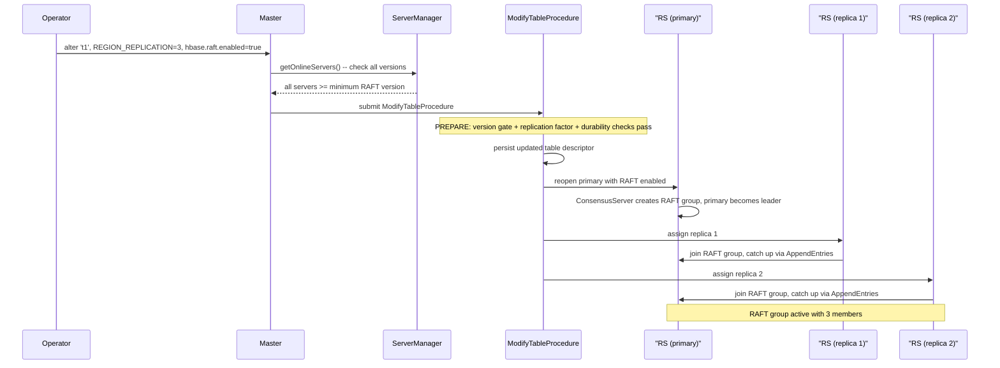

The diagram above illustrates the RF=3 case. For other replication factors the same flow applies with N-1 replica assignment steps instead of two.

In both cases the procedure is idempotent. If it fails partway through (e.g., a RegionServer crashes during the reopen phase), the master's procedure framework retries from the last persisted state. Partially-opened RAFT groups are detected on retry: if the primary has already reopened with RAFT but replicas are not yet assigned, the procedure continues from the assignment step.

### Disabling RAFT Replicas and Downgrade

Rollback is the reverse of enablement and follows a strict ordering rule: **schema rollback before software rollback**. The operator must disable RAFT and reduce `REGION_REPLICATION` on every table before downgrading any RegionServer software. This is the dual of the upgrade rule (all software upgraded before RAFT enabled).

**Per-table disable procedure.** For each table with `hbase.raft.enabled = true`:

1. **Transfer leadership to replica ID 0.** For every region in the table, the master (via the balancer or a dedicated `DisableRaftProcedure`) issues a leadership transfer to the member hosted on the RegionServer carrying replica ID 0. The current RAFT leader sends a `TransferLeadership` message, which triggers the standard promotion protocol targeting replica ID 0.

2. **Wait for confirmation.** The master waits for each region's replica ID 0 to become RAFT leader and fully catch up. The `LeaderChangeHandler` processes the `ReportLeaderElection` RPC and updates META to record replica ID 0 as the primary with the appropriate RAFT term.

3. **Alter table to disable RAFT and reduce replicas.** The operator issues:
   ```
   alter 't1', {REGION_REPLICATION => 1, METADATA => {'hbase.raft.enabled' => 'false'}}
   ```
   The `ModifyTableProcedure` processes this atomically: it closes replicas with the highest replica IDs first (the standard `CloseExcessRegionReplicasProcedure` behavior), then reopens the primary (replica ID 0) without RAFT. Since leadership was transferred to replica ID 0 in step 1, the primary being retained is the current leader with a fully caught-up memstore. No data is lost.

4. **Clean up META columns.** The procedure removes the `primary-replica-ID` and `raft-term` META columns for all regions of the table. These columns are meaningless once RAFT is disabled and would confuse non-RAFT code paths that assume the primary is always replica ID 0.

5. **Table is now a standard single-primary table** with no replicas and no RAFT metadata.

The leadership transfer in step 1 is essential. The existing `AssignmentManager` replica-reduction logic closes replicas with the highest replica IDs first, retaining replica ID 0. If the current RAFT leader were a different replica ID (e.g., replica ID 2 after an AZ failover), closing it without first transferring leadership would lose uncommitted memstore state.

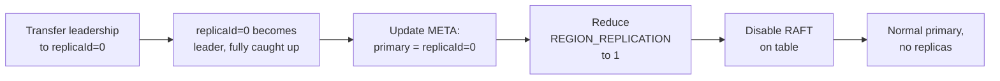

**Software downgrade.** After all tables have been reverted to non-RAFT operation, the `ConsensusServer` on each RegionServer has zero active RAFT groups and is idle (or was never started). The cluster is now functionally identical to a pre-RAFT deployment, and software can be safely downgraded via the standard rolling restart procedure: restart each RegionServer one at a time with the prior software version.

A downgrade version gate provides additional safety. If any table still has `hbase.raft.enabled = true` in its descriptor, the master logs a warning when a RegionServer running the older (non-RAFT-capable) version reports for duty via `regionServerStartup`. The master accepts the server (to avoid reducing cluster capacity) but refuses to assign any RAFT-enabled regions to it. This prevents a partially-downgraded cluster from placing RAFT-enabled regions on servers that lack the `hbase-consensus` module. The operator is expected to complete the schema rollback (disable RAFT on all tables) before or concurrently with the software rollback.

### Mixed-Version Safety

The design enforces a set of invariants that prevent RAFT from being active while the cluster is in a mixed-version state:

- **RAFT is never active while any RegionServer is below the minimum version.** The version gate in `ModifyTableProcedure` and `CreateTableProcedure` rejects any attempt to set `hbase.raft.enabled = true` unless all online RegionServers are at the RAFT-capable version.
- **No RAFT traffic flows during rolling upgrade or rolling downgrade.** During upgrade, no table has RAFT enabled yet. During downgrade, all tables must have RAFT disabled before the first server is restarted with old software.
- **The version gate is enforced at the master**, which is the single serialization point for all schema changes. There is no race between concurrent `alter` commands and server restarts because the version check occurs within the procedure's prepare phase, which holds the table lock.
- **Old-version servers cannot host RAFT regions.** If an old-version RegionServer joins a cluster that has RAFT-enabled tables (e.g., an operator mistakenly starts a downgraded server before completing schema rollback), the master's balancer excludes it from assignment of RAFT-enabled regions. The table continues operating on the remaining RAFT-capable servers. The master logs a warning identifying the old-version server and the constraint violation.
- **The only window where RAFT is active** is when all servers are running the RAFT-capable version and at least one table has been explicitly altered to enable it. Entry into and exit from this window are both controlled by explicit operator actions (schema alter) gated by version checks.

## Availability Impact

This section assesses the availability characteristics of the RAFT-based region replica design relative to the current HBase model, examining each class of failure and operational event.

### Steady-State Write Availability

Under normal operation a RAFT-enabled region accepts writes whenever the leader holds a valid lease and the promotion-complete flag is set. The parallel write path requires both the HDFS WAL sync and the RAFT majority acknowledgment to succeed before the client is acknowledged. If either path fails, the write is rejected and the client retries. The RAFT majority requirement means that a majority of the N members (floor(N/2)+1) must be reachable for writes to proceed. With RF=3, this is 2 of 3. With RF=5, the group tolerates two simultaneous member failures. With RF=2, majority = 2, so both members must be alive for writes to succeed. There is no write fault tolerance, but the warm follower memstore still provides faster recovery than the current non-replicated model.

### Steady-State Read Availability

Default-consistency reads continue to be served exclusively by the primary, as they are today. The availability of default reads is therefore identical to write availability. As long as the leader is healthy and promoted, default reads succeed. Timeline-consistency reads are served by any replica, including the leader. Under the current async replication model, replica staleness is unbounded and grows during replication lag. Under RAFT replication, follower memstores are kept current by ordered, majority-committed log entries, so Timeline reads return much fresher data. During normal operation all N members can serve Timeline reads, providing N-way read availability. If one member is down, N-1 members still serve Timeline reads. If enough members fail that fewer than a majority remain, the surviving members that are followers can still serve Timeline reads from their last-applied state, but writes and default reads are unavailable until the leader recovers or a new election completes. With RF=3, this means the sole survivor can serve Timeline reads when two members are down. With RF=2, the sole survivor serves Timeline reads while writes are blocked.

### Single AZ Failure

The design's primary availability improvement is tolerance of a full AZ outage. When one AZ fails, the surviving N-1 members in the remaining AZs detect the failure via heartbeat timeout (default 1500ms). If a majority survives, the survivors elect a new RAFT leader. The promotion protocol then runs in three phases: RAFT-internal log catch-up, master confirmation via ReportLeaderElection, and local state transitions on the promoted replica. The total failover time from AZ failure to the new primary accepting writes is bounded by the heartbeat timeout plus log catch-up time plus one master RPC round-trip, typically sub-second to a few seconds. Throughout this promotion window, the region is unavailable for writes and default-consistency reads, but Timeline reads continue to be served by the surviving replicas whose memstore is warm from RAFT replication.

This is a qualitative change from the current model. Today, an AZ failure taking down the primary's RegionServer triggers ServerCrashProcedure, which must split the dead server's WAL on HDFS, assign the region to a new RegionServer, and replay recovered edits to rebuild the memstore. This process takes seconds to minutes depending on WAL size and cluster load, and during the entire window the region is unavailable for all operations except Timeline reads on replicas. Under the RAFT model, the promotion bypasses WAL splitting entirely because the promoted replica's memstore is already warm, and SCP's role is reduced to coordination and fallback.

### Simultaneous Master and AZ Failure

If the master and the primary's AZ fail simultaneously, the RAFT election proceeds independently of master election because the consensus protocol operates peer-to-peer among RegionServers. The surviving replicas elect a new RAFT leader as soon as the heartbeat timeout fires, even before the backup master becomes active. The newly elected leader holds a valid RAFT lease and can serve Timeline reads immediately. However, it cannot serve writes because the promotion-complete flag requires master confirmation, which is unavailable until the backup master wins its own election and processes the backlogged ReportLeaderElection RPC. Write unavailability in this scenario is bounded by master election time plus one RPC round-trip. Once the backup master is active and processes the report, the region completes promotion and begins serving writes. This is strictly better than the current model, where simultaneous master and primary failure leaves the region completely unavailable until both the master recovers and SCP runs to completion.

A special case arises when the META region's primary is in the failed AZ and the master also fails. META's promotion uses an in-memory-only confirmation path, bypassing the META persistence step. Once META is writable, the master writes META's own promotion record as a deferred idempotent operation. Non-META promotions queue behind META's promotion because they require META to be writable for persistence of the new primary location. This creates a natural ordering where META recovers first, then all other regions. The additional latency for non-META regions is one META write round-trip beyond their own RAFT election time.

### Promotion Gap

Between the moment a replica wins the RAFT election and the moment the promotion-complete flag is set after master confirmation, the region is in a promotion gap. During this gap, the RAFT leader holds a valid lease and can serve Timeline reads, but writes are rejected with `NotServingRegionException`. Clients that attempt writes during this window receive an error and retry through the standard client retry loop. The promotion gap duration is the sum of Phase 1 (consuming remaining RAFT log entries to bring the memstore current), Phase 2 (the ReportLeaderElection RPC round-trip to the master), and Phase 3 (local state transitions including WAL reference acquisition). In the common case where the promoting replica's memstore is nearly current and the master is healthy, this gap is on the order of tens to hundreds of milliseconds.

If the promoting leader's lease expires before promotion completes, or if a second election occurs during the gap, the promotion is abandoned safely. The promotion-complete flag is never set, so no writes were accepted. The new leader starts its own independent promotion. These edge cases extend the total unavailability window by one additional election cycle but do not compromise safety.

### Flush-Induced Write Pauses

The snapshot-boundary protocol decouples the memstore drop boundary from the flush marker seqId. Writes proceed concurrently with HFile writing, RAFT proposal, RAFT commit, and memstore drop, and are not affected by the drop. The only write-blocking interval is the `updatesLock.writeLock()` held during the memstore snapshot (steps 1-6 of the flush protocol), which is the same narrow lock that stock HBase holds during flush. This lock prevents concurrent writes from modifying the memstore while the snapshot boundary is being captured. The duration of this lock is typically single-digit milliseconds, independent of memstore size, HDFS throughput, or RAFT commit latency. After the lock is released, all remaining flush steps proceed concurrently with the write pipeline.

### Balancer-Initiated Region Moves

When the balancer decides to move a region, it sends a region close to the current primary's RegionServer. The primary closes the region, the RAFT leader steps down, the surviving members elect a new leader, and the full three-phase promotion protocol runs. During this sequence the region is unavailable for writes. The unavailability window is the same duration as a crash-triggered promotion, on the order of sub-second to a few seconds. This is comparable to the current model's region move latency, where a close-open cycle also causes a write unavailability gap.

The balancer is extended with a cost function that penalizes moving the current RAFT primary, biasing the stochastic search toward moving followers when possible. Moving a follower is lightweight and does not cause any write unavailability for the region. Only when moving the primary is unavoidable does the election-and-promotion cycle occur.

### Region Split and Merge

Region splits and merges cause write unavailability for the affected regions during the procedure. The key range cannot accept mutations between the parent group's write-closure and the daughter or merged group becoming ready. The RAFT commit of the close marker adds only a few milliseconds to the existing procedure latency, so the write unavailability window is comparable to the current model's split and merge procedures.

Read availability is substantially improved relative to the current model. When a member applies the split or merge marker, only the write path and RAFT operations are immediately gated (write-closure). The parent's memstore and HFile references remain accessible in a frozen, read-only state, and the member continues serving Timeline reads from this consistent snapshot. Once the daughter or merged groups are opened and ready on a given member, the parent's read path is atomically torn down and reads transition to the new groups. This atomic swap is a local operation, so the read unavailability window is reduced to a sub-millisecond local pointer swap, effectively near-zero.

The safety property that no member has both a parent group and a daughter group writing to the same key range simultaneously is enforced by RAFT log ordering. The frozen parent accepts no writes. Memory held by the frozen parent's memstore is released when the read path is torn down, bounding the additional memory lifetime to the master procedure's region-open latency, typically hundreds of milliseconds to a few seconds.

For merges, both parent groups enter the frozen read-only state independently when their respective merge markers are applied, and both continue serving Timeline reads for their respective key ranges until the merged group is ready. The merged group assumes responsibility for the combined key range, and both parents' read paths are atomically torn down.

### HDFS Degradation

The primary's ability to flush depends on HDFS availability. If HDFS is degraded, the primary cannot flush but can continue accepting writes into the memstore, bounded by memstore size limits. RAFT replication continues independently of HDFS because RAFT entries are replicated over the consensus transport, not through HDFS. Replicas receive and apply entries to their memstores regardless of the primary's flush status. If the primary cannot flush for an extended period, it hits memstore back-pressure and slows down writes, which is the same behavior as a non-replicated region under HDFS pressure. In this sense, HDFS degradation affects write throughput but not write availability until the memstore is full, and the impact is identical to the current model.

However, the promoted replica's initial ability to serve as primary after failover depends on HDFS for HFile access. If HDFS is simultaneously degraded when a failover occurs, the promoted replica may be unable to serve reads that require HFile data. RAFT replication ensures the promoted replica has a warm memstore covering all data since the last flush, so reads for recently written data succeed, but reads for older data that has been flushed to HFiles depend on HDFS accessibility. In practice, the three-AZ HDFS deployment with rack-aware placement means that an AZ failure does not take down HDFS because the NameNode and sufficient DataNodes survive in the remaining AZs.

### New Member Bootstrap and Replication Factor Recovery

After a failure, the surviving N-1 members continue operating at a reduced replication factor. With RF=3, the surviving two members form a majority and the cluster remains available for reads and writes, but a second member failure before the replication factor is restored would leave only one surviving member, which cannot form a RAFT majority. The master schedules a replacement replica as part of SCP's post-promotion cleanup. The new member loads shared HFiles from HDFS and catches up via RAFT log replay or the shared-storage catch-up path. During bootstrap, the new member is not eligible for voting or promotion, so the cluster operates with a reduced quorum until bootstrap completes. The time to restore the full replication factor depends on the region's data size and the write rate, typically seconds to minutes. Until the replacement member is fully caught up, the group's fault tolerance remains reduced by one member.

### Availability Summary

The net effect of the RAFT-based design on availability is strongly positive.

The dominant improvement is the elimination of WAL splitting from the failover path, which reduces region unavailability after a primary failure from seconds-to-minutes to sub-second-to-seconds.

Write availability during single AZ failures is maintained after a brief promotion gap, whereas the current model provides no write availability until SCP completes.

Read availability is improved by keeping replica memstores current through ordered RAFT replication rather than best-effort async replication, making Timeline reads useful during and after failover rather than increasingly stale.

Region splits and merges maintain near-zero read unavailability because the parent's read path remains active against a frozen, immutable snapshot while the master opens daughter or merged groups, and transitions to the new groups via a sub-millisecond local atomic swap.

## Performance and Scalability

This section provides a quantitative scalability analysis for a representative production deployment. All configuration parameter names, batching terminology, and architectural references are aligned to the design above.

### Deployment Profile and Cluster Parameters

#### Hardware (per RegionServer: m7g.8xlarge on EKS)

| Resource | Value |
|---|---|
| Instance type | m7g.8xlarge (AWS Graviton3, arm64) |
| vCPUs | 32 |
| RAM | 128 GiB (JVM heap ~48–64 GB; memstore budget ~25 GB) |
| Network | 15 Gbps (1,875 MB/s) |
| Inter-AZ RTT | 1–2 ms |
| EBS aggregate bandwidth | 10 Gbps (1,250 MB/s) across all attached volumes |
| EBS aggregate IOPS | 40,000 |

#### Storage layout (per worker node)

| Volume | Type | Specs | Role |
|---|---|---|---|
| 6 × 2 TB | ST1 HDD | 80 MB/s baseline each; 480 MB/s aggregate | HDFS data (HFiles, compaction) |
| 1 × GP3 SSD | GP3 | 125 MB/s, 3,000 IOPS baseline; fdatasync 2–4 ms p50, 6–8 ms p99 | HDFS WAL blocks (tiered storage) |
| 1 × GP3 SSD | GP3 | 125 MB/s, 3,000 IOPS baseline | RAFT consensus log (`AsyncFSWAL` instance) |

#### HBase cluster parameters

- **RegionServers:** N_RS = 500 across 3 AZs (~167 per AZ)
- **Regions per RS:** G = 1,500
- **RAFT groups per RS:** G = R = 1,500 (one group per region, RF=3)
- **Peers per group:** P = 2 (one in each other AZ)
- **Replication factor:** RF = 3

### Workload Model

Most Phoenix tables have 1–2 global indexes (some up to 10). Each global index is a separate HBase table. A Phoenix UPSERT generates 1 + I_avg HBase mutations. Of the 1,500 regions per RS, approximately 500 are base-table regions and 1,000 are index-table regions. Write amplification: W_amp = 1 + I_avg = 1 + 2 = 3.

#### Steady-state write rates

| Metric | Value |
|---|---|
| Phoenix logical write throughput per RS | W_phoenix ≈ 4 MB/s |
| After write amplification (W_amp=3) | W_hbase = 12 MB/s per RS |
| Average mutation size w | 400 bytes |
| HBase mutations per RS | λ_RS = 12,000,000 / 400 = 30,000/s |
| Mutations per group (avg) | λ_g = λ_RS / G = 20/s |
| Workload mix | 60% OLTP (single-row UPSERT VALUES), 40% archival/ETL |

Level 1 batching: Phoenix batch → RAFT proposal: OLTP batches (60%) concentrate in ~3 regions (1 base + 2 index) yielding M ≈ 333 mutations per proposal. Archival/ETL batches (40%) spread across many regions yielding M ≈ 50–200. Conservative weighted average: M_proposal ≈ 100. The legacy estimate of 20 was too pessimistic: it weighted the worst archival case as if it were the typical case, ignoring that the global pending-bytes credit pool now allows the propose path to absorb larger mini-batches without per-group memory pressure. The HBase replication sink reaches M_proposal ≥ 1000 routinely as it applies edits received from a source cluster in one shot per region, so 100 is itself conservative for any deployment that sees sustained replication traffic. This is the dominant batching mechanism, reducing proposals from O(mutations) to O(regions).

RAFT proposal rates: λ_proposals = λ_RS / M_proposal = 30,000 / 100 = 300 proposals/s per RS. All proposals originate from leader groups. Per leader group: λ_proposals,leader = 300 / 500 = 0.6 proposals/s. Each follower receives entries at the same rate from its leader, so per follower group: 0.6 entries/s.

#### Zipfian per-group rate distribution

With multitenant Phoenix tables keyed by tenant ID, activity follows a Zipfian distribution. At s = 1.0 (classic Zipf):

| Rank k | Mutations/s | Proposals/s | Interpretation |
|---|---|---|---|
| 1 (hottest) | 3,802 | ~38 | Mega-tenant's primary table region |
| 100 | 38 | ~0.38 | Moderate-activity tenant |
| 750 (median) | 5.1 | ~0.05 | Typical tenant |
| 1,500 (coldest) | 2.5 | ~0.025 | Low-activity tenant (still active) |

Even the coldest region writes every 400 ms. All 1,500 groups are actively written during business hours.

### Three-Level Batching Analysis

The batching hierarchy (see "Batching Hierarchy" above) reduces per-mutation consensus overhead from O(mutations) toward O(peers).

#### Level 1: Intra-proposal batching (mini-batch grouping)

At T_consensus ≈ 2 ms and M_proposal = 100: T_amortized = 2 ms / 100 = 20 μs per mutation. For OLTP single-tenant commits (M_proposal = 333): T_amortized = 6 μs per mutation. For replication-sink applies (M_proposal ≈ 1,000): T_amortized = 2 μs per mutation. Level 1 alone provides 100×–1,000× amortization across the production workload mix.

#### Level 2: Inter-proposal batching (mailbox drain)

The `MultiGroupExecutor` drain loop collects pending proposals up to `hbase.consensus.propose.batch.max.entries` (default 1024). Proposals accumulated during one consensus round: b = λ_proposals,g × T_consensus.

| Group rank | Proposals/s | b (per 2 ms round) | Level 2 effective? |
|---|---|---|---|
| Average leader | 0.6 | 0.0012 | No (always b=1) |
| Hottest (k=1) | 38 | 0.076 | No (b=1 at steady state) |
| UPSERT SELECT burst | 100 | 0.2 | No |
| Replication-sink burst into one region | 1,000 | 2.0 | Yes (multiple proposals per round) |

Level 2 is irrelevant for the average group because Level 1 already provides mutation-level batching. With the 2 ms consensus round (down from ~10 ms with fdatasync-coupled sync), even the hottest steady-state groups rarely accumulate multiple proposals per round. Level 2 becomes effective on replication-sink bursts and other bulk-apply workloads where a single hot region absorbs many large mini-batches per second. The high (1024) default `propose.batch.max.entries` cap is sized so the server-wide pending-bytes credit pool — not the entry cap — is the binding admission gate during these bursts.

#### Level 3: Cross-group transport coalescing

The coalescing transport combines append-entries from multiple groups destined for the same peer into one batched-append-entries frame. The bulk lane uses a kind-specific drain trigger. Each enqueue schedules a drain on the channel's I/O thread which pops everything currently queued and emits one or more coalesced frames per peer with no artificial wall-clock delay. Coalescing is most effective for hot groups and during bursts, where multiple per-group append-entries accumulate for the same peer between successive drains. At the aggregate level, coalescing reduces per-tick syscalls from O(proposals) to O(active peers) at steady state, with greater benefit under bursty Zipfian workloads where hot groups concentrate traffic on specific peers.

#### Compound batching effectiveness

A Phoenix batch of 1,000 mutations touching 5 regions generates 5 RAFT proposals (Level 1). All 5 AppendEntries destined for the same peer are coalesced into one `BatchAppendEntries` frame (Level 3). Net result: 1,000 mutations → 5 proposals → 2 coalesced network frames. Overhead reduction: 500× vs. naive per-mutation consensus. A replication-sink batch of 1,000 mutations targeted at a single region collapses to 1 proposal and 1 frame per peer (a 1,000× reduction): the same compound batching shape, with the entire reduction concentrated at Level 1.

### Thread Pool Model (M/G/c Queue)

The `MultiGroupExecutor` is a shared pool of T = 2 × cores = 64 worker threads. Each job is a drain-loop invocation on one group.

#### Service time model

With Level 1 batching, each proposal carries M_proposal ≈ 100 mutations: T_service(b) = S_drain + b × t_proposal. S_drain (dequeue + scheduled-flag manipulation): ~5 μs. t_proposal (serialize 100 mutations, enqueue to transport, update FSM): ~250 μs. At b=1: T_service(1) = 255 μs. Per-mutation serialization is the dominant component, so t_proposal scales roughly linearly with M_proposal — fewer, larger proposals reduce the per-second job count and the absolute CPU spent on per-job overhead (S_drain, mailbox CAS, scheduling) without changing the per-mutation serialization budget.

| Job type | Rate | Service time | CPU/s |
|---|---|---|---|
| Leader proposals (500 leader groups × 0.6/s) | 300/s | 255 μs | 76.5 ms |
| Follower applies (1,000 follower groups × 0.6/s) | 600/s | 255 μs | 153 ms |
| Heartbeat dispatches (250 ms tick) | 6,000/s | 5 μs | 30 ms |
| **Total** | **6,900/s** | | **259.5 ms** |

Pool utilization: ρ = 259.5 ms / (64 × 1,000 ms) = **0.4%**. At 10× the modeled write rate: 4%. Raising the assumed M_proposal from 20 to 100 lowered both per-second job count (from 10,500 to 6,900) and total CPU/s (from 502.5 ms to 259.5 ms): when batching is the dominant lever, fewer larger proposals strictly dominate more smaller ones at the same write rate. The thread pool retains massive headroom.

#### UPSERT SELECT burst

10 groups burst to 100 proposals/s (each M_proposal=100, the same 10K mut/s as the legacy estimate at M=20 reaching 500 prop/s), service time ~1.5 ms (serialize ~100 mutations × 6× the steady-state path's per-mutation cost, plus log-write and transport-enqueue overhead): CPU_burst = 490 × 0.6 × 255 μs + 10 × 100 × 1,500 μs + 153 ms + 30 ms = 75 ms + 1,500 ms + 153 ms + 30 ms ≈ 1.76 s. ρ_burst = 1.76 / 64 = **2.7%**.

### Network Model

#### Heartbeat Traffic

The per-server timing wheel emits one outbound bulk-heartbeat envelope per remote peer per tick, regardless of how many groups this server hosts and regardless of how many of those groups are leader, follower, or quiescent. The envelope carries the emitting server's endpoint, boot epoch, and tick at the top level and a payload of per-group entries, one per group on this server that owes that peer a liveness signal on this tick. The reverse direction is symmetric, one bulk-heartbeat-ack envelope per peer per tick aggregating per-group acks back to the leader.

The byte rate this generates scales with the number of distinct remote peers a server talks to and with the average number of shared groups per peer pair, not with the total group count on the server. At realistic large-cluster fanouts the envelope traffic is well under one percent of the available cross-AZ bandwidth budget, and the per-envelope payload is dense enough that header and framing overhead is dominated by per-group entry bytes rather than envelope overhead. Quiescence collapses the per-group entries for groups that have been idle long enough to zero, leaving only the per-server keepalive carried at the envelope header. With quiescence enabled, the heartbeat byte rate scales with the number of currently active (non-quiescent) groups rather than the total group count.

#### ConsensusServer Connectivity Mesh

With RF=3 and one RAFT member per AZ, each of the 1,500 regions on an RS in AZ-1 has exactly one member in AZ-2, assigned uniformly at random to one of ~167 RSes. The probability that a given RS pair (one in AZ-1, one in AZ-2) shares at least one RAFT group follows the birthday-problem complement:

P(no shared group) = (1 − 1/167)^1500 ≈ e^(−1500/167) = e^(−8.98) ≈ 1.25 × 10^(−4)

P(at least one shared group) ≈ 99.99%

Expected shared groups per RS pair: E = 1,500 / 167 ≈ 9.0. Expected RS pairs in AZ-1 × AZ-2 with zero shared groups: 167 × 167 × 1.25 × 10^(−4) ≈ 3.5 out of 27,889 pairs. The mesh is essentially fully connected. Each `ConsensusServer` therefore maintains TCP connections to virtually every RS in both remote AZs. Of the ~9 shared groups per RS pair, approximately 3 are led by this RS (it leads ~1/3 of its groups), 3 are led by the remote RS, and 3 are led by a third RS in the remaining AZ. Only groups where one endpoint is the leader and the other is a follower generate data-path traffic on that connection. Groups led by a third AZ do not produce direct traffic between this pair. Per connection: ~3 leader→follower AppendEntries at 0.6 entries/s = ~1.8 entries/s outbound, ~1.8 entries/s inbound from the peer's leader groups.

#### Data-path traffic

Each proposal carries M_proposal × w + header = 100 × 400 + 48 = 40,048 bytes uncompressed. With Snappy compression at ~2.5:1 on the WALEdit payload, the on-wire size drops to 100 × 400 / 2.5 + 48 = 16,048 bytes. Data outbound from the 500 leader groups: 500 × 0.6 proposals/s × 16,048 bytes × 2 peers = 9.6 MB/s. Data inbound to the 1,000 follower groups: 1,000 × 0.6 entries/s × 16,048 = 9.6 MB/s. The aggregate per-second byte rate is invariant under M_proposal: λ_RS × w (the per-mutation byte rate) is fixed regardless of how mutations are packed. M_proposal only changes per-message size and per-message overhead. Adding heartbeats (~0.3 MB/s bidirectional), total RAFT network traffic is ~20 MB/s per RS, 1.1% of the 15 Gbps NIC. With HDFS WAL pipeline traffic (~36 MB/s) the aggregate is ~56 MB/s, well under the 1,875 MB/s ceiling. All RAFT consensus traffic is cross-AZ by construction, so the entirety of this 20 MB/s is cross-AZ transfer.

#### Cross-AZ Traffic Summary

Every byte of RAFT data traffic crosses an AZ boundary. The RAFT layer sends each mutation's data to two cross-AZ followers (RF − 1 = 2), so the raw RAFT cross-AZ transfer is 2× the WALEdit data volume. The HDFS WAL pipeline already generates its own cross-AZ traffic (RF=3, pipeline forwarding across 2 AZ hops). The table below separates RAFT-introduced cross-AZ transfer from the HDFS baseline that exists today.

| Traffic source | Per RS | Per cluster (500 RS) | Notes |
|---|---|---|---|
| RAFT data (compressed) | 20 MB/s | 10 GB/s | New cross-AZ traffic introduced by this design |
| RAFT heartbeats | 0.3 MB/s | 0.15 GB/s | New; negligible |
| HDFS WAL pipeline (existing) | ~30 MB/s | ~15 GB/s | 15 MB/s × 2 cross-AZ hops in RF=3 pipeline |
| RAFT as fraction of WAL baseline | | | 0.7× |

Snappy compression reduces the incremental cross-AZ transfer to ~20 MB/s per RS. At the cluster level, the RAFT layer adds ~10 GB/s of compressed cross-AZ transfer on top of the ~15 GB/s HDFS WAL baseline.

### Disk I/O Model

#### RAFT consensus log (AsyncFSWAL on GP3)

The consensus log is a second `AbstractFSWAL` instance on the dedicated GP3 volume. Groups are partitioned across K writer shards (`hbase.consensus.log.writer.shards`, default 4), each owning one sequential write stream on the shared volume; aggregate per-RS throughput is the sum of per-shard streams. The byte-rate analysis below is per-RS and is invariant under K.

The consensus log stores Snappy-compressed entries. Per-mutation compressed size: w_c = 400 / 2.5 + 64 / 100 (header amortized over M=100) = 161 bytes. Log write rate for leader proposals: λ_RS × w_c = 30,000 × 161 = 4.8 MB/s. Follower groups on this RS also write to the consensus log: 1,000 followers × 0.6 entries/s × 100 mutations × 161 bytes = 9.7 MB/s. Total consensus log write rate: 4.8 + 9.7 = 14.5 MB/s. (The aggregate rate scales with λ_RS × w plus per-frame overhead, and the per-frame overhead drops as M_proposal rises — moving from M=20 to M=100 cut the consensus-log byte rate from 20.1 MB/s to 14.5 MB/s for the same workload.) GP3 baseline throughput: 125 MB/s. Utilization: 11.6%.

#### fdatasync amortization

Under the default page-cache durability tier, one fdatasync fires every `hbase.consensus.log.fsync.interval.ms` (default 10000 ms):

- fdatasync rate: 1 / 0.1 = 10/s (GP3 baseline: 3,000 IOPS → **0.3%**)
- Bytes per fdatasync: 14.5 MB/s × 100 ms = 1.45 MB
- A 1.45 MB sequential write + fdatasync on GP3 takes 2–4 ms (p50), 6–8 ms (p99)
- The 100 ms fdatasync interval accommodates this with >90 ms margin at p99

Without the unified log: 1,500 × 20 = 30,000 fdatasync/s → 10× GP3 baseline IOPS even at the most pessimistic per-group rate. The unified log is essential, and rises in importance with smaller M_proposal: at M_proposal=1 every mutation would need its own fsync without the unified log, blowing through the GP3 IOPS ceiling by 10×. The analysis above bounds the worst-case extra IOPS at the gathered-write rate (one fsync per drain pass), well within the GP3 IOPS budget at the modeled load.

#### HDFS WAL (GP3 via tiered storage)

Each DataNode has a dedicated GP3 volume for WAL blocks. HDFS WAL sync with RF=3 cross-AZ pipeline: T_WAL = T_pipeline + T_fdatasync + T_ack ≈ (1–2) + (2–4) + (1–2) = 4–8 ms. p50 ≈ 5 ms, p99 ≈ 10 ms. WAL throughput: 30,000 × 500 = 15 MB/s, within GP3's 125 MB/s baseline.

#### EBS bandwidth

EBS total ≈ 20 (consensus log, compressed) + 15 (WAL) + 75 (HFiles, compaction) = 110 MB/s → 8.8% of 1,250 MB/s ceiling.

### Parallel Barrier Latency

The leader write path forks WAL sync and RAFT proposal in parallel, joined by a barrier (see "Write Path: Parallel WAL + RAFT Replication"):

T_write = max(T_WAL, T_RAFT)

#### RAFT Consensus Round Timing

With fdatasync decoupled from the consensus round, the RAFT consensus round requires only a network round-trip. The leader appends the proposal to the consensus log's page cache (sub-millisecond), sends AppendEntries to followers, and the nearest follower appends to its own page cache and returns an ack:

T_RAFT = T_network + T_page_cache_write + T_network ≈ 1 + 0 + 1 = ~2 ms

#### Parallel Barrier

RAFT consensus is fully hidden behind the HDFS WAL sync. The write path latency is identical to today's single-WAL path in a cross-AZ HDFS deployment. The cost is bounded. On crash recovery, up to 100 ms of consensus log entries may need to be replayed from the leader's RAFT log via AppendEntries.

### Memory Model

Per-group memory (active): ~4 KB (RaftNode FSM, MPSC mailbox, adapters, in-memory log index).

Mem_groups = G × 4 KB = 1,500 × 4,096 = 6.14 MB

Negligible vs. ~25 GB memstore budget on 128 GiB. The dominant memory cost is memstore (~17 MB per region), unchanged by RAFT.

### Composite Scalability Table

All 1,500 groups active, steady-state Phoenix workload, `heartbeat.interval.ms` = 250:

| Resource | Value | Capacity | Utilization |
|---|---|---|---|
| Thread pool (jobs/s) | 10,500 | 2,560,000 | 0.4% |
| Network, compressed (MB/s) | 20 | 1,875 | 1.1% |
| Cross-AZ RAFT transfer, compressed (MB/s) | 20 | — | 0.7× of WAL baseline |
| GP3 consensus log write, compressed (MB/s) | 20.1 | 125 | 16.1% |
| GP3 consensus log fdatasync/s | 10 | 3,000 | 0.3% |
| GP3 fdatasync latency vs interval | 2–4 ms | 100 ms | 2–4% |
| EBS aggregate bandwidth (MB/s) | ~110 | 1,250 | 8.8% |
| Memory (RAFT state) | 6.14 MB | ~48,000 MB | 0.01% |
| Heartbeat sweep time | 0.15 ms | 250 ms (tick) | 0.06% |
| Heartbeat syscalls (coalesced) | 334/tick | — | 7 ms/tick |
| Heartbeat syscalls (if NOT coalesced) | 3,000/tick | ~1,250 budget | 240% |
| Per-quiescent-group bytes per tick | 0 B | — | 1 envelope per peer per tick is unchanged |
| Per-RS keepalive bytes per envelope | ~20 B | — | sender/epoch/tick fields on every bulk-heartbeat envelope |
| Idle-group savings @ 10,000 idle groups | ~2.5 MB/s/RS | — | savings vs. unconditional per-group entries |
| TCP connections per RS | ~334 | — | full cross-AZ mesh |

All resources are within budget with coalescing and compression. The heartbeat row demonstrates that coalescing is structurally mandatory. The cross-AZ row shows the incremental transfer introduced by RAFT relative to the existing HDFS WAL cross-AZ baseline.

### Breaking Point Analysis

The binding constraint is GP3 consensus log throughput. The consensus log sees writes from both leader proposals and follower appends; at uniform load scaling, the total log write rate is 3 × λ_RS × w_c. Setting utilization to 80%:

λ_RS,max = (0.8 × 125 MB/s) / (3 × 224 bytes) = 148,810 mutations/s = 59.5 MB/s per RS

Provisioning GP3 with 250 MB/s throughput doubles the headroom to 10×. Without Snappy compression, the breaking point drops to 71,839 mutations/s (2.4× the modeled load), underscoring the importance of mandatory compression for both network and disk budgets.

At the extreme Phoenix index fan-out (W_amp = 11, 10 indexes per table): λ_RS = 110,000 mutations/s → GP3: 59%, thread pool: 5%, network: 4% (compressed). All resources remain within budget, though GP3 headroom narrows and 250 MB/s provisioning is recommended.

### RPC Handler Pool

With RAFT fully hidden behind WAL sync, the parallel barrier latency equals the WAL sync latency. By Little's Law at T_write ≈ 5 ms:

L = λ_RS × T_write = 30,000 × 0.005 = 150 concurrent mutations

A 320-thread RPC handler pool has 53% headroom. No handler count increase is needed beyond the existing default. (If fdatasync were coupled to the consensus round, T_write would be ~10 ms, L = 300, and the 320-thread pool would have only 6% headroom, requiring an increase to 400+.)

### Key Findings

1. RAFT adds zero latency to the write path with relaxed consensus log fdatasync (every 100 ms). The parallel barrier = max(WAL ~5 ms, RAFT ~2 ms) = ~5 ms. RAFT is fully hidden behind the HDFS WAL sync in both GP3-on-GP3 and cross-AZ HDFS deployments. The cost is up to 100 ms of consensus log entries needing peer replay on crash recovery.

2. Heartbeat coalescing is mandatory. At `heartbeat.interval.ms` = 250 with 1,500 groups, uncoalesced heartbeats would consume 240% of the tick budget (3,000 syscalls per 250 ms). Coalescing reduces this to ~334 sends/tick (7 ms), exploiting the per-peer filtering in the full RS mesh.

3. The three-level batching hierarchy is the single highest-impact optimization. Level 1 (Phoenix mini-batch grouping) provides 100–333× per-mutation amortization for typical OLTP workloads, scaling above 1,000× under bulk-apply paths such as the HBase replication sink. Level 3 (transport coalescing) reduces network syscalls from O(proposals) to O(peers). Level 2 (mailbox drain) provides headroom for extreme bursts and becomes effective on replication-sink-class workloads where a single hot region absorbs many large mini-batches per second.

4. GP3 consensus log throughput is the binding I/O constraint at 11.6% utilization (compressed, including both leader and follower writes, at M_proposal=100). Provisioning 250 MB/s (~$15/month extra) provides ample headroom for growth.

5. Mandatory Snappy compression reduces cross-AZ RAFT transfer from ~49 MB/s to ~20 MB/s per RS (2.5× reduction). At the cluster level, the RAFT layer adds ~10 GB/s of compressed cross-AZ transfer on top of the ~15 GB/s HDFS WAL baseline, a 0.7× increment. Compression and the larger M_proposal=100 mini-batch together reduce consensus log disk I/O to 14.5 MB/s, keeping the GP3 binding constraint within budget.

6. The ConsensusServer connectivity mesh is essentially fully connected: with 1,500 groups per RS and ~167 RSes per remote AZ, the probability of at least one shared group between any RS pair is 99.99%. Each RS maintains ~334 TCP connections carrying ~9 groups each, forming a uniform mesh that naturally load-balances both data-path and heartbeat traffic.

7. Phoenix write amplification (3× from global indexes) is accommodated without approaching any resource ceiling, even at the extreme of 10 indexes per table (W_amp=11), though GP3 headroom narrows to 59% and 250 MB/s provisioning is recommended.

8. The RPC handler pool is comfortable at the modeled load because RAFT's zero-latency contribution keeps the parallel barrier at ~5 ms. Little's Law: L = 30,000 × 0.005 = 150 in-flight mutations against a 320-thread pool (53% headroom). No increase to `hbase.regionserver.handler.count` is needed.

---

## Appendix A: Toward Replacing ZooKeeper with `hbase-consensus`

### Motivation

HBase's dependency on Apache ZooKeeper is a long-standing source of operational complexity and failure modes. The HBase community has been incrementally reducing ZK's role for several major versions: client-side ZK access via `ZKConnectionRegistry` is deprecated in favor of RPC-based `RpcConnectionRegistry`; balancer, normalizer, and split/merge switches have moved to master-local storage; distributed WAL splitting has been replaced by procedure-based splitting; and table state has moved to hbase:meta. What remains on the HBase side is a small but critical set of functions: active master election, RegionServer liveness detection, hbase:meta location, cluster state and cluster ID, and replication peer and queue state.

Phoenix adds its own ZooKeeper dependencies on top of HBase's. The legacy `jdbc:phoenix+zk:` URL scheme passes ZK quorum information to HBase's `ZKConnectionRegistry` for connection bootstrap. Phoenix's multi-cluster HA framework is the heaviest user: `ClusterRoleRecord` data (ACTIVE/STANDBY cluster roles) is stored in Curator-managed znodes under `/phoenix/ha`, while the consistent failover model stores richer `HAGroupStoreRecord` state (with real-time `PathChildrenCache` watches) under `/phoenix/consistentHA`. Secondary index MR job submission uses ZK ephemeral nodes for leader election (`ZKBasedMasterElectionUtil`), and `PhoenixMRJobUtil` reads YARN's ZK leader election znodes to discover the active ResourceManager. A legacy table state fallback in `AdminUtilWithFallback` reads HBase table state from ZK during 1.x-to-2.x rolling upgrades but is dead code on any current deployment.

The `hbase-consensus` module, designed as a general-purpose RAFT engine with pluggable callbacks and opaque group and entry types, can eventually subsume all of these roles across both HBase and Phoenix, eliminating ZooKeeper as an external dependency entirely.

This appendix outlines a high-level, multi-phase roadmap. Each phase is independently valuable and deployable. No phase is a prerequisite for the region replica work described in the main design. This is a future direction that the `hbase-consensus` architecture deliberately does not foreclose.

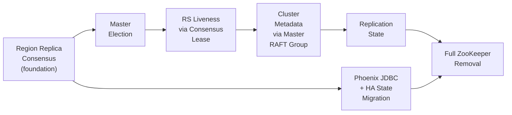

### Current ZooKeeper Roles (What Must Be Replaced)

#### HBase Roles

| Role | ZK Mechanism | Data |
|---|---|---|
| Active master election | Ephemeral znode `/hbase/master` | Master ServerName |
| Backup master registration | Ephemeral children under `/hbase/backup-masters` | Backup ServerNames |
| RegionServer liveness | Ephemeral children under `/hbase/rs` | RS ServerName + info |
| Meta location | Persistent znode `/hbase/meta-region-server` | Meta region ServerName |
| Cluster up/down state | Persistent znode `/hbase/running` | Start timestamp |
| Cluster ID | Persistent znode `/hbase/hbaseid` | UUID |
| Replication peer config | Persistent znodes under `/hbase/replication/peers` | Peer config protobuf |
| Replication WAL queues | Persistent znodes under `/hbase/replication/rs` | WAL positions |

#### Phoenix Roles

| Role | ZK Mechanism | Data |
|---|---|---|
| JDBC connection bootstrap | ZK quorum parsed from `jdbc:phoenix+zk:` URL | HBase cluster address (delegated to `ZKConnectionRegistry`) |
| HA cluster role records | Persistent znodes under `/phoenix/ha` via Curator `DistributedAtomicValue` | `ClusterRoleRecord` JSON (HA group name, policy, paired cluster URLs, roles) |
| Consistent failover HA state | Persistent znodes under `/phoenix/consistentHA` via Curator `PathChildrenCache` | `HAGroupStoreRecord` JSON (state machine: `ACTIVE_IN_SYNC`, `STANDBY`, transitions) |
| MR index build leader election | Ephemeral znode `/phoenix/automated-mr-index-build-leader-election/ActiveStandbyElectorLock` | Elected node identity |
| YARN active RM discovery | Read-only traversal of `/yarn-leader-election/*/ActiveStandbyElectorLock` | `ActiveRMInfoProto` (active ResourceManager ID) |

### Region Replica Consensus

The `hbase-consensus` module is introduced for region replica memstore replication. `ConsensusServer` runs on every RegionServer. The RAFT engine is proven at scale (O(10000) groups/RS) and in production. ZooKeeper continues to serve all of its existing roles unchanged in both HBase and Phoenix.

The `ConsensusServer` API is not region-aware. It operates on opaque group IDs, peer IDs, and byte-array entries, with pluggable commit callbacks. `RegionGroupManager` is the region-specific adapter. This separation allows new adapter types to be introduced in later phases without modifying the consensus engine.

### Master Election

ZooKeeper-based master election (`ActiveMasterManager`, `MasterAddressTracker`) is replaced by a dedicated RAFT group with one member per HMaster instance: the active master and all backups. The RAFT leader is the active master. Backup masters are followers. When the active master is lost, RAFT elects a new leader using the same election timeout and term fencing mechanisms already implemented in the consensus engine, with no ZK session expiry delay. Each master embeds a `ConsensusServer` hosting this single group alongside its other duties; since it is one group rather than thousands, the overhead is negligible. `MasterAddressTracker` is reimplemented to read from the master-election group's state rather than a ZK znode, and the ephemeral znodes under the master and backup-masters paths are retired. Embedding `ConsensusServer` in the HMaster process is straightforward because the engine is a library with no server-type assumptions.

### RegionServer Liveness via Consensus-Based Lease

ZK ephemeral znodes under `/hbase/rs` are replaced by a consensus-based heartbeat/lease mechanism between RegionServers and the master RAFT group. Each RS already sends periodic heartbeat RPCs to the active master via `RegionServerReport`. The master-election RAFT group leader (active master) maintains an in-memory lease table of RS liveness, replicated to backup masters via the master-election RAFT log. On RS heartbeat timeout, the active master initiates ServerCrashProcedure exactly as today, but triggered by lease expiry instead of ZK ephemeral node deletion. This eliminates the most common ZK-related operational issue, namely false RS deaths caused by ZK session timeout during GC pauses or network glitches, because the master controls the lease timeout directly with full visibility into the RS's recent RPC activity. The `/hbase/rs` znode tree is retired.

### Cluster Metadata via Master RAFT Group

Small, critical cluster metadata currently stored in ZK znodes is migrated to the master-election RAFT group's replicated state. The active master already knows where hbase:meta is hosted; replicating this to backup masters via the RAFT log retires the meta-region-server znode, and since `RpcConnectionRegistry` fetches meta location via RPC to the master, no ZK access is needed on the client path. Cluster up/down state becomes implicit in the RAFT group's existence, with shutdown modeled as a RAFT-replicated state transition. The cluster ID is stored as a replicated entry in the master RAFT group's state. These are all small, infrequently-changing values that fit naturally into a single RAFT group's replicated state machine.

### Replication State via Master RAFT Group or Dedicated Store

Replication peer configuration and WAL queue tracking are migrated from ZK to either the master RAFT group's state or a dedicated system table. Peer configuration (add/remove/enable/disable peer) is replicated through the master RAFT group. These are rare, operator-initiated mutations well suited to consensus log entries. WAL queue positions, on the other hand, are updated frequently and are better suited to a system table than to RAFT log entries. The ZK-based `ZKReplicationQueueStorage` is already an abstraction behind the `ReplicationQueueStorage` interface, so the implementation can be swapped to a table-based backend without upstream changes. The replication znode tree is retired.

### Phoenix JDBC Connection Bootstrap

The `jdbc:phoenix+zk:` URL scheme and `ZKConnectionInfo` are deprecated in favor of `jdbc:phoenix+rpc:`, which uses HBase's `RpcConnectionRegistry` and never contacts ZooKeeper. The migration is a JDBC URL change and removal of ZK quorum constants from the query services configuration. The `ZKConnectionInfo` class is eventually removed.

### Phoenix HA State via Master RAFT Group or System Table

Phoenix's multi-cluster HA framework is the largest consumer of ZooKeeper within Phoenix. `ClusterRoleRecord` data under the HA znode tree (ACTIVE/STANDBY role assignments, managed via Curator's distributed atomic value) is migrated to the master RAFT group's replicated state. CRR mutations are rare operator-initiated operations well-suited to consensus log entries. `PhoenixHAAdmin` is reimplemented against an RPC interface to the active master rather than direct Curator calls. The consistent failover state under the consistent-HA znode tree is migrated by promoting SYSTEM.HA_GROUP from a secondary sync target to the primary store, with the master RAFT group providing the real-time notification channel that the Curator path-children cache currently supplies. Cross-cluster state coordination requires the masters of both clusters to expose HA group state via RPC. Both HA znode trees are retired, along with all Curator dependencies.

### Phoenix MR Index Build Leader Election

`ZKBasedMasterElectionUtil` acquires a distributed lock via ZK ephemeral node creation to elect a single `PhoenixMRJobSubmitter` that submits secondary index MR build jobs. This is a simple leader election pattern. With the master RAFT group available, the lock is replaced by an RPC to the active HBase master requesting permission to submit the job, or by a lightweight leader election among the MR job submitter nodes using a dedicated single RAFT group. Alternatively, since the active master is already a known singleton, the MR job submission can be centralized on the master itself, eliminating the distributed election entirely. The MR index build leader election znode tree and `ZKBasedMasterElectionUtil` class are retired.

`PhoenixMRJobUtil`'s read-only access to YARN's leader-election znodes for active ResourceManager discovery is an external dependency on YARN's ZK usage, not on Phoenix's own znodes. This is addressed by using YARN's HTTP-based RM discovery API or the YARN RM proxy client library, both of which work without ZK access. No HBase consensus layer changes are needed for this. It is a straightforward client-side migration within Phoenix.

### Full ZooKeeper Removal

With all ZK roles migrated across both HBase and Phoenix, ZooKeeper is no longer required by either system. On the HBase side, the `hbase-zookeeper` module and all ZK-related classes are removed, along with ZK quorum configuration. Cluster bootstrapping uses a static list of master addresses, similar to `RpcConnectionRegistry`'s existing bootstrap config, instead of a ZK connection string.

On the Phoenix side, the removal encompasses `ZKConnectionInfo`, the Curator-based HA infrastructure, `ZKBasedMasterElectionUtil`, `PhoenixMRJobUtil`'s raw ZK client, `AdminUtilWithFallback`'s legacy ZK fallback, and all ZK-related constants in the query services configuration. The Maven dependencies on ZooKeeper, Curator, and hbase-zookeeper are removed from all Phoenix modules.

HBase and Phoenix together become a self-contained distributed system with no external coordination service dependency.

---

## Appendix B: Formal Model of `hbase-consensus` and RAFT-based Region Replicas

### Scope

A TLA+ specification models the protocols described in the design document that are susceptible to subtle concurrency bugs: leader election and lease management, the parallel WAL+RAFT write barrier, flush coordination across RAFT members, MVCC sequencing on followers, the promotion protocol and shared-storage catch-up encoded in `InstallSnapshot` snapshot bytes, RAFT log garbage collection, old primary rejoin and recovery via log replay or shared-storage catch-up, and catch-up completeness with concurrent flush. The model does not attempt to re-verify the RAFT consensus algorithm itself. The `hbase-consensus` implementation derives from MicroRaft's consensus core, which faithfully implements the RAFT protocol, and we take several of its properties as axiomatic, grounded in MicroRaft's implementation and verified by its test suite.

The specification intentionally abstracts several wire-level and protocol-extension features of `hbase-consensus` that do not change the safety/liveness story at this level. Each is a deliberate choice to keep the state space tractable; the omitted features are either subsumed by an existing modeled action, observationally equivalent to a modeled action, or out of scope for the safety/liveness questions that the spec answers.

The steady-state liveness heartbeat is a dedicated lightweight `LeaderHeartbeat` message. The implementation splits the round-trip across two wire messages (`LeaderHeartbeat` broadcast + per-follower `LeaderHeartbeatAck`) for performance, but the spec captures the round as a single atomic `LeaderHeartbeat` action that simultaneously resets responder election timers and refreshes the leader's lease. The atomic modeling is required for soundness: the lease-safety argument depends on the leader's lease refresh and the quorum of follower timer-resets being causally bound by the same round-trip, which the implementation guarantees via the request/response correlation between the two handlers.

The implementation clamps commit-index advancement carried in heartbeat messages to a per-follower verified-log watermark. The spec's atomic `RAFTCommitWrite` makes this watermark unnecessary. The propose-and-commit step already establishes that a quorum of logs hold the entry.

Reads do not flow through the consensus layer in the design (see "Read Consistency"). The spec correspondingly omits the linearizable-query state machine.

Membership changes are not in the safety scope of this design. The design uses static replica counts with bootstrap-on-replacement.

The spec subsumes pre-vote into the leader-stickiness guard on `RequestVote`. A follower rejects vote requests from any candidate while it has recently received a heartbeat from the current leader. This produces the same safety effect of disruption-free elections under partition heal without doubling the action count.

### Key Properties to Verify

#### Safety Properties

| # | Property | Description | Status |
|---|----------|-------------|--------|
| 1 | `LeaderUniqueness` | At most one RAFT member per group holds the leader role in any given term | Verified |
| 2 | `LeaseImpliesLeadership` | A member with a valid lease (`currentTimeMillis < leaseExpiry`) is the current RAFT leader for that term | Verified |
| 3 | `LeaseExpiresBeforeElection` | The old leader's lease expires before any follower's election timer fires, preventing a window where two leaders serve reads simultaneously | Verified |
| 4 | `WriteBarrierSafety` | A write is made visible to readers (memstore.add + mvcc.completeAndWait) only after both WAL sync and RAFT commit have completed | Verified |
| 5 | `FollowerSeqIdConsistency` | After applying a committed entry, the follower's memstore contains the same cells with the same sequence IDs as the leader's memstore at the corresponding log index | Verified |
| 6 | `NoOrphanMemstoreDrop` | If the leader crashes between HFile commit and RAFT flush-marker commit, no member drops its memstore (the marker was never committed). Formalized as: `flushPhase[m] = "RAFTCommitted" => flushSeqId[m] ∈ markerEntries`. | Verified |
| 7 | `PromotionReadWriteGuard` | A promoted replica does not acknowledge client writes until the master has confirmed the promotion and the replica holds a WAL reference. Formalized as: `writePhase[m] ≠ "Idle" ⇒ promotionPhase[m] = "Complete"`. "Complete" requires master confirmation (via `MasterConfirmPromotion` with term-fencing guard) in addition to log catch-up. | Verified |
| 8 | `PromotionMVCCContinuity` | For an active leader (valid lease) that has completed promotion, no committed entry is unapplied except the leader's own in-flight write. Formalized as: `promotionPhase[m] = "Complete" ∧ IsLeader(m) ⇒ ApplicableEntries(m) ⊆ {writeSeqId[m] if writing}`. | Verified |
| 9 | `VoteDurabilityRequired` | Vote durability is an implementation requirement: `hbase-consensus` always uses a durable `RaftStore` that persists `votedFor` and `currentTerm` before responding to vote requests. The spec models this unconditionally: `CrashRestart` preserves `currentTerm` and `votedFor` (UNCHANGED). | Verified |
| 10 | `NoSCPWALSplit` | RAFT-enabled regions bypass WAL splitting during SCP; recovery uses RAFT log replay, not recovered edits | Pending |
| 11 | `PromotionMemstoreEquivalence` | At promotion completion, the promoted replica's memstore is equivalent to the old primary's memstore at the crash point (all RAFT-committed entries applied, no uncommitted entries) | Pending |
| 12 | `FlushDropBoundary` | Every committed flush marker's HFile coverage boundary (`flushDropBound[f]`) is strictly below the flush marker's own seqId. This ensures concurrent in-flight writes (with seqIds between `snapshotMaxSeqId` and `flushOpSeqId`) survive the memstore drop during the snapshot-boundary flush protocol. Formalized as: `∀ f ∈ flushMarkerEntries : flushDropBound[f] < f`. | Verified |
| 13 | `FollowerFlushMemstoreDrop` | After a follower processes a flush-complete marker with sequence ID S, the follower's memstore contains no non-marker entry at or below `flushDropBound[S]` (the HFile coverage boundary). Entries between `flushDropBound[S]` and S (in-flight writes at flush time) correctly remain. Formalized as: `∀ m ∈ Members : role[m] = "Follower" ⇒ ∀ s ∈ flushMarkerEntries ∩ memstore[m] : ∀ t ∈ memstore[m] \ markerEntries : t > flushDropBound[s]`. | Verified |
| 14 | `MemberMemstorePrefixEquivalence` | If two members have both applied all committed entries up to the same log index, their memstores contain the same set of sequence IDs; strengthens `FollowerSeqIdConsistency` for promotion correctness | Pending |
| 15 | `HFilesBeforeFlushMarker` | A flush marker is committed through RAFT only after the corresponding HFiles are durable on HDFS. Formalized as: `∀ s ∈ flushMarkerEntries ∩ committedEntries : s ∈ hdfsHFiles`. | Verified |
| 16 | `CatchUpDataIntegrity` | Every committed entry is recoverable via RAFT log replay (in a majority of logs) or via HFiles on HDFS (the entry's seqId is at or below a committed flush marker's HFile coverage boundary). Entries between `flushDropBound[f]` and `f` (in-flight writes at flush time) are not in HFiles and must be in a majority of RAFT logs. Formalized as: `∀ s ∈ committedEntries : Cardinality({m ∈ Members : s ∈ raftLog[m]}) ≥ Majority ∨ ∃ f ∈ flushMarkerEntries ∩ hdfsHFiles : s ≤ flushDropBound[f]`. | Verified |
| 17 | `CatchUpCompleteness` | Once a follower (or promoting member) has applied all committed entries (`ApplicableEntries(m) = {}` and `fApplyBatch[m] = {}`), its memstore is consistent with the committed state: every committed entry is in memstore or covered by an applied flush marker (the entry's seqId is at or below the marker's HFile coverage boundary `flushDropBound[f]`). Verifies no entries are lost or applied twice during catch-up with concurrent flush. | Verified |
| 18 | `NoKeyRangeOverlap` | **(Split lifecycle)** No member has both parent and daughter groups active for the same key range. Formalized as: `∀ m ∈ Members : daughterGroupsActive[m] ⇒ splitMarkerSeqId > 0 ∧ (splitMarkerSeqId ∈ memstore[m] ∨ ∃ f ∈ flushMarkerEntries ∩ memstore[m] : f ≥ splitMarkerSeqId)`. The flush-marker disjunct handles the over-approximation artifact where the ungated parent's flush cleans the split marker from memstore; entry ordering guarantees the split marker was applied first. State-loss actions (crash, bootstrap, snapshot) reset `daughterGroupsActive[m]`, so the antecedent is false after state loss. | Verified |
| 19 | `NoKeyRangeOverlapMerge` | **(Merge lifecycle)** No member has both a parent group and the merged group active for the same key range. Both parents' merge markers must be committed and locally applied before the merged group opens. Formalized as: `∀ m ∈ Members : mergedGroupActive[m] ⇒ (mergeMarkerSeqId_1 > 0 ∧ (mergeMarkerSeqId_1 ∈ memstore_1[m] ∨ ∃ f ∈ flushMarkerEntries_1 ∩ memstore_1[m] : f ≥ mergeMarkerSeqId_1)) ∧ (mergeMarkerSeqId_2 > 0 ∧ (mergeMarkerSeqId_2 ∈ memstore_2[m] ∨ ∃ f ∈ flushMarkerEntries_2 ∩ memstore_2[m] : f ≥ mergeMarkerSeqId_2))`. Same reasoning as `NoKeyRangeOverlap` applied to both parent groups independently. | Verified |
| 20 | `QuiesceImpliesAllAcked` | **(Quiescence)** While a leader is quiescent, every reachable responder that is also quiescent has the same RAFT log as the leader: the leader cannot have entries that a quiescent responder hasn't caught up on, and a responder cannot have entries the leader doesn't carry. This is the safety underpinning of switching off per-group heartbeat traffic for a quiescent group; the next per-server keepalive proves the responder is still aligned. | Verified |
| 21 | `QuiesceImpliesNoPendingWrite` | **(Quiescence)** No in-flight write on a quiescent leader. Every propose action atomically clears quiescence; once the write pipeline leaves the idle phase, the leader's quiescence flag is unset. | Verified |
| 22 | `QuiesceImpliesIdleFlush` | **(Quiescence)** No in-flight flush on a quiescent leader. Symmetric to `QuiesceImpliesNoPendingWrite` for the flush pipeline; the rest of the flush phase chain is transitively gated by the flush phase being non-idle implying the group is not quiescent. | Verified |
| 23 | `QuiesceImpliesTermConsistency` | **(Quiescence)** While a leader is quiescent, every quiescent responder agrees with the leader on `currentTerm`. This rules out a stale lower-term member being marked quiescent and reappearing, after partition heal, as a quiescent responder under a higher leader term. | Verified |
| 24 | `WakeBeforePropose` | **(Quiescence)** Propose-pipeline state — a non-idle write phase or a non-idle flush phase — is unreachable while the leader is quiescent. Every propose path goes through a wake action first, so any observable propose-pipeline progress implies the leader has already exited quiescence. | Verified |

#### Liveness Properties

| # | Property | Fairness | Description | Status |
|---|----------|----------|-------------|--------|
| 1 | `ElectionProgress` | BaseFairness + ElectionSF | If no member holds a valid leader lease, eventually some member acquires one. Requires SF on RequestVote, BecomeLeader, StepDown, and HealAllPartitions. | Verified (simulation) |
| 2 | `WriteCompletion` | BaseFairness + WriteSF | A write in the Pending phase eventually returns to Idle — either the normal path completes or the WAL fails and the leader aborts. Requires SF on RAFTCommitWrite and HealAllPartitions. | Verified (simulation) |
| 3 | `FlushCompletion` | BaseFairness + FlushSF | A flush in any non-Idle phase eventually returns to Idle — either the phase chain completes or a crash resets the flush state. Requires SF on FlushRAFTPropose, FlushRAFTCommit, and HealAllPartitions. | Verified (simulation) |
| 4 | `PromotionCompletion` | BaseFairness | A member in the Promoting phase eventually leaves it (via `MasterConfirmPromotion` to AwaitingMaster), and a member in the AwaitingMaster phase eventually leaves it (via `PromotionComplete` to Complete, or step-down / crash). Both intermediate states are transient under WF on `MasterConfirmPromotion` and `PromotionComplete`. | Verified (simulation) |
| 5 | `CatchUpCompletion` | BaseFairness | A follower with unapplied committed entries eventually catches up or leaves the Follower role. WF-only (no network dependency). | Verified (simulation) |
| 6 | `EventualWake` | BaseFairness | A quiescent leader eventually leaves quiescence — either an explicit wake fires (some local progress action takes the group out of the quiescent state) or the leader transitions out of leadership (step-down, lease expiry, or crash). Without this, weak fairness on the wake action would not exclude infinite-quiescence executions in which the leader stays quiescent forever even though local actions are enabled. | Verified (simulation) |
| 7 | `OrphanHFileCleanup` | — | Orphan HFiles from an incomplete flush are eventually cleaned up if the new primary is alive and HDFS is accessible | Pending |

### Specification

The full TLA+ specifications are maintained in `src/main/tla/RaftRegionReplica/`.

Each excerpt that follows provides a narrative connecting the fragment to the design, followed by the TLA+ code.

#### Model Checking Results

Seven categories of model-checking configurations are maintained:

- **Exhaustive** (`MCRaftRegionReplica.tla` + `.cfg`): MaxSeqId = 3, symmetry-reduced, breadth-first. Proves absence of invariant violations across the complete state space.
- **Simulation (dev inner loop)** (`MCRaftRegionReplica_sim.tla` + `_sim.cfg`): MaxSeqId = 5, no symmetry, TLC `-simulate` mode with `-depth 120`. Used as the fast validation loop during spec development. Depth 120 is tuned so that every trace is deep enough to complete the most complex 5-seqId scenario.
- **Simulation (daily deep run)**: Same configuration as above but with `-Dtlc2.TLC.stopAfter=28800` (8 hours). Supplements the exhaustive run by exercising longer traces and higher seqId values.
- **Multi-group** (`MCRaftRegionReplica_multigroup.tla` + `_multigroup.cfg`): Two RAFT groups sharing clock, network, and unified log. Verifies that operations on one group do not violate another group's safety invariants.
- **Split lifecycle** (`MCRaftRegionReplica_split.tla` + `.cfg`): One parent RAFT group with per-member daughter lifecycle. MaxSeqId = 2, zero clock drift, data-path action merges, 3 members with symmetry. Verifies `NoKeyRangeOverlap` plus the parent-group safety invariants (every base safety property other than the split- and merge-specific key-range invariants), including the five quiescence invariants.
- **Merge lifecycle** (`MCRaftRegionReplica_merge.tla` + `.cfg`): Two parent RAFT groups with per-member merged-group lifecycle. MaxSeqId = 2, zero clock drift, data-path action merges, 3 members with symmetry. Verifies `NoKeyRangeOverlapMerge` plus the per-group safety invariants for both parents (the same set verified in the split-lifecycle configuration).
- **Liveness simulation** (per-property configs, `MCRaftRegionReplica_liveness_*.cfg`, one per liveness property): Each config pairs a per-property `SPECIFICATION` (`LiveSpecElection`, `LiveSpecWrite`, `LiveSpecFlush`, `LiveSpecLocal` for the local properties) with the matching `PROPERTY`. The shared liveness MC module (`MCRaftRegionReplica_liveness.tla`) uses MaxTerm = 2, MaxClock = 4, MaxSeqId = 2; the election-specific MC module (`MCRaftRegionReplica_liveness_election.tla`) uses MaxTerm = 4, MaxClock = 12, MaxSeqId = 1 (more term/clock headroom, fewer seqIds). All use MaxClockDrift = 1. The quiescence liveness property (`EventualWake`) is checked in this layer alongside the other local properties.

##### Latest Run Summary

The pass below covers the twelve pre-quiescence configurations.

| # | Configuration | Module (+ config file) | States generated | Wall time | Result |
|---|---|---|---|---|---|
| 1 | Base simulation (dev) | `MCRaftRegionReplica_sim` | 1,167,284,500 | 15m 00s | Pass |
| 2 | Datapath domain | `MCRaftRegionReplica_datapath` | 1,226,965,995 | 15m 00s | Pass |
| 3 | Election domain | `MCRaftRegionReplica_election` | 1,278,598,301 | 15m 00s | Pass |
| 4 | Multi-group | `MCRaftRegionReplica_multigroup` | 254,440,915 | 15m 00s | Pass |
| 5 | Split lifecycle | `MCRaftRegionReplica_split` | 521,235,119 | 15m 00s | Pass |
| 6 | Merge lifecycle | `MCRaftRegionReplica_merge` | 236,765,899 | 15m 00s | Pass |
| 7 | Full cross-product | `MCRaftRegionReplica` | 1,176,078,499 | 15m 00s | Pass |
| 8 | Liveness: election | `MCRaftRegionReplica_liveness_election` (`_liveness_election.cfg`) | 3,397,323 | 18m 14s | Pass |
| 9 | Liveness: write | `MCRaftRegionReplica_liveness` (`_liveness_write.cfg`) | 71,391,615 | 15m 00s | Pass |
| 10 | Liveness: flush | `MCRaftRegionReplica_liveness` (`_liveness_flush.cfg`) | 75,178,436 | 15m 00s | Pass |
| 11 | Liveness: promotion | `MCRaftRegionReplica_liveness` (`_liveness_promotion.cfg`) | 51,867,035 | 15m 00s | Pass |
| 12 | Liveness: catchup | `MCRaftRegionReplica_liveness` (`_liveness_catchup.cfg`) | 106,405,908 | 15m 00s | Pass |
| 13 | Liveness: quiescence | `MCRaftRegionReplica_liveness` (`_liveness_quiescence.cfg`) | TBD | TBD | TBD (`EventualWake`) |

Across the twelve pre-quiescence configurations, approximately 5.17 billion distinct states were explored with no invariant violations and no liveness counterexamples. Every "Verified" entry in the properties tables above is sourced from this pass; the "Pending" entries remain out of scope for the current spec and are tracked for future work. The quiescence configuration listed last in the table above is scheduled to be back-filled with a full simulation pass once the implementation lands.

#### Running TLC

##### Simulation check

```bash
java -XX:+UseParallelGC -cp tla2tools.jar \
  -Dtlc2.TLC.stopAfter=1800 \
  tlc2.TLC MCRaftRegionReplica_sim  -simulate -depth 120 -workers auto
```

Adjust `-Dtlc2.TLC.stopAfter` (seconds) to control the run duration: e.g. 900, 1800, or 28800.

##### Exhaustive check

```bash
java -XX:+UseParallelGC -cp tla2tools.jar \
  tlc2.TLC MCRaftRegionReplica -workers auto
```

##### Domain-Decomposed Exhaustive Configurations

- **`MCRaftRegionReplica_datapath`** — Full data-path coverage (MaxSeqId=3) with simplified timing (MaxClockDrift=0). Merged and removed actions reduce the branching factor. Provides BFS proof of data-path protocol correctness (flush, write pipeline, log GC, catch-up, bootstrap).

- **`MCRaftRegionReplica_election`** — Full timing/drift coverage (MaxClockDrift=1, ElectionTimeoutMin=4) with minimal data path (MaxSeqId=1). Provides BFS proof of election safety, lease exclusivity, and term fencing.

##### Split Lifecycle

```bash
java -XX:+UseParallelGC -cp tla2tools.jar \
  tlc2.TLC MCRaftRegionReplica_split -workers auto
```

##### Merge Lifecycle

```bash
java -XX:+UseParallelGC -cp tla2tools.jar \
  tlc2.TLC MCRaftRegionReplica_merge -workers auto
```

##### Multi-Group Simulation

The multi-group configuration verifies that two RAFT groups sharing the same `ConsensusServer` resources (clock, network, unified log) do not interfere with each other's safety properties.

```bash
java -XX:+UseParallelGC -cp tla2tools.jar \
  -Dtlc2.TLC.stopAfter=1800 \
  tlc2.TLC MCRaftRegionReplica_multigroup -simulate -depth 150 -workers auto
```

##### Liveness Simulation

Each of the six properties has its own `.cfg` file that selects the appropriate `SPECIFICATION` (with the matching fairness constraints) and `PROPERTY`. The election property uses its own MC module (`MCRaftRegionReplica_liveness_election`); the other five use the shared module (`MCRaftRegionReplica_liveness`) with per-property `.cfg` files:

```bash
echo "=== Liveness: election ==="
java -XX:+UseParallelGC -cp tla2tools.jar \
  -Dtlc2.TLC.stopAfter=1800 \
  tlc2.TLC MCRaftRegionReplica_liveness_election \
  -config MCRaftRegionReplica_liveness_election.cfg \
  -simulate -depth 150 -workers auto

for prop in write flush promotion catchup; do
  echo "=== Liveness: $prop ==="
  java -XX:+UseParallelGC -cp tla2tools.jar \
    -Dtlc2.TLC.stopAfter=1800 \
    tlc2.TLC MCRaftRegionReplica_liveness \
    -config MCRaftRegionReplica_liveness_${prop}.cfg \
    -simulate -depth 150 -workers auto
done
```

#### State Model

The specification tracks 26 state variables per RAFT group. The variables are partitioned into consensus core (roles, terms, votes, logs), timing (clocks, leases, election timers), network (partition set), committed state (entries, markers), durable HDFS state (HFiles), per-member data state (memstore, batch apply), and pipeline state (write, flush, promotion).

```tla
VARIABLES
    \* ---- RAFT consensus core ----
    role,               \* role[m]: Follower | Candidate | Leader
    currentTerm,        \* currentTerm[m]: monotonically increasing term
    votedFor,           \* votedFor[m]: who m voted for in this term, or None
    votesGranted,       \* votesGranted[m]: set of members who voted for m
    raftLog,            \* raftLog[m]: per-member set of seqIds in durable RAFT log (survives crashes)
    \* ---- Timing and leases ----
    clock,              \* clock[m]: local monotonic clock (bounded integer)
    leaseRemaining,     \* leaseRemaining[m]: countdown ticks until lease expires (0 = expired/none)
    timerRemaining,     \* timerRemaining[m]: countdown ticks until election timer fires (0 = expired)
    \* ---- Network model ----
    partition,          \* partition: set of <<m1, m2>> pairs unable to communicate
    \* ---- RAFT committed state ----
    nextSeqId,          \* nextSeqId: global monotonic sequence ID counter
    committedEntries,   \* committedEntries: set of RAFT-committed entry seqIds
    markerEntries,      \* markerEntries: subset of committed seqIds that are markers (flush, compaction)
    flushMarkerEntries, \* flushMarkerEntries: subset of markerEntries that are flush (not compaction) markers
    \* ---- Durable HDFS state ----
    hdfsHFiles,         \* hdfsHFiles: set of flush seqIds whose HFiles are durable on HDFS (survives crashes)
    \* ---- Per-member data state ----
    memstore,           \* memstore[m]: set of seqIds applied/processed by m
    fApplyBatch,        \* fApplyBatch[m]: set of mutation seqIds being applied as a batch (empty = idle)
    \* ---- Write pipeline ----
    writePhase,         \* writePhase[m]: write pipeline phase (Idle | Pending | Applied)
    walSync,            \* walSync[m]: WAL sync lifecycle (Pending | Done | Failed)
    raftCommitted,      \* raftCommitted[m]: RAFT commit completed for current write
    writeSeqId,         \* writeSeqId[m]: seqId assigned to m's current write (0 = none)
    \* ---- Flush pipeline ----
    flushPhase,         \* flushPhase[m]: flush phase (Idle | FlushStarted | HFilesCommitted | RAFTProposed | RAFTCommitted)
    flushSeqId,         \* flushSeqId[m]: seqId consumed by m's current flush (0 = none)
    snapshotMaxSeqId,   \* snapshotMaxSeqId[m]: max seqId in the memstore snapshot at FlushStart (0 = none/empty)
    flushDropBound,     \* flushDropBound[s]: maps flush marker seqId s to its HFile coverage boundary (snapshotMaxSeqId)
    \* ---- Promotion pipeline ----
    promotionPhase,     \* promotionPhase[m]: promotion state (None | Promoting | AwaitingMaster | Complete)
    masterConfirmedTerm \* masterConfirmedTerm: highest RAFT term confirmed by master (Nat)

writeVars       == <<writePhase, walSync, raftCommitted, writeSeqId>>
flushVars       == <<flushPhase, flushSeqId, snapshotMaxSeqId>>
timerVars       == <<clock, leaseRemaining, timerRemaining>>
promotionVars   == <<promotionPhase, masterConfirmedTerm>>
globalCommitVars == <<nextSeqId, committedEntries, markerEntries,
                      flushMarkerEntries, hdfsHFiles>>
```

The type invariant defines the legal domain for each variable and serves as the model's shape:

```tla
TypeOK ==
    /\ role \in [Members -> {"Follower", "Candidate", "Leader"}]
    /\ currentTerm \in [Members -> 0..MaxTerm]
    /\ votedFor \in [Members -> Members \union {None}]
    /\ votesGranted \in [Members -> SUBSET Members]
    /\ raftLog \in [Members -> SUBSET (1..MaxSeqId)]
    /\ clock \in [Members -> 0..MaxClock]
    /\ leaseRemaining \in [Members -> 0..LeaderLeaseDuration]
    /\ timerRemaining \in [Members -> 0..ElectionTimeoutMin]
    /\ partition \subseteq (Members \X Members)
    /\ nextSeqId \in 1..(MaxSeqId + 1)
    /\ committedEntries \subseteq 1..MaxSeqId
    /\ markerEntries \subseteq 1..MaxSeqId
    /\ flushMarkerEntries \subseteq 1..MaxSeqId
    /\ hdfsHFiles \subseteq 1..MaxSeqId
    /\ memstore \in [Members -> SUBSET (1..MaxSeqId)]
    /\ fApplyBatch \in [Members -> SUBSET (1..MaxSeqId)]
    /\ writePhase \in [Members -> {"Idle", "Pending", "Applied"}]
    /\ walSync \in [Members -> {"Pending", "Done", "Failed"}]
    /\ raftCommitted \in [Members -> BOOLEAN]
    /\ writeSeqId \in [Members -> 0..MaxSeqId]
    /\ flushPhase \in [Members -> {"Idle", "FlushStarted", "HFilesCommitted",
                                    "RAFTProposed", "RAFTCommitted"}]
    /\ flushSeqId \in [Members -> 0..MaxSeqId]
    /\ snapshotMaxSeqId \in [Members -> 0..MaxSeqId]
    /\ flushDropBound \in [1..MaxSeqId -> 0..MaxSeqId]
    /\ promotionPhase \in [Members -> {"None", "Promoting", "AwaitingMaster", "Complete"}]
    /\ masterConfirmedTerm \in 0..MaxTerm
```

#### Key Helpers

Helper definitions are referenced throughout the spec. `IsLeader` combines the role check with lease validity, matching the `isLeader()` implementation check described in the Leader Lease section. `MVCCWritePoint` derives the MVCC write point from active state without tracking it as a separate variable, reducing the state space. `ApplicableEntries` computes the set of committed entries a follower can still apply, excluding entries subsumed by a previously applied flush marker. The flush drop boundary uses `flushDropBound[f]` (the `snapshotMaxSeqId` recorded at `FlushStart` time), not the flush marker seqId itself, ensuring entries between `flushDropBound[f]` and `f` (in-flight writes at flush time) remain applicable.

```tla
CanCommunicate(m1, m2) == <<m1, m2>> \notin partition

LeaseValid(m) == leaseRemaining[m] > 0

IsLeader(m) == role[m] = "Leader" /\ LeaseValid(m)

MVCCWritePoint(m) ==
    LET active == memstore[m]
                  \union (IF writePhase[m] \in {"Pending", "Applied"}
                          THEN {writeSeqId[m]} ELSE {})
                  \union fApplyBatch[m]
    IN IF active = {} THEN 0 ELSE SetMax(active)

ApplicableEntries(m) ==
    LET appliedFlushMarkers == flushMarkerEntries \cap memstore[m]
    IN {s \in committedEntries \ memstore[m] :
            \A f \in appliedFlushMarkers : s > flushDropBound[f]}
```

Additional shared helpers eliminate duplicated guard and computation logic across actions:

```tla
Responders(m) ==
    {f \in Members \ {m} :
        /\ currentTerm[m] >= currentTerm[f]
        /\ CanCommunicate(m, f)}

NoHigherTermReachable(m) ==
    ~\E f \in Members \ {m} :
        /\ CanCommunicate(m, f)
        /\ currentTerm[f] > currentTerm[m]

QuorumReachable(m) ==
    /\ NoHigherTermReachable(m)
    /\ Cardinality(Responders(m)) + 1 >= Majority

PhaseAwareMemstoreDrop(m) ==
    IF flushPhase[m] = "RAFTCommitted"
    THEN {s \in memstore[m] : s > snapshotMaxSeqId[m]}
    ELSE memstore[m]

FollowerOrPromoting(m) ==
    \/ role[m] = "Follower"
    \/ promotionPhase[m] \in {"Promoting", "AwaitingMaster"}

WriteBarrierPassed(m) ==
    /\ writePhase[m] = "Pending"
    /\ walSync[m] = "Done"
    /\ raftCommitted[m]
    /\ role[m] = "Leader"

WritePipelineReset(m) ==
    /\ writePhase'    = [writePhase    EXCEPT ![m] = "Idle"]
    /\ walSync'       = [walSync       EXCEPT ![m] = "Pending"]
    /\ raftCommitted' = [raftCommitted EXCEPT ![m] = FALSE]
    /\ writeSeqId'    = [writeSeqId    EXCEPT ![m] = 0]
```

#### Leader Election and Lease Safety

The atomic `BecomeLeader` action models a candidate winning the election AND immediately sending its initial heartbeat round. In the real protocol, the gap between winning and heartbeating is microseconds, well below a clock tick. Modeling them atomically ensures the lease and all followers' election timers are set in the same logical instant as the role transition, preserving the timing relationship `LeaderLeaseDuration < ElectionTimeoutMin - 2 * MaxClockDrift`. Responders that were leaders in a lower term have their write pipelines reset.

```tla
BecomeLeader(m) ==
    /\ role[m] = "Candidate"
    /\ Cardinality(votesGranted[m]) >= Majority
    /\ QuorumReachable(m)
    /\ LET responders == Responders(m)
       IN
        /\ role' = [r \in Members |->
              IF r = m THEN "Leader"
              ELSE IF r \in responders THEN "Follower"
              ELSE role[r]]
        /\ currentTerm' = [r \in Members |->
              IF r \in responders THEN currentTerm[m] ELSE currentTerm[r]]
        /\ votedFor' = [r \in Members |->
              IF r \in responders /\ currentTerm[m] > currentTerm[r]
              THEN None ELSE votedFor[r]]
        /\ votesGranted' = [r \in Members |->
              IF r = m THEN {}
              ELSE IF r \in responders THEN {}
              ELSE votesGranted[r]]
        /\ timerRemaining' = [r \in Members |->
              IF r \in responders
              THEN ElectionTimeoutMin
              ELSE timerRemaining[r]]
        /\ leaseRemaining' = [r \in Members |->
              IF r = m THEN LeaderLeaseDuration
              ELSE IF r \in responders THEN 0
              ELSE leaseRemaining[r]]
        /\ promotionPhase' = [r \in Members |->
              IF r = m THEN "Promoting"
              ELSE IF r \in responders THEN "None"
              ELSE promotionPhase[r]]
        \* ... write/flush pipeline resets for responders omitted ...
```

After election, the steady-state liveness cycle is modeled as a single atomic `LeaderHeartbeat` action that simultaneously broadcasts the liveness ping to all reachable, lower-or-equal-term followers and refreshes the leader's lease. Each responding follower resets its election timer, clears any stale lease, and (on a strictly higher leader term) clears its `votedFor` and resets its write/flush pipeline. The leader's own `leaseRemaining` is set to `LeaderLeaseDuration` in the same step.

```tla
LeaderHeartbeat(leader) ==
    /\ role[leader] = "Leader"
    /\ QuorumReachable(leader)
    /\ LET responders == Responders(leader) IN
        /\ timerRemaining' = [m \in Members |->
              IF m \in responders THEN ElectionTimeoutMin
              ELSE timerRemaining[m]]
        /\ leaseRemaining' = [m \in Members |->
              IF m = leader THEN LeaderLeaseDuration
              ELSE IF m \in responders THEN 0
              ELSE leaseRemaining[m]]
        \* ... currentTerm/role/votedFor/write+flush pipeline resets for responders omitted ...
```

The implementation splits the round-trip across two wire messages — a `LeaderHeartbeat` broadcast handled by `LeaderHeartbeatHandler` on each follower, and a per-follower `LeaderHeartbeatAck` handled by `LeaderHeartbeatAckHandler` on the leader — strictly as a performance optimization. Smaller, independent messages let the leader piggyback heartbeats and let acks flow back independently per follower. At the spec abstraction level the round must be modeled as a single atomic action because the lease-safety argument (`LeaseExpiresBeforeElection`) requires the leader's lease refresh and the quorum of follower election-timer resets to be causally bound by the same round-trip. The implementation maintains this causality via the request/response correlation between the two handlers: a `LeaderHeartbeatAck` only arrives because `LeaderHeartbeatHandler` first processed the corresponding `LeaderHeartbeat` and reset the follower's election timer.

The clock tick models bounded clock drift. The `ClockTickGuard` prevents a member's clock from advancing more than `MaxClockDrift` ahead of any other member, modeling worst-case NTP-synchronized drift. A guard also prevents ticking while a candidate has majority votes waiting to become leader, since that transition is sub-tick.

```tla
ClockTickGuard(m) ==
    /\ clock[m] < MaxClock
    /\ \A other \in Members :
        clock[m] + 1 - clock[other] <= MaxClockDrift
    /\ ~\E c \in Members :
          /\ role[c] = "Candidate"
          /\ Cardinality(votesGranted[c]) >= Majority
    /\ \E m2 \in Members :
          timerRemaining[m2] > 0 \/ leaseRemaining[m2] > 0

ClockTickEffect(m) ==
    /\ clock' = [clock EXCEPT ![m] = @ + 1]
    /\ timerRemaining' = [timerRemaining EXCEPT ![m] = IF @ > 0 THEN @ - 1 ELSE 0]
    /\ leaseRemaining' = [leaseRemaining EXCEPT ![m] = IF @ > 0 THEN @ - 1 ELSE 0]
```

The three election/lease safety invariants. `LeaderUniqueness` ensures at most one leader per term. `LeaseImpliesLeadership` ensures a valid lease implies the Leader role. `LeaseExpiresBeforeElection` ensures at most one member holds a valid lease at any time, preventing stale reads across leader transitions.

```tla
LeaderUniqueness ==
    \A m1, m2 \in Members :
        (/\ role[m1] = "Leader"
         /\ role[m2] = "Leader"
         /\ currentTerm[m1] = currentTerm[m2])
        => m1 = m2

LeaseImpliesLeadership ==
    \A m \in Members :
        LeaseValid(m) => role[m] = "Leader"

LeaseExpiresBeforeElection ==
    \A m1, m2 \in Members :
        m1 # m2 => ~(LeaseValid(m1) /\ LeaseValid(m2))
```

#### Write Barrier

The write path models the parallel WAL sync + RAFT propose pipeline from `HRegion.doMiniBatchMutate()`. `BeginWrite` atomically assigns a sequence ID via `mvcc.begin()` and claims a WAL ring buffer slot. The guard requires completed promotion but does not enforce mutual exclusion with flush: the snapshot-boundary protocol allows writes and flushes to proceed concurrently.

```tla
BeginWrite(m) ==
    /\ IsLeader(m)
    /\ promotionPhase[m] = "Complete"
    /\ writePhase[m] = "Idle"
    /\ nextSeqId <= MaxSeqId
    /\ writePhase'    = [writePhase    EXCEPT ![m] = "Pending"]
    /\ walSync'       = [walSync       EXCEPT ![m] = "Pending"]
    /\ raftCommitted' = [raftCommitted EXCEPT ![m] = FALSE]
    /\ writeSeqId'    = [writeSeqId    EXCEPT ![m] = nextSeqId]
    /\ nextSeqId' = nextSeqId + 1
    \* ... UNCHANGED omitted ...
```

`CompleteWrite` models the barrier join. Both WAL sync and RAFT commit must have completed before the write is applied to memstore and made visible to readers. This is the central safety mechanism. The guard is factored into `WriteBarrierPassed(m)`, which is also used by the merged `AtomicCompleteWriteAndAck` action.

```tla
CompleteWrite(m) ==
    /\ WriteBarrierPassed(m)
    /\ writePhase' = [writePhase EXCEPT ![m] = "Applied"]
    /\ memstore' = [memstore EXCEPT ![m] = @ \union {writeSeqId[m]}]
    \* ... UNCHANGED omitted ...
```

The write path invariants verify that no write becomes visible without both local and replicated durability, and that leader and follower memstores contain only RAFT-committed entries.

```tla
WriteBarrierSafety ==
    \A m \in Members :
        writePhase[m] = "Applied" => walSync[m] = "Done" /\ raftCommitted[m]

FollowerSeqIdConsistency ==
    \A m \in Members :
        memstore[m] \subseteq committedEntries
```

#### Follower Batch Apply

The follower apply callback models how committed RAFT entries are applied to follower memstores using batch semantics. `FollowerBeginBatchApply` collects consecutive mutation entries up to the next marker boundary. `FollowerApplyMarker` processes marker entries. Compaction markers advance the MVCC point. Flush markers additionally drop memstore entries at or below the HFile coverage boundary recorded at FlushStart time since those entries are now in HFiles. Both actions also fire during the Promoting and AwaitingMaster phases, modeling Phase 1 of the promotion protocol.

```tla
FollowerBeginBatchApply(m) ==
    /\ MutationBatchReady(m)
    /\ fApplyBatch' = [fApplyBatch EXCEPT ![m] = MutationBatch(m)]
    \* ... UNCHANGED omitted ...

FollowerApplyMarker(m) ==
    /\ FollowerOrPromoting(m)
    /\ fApplyBatch[m] = {}
    /\ LET applicable == ApplicableEntries(m)
       IN /\ applicable # {}
          /\ LET nextEntry == SetMin(applicable)
             IN /\ nextEntry \in markerEntries
                /\ IF nextEntry \in flushMarkerEntries
                   THEN /\ nextEntry \in hdfsHFiles
                        /\ memstore' = [memstore EXCEPT ![m] =
                            {s \in @ : s > flushDropBound[nextEntry]} \union {nextEntry}]
                   ELSE /\ memstore' = [memstore EXCEPT ![m] = @ \union {nextEntry}]
    \* ... UNCHANGED omitted ...
```

#### Flush Protocol

The flush protocol models the 15-step primary flush sequence from the design document, collapsed into safety-critical phases. The five actions trace the phase machine: `FlushStart` (steps 1-8), `FlushCommitHFiles` (step 9), `FlushRAFTPropose` (step 10), `FlushRAFTCommit` (step 11), `FlushComplete` (steps 12-15). The snapshot-boundary protocol allows writes and flushes to run concurrently: `FlushStart` records `snapshotMaxSeqId` and `FlushComplete` drops only entries at or below `snapshotMaxSeqId`, preserving concurrent in-flight writes. `FlushStart` carries two preconditions on the leader's apply pipeline: the apply queue must be drained (`ApplicableEntries(m) = {}`) and there must be no in-flight write (`writePhase[m] = "Idle"`) — so that the captured `snapshotMaxSeqId` faithfully reflects every entry the leader is responsible for. HRegion's flush prepares a non-blocking write barrier (`mvcc.advanceTo` + completion wait) so all writes whose seqId is below the chosen flush seqId have applied to the memstore before the snapshot is taken. The consensus core's single-threaded `RaftNodeExecutor` then processes any newly committed entries in seqId order before the next operation. New writes that begin after `FlushStart` are assigned `nextSeqId` values strictly greater than the marker's seqId, so they naturally land above `snapshotMaxSeqId` and survive the drop.

```tla
FlushStart(m) ==
    /\ IsLeader(m)
    /\ promotionPhase[m] = "Complete"
    /\ flushPhase[m] = "Idle"
    /\ nextSeqId <= MaxSeqId
    /\ ApplicableEntries(m) = {}
    /\ writePhase[m] = "Idle"
    /\ LET snapBound == IF memstore[m] = {} THEN 0 ELSE SetMax(memstore[m])
       IN /\ flushPhase' = [flushPhase EXCEPT ![m] = "FlushStarted"]
          /\ flushSeqId' = [flushSeqId EXCEPT ![m] = nextSeqId]
          /\ snapshotMaxSeqId' = [snapshotMaxSeqId EXCEPT ![m] = snapBound]
          /\ flushDropBound' = [flushDropBound EXCEPT ![nextSeqId] = snapBound]
    /\ nextSeqId'  = nextSeqId + 1
    \* ... UNCHANGED omitted ...

FlushCommitHFiles(m) ==
    /\ role[m] = "Leader"
    /\ flushPhase[m] = "FlushStarted"
    /\ flushPhase' = [flushPhase EXCEPT ![m] = "HFilesCommitted"]
    /\ hdfsHFiles' = hdfsHFiles \union {flushSeqId[m]}
    \* ... UNCHANGED omitted ...

FlushRAFTPropose(m) ==
    /\ role[m] = "Leader"
    /\ flushPhase[m] = "HFilesCommitted"
    /\ QuorumReachable(m)
    /\ LET responders == Responders(m)
       IN raftLog' = [r \in Members |->
              IF r = m \/ r \in responders
              THEN raftLog[r] \union {flushSeqId[m]}
              ELSE raftLog[r]]
    /\ flushPhase' = [flushPhase EXCEPT ![m] = "RAFTProposed"]
    \* ... UNCHANGED omitted ...

FlushRAFTCommit(m) ==
    /\ role[m] = "Leader"
    /\ flushPhase[m] = "RAFTProposed"
    /\ QuorumReachable(m)
    /\ flushPhase' = [flushPhase EXCEPT ![m] = "RAFTCommitted"]
    /\ committedEntries' = committedEntries \union {flushSeqId[m]}
    /\ markerEntries' = markerEntries \union {flushSeqId[m]}
    /\ flushMarkerEntries' = flushMarkerEntries \union {flushSeqId[m]}
    /\ memstore' = [memstore EXCEPT ![m] = @ \union {flushSeqId[m]}]
    \* ... UNCHANGED omitted ...

FlushComplete(m) ==
    /\ role[m] = "Leader"
    /\ flushPhase[m] = "RAFTCommitted"
    /\ memstore' = [memstore EXCEPT ![m] = {s \in @ : s > snapshotMaxSeqId[m]}]
    /\ flushPhase' = [flushPhase EXCEPT ![m] = "Idle"]
    /\ flushSeqId' = [flushSeqId EXCEPT ![m] = 0]
    /\ snapshotMaxSeqId' = [snapshotMaxSeqId EXCEPT ![m] = 0]
    \* ... UNCHANGED omitted ...
```

The four flush invariants verify the protocol's safety properties. `NoOrphanMemstoreDrop` ensures no member reaches the memstore-drop gate without the flush marker being committed. `FlushDropBoundary` verifies that every committed flush marker's HFile coverage boundary (`flushDropBound`) is strictly below the marker's seqId, ensuring concurrent in-flight writes survive the memstore drop. `FollowerFlushMemstoreDrop` verifies that after a follower applies a flush marker, no non-marker entry at or below the drop boundary remains. `HFilesBeforeFlushMarker` verifies the phase ordering: HFiles are on HDFS before the flush marker is committed.

```tla
NoOrphanMemstoreDrop ==
    \A m \in Members :
        flushPhase[m] = "RAFTCommitted" => flushSeqId[m] \in markerEntries

FlushDropBoundary ==
    \A f \in flushMarkerEntries :
        flushDropBound[f] < f

FollowerFlushMemstoreDrop ==
    \A m \in Members :
        role[m] = "Follower" =>
            \A s \in flushMarkerEntries \cap memstore[m] :
                \A t \in memstore[m] \ markerEntries :
                    t > flushDropBound[s]

HFilesBeforeFlushMarker ==
    \A s \in flushMarkerEntries : s \in hdfsHFiles
```

#### Crash Recovery and Catch-Up

`CrashRestart` models a member crash with immediate restart. Term, votedFor, and raftLog are durable (UNCHANGED) — `hbase-consensus` requires a durable `RaftStore`. All volatile state (role, votes, lease, write pipeline, memstore, MVCC state) is reset. The guard prunes no-op crashes where the member is already in the post-crash state.

```tla
CrashRestartGuard(m) ==
    \/ role[m] # "Follower"
    \/ memstore[m] # {}
    \/ fApplyBatch[m] # {}
    \/ votesGranted[m] # {}
    \/ leaseRemaining[m] > 0
    \/ timerRemaining[m] # ElectionTimeoutMin
    \/ writePhase[m] # "Idle"
    \/ flushPhase[m] # "Idle"
    \/ promotionPhase[m] # "None"

CrashRestartEffect(m) ==
    /\ role'             = [role            EXCEPT ![m] = "Follower"]
    /\ votesGranted'     = [votesGranted    EXCEPT ![m] = {}]
    /\ leaseRemaining'   = [leaseRemaining  EXCEPT ![m] = 0]
    /\ timerRemaining'   = [timerRemaining  EXCEPT ![m] = ElectionTimeoutMin]
    /\ memstore'         = [memstore        EXCEPT ![m] = {}]
    /\ fApplyBatch'      = [fApplyBatch     EXCEPT ![m] = {}]
    /\ writePhase'       = [writePhase      EXCEPT ![m] = "Idle"]
    /\ walSync'          = [walSync         EXCEPT ![m] = "Pending"]
    /\ raftCommitted'    = [raftCommitted   EXCEPT ![m] = FALSE]
    /\ writeSeqId'       = [writeSeqId      EXCEPT ![m] = 0]
    /\ flushPhase'       = [flushPhase      EXCEPT ![m] = "Idle"]
    /\ flushSeqId'       = [flushSeqId      EXCEPT ![m] = 0]
    /\ snapshotMaxSeqId' = [snapshotMaxSeqId EXCEPT ![m] = 0]
    /\ promotionPhase'   = [promotionPhase  EXCEPT ![m] = "None"]

CrashRestart(m) ==
    /\ CrashRestartGuard(m)
    /\ CrashRestartEffect(m)
    \* ... UNCHANGED omitted ...
```

`InstallSnapshot` models the chunked snapshot transfer that catches a lagging follower up to the leader. The application-snapshot bytes carried by the snapshot are opaque to the consensus layer. The region-side SPI encodes them as a metadata descriptor (HFile paths plus the flush seqId), and the receiving follower's SPI decodes them and loads HFiles from HDFS, so the memstore is reconstructed at the flush boundary without streaming HFile data over the consensus transport. The follower's log is truncated to the snapshot index and every committed entry remains recoverable via HFiles on HDFS (plus any locally-flushed HFiles). The single atomic action below captures the resulting state transition. The spec does not attempt to model intra-snapshot chunk dynamics.

```tla
InstallSnapshot(leader, follower) ==
    /\ role[leader] = "Leader"
    /\ follower # leader
    /\ CanCommunicate(leader, follower)
    /\ FollowerOrPromoting(follower)
    /\ fApplyBatch[follower] = {}
    /\ \E s \in flushMarkerEntries \cap hdfsHFiles :
        /\ \E needed \in (committedEntries \ memstore[follower]) :
              needed <= flushDropBound[s] /\ needed \notin raftLog[leader]
        /\ memstore' = [memstore EXCEPT ![follower] =
              {e \in @ : e > flushDropBound[s]} \union {s}]
        /\ raftLog' = [raftLog EXCEPT ![follower] =
              {e \in @ : e > flushDropBound[s]} \union {s}]
    \* ... UNCHANGED omitted ...
```

`NewMemberBootstrap` models total state loss (e.g., a new Kubernetes pod). Unlike `CrashRestart`, which preserves durable local state, bootstrap resets everything. The raftLog is set to the leader's log unioned with all committed entries not covered by a flush marker, compensating for this model's omission of the RAFT log up-to-date election check.

```tla
NewMemberBootstrap(m) ==
    \E leader \in Members :
        /\ role[leader] = "Leader"
        /\ CanCommunicate(leader, m)
        /\ m # leader
        /\ currentTerm[leader] >= currentTerm[m]
        \* Guard: member must have non-initial state (otherwise a no-op)
        /\ \/ currentTerm[m] > 0 \/ role[m] # "Follower"
           \/ memstore[m] # {} \/ raftLog[m] # {}
           \/ votesGranted[m] # {} \/ leaseRemaining[m] > 0
           \/ writePhase[m] # "Idle" \/ flushPhase[m] # "Idle"
           \/ promotionPhase[m] # "None"
        /\ LET uncoveredCommitted == {s \in committedEntries :
                   ~\E f \in flushMarkerEntries : f >= s}
           IN
            /\ role'            = [role            EXCEPT ![m] = "Follower"]
            /\ currentTerm'     = [currentTerm     EXCEPT ![m] = currentTerm[leader]]
            /\ votedFor'        = [votedFor        EXCEPT ![m] = leader]
            /\ votesGranted'    = [votesGranted    EXCEPT ![m] = {}]
            /\ leaseRemaining'  = [leaseRemaining  EXCEPT ![m] = 0]
            /\ timerRemaining'  = [timerRemaining  EXCEPT ![m] = ElectionTimeoutMin]
            /\ raftLog'         = [raftLog         EXCEPT ![m] =
                  raftLog[leader] \union uncoveredCommitted]
            /\ memstore'        = [memstore        EXCEPT ![m] = {}]
            /\ fApplyBatch'     = [fApplyBatch     EXCEPT ![m] = {}]
            /\ writePhase'      = [writePhase      EXCEPT ![m] = "Idle"]
            /\ walSync'         = [walSync         EXCEPT ![m] = "Pending"]
            /\ raftCommitted'   = [raftCommitted   EXCEPT ![m] = FALSE]
            /\ writeSeqId'      = [writeSeqId      EXCEPT ![m] = 0]
            /\ flushPhase'      = [flushPhase      EXCEPT ![m] = "Idle"]
            /\ flushSeqId'      = [flushSeqId      EXCEPT ![m] = 0]
            /\ promotionPhase'  = [promotionPhase  EXCEPT ![m] = "None"]
        \* ... UNCHANGED omitted ...
```

The catch-up invariants verify data recoverability and catch-up completeness. `CatchUpDataIntegrity` ensures every committed entry is recoverable via RAFT log replay or via HFiles on HDFS. Entries between `flushDropBound[f]` and `f` (in-flight writes at flush time) are not in HFiles and must be in a majority of RAFT logs. `CatchUpCompleteness` verifies that once a follower has applied all committed entries, its memstore is consistent with the committed state.

```tla
CatchUpDataIntegrity ==
    \A s \in committedEntries :
        \/ Cardinality({m \in Members : s \in raftLog[m]}) >= Majority
        \/ \E f \in flushMarkerEntries \cap hdfsHFiles : s <= flushDropBound[f]

CatchUpCompleteness ==
    \A m \in Members :
        (/\ ApplicableEntries(m) = {}
         /\ fApplyBatch[m] = {}
         /\ (role[m] = "Follower" \/ promotionPhase[m] = "Promoting"))
        =>
        \A s \in committedEntries :
            \/ s \in memstore[m]
            \/ \E f \in flushMarkerEntries \cap memstore[m] : f >= s
```

#### Promotion Protocol

Promotion is modeled as a two-action sequence. `MasterConfirmPromotion` models the master's validation and META update (Phase 2): the master confirms the RAFT term, updates META, and the member transitions from "Promoting" to "AwaitingMaster". The `masterConfirmedTerm` variable tracks the highest confirmed term, providing term fencing — the master does not confirm a stale term. `PromotionComplete` models the local promotion steps (Phase 3): WAL reference acquisition, read-write transition. The guard requires that the member is in "AwaitingMaster" (master confirmation received) and all applicable entries are consumed.

```tla
MasterConfirmPromotion(m) ==
    /\ role[m] = "Leader"
    /\ LeaseValid(m)
    /\ promotionPhase[m] = "Promoting"
    /\ ApplicableEntries(m) = {}
    /\ currentTerm[m] > masterConfirmedTerm
    /\ masterConfirmedTerm' = currentTerm[m]
    /\ promotionPhase' = [promotionPhase EXCEPT ![m] = "AwaitingMaster"]
    \* ... UNCHANGED omitted ...

PromotionComplete(m) ==
    /\ role[m] = "Leader"
    /\ LeaseValid(m)
    /\ promotionPhase[m] = "AwaitingMaster"
    /\ ApplicableEntries(m) = {}
    /\ promotionPhase' = [promotionPhase EXCEPT ![m] = "Complete"]
    \* ... UNCHANGED omitted ...
```

The promotion invariants verify the design's guarantees. `PromotionReadWriteGuard` ensures no write pipeline is active without promotion completion, where completion requires both master confirmation and WAL reference acquisition (the full three-phase protocol). `PromotionMVCCContinuity` ensures that after promotion, no committed entry is unapplied except the leader's own in-flight write.

```tla
PromotionReadWriteGuard ==
    \A m \in Members :
        writePhase[m] # "Idle" => promotionPhase[m] = "Complete"

PromotionMVCCContinuity ==
    \A m \in Members :
        /\ promotionPhase[m] = "Complete"
        /\ IsLeader(m)
        => LET inFlight == IF writePhase[m] # "Idle"
                           THEN {writeSeqId[m]} ELSE {}
           IN ApplicableEntries(m) \subseteq inFlight
```

#### Multi-Group Composition

`MultiGroupRaftRegionReplica.tla` models two independent RAFT groups (G1, G2) sharing the same `ConsensusServer` resources on a set of RegionServers: shared physical clock, shared network (partitions affect both groups), unified multiplexed consensus log, and shared thread pool (modeled implicitly by TLA+'s nondeterministic interleaving). Five shared-impact actions are replaced with multi-group versions. Group 1 is designated as the META group and Group 2 as a non-META group. Group 1's per-group actions are dispatched unmodified via `G1!GroupNext`. Group 2's `MasterConfirmPromotion` is gated on a derived operator `MetaReady` (true when any G1 member has `promotionPhase = "Complete"`), modeling the META availability ordering constraint from the META Region Self-Promotion Bootstrap section above. This ordering is structural — enforced by the gate mechanism — and does not require an additional state-based invariant.

Both `MultiGroupRaftRegionReplica.tla` and `MergeRaftRegionReplica.tla` share common dual-group infrastructure via `DualGroupBase.tla`, which provides per-group variable declarations, two INSTANCE blocks with parameter mappings, `g1_vars`/`g2_vars` tuples, `Majority`, and the 13-conjunct `PerGroupSafety` invariant. Both composition modules `EXTENDS DualGroupBase` and add only their composition-specific logic.

The two groups are instantiated in `DualGroupBase.tla` by substituting per-group variables into the base spec:

```tla
G1 == INSTANCE RaftRegionReplica WITH
    role            <- role_1,
    currentTerm     <- currentTerm_1,
    votedFor        <- votedFor_1,
    votesGranted    <- votesGranted_1,
    raftLog         <- raftLog_1,
    clock           <- clock,
    leaseRemaining  <- leaseRemaining_1,
    timerRemaining  <- timerRemaining_1,
    partition       <- partition,
    nextSeqId       <- nextSeqId_1,
    committedEntries <- committedEntries_1,
    markerEntries   <- markerEntries_1,
    flushMarkerEntries <- flushMarkerEntries_1,
    hdfsHFiles      <- hdfsHFiles_1,
    memstore        <- memstore_1,
    fApplyBatch     <- fApplyBatch_1,
    writePhase      <- writePhase_1,
    walSync         <- walSync_1,
    raftCommitted   <- raftCommitted_1,
    writeSeqId      <- writeSeqId_1,
    flushPhase      <- flushPhase_1,
    flushSeqId      <- flushSeqId_1,
    snapshotMaxSeqId <- snapshotMaxSeqId_1,
    flushDropBound  <- flushDropBound_1,
    promotionPhase  <- promotionPhase_1,
    masterConfirmedTerm <- masterConfirmedTerm_1
\* G2 == INSTANCE RaftRegionReplica WITH ... (symmetric, using _2 variables)
```

Server crash resets volatile state for BOTH groups on the crashed member, modeling the physical reality that a process crash kills all RAFT groups on that server:

```tla
MultiGroupCrashRestart(m) ==
    /\ G1!CrashRestartGuard(m) \/ G2!CrashRestartGuard(m)
    /\ G1!CrashRestartEffect(m)
    /\ G2!CrashRestartEffect(m)
    /\ UNCHANGED <<clock, partition,
                   currentTerm_1, votedFor_1, raftLog_1,
                   nextSeqId_1, committedEntries_1, markerEntries_1,
                   flushMarkerEntries_1, hdfsHFiles_1,
                   flushDropBound_1, masterConfirmedTerm_1,
                   currentTerm_2, votedFor_2, raftLog_2,
                   nextSeqId_2, committedEntries_2, markerEntries_2,
                   flushMarkerEntries_2, hdfsHFiles_2,
                   flushDropBound_2, masterConfirmedTerm_2>>
```

Unified log GC models physical segment deletion in the shared append-only consensus log. Both groups must have an applied flush marker on member m, and entries below each group's chosen flush watermark are removed from both groups' raftLogs simultaneously:

```tla
UnifiedLogGC(m) ==
    /\ \E s1 \in flushMarkerEntries_1 \cap memstore_1[m] :
       \E s2 \in flushMarkerEntries_2 \cap memstore_2[m] :
            /\ (\E e \in raftLog_1[m] : e < s1)
               \/ (\E e \in raftLog_2[m] : e < s2)
            /\ raftLog_1' = [raftLog_1 EXCEPT
                             ![m] = {e \in @ : e >= s1}]
            /\ raftLog_2' = [raftLog_2 EXCEPT
                             ![m] = {e \in @ : e >= s2}]
    \* ... UNCHANGED omitted ...
```

G2's single-member actions are simplified using the base spec's action group building blocks. `GatedMemberActionsNoMasterConfirm(m)` collects all single-member normal-operation actions except `MasterConfirmPromotion`, which is replaced by a MetaReady-gated version:

```tla
MetaReady == \E m \in Members : promotionPhase_1[m] = "Complete"

G2GatedMemberActions(m) ==
    \/ G2!GatedMemberActionsNoMasterConfirm(m)
    \/ G2MasterConfirmPromotion(m)

G2GroupNextMetaGated ==
    \/ \E m \in Members : G2GatedMemberActions(m)
    \/ G2!UngatedGroupActions
```

The next-state relation interleaves per-group steps with shared-impact actions:

```tla
Next ==
    \* G1 (META) uses base spec actions unmodified.
    \* G2 (non-META) uses MetaReady-gated MasterConfirmPromotion.
    \/ (G1!GroupNext /\ UNCHANGED g2_vars)
    \/ (G2GroupNextMetaGated /\ UNCHANGED g1_vars)
    \* Shared-impact actions
    \/ \E m \in Members : MultiGroupClockTick(m)
    \/ \E m \in Members : MultiGroupCrashRestart(m)
    \/ MultiGroupCreatePartition
    \/ MultiGroupHealPartition
    \* Unified log GC (replaces per-group RaftLogGC)
    \/ \E m \in Members : UnifiedLogGC(m)
```

The single-group safety invariants are checked per-group via INSTANCE. The base spec exports thirteen of them through `PerGroupSafety` — the five quiescence invariants are checked separately on the multi-group module's combined state — covering leader uniqueness, lease and election timing, the write barrier, follower seqId consistency, the four flush invariants, the two promotion invariants, catch-up data integrity, and catch-up completeness:

```tla
PerGroupSafety ==
    /\ G1!LeaderUniqueness           /\ G2!LeaderUniqueness
    /\ G1!LeaseImpliesLeadership     /\ G2!LeaseImpliesLeadership
    /\ G1!LeaseExpiresBeforeElection /\ G2!LeaseExpiresBeforeElection
    /\ G1!CatchUpDataIntegrity       /\ G2!CatchUpDataIntegrity
    /\ G1!WriteBarrierSafety         /\ G2!WriteBarrierSafety
    /\ G1!FollowerSeqIdConsistency   /\ G2!FollowerSeqIdConsistency
    /\ G1!NoOrphanMemstoreDrop       /\ G2!NoOrphanMemstoreDrop
    /\ G1!FlushDropBoundary          /\ G2!FlushDropBoundary
    /\ G1!FollowerFlushMemstoreDrop  /\ G2!FollowerFlushMemstoreDrop
    /\ G1!HFilesBeforeFlushMarker    /\ G2!HFilesBeforeFlushMarker
    /\ G1!PromotionReadWriteGuard    /\ G2!PromotionReadWriteGuard
    /\ G1!PromotionMVCCContinuity    /\ G2!PromotionMVCCContinuity
    /\ G1!CatchUpCompleteness        /\ G2!CatchUpCompleteness
```

#### Region Split Lifecycle

`SplitRaftRegionReplica.tla` composes one full INSTANCE of a parent RAFT group with a lightweight per-member daughter lifecycle. The parent group is gated on each member after that member applies the split marker. Once the split marker is in `memstore[m]`, the parent group is "removed" on m and no further normal-operation actions fire for that member. Followers remain active until `FollowerApplyMarker` applies the split marker on each.

Gating is implemented using the base spec's building-block operators. `GatedMemberActions(m)` collects all single-member normal-operation actions into a single disjunction; the split spec invokes it with a per-member gate predicate. Multi-member actions (`RequestVote`, `InstallSnapshot`) are gated on the initiating member. `FollowerApplyMarker` and `NewLeaderCommitOrphanEntry` remain ungated so the split marker itself can be applied and committed:

```tla
ParentGroupActive(m) ==
    splitMarkerSeqId = 0 \/ splitMarkerSeqId \notin memstore[m]

Parent == INSTANCE RaftRegionReplica

SplitGroupNext ==
    \/ \E m \in Members     : ParentGroupActive(m) /\ Parent!GatedMemberActions(m)
    \/ \E c, v \in Members  : ParentGroupActive(c) /\ Parent!RequestVote(c, v)
    \/ \E l, f \in Members  : ParentGroupActive(l) /\ Parent!InstallSnapshot(l, f)
    \/ \E m \in Members     : Parent!FollowerApplyMarker(m)
    \/ Parent!NewLeaderCommitOrphanEntry
```

The leader proposes the split marker through RAFT, atomically committing it and placing it in the leader's memstore. At most one split per trace:

```tla
ProposeSplitMarker(m) ==
    /\ splitMarkerSeqId = 0
    /\ Parent!IsLeader(m)
    /\ promotionPhase[m] = "Complete"
    /\ writePhase[m] = "Idle"
    /\ flushPhase[m] = "Idle"
    /\ nextSeqId <= MaxSeqId
    /\ Parent!QuorumReachable(m)
    /\ LET seqId == nextSeqId
           responders == Parent!Responders(m)
       IN
        /\ nextSeqId' = nextSeqId + 1
        /\ committedEntries' = committedEntries \union {seqId}
        /\ markerEntries' = markerEntries \union {seqId}
        /\ memstore' = [memstore EXCEPT ![m] = @ \union {seqId}]
        /\ raftLog' = [r \in Members |->
              IF r = m \/ r \in responders
              THEN raftLog[r] \union {seqId}
              ELSE raftLog[r]]
        /\ splitMarkerSeqId' = seqId
    \* ... UNCHANGED omitted ...
```

The master opens daughter groups only after the split marker is committed and applied on the member. Server crash resets daughter state since `CrashRestart` clears memstore, losing the split marker evidence; the member must re-apply the marker via catch-up before daughters can be re-opened:

```tla
MasterOpenDaughter(m) ==
    /\ splitMarkerSeqId > 0
    /\ splitMarkerSeqId \in committedEntries
    /\ splitMarkerSeqId \in memstore[m]
    /\ ~daughterGroupsActive[m]
    /\ daughterGroupsActive' = [daughterGroupsActive EXCEPT ![m] = TRUE]
    /\ UNCHANGED <<parentVars, splitMarkerSeqId>>

SplitCrashRestart(m) ==
    /\ Parent!CrashRestart(m)
    /\ daughterGroupsActive' = [daughterGroupsActive EXCEPT ![m] = FALSE]
    /\ UNCHANGED splitMarkerSeqId
```

The core split safety invariant: no member has both parent and daughter groups active for the same key range:

```tla
NoKeyRangeOverlap ==
    \A m \in Members :
        daughterGroupsActive[m] =>
            /\ splitMarkerSeqId > 0
            /\ splitMarkerSeqId \in memstore[m]
```

#### Region Merge Lifecycle

`MergeRaftRegionReplica.tla` composes two full parent RAFT groups (G1, G2) sharing clock, network, and unified log, with a lightweight per-member merged-group lifecycle. The composition follows the same pattern as `MultiGroupRaftRegionReplica` (shared clock, shared partition, unified log GC) but additionally verifies the merge lifecycle handoff: both parents' merge markers must be committed and locally applied before the merged group opens on any member.

Each parent group is gated independently after its merge marker is applied, using the same building-block pattern as the split spec — `GatedMemberActions(m)` from each INSTANCE is invoked with a per-member gate predicate:

```tla
G1ParentActive(m) ==
    mergeMarkerSeqId_1 = 0 \/ mergeMarkerSeqId_1 \notin memstore_1[m]

G2ParentActive(m) ==
    mergeMarkerSeqId_2 = 0 \/ mergeMarkerSeqId_2 \notin memstore_2[m]
```

Server crash resets volatile state for both groups AND the merged group:

```tla
MergeCrashRestart(m) ==
    /\ G1!CrashRestartGuard(m)
       \/ G2!CrashRestartGuard(m)
       \/ mergedGroupActive[m]
    /\ G1!CrashRestartEffect(m)
    /\ G2!CrashRestartEffect(m)
    /\ mergedGroupActive' = [mergedGroupActive EXCEPT ![m] = FALSE]
    \* ... UNCHANGED omitted ...
```

The master opens the merged group only after BOTH parent groups' merge markers are committed and applied on the member:

```tla
MasterOpenMerged(m) ==
    /\ mergeMarkerSeqId_1 > 0
    /\ mergeMarkerSeqId_1 \in committedEntries_1
    /\ mergeMarkerSeqId_1 \in memstore_1[m]
    /\ mergeMarkerSeqId_2 > 0
    /\ mergeMarkerSeqId_2 \in committedEntries_2
    /\ mergeMarkerSeqId_2 \in memstore_2[m]
    /\ ~mergedGroupActive[m]
    /\ mergedGroupActive' = [mergedGroupActive EXCEPT ![m] = TRUE]
    \* ... UNCHANGED omitted ...
```

The core merge safety invariant: no member has both a parent group and the merged group active for the same key range:

```tla
NoKeyRangeOverlapMerge ==
    \A m \in Members :
        mergedGroupActive[m] =>
            /\ mergeMarkerSeqId_1 > 0
            /\ mergeMarkerSeqId_1 \in memstore_1[m]
            /\ mergeMarkerSeqId_2 > 0
            /\ mergeMarkerSeqId_2 \in memstore_2[m]
```

#### Liveness Properties

Fairness constraints are factored into `BaseFairness` (WF on all non-network-dependent actions) plus per-property SF additions. This factoring is necessary because TLC converts the fairness formula to DNF, where each `SF_vars(A)` term contributes 2 disjuncts, giving 2^N branches for N SF terms. A monolithic fairness with all network-dependent actions as SF would exceed TLC's DNF capacity. Per-property specs include only the minimum SF terms that the property's progress chain requires. No fairness is placed on perturbation actions (CrashRestart, CreatePartition, WALSyncFail) — failures are nondeterministic and must not be forced.

The per-property SF additions specify which network-dependent actions get strong fairness:

```tla
ElectionSF ==
    /\ SF_vars(HealAllPartitions)
    /\ \A c, v \in Members  : SF_vars(RequestVote(c, v))
    /\ \A m \in Members     : SF_vars(BecomeLeader(m))
    /\ \A m \in Members     : SF_vars(StepDown(m))

WriteSF ==
    /\ SF_vars(HealAllPartitions)
    /\ \A m \in Members     : SF_vars(RAFTCommitWrite(m))

FlushSF ==
    /\ SF_vars(HealAllPartitions)
    /\ \A m \in Members     : SF_vars(FlushRAFTPropose(m))
    /\ \A m \in Members     : SF_vars(FlushRAFTCommit(m))
```

The six liveness properties:

```tla
ElectionProgress ==
    (\A m \in Members : ~IsLeader(m)) ~> (\E m \in Members : IsLeader(m))

WriteCompletion ==
    \A m \in Members :
        writePhase[m] = "Pending" ~> writePhase[m] = "Idle"

FlushCompletion ==
    \A m \in Members :
        flushPhase[m] # "Idle" ~> flushPhase[m] = "Idle"

PromotionCompletion ==
    /\ \A m \in Members :
        promotionPhase[m] = "Promoting" ~> promotionPhase[m] # "Promoting"
    /\ \A m \in Members :
        promotionPhase[m] = "AwaitingMaster" ~> promotionPhase[m] # "AwaitingMaster"

CatchUpCompletion ==
    \A m \in Members :
        (role[m] = "Follower" /\ ApplicableEntries(m) # {})
            ~> (role[m] # "Follower"
                \/ (ApplicableEntries(m) = {} /\ fApplyBatch[m] = {}))

EventualWake ==
    \A leader \in Members :
        (role[leader] = "Leader" /\ groupQuiescent[leader])
            ~> (~groupQuiescent[leader] \/ role[leader] # "Leader")
```

#### Side Specifications: Two-Lane Mailbox Fairness and Outbound Flush

Two of the design's load-bearing claims about timing budgets are instead handled in two standalone TLA+ specifications maintained alongside the main spec, each composed with the main spec by *assumption*: the main spec assumes "mailbox handoff is fast enough" and "wire delivery is fast enough" relative to the configured leader-heartbeat timeout, and the side specs prove tight bounds for "fast enough."

The first side specification covers the per-group two-lane mailbox model from "Multi-RAFT on a Single RegionServer." It models a single group with bounded producers, per-task wall-clock service cost, and the cap-then-resubmit drain rule that processes the control lane up to its per-pass cap, yields to the bulk lane up to its per-pass cap, and re-submits the drain runnable when either lane has remaining work rather than monopolizing the worker. Every enqueue is tagged as "head-arrival" if it found an empty lane mailbox at enqueue time. The spec proves that the worst-case head-arrival wait on the control lane is bounded by one bulk-burst tail and, symmetrically, that the worst-case head-arrival wait on the bulk lane is bounded by one control-burst tail. The spec marks every enqueue with a head-arrival flag and restricts the latency invariant to head-arrival tasks. Three concrete lessons fed back into the implementation: the tight latency lever for control-lane head-arrival is the *bulk* batch cap rather than the *control* batch cap, the bound applies only to head-arrival tasks (operational measurements must be split the same way), and the default control batch cap setting was pinned by this analysis so that the proved head-arrival bound stays well within a quarter of the production leader-heartbeat timeout. Configurations include exhaustive base safety, an exhaustive stress configuration where one bulk handler absorbs more wall-clock than a full control burst, and a liveness configuration that proves eventual delivery and mailbox fairness under weak fairness on the drain actions.

The second side specification covers the per-peer outbound channel from "Transport." It models the kind-specific drain trigger over a single channel with three producers of "schedule a drain" wake-ups: bulk-lane enqueues that schedule a drain on enqueue, heartbeat-lane enqueues that deliberately do not, and the periodic post-tick flush issued by the store-level heartbeat sweep. The drain critical section is modeled as an unbounded poll loop and the compare-and-swap behavior of the drain scheduler is modeled to capture the lost-wakeup window the kind-specific trigger is designed to handle without re-introducing a deadline-on-enqueue floor on the bulk lane. The spec proves two tight per-lane bounds: the worst-case head-arrival bulk-lane delivery latency equals one drain duration with no wall-clock floor, and the worst-case head-arrival heartbeat-lane delivery latency is bounded by one tick period plus one drain duration. Three concrete decisions follow from this side spec: the default post-tick flush delay is small enough to stay well inside the heartbeat tick interval and large enough to cover per-group enqueue latency under healthy load, the proved heartbeat-lane bound is orders of magnitude below the production heartbeat-lag operational budget, and the bulk-lane latency contract is decoupled from the heartbeat coalescing window.

---

## Appendix C: Why Not Apache Ratis?

The consensus-engine requirements documented in the main design depart from Ratis's architecture in several deep and load-bearing places. Each individual departure is plausibly a Ratis enhancement that the Ratis community might accept. Taken together, they constitute a fork of Ratis's core: the executor model, log subsystem, snapshot subsystem, and transport. The result is a parallel codebase that must be maintained in lockstep with upstream while serving a use case that the upstream community does not share. MicroRaft, by contrast, is explicitly designed as an embeddable RAFT core with stable pluggable interfaces (`Transport`, `StateMachine`, `RaftStore`, `RaftNodeExecutor`, `RaftModelFactory`, `Clock`). The end result is a smaller, more focused, more maintainable consensus layer. Even where Ratis could be modified to fit, the practical cost of upstreaming a long sequence of HBase-specific architectural changes dwarfs the cost of building `hbase-consensus` directly.

### Architectural Mismatches at a Glance

| Requirement (from main design) | Apache Ratis Today | MicroRaft Today | Implication |
|---|---|---|---|
| O(10000) RAFT groups per process, shared event-loop scheduler | Per-`RaftServer.Division` execution; Ozone's production multi-Raft caps `ozone.scm.datanode.pipeline.limit` at single digits per datanode (default 2) and Ratis's own docs warn against very high pipeline counts due to memory and CPU overhead. RATIS-2065 documents OOM behavior under frequent group create/delete. | Single-threaded actor model per `RaftNode` via `RaftNodeExecutor` interface; pluggable, allows a shared O(cores) pool with per-group MPSC mailboxes. | Ratis would require replacing the per-division execution model with a shared-pool drain loop. This is a core change to `RaftServerImpl`. |
| Single multiplexed RAFT log per process on local NVMe | `SegmentedRaftLog` is per-group, with one storage directory per group; Ozone's deployment guidance is to spread groups across multiple metadata disks. A single `RaftLogBase.lock` is held for all log operations (see RATIS-2390 and the in-progress `SegmentedRaftLog v2` effort, RATIS-2370). | `RaftStore` interface is fully pluggable per `RaftNode`; an adapter delegates to a shared store. | Ratis would need a shared multiplexed log implementation that all groups co-write through, including coordinated GC across groups, and a parallel reworking of `SegmentedRaftLog`'s locking model. |
| Snapshot transfer carries opaque application bytes that an SPI can encode as a metadata descriptor (HFile paths on shared HDFS), avoiding chunk transfer of HFile data over the consensus transport | `InstallSnapshot` transfers snapshot chunks over the consensus transport; `SnapshotManagementApi`, `SnapshotInstallationHandler`, atomic-move of snapshot directories (RATIS-1681, RATIS-2430) are all built around chunk transfer. | `StateMachine.takeSnapshot` / `installSnapshot` are pluggable; the chunked transfer becomes a single-chunk round-trip of opaque application bytes (`ConsensusSpi.takeStateSnapshot` / `installStateSnapshot`), letting the region SPI encode HFile paths and load HFiles from HDFS on the receiving side. | Ratis's snapshot subsystem assumes snapshots flow through Ratis. Reducing it to opaque single-chunk round-trip and pushing the HDFS load into an SPI requires bypassing or disabling `SnapshotManager`, the snapshot chunk collector, and the parallel-chunk-transfer optimization that the Ratis community has invested in. |
| Cross-group transport coalescing: one TCP per peer, `BatchAppendEntries` and bulk-heartbeat envelopes that carry messages for *N* groups in one frame | Ratis's gRPC transport uses a `GrpcStubPool` per remote peer (RATIS-2325) but messages are not coalesced across groups; each `RaftServer.Division`'s outbound traffic flows through its own RPC. | `Transport` is per-`RaftNode`, but the interface is a thin `send` API that a single shared `CoalescingTransport` instance can implement and route by group ID. | Ratis would need a transport rewrite that introduces a process-level outbound coalescer and a `BatchAppendEntries`-shaped envelope on the wire, with corresponding inbound demultiplexing. This is wire-protocol work, not a configuration change. |
| Store-level heartbeat sweep at O(peers) per tick, replacing per-group heartbeat timers | Per-group heartbeat tasks. RATIS-2403 ("leader batch write") is closely related to reply coalescing but does not coalesce heartbeats across groups. | Per-group heartbeat is implemented in `RaftNodeImpl`'s scheduled task; the task can be neutered and replaced by a `ConsensusServer`-level sweep that walks the group registry. | A Ratis modification would need to centralize liveness tracking across all groups in one sweep, again at the `RaftServer` level, and either deprecate or repurpose the per-group heartbeat task. |
| Clock-drift-compensated leader lease: `lease < heartbeatTimeout − 2 × maxClockDrift`, with safety verified by TLA+ | Ratis's `LeaderLease` (RATIS-1864, merged in 3.0.0) uses a fraction of the heartbeat timeout (`raft.server.read.leader.lease.timeout.ratio`, default 0.9) and is described in Ratis's own documentation as a performance feature for read paths. There is no explicit drift compensation in the safety inequality. | MicroRaft's `QueryPolicy.LEADER_LEASE` is documented by upstream as not guaranteeing linearizability; it is replaced wholesale in `hbase-consensus` with a drift-compensated lease implemented in `LeaderState` plus a small change in `AppendEntriesSuccessResponseHandler`. | Tightening Ratis's lease to a drift-compensated inequality, exposing `maxClockDrift` in `RaftServerConfigKeys`, and updating the lease-check call sites is a coordinated change across server and read-path code. |
| Embedded-library deployment with minimal dependency footprint | Ratis's main artifact graph carries roughly 273 transitive dependency edges, including Guava, Gson, Dropwizard Metrics, gRPC 1.80.x, and the entire `ratis-thirdparty` shaded module; the gRPC stack alone pulls Conscrypt, Census, OpenTelemetry attribute classes, etc. | MicroRaft core has SLF4J as its only runtime dependency. The HBase-side adapter adds Netty and Protobuf, both of which are *already* HBase dependencies (AsyncFSWAL, async RPC client). | A Ratis-based `hbase-consensus` would significantly enlarge HBase's transitive dependency graph and bring a parallel shaded RPC stack into the RegionServer, alongside the existing HBase RPC and Netty stacks. |
| Reuse of HBase's existing `AbstractFSWAL` (Disruptor ring buffer, batched sync, segment rolling, per-region GC) as the consensus log | Ratis assumes its own log implementation; integrating `AbstractFSWAL` requires implementing Ratis's `RaftLog` API on top of it. | The same integration is required, but the surface (`RaftStore`) is smaller and stable. | Equal scope on both sides for *this* requirement, but in Ratis it lands on top of all of the above, in a subsystem (`SegmentedRaftLog`) that is concurrently being redesigned upstream. |

The total surface of MicroRaft modifications is small enough to enumerate in a single design section. The total surface of equivalent Ratis modifications would touch every major Ratis subsystem.

Ratis's main repository also carries roughly 273 transitive dependency edges. Headline dependencies include Google Guava 33.x, Gson 2.x, Protocol Buffers 3.25.x, Dropwizard Metrics 4.2.x, gRPC 1.80.x, and Netty—most of which are pulled in via the separately-versioned `ratis-thirdparty` shaded module.  In contrast, MicroRaft core declares SLF4J as its only runtime dependency. The `hbase-consensus` adapter layer adds Netty and Protobuf. Both are already core HBase dependencies.
