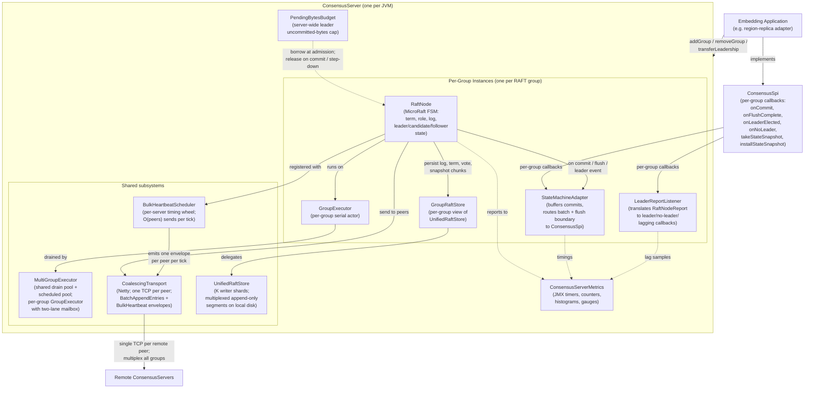
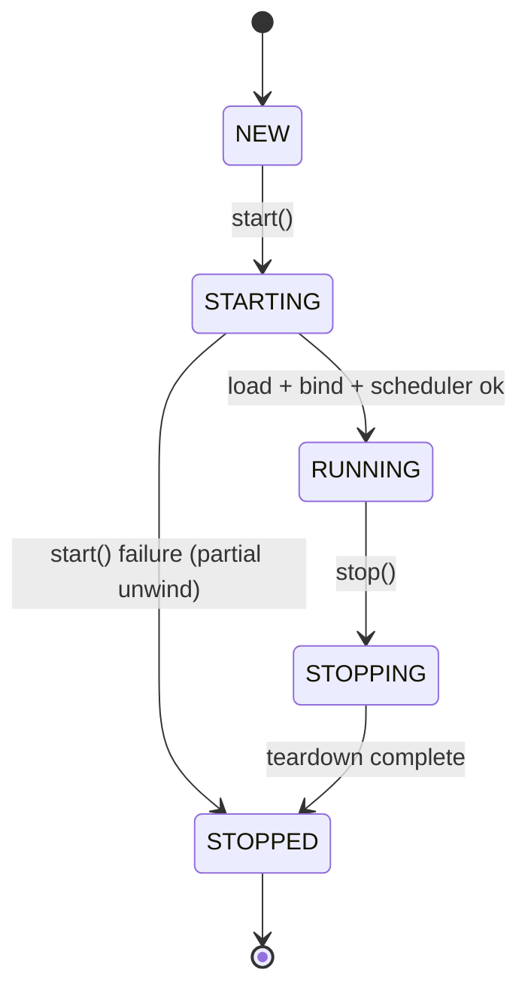
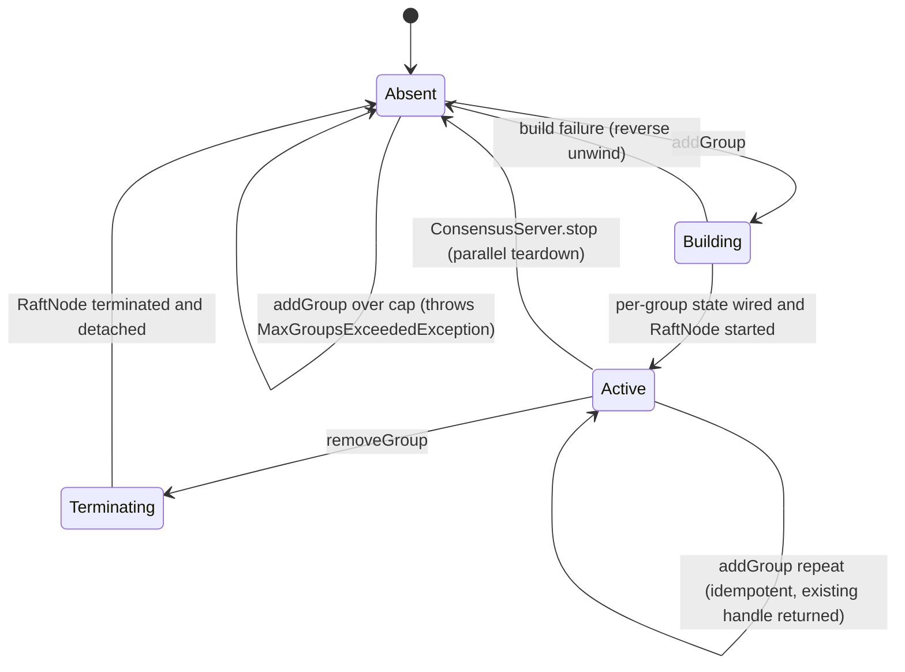
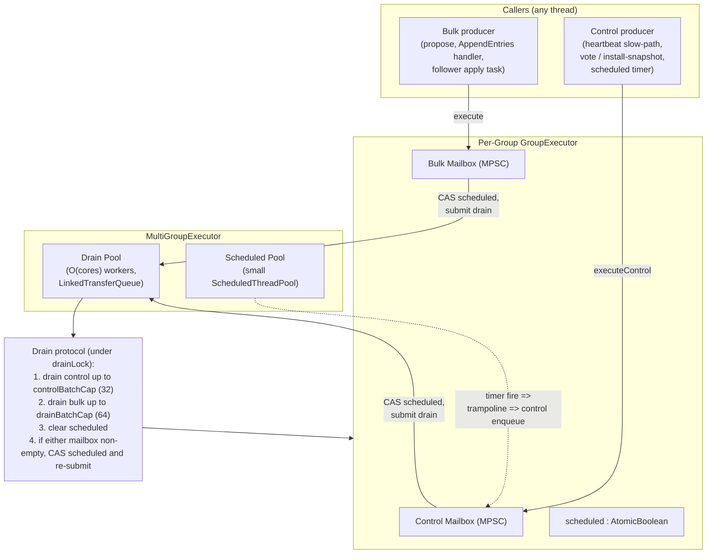
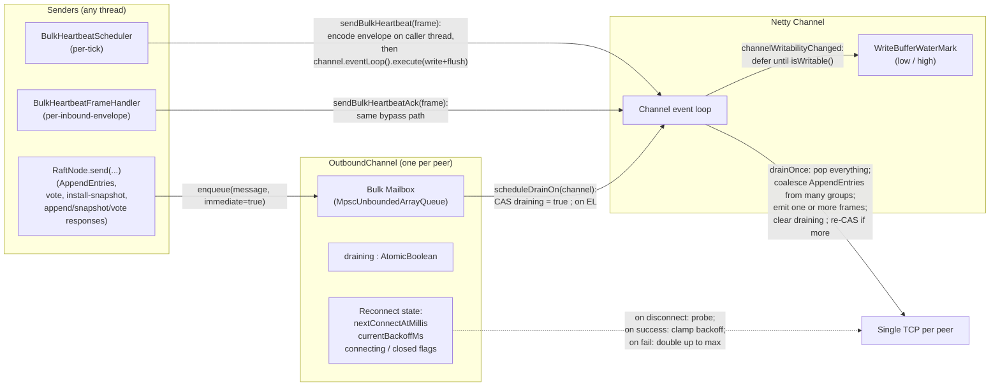
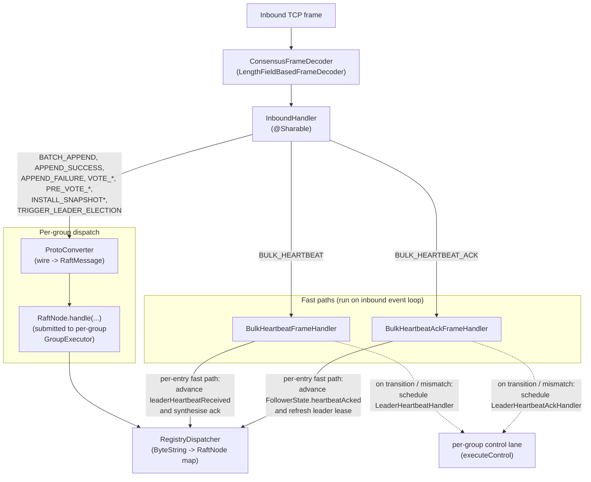
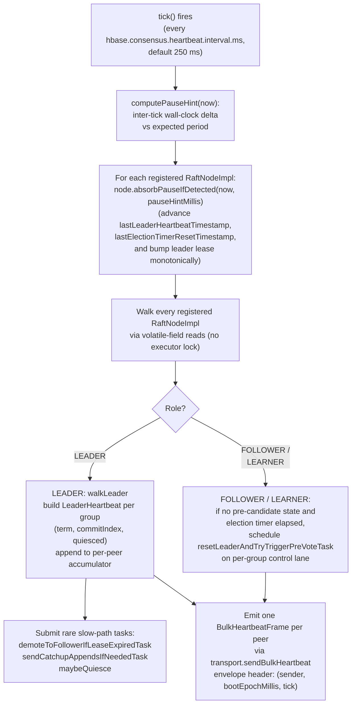
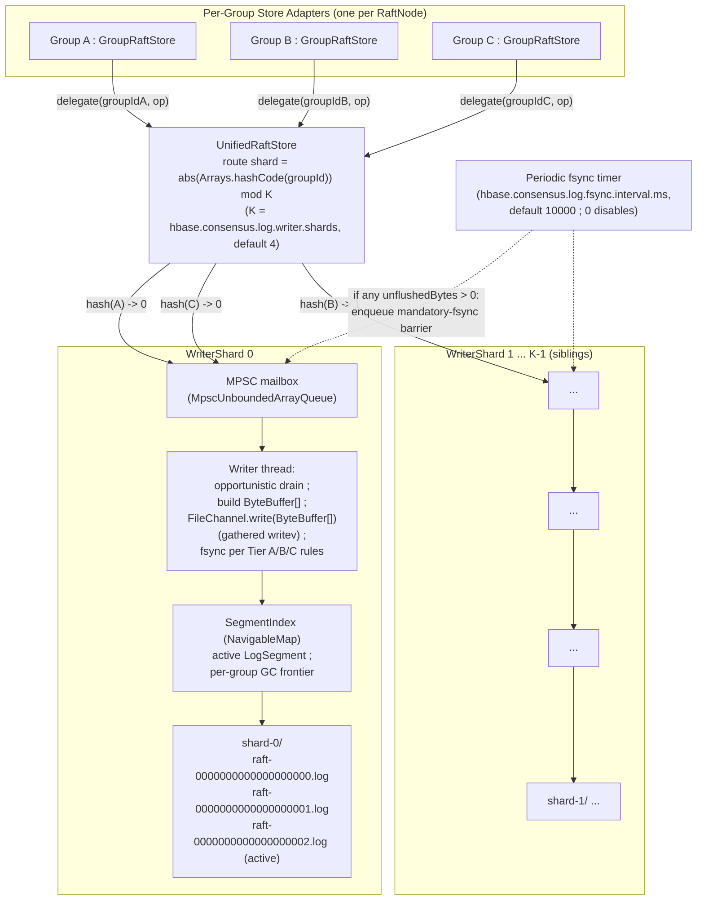
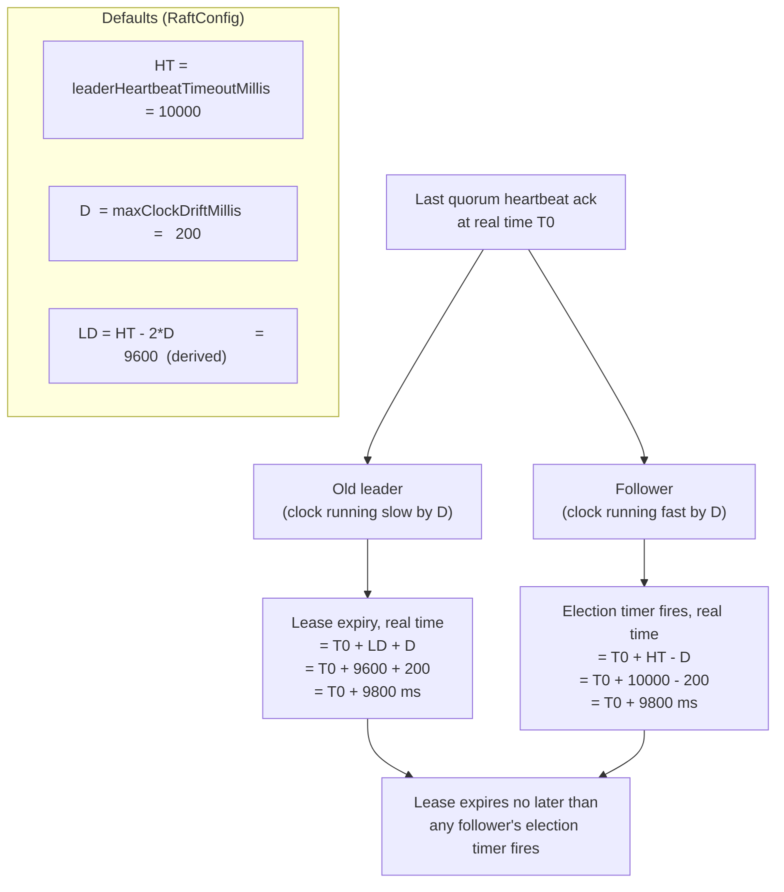
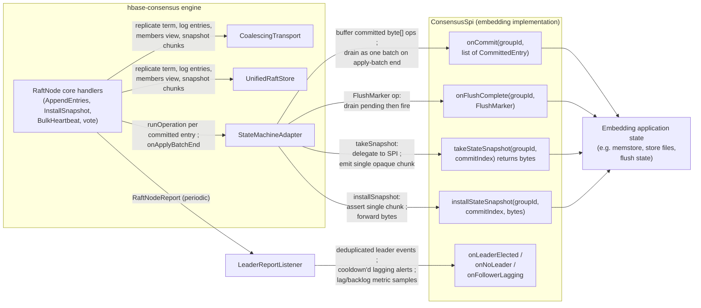

# hbase-consensus: A General-Purpose Multi-RAFT Consensus Engine

`hbase-consensus` is a purpose-built, lightweight RAFT engine and server-side runtime that hosts many RAFT groups inside a single JVM. It is derived from MicroRaft's consensus core and re-architected from the outset for `O(10000)` groups per process. The engine separates generic consensus concerns from application concerns, exposing a small SPI. The reference embedding is HBase region-replica memstore replication, but the engine is designed so that nothing in the core is region-specific. The same runtime can be reused for other coordination needs without modification.

## Overview and Design Philosophy

**Generic engine, opaque payloads.** `ConsensusServer` operates on opaque group identifiers, opaque peer identifiers, and opaque `byte[]` log entries. HBase components implement region-specific and other behaviors to `ConsensusSpi`. This separation keeps the door open for the engine to subsume other in-cluster coordination roles over time, such as master election, RegionServer liveness leases, cluster metadata, and replication state.

**MicroRaft core.** The engine imports MicroRaft's single-threaded actor RAFT core (Apache 2.0) into the HBase source tree under the HBase namespace. The per node executor model is replaced with a shared multi group actor pool with two lane mailboxes. The per node `RaftStore` is replaced by a sharded multiplexed unified log. The per node `Transport` is replaced by a process wide coalescing transport with cross group `BatchAppendEntries` and a store level heartbeat sweep. Finally, the leader lease is rewritten to be drift compensated and to refresh on every voting quorum response. Everything else is carried over unchanged, including pre vote, leader stickiness, vote durability before response, immediate post-election heartbeat, new term entry on election, term fencing, deterministic commit index advancement, parallel leader flush, single server membership change with the committed-entry-in-current-term guard, and leadership transfer with stickiness bypass.

**Architected for `O(10000)` groups per RegionServer.** Three multi-group patterns proven in production at TiKV (shared event loop), CockroachDB (store-level heartbeat coalescing, batched apply), and Redpanda (lightweight heartbeats) compose into a runtime where the per-server cost of an idle group is essentially zero, the per-tick send count is `O(peers)` rather than `O(groups)`, and the per-tick fsync count is `O(shards)` rather than `O(groups)`.

**Three explicit durability tiers in the unified log.** A fast default operating mode in which entries are page-cache-durable on a gathered write and fsync fires on a timer plus segment-roll, with a per-commit fsync mode available for embeddings that want the additional durability assurance. Safety-critical RAFT state, such as term, voted-for, local endpoint, and initial members, always fsyncs synchronously, regardless of mode.

**Server-wide admission control.** With ten thousand groups, modest per group accumulation can compound into excessive resource utilization and ultimately destabilizes lease and election timing. The engine enforces two complementary admission controls: a per group cap on the count of uncommitted entries inherited from the MicroRaft model and a single server wide byte footprint budget for uncommitted leader side proposal payloads. Both controls fail fast at admission so propose side callers can shed load instead of growing internal queues.

## Architecture at a Glance

The top level component is `org.apache.hadoop.hbase.consensus.handler.server.ConsensusServer`. One instance is created per JVM. It owns and wires four shared subsystems that every hosted RAFT group draws on, plus a server-wide `PendingBytesBudget` and a JMX-published `ConsensusServerMetrics`. Embedding code interacts with the engine through the `GroupManager` API and the per-group `ConsensusSpi` callback interface.



`MultiGroupExecutor` keeps thread count `O(cores)` regardless of group count. `CoalescingTransport` keeps connection count and per-tick send count `O(peers)`. `UnifiedRaftStore` keeps writer-thread and fsync count `O(shards)`. `BulkHeartbeatScheduler` keeps timer count `O(1)` per server. Per-group state including the `RaftNode` FSM, an MPSC mailbox, a `GroupRaftStore` adapter, a `StateMachineAdapter`, and a `LeaderReportListener` is on the order of a few kilobytes.

## Module Layout

The implementation is organized into package groups under `org.apache.hadoop.hbase.consensus`. The `handler/*` packages contain the engine subsystems and their SPI surfaces. The `raft/*` packages contain the MicroRaft-derived RAFT protocol core, modified in the four areas described in the next section.

- `handler/server`: `ConsensusServer` wires the four shared subsystems and implements the `GroupManager` API. `ConsensusServerConfig` parses the server-level Hadoop `Configuration`. `ConsensusServerStatus` carries the lifecycle enum (`NEW`, `STARTING`, `RUNNING`, `STOPPING`, `STOPPED`) and a registry snapshot. `GroupHandle` is the opaque wrapper of `(groupId, RaftNode)` returned by `addGroup`. `ConsensusServerMetrics` exposes the JMX metrics tree.

- `handler/executor`: The shared multi-group actor runtime. `MultiGroupExecutor` owns one drain `ThreadPoolExecutor` and one small `ScheduledThreadPoolExecutor`. It hands out one package-private `GroupExecutor` per registered group via `executorFor(groupId)`. Each `GroupExecutor` implements the per-group serial-actor contract using two MPSC mailboxes and a `scheduled` latch.

- `handler/transport`: `CoalescingTransport` implements the MicroRaft `Transport` SPI as a process-wide service. `OutboundChannel` is the per-peer outbound state. `InboundHandler` decodes the wire `ConsensusFrame` and dispatches via `RegistryDispatcher`. `BulkHeartbeatFrameHandler` and `BulkHeartbeatAckFrameHandler` implement the fast-path and slow-path split for heartbeat traffic. `ConsensusFrameEncoder` and `ConsensusFrameDecoder` handle wire framing. `ProtoConverter` translates between the in-memory model and the wire protobufs. `PayloadCompressor` provides per-entry compression. `OperationCodec` and `OperationCodecs` are the SPI for opaque-op serialization. `EndpointResolver` and `WireRaftEndpoint` handle endpoint identity. `TransportConfig` parses the transport-side configuration.

- `handler/store`: The unified multiplexed consensus log. `UnifiedRaftStore` implements the `DurableLogStore` SPI and routes per-group operations to one of K `WriterShard`s by stable hash. Each `WriterShard` owns a private MPSC mailbox, a dedicated writer thread, an active `LogSegment`, a `SegmentIndex`, and per-group GC accounting. `LogRecord` defines the on-disk frame format, the segment magic, and the streaming `Reader`. `GroupRaftStore` is the per-group `RaftStore` adapter. `LogStoreConfig` parses the log-store configuration. `DefaultLogStoreSerializer`, `LogStoreSerializer`, and `RaftModelPbCodecs` handle on-disk serialization with protobuf for the wire-format peer types and a compact custom encoding for the persistence-only types.

- `handler/statemachine`: The bridge between the RAFT core's general-purpose `StateMachine` interface and the application-facing `ConsensusSpi`. `ConsensusSpi` is the SPI itself. `StateMachineAdapter` is the per-group adapter that buffers committed `byte[]` ops as `CommittedEntry`s, drains on apply-batch end, treats `FlushMarker` as an explicit boundary, and round-trips a single opaque `byte[]` chunk through the SPI for snapshots. `LeaderReportListener` translates each periodic `RaftNodeReport` to deduplicated `onLeaderElected` and `onNoLeader` calls, rate-limited `onFollowerLagging` alerts, and per-tick lag/backlog metric samples.

- `raft/*`: The modified MicroRaft-derived consensus core. `RaftNode` is the per-group FSM facade. Our `PendingBytesBudget` is the server-wide byte-credit pool injected by `ConsensusServer`. `RaftNodeImpl` and `RaftNodeBuilderImpl` are the concrete implementations. `raft/impl/state/*` contains `RaftState`, `LeaderState`, `FollowerState`, `CandidateState`. `raft/impl/handler/*` contains the per-message handlers (`VoteRequestHandler`, `VoteResponseHandler`, `AppendEntriesRequestHandler`, `AppendEntriesSuccessResponseHandler`, `AppendEntriesFailureResponseHandler`, `LeaderHeartbeatHandler`, `LeaderHeartbeatAckHandler`, `InstallSnapshotRequestHandler`, `InstallSnapshotResponseHandler`). Our `raft/heartbeat/impl/BulkHeartbeatScheduler` is the per-server timing wheel that replaces per-group heartbeat timers in upstream MicroRaft.

## The MicroRaft Core, Adapted

The RAFT protocol implementation is derived from MicroRaft (Apache 2.0), imported into the HBase source tree under the `org.apache.hadoop.hbase.consensus.raft` namespace and adapted in place. MicroRaft was selected because it is explicitly designed as an embeddable RAFT core with a small, stable set of pluggable interfaces and a single-threaded actor execution model. MicroRaft has only SLF4J as a runtime dependency, and the engine's transport and store add only Netty and Protobuf so no new external dependencies enter the HBase classpath.

MicroRaft's `RaftNodeExecutor` SPI is implemented by `MultiGroupExecutor` / `GroupExecutor` rather than by a per-node executor. All groups share the engine's drain pool. Per-group serial execution is enforced by a latch. The drain protocol adds a two-lane control/bulk mailbox split with asymmetric per-pass caps.

The `RaftStore` SPI is implemented by `GroupRaftStore`, a per-group adapter that delegates every call to the shared `UnifiedRaftStore`. The shared store routes every per-group operation to one of K writer shards by stable hash and multiplexes entries from all groups routed to the same shard into a single sequential write stream. This is the change that makes per-tick fsync count `O(shards)` instead of `O(groups)`.

MicroRaft's `Transport` SPI is implemented by `CoalescingTransport`, a process-wide service shared by every group. It maintains one TCP connection per peer, multiplexes per-group `AppendEntries` from all groups into cross-group `BatchAppendEntries` envelopes per peer, and replaces upstream's per-group heartbeat timers with the store-level `BulkHeartbeatScheduler` timing wheel. The wheel emits one `BulkHeartbeatFrame` per peer per tick carrying one `LeaderHeartbeat` entry per group that owes that peer a liveness signal on this tick.

The optional leader-lease feature is replaced by a mandatory drift-compensated lease. The lease duration is derived as `leaderHeartbeatTimeoutMillis - 2 * maxClockDriftMillis` rather than as a configurable fraction of the heartbeat timeout, and the lease is refreshed on every voting-quorum response.

Three additional safety and liveness gaps in upstream MicroRaft's vote-counting and term-handling paths are fixed in place. They are documented under "Leader Lease, Stickiness, and Safety Fixes" below.

## ConsensusServer Lifecycle and Group Hosting

`ConsensusServer` is the unit of construction, startup, shutdown, and group registry.



`addGroup` and `transferLeadership` require the `RUNNING` state and raise `IllegalStateException` otherwise. `removeGroup` and `status` are tolerant of `STOPPING`.

### Construction order

The `ConsensusServer(Configuration, RaftEndpoint, ...)` constructor wires the fixed dependency graph in this order:

1. `ConsensusServerConfig` is parsed from the supplied `Configuration`. It exposes `getMaxGroups()` (`hbase.consensus.maxgroups`, default `50000`) and `getMaxPendingBytes()` resolved by a three-tier rule (explicit `hbase.consensus.max.pending.bytes` wins; otherwise `hbase.ipc.server.max.callqueue.size`; otherwise `1 GiB`).
2. `bootEpochMillis = EnvironmentEdgeManager.currentTime()` is captured once. The same long is handed to `CoalescingTransport` and `BulkHeartbeatScheduler`. Every `BulkHeartbeatFrame` carries this value in its envelope header alongside the sender endpoint and a monotonic tick counter, so peers can detect server restarts without a dedicated handshake.
3. `pendingBytesBudget = PendingBytesBudget.create(serverConfig.getMaxPendingBytes())` allocates the server-wide byte-credit pool that every group leader on this server will share.
4. `MultiGroupExecutor` is constructed from `(conf, maxGroups)`. Pool size is auto-scaled with `maxGroups`; see "Multi-RAFT Execution Model" below.
5. `UnifiedRaftStore(new LogStoreConfig(conf))` instantiates the sharded log store. The store's writer threads do not start until `start()`.
6. `CoalescingTransport(localEndpoint, bindAddress, resolver, operationCodec, conf, bootEpochMillis)` constructs the Netty transport. The Netty server is not bound until `start()`.
7. `BulkHeartbeatScheduler(conf, transport, bootEpochMillis)` constructs the timing wheel. Its scheduled executor is not started until `start()`.
8. `ConsensusServerMetrics(this)` registers the JMX metrics tree.

### Start

`start()` performs ordered bring-up:

1. `state = STARTING`.
2. `logStore.load()` -- a single whole-disk replay across every shard subdirectory. Any per-group `RestoredRaftState` reconstructed by replay is held in a `restoredStates` map keyed on a read-only `ByteBuffer.wrap(groupIdBytes)` view, ready for `addGroup` lookup.
3. `transport.start()` -- the Netty server binds, the client bootstrap is created, and the inbound pipeline becomes ready.
4. `scheduler.start()` -- the timing wheel begins ticking at `intervalMs` cadence (default 250 ms).
5. `state = RUNNING`.

If any step fails, `start()` unwinds and transitions to `STOPPED` state.

### Stop

`stop()` reverses the bring-up:

1. `state = STOPPING`.
2. `teardownGroups()` walks every `GroupHandle` in parallel. Each `RaftNode.terminate()` future is collected and joined. For each terminated handle, `detachAfterTerminate(h)` calls `scheduler.unregister`, `transport.undiscoverNode`, and lets the per group executor self-evict via `onRaftNodeTerminate`.
3. `scheduler.close()` shuts the timing wheel.
4. `transport.stop()` closes inbound and outbound channels and shuts the event loop group.
5. `logStore.close()` cancels the periodic-fsync timer, drains every shard's writer thread, fsyncs and closes the active segments.
6. If the executor is owned by this server, `executor.close()` shuts the drain and scheduled pools.
7. `restoredStates.clear()` and `metrics.close()` finalize.
8. `state = STOPPED`.

### Group lifecycle

The application interacts with the `GroupManager` interface to add and remove groups. In the canonical RAFT-replica use case, groups map 1:1 to HBase table regions.

Each group passes through a lifecycle from registration through termination:



Concurrent operations on the same `groupId` serialize so that "Building" and "Terminating" never overlap, and the registry cap (`hbase.consensus.maxgroups`) is enforced atomically with admission.

In **Building** state, the engine wires the per-group state from a per-group view of the unified log, a per-group serial executor, a `StateMachineAdapter` and `LeaderReportListener` over the supplied `ConsensusSpi`, and a `RaftNode` that draws on the shared transport, heartbeat scheduler, and `PendingBytesBudget`. The node is then registered with the transport's inbound dispatcher and the heartbeat wheel, and its FSM is started. Any failure during this sequence is reversed in order, releasing every shared-subsystem registration.

In **Terminating** state, the engine joins the node's terminate future and detaches it from the heartbeat wheel, the transport's inbound dispatcher, and the per-group executor, which self-evicts and cancels any scheduled timers it was tracking. The slot is then cleared from the registry.

`addGroup` and `removeGroup` are instrumented for latency and outcome via the JMX metrics tree. `addGroup` counts admission failures and build failures separately so that operators can distinguish capacity exhaustion from configuration- or storage-level startup faults.

## Multi-RAFT Execution Model

`MultiGroupExecutor` implements the per-server runtime. It is the framework that lets a single JVM host thousands of RAFT groups without thousands of threads.

### Shared pools and per-group actors

The executor splits hot paths into two pools. A drain pool, implemented as a `ThreadPoolExecutor` backed by a `LinkedTransferQueue`, services immediate per-group drain runnables. The transfer queue choice avoids the synchronization cost of a `LinkedBlockingQueue` on the high fanout immediate drain path. A separate scheduled pool, a `ScheduledThreadPoolExecutor` of size `hbase.consensus.executor.scheduled.threads` (default 2), services delayed work, such as the per-group election timers, the rare control lane catch up triggers fired by the heartbeat wheel, and any other deadline based timer.

The drain pool size is auto-scaled with the configured maximum group count. Two configuration triplets are honored, with the new keys taking precedence:

```text
floor       = max(hbase.consensus.executor.threads, hbase.consensus.executor.pool.size,
                  max(2, 2 * availableProcessors))
desired     = max(floor, ceil(maxGroups * hbase.consensus.executor.threads.per.group.target))
poolSize    = min(desired, hbase.consensus.executor.threads.ceiling)
```

`hbase.consensus.executor.threads.per.group.target` defaults to `0.05`, one drain thread per twenty configured groups. `hbase.consensus.executor.threads.ceiling` defaults to `4 * availableProcessors`. The result is a pool that grows with configured group count up to the ceiling.

### Two-lane mailbox

Each group gets one per group executor instance, served by the shared drain pool. The instance owns two mailboxes and a small amount of coordination state. Each mailbox is a multi-producer single-consumer queue. Any number of threads anywhere in the engine may post tasks into it, but only one drain runnable at a time is allowed to take from it. The control mailbox carries control lane traffic, and producers route a task there explicitly when they want it on that lane. The bulk mailbox carries bulk lane traffic and is the default destination for an ordinary submission. Both mailboxes start small and grow on demand as bursts arrive. A single latch sits alongside the two mailboxes and ensures that at most one drain runnable is in flight for the group at any time, which is the mechanism that enforces the per group serial actor contract on top of the shared pool.

### Drain protocol



If the producer that just enqueued the task is the one that observes the latch transition from clear to set, it submits a drain runnable to the shared pool. Otherwise, an existing drain is already in flight for the group and the enqueue alone suffices. The drain itself runs under a lock that serializes the single consumer side of the two mailboxes. It first drains up to a configurable cap of items from the control mailbox, then provided the executor has not been torn down mid-pass drains up to a separate, larger cap from the bulk mailbox. After both phases it clears the in flight latch and peeks both mailboxes. If either still has work waiting, it sets the latch again and re-submits the group to the pool rather than continue draining on the same worker, so any other group waiting for a worker gets a turn before this group's next pass begins.

This implements what can be summarized as control first, capped, then yield. It bounds the worst-case wait of a control task that arrives at an empty control mailbox to the time required to service one full bulk burst, which is the bound that the leader lease and election timer arithmetic depend on under sustained bulk saturation.

### Hardening

Several implementation hardenings guard the executor against the subtle concurrency bugs that arise when many threads share a single multi-producer single-consumer queue and groups are created and destroyed under load. A per group executor that is being torn down only removes itself from the central registry when the registry's slot for its group still points at this very instance, so a terminating executor cannot evict a fresh replacement that a concurrent lookup has already installed in its place. The lookup path enforces the symmetric guarantee. A caller looking up the executor for a group on the fast path will, on observing a terminated entry, fall into a slow path under a lifecycle lock that atomically replaces the dead entry with a fresh one before returning, so callers never receive a terminated executor. On the terminating side itself, the teardown sequence flips a termination flag, cancels every scheduled timer the executor was tracking, performs the value aware self-eviction described above, and finally schedules one last drain that discards any remaining mailbox entries rather than running them. Scheduled task lifetime is managed through a small trampoline that posts a wrapper to the shared scheduled pool, keeping cancellation accounting consistent regardless of which side of the race between the producer recording the future and the wrapper firing wins. And inside the drain loop itself, every iteration rechecks the termination flag, so a task that triggers termination aborts the rest of its in-flight batch rather than letting subsequent entries observe a half-torn-down executor.

The `hbase.consensus.executor.*` knob table is consolidated under "Configuration Reference" below. Per-group serial-execution behavior, two-lane fairness, the lost-wakeup edge case, the schedule trampoline, and the lifecycle invariants are exercised by the executor test suite enumerated under "Test Coverage."

## Batching Hierarchy

The engine reduces per-mutation consensus overhead from `O(mutations)` toward `O(peers)` through three levels of batching that compose end-to-end. Each level operates independently and dominates a different overhead cost.

**Level 1: intra-proposal batching.** A single proposal carries an opaque payload that the embedding application has already aggregated from however many client-level operations it chose. For the reference HBase region embedding, an incoming multi-row write RPC is grouped by region on the RegionServer, each per-region sub-batch is processed as a mini-batch, and the resulting per-mini-batch write ahead log edit becomes the payload of a single proposal. The maximum payload size of any individual proposal is enforced by the embedding application. Oversize mini-batches are split at the first mutation boundary that crosses the threshold, with the remainder issued as a follow on proposal. This level of batching is the dominant one because it reduces the proposal count from being proportional to the number of mutations all the way down to being proportional to the number of regions touched, before any of the engine's own batching ever runs.

**Level 2: inter-proposal batching.** When the shared drain pool services a group, the per-group drain loop pops every pending item from the bulk mailbox up to its configured per-pass cap rather than one at a time. Multiple proposals that accumulated while the previous replication round was in flight are combined into a single replication message carrying multiple log entries. The number of entries that can ride in any one such message is itself capped so that no single message becomes pathologically large. The per group cap on the number of admitted-but-uncommitted entries and the server wide pending bytes budget together prevent admission from overrunning memory when bursts last longer than the cluster can drain.

**Level 3: cross-group transport coalescing.** The per-peer outbound drain on the transport pops every queued message at once and emits one or more coalesced wire frames. Replication messages from many groups destined for the same peer are collapsed into a single batched envelope, so one envelope on the wire carries entries for many groups. The store level heartbeat sweep emits exactly one envelope per peer per tick, carrying one per group liveness signal for every group that owes that peer one. The combined effect is that the per tick system call count and TCP framing overhead for the entire engine grow with the number of remote peers rather than the number of active groups, which on a multi-thousand-group host is a difference of three or four orders of magnitude.

On the follower side, the batched replication message is persisted to the consensus log as a single write through the unified store and acknowledged as a unit. Multiple groups whose entries happen to land on the same writer shard share one gathered write and one fsync barrier, amortizing log I/O across groups as well as within them. The follower then applies the entire batch to the embedding application as one commit callback, letting the embedding amortize whatever per-batch fixed cost it has across the whole batch instead of paying it once per entry.

## Server-Wide Proposal Backpressure

A multi-RAFT host that accepts more leader-side propose work than its peers can drain pins uncommitted log entries on the heap until the cluster catches up. With ten thousand groups, even modest per-group accumulation compounds into hundreds of gigabytes of pinned bytes, drags the leader into long GC pauses, and ultimately destabilizes lease and election timing. The engine therefore enforces two complementary admission controls on the propose path of every group leader.

### Per-group entry-count cap

The first control is the per-group `maxPendingLogEntryCount` (default 5000), inherited from the upstream MicroRaft model. It bounds the depth of any single leader's pending queue. A single group whose followers have fallen behind cannot produce an unbounded number of in-flight log entries regardless of what the rest of the host is doing. When the cap is reached the propose call fails fast with `CannotReplicateException` so the propose-side caller can shed load.

### Server-wide pending-bytes budget

The second control is a single, server-wide cap on the byte footprint of uncommitted leader-side propose payloads, aggregated across every group the host is currently leading. Because the leader-versus-follower mix of any given host is not known up front and shifts continuously with leadership transfers, this ceiling cannot naturally factor into a per-group share .

The budget lives in `org.apache.hadoop.hbase.consensus.raft.PendingBytesBudget`. `tryAcquire(bytes)` runs a CAS loop returning `false` on overflow or capacity exhaustion. `release(bytes)` does a single `addAndGet`. A static `UNLIMITED` instance is provided for tests and standalone callers.

### Borrow / release semantics

`RaftNodeImpl` wires the budget into the propose path. Each leader tracks its own outstanding credits in a per-node `reservedBytesByIndex` map keyed by leader-side log index:

- **Borrow at admission.** `tryReserveLeaderPendingBytes(logIndex, bytes)` runs atomically with the log append. On overflow it returns `false` and the propose call fails fast with `CannotReplicateException`; the engine never queues admission requests internally, leaving congestion management entirely to the propose-side caller.
- **Per-entry release on commit.** `releaseLeaderPendingBytesAt(logIndex)` is called as the corresponding entry commits in the apply path, returning precisely the bytes that were borrowed for that specific entry, even when entries of mixed sizes are flowing through the same group.
- **Per-entry release on truncation.** The same per-index release fires when a previously reserved log index is dropped by a leader-side truncation.
- **Wholesale release on role change or termination.** `releaseAllLeaderPendingBytes()` returns the entirety of a leader's borrowed credit in a single call. It fires on `setStatus(TERMINAL)` and on `toFollower(term)`. Followers do not borrow against the budget. They apply whatever the current leader has already committed, and the per-leader accountant is naturally empty in the follower role.

This is the server-wide memory guard. Combined with the per-group entry-count cap, it bounds the worst-case heap footprint of every leader the host runs to a single, operator-tunable byte ceiling, and turns admission failure into an explicit fast-fail signal that callers can act on -- a load-shedding contract rather than an internal queue.

## Transport: Netty + Protobuf + Coalescing

`CoalescingTransport` implements MicroRaft's `Transport` SPI as a single process-wide service shared by every group on the host. MicroRaft's contract permits this because messages already carry a group identifier in their header. Routing is possible from a shared transport instance. The shared transport exploits this to maintain one Netty TCP connection per peer, multiplex all groups' traffic over that connection, and coalesce per-group messages into cross-group envelopes.

### Connection topology

The transport owns:

- One inbound Netty `ServerBootstrap` bound to `hbase.consensus.port` (default 16080).
- One outbound `Bootstrap` for client connections.
- One shared `EventLoopGroup` (Epoll on Linux x86_64/aarch64, NIO otherwise) sized by `hbase.consensus.transport.io.threads` (default `max(1, availableProcessors)`).
- One `OutboundChannel` per remote peer (lazy, allocated on first send).
- One `RegistryDispatcher` keyed by zero-copy `ByteString` group-id bytes for inbound demultiplexing.
- One `InboundHandler` instance (`@Sharable`) mounted on every accepted child pipeline.

The native transport selection (Epoll vs NIO) and the `ByteBufAllocator` choice (pooled vs unpooled vs heap, or any FQCN) are configurable. Netty is already a core HBase dependency, so the engine introduces no new external dependencies.

### Wire framing and message kinds

Each direction frames messages as `[int32 length][protobuf body]`. The body is a `ConsensusFrame` protobuf whose `Kind` enum carries every wire message:

| Kind | Direction | Payload |
|---|---|---|
| `BATCH_APPEND` | leader -> followers | one or more `GroupAppendEntries` (cross-group `AppendEntries`) |
| `APPEND_SUCCESS` | follower -> leader | per-group success ack |
| `APPEND_FAILURE` | follower -> leader | per-group failure ack |
| `INSTALL_SNAPSHOT` | leader -> follower | snapshot chunk transfer |
| `INSTALL_SNAPSHOT_RESP` | follower -> leader | snapshot chunk ack |
| `VOTE_REQUEST` | candidate -> peer | vote request |
| `VOTE_RESPONSE` | peer -> candidate | vote response |
| `PRE_VOTE_REQUEST` | candidate -> peer | pre-vote (non-binding) |
| `PRE_VOTE_RESPONSE` | peer -> candidate | pre-vote response |
| `TRIGGER_LEADER_ELECTION` | leadership-transfer source -> target | bypass-stickiness signal |
| `BULK_HEARTBEAT` | leader's server -> peer | one envelope per peer per tick, carrying one `LeaderHeartbeat` per group that owes that peer a signal |
| `BULK_HEARTBEAT_ACK` | peer -> leader's server | one envelope per inbound bulk-heartbeat, aggregating per-group acks back to the leader |

The decoder is a `LengthFieldBasedFrameDecoder(maxFrameLength, 0, 4, 0, 4)` configured by `hbase.consensus.transport.max.frame.bytes` (default 256 MiB). Parse and CRC failures throw `CorruptedFrameException`. The encoder writes the length prefix and serializes the protobuf body via `ByteBufOutputStream`.

### `BatchAppendEntries` envelope

Multiple groups' `AppendEntries` to the same peer are coalesced into one envelope rather than emitted as individual frames:

```protobuf
message BatchAppendEntries {
  repeated GroupAppendEntries groups = 1;
}
message GroupAppendEntries {
  bytes group_id = 1;
  uint64 term = 2;
  uint64 prev_log_index = 3;
  uint64 prev_log_term = 4;
  repeated bytes entries = 5;  // payload, optionally compressed
  uint64 leader_commit = 6;
}
```

On the inbound side, only the envelope header fields are parsed by the dispatch layer. Payload bytes are passed opaquely to the per-group `RaftNode` which deserializes them under the per-group serial executor.

### Per-peer outbound channel



The `OutboundChannel` carries two distinct lanes that share the underlying TCP connection but use different drain triggers:

- **Bulk lane.** A send call from anywhere in the engine posts the outbound message into the per-peer mailbox. If it is the call that observes the in-flight drain latch transition from clear to set, it also schedules a drain on the channel's event loop. The drain pops every message currently queued, coalesces per-group replication messages bound for this peer into one batched envelope, encodes anything else that needs to go out promptly as individual frames, writes them all to the channel, and reschedules itself if more messages have arrived in the meantime. The latch ensures only one drain is in flight per peer at any time. The drain also re-arms automatically when the channel becomes writable again after a previous flush had filled the socket buffer.
- **Heartbeat lane.** The per-tick heartbeat sweep and the inbound-side acknowledgment aggregator both bypass the mailbox entirely. Each call already holds one fully aggregated heartbeat envelope, encoded on the caller thread, and hands it directly to the channel's event loop for a single write-and-flush. There is no drain-latch coordination on this lane because there is nothing left to coalesce. The heartbeat wheel emits one envelope per peer per tick, and the inbound handler emits at most one acknowledgment envelope per inbound heartbeat.

This separation gives the bulk lane the latency of an immediate drain and lets the heartbeat lane piggyback on a single per-tick network I/O without forcing any wall-clock floor on bulk traffic.

### Reconnect and writability backpressure

The outbound channel maintains a small reconnect state machine. `maybeConnect()` is gated by `nextConnectAtMillis`, an `AtomicBoolean connecting`, and a `closed` flag. On connect success the backoff is clamped to `hbase.consensus.transport.reconnect.backoff.min.ms` (default 100 ms), a writability listener is attached to re-arm the bulk drain when the channel becomes writable, and a close-future listener is attached to schedule the next probe at the floor. On connect failure the next probe is scheduled at the current backoff and `currentBackoffMs` doubles up to `hbase.consensus.transport.reconnect.backoff.max.ms` (default 2 s).

Each newly connected channel installs a `WriteBufferWaterMark` from `hbase.consensus.transport.write.high.watermark.bytes` (default 8 MiB) and `hbase.consensus.transport.write.low.watermark.bytes` (default 2 MiB). Both `enqueue` and the bulk-heartbeat send paths bail when `!ch.isWritable()`. The drain's outer scheduler defers further work until `channelWritabilityChanged` fires.

### Per-entry payload compression

`PayloadCompressor` provides per-entry compression for `LogEntryPB.op_payload`. The outbound algorithm is fixed at construction (`hbase.consensus.transport.compression`, default `none`; recommended `snappy` for cross-AZ deployments where inter-AZ bandwidth is the operating constraint). Compressed entries are stored compressed in the consensus log and emitted compressed on the wire. Each entry header carries a compression-algorithm identifier so receivers do not need matching configuration. Decompression happens during the apply callback when the entry is committed. Observed compression ratios on representative HBase workloads range from 2:1 to 3:1.

### Inbound dispatch



The inbound handler switches on the wire frame's kind and dispatches each kind to the right place. For every per group RAFT message kind the wire form is decoded into the engine's in-memory message type and handed to the addressed group's RAFT node through a registry that is keyed by the raw group-id bytes carried on the wire. The registry submits the work to the group's per group executor, so even though the inbound network thread is what received the bytes, the actual RAFT state mutation happens on the group's own serial actor and the single threaded actor semantics that the rest of the engine assumes are preserved.

The two heartbeat frame kinds take a fast-path / slow-path split instead. On the fast path, both handlers run directly on the inbound network thread, walk the per-group entries in the envelope, and perform a lock-free update against the addressed RAFT node. The heartbeat side advances the node's "last leader heartbeat received" timestamp and synthesizes a per-group acknowledgment into the outgoing aggregated reply, and the acknowledgment side advances the per-follower "heartbeat acked" timestamp and pushes the leader's lease expiry forward. Neither path takes a lock, queues per-group work, or touches the per-group executor in the steady-state case, which is what keeps per-tick processing constant-time per per-group entry. Whenever something interesting happens that the fast path is not allowed to act on, the fast path falls back to the slow path, which schedules the corresponding heartbeat handler on the addressed group's control lane and lets the per group serial actor sort it out. Acknowledgments produced on the slow path are buffered per remote sender and ride out on the next outgoing aggregated acknowledgment envelope, so even slow-path cases do not provoke a separate one-off network round trip.

The dispatch registry is keyed by the raw group-id bytes that arrived on the wire, rather than by a decoded string identifier, to avoid one allocation per inbound message on the dispatch hot path. The registry also tolerates the rare case where a group is removed and re-added while in-flight inbound traffic still references the previous entry. An observed terminated entry is replaced atomically rather than treated as an error, so a fresh entry takes over without dropping any of the in-flight inbound work that was destined for the same group identifier.

The full set of transport, listener-port, and Netty-tuning configuration knobs is consolidated under "Configuration Reference" below.

## Store-Level Heartbeat Coalescing

A naive RAFT implementation runs a self-rescheduling heartbeat timer per group. On every firing, a leader broadcasts to its followers and a follower checks whether the leader-heartbeat timeout has elapsed and starts a pre-vote if so. At thousands of groups this means thousands of independent timers, thousands of independent scheduler wakeups per heartbeat period, and thousands of individual network sends per heartbeat period -- a syscall budget that exhausts a modest CPU before the actual RAFT work runs.

`BulkHeartbeatScheduler` (`raft/heartbeat/impl/`) replaces the per-group timers with a single per-server timing wheel. The wheel ticks at a fixed cadence and on every tick walks every registered group, builds per-peer envelopes, and emits exactly one `BulkHeartbeatFrame` per remote peer.

### Per-tick walk



The hot path is engineered for very low jitter on a saturated server. The per group state the wheel reads is published on volatile fields that the per group serial executor updates on every step that changes the steady state liveness picture. The wheel walks those volatile fields without any lock and without queuing any work onto the per group executors. It dispatches into the per group executor only for the rarely needed slow path actions and even those are dispatched as fire-and-forget control-lane tasks rather than synchronous calls. The result is per tick latency bounded by the cost of one walk over the registered groups plus one direct event-loop write per peer, both of which are constant time per group and per peer respectively.

The wheel runs on a dedicated `ScheduledThreadPoolExecutor` of size `hbase.consensus.heartbeat.wheel.threads` (default 1). Tick cadence is `hbase.consensus.heartbeat.interval.ms` (default 250 ms).

### Envelope contents and the keepalive header

Every outbound heartbeat envelope carries a small header that names the sending server, the wall clock time at which that server most recently booted, and a monotonic per server tick counter, followed by a list of per group liveness entries. Every receiving peer updates a single process-wide "last keepalive seen from this server" timestamp on every observed envelope, regardless of how many groups attached per group entries to that envelope. This is what lets idle groups consume zero per group bytes per tick on the wire while still benefiting from per server liveness detection. The boot epoch field in the same header also lets receivers detect server restarts without keeping any per group restart state. A peer whose cached boot epoch for an endpoint has changed knows the remote process is new and can clear its per peer state accordingly.

### JVM pause detection and absorption

The wheel folds checks for JVM stop-the-world pauses into its per tick processing. Every tick records its arrival wall clock against the previous tick's wall clock and the configured tick period. If the gap exceeds a configurable threshold, the wheel concludes that the difference between the observed gap and the expected period was a process wide pause rather than ordinary scheduling jitter, and visits every registered group before the per-group walk to absorb that pause. The absorption advances each group's most-recently-observed "last leader heartbeat" timestamp and "last election timer reset" timestamp by the same amount, and on any group where this server happens to be the leader it also pushes the leader's lease expiry forward monotonically by the same amount. The mechanism prevents transient pauses from triggering spurious re-elections of healthy leaders, while still letting the cluster re-elect correctly when a pause is long enough to be a genuine failure. For pauses longer than a separate larger cap the absorption mechanism stops trying to absorb them, and the normal lease expiry and election timeout dynamics take over and demote the affected leader.

### Where the leader lease is refreshed

The leader's lease is refreshed on three independent code paths. The formula is identical at all three sites:

```text
quorumTs = leaderState.quorumResponseTimestamp(state.logReplicationQuorumSize(), now)
leaderState.leaseExpiryMillis(quorumTs + cfg.getLeaderLeaseDurationMillis())
```

The lease is refreshed at three sites. The first is the inbound heartbeat acknowledgment fast path. For every per group acknowledgment that arrives from a voting follower whose verified log index has reached the leader's own last log index, the lease is pushed forward directly on the inbound network thread, without taking any lock. The lease expiry itself is stored as a single long field that is updated under a monotonic-maximum rule, so any number of threads anywhere in the engine may race to push it forward without coordinating, and the value never goes backward. The second site is the same fast path's fallback. When the fast path declines to act because of a transition condition, the corresponding slow path heartbeat acknowledgment handler runs the same lease refresh on the addressed group's control lane and produces the same monotonic update. The third site is the response handler for successful replication. Every successful replication acknowledgment from a voting follower refreshes the lease using the same rule, so the lease is kept current by ordinary write path round trips as well as by explicit heartbeat acknowledgments. Under sustained write load the lease is therefore refreshed many times per heartbeat tick, not just once.

### Optional Idle-Group Quiescence

Idle group quiescence is an opt-in optimization (`RaftConfig.isQuiescenceEnabled()`, default `false`) intended for very large group counts where the per group payload inside the bulk heartbeat envelope becomes a non-trivial fraction of cross-AZ traffic. Operators are expected to leave it disabled until they have confirmed that their group population is both large and idle enough to benefit. When enabled, it collapses the per-group bytes contributed by idle groups to zero.

A leader is allowed to mark its group quiescent only when several conditions hold simultaneously: its own lease is live, a configurable grace period has elapsed since the last successful proposal returned to its caller, no proposal or query is in flight and no leadership transfer is in progress, its commit index, last-applied index, and last log-or-snapshot index all coincide, and every voting follower's match index has caught up to the same point with no pending replication backoff, with the only exception being followers the application has explicitly marked as not live. The check that produces the quiescence transition is part of the wheel's per-leader-group walk, so it is reevaluated every tick rather than driven by a separate timer.

The active-to-quiescent transition rides out on the next outbound heartbeat envelope. The per group entry for the quiescing group carries a "quiesced" flag along with the current term and latest commit index. After that envelope leaves, the leader contributes no per group entry on subsequent ticks for that group, and failure detection across the quiescent period runs on the per server keepalive carried in the envelope header. A follower that receives a quiesce-tagged per group entry independently verifies that the term matches, that the commit index matches, that the named leader is the leader it expects, that no proposal of its own is pending locally, and that the leader's "lagging at the time of quiesce" set does not name any follower this receiving server believes is alive. If all of those checks pass, the follower marks the group quiescent locally.

A quiescent group is woken by any of several events: a new proposal arriving on the leader, a membership change, a leadership transfer, the leader's own lease expiring and demoting it to follower, the leader observing a heartbeat acknowledgment or replication response from a higher term, or any inbound message other than a steady-state heartbeat on the follower side. Wake unconditionally clears the leader's quiescent state and the leader's lagging-at-quiesce set, schedules an immediate heartbeat tick, and from that tick onward falls back to normal per group heartbeating in every outbound envelope. Followers wake symmetrically. Any handler other than the steady state heartbeat handler clears the local quiescent flag before doing any real work.

Replication messages remain reserved for log replication catch up, snapshot triggering, match-index discovery, and the preparation phase of membership changes. The heartbeat fast path therefore never carries log entries, and the lease refresh logic on the leader is independent of the data path even when the group is not quiescent.

## Unified Multiplexed Consensus Log

MicroRaft's `RaftStore` SPI is instantiated per node. Each node receives its own store and issues independent flush calls for fsync. The interface covers endpoint persistence, membership persistence, term and vote persistence, log entry persistence, snapshot chunk persistence, log truncation in both directions, snapshot deletion, and flush. At ten thousand groups, ten thousand independent flush calls would mean ten thousand independent `fdatasync` syscalls per consensus round, which is untenable on any commodity disk.

`UnifiedRaftStore` replaces this per-group surface with a shared multiplexed log. It implements the engine-internal `DurableLogStore` SPI and routes per-group operations to one of K writer shards by stable hash. Each `RaftNode` receives a per-group `GroupRaftStore` adapter that delegates every call to the shared store under its bound group identifier. Within a shard, appended records carry their group identifier so a single sequential write stream serves every group routed to that shard at once.

### Sharded design



Each shard owns a private MPSC mailbox, a dedicated writer thread, an active `LogSegment`, a per shard `SegmentIndex`, an `AtomicLong` `nextSeq`, the per group GC frontier (`lastAppliedFlushSeqId`), and an `unflushedBytes` watermark. The writer loop drains the mailbox into one `ByteBuffer[]` and issues a single gathered write per drain, optionally followed by a single fsync covering the whole batch. Sharding the writer trades intra-shard sequentiality (preserved) for inter-shard concurrency. Per shard mailbox tail length scales with per shard group count rather than per host group count, which keeps per replicate p99 latency bounded.

Per-shard subdirectories are named `<log.dir>/shard-<i>/`. Within a shard, segment files are named `raft-<019d>.log` (a 19-digit zero-padded segment id; for example, `raft-0000000000000000042.log`). Segment rolling happens when the active segment crosses `hbase.consensus.log.segment.size.mb` (default 256 MiB) after a gathered write. The writer appends a best-effort `SEGMENT_FOOTER`, fsyncs and closes the current file, opens a fresh file with prologue and `SEGMENT_HEADER`, and switches the active segment.

`UnifiedRaftStore.detectLayoutMismatch` runs at `load()` and refuses to open a directory whose on-disk shard layout disagrees with `getWriterShards()`. Stray flat-layout `raft-*.log` files at the base directory or non-dense or wrong-count `shard-<i>` subdirectories raise `IOException`. This prevents silent reinterpretation of an older log layout under a different shard configuration.

### On-disk frame layout

Each segment file opens with a fixed 8-byte prologue:

```text
[ magic     : uint32 ]   //  0x43534C47 ('CSLG'), big-endian
[ version   : uint8  ]   //  CODEC_VERSION = 1
[ reserved  : 3 bytes ]  //  zero-filled
```

Each frame within a segment is self-describing, big-endian throughout:

```text
[ frame_len    : uint32 ]   //  length of (CRC + record bytes)
[ crc32c       : uint32 ]   //  CRC32C over (kind + seq + group_id_len + group_id + payload)
[ kind         : uint8  ]   //  ordinal of LogRecord.Kind
[ seq          : varint ]   //  monotonically increasing per-shard sequence
[ group_id_len : varint ]   //  uint32 varint ; empty for SEGMENT_HEADER / SEGMENT_FOOTER
[ group_id     : bytes  ]
[ payload      : bytes  ]   //  kind-specific
```

`MAX_FRAME_BYTES = 64 MiB` is a defensive per-frame cap. The fixed-length prefix lets the streaming reader skip frames in O(1) without decoding the body, and a CRC per frame bounds the blast radius of a torn write to a single record.

`LogRecord.Kind` ordinals are stable and append-only:

| Kind | Ordinal | Payload encoding |
|---|---|---|
| `LOG_ENTRY` | 0 | `LogEntryPB` bytes |
| `SNAPSHOT_CHUNK` | 1 | `SnapshotChunkPB` bytes |
| `TERM_VOTE` | 2 | `varint(term) | varint(idLen) | id_bytes` (`idLen=0` means voted-for is null) |
| `LOCAL_ENDPOINT` | 3 | `varint(idLen) | id_bytes | uint8(voting ? 1 : 0)` |
| `INITIAL_MEMBERS` | 4 | `RaftGroupMembersViewPB` bytes |
| `TRUNCATE_FROM` | 5 | `varint(logIndex)` |
| `TRUNCATE_UNTIL` | 6 | `varint(logIndex)` |
| `DELETE_SNAPSHOT_CHUNKS` | 7 | `varint(logIndex) | varint(chunkCount)` |
| `SEGMENT_HEADER` | 8 | `varint(segmentId) | varint(createTimeMs)` |
| `SEGMENT_FOOTER` | 9 | `varint(nextSegmentId) | uint8(cleanShutdown ? 1 : 0)` |

`DefaultLogStoreSerializer` is protobuf-backed for the four model types with a wire-format peer (`LogEntry`, `SnapshotChunk`, `RaftGroupMembersView`, `RaftEndpoint`); on-disk records inherit protobuf's backward-compat rules. The persistence-only types use the compact custom encodings shown above.

### Durability tiers

Writes are organized into three tiers in `WriterShard.processBatch`:

- **Tier A (always fsync, mandatory).** `persistAndFlushTerm`, `persistAndFlushLocalEndpoint`, and `persistAndFlushInitialGroupMembers` enqueue a `PendingWrite` with `mandatoryFsync=true` and `await` on it. The shard always issues `FileChannel.force(false)` for any batch containing a mandatory-fsync entry. This is the safety-critical durability the leader-uniqueness argument depends on. A member that responds to a vote request must have its vote on disk before the response leaves the wire.
- **Tier B (default, page-cache + segment-roll + periodic).** `persistLogEntries`, `persistSnapshotChunk`, `truncateLogEntriesFrom`, `truncateLogEntriesUntil`, and `deleteSnapshotChunks` enqueue. The shard fsyncs when the active segment rolls and on the periodic timer thread, which submits a mandatory-fsync barrier every `hbase.consensus.log.fsync.interval.ms` (default 10000 ms; `<=0` disables) whenever there are unflushed payload bytes. The RAFT flush in this mode returns after the gathered write returns, without an inline fsync. This is the right operating point for embeddings whose data durability lives elsewhere.
- **Tier C (opt-in strict, per-flush fsync).** Setting `hbase.consensus.log.fsync.on.commit=true` flips both `RaftStore.flush()` and the trailing barrier of `persistLogEntriesAndFlush` into `force(false)` calls. The writer's per-batch decision is `shouldFsync = anyMandatoryFsync || (config.isFsyncOnCommit() && anyBarrierFsync)`. Embeddings that want the consensus log itself to be the durability surface use this mode.

### Coalescing and barriers

`flushBarrier(groupId)` enqueues an empty-frame `PendingWrite` marked with `fsyncRequested=true` on the routed shard and `await`s it. The `await` lets the per-group caller block until the barrier has cleared the writer. `persistLogEntriesAndFlush(groupId, entries)` encodes every entry, marks only the trailing one as a flush barrier, and `await`s the trailing `PendingWrite`. This fuses the barrier into the last `LOG_ENTRY` write rather than adding a separate barrier frame -- one fewer scheduling round-trip per propose.

The writer loop coalesces opportunistically by draining all currently-queued mailbox entries into a single batch and issuing one gathered `writev`. Producers that arrive while a drain is in flight are picked up by the next iteration of the loop, so heavy bursts coalesce naturally without any artificial timer.

### Startup recovery

`load()` runs once at startup. Per shard, it walks segments in id order via `loadShard`; each segment is replayed by `replaySegment`, which streams `LogRecord.Reader.next()`. The first non-OK read result (`CRC` or `TRUNCATED`) stops shard replay at the offending offset and triggers `truncateAndDeleteAfter`: the offending segment is truncated to the last good offset (or deleted if the offset is below the prologue), and every segment with a higher id in the same shard is deleted. Other shards complete recovery independently. `rebuildSegmentIndexFromSurvivors` re-opens the highest surviving id as the active segment via `LogSegment.openForAppend`. If no survivors exist, the shard creates a fresh segment 0 with prologue plus a `SEGMENT_HEADER` frame. Per-shard `nextSeq` is seeded to `highestSeqSeen + 1`.

`GroupReplayState.apply` reconstructs a `RestoredRaftState` per group. The latest in-flight snapshot is kept, `TRUNCATE_FROM` and `TRUNCATE_UNTIL` are applied to the in-memory entry list, and entries up to the latest completed `flushedSnapshotEntry` are dropped. `load()` returns `null` for any group missing `localEndpoint` or `initialGroupMembers`, so the engine treats it as a fresh start group rather than a partially recovered one. The RAFT layer above closes the resulting gap via standard `AppendEntries` for small gaps, or `InstallSnapshot` for large gaps. A node with a short log cannot win election, so a would-be leader with corruption automatically defers to a peer with intact state.

After replay, the periodic-fsync scheduler is started if `getFsyncIntervalMs() > 0`.

### Configuration

Full key/default tables for the log store, executor, transport, heartbeat, and RAFT timing are consolidated under "Configuration Reference" below.

## Vote State Durability

RAFT's leader-uniqueness guarantee depends on each member voting for at most one candidate per term. If a member crashes after sending a vote response but before persisting its `votedFor` state, it could vote again for a different candidate after restart, producing two leaders in the same term. The implementation must therefore treat a crash before `votedFor` persistence as equivalent to not having voted, and must persist `votedFor` and the current term to durable local storage before the vote response leaves the wire.

The `hbase-consensus` implementation enforces this ordering at the source. `VoteRequestHandler.handle(...)` calls `state.grantVote(candidateTerm, candidate)` *before* `node.send(candidate, ... .setGranted(true).build())`. `RaftState.grantVote(term, member)` calls `termState.grantVote(term, member)` and then `persistTerm(newTermState)`, which invokes `RaftStore.persistAndFlushTerm(...)` synchronously. `persistAndFlushTerm` is a Tier A operation in the unified log. The writer shard always issues an fsync for any batch that contains a mandatory-fsync entry, so the call returns only after the term and `votedFor` record are on disk. The vote response is then sent.

The same persist-before-mutate ordering applies to `state.toFollower(term)`: the new term is persisted via `persistAndFlushTerm` before any further state mutation, including before any handler can react to the role change. This closes the race where a step-down to follower (in response to a higher-term message) could otherwise allow the local state to advance into the higher term in memory while the on-disk record still reflected the old term.

On restart, `RaftState.restore()` reconstructs the term state from the persisted term and `votedFor`. The member does not increment its term. It comes up as a follower with no leader, learns the current cluster term from the first heartbeat or vote request it observes, and steps up to that term via the standard term-fencing rule. Because Tier A guarantees the on-disk record reflects every grant the member has acknowledged, the restarted node cannot grant a second vote for the same term to a different candidate.

The local consensus log is the single durability mechanism for vote state. Although it shares its on-disk format with the rest of the unified log, this responsibility is distinct from the consensus log's role for `LOG_ENTRY` records, which is to keep follower memstores warm. There is no fallback durability path for `votedFor`: HDFS is not involved in the vote path, and the single-threaded actor model alone is insufficient because it does not survive process restart.

## Leader Lease, Stickiness, and Safety Fixes

RAFT does not natively provide a time-bounded leader lease. A RAFT leader knows it won an election and is sending heartbeats, but after a network partition it could still believe it is the leader until it next attempts (and fails) to commit a proposal. Without a lease, a partitioned leader would serve stale reads while a new leader has already been elected by the surviving majority. The engine implements a leader lease to close this gap, following the pattern proven by TiKV ("lease read") and CockroachDB ("epoch-based leases"), with the lease formula tightened to be drift-compensated and verified by the TLA+ model.

### Lease storage and refresh

`LeaderState.leaseExpiryMillis` is a `volatile long` advanced via `AtomicLongFieldUpdater.accumulateAndGet(this, expiry, Math::max)`. Multiple threads can all push the expiry forward without locking, and the monotonic-max accumulator guarantees the value never goes backward. A separate `LeaderState.bumpLeaseExpiryMillis(delta)` advances the lease by a delta but only when the lease has already been established. The heartbeat wheel uses this to credit absorbed JVM pause time without inadvertently establishing a lease on a node that should not have one.

The refresh formula is:

```text
quorumTs = leaderState.quorumResponseTimestamp(state.logReplicationQuorumSize(), now)
leaderState.leaseExpiryMillis(quorumTs + cfg.getLeaderLeaseDurationMillis())
```

It is applied at three sites already enumerated under "Where the leader lease is refreshed" above (`BulkHeartbeatAckFrameHandler.tryFastPath`, `LeaderHeartbeatAckHandler`, and `AppendEntriesSuccessResponseHandler.refreshLeaderLeaseIfVotingSender`). The lease is therefore refreshed both by explicit per-tick heartbeat acks and by every successful replication round-trip from a voting follower.

### Drift-compensated lease arithmetic

The lease duration is derived from the heartbeat timeout and the maximum permitted clock drift rather than configured independently:

```text
leaderLeaseDurationMillis = leaderHeartbeatTimeoutMillis - 2 * maxClockDriftMillis
```

`RaftConfig.getLeaderLeaseDurationMillis()` computes this. `RaftConfigBuilder.build()` validates strictly `leaderHeartbeatTimeoutMillis > 2 * maxClockDriftMillis` so the derived lease is always positive. With default values `HT = 10000 ms` and `D = 200 ms`, the lease is `9600 ms`.

The factor of `2` accounts for two independent sources of timing error that combine in the worst case:



The `maxClockDriftMillis` parameter bounds the *relative* drift between any two nodes, not the maximum absolute drift of a single node. With NTP-synchronized hosts where each node is within `D/2` of NTP truth, the worst-case relative drift is `D` (both can drift in opposite directions). Higher values shrink the effective lease and widen the unavailability window during failover. Lower values tighten the lease but assume tighter clock synchronization between members.

The TLA+ model verifies that under all partition configurations combined with worst-case relative drift, the old leader's lease expires no later than any follower's election timer fires (`LeaseExpiresBeforeElection`). The model checks the lease arithmetic at `MaxClockDrift = 1`, `ElectionTimeoutMin = 4`, exhaustively across the election domain.

### Lease check, demotion, and quiescence

A node exposes a single public probe that any read or write path can call to confirm leader authority. The probe returns true exactly when the node currently holds the leader role, has live leader-side state for that role, and the recorded lease expiry is still in the future relative to the supplied clock reading. It is a purely local in-memory check with no network round-trip and is therefore cheap enough to be called on every read and every write.

A separate method handles the converse direction. When invoked, it derives the latest possible expiry from the most recent quorum response timestamp plus the configured lease duration, pushes the node's recorded expiry forward to that value under the same monotonic-maximum rule used elsewhere, and if the resulting expiry is already in the past steps the node down to follower in the current term. The heartbeat wheel invokes this method as a fire-and-forget task on the addressed group's control lane whenever its per tick walk observes that an established lease has fallen behind the current clock, so the demotion is always timely without burdening the wheel itself with the actual state mutation.

The election timer randomization is scaled with the number of active groups so that election storms do not correlate across many groups co-located on the same partitioned host. The per follower election-timer upper bound widens as the configured heartbeat timeout multiplied by a factor that itself grows logarithmically with the count of currently active groups, which keeps the per group timeout distribution wide enough that even thousands of groups whose leaders all became unreachable at the same instant fan out their elections across many timer ticks rather than collide on one.

### Three additional safety and liveness fixes

The engine corrects three gaps in upstream MicroRaft's vote-counting and term-handling paths.

The first is a higher-term step-down hardening that runs across every leader-side response handler. Without it, a stale leader could continue refreshing its lease after a new leader had already been elected at a higher term, indefinitely violating the invariant that whoever holds a valid lease must currently be the leader. The implementation now applies the same precondition uniformly across every response handler the leader role can receive so that any reply observed at a strictly higher term first steps the local node down to follower at that higher term and aborts the rest of the handler. The symmetric step down on the follower side, triggered by an inbound steady state heartbeat carrying a higher term, is applied in the heartbeat handler itself.

The second hardening concerns what the act of granting a vote does to a follower's local timers. Standard RAFT specifies three events that reset the election timer: receiving a replication message from the current leader, starting an election, and granting a vote. The reset on vote grant is required for liveness across partition heal, so that a voter does not immediately start its own pre-vote round after having just voted for another candidate. The implementation honors that reset, but it deliberately resets only the election timer field and not the more general "last leader heartbeat seen" field. Both are pushed forward under the monotonic maximum rule used elsewhere, so the election timer field can advance independently of whether a real leader heartbeat was actually received. This distinction matters for the next election safety story. The leader stickiness guard on subsequent inbound vote requests is keyed off the "last leader heartbeat seen" field, not off the election timer reset field, so it continues to reflect whether a real leader is alive and correctly rejects a stale candidate's vote request even after this voter has just granted its vote to a different candidate. The reset improves convergence across partition heal materially without weakening the stickiness check.

The third correction is the persist-before-respond ordering on the vote-grant path itself, already described under "Vote State Durability" above. It is mentioned here because it is the third of the trio of vote-path safety and liveness corrections that the engine applies on top of the inherited core.

### Leader stickiness

The lease arithmetic alone is insufficient to prevent stale reads. In standard RAFT a follower can vote for a candidate at any time if the candidate's term is higher, regardless of the follower's election timer. Leader stickiness closes this gap: `VoteRequestHandler` rejects a vote request when `state.leaderState() != null || !node.isLeaderHeartbeatTimeoutElapsed()` and the candidate is not the current leader. When a member discovers a higher term it steps down and resets its `votedFor` state, making it eligible to vote in the new term, but the stickiness guard ensures that even after step-down clears the vote it cannot vote until its own election timer expires. Safety depends on the election timer firing, not on the speed of re-voting.

When a candidate wins the election it sends its initial heartbeat to all reachable followers immediately, within the same logical instant as the role transition. `RaftNodeImpl` does not interleave other work between the election win and the first heartbeat round. The initial heartbeat establishes the leader's lease and resets followers' election timers, which is the prerequisite for the timing analysis to hold from the moment the new leader takes over. Symmetrically, if a reachable follower responds to a heartbeat with a higher term, the leader's response handlers all call `toFollower()` first, clearing the lease before any further work runs.

## Consensus/Application SPI Bridge

The integration point between the engine and the embedding application is a `StateMachine` adapter (`StateMachineAdapter` in `handler/statemachine/`) that bridges the RAFT core's general-purpose state-machine interface to a per-group `ConsensusSpi`. The MicroRaft `StateMachine` interface has four methods: `runOperation` for executing committed entries, `takeSnapshot` for snapshot creation, `installSnapshot` for snapshot restoration, and `getNewTermOperation` for the no-op entry appended on election. The adapter implements all four in terms of the SPI.

### Two-channel commit model



The engine and the embedding catch up across two cleanly separated channels, and the embedding's callback interface never sees engine traffic. The first channel carries RAFT consensus state: the current term, the RAFT log itself, the term and index pinned at the most recent snapshot, and the group-members view. All of that is delivered by the core's standard log-replication path during normal operation and by its chunked snapshot-installation path when a follower has fallen too far behind. This traffic flows entirely inside the engine and the embedding's callback interface is not invoked for any of it. The second channel carries application state. Whatever is the embedding's state is the embedding's own concern. When the consensus core asks the leader to produce a state snapshot to ship to a lagging follower, the adapter delegates the request to the embedding and forwards exactly one opaque chunk of bytes through the same chunked snapshot-installation wire path. The receiving follower's adapter delivers those same bytes back to the embedding for installation. The bytes are entirely opaque to the engine.

### `ConsensusSpi` surface

The full SPI is small:

- `onCommit(byte[] groupId, List<CommittedEntry> entries)` -- called when one or more consensus entries are committed and applied. On the leader this signals that the write-path barrier is satisfied (the consensus side is complete); on followers it delivers the full batch of committed entries for application as a unit.
- `onFlushComplete(byte[] groupId, FlushMarker marker)` -- called when a flush-complete marker is committed. The embedding records the marker payload, schedules any potentially blocking work onto its own thread pool, and arranges for the in-memory drop of state below the snapshot boundary to run as a follow up on this group's serial channel.
- `onLeaderElected(byte[] groupId, long term, RaftEndpoint leader)`, `onNoLeader(byte[] groupId)`, default `onFollowerLagging(byte[] groupId, RaftEndpoint peer)` -- leader-lifecycle notifications.
- `byte[] takeStateSnapshot(byte[] groupId, long commitIndex)`, `installStateSnapshot(byte[] groupId, long commitIndex, byte[] state)` -- opaque application-state round-trip.
- default `Object getNewTermOperation()` -- optional override of the no-op entry the new leader appends on election.

**Non-blocking SPI contract.** Every `ConsensusSpi` method that the engine fires synchronously is invoked on a worker from the shared `MultiGroupExecutor` actor pool. That pool sizes its workers as O(cores) and multiplexes them across every Raft group hosted by the `ConsensusServer`. Blocking I/O of any kind inside a synchronous SPI call is forbidden. Embeddings whose apply work is intrinsically blocking must offload that work to their own thread pool. The recommended pattern is for the SPI implementation to capture the marker payload synchronously, hand the slow work to its dedicated offload pool, and have the offload thread submit a finalization runnable back to this group's `RaftNodeExecutor` via `ConsensusServer.getExecutor().executorFor(groupId).execute(Runnable)`. Submitting through the group executor keeps the finalization step serialized with subsequent committed entries on the same group, so per group ordering and the engine's serial execution contract are preserved end-to-end.

### `StateMachineAdapter` apply lifecycle

`runOperation(commitIndex, operation)`:

- If `operation instanceof FlushMarker`: drain any buffered `byte[]` ops to `ConsensusSpi.onCommit`, then fire `ConsensusSpi.onFlushComplete(...)`. The flush-complete callback timing is recorded in `flushCompleteTime` if metrics are present. Embeddings whose flush-complete handling is blocking must honor the non-blocking SPI contract above and offload that work, otherwise the actor pool stalls.
- If `operation instanceof byte[]`: append to a per-group `pending` buffer as a `CommittedEntry(commitIndex, payload)` (no defensive copy of the payload), and bump `pendingBytes`. No SPI call here -- the adapter waits for the apply-batch boundary so that bulk applies are amortized.
- Otherwise the adapter throws `IllegalArgumentException`. The adapter accepts only `byte[]` or `FlushMarker` ops. Any other type the embedding tries to propose is a programming error and is rejected at admission time.

`onApplyBatchEnd()` calls `drainPending()` which fires `ConsensusSpi.onCommit(...)` with the entire buffered batch and, if metrics are present, updates `commitApplyTime`, `commitBatchSize`, and `commitBatchBytes` as a unit. This is the level at which the embedding can amortize per-batch fixed costs.

`getNewTermOperation()` delegates to `spi.getNewTermOperation()`; if the SPI returns `null`, the consensus core falls back to its default no-op term entry.

### Snapshot path

`StateMachineAdapter.takeSnapshot` delegates to `spi.takeStateSnapshot(groupId, commitIndex)` and emits the returned bytes as a single opaque chunk. `installSnapshot` asserts `snapshotChunks.size() == 1`, asserts the chunk is a `byte[]`, and forwards its bytes to `spi.installStateSnapshot(groupId, commitIndex, bytes)`. The bytes are wholly opaque to the engine. Their format and meaning are entirely the embedding's choice.

This collapses MicroRaft's chunked `InstallSnapshot` transfer into a single-chunk round-trip at the SPI surface. The engine still uses MicroRaft's full chunked transfer on the wire (so very large opaque payloads remain possible), but the embedding sees exactly one set of bytes per snapshot. Embeddings that need to ship large state out of band (the HBase region embedding loads HFiles from shared HDFS rather than transferring HFile data over the consensus transport, for example) encode references to that out-of-band state in the opaque chunk.

### `LeaderReportListener`

`LeaderReportListener` consumes the periodic `RaftNodeReport` published by the core (`RaftConfig.getRaftNodeReportPublishPeriodSecs()`, default 10 s) and translates it to SPI calls and metric samples:

- **Deduplicated `onLeaderElected`.** Each `(term, leader)` pair fires `onLeaderElected` exactly once. Repeated reports for the same `(term, leader)` are suppressed. This ensures the embedding's leader-event handler is called once per actual election win, not once per report tick.
- **`onNoLeader` transitions.** When a previously known leader becomes unknown, `onNoLeader` fires once. Reentry to a known-leader state then re-arms the next `onNoLeader`.
- **Rate-limited `onFollowerLagging`.** Lagging-follower alerts are throttled by a per-`(group, peer)` cooldown of `DEFAULT_LAGGING_COOLDOWN_MS = 30 s` so that a chronically lagging follower does not spam the embedding's logging or remediation pipeline.
- **Metric sampling.** Each report tick records `commitBacklog`, `replicationLag`, `quorumHeartbeatLag`, and `leaderHeartbeatLag` histograms, surfacing the engine's per-group health to operators via the `Consensus,sub=ConsensusServer` JMX context.

The `RaftNodeReport` channel is the recommended health- and lag-monitoring path. Embeddings that need event-driven leader notifications subscribe via the SPI; embeddings that need lag dashboards consume the JMX metrics directly.

## Region/Application Adapter Boundary

The engine is intentionally generic. There is no region-aware code anywhere in `hbase-consensus`. `ConsensusServer`'s public surface operates on opaque group identifiers, opaque peer identifiers, opaque `byte[]` log entries, and opaque `byte[]` snapshots.

This boundary is deliberate. It keeps the engine reusable for other coordination needs that may arise in the cluster (master election, RegionServer liveness leases, cluster metadata, replication state) without coupling those uses to region-replica semantics, and it keeps region-specific changes from rippling into the consensus engine.

## Configuration Reference

All configuration keys parsed from a Hadoop `Configuration` are listed here, grouped by subsystem. The `RaftConfig` table at the end documents the programmatic defaults for the RAFT timing parameters; those defaults are applied via `RaftConfig.newBuilder().build()` and are not parsed from `Configuration` by this module -- embedders that wish to override them at site level translate site keys into `RaftConfigBuilder` calls before constructing `ConsensusServer`.

### Server (`ConsensusServerConfig`)

| Key | Default | Notes |
|---|---|---|
| `hbase.consensus.maxgroups` | `50000` | Hard cap enforced by `addGroup`; `MaxGroupsExceededException` is thrown above this. |
| `hbase.consensus.max.pending.bytes` | `hbase.ipc.server.max.callqueue.size` if set, else `1 GiB` | Capacity of the server-wide `PendingBytesBudget`; aliases the HBase RPC callqueue byte budget by default. |

### Executor (`MultiGroupExecutor`)

| Key | Default | Notes |
|---|---|---|
| `hbase.consensus.executor.threads` | `max(2, 2 * availableProcessors)` | Floor for the auto-scaled drain pool size (preferred new key). |
| `hbase.consensus.executor.pool.size` | same as `threads` | Legacy alias of the above; `threads` wins when both set. |
| `hbase.consensus.executor.threads.per.group.target` | `0.05` | `desired = max(floor, ceil(maxGroups * target))`; `0` disables scaling. |
| `hbase.consensus.executor.threads.ceiling` | `4 * availableProcessors` | Caps the resolved pool size. |
| `hbase.consensus.executor.drain.batch.cap` | `64` | Bulk-lane drain cap per pass. |
| `hbase.consensus.executor.control.batch.cap` | `32` | Control-lane drain cap per pass. |
| `hbase.consensus.executor.mailbox.chunk` | `256` | Initial chunk size of each `MpscUnboundedArrayQueue`. |
| `hbase.consensus.executor.scheduled.threads` | `2` | Worker count of the dedicated scheduled pool. |

### Transport (`TransportConfig`)

| Key | Default | Notes |
|---|---|---|
| `hbase.consensus.port` | `16080` | `CoalescingTransport` server bind. |
| `hbase.consensus.transport.compression` | `none` | Per-entry payload compression algorithm; `snappy` recommended for cross-AZ. |
| `hbase.consensus.transport.io.threads` | `max(1, availableProcessors)` | Netty `EventLoopGroup` size. |
| `hbase.consensus.transport.connect.timeout.ms` | `5000` | Outbound `Bootstrap` `CONNECT_TIMEOUT_MILLIS`. |
| `hbase.consensus.transport.reconnect.backoff.min.ms` | `100` | Floor for outbound reconnect backoff. |
| `hbase.consensus.transport.reconnect.backoff.max.ms` | `2000` | Cap for outbound reconnect backoff. |
| `hbase.consensus.transport.write.high.watermark.bytes` | `8 MiB` | Channel write-buffer high watermark. |
| `hbase.consensus.transport.write.low.watermark.bytes` | `2 MiB` | Channel write-buffer low watermark; must be `<= high`. |
| `hbase.consensus.transport.max.frame.bytes` | `256 MiB` | `ConsensusFrameDecoder` per-frame cap. |
| `hbase.consensus.transport.mailbox.chunk` | `256` | Per-peer `OutboundChannel` MPSC chunk size. |
| `hbase.consensus.netty.nativetransport` | `true` | Effective only on Linux x86_64/aarch64 (Epoll vs NIO selector). |
| `hbase.consensus.netty.allocator` | `pooled` | `ByteBufAllocator`: `pooled`, `unpooled`, `heap`, or any FQCN. |

### Heartbeat scheduler (`BulkHeartbeatScheduler`)

| Key | Default | Notes |
|---|---|---|
| `hbase.consensus.heartbeat.interval.ms` | `250` | Tick cadence. |
| `hbase.consensus.heartbeat.wheel.threads` | `1` | `ScheduledThreadPoolExecutor` size for the wheel. |
| `hbase.consensus.pause.detection.threshold.millis` | `1000` (mirrors `RaftConfig`) | Floor on inter-tick delta above expected period that the wheel treats as a pause. |
| `hbase.consensus.pause.detection.cap.millis` | `5000` (mirrors `RaftConfig`) | Cap above which the delta is treated as a real failure (no hint emitted). |

### Log store (`LogStoreConfig`)

| Key | Default | Notes |
|---|---|---|
| `hbase.consensus.log.dir` | required (no default) | Base directory; per-shard subdirectories `shard-<i>/` are created beneath it. |
| `hbase.consensus.log.segment.size.mb` | `256` | Active-segment roll threshold. |
| `hbase.consensus.log.writer.mailbox.chunk` | `1024` | Per-shard MPSC mailbox chunk size. |
| `hbase.consensus.log.writer.shards` | `4` | Number of writer shards. |
| `hbase.consensus.log.fsync.on.commit` | `false` | Tier C strict per-flush fsync. |
| `hbase.consensus.log.fsync.interval.ms` | `10000` | Tier B periodic fsync timer; `<=0` disables. |
| `hbase.consensus.log.segment.prealloc` | `true` | Pre-allocate active segment to segment size. |

### RAFT timing and quiescence (`RaftConfig`, programmatic defaults)

| Builder field | Default | Notes |
|---|---|---|
| `leaderElectionTimeoutMillis` | `1000` | Election-timer base; randomization scales with active group count. |
| `leaderHeartbeatTimeoutMillis` | `10000` | The HT in the lease formula. |
| `leaderHeartbeatPeriodMillis` | `2000` | Per-group heartbeat period (overridden by the wheel; retained for compatibility with non-wheel paths). |
| `maxClockDriftMillis` | `200` | The D in the lease formula; bounds relative drift between any two members. |
| `getLeaderLeaseDurationMillis()` (derived) | `HT - 2*D` | Validated `> 0` by the builder. |
| `maxPendingLogEntryCount` | `5000` | Per-group cap on uncommitted entries. |
| `appendEntriesRequestBatchSize` | `1000` | Per-`AppendEntries` entry cap. |
| `commitCountToTakeSnapshot` | `50000` | Snapshot cadence in committed entries. |
| `transferSnapshotsFromFollowersEnabled` | `true` | Allow snapshot installation from non-leader peers when available. |
| `raftNodeReportPublishPeriodSecs` | `10` | Period at which `RaftNodeReport` fires. |
| `quiescenceEnabled` | `false` | Opt-in idle-group quiescence. |
| `quiescenceGraceMillis` | `1000` | Idle-time threshold before a leader marks its group quiescent. |
| `electionRandomizationGroupScale` | `0.1` | Election-timer randomization log-scale per active-group count. |
| `pauseDetectionThresholdMillis` | `1000` | Mirror of the wheel's pause threshold. |
| `pauseToleranceCapMillis` | `5000` | Mirror of the wheel's pause cap. |

### Other implementation constants

| Constant | Value | Where |
|---|---|---|
| `DEFAULT_LAGGING_COOLDOWN_MS` | `30000` | `LeaderReportListener`: per-`(group, peer)` cooldown for `onFollowerLagging`. |
| `MAX_FRAME_BYTES` | `64 MiB` | `LogRecord`: defensive per-frame cap on the consensus log. |
| `SEGMENT_MAGIC` | `0x43534C47` ('CSLG') | `LogRecord`: segment file prologue magic. |
| `CODEC_VERSION` | `1` | `LogRecord`: segment file prologue codec version. |
| `METRICS_NAME` / `METRICS_CONTEXT` / `METRICS_JMX_CONTEXT_PREFIX` | `Consensus` / `consensus` / `Consensus,sub=ConsensusServer` | `ConsensusServerMetrics` JMX context (suffixed with the local `endpointId`). |

## Formal Verification

The safety- and liveness-critical timing arguments behind the engine are backed by a TLA+ specification. The full specification covers a wider scope than this engine alone (it also models the application-side region write path, flush coordination, and promotion protocol that the reference HBase embedding implements), but the consensus-engine slice consists of two specs:

- **`RaftRegionReplica.tla`** -- the master spec. The consensus-engine subset covers leader election with bounded clock-drift leases, durable votes, an atomic single-round leader-heartbeat pair (broadcast + ack collapsed for lease causality), pause detection and absorption, store-level heartbeat coalescing, log durability tiers and log-loss recovery, log GC, the snapshot SPI round-trip collapsed into a single atomic transition, idle-group quiescence with per-server keepalive, and crash-restart with durable term/vote.
- **`GroupExecutorFairness.tla`** -- a standalone side spec for the two-lane mailbox of `GroupExecutor`. It composes with the main spec by *assumption*. The main spec models `LeaderHeartbeat` as a single atomic action, and the side spec proves the upper bound on per-message processing latency that justifies that abstraction.

### Engine-relevant safety properties (verified)

| TLA+ name | English meaning |
|---|---|
| `LeaderUniqueness` | At most one member per group holds the leader role in any given term. |
| `LeaseImpliesLeadership` | A member with a valid lease (`now < leaseExpiry`) is the current RAFT leader for that term. |
| `LeaseExpiresBeforeElection` | The old leader's lease expires before any follower's election timer fires under worst-case relative clock drift, preventing a window in which two leaders serve reads simultaneously. The proof depends on `LeaderLeaseDuration < ElectionTimeoutMin - 2 * MaxClockDrift`. |
| `CatchUpDataIntegrity` | Every committed entry is recoverable through at least one path: in a majority of members' RAFT logs, or covered by a committed flush marker whose application state is durable on the embedding's chosen storage surface. |
| `CatchUpCompleteness` | Once a follower has finished processing all committed entries, every committed entry is in the member's memstore or covered by an applied flush marker -- catch-up actually terminates with the right state, including across a concurrent leader flush. |
| `QuiesceImpliesAllAcked` | While a leader is quiescent, every reachable responder that is also quiescent has the same RAFT log as the leader. |
| `QuiesceImpliesNoPendingWrite` | A quiescent leader has no in-flight write. |
| `QuiesceImpliesIdleFlush` | A quiescent leader has no in-flight flush. |
| `QuiesceImpliesTermConsistency` | While a leader is quiescent, every quiescent responder agrees with the leader on `currentTerm`. |
| `WakeBeforePropose` | Any propose-pipeline state is unreachable while the leader is quiescent. Every propose path goes through wake first. |
| `NoCorrelatedUnfsyncedMajorityLoss` | Tier-B deployment-level state constraint. Every committed entry is fsynced on a quorum at all times, so a minority can lose its unfsynced tail without losing data. |

### Engine-relevant liveness properties (verified by simulation)

| TLA+ name | English meaning |
|---|---|
| `ElectionProgress` | If no member holds a valid leader lease, eventually some member acquires one. |
| `CatchUpCompletion` | A follower with unapplied committed entries eventually catches up or leaves the follower role. |
| `EventualWake` | Every quiescent leader eventually exits the quiescent state -- via wake, role transition, or lease expiry. |

### Side-spec properties (verified)

| TLA+ name | English meaning |
|---|---|
| `BoundedControlLatency` | Every head-arrival control task (one that finds an empty control mailbox at enqueue) has `serviceStart - enqueueTime <= L = BulkBatchCap * ServiceCost`. The bound is asymmetric. Control-lane head-arrival wait is bounded by the bulk burst cost, not by the control-batch cap. The bound is tight, since `L = 1` is provably violated. |
| `EventualDelivery` | Whenever either lane is non-empty, both eventually drain. |
| `MailboxFairness` | The bulk lane is not starved by sustained control-producer activity. |

### Two timing identities the engine relies on

The model makes precise the two arithmetic identities the implementation depends on:

```text
LeaderLeaseDuration < ElectionTimeoutMin - 2 * MaxClockDrift     (lease safety)
BoundedControlLatency = BulkBatchCap * ServiceCost               (executor fairness)
```

The first justifies the lease-versus-election ordering proved by `LeaseExpiresBeforeElection`. The second justifies treating `LeaderHeartbeat` dispatch as instantaneous on the receive side in the main spec, which in turn keeps the lease-causality argument tractable.

### Verification scale

In its pre-quiescence baseline the consensus-engine slice is verified across twelve model-checking configurations (single-group exhaustive, election domain BFS, datapath BFS, multi-group composition, cross-product, plus dedicated liveness configurations for election / catch-up / quiescence) for an aggregate of approximately 5.17 billion distinct states with no invariant violations and no liveness counterexamples. Re-runs incorporating the quiescence model are scheduled. The side spec verifies `BoundedControlLatency` exhaustively at the tight bound (~3.9 million states base; ~21 million states under the `ServiceCost > ControlBatchCap` stress regime), and `EventualDelivery` and `MailboxFairness` at the same constants under liveness fairness (~2.1 million states).

The full specifications and model-checking harnesses live under `src/main/tla/RaftRegionReplica/`.

## Why MicroRaft (and Not Apache Ratis)

The engine's requirements depart from Apache Ratis's architecture in several places. Each individual departure is plausibly a Ratis enhancement that the Ratis community might accept. Taken together, they constitute a fork of Ratis's core. MicroRaft, by contrast, is explicitly designed as an embeddable RAFT core with stable pluggable interfaces. The seams the multi-group adaptation needs are exactly the seams MicroRaft already exposes. Replacing each one is mechanical and does not touch the protocol state machine. The result is a smaller, more focused, more maintainable consensus layer.

The architectural mismatches fall into three groups. The first is scaling. Ratis runs per-group execution, per-group log storage, and per-group heartbeat tasks, with deployment guidance (and the upstream Ozone deployment that drives most of Ratis's production use) topping out at single digits of groups per process. MicroRaft's `RaftNodeExecutor`, `RaftStore`, and per node heartbeat scheduler are all explicitly pluggable seams that absorb a shared-pool actor runtime, a sharded multiplexed log, and a per-server timing wheel without touching the protocol core. The second is wire shape. Ratis's gRPC transport carries one stub per peer per group with no cross-group coalescing, while MicroRaft's `Transport` is thin enough that a single process wide instance can implement it and emit batched envelopes that carry many groups' traffic per peer. Equivalent Ratis support would be a wire protocol change rather than a configuration change. The third is safety, snapshots, and footprint. Ratis's leader lease feature is described as a read path performance optimization with no explicit drift-compensated safety inequality, its snapshot-installation machinery is built around in-band chunk transfer rather than opaque single-chunk handoff to the embedding, and its dependency graph pulls in a shaded gRPC stack plus several hundred transitive dependencies that would significantly enlarge HBase's classpath.

## Test Coverage

The test suite is organized to mirror the subsystem layout. Each subsystem has dedicated unit and integration tests, plus a separate body of tests for the MicroRaft-derived RAFT core handlers and state.

### Server and lifecycle (`src/test/java/.../handler/server/`)

- `TestConsensusServerLifecycle`
- `TestGroupManagerAddRemove`
- `TestGroupManagerMaxGroups`
- `TestGroupManagerLeadershipTransfer`
- `TestGroupManagerIsolation`
- `TestConsensusServerSpiSurface`
- `TestConsensusServerClosedLoop`
- `TestConsensusServerScale`
- `TestConsensusServerMetrics`

### Executor fairness, ordering, isolation (`.../handler/executor/`)

- `TestGroupExecutorSerialExecution`
- `TestGroupExecutorControlPriority`
- `TestGroupExecutorFairness`
- `TestGroupExecutorTwoLaneFairness`
- `TestGroupExecutorTwoLaneFifo`
- `TestGroupExecutorLostWakeup`
- `TestGroupExecutorSchedule`
- `TestGroupExecutorLifecycle`
- `TestMultiGroupExecutorIsolation`
- `TestMultiGroupExecutorRaft`

### Transport and frame path (`.../handler/transport/`)

- `TestConsensusFrameCodec`
- `TestProtoConverter`
- `TestCoalescingTransport`
- `TestCoalescingTransportRaft`
- `TestOperationCodec`

### Store, durability, recovery (`.../handler/store/`)

- `TestLogRecord`
- `TestUnifiedRaftStoreWritePath`
- `TestUnifiedRaftStoreLoad`
- `TestUnifiedRaftStoreSegments`
- `TestUnifiedRaftStoreCorruption`
- `TestDefaultLogStoreSerializer`

### SPI / adapter behavior (`.../handler/statemachine/`)

- `TestStateMachineAdapter`
- `TestStateMachineAdapterCrashRestart`
- `TestFlushMarkerBatchBreak`
- `TestStateSnapshotRoundTrip`
- `TestLeaderReportListener`

### Heartbeat scheduler (`.../raft/heartbeat/impl/`)

- `TestBulkHeartbeatScheduler`
- `TestBulkHeartbeatSchedulerLeaderBroadcast`
- `TestBulkHeartbeatSchedulerFollowerElection`
- `TestBulkHeartbeatSchedulerQuiescence`

### RAFT core (`.../raft/impl/...`)

Protocol behavior, persistence, and election dynamics:

- `TestRaft`
- `TestRaftNodeLifecycleAware`
- `TestRaftNodePauseRobustness`
- `TestSingletonRaftGroup`
- `TestSnapshot`
- `TestSendCatchupAppendsIfNeeded`
- `TestRunHeartbeatTick`
- `TestPersistence`
- `TestMembershipChange`
- `TestLeadershipTransfer`
- `TestLinearizableQuery`
- `TestLocalQuery`
- `TestQueryTimeout`
- `TestUnifiedRaftStoreFixtureParity`

State machinery (`.../raft/impl/state/`):

- `TestRaftState`
- `TestLeaderState`
- `TestFollowerState`
- `TestCandidateState`
- `TestLeaderLease`

Per-handler safety and liveness fixes (`.../raft/impl/handler/`):

- `TestHigherTermStepDown`
- `TestLeaderHeartbeatHandler`
- `TestLeaderHeartbeatAckHandler`
- `TestVoteRequestHandlerTimerReset`

Local in-process RAFT group fixture and helpers (`.../raft/impl/local/`):

- `LocalRaftGroup`
- `TestFirewall`

## Summary

`hbase-consensus` is a production-oriented multi-RAFT runtime built on a MicroRaft-derived consensus core, re-architected from the outset for `O(10000)` groups per JVM. The engine is generic and operates on opaque group ids, opaque peer ids, opaque `byte[]` log entries, and opaque `byte[]` snapshots, with a small `ConsensusSpi` surface that the embedding application implements.

The design's key decisions are:

- A **shared multi-group actor runtime** with `O(cores)` worker threads, two-lane mailboxes that bound control-path latency under bulk saturation, and a per-pass cap that re-submits the group rather than monopolizing a worker.
- A **process-wide coalescing transport** that maintains one TCP connection per peer, multiplexes per-group `AppendEntries` into cross-group `BatchAppendEntries` envelopes, and emits exactly one `BulkHeartbeatFrame` per peer per tick from a single store-level timing wheel.
- A **sharded multiplexed consensus log** that collapses per-group flushes into a small set of writer-shard streams, organized into three explicit durability tiers (always-fsync term/vote/endpoint, default page-cache + segment-roll + periodic fsync, opt-in per-flush fsync), with first-failure truncate-and-delete-after recovery per shard.
- A **drift-compensated leader lease** derived as `leaderHeartbeatTimeoutMillis - 2 * maxClockDriftMillis`, refreshed on every voting-quorum response (heartbeat-ack fast and slow paths plus `AppendEntries` success), with the safety identity `LeaseExpiresBeforeElection` proved exhaustively by TLA+ and the executor-fairness identity `BoundedControlLatency = BulkBatchCap * ServiceCost` proved by the side spec.
- A **server-wide propose admission** that combines per-group entry-count caps with a shared `PendingBytesBudget`, failing fast at admission so propose-side callers can shed load instead of growing internal queues.
- A **strict SPI boundary** that hides every consensus-traffic concern from the embedding and exposes only commit-batch delivery, flush boundaries, leader events, and an opaque single-chunk snapshot round-trip.

The result is a small, focused consensus layer that scales to thousands of groups per host without thousands of threads, fsyncs, or TCP connections; that is dependency-light enough to live inside the HBase classpath without bringing in a parallel RPC stack; and whose safety- and liveness-critical timing arguments are backed by an exhaustively model-checked TLA+ specification.
